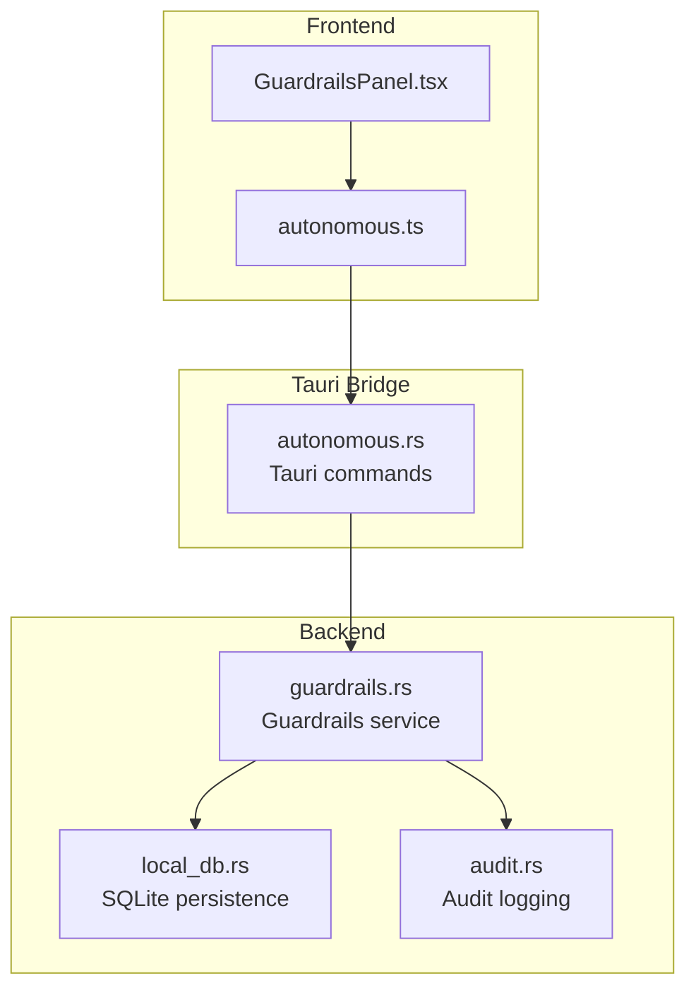
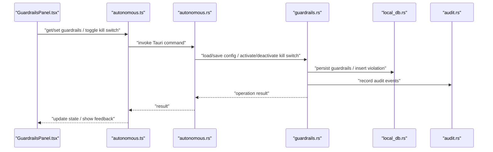
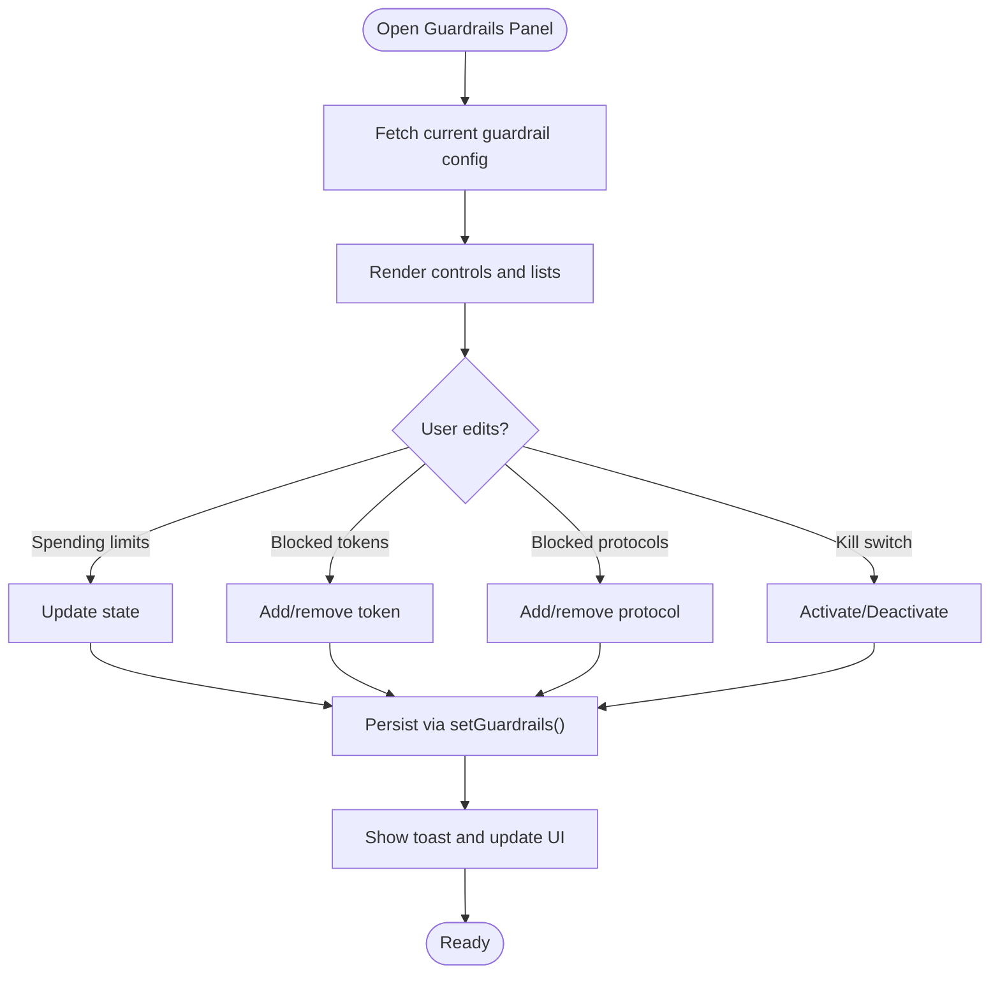
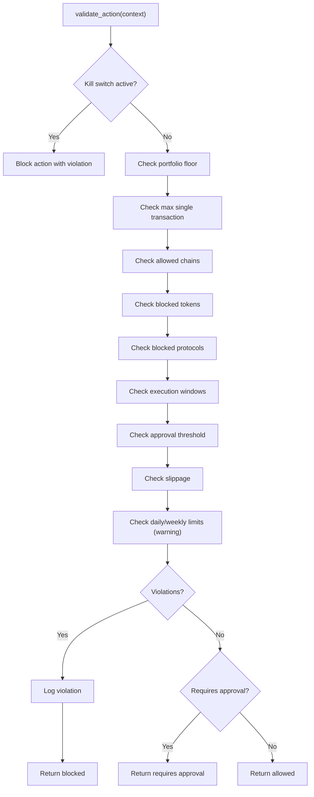
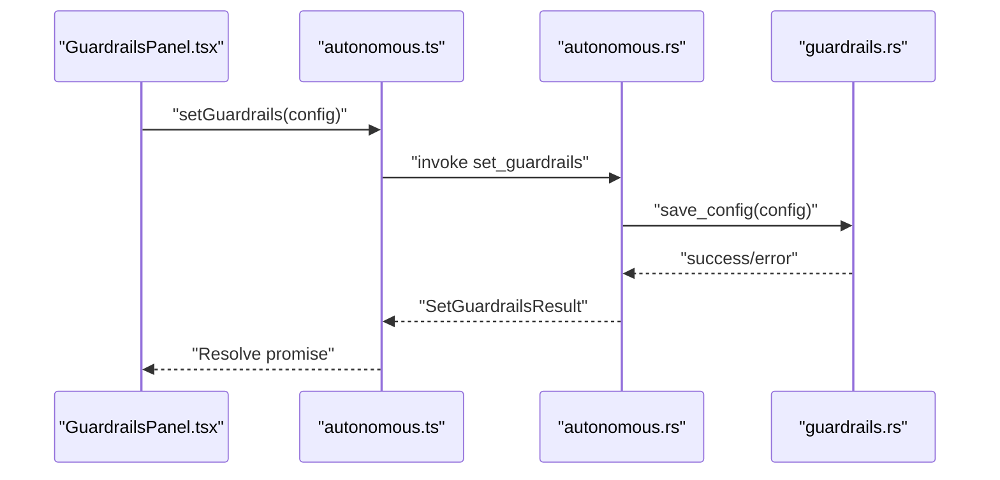
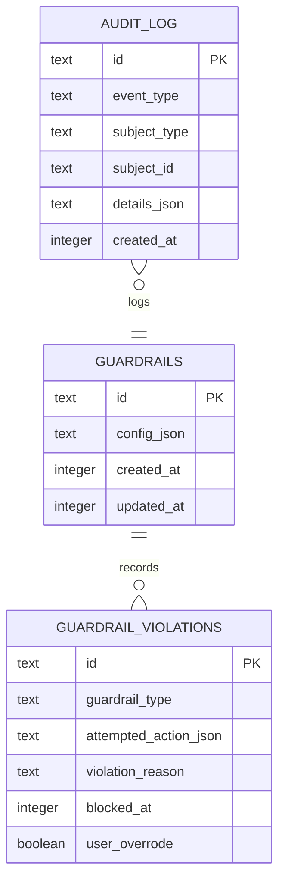
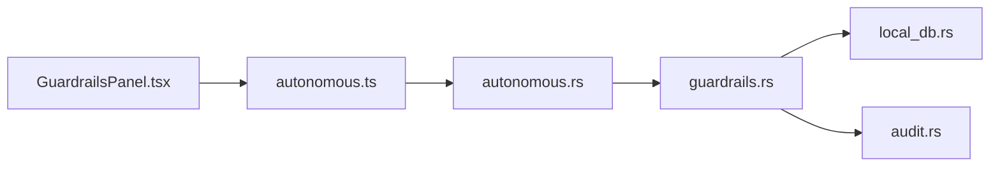

# Guardrails Enforcement

<cite>
**Referenced Files in This Document**
- [GuardrailsPanel.tsx](file://src/components/autonomous/GuardrailsPanel.tsx)
- [autonomous.ts](file://src/lib/autonomous.ts)
- [guardrails.rs](file://src-tauri/src/services/guardrails.rs)
- [local_db.rs](file://src-tauri/src/services/local_db.rs)
- [autonomous.rs](file://src-tauri/src/commands/autonomous.rs)
- [audit.rs](file://src-tauri/src/services/audit.rs)
- [autonomous.ts (types)](file://src/types/autonomous.ts)
</cite>

## Table of Contents
1. [Introduction](#introduction)
2. [Project Structure](#project-structure)
3. [Core Components](#core-components)
4. [Architecture Overview](#architecture-overview)
5. [Detailed Component Analysis](#detailed-component-analysis)
6. [Dependency Analysis](#dependency-analysis)
7. [Performance Considerations](#performance-considerations)
8. [Troubleshooting Guide](#troubleshooting-guide)
9. [Conclusion](#conclusion)
10. [Appendices](#appendices)

## Introduction
This document explains the Guardrails Enforcement system that protects autonomous operations by enforcing configurable risk controls. It focuses on the GuardrailsPanel component’s role in displaying and managing risk controls, the guardrails service architecture, risk assessment algorithms, and automated enforcement procedures. It also covers guardrail types, thresholds, violation handling, real-time monitoring, protective actions, customization, exception handling, overrides, risk policy management, compliance monitoring, and operational safety guidance.

## Project Structure
The Guardrails Enforcement system spans three layers:
- Frontend React component for user configuration and enforcement feedback
- Tauri commands bridging frontend to backend
- Backend Rust service implementing guardrail logic, persistence, and audit

**Diagram sources**
- [GuardrailsPanel.tsx:1-327](file://src/components/autonomous/GuardrailsPanel.tsx#L1-L327)
- [autonomous.ts:201-289](file://src/lib/autonomous.ts#L201-L289)
- [autonomous.rs:74-149](file://src-tauri/src/commands/autonomous.rs#L74-L149)
- [guardrails.rs:1-620](file://src-tauri/src/services/guardrails.rs#L1-L620)
- [local_db.rs:364-372](file://src-tauri/src/services/local_db.rs#L364-L372)
- [audit.rs:1-25](file://src-tauri/src/services/audit.rs#L1-L25)

**Section sources**
- [GuardrailsPanel.tsx:1-327](file://src/components/autonomous/GuardrailsPanel.tsx#L1-L327)
- [autonomous.ts:201-289](file://src/lib/autonomous.ts#L201-L289)
- [autonomous.rs:74-149](file://src-tauri/src/commands/autonomous.rs#L74-L149)
- [guardrails.rs:1-620](file://src-tauri/src/services/guardrails.rs#L1-L620)
- [local_db.rs:364-372](file://src-tauri/src/services/local_db.rs#L364-L372)
- [audit.rs:1-25](file://src-tauri/src/services/audit.rs#L1-L25)

## Core Components
- GuardrailsPanel: A React panel allowing users to configure spending limits, blocked tokens/protocols, slippage tolerance, and toggle the emergency kill switch. It persists changes via the guardrails API and reflects live enforcement outcomes.
- Guardrails service (Rust): Implements guardrail validation, global kill switch, and violation logging. It loads/stores configuration and records audit events.
- Tauri commands: Expose guardrails operations to the frontend (load/save configuration, activate/deactivate kill switch).
- Persistence and audit: Guardrails configuration and violations are persisted in SQLite; audit logs track guardrail updates and violations.

Key responsibilities:
- Enforce guardrails before autonomous actions
- Persist user-configured policies
- Log violations and maintain audit trail
- Provide real-time enforcement feedback to the UI

**Section sources**
- [GuardrailsPanel.tsx:19-327](file://src/components/autonomous/GuardrailsPanel.tsx#L19-L327)
- [guardrails.rs:182-230](file://src-tauri/src/services/guardrails.rs#L182-L230)
- [autonomous.rs:74-149](file://src-tauri/src/commands/autonomous.rs#L74-L149)
- [local_db.rs:2436-2494](file://src-tauri/src/services/local_db.rs#L2436-L2494)
- [audit.rs:5-24](file://src-tauri/src/services/audit.rs#L5-L24)

## Architecture Overview
The system enforces guardrails in a layered manner:
- UI triggers guardrail operations
- Frontend invokes Tauri commands
- Backend validates actions against guardrail configuration
- Violations are recorded and audit events are emitted

**Diagram sources**
- [GuardrailsPanel.tsx:31-71](file://src/components/autonomous/GuardrailsPanel.tsx#L31-L71)
- [autonomous.ts:201-289](file://src/lib/autonomous.ts#L201-L289)
- [autonomous.rs:74-149](file://src-tauri/src/commands/autonomous.rs#L74-L149)
- [guardrails.rs:182-230](file://src-tauri/src/services/guardrails.rs#L182-L230)
- [local_db.rs:2436-2494](file://src-tauri/src/services/local_db.rs#L2436-L2494)
- [audit.rs:5-24](file://src-tauri/src/services/audit.rs#L5-L24)

## Detailed Component Analysis

### GuardrailsPanel Component
Responsibilities:
- Fetch current guardrail configuration and render controls
- Allow editing of spending limits, slippage, blocked tokens, and blocked protocols
- Toggle emergency kill switch and persist changes
- Provide immediate feedback on save and kill-switch toggles

User-facing controls:
- Kill Switch: Immediate global block of autonomous actions
- Spending Limits: Portfolio floor, max single transaction, daily/weekly limits, and approval thresholds
- Slippage: Max slippage tolerance (basis points)
- Blocked Lists: Tokens and protocols

Operational flow:
- Loads configuration on mount
- Updates local state for immediate UI feedback
- Persists via frontend library functions
- Reflects enforcement outcomes (blocked vs. allowed) through backend validation

**Diagram sources**
- [GuardrailsPanel.tsx:31-71](file://src/components/autonomous/GuardrailsPanel.tsx#L31-L71)
- [autonomous.ts:241-265](file://src/lib/autonomous.ts#L241-L265)

**Section sources**
- [GuardrailsPanel.tsx:19-327](file://src/components/autonomous/GuardrailsPanel.tsx#L19-L327)
- [autonomous.ts:201-289](file://src/lib/autonomous.ts#L201-L289)

### Guardrails Service (Backend)
Responsibilities:
- Load and save guardrail configuration from persistent storage
- Validate proposed actions against guardrails
- Enforce emergency kill switch globally
- Log violations and emit audit events

Guardrail categories enforced:
- Emergency kill switch
- Portfolio floor
- Max single transaction
- Allowed chains
- Blocked tokens
- Blocked protocols
- Execution time windows
- Approval threshold
- Slippage tolerance
- Daily/weekly spend limits (warning for now)

Validation outcome:
- Allowed, blocked, or requires approval
- Violations recorded with guardrail type, reason, and limits

**Diagram sources**
- [guardrails.rs:277-426](file://src-tauri/src/services/guardrails.rs#L277-L426)
- [guardrails.rs:484-519](file://src-tauri/src/services/guardrails.rs#L484-L519)

**Section sources**
- [guardrails.rs:182-230](file://src-tauri/src/services/guardrails.rs#L182-L230)
- [guardrails.rs:277-426](file://src-tauri/src/services/guardrails.rs#L277-L426)
- [guardrails.rs:484-519](file://src-tauri/src/services/guardrails.rs#L484-L519)

### Tauri Commands and Frontend Bridge
- Commands expose guardrail operations to the frontend:
  - get_guardrails, set_guardrails
  - activate_kill_switch, deactivate_kill_switch
- Frontend library functions wrap Tauri invocations and normalize types

**Diagram sources**
- [autonomous.ts:241-265](file://src/lib/autonomous.ts#L241-L265)
- [autonomous.rs:96-109](file://src-tauri/src/commands/autonomous.rs#L96-L109)
- [guardrails.rs:206-230](file://src-tauri/src/services/guardrails.rs#L206-L230)

**Section sources**
- [autonomous.ts:201-289](file://src/lib/autonomous.ts#L201-L289)
- [autonomous.rs:74-149](file://src-tauri/src/commands/autonomous.rs#L74-L149)

### Persistence and Audit
- Guardrails configuration is stored in a dedicated table and loaded on demand
- Violations are logged with attempted action context and reasons
- Audit events capture guardrail updates and kill switch activations

**Diagram sources**
- [local_db.rs:364-372](file://src-tauri/src/services/local_db.rs#L364-L372)
- [local_db.rs:2436-2494](file://src-tauri/src/services/local_db.rs#L2436-L2494)
- [local_db.rs:2500-2515](file://src-tauri/src/services/local_db.rs#L2500-L2515)
- [audit.rs:5-24](file://src-tauri/src/services/audit.rs#L5-L24)

**Section sources**
- [local_db.rs:364-372](file://src-tauri/src/services/local_db.rs#L364-L372)
- [local_db.rs:2436-2494](file://src-tauri/src/services/local_db.rs#L2436-L2494)
- [local_db.rs:2500-2515](file://src-tauri/src/services/local_db.rs#L2500-L2515)
- [audit.rs:5-24](file://src-tauri/src/services/audit.rs#L5-L24)

## Dependency Analysis
- Frontend depends on Tauri commands for guardrail operations
- Backend guardrails service depends on local database for persistence and audit service for logging
- GuardrailsPanel depends on frontend library functions and UI primitives

**Diagram sources**
- [GuardrailsPanel.tsx:1-10](file://src/components/autonomous/GuardrailsPanel.tsx#L1-L10)
- [autonomous.ts:1-15](file://src/lib/autonomous.ts#L1-L15)
- [autonomous.rs:8-11](file://src-tauri/src/commands/autonomous.rs#L8-L11)
- [guardrails.rs:1-15](file://src-tauri/src/services/guardrails.rs#L1-L15)
- [local_db.rs:1-10](file://src-tauri/src/services/local_db.rs#L1-L10)
- [audit.rs:1-5](file://src-tauri/src/services/audit.rs#L1-L5)

**Section sources**
- [GuardrailsPanel.tsx:1-10](file://src/components/autonomous/GuardrailsPanel.tsx#L1-L10)
- [autonomous.ts:1-15](file://src/lib/autonomous.ts#L1-L15)
- [autonomous.rs:8-11](file://src-tauri/src/commands/autonomous.rs#L8-L11)
- [guardrails.rs:1-15](file://src-tauri/src/services/guardrails.rs#L1-L15)
- [local_db.rs:1-10](file://src-tauri/src/services/local_db.rs#L1-L10)
- [audit.rs:1-5](file://src-tauri/src/services/audit.rs#L1-L5)

## Performance Considerations
- Guardrail checks are lightweight and synchronous; keep guardrail sets minimal to avoid unnecessary filtering overhead
- Use blocked lists judiciously; large token/protocol lists increase linear scan costs
- Slippage checks are informational for now; tighten thresholds only when necessary to avoid transaction failures
- Audit and violation logging are infrequent and bounded; ensure database writes are batched if extended to frequent operations

## Troubleshooting Guide
Common scenarios and resolutions:
- Actions blocked unexpectedly
  - Verify emergency kill switch state
  - Review spending limits and approval thresholds
  - Confirm blocked tokens/protocols and allowed chains
- Save fails
  - Inspect returned error messages from set_guardrails
  - Validate numeric inputs and list entries
- Kill switch toggle does nothing
  - Confirm backend activation/deactivation succeeded
  - Check audit logs for guardrail updates
- Violations not appearing
  - Ensure backend validation is invoked before execution
  - Verify database insertion of violations

Operational checks:
- Use frontend toast notifications for immediate feedback
- Inspect audit logs for guardrail-related events
- Confirm guardrail configuration persistence in the database

**Section sources**
- [autonomous.ts:241-265](file://src/lib/autonomous.ts#L241-L265)
- [guardrails.rs:237-275](file://src-tauri/src/services/guardrails.rs#L237-L275)
- [local_db.rs:2500-2515](file://src-tauri/src/services/local_db.rs#L2500-L2515)
- [audit.rs:5-24](file://src-tauri/src/services/audit.rs#L5-L24)

## Conclusion
The Guardrails Enforcement system provides robust, user-configurable safety controls for autonomous operations. The GuardrailsPanel offers intuitive configuration, while the backend guardrails service enforces policies consistently, logs violations, and maintains audit trails. Together, they enable real-time risk monitoring, protective actions, and compliance-aware operation.

## Appendices

### Guardrail Types and Thresholds
- Emergency kill switch: Global block toggle
- Portfolio floor: Minimum portfolio value post-action
- Max single transaction: Maximum USD value per transaction
- Allowed chains: Whitelist of supported chains
- Blocked tokens: Blacklisted token addresses/symbols
- Blocked protocols: Blacklisted protocol names/addresses
- Execution time windows: Restrict action timing
- Require approval above: Threshold requiring manual approval
- Max slippage: Basis points tolerance
- Daily/Weekly spend limits: Spend caps (tracking not yet implemented)

**Section sources**
- [guardrails.rs:42-85](file://src-tauri/src/services/guardrails.rs#L42-L85)
- [autonomous.ts (types):50-68](file://src/types/autonomous.ts#L50-L68)

### Violation Handling Protocols
- Validation returns allowed/blocked/requires approval
- Blocked actions log violations with guardrail type and reason
- Audit events record guardrail updates and kill switch changes
- Override capability is reserved for future extension

**Section sources**
- [guardrails.rs:121-180](file://src-tauri/src/services/guardrails.rs#L121-L180)
- [guardrails.rs:484-519](file://src-tauri/src/services/guardrails.rs#L484-L519)
- [audit.rs:5-24](file://src-tauri/src/services/audit.rs#L5-L24)

### Real-Time Risk Monitoring and Protective Actions
- Real-time checks occur before action execution
- Immediate blocking or approval requirement based on thresholds
- Violations and approvals are audited for compliance

**Section sources**
- [guardrails.rs:277-426](file://src-tauri/src/services/guardrails.rs#L277-L426)
- [audit.rs:5-24](file://src-tauri/src/services/audit.rs#L5-L24)

### Guardrail Customization and Policy Management
- Users customize guardrails via the panel
- Policies are persisted and applied immediately
- Compliance monitoring via audit logs and violation records

**Section sources**
- [GuardrailsPanel.tsx:73-109](file://src/components/autonomous/GuardrailsPanel.tsx#L73-L109)
- [autonomous.ts:241-265](file://src/lib/autonomous.ts#L241-L265)
- [local_db.rs:2436-2494](file://src-tauri/src/services/local_db.rs#L2436-L2494)

### Exception Handling and Override Procedures
- Exceptions are surfaced as violations or approval requirements
- Overrides are designed for future extension; currently logged as audit events

**Section sources**
- [guardrails.rs:521-538](file://src-tauri/src/services/guardrails.rs#L521-L538)
- [audit.rs:5-24](file://src-tauri/src/services/audit.rs#L5-L24)

### Regulatory Adherence and Compliance Monitoring
- Audit logs capture guardrail updates and violations
- Use violation history and audit trails for compliance reporting

**Section sources**
- [audit.rs:5-24](file://src-tauri/src/services/audit.rs#L5-L24)
- [local_db.rs:2500-2515](file://src-tauri/src/services/local_db.rs#L2500-L2515)

### Guidance for Configuring Guardrails and Maintaining Safety Standards
- Start with conservative thresholds (e.g., higher slippage tolerance, lower max single transaction)
- Use blocked lists to exclude high-risk assets or protocols
- Enable kill switch during testing or risky market conditions
- Monitor violations and adjust policies iteratively
- Maintain audit logs for oversight and compliance

**Section sources**
- [GuardrailsPanel.tsx:12-17](file://src/components/autonomous/GuardrailsPanel.tsx#L12-L17)
- [guardrails.rs:277-426](file://src-tauri/src/services/guardrails.rs#L277-L426)