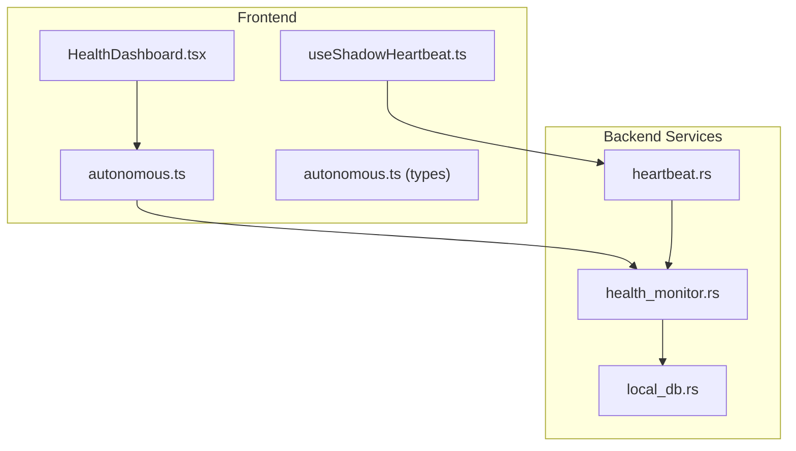
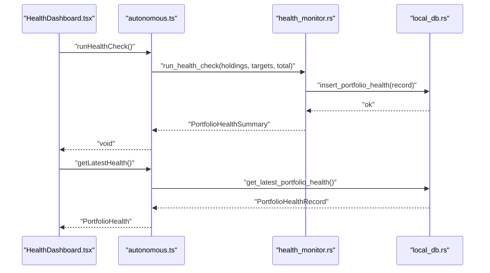
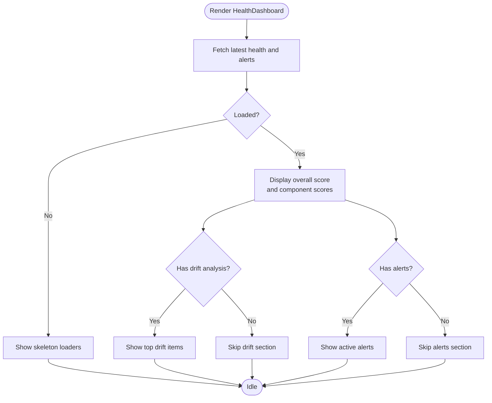
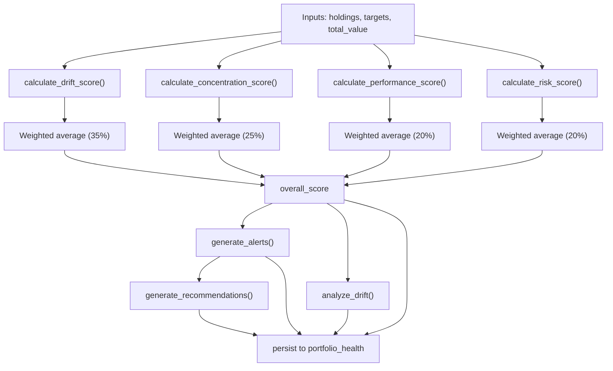
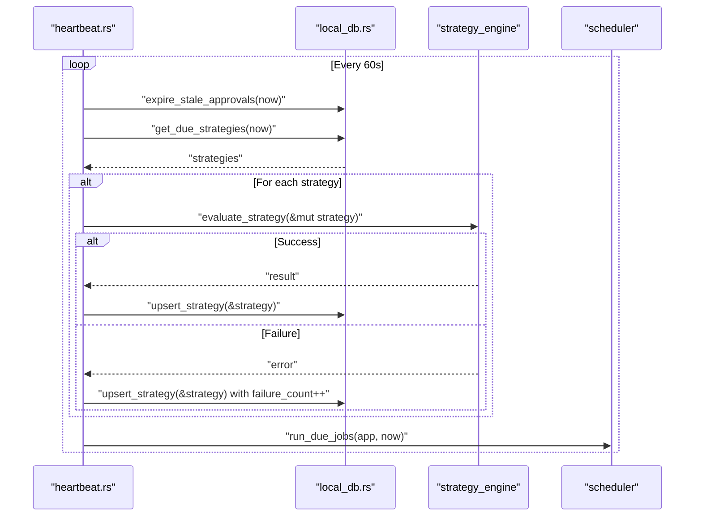
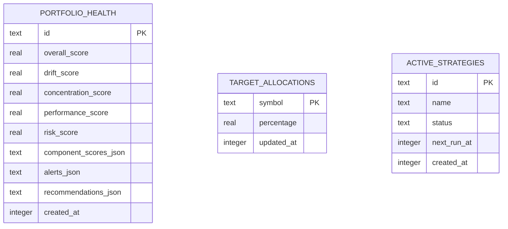
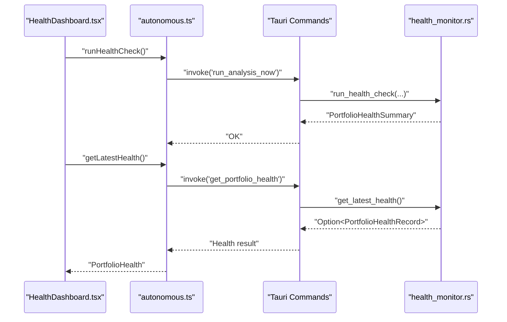
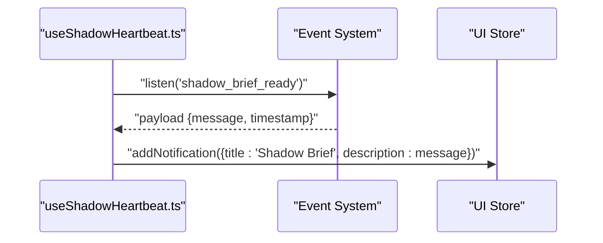
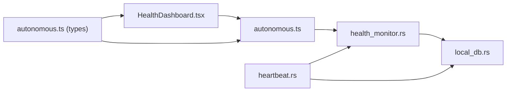

# Health Monitoring System

<cite>
**Referenced Files in This Document**
- [HealthDashboard.tsx](file://src/components/autonomous/HealthDashboard.tsx)
- [autonomous.ts](file://src/lib/autonomous.ts)
- [health_monitor.rs](file://src-tauri/src/services/health_monitor.rs)
- [heartbeat.rs](file://src-tauri/src/services/heartbeat.rs)
- [local_db.rs](file://src-tauri/src/services/local_db.rs)
- [autonomous.ts (types)](file://src/types/autonomous.ts)
- [useShadowHeartbeat.ts](file://src/hooks/useShadowHeartbeat.ts)
- [AutonomousDashboard.tsx](file://src/components/autonomous/AutonomousDashboard.tsx)
</cite>

## Table of Contents
1. [Introduction](#introduction)
2. [Project Structure](#project-structure)
3. [Core Components](#core-components)
4. [Architecture Overview](#architecture-overview)
5. [Detailed Component Analysis](#detailed-component-analysis)
6. [Dependency Analysis](#dependency-analysis)
7. [Performance Considerations](#performance-considerations)
8. [Troubleshooting Guide](#troubleshooting-guide)
9. [Conclusion](#conclusion)

## Introduction
This document explains the Health Monitoring System that powers autonomous operation system surveillance and wellness tracking. It focuses on the HealthDashboard component, the health monitoring service architecture, heartbeat mechanisms, and system status collection. It also documents health check procedures, alert thresholds, automated response triggers, performance metrics, resource utilization tracking, anomaly detection, and the relationship between health monitoring and system reliability, fault tolerance, and automatic recovery. Guidance is provided for interpreting health indicators, responding to alerts, and maintaining optimal system performance.

## Project Structure
The Health Monitoring System spans both the frontend React components and the Tauri backend services:
- Frontend: HealthDashboard displays system health metrics, status indicators, and operational telemetry.
- Backend: Rust services compute health scores, detect anomalies, persist records, and coordinate periodic checks via heartbeat.

**Diagram sources**
- [HealthDashboard.tsx:1-199](file://src/components/autonomous/HealthDashboard.tsx#L1-L199)
- [autonomous.ts:291-367](file://src/lib/autonomous.ts#L291-L367)
- [health_monitor.rs:106-221](file://src-tauri/src/services/health_monitor.rs#L106-L221)
- [heartbeat.rs:10-75](file://src-tauri/src/services/heartbeat.rs#L10-L75)
- [local_db.rs:348-362](file://src-tauri/src/services/local_db.rs#L348-L362)
- [useShadowHeartbeat.ts:11-40](file://src/hooks/useShadowHeartbeat.ts#L11-L40)

**Section sources**
- [HealthDashboard.tsx:1-199](file://src/components/autonomous/HealthDashboard.tsx#L1-L199)
- [autonomous.ts:291-367](file://src/lib/autonomous.ts#L291-L367)
- [health_monitor.rs:106-221](file://src-tauri/src/services/health_monitor.rs#L106-L221)
- [heartbeat.rs:10-75](file://src-tauri/src/services/heartbeat.rs#L10-L75)
- [local_db.rs:348-362](file://src-tauri/src/services/local_db.rs#L348-L362)
- [useShadowHeartbeat.ts:11-40](file://src/hooks/useShadowHeartbeat.ts#L11-L40)

## Core Components
- HealthDashboard: Renders overall score, component scores (drift, concentration, performance, risk), allocation drift details, and active alerts. Provides a manual health check trigger and toast notifications.
- Health Monitoring Service: Computes drift, concentration, performance, and risk scores; generates alerts and recommendations; persists health records; exposes latest health retrieval.
- Heartbeat Mechanism: Periodic orchestration that evaluates strategies, expires stale approvals, and coordinates scheduled jobs.
- Data Persistence: SQLite-backed storage for health records, target allocations, strategies, and related audit trails.
- Types: Shared TypeScript interfaces define health metrics, alerts, drift analysis, and orchestrator state.

**Section sources**
- [HealthDashboard.tsx:26-176](file://src/components/autonomous/HealthDashboard.tsx#L26-L176)
- [health_monitor.rs:106-221](file://src-tauri/src/services/health_monitor.rs#L106-L221)
- [heartbeat.rs:10-75](file://src-tauri/src/services/heartbeat.rs#L10-L75)
- [local_db.rs:348-362](file://src-tauri/src/services/local_db.rs#L348-L362)
- [autonomous.ts (types):70-103](file://src/types/autonomous.ts#L70-L103)

## Architecture Overview
The system follows a layered architecture:
- UI Layer: HealthDashboard renders health metrics and triggers health checks.
- API Layer: autonomous.ts bridges UI and backend via Tauri invocations.
- Service Layer: health_monitor.rs computes health metrics and persists results.
- Storage Layer: local_db.rs manages SQLite tables for health and related data.
- Orchestration Layer: heartbeat.rs runs periodic tasks and strategy evaluations.

**Diagram sources**
- [HealthDashboard.tsx:49-60](file://src/components/autonomous/HealthDashboard.tsx#L49-L60)
- [autonomous.ts:333-335](file://src/lib/autonomous.ts#L333-L335)
- [health_monitor.rs:106-221](file://src-tauri/src/services/health_monitor.rs#L106-L221)
- [local_db.rs:2380-2403](file://src-tauri/src/services/local_db.rs#L2380-L2403)

## Detailed Component Analysis

### HealthDashboard Component
Responsibilities:
- Fetches latest health and alerts concurrently.
- Displays overall score with color-coded gradient and relative update time.
- Renders component scores with progress bars and descriptions.
- Shows allocation drift details with direction and percentages.
- Lists active alerts with severity and recommended actions.
- Provides a manual health check button with loading state and toast feedback.

Key behaviors:
- Uses concurrent fetching to minimize latency.
- Parses drift JSON safely and falls back to empty array on parse error.
- Maps numeric scores to color classes for quick visual assessment.

**Diagram sources**
- [HealthDashboard.tsx:33-176](file://src/components/autonomous/HealthDashboard.tsx#L33-L176)

**Section sources**
- [HealthDashboard.tsx:26-176](file://src/components/autonomous/HealthDashboard.tsx#L26-L176)

### Health Monitoring Service
Responsibilities:
- Computes component scores: drift, concentration, performance, risk.
- Generates health alerts based on thresholds.
- Produces drift analysis per asset with suggested actions.
- Persists health summaries to SQLite.
- Emits audit logs for health checks.

Core algorithms:
- Drift Score: Average absolute deviation from target allocations, normalized to 0–100.
- Concentration Score: Based on Herfindahl-Hirschman Index (HHI) and penalties for large single positions.
- Risk Score: Penalizes non-stablecoin exposure and chain concentration.
- Overall Score: Weighted average of component scores.

Alert thresholds:
- Drift Exceeded: below 50.
- High Concentration Risk: below 50.
- Large Holding: positions above 50% (non-stablecoin).
- High Portfolio Risk: below 40.

Recommendations:
- Derived from alerts and significant drift magnitudes (>10%), deduplicated.

**Diagram sources**
- [health_monitor.rs:106-221](file://src-tauri/src/services/health_monitor.rs#L106-L221)
- [health_monitor.rs:224-260](file://src-tauri/src/services/health_monitor.rs#L224-L260)
- [health_monitor.rs:262-296](file://src-tauri/src/services/health_monitor.rs#L262-L296)
- [health_monitor.rs:298-303](file://src-tauri/src/services/health_monitor.rs#L298-L303)
- [health_monitor.rs:305-347](file://src-tauri/src/services/health_monitor.rs#L305-L347)
- [health_monitor.rs:349-427](file://src-tauri/src/services/health_monitor.rs#L349-L427)
- [health_monitor.rs:429-477](file://src-tauri/src/services/health_monitor.rs#L429-L477)
- [health_monitor.rs:479-507](file://src-tauri/src/services/health_monitor.rs#L479-L507)

**Section sources**
- [health_monitor.rs:106-221](file://src-tauri/src/services/health_monitor.rs#L106-L221)
- [health_monitor.rs:349-427](file://src-tauri/src/services/health_monitor.rs#L349-L427)

### Heartbeat Mechanism
Responsibilities:
- Runs every 60 seconds.
- Expires stale approvals.
- Loads due strategies and evaluates them; auto-pauses after consecutive failures.
- Upserts strategy state and audits failures.
- Executes scheduler jobs.

**Diagram sources**
- [heartbeat.rs:10-75](file://src-tauri/src/services/heartbeat.rs#L10-L75)

**Section sources**
- [heartbeat.rs:10-75](file://src-tauri/src/services/heartbeat.rs#L10-L75)

### Data Models and Persistence
Health records are persisted in the portfolio_health table with component scores, alerts, and recommendations serialized as JSON. Target allocations are stored separately for drift calculations.

**Diagram sources**
- [local_db.rs:348-362](file://src-tauri/src/services/local_db.rs#L348-L362)
- [local_db.rs:74-78](file://src-tauri/src/services/local_db.rs#L74-L78)
- [local_db.rs:80-106](file://src-tauri/src/services/local_db.rs#L80-L106)

**Section sources**
- [local_db.rs:348-362](file://src-tauri/src/services/local_db.rs#L348-L362)
- [local_db.rs:74-78](file://src-tauri/src/services/local_db.rs#L74-L78)
- [local_db.rs:80-106](file://src-tauri/src/services/local_db.rs#L80-L106)

### API and Frontend Integration
The frontend invokes Tauri commands to run health checks and retrieve health data. The API layer translates backend results into frontend-friendly types.

**Diagram sources**
- [HealthDashboard.tsx:49-60](file://src/components/autonomous/HealthDashboard.tsx#L49-L60)
- [autonomous.ts:333-335](file://src/lib/autonomous.ts#L333-L335)
- [autonomous.ts:292-331](file://src/lib/autonomous.ts#L292-L331)
- [health_monitor.rs:106-221](file://src-tauri/src/services/health_monitor.rs#L106-L221)
- [health_monitor.rs:509-513](file://src-tauri/src/services/health_monitor.rs#L509-L513)

**Section sources**
- [autonomous.ts:292-331](file://src/lib/autonomous.ts#L292-L331)
- [autonomous.ts:333-335](file://src/lib/autonomous.ts#L333-L335)

### Heartbeat Notifications
The useShadowHeartbeat hook listens for a shadow brief event and surfaces it as a UI notification, keeping operators informed of system status updates.

**Diagram sources**
- [useShadowHeartbeat.ts:21-29](file://src/hooks/useShadowHeartbeat.ts#L21-L29)

**Section sources**
- [useShadowHeartbeat.ts:11-40](file://src/hooks/useShadowHeartbeat.ts#L11-L40)

## Dependency Analysis
- HealthDashboard depends on autonomous.ts for health data and actions.
- autonomous.ts depends on Tauri commands that delegate to health_monitor.rs.
- health_monitor.rs persists results to local_db.rs and emits audit events.
- heartbeat.rs orchestrates periodic tasks and interacts with strategies and scheduler.
- Types in autonomous.ts (types) unify frontend and backend representations.

**Diagram sources**
- [HealthDashboard.tsx:4-11](file://src/components/autonomous/HealthDashboard.tsx#L4-L11)
- [autonomous.ts:1-15](file://src/lib/autonomous.ts#L1-L15)
- [health_monitor.rs:10-11](file://src-tauri/src/services/health_monitor.rs#L10-L11)
- [local_db.rs:348-362](file://src-tauri/src/services/local_db.rs#L348-L362)
- [heartbeat.rs:10-75](file://src-tauri/src/services/heartbeat.rs#L10-L75)
- [autonomous.ts (types):1-137](file://src/types/autonomous.ts#L1-L137)

**Section sources**
- [HealthDashboard.tsx:4-11](file://src/components/autonomous/HealthDashboard.tsx#L4-L11)
- [autonomous.ts:1-15](file://src/lib/autonomous.ts#L1-L15)
- [health_monitor.rs:10-11](file://src-tauri/src/services/health_monitor.rs#L10-L11)
- [local_db.rs:348-362](file://src-tauri/src/services/local_db.rs#L348-L362)
- [heartbeat.rs:10-75](file://src-tauri/src/services/heartbeat.rs#L10-L75)
- [autonomous.ts (types):1-137](file://src/types/autonomous.ts#L1-L137)

## Performance Considerations
- Concurrency: HealthDashboard fetches health and alerts concurrently to reduce perceived latency.
- Lightweight computations: Health metrics are computed synchronously in Rust; keep input sizes reasonable to avoid heavy scans.
- Persistence overhead: Health summaries are persisted on each check; ensure SQLite writes are not blocking UI rendering.
- Heartbeat cadence: 60-second intervals balance responsiveness with system load; adjust based on workload.
- JSON parsing: Safe parsing with fallback prevents crashes on malformed drift JSON.

[No sources needed since this section provides general guidance]

## Troubleshooting Guide
Common issues and resolutions:
- No health data available: Trigger a manual health check from the dashboard; confirm Tauri runtime availability.
- Health check fails: Inspect backend logs for errors during run_health_check; verify database connectivity.
- Alerts not appearing: Confirm get_health_alerts invocation succeeds and alerts are present in the latest health record.
- Stale data: Ensure heartbeat is running and strategies are being evaluated; check failure counts and auto-pause conditions.
- Drift analysis missing: Verify driftJson parsing and that the backend populated drift_analysis.

Operational checks:
- Confirm get_latest_health returns a record; otherwise, initiate a new health check.
- Review audit logs for health_check_completed entries.
- Validate target allocations exist for drift calculations.

**Section sources**
- [HealthDashboard.tsx:33-60](file://src/components/autonomous/HealthDashboard.tsx#L33-L60)
- [autonomous.ts:337-367](file://src/lib/autonomous.ts#L337-L367)
- [health_monitor.rs:509-513](file://src-tauri/src/services/health_monitor.rs#L509-L513)

## Conclusion
The Health Monitoring System integrates a responsive frontend dashboard with robust backend analytics and persistence. HealthDashboard provides actionable insights through score visualization, drift analysis, and alerts, while the health monitoring service enforces clear thresholds and recommendations. The heartbeat mechanism ensures continuous orchestration and fault tolerance, and SQLite-backed persistence supports reliable auditing and historical tracking. Together, these components enable autonomous operation with strong reliability, transparency, and maintainability.