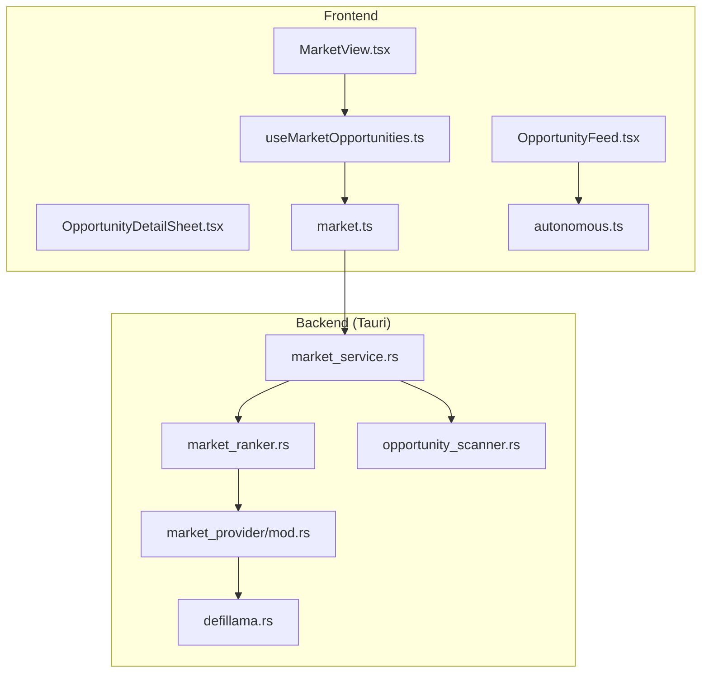
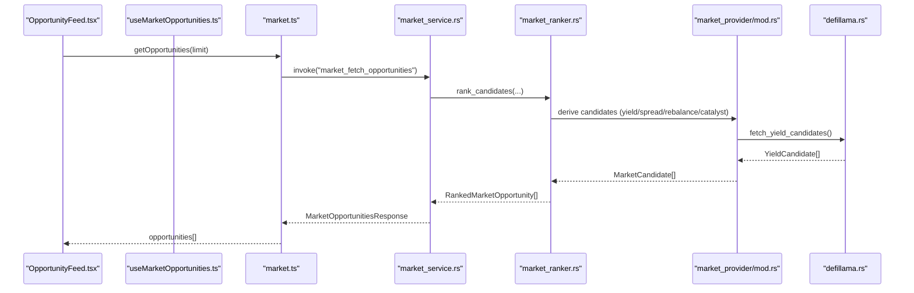
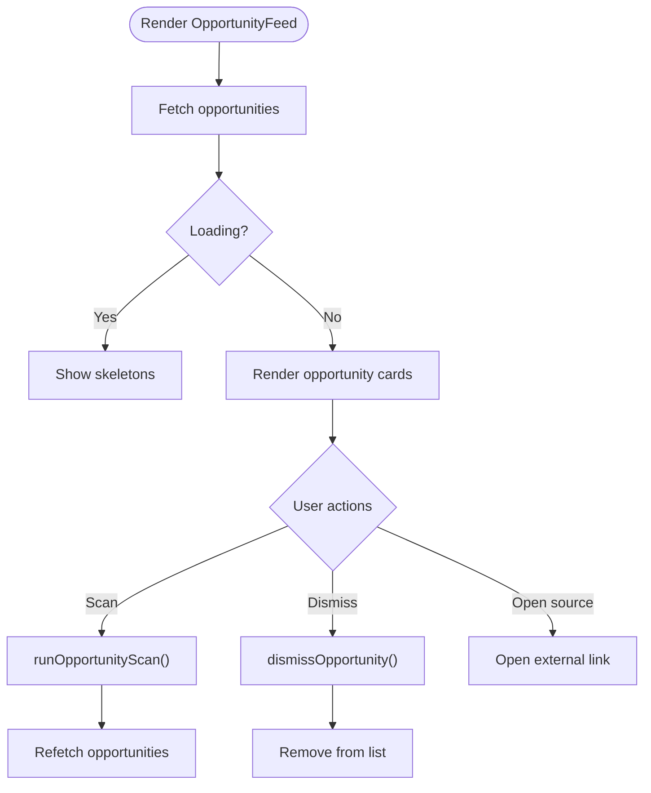
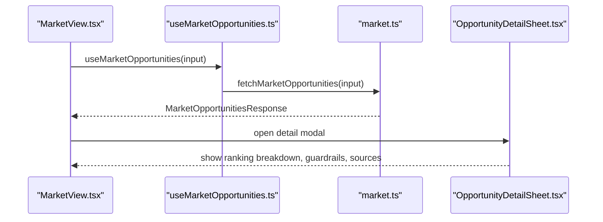
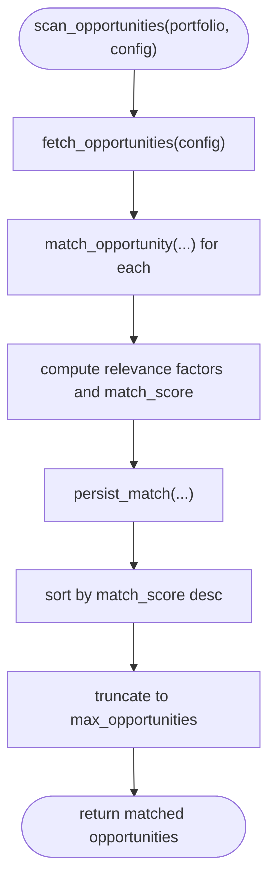
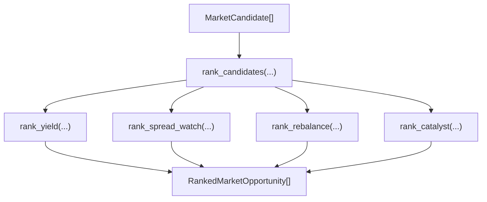
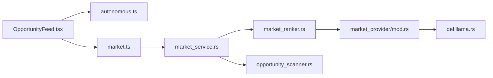

# Opportunity Feed

<cite>
**Referenced Files in This Document**
- [OpportunityFeed.tsx](file://src/components/autonomous/OpportunityFeed.tsx)
- [useMarketOpportunities.ts](file://src/hooks/useMarketOpportunities.ts)
- [market.ts](file://src/lib/market.ts)
- [market.ts](file://src/types/market.ts)
- [autonomous.ts](file://src/lib/autonomous.ts)
- [autonomous.ts](file://src/types/autonomous.ts)
- [opportunity_scanner.rs](file://src-tauri/src/services/opportunity_scanner.rs)
- [market_service.rs](file://src-tauri/src/services/market_service.rs)
- [market_ranker.rs](file://src-tauri/src/services/market_ranker.rs)
- [mod.rs](file://src-tauri/src/services/market_provider/mod.rs)
- [defillama.rs](file://src-tauri/src/services/market_provider/defillama.rs)
- [OpportunityDetailSheet.tsx](file://src/components/market/OpportunityDetailSheet.tsx)
- [MarketView.tsx](file://src/components/market/MarketView.tsx)
- [strategy.ts](file://src/lib/strategy.ts)
</cite>

## Table of Contents
1. [Introduction](#introduction)
2. [Project Structure](#project-structure)
3. [Core Components](#core-components)
4. [Architecture Overview](#architecture-overview)
5. [Detailed Component Analysis](#detailed-component-analysis)
6. [Dependency Analysis](#dependency-analysis)
7. [Performance Considerations](#performance-considerations)
8. [Troubleshooting Guide](#troubleshooting-guide)
9. [Conclusion](#conclusion)
10. [Appendices](#appendices)

## Introduction
This document explains the Opportunity Feed system for DeFi opportunity discovery and real-time market intelligence. It covers how opportunities are presented, filtered, evaluated, and ranked; how the scanning and ranking services integrate market data; and how the system relates to autonomous execution decisions and guardrails. It also documents feed customization, notifications, validation, and execution recommendations, along with guidance for configuring feeds and optimizing discovery performance.

## Project Structure
The Opportunity Feed spans both the frontend and backend:

- Frontend:
  - OpportunityFeed UI component renders personalized opportunities.
  - Market view and detail sheet render market opportunities and their details.
  - Hooks and libraries manage fetching, caching, and action preparation.
- Backend (Tauri/Rust):
  - Market service orchestrates data refresh and emits updates.
  - Market ranker computes per-opportunity scores and actionability.
  - Market provider integrates external data (e.g., DeFiLlama).
  - Opportunity scanner matches generic opportunities to user profiles and preferences.

**Diagram sources**
- [OpportunityFeed.tsx:39-160](file://src/components/autonomous/OpportunityFeed.tsx#L39-L160)
- [MarketView.tsx:199-266](file://src/components/market/MarketView.tsx#L199-L266)
- [OpportunityDetailSheet.tsx:11-110](file://src/components/market/OpportunityDetailSheet.tsx#L11-L110)
- [useMarketOpportunities.ts:27-131](file://src/hooks/useMarketOpportunities.ts#L27-L131)
- [market.ts:16-135](file://src/lib/market.ts#L16-L135)
- [market_service.rs:189-218](file://src-tauri/src/services/market_service.rs#L189-L218)
- [market_ranker.rs:17-559](file://src-tauri/src/services/market_ranker.rs#L17-L559)
- [mod.rs:1-160](file://src-tauri/src/services/market_provider/mod.rs#L1-L160)
- [defillama.rs:27-116](file://src-tauri/src/services/market_provider/defillama.rs#L27-L116)
- [opportunity_scanner.rs:125-161](file://src-tauri/src/services/opportunity_scanner.rs#L125-L161)

**Section sources**
- [OpportunityFeed.tsx:39-160](file://src/components/autonomous/OpportunityFeed.tsx#L39-L160)
- [market.ts:16-135](file://src/lib/market.ts#L16-L135)
- [market_service.rs:189-218](file://src-tauri/src/services/market_service.rs#L189-L218)

## Core Components
- OpportunityFeed (frontend): Renders matched opportunities with risk, APY, chain, protocol, and match score; supports scanning and dismissal.
- Market service (backend): Aggregates, ranks, and persists opportunities; emits updates; supports refresh and filtering.
- Market ranker (backend): Computes global/personal/actionability scores and risk labels.
- Market provider (backend): Integrates external data (e.g., DeFiLlama yield pools).
- Opportunity scanner (backend): Matches generic opportunities to user preferences and portfolio context.
- Hooks and libraries: Frontend utilities to fetch, refresh, and prepare actions for opportunities.

**Section sources**
- [OpportunityFeed.tsx:39-160](file://src/components/autonomous/OpportunityFeed.tsx#L39-L160)
- [market_service.rs:220-261](file://src-tauri/src/services/market_service.rs#L220-L261)
- [market_ranker.rs:17-559](file://src-tauri/src/services/market_ranker.rs#L17-L559)
- [opportunity_scanner.rs:125-161](file://src-tauri/src/services/opportunity_scanner.rs#L125-L161)
- [useMarketOpportunities.ts:27-131](file://src/hooks/useMarketOpportunities.ts#L27-L131)
- [market.ts:16-135](file://src/lib/market.ts#L16-L135)

## Architecture Overview
The system integrates external market data, ranks opportunities, and surfaces them to users with actionable insights and guardrails-aware recommendations.

**Diagram sources**
- [OpportunityFeed.tsx:46-55](file://src/components/autonomous/OpportunityFeed.tsx#L46-L55)
- [market.ts:16-28](file://src/lib/market.ts#L16-L28)
- [market_service.rs:220-261](file://src-tauri/src/services/market_service.rs#L220-L261)
- [market_ranker.rs:17-559](file://src-tauri/src/services/market_ranker.rs#L17-L559)
- [mod.rs:84-143](file://src-tauri/src/services/market_provider/mod.rs#L84-L143)
- [defillama.rs:27-116](file://src-tauri/src/services/market_provider/defillama.rs#L27-L116)

## Detailed Component Analysis

### OpportunityFeed Component
Purpose:
- Present matched opportunities with risk, APY, chain, protocol, and match score.
- Allow users to scan for new opportunities and dismiss unwanted ones.
- Provide quick links to source URLs and dismissal.

Key behaviors:
- Fetches opportunities via a library function and displays skeleton loaders while loading.
- Renders risk badges and match percentages.
- Supports scanning and dismissal with toast feedback.
- Shows deadlines and match reasons.

**Diagram sources**
- [OpportunityFeed.tsx:39-160](file://src/components/autonomous/OpportunityFeed.tsx#L39-L160)
- [autonomous.ts:370-422](file://src/lib/autonomous.ts#L370-L422)

**Section sources**
- [OpportunityFeed.tsx:39-160](file://src/components/autonomous/OpportunityFeed.tsx#L39-L160)
- [autonomous.ts:370-422](file://src/lib/autonomous.ts#L370-L422)

### Market View and Detail Sheet
Purpose:
- Display market opportunities with category, chain, actionability, and metrics.
- Show detailed breakdowns including ranking reasons, guardrails notes, and sources.

Key behaviors:
- Filters and sorts opportunities by category, chain, and freshness.
- Emits events to refresh the feed and handles loading states.
- Opens a detail sheet with guardrail notes and execution readiness.

**Diagram sources**
- [MarketView.tsx:199-266](file://src/components/market/MarketView.tsx#L199-L266)
- [useMarketOpportunities.ts:27-131](file://src/hooks/useMarketOpportunities.ts#L27-L131)
- [market.ts:16-59](file://src/lib/market.ts#L16-L59)
- [OpportunityDetailSheet.tsx:11-110](file://src/components/market/OpportunityDetailSheet.tsx#L11-L110)

**Section sources**
- [MarketView.tsx:199-266](file://src/components/market/MarketView.tsx#L199-L266)
- [OpportunityDetailSheet.tsx:11-110](file://src/components/market/OpportunityDetailSheet.tsx#L11-L110)
- [useMarketOpportunities.ts:27-131](file://src/hooks/useMarketOpportunities.ts#L27-L131)
- [market.ts:16-59](file://src/lib/market.ts#L16-L59)

### Opportunity Scanning Service (Rust)
Purpose:
- Discover opportunities from multiple sources and match them to user preferences and portfolio context.
- Compute relevance factors, timing, and recommended actions.

Key behaviors:
- Generates opportunities per chain and filters by risk and exclusions.
- Scores opportunities using chain preference, token preference, risk alignment, portfolio fit, and timing.
- Persists matches and estimates value.

**Diagram sources**
- [opportunity_scanner.rs:125-161](file://src-tauri/src/services/opportunity_scanner.rs#L125-L161)
- [opportunity_scanner.rs:164-202](file://src-tauri/src/services/opportunity_scanner.rs#L164-L202)
- [opportunity_scanner.rs:334-407](file://src-tauri/src/services/opportunity_scanner.rs#L334-L407)
- [opportunity_scanner.rs:510-534](file://src-tauri/src/services/opportunity_scanner.rs#L510-L534)

**Section sources**
- [opportunity_scanner.rs:125-161](file://src-tauri/src/services/opportunity_scanner.rs#L125-L161)
- [opportunity_scanner.rs:334-407](file://src-tauri/src/services/opportunity_scanner.rs#L334-L407)
- [opportunity_scanner.rs:510-534](file://src-tauri/src/services/opportunity_scanner.rs#L510-L534)

### Market Ranking and Actionability (Rust)
Purpose:
- Assign global/personal/actionability scores and risk labels to opportunities.
- Derive spread-watch candidates from yield data and rebalance candidates from portfolio context.

Key behaviors:
- Weighted scoring for yield, spread-watch, rebalance, and catalyst.
- Risk assignment based on APY thresholds and stability.
- Actionability: agent_ready, approval_ready, research_only.

**Diagram sources**
- [market_ranker.rs:17-559](file://src-tauri/src/services/market_ranker.rs#L17-L559)

**Section sources**
- [market_ranker.rs:17-559](file://src-tauri/src/services/market_ranker.rs#L17-L559)
- [mod.rs:84-143](file://src-tauri/src/services/market_provider/mod.rs#L84-L143)

### Market Provider Integration (Rust)
Purpose:
- Integrate external market data (e.g., DeFiLlama) to produce yield candidates.
- Normalize chains, symbols, and protocols.

Key behaviors:
- Fetches pools from DeFiLlama, normalizes fields, and produces YieldCandidate entries.
- Sorts and truncates candidates.

**Section sources**
- [defillama.rs:27-116](file://src-tauri/src/services/market_provider/defillama.rs#L27-L116)

### Frontend Libraries and Types
Purpose:
- Define typed interfaces for opportunities, rankings, and action preparation.
- Expose frontend APIs to invoke backend services and prepare actions.

Key behaviors:
- Typed responses for opportunities, details, and refresh results.
- Actionability labels and convenience functions for UI rendering.
- Launch prepared actions into agent threads or drafts.

**Section sources**
- [market.ts:16-135](file://src/lib/market.ts#L16-L135)
- [market.ts:1-134](file://src/types/market.ts#L1-L134)
- [autonomous.ts:370-422](file://src/lib/autonomous.ts#L370-L422)
- [autonomous.ts:105-127](file://src/types/autonomous.ts#L105-L127)

## Dependency Analysis
- Frontend depends on typed models and backend invocations to render opportunities and details.
- Market service depends on ranker and provider modules; ranker depends on provider candidates.
- Opportunity scanner depends on behavior learner preferences and local DB for persistence.

**Diagram sources**
- [OpportunityFeed.tsx:39-160](file://src/components/autonomous/OpportunityFeed.tsx#L39-L160)
- [market.ts:16-135](file://src/lib/market.ts#L16-L135)
- [market_service.rs:220-261](file://src-tauri/src/services/market_service.rs#L220-L261)
- [market_ranker.rs:17-559](file://src-tauri/src/services/market_ranker.rs#L17-L559)
- [mod.rs:1-160](file://src-tauri/src/services/market_provider/mod.rs#L1-L160)
- [defillama.rs:27-116](file://src-tauri/src/services/market_provider/defillama.rs#L27-L116)
- [opportunity_scanner.rs:125-161](file://src-tauri/src/services/opportunity_scanner.rs#L125-L161)

**Section sources**
- [market_service.rs:220-261](file://src-tauri/src/services/market_service.rs#L220-L261)
- [market_ranker.rs:17-559](file://src-tauri/src/services/market_ranker.rs#L17-L559)
- [opportunity_scanner.rs:125-161](file://src-tauri/src/services/opportunity_scanner.rs#L125-L161)

## Performance Considerations
- Caching and staleness:
  - Market service checks freshness and falls back to cached results when appropriate.
  - Market refresh intervals balance timeliness and cost.
- Ranking and truncation:
  - Ranking and provider outputs are truncated to limit UI load and backend compute.
- Network and parsing:
  - External provider calls are bounded by timeouts; invalid responses are handled gracefully.
- UI responsiveness:
  - Skeleton loaders and event-driven refresh minimize perceived latency.

[No sources needed since this section provides general guidance]

## Troubleshooting Guide
Common issues and remedies:
- Market data unavailable:
  - The hook emits a failure event; the UI shows an empty state with guidance to broaden filters.
- Refresh failures:
  - The service emits a refresh-failed event and serves cached results when available.
- Toast feedback:
  - Successful scans and dismissals show success toasts; failures show warnings with messages.

**Section sources**
- [useMarketOpportunities.ts:72-91](file://src/hooks/useMarketOpportunities.ts#L72-L91)
- [market_service.rs:601-624](file://src-tauri/src/services/market_service.rs#L601-L624)
- [OpportunityFeed.tsx:61-85](file://src/components/autonomous/OpportunityFeed.tsx#L61-L85)

## Conclusion
The Opportunity Feed system combines external market data, robust ranking, and guardrails-aware actionability to deliver personalized DeFi opportunities. The frontend presents actionable insights with risk and match quality, while the backend ensures timely, accurate, and safe recommendations aligned with user portfolios and preferences.

[No sources needed since this section summarizes without analyzing specific files]

## Appendices

### Opportunity Types and Evaluation Metrics
- Opportunity types (scanner):
  - Yield farm, liquidity pool, staking, swap, bridge, airdrop, governance.
- Evaluation metrics (ranker):
  - Net APY, TVL, spread bps, drift percentage, notional USD.
- Risk assessment:
  - Low/medium/high risk derived from APY thresholds and stability.

**Section sources**
- [opportunity_scanner.rs:14-24](file://src-tauri/src/services/opportunity_scanner.rs#L14-L24)
- [market_ranker.rs:102-118](file://src-tauri/src/services/market_ranker.rs#L102-L118)
- [market_ranker.rs:189-294](file://src-tauri/src/services/market_ranker.rs#L189-L294)
- [market_ranker.rs:296-405](file://src-tauri/src/services/market_ranker.rs#L296-L405)
- [market_ranker.rs:407-493](file://src-tauri/src/services/market_ranker.rs#L407-L493)

### Filtering Criteria and Feed Customization
- Frontend filters:
  - Category, chain, include research toggle, wallet addresses.
- Backend filters:
  - Chains, risk level cap, protocol exclusions.
- UI customization:
  - Icons, risk badges, match score display, and actionability labels.

**Section sources**
- [market.ts:61-76](file://src/lib/market.ts#L61-L76)
- [market_service.rs:398-419](file://src-tauri/src/services/market_service.rs#L398-L419)
- [opportunity_scanner.rs:83-101](file://src-tauri/src/services/opportunity_scanner.rs#L83-L101)
- [OpportunityFeed.tsx:25-37](file://src/components/autonomous/OpportunityFeed.tsx#L25-L37)

### Relationship Between Market Intelligence and Execution Decisions
- Actionability:
  - agent_ready: opportunities are research/agent-guided.
  - approval_ready: opportunities can be queued as guarded strategy drafts.
  - research_only: informational only.
- Execution recommendations:
  - Guardrail notes and execution readiness notes guide safe action.
  - Prepared actions can open agent threads or drafts.

**Section sources**
- [market.ts:100-134](file://src/lib/market.ts#L100-L134)
- [market_ranker.rs:138-150](file://src-tauri/src/services/market_ranker.rs#L138-L150)
- [market_ranker.rs:332-372](file://src-tauri/src/services/market_ranker.rs#L332-L372)
- [market_ranker.rs:439-440](file://src-tauri/src/services/market_ranker.rs#L439-L440)

### Notification Systems
- Event-driven updates:
  - market_opportunities_updated and market_opportunities_refresh_failed events trigger UI refresh.
- Toast feedback:
  - Success and warning toasts for scan and dismiss actions.

**Section sources**
- [useMarketOpportunities.ts:64-92](file://src/hooks/useMarketOpportunities.ts#L64-L92)
- [market_service.rs:361-362](file://src-tauri/src/services/market_service.rs#L361-L362)
- [OpportunityFeed.tsx:61-85](file://src/components/autonomous/OpportunityFeed.tsx#L61-L85)

### Guidance for Configuring Opportunity Feeds
- Personalization:
  - Adjust risk tolerance and chain/token preferences (scanner).
  - Broaden or narrow filters in the Market view.
- Guardrails:
  - Configure spend limits, slippage, and blocked assets to align with risk appetite.
- Strategy integration:
  - Use approval-ready opportunities to queue guarded strategy drafts.

**Section sources**
- [opportunity_scanner.rs:334-407](file://src-tauri/src/services/opportunity_scanner.rs#L334-L407)
- [market_service.rs:398-419](file://src-tauri/src/services/market_service.rs#L398-L419)
- [autonomous.ts:202-265](file://src/lib/autonomous.ts#L202-L265)
- [strategy.ts:174-217](file://src/lib/strategy.ts#L174-L217)