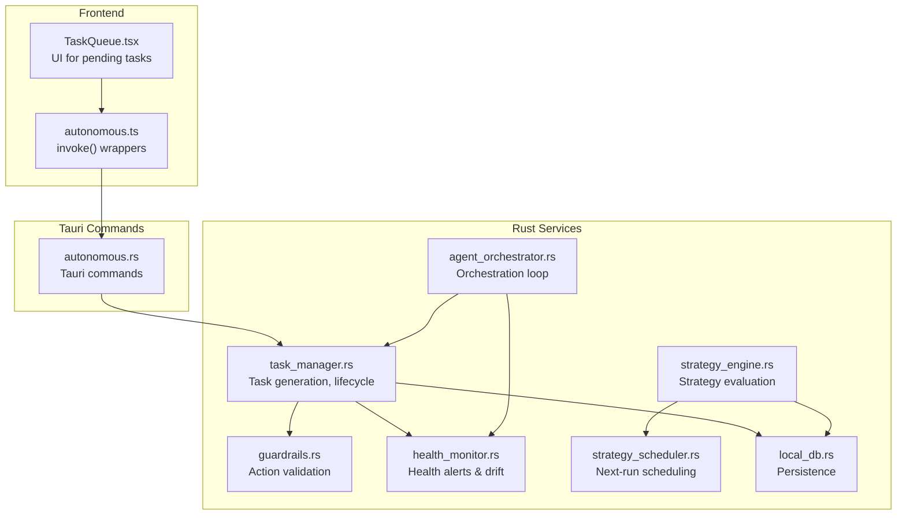
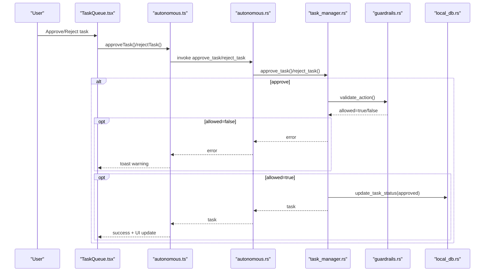
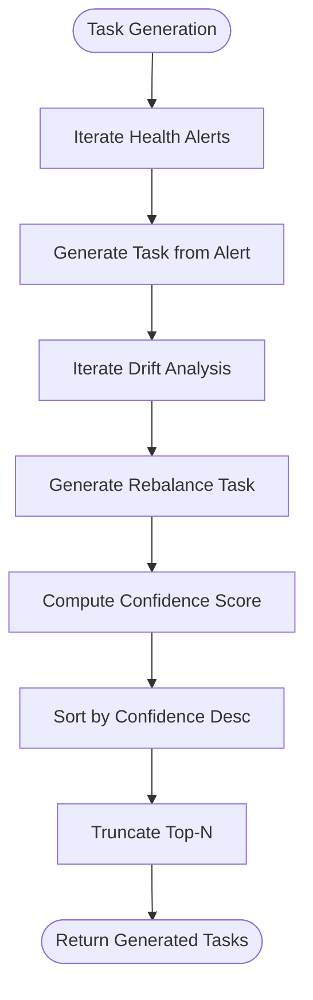
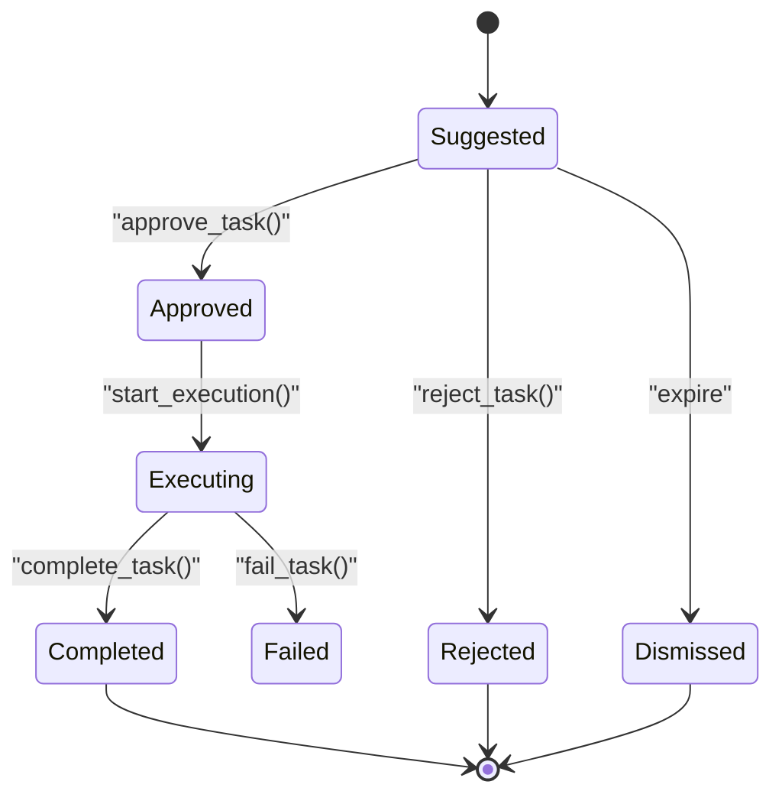
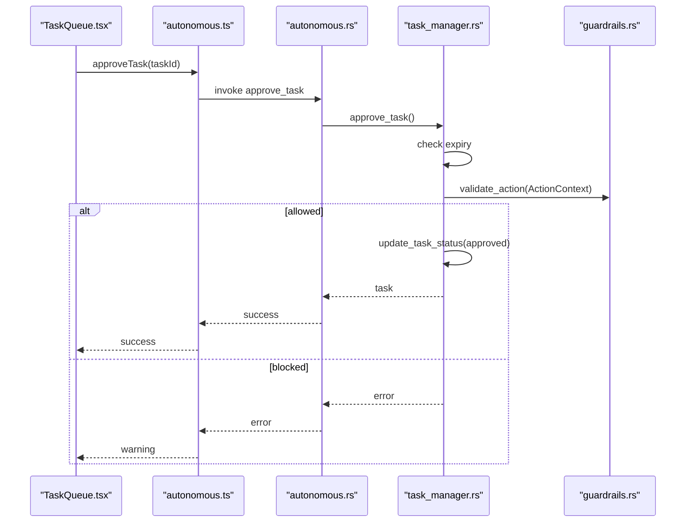
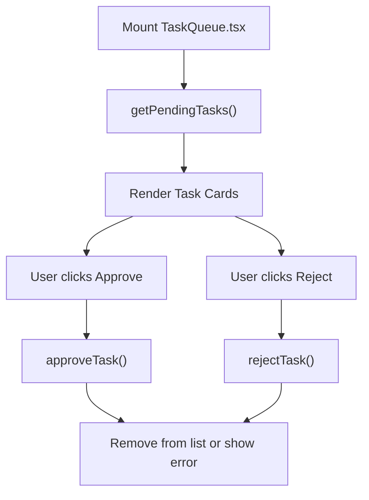
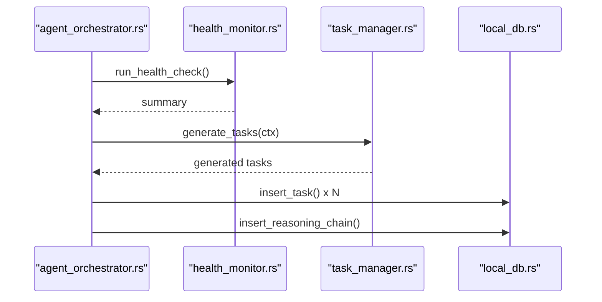
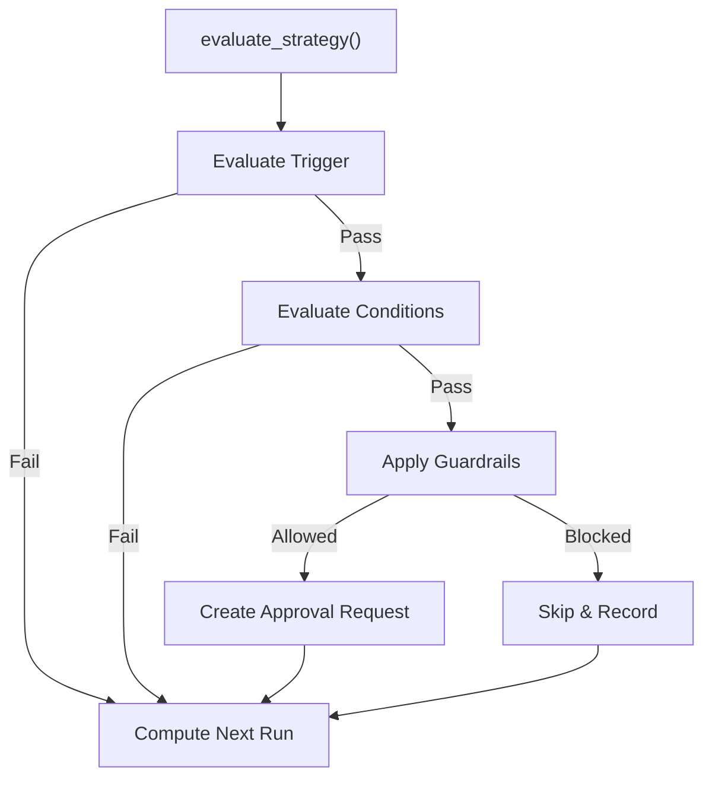
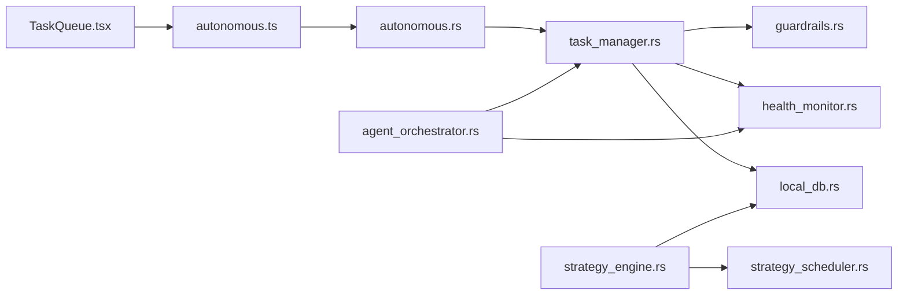

# Task Queue Management

<cite>
**Referenced Files in This Document**
- [task_manager.rs](file://src-tauri/src/services/task_manager.rs)
- [TaskQueue.tsx](file://src/components/autonomous/TaskQueue.tsx)
- [autonomous.rs](file://src-tauri/src/commands/autonomous.rs)
- [autonomous.ts](file://src/lib/autonomous.ts)
- [autonomous.ts (types)](file://src/types/autonomous.ts)
- [guardrails.rs](file://src-tauri/src/services/guardrails.rs)
- [health_monitor.rs](file://src-tauri/src/services/health_monitor.rs)
- [agent_orchestrator.rs](file://src-tauri/src/services/agent_orchestrator.rs)
- [strategy_scheduler.rs](file://src-tauri/src/services/strategy_scheduler.rs)
- [strategy_engine.rs](file://src-tauri/src/services/strategy_engine.rs)
- [local_db.rs](file://src-tauri/src/services/local_db.rs)
</cite>

## Table of Contents
1. [Introduction](#introduction)
2. [Project Structure](#project-structure)
3. [Core Components](#core-components)
4. [Architecture Overview](#architecture-overview)
5. [Detailed Component Analysis](#detailed-component-analysis)
6. [Dependency Analysis](#dependency-analysis)
7. [Performance Considerations](#performance-considerations)
8. [Troubleshooting Guide](#troubleshooting-guide)
9. [Conclusion](#conclusion)
10. [Appendices](#appendices)

## Introduction
This document explains the Task Queue Management system responsible for strategy execution scheduling and background task processing. It covers how proactive tasks are generated from portfolio health and drift analysis, how the TaskQueue component manages autonomous operations (prioritization, scheduling, status tracking), and how the Rust-based task manager integrates with the frontend. It also documents task lifecycle management, concurrent execution patterns, task types, execution preferences, retry mechanisms, failure handling, guardrails, and monitoring.

## Project Structure
The Task Queue Management spans three layers:
- Frontend React component that displays pending tasks and handles user approvals/rejections.
- Tauri command layer that exposes task APIs to the frontend.
- Rust services that generate, validate, store, and track tasks, and coordinate with guardrails and orchestrator.

**Diagram sources**
- [TaskQueue.tsx:28-88](file://src/components/autonomous/TaskQueue.tsx#L28-L88)
- [autonomous.ts:18-86](file://src/lib/autonomous.ts#L18-L86)
- [autonomous.rs:260-283](file://src-tauri/src/commands/autonomous.rs#L260-L283)
- [task_manager.rs:167-195](file://src-tauri/src/services/task_manager.rs#L167-L195)
- [guardrails.rs:278-426](file://src-tauri/src/services/guardrails.rs#L278-L426)
- [health_monitor.rs:107-221](file://src-tauri/src/services/health_monitor.rs#L107-L221)
- [agent_orchestrator.rs:330-390](file://src-tauri/src/services/agent_orchestrator.rs#L330-L390)
- [strategy_engine.rs:120-159](file://src-tauri/src/services/strategy_engine.rs#L120-L159)
- [strategy_scheduler.rs:8-36](file://src-tauri/src/services/strategy_scheduler.rs#L8-L36)
- [local_db.rs:1811-1848](file://src-tauri/src/services/local_db.rs#L1811-L1848)

**Section sources**
- [TaskQueue.tsx:28-88](file://src/components/autonomous/TaskQueue.tsx#L28-L88)
- [autonomous.rs:260-283](file://src-tauri/src/commands/autonomous.rs#L260-L283)
- [task_manager.rs:167-195](file://src-tauri/src/services/task_manager.rs#L167-L195)

## Core Components
- TaskQueue (frontend): Renders pending tasks, allows user approval/rejection, and reflects live updates.
- Task Manager (Rust): Generates tasks from health alerts and drift analysis, validates actions via guardrails, persists tasks, and tracks stats.
- Orchestrator (Rust): Periodically runs health checks, opportunity scans, and task generation cycles; enforces limits and kill switches.
- Guardrails (Rust): Validates actions against user-configurable constraints and enforces kill switches.
- Health Monitor (Rust): Produces health alerts and drift analysis used by task generation.
- Strategy Engine and Scheduler (Rust): Evaluate and schedule strategies independently; complement task queue for automated actions.

Key responsibilities:
- Task prioritization and confidence scoring
- Expiration and snooze handling
- Approval gating and guardrail enforcement
- Stats and reasoning chain persistence
- Orchestration loop and capacity management

**Section sources**
- [TaskQueue.tsx:28-88](file://src/components/autonomous/TaskQueue.tsx#L28-L88)
- [task_manager.rs:14-80](file://src-tauri/src/services/task_manager.rs#L14-L80)
- [agent_orchestrator.rs:23-83](file://src-tauri/src/services/agent_orchestrator.rs#L23-L83)
- [guardrails.rs:42-135](file://src-tauri/src/services/guardrails.rs#L42-L135)
- [health_monitor.rs:35-85](file://src-tauri/src/services/health_monitor.rs#L35-L85)
- [strategy_engine.rs:21-37](file://src-tauri/src/services/strategy_engine.rs#L21-L37)

## Architecture Overview
The system follows a reactive orchestration pattern:
- The orchestrator periodically evaluates portfolio health and drift, then generates tasks and stores them.
- The frontend polls pending tasks and lets users approve/reject.
- Approved tasks are validated by guardrails before proceeding to execution.
- Execution outcomes update task status and learning signals.

**Diagram sources**
- [TaskQueue.tsx:38-48](file://src/components/autonomous/TaskQueue.tsx#L38-L48)
- [autonomous.ts:94-159](file://src/lib/autonomous.ts#L94-L159)
- [autonomous.rs:307-344](file://src-tauri/src/commands/autonomous.rs#L307-L344)
- [task_manager.rs:432-502](file://src-tauri/src/services/task_manager.rs#L432-L502)
- [guardrails.rs:278-426](file://src-tauri/src/services/guardrails.rs#L278-L426)
- [local_db.rs:1811-1848](file://src-tauri/src/services/local_db.rs#L1811-L1848)

## Detailed Component Analysis

### Task Generation and Prioritization
- Sources: Health alerts and drift analysis.
- Confidence scoring: Based on alert severity and drift magnitude.
- Priority: Derived from alert type and drift thresholds.
- Expiration: Tasks expire after a fixed window (e.g., 15 minutes).

**Diagram sources**
- [task_manager.rs:167-195](file://src-tauri/src/services/task_manager.rs#L167-L195)
- [task_manager.rs:197-303](file://src-tauri/src/services/task_manager.rs#L197-L303)
- [task_manager.rs:305-387](file://src-tauri/src/services/task_manager.rs#L305-L387)
- [health_monitor.rs:350-427](file://src-tauri/src/services/health_monitor.rs#L350-L427)

**Section sources**
- [task_manager.rs:167-195](file://src-tauri/src/services/task_manager.rs#L167-L195)
- [task_manager.rs:197-303](file://src-tauri/src/services/task_manager.rs#L197-L303)
- [task_manager.rs:305-387](file://src-tauri/src/services/task_manager.rs#L305-L387)
- [health_monitor.rs:107-221](file://src-tauri/src/services/health_monitor.rs#L107-L221)

### Task Lifecycle and Status Tracking
- States: Suggested, Approved, Rejected, Executing, Completed, Failed, Dismissed, Snoozed.
- Persistence: Tasks stored in local database with JSON-serialized reasoning and suggested actions.
- Stats: Aggregated counts per status for monitoring.

**Diagram sources**
- [task_manager.rs:25-37](file://src-tauri/src/services/task_manager.rs#L25-L37)
- [task_manager.rs:525-554](file://src-tauri/src/services/task_manager.rs#L525-L554)
- [local_db.rs:1824-1848](file://src-tauri/src/services/local_db.rs#L1824-L1848)

**Section sources**
- [task_manager.rs:25-37](file://src-tauri/src/services/task_manager.rs#L25-L37)
- [task_manager.rs:525-554](file://src-tauri/src/services/task_manager.rs#L525-L554)
- [local_db.rs:1824-1848](file://src-tauri/src/services/local_db.rs#L1824-L1848)

### Approval Workflow and Guardrails Validation
- Approval path: Fetch task, validate expiration, build ActionContext, run guardrails, update status.
- Guardrails: Kill switch, portfolio floor, single tx cap, allowed chains, blocked tokens/protocols, time windows, slippage, and approval thresholds.

**Diagram sources**
- [TaskQueue.tsx:38-42](file://src/components/autonomous/TaskQueue.tsx#L38-L42)
- [autonomous.ts:94-159](file://src/lib/autonomous.ts#L94-L159)
- [autonomous.rs:307-344](file://src-tauri/src/commands/autonomous.rs#L307-L344)
- [task_manager.rs:432-502](file://src-tauri/src/services/task_manager.rs#L432-L502)
- [guardrails.rs:278-426](file://src-tauri/src/services/guardrails.rs#L278-L426)

**Section sources**
- [task_manager.rs:432-502](file://src-tauri/src/services/task_manager.rs#L432-L502)
- [guardrails.rs:278-426](file://src-tauri/src/services/guardrails.rs#L278-L426)

### Frontend Task Queue UI
- Fetches pending tasks via Tauri commands.
- Displays priority, category, confidence, and expiration.
- Handles approval/rejection with optimistic UI updates and error feedback.

**Diagram sources**
- [TaskQueue.tsx:28-88](file://src/components/autonomous/TaskQueue.tsx#L28-L88)
- [autonomous.ts:18-86](file://src/lib/autonomous.ts#L18-L86)

**Section sources**
- [TaskQueue.tsx:28-88](file://src/components/autonomous/TaskQueue.tsx#L28-L88)
- [autonomous.ts:18-86](file://src/lib/autonomous.ts#L18-L86)

### Orchestration Loop and Capacity Management
- Runs periodic cycles for health checks, opportunity scans, and task generation.
- Enforces max pending tasks and kill switch.
- Stores reasoning chains for transparency.

**Diagram sources**
- [agent_orchestrator.rs:330-390](file://src-tauri/src/services/agent_orchestrator.rs#L330-L390)
- [health_monitor.rs:107-221](file://src-tauri/src/services/health_monitor.rs#L107-L221)
- [task_manager.rs:167-195](file://src-tauri/src/services/task_manager.rs#L167-L195)
- [local_db.rs:1811-1848](file://src-tauri/src/services/local_db.rs#L1811-L1848)

**Section sources**
- [agent_orchestrator.rs:330-390](file://src-tauri/src/services/agent_orchestrator.rs#L330-L390)
- [agent_orchestrator.rs:60-83](file://src-tauri/src/services/agent_orchestrator.rs#L60-L83)

### Strategy Execution Scheduling (Complementary)
While the task queue focuses on proactive suggestions, strategies are scheduled and evaluated independently:
- Triggers: Time intervals, drift thresholds, and threshold-based conditions.
- Evaluation: Checks conditions, guardrails, and determines approval needs.
- Scheduling: Computes next run based on trigger type and evaluation intervals.

**Diagram sources**
- [strategy_engine.rs:343-725](file://src-tauri/src/services/strategy_engine.rs#L343-L725)
- [strategy_scheduler.rs:8-36](file://src-tauri/src/services/strategy_scheduler.rs#L8-L36)

**Section sources**
- [strategy_engine.rs:120-159](file://src-tauri/src/services/strategy_engine.rs#L120-L159)
- [strategy_engine.rs:289-329](file://src-tauri/src/services/strategy_engine.rs#L289-L329)
- [strategy_scheduler.rs:8-36](file://src-tauri/src/services/strategy_scheduler.rs#L8-L36)

## Dependency Analysis
- Frontend depends on Tauri commands for task operations.
- Tauri commands depend on task_manager for business logic.
- task_manager depends on guardrails for validation and health_monitor for context.
- agent_orchestrator coordinates task generation and enforces limits.
- Strategy engine and scheduler operate independently but share guardrails and DB.

**Diagram sources**
- [TaskQueue.tsx:28-88](file://src/components/autonomous/TaskQueue.tsx#L28-L88)
- [autonomous.ts:18-86](file://src/lib/autonomous.ts#L18-L86)
- [autonomous.rs:260-283](file://src-tauri/src/commands/autonomous.rs#L260-L283)
- [task_manager.rs:167-195](file://src-tauri/src/services/task_manager.rs#L167-L195)
- [guardrails.rs:278-426](file://src-tauri/src/services/guardrails.rs#L278-L426)
- [health_monitor.rs:107-221](file://src-tauri/src/services/health_monitor.rs#L107-L221)
- [agent_orchestrator.rs:330-390](file://src-tauri/src/services/agent_orchestrator.rs#L330-L390)
- [strategy_engine.rs:343-725](file://src-tauri/src/services/strategy_engine.rs#L343-L725)
- [strategy_scheduler.rs:8-36](file://src-tauri/src/services/strategy_scheduler.rs#L8-L36)
- [local_db.rs:1811-1848](file://src-tauri/src/services/local_db.rs#L1811-L1848)

**Section sources**
- [autonomous.rs:260-283](file://src-tauri/src/commands/autonomous.rs#L260-L283)
- [task_manager.rs:167-195](file://src-tauri/src/services/task_manager.rs#L167-L195)
- [agent_orchestrator.rs:330-390](file://src-tauri/src/services/agent_orchestrator.rs#L330-L390)

## Performance Considerations
- Task generation is capped (top-N) and sorted by confidence to avoid overload.
- Expiration reduces stale task accumulation.
- Orchestrator enforces max pending tasks to prevent queue saturation.
- Guardrail checks short-circuit blocking actions early.
- Strategy evaluation computes next run to avoid unnecessary work.
- Recommendations:
  - Tune orchestrator intervals based on network latency and user expectations.
  - Monitor task stats to detect spikes and adjust limits.
  - Use reasoning chain storage for post-hoc analysis without impacting runtime.

[No sources needed since this section provides general guidance]

## Troubleshooting Guide
Common issues and resolutions:
- Approval blocked by guardrails: Review guardrail configuration and violations recorded in the database.
- Kill switch active: Deactivate kill switch via backend commands; orchestrator will not start while active.
- Expired tasks: Tasks older than expiration window are auto-dismissed upon approval attempt.
- No pending tasks: Verify orchestrator is running and health checks are generating alerts/drift.
- UI not updating: Confirm Tauri commands are reachable and invoke() wrappers return success.

Operational checks:
- Use frontend guardrail APIs to inspect current configuration.
- Query task stats via Tauri commands to assess queue health.
- Inspect reasoning chains for transparency on why tasks were generated.

**Section sources**
- [guardrails.rs:232-275](file://src-tauri/src/services/guardrails.rs#L232-L275)
- [task_manager.rs:432-502](file://src-tauri/src/services/task_manager.rs#L432-L502)
- [autonomous.rs:260-283](file://src-tauri/src/commands/autonomous.rs#L260-L283)
- [autonomous.ts:172-182](file://src/lib/autonomous.ts#L172-L182)

## Conclusion
The Task Queue Management system integrates frontend UX, Tauri commands, and robust Rust services to deliver a secure, transparent, and scalable task lifecycle. It generates proactive tasks from portfolio insights, enforces strict guardrails, and provides observability through stats and reasoning chains. Complementary strategy scheduling ensures continuous automation aligned with user-defined policies.

[No sources needed since this section summarizes without analyzing specific files]

## Appendices

### Task Types and Execution Preferences
- TaskAction: actionType, chain, tokenIn/tokenOut, amounts, targetAddress, parameters.
- Categories: rebalance, risk_mitigation.
- Priorities: low, medium, high, urgent (frontend) vs low, medium, high, critical (backend).
- Confidence: numeric score derived from severity and drift magnitude.

**Section sources**
- [task_manager.rs:39-51](file://src-tauri/src/services/task_manager.rs#L39-L51)
- [task_manager.rs:14-23](file://src-tauri/src/services/task_manager.rs#L14-L23)
- [TaskQueue.tsx:24-26](file://src/components/autonomous/TaskQueue.tsx#L24-L26)
- [autonomous.ts (types):3-4](file://src/types/autonomous.ts#L3-L4)

### Retry Mechanisms and Failure Handling
- Expiration: Tasks become dismissed if approved after expiry.
- Guardrail failures: Blocked actions return errors; user can adjust guardrails.
- Strategy evaluation: Pauses strategies exceeding configured limits; records reasons and audits.

**Section sources**
- [task_manager.rs:432-502](file://src-tauri/src/services/task_manager.rs#L432-L502)
- [strategy_engine.rs:403-434](file://src-tauri/src/services/strategy_engine.rs#L403-L434)

### Relationship Between Strategies and Background Task Execution
- Strategies are scheduled and evaluated independently; they may emit alerts or create approval requests.
- Tasks are proactive suggestions surfaced to the user for approval; strategies can complement or overlap based on conditions and guardrails.

**Section sources**
- [strategy_engine.rs:505-725](file://src-tauri/src/services/strategy_engine.rs#L505-L725)
- [agent_orchestrator.rs:330-390](file://src-tauri/src/services/agent_orchestrator.rs#L330-L390)

### Resource Allocation and Capacity Management
- Max pending tasks enforced by orchestrator to cap queue growth.
- Time-based scheduling prevents excessive polling and aligns with trigger types.
- Guardrails limit per-trade exposure and enforce allowed chains/tokens.

**Section sources**
- [agent_orchestrator.rs:60-83](file://src-tauri/src/services/agent_orchestrator.rs#L60-L83)
- [strategy_scheduler.rs:8-36](file://src-tauri/src/services/strategy_scheduler.rs#L8-L36)
- [guardrails.rs:42-67](file://src-tauri/src/services/guardrails.rs#L42-L67)

### Monitoring and Progress Tracking
- Task stats endpoint for queue health.
- Reasoning chain storage for decision transparency.
- Audit logs for guardrail violations and orchestrator events.

**Section sources**
- [autonomous.rs:233-258](file://src-tauri/src/commands/autonomous.rs#L233-L258)
- [agent_orchestrator.rs:392-467](file://src-tauri/src/services/agent_orchestrator.rs#L392-L467)
- [guardrails.rs:484-519](file://src-tauri/src/services/guardrails.rs#L484-L519)