# Backend Services Architecture

<cite>
**Referenced Files in This Document**
- [Cargo.toml](file://src-tauri/Cargo.toml)
- [lib.rs](file://src-tauri/src/lib.rs)
- [main.rs](file://src-tauri/src/main.rs)
- [session.rs](file://src-tauri/src/session.rs)
- [services/mod.rs](file://src-tauri/src/services/mod.rs)
- [services/local_db.rs](file://src-tauri/src/services/local_db.rs)
- [services/market_service.rs](file://src-tauri/src/services/market_service.rs)
- [services/strategy_engine.rs](file://src-tauri/src/services/strategy_engine.rs)
- [services/task_manager.rs](file://src-tauri/src/services/task_manager.rs)
- [services/wallet_sync.rs](file://src-tauri/src/services/wallet_sync.rs)
- [commands/mod.rs](file://src-tauri/src/commands/mod.rs)
- [commands/wallet.rs](file://src-tauri/src/commands/wallet.rs)
- [commands/market.rs](file://src-tauri/src/commands/market.rs)
- [commands/strategy.rs](file://src-tauri/src/commands/strategy.rs)
- [commands/autonomous.rs](file://src-tauri/src/commands/autonomous.rs)
</cite>

## Table of Contents
1. [Introduction](#introduction)
2. [Project Structure](#project-structure)
3. [Core Components](#core-components)
4. [Architecture Overview](#architecture-overview)
5. [Detailed Component Analysis](#detailed-component-analysis)
6. [Dependency Analysis](#dependency-analysis)
7. [Performance Considerations](#performance-considerations)
8. [Troubleshooting Guide](#troubleshooting-guide)
9. [Conclusion](#conclusion)

## Introduction
This document describes the backend services architecture for SHADOW Protocol’s Rust/Tauri application. It focuses on the multi-threaded service layer, Tauri command bridge, service patterns, inter-service communication, database management, task scheduling, health monitoring, and system orchestration. The backend integrates wallet services, market data services, strategy engine, autonomous agent orchestration, and background synchronization, all coordinated through Tauri commands and a SQLite-backed persistence layer.

## Project Structure
The backend is organized around a Tauri application entrypoint that initializes services, registers commands, and manages background tasks. Services encapsulate domain logic and data access, while commands expose typed APIs to the frontend.

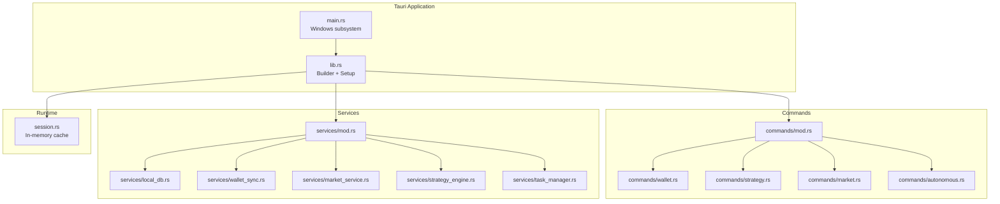

**Diagram sources**
- [lib.rs:34-198](file://src-tauri/src/lib.rs#L34-L198)
- [main.rs:4-6](file://src-tauri/src/main.rs#L4-L6)
- [commands/mod.rs:1-27](file://src-tauri/src/commands/mod.rs#L1-L27)
- [services/mod.rs:1-36](file://src-tauri/src/services/mod.rs#L1-L36)
- [session.rs:1-145](file://src-tauri/src/session.rs#L1-L145)

**Section sources**
- [Cargo.toml:1-44](file://src-tauri/Cargo.toml#L1-L44)
- [lib.rs:34-198](file://src-tauri/src/lib.rs#L34-L198)
- [main.rs:4-6](file://src-tauri/src/main.rs#L4-L6)
- [commands/mod.rs:1-27](file://src-tauri/src/commands/mod.rs#L1-L27)
- [services/mod.rs:1-36](file://src-tauri/src/services/mod.rs#L1-L36)
- [session.rs:1-145](file://src-tauri/src/session.rs#L1-L145)

## Core Components
- Tauri Builder and Setup: Initializes logging, plugins, database, and background services; registers commands; handles lifecycle events.
- Session Management: In-memory cache for decrypted private keys with expiration and secure wipe.
- Local Database: SQLite schema for wallets, tokens, NFTs, transactions, portfolio snapshots, strategies, approvals, executions, audits, market opportunities, apps, tasks, and autonomous agent artifacts.
- Wallet Sync: Multi-network background synchronization of balances, NFTs, and transactions via external APIs.
- Market Service: Aggregates opportunities from providers, ranks candidates, and emits updates.
- Strategy Engine: Evaluates compiled strategies on heartbeat ticks, enforces guardrails, and creates approvals.
- Task Manager: Generates proactive tasks from health alerts and drift analysis, validates via guardrails, and tracks lifecycle.
- Commands: Typed entrypoints bridging frontend and backend services.

**Section sources**
- [lib.rs:34-198](file://src-tauri/src/lib.rs#L34-L198)
- [session.rs:1-145](file://src-tauri/src/session.rs#L1-L145)
- [services/local_db.rs:1-800](file://src-tauri/src/services/local_db.rs#L1-L800)
- [services/wallet_sync.rs:1-453](file://src-tauri/src/services/wallet_sync.rs#L1-L453)
- [services/market_service.rs:1-745](file://src-tauri/src/services/market_service.rs#L1-L745)
- [services/strategy_engine.rs:1-726](file://src-tauri/src/services/strategy_engine.rs#L1-L726)
- [services/task_manager.rs:1-633](file://src-tauri/src/services/task_manager.rs#L1-L633)
- [commands/wallet.rs:1-284](file://src-tauri/src/commands/wallet.rs#L1-L284)
- [commands/market.rs:1-36](file://src-tauri/src/commands/market.rs#L1-L36)
- [commands/strategy.rs:1-309](file://src-tauri/src/commands/strategy.rs#L1-L309)
- [commands/autonomous.rs:1-786](file://src-tauri/src/commands/autonomous.rs#L1-L786)

## Architecture Overview
The backend follows a layered architecture:
- Presentation Layer: Tauri commands exposed to the frontend.
- Service Layer: Coordinated by the Tauri builder, services encapsulate domain logic and data access.
- Persistence Layer: SQLite with migrations and indices for performance.
- Orchestration: Tokio runtime powers async services and periodic tasks.

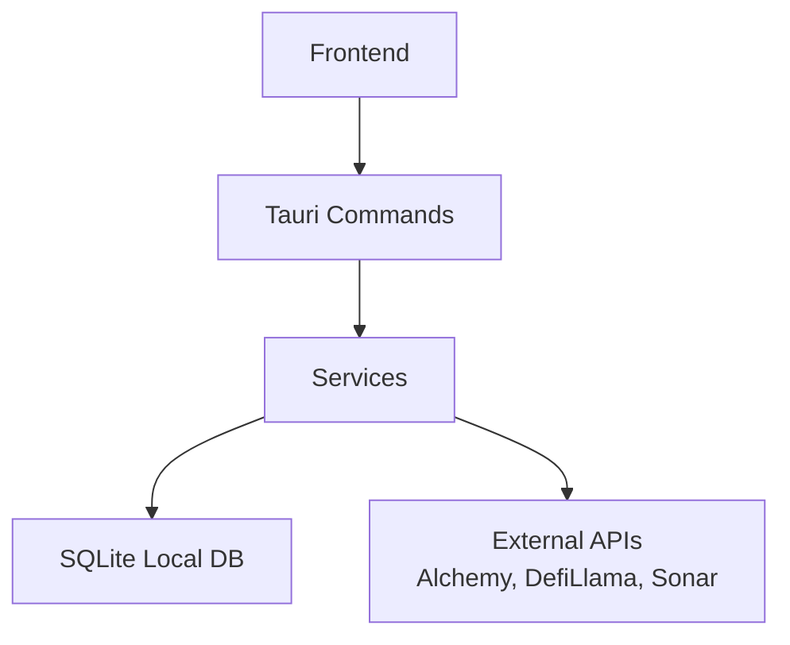

**Diagram sources**
- [lib.rs:90-190](file://src-tauri/src/lib.rs#L90-L190)
- [services/local_db.rs:438-516](file://src-tauri/src/services/local_db.rs#L438-L516)
- [services/wallet_sync.rs:260-453](file://src-tauri/src/services/wallet_sync.rs#L260-L453)
- [services/market_service.rs:263-365](file://src-tauri/src/services/market_service.rs#L263-L365)

## Detailed Component Analysis

### Tauri Application Lifecycle and Command Bridge
- Entry point initializes tracing, registers plugins, sets up the database, starts background services, prunes sessions, and spawns wallet sync jobs.
- All backend commands are registered in the builder, enabling typed calls from the frontend.
- Lifecycle events clear session caches on exit.

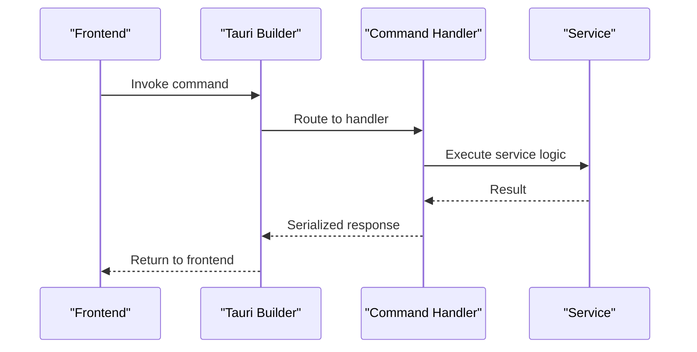

**Diagram sources**
- [lib.rs:90-190](file://src-tauri/src/lib.rs#L90-L190)
- [commands/wallet.rs:169-284](file://src-tauri/src/commands/wallet.rs#L169-L284)
- [commands/market.rs:8-36](file://src-tauri/src/commands/market.rs#L8-L36)
- [commands/strategy.rs:216-309](file://src-tauri/src/commands/strategy.rs#L216-L309)
- [commands/autonomous.rs:74-786](file://src-tauri/src/commands/autonomous.rs#L74-L786)

**Section sources**
- [lib.rs:34-198](file://src-tauri/src/lib.rs#L34-L198)
- [main.rs:4-6](file://src-tauri/src/main.rs#L4-L6)

### Session Management
- Maintains an in-memory cache of decrypted private keys with expiration.
- Supports refresh, retrieval, and secure clearing with zeroization.
- Integrates with biometric keychain for secure storage.

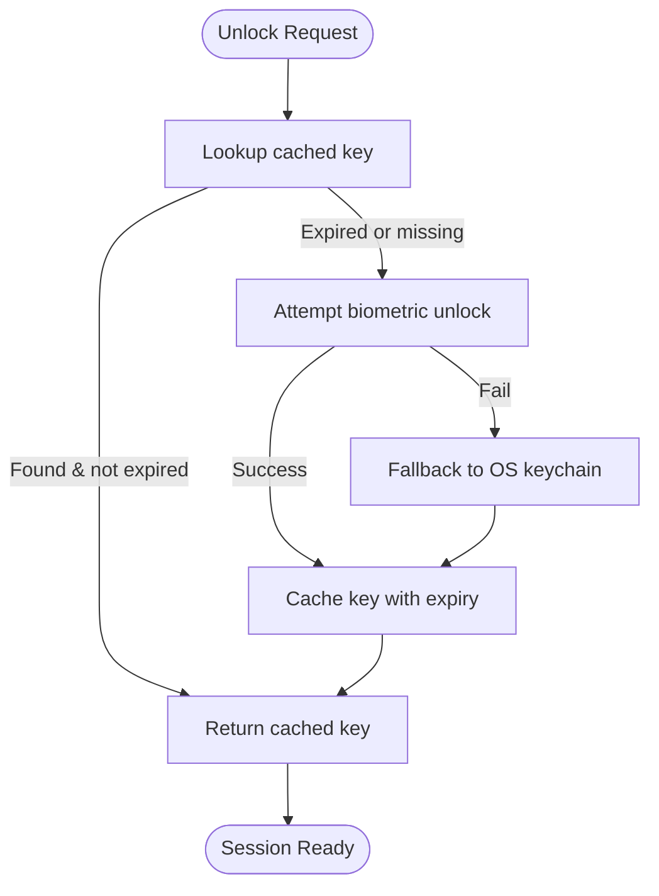

**Diagram sources**
- [session.rs:31-75](file://src-tauri/src/session.rs#L31-L75)
- [session.rs:86-125](file://src-tauri/src/session.rs#L86-L125)

**Section sources**
- [session.rs:1-145](file://src-tauri/src/session.rs#L1-L145)

### Database Management and Persistence
- SQLite initialization with schema creation and migrations.
- Rich schema covering wallets, tokens, NFTs, transactions, portfolio snapshots, strategies, approvals, executions, audits, market opportunities, apps, tasks, and autonomous agent artifacts.
- Indexes optimized for frequent queries (timestamps, status, scores).
- Utility functions for upserts, inserts, counts, and clears.

```mermaid
erDiagram
WALLETS {
text address PK
integer last_synced_at
text sync_status
}
TOKENS {
text id PK
text wallet_address
text chain
text token_contract
text symbol
text balance
text value_usd
integer decimals
text asset_type
integer updated_at
}
NFTS {
text id PK
text wallet_address
text chain
text contract
text token_id
text metadata
integer updated_at
}
TRANSACTIONS {
text id PK
text wallet_address
text chain
text tx_hash
text from_addr
text to_addr
text value
integer block_number
integer timestamp
text category
text metadata
integer updated_at
}
PORTFOLIO_SNAPSHOTS {
integer id PK
integer timestamp
text total_usd
text top_assets_json
text wallet_breakdown_json
text chain_breakdown_json
text net_flow_usd
text performance_usd
}
ACTIVE_STRATEGIES {
text id PK
text name
text summary
text status
text template
text mode
integer version
text trigger_json
text action_json
text guardrails_json
text draft_graph_json
text compiled_plan_json
text validation_state
text last_simulation_json
text last_execution_status
text last_execution_reason
text approval_policy_json
text execution_policy_json
integer failure_count
integer last_evaluation_at
text disabled_reason
integer last_run_at
integer next_run_at
integer created_at
integer updated_at
}
APPROVAL_REQUESTS {
text id PK
text source
text tool_name
text kind
text status
text payload_json
text simulation_json
text policy_json
text message
integer expires_at
integer version
text strategy_id
integer created_at
integer updated_at
}
TOOL_EXECUTIONS {
text id PK
text approval_id
text strategy_id
text tool_name
text status
text request_json
text result_json
text tx_hash
text error_code
text error_message
integer created_at
integer completed_at
}
STRATEGY_EXECUTIONS {
text id PK
text strategy_id
text status
text reason
text evaluation_json
text approval_id
text tool_execution_id
integer created_at
}
AUDIT_LOG {
text id PK
text event_type
text subject_type
text subject_id
text details_json
integer created_at
}
MARKET_OPPORTUNITIES {
text id PK
text fingerprint
text title
text summary
text category
text chain
text protocol
text symbols_json
text risk
float confidence
float score
text actionability
text metrics_json
text portfolio_fit_json
text primary_action_json
text details_json
text sources_json
integer stale
integer fresh_until
integer first_seen_at
integer last_seen_at
integer expires_at
}
APPS_CATALOG {
text id PK
text name
text short_description
text long_description
text icon_key
text version
text author
text features_json
text permissions_json
text secret_requirements_json
text agent_tools_json
text network_scopes_json
integer updated_at
}
INSTALLED_APPS {
text app_id PK
text lifecycle
text installed_version
integer enabled
text health_status
text health_message
integer last_health_at
integer permissions_acknowledged_at
text error_message
integer installed_at
integer updated_at
}
TASKS {
text id PK
text title
text summary
text category
text priority
text status
text reasoning_json
text related_entities_json
text source_trigger
text suggested_action_json
float confidence_score
integer expires_at
integer snoozed_until
integer created_at
integer updated_at
}
```

**Diagram sources**
- [services/local_db.rs:10-416](file://src-tauri/src/services/local_db.rs#L10-L416)

**Section sources**
- [services/local_db.rs:438-516](file://src-tauri/src/services/local_db.rs#L438-L516)
- [services/local_db.rs:518-800](file://src-tauri/src/services/local_db.rs#L518-L800)

### Wallet Services and Background Sync
- Multi-network sync: tokens, NFTs, and transactions across base networks plus optional Flow networks.
- Emits progress and completion events to the frontend.
- Captures portfolio snapshots and triggers market refresh post-sync.

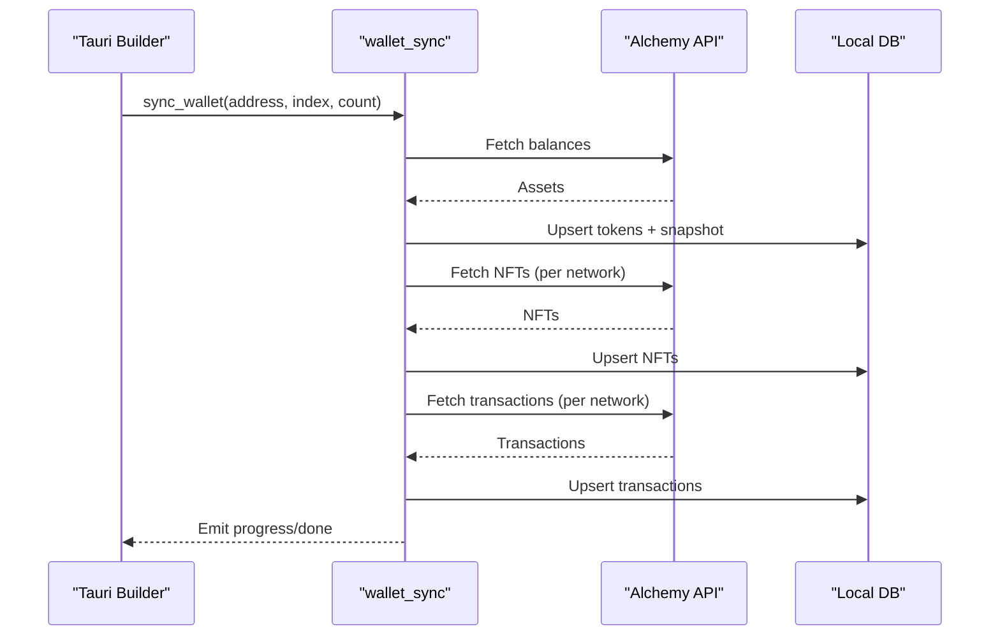

**Diagram sources**
- [services/wallet_sync.rs:260-453](file://src-tauri/src/services/wallet_sync.rs#L260-L453)

**Section sources**
- [services/wallet_sync.rs:1-453](file://src-tauri/src/services/wallet_sync.rs#L1-L453)

### Market Data Services
- Periodic refresh of opportunities from DefiLlama and optional research provider.
- Ranking pipeline considers yield, spread watch, rebalance, and catalyst signals.
- Emits updates and supports fallback to cached results when providers fail.

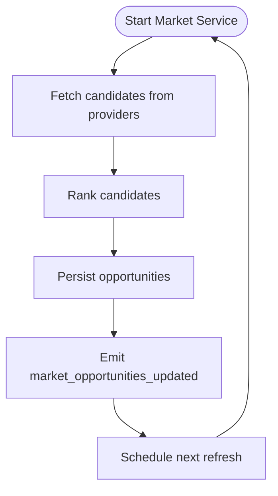

**Diagram sources**
- [services/market_service.rs:189-218](file://src-tauri/src/services/market_service.rs#L189-L218)
- [services/market_service.rs:263-365](file://src-tauri/src/services/market_service.rs#L263-L365)

**Section sources**
- [services/market_service.rs:1-745](file://src-tauri/src/services/market_service.rs#L1-L745)

### Strategy Engine
- Evaluates strategies on heartbeat ticks using compiled plans.
- Enforces guardrails (portfolio floor, gas, slippage, cooldown, drift).
- Creates approval requests for actions requiring user consent.

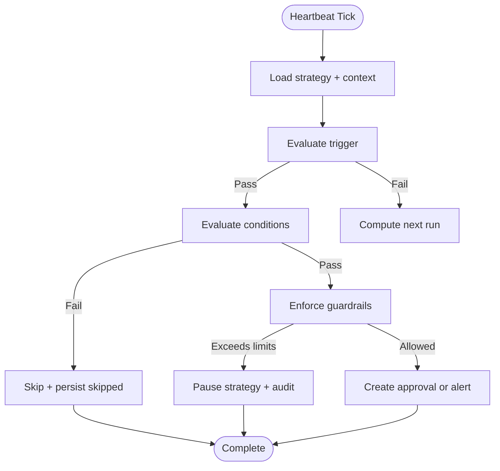

**Diagram sources**
- [services/strategy_engine.rs:343-726](file://src-tauri/src/services/strategy_engine.rs#L343-L726)

**Section sources**
- [services/strategy_engine.rs:1-726](file://src-tauri/src/services/strategy_engine.rs#L1-L726)

### Task Manager and Autonomous Agent Orchestration
- Generates tasks from health alerts and drift analysis.
- Validates actions against guardrails and tracks lifecycle (pending/approved/rejected/executing/completed/failed/dismissed).
- Provides reasoning chains and learned preferences for transparency and improvement.

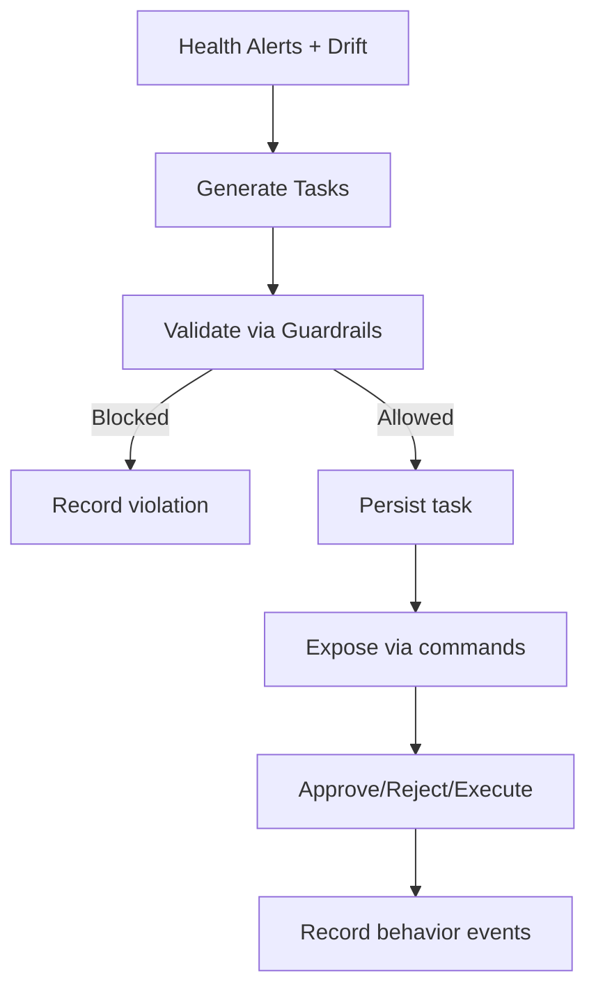

**Diagram sources**
- [services/task_manager.rs:167-195](file://src-tauri/src/services/task_manager.rs#L167-L195)
- [services/task_manager.rs:431-502](file://src-tauri/src/services/task_manager.rs#L431-L502)

**Section sources**
- [services/task_manager.rs:1-633](file://src-tauri/src/services/task_manager.rs#L1-L633)
- [commands/autonomous.rs:74-786](file://src-tauri/src/commands/autonomous.rs#L74-L786)

### Command System and Inter-Service Communication
- Commands are grouped and exported from a central module.
- Wallet commands manage key storage and address lists.
- Strategy commands compile drafts, persist strategies, and query execution history.
- Market commands fetch opportunities, refresh data, and prepare actions.
- Autonomous commands expose guardrails, tasks, health, opportunities, orchestrator state, and preferences.

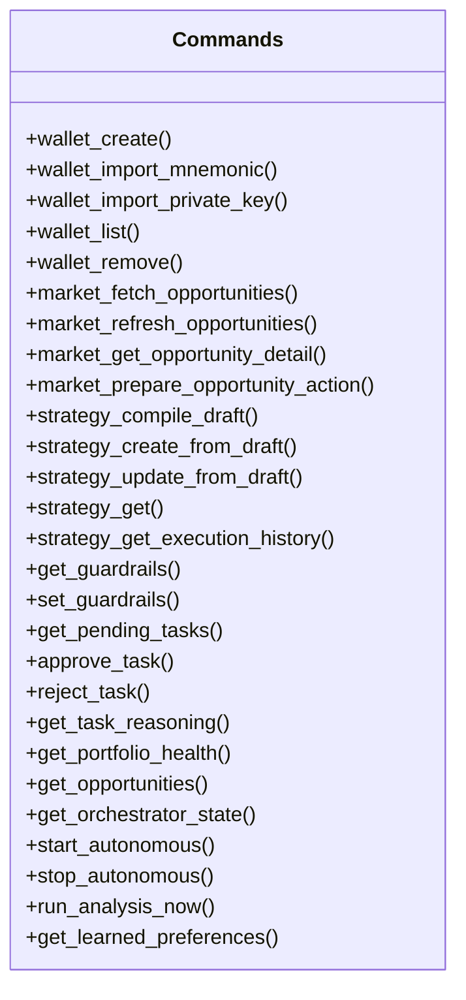

**Diagram sources**
- [commands/mod.rs:1-27](file://src-tauri/src/commands/mod.rs#L1-L27)
- [commands/wallet.rs:169-284](file://src-tauri/src/commands/wallet.rs#L169-L284)
- [commands/market.rs:8-36](file://src-tauri/src/commands/market.rs#L8-L36)
- [commands/strategy.rs:216-309](file://src-tauri/src/commands/strategy.rs#L216-L309)
- [commands/autonomous.rs:74-786](file://src-tauri/src/commands/autonomous.rs#L74-L786)

**Section sources**
- [commands/mod.rs:1-27](file://src-tauri/src/commands/mod.rs#L1-L27)
- [commands/wallet.rs:1-284](file://src-tauri/src/commands/wallet.rs#L1-L284)
- [commands/market.rs:1-36](file://src-tauri/src/commands/market.rs#L1-L36)
- [commands/strategy.rs:1-309](file://src-tauri/src/commands/strategy.rs#L1-L309)
- [commands/autonomous.rs:1-786](file://src-tauri/src/commands/autonomous.rs#L1-L786)

## Dependency Analysis
- Runtime and concurrency: Tokio multi-threaded runtime powers async services and intervals.
- Networking: reqwest with rustls for HTTPS; ethers for EVM signing and key management.
- Logging and observability: tracing/tracing-subscriber for structured logs.
- Storage: rusqlite with bundled SQLite for embedded persistence.
- Plugins: Tauri plugins for biometry and opener.

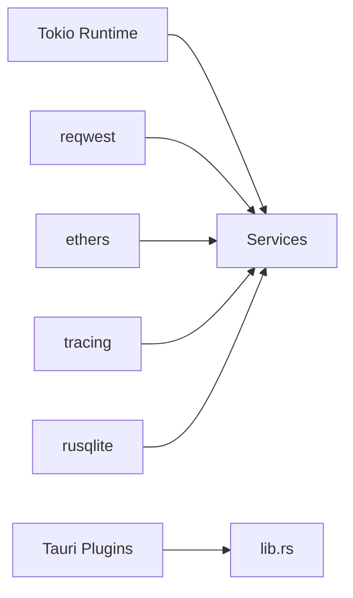

**Diagram sources**
- [Cargo.toml:20-42](file://src-tauri/Cargo.toml#L20-L42)
- [lib.rs:34-198](file://src-tauri/src/lib.rs#L34-L198)

**Section sources**
- [Cargo.toml:1-44](file://src-tauri/Cargo.toml#L1-L44)
- [lib.rs:34-198](file://src-tauri/src/lib.rs#L34-L198)

## Performance Considerations
- Asynchronous design: Services use async runtime and spawn tasks for non-blocking operation.
- Database indexing: Strategic indices on timestamps, status, and foreign keys improve query performance.
- Batch operations: Upserts for tokens/NFTs/transactions reduce round-trips.
- Periodic refresh cadence: Controlled intervals prevent excessive external API calls.
- Memory caching: Session cache avoids repeated OS prompts; guardrails and learned preferences reduce repeated computation.

[No sources needed since this section provides general guidance]

## Troubleshooting Guide
- Missing API keys: Wallet sync requires ALCHEMY_API_KEY; errors are surfaced via completion events.
- Stale data: Market service falls back to cached results when provider refresh fails; check provider runs and error summaries.
- Strategy guardrails: Failures often due to max per-trade limits, allowed chains, or portfolio thresholds; inspect strategy execution records.
- Session issues: Biometric/keychain failures fall back to OS keychain prompts; verify keyring entries and biometry availability.
- Database initialization: Ensure DB path is writable and schema migrations succeed.

**Section sources**
- [services/wallet_sync.rs:260-274](file://src-tauri/src/services/wallet_sync.rs#L260-L274)
- [services/market_service.rs:601-624](file://src-tauri/src/services/market_service.rs#L601-L624)
- [services/strategy_engine.rs:404-434](file://src-tauri/src/services/strategy_engine.rs#L404-L434)
- [commands/wallet.rs:128-167](file://src-tauri/src/commands/wallet.rs#L128-L167)
- [services/local_db.rs:438-448](file://src-tauri/src/services/local_db.rs#L438-L448)

## Conclusion
SHADOW Protocol’s backend leverages Tauri and Rust to deliver a robust, asynchronous service layer. The architecture cleanly separates concerns across wallet services, market data, strategy execution, autonomous orchestration, and persistent storage. The command bridge ensures type-safe integration with the frontend, while background tasks and scheduled refreshes keep data current. Security is addressed through biometric keychain integration and in-memory session caching. Developers extending the backend should follow established service patterns, maintain guardrails, and leverage the SQLite schema for reliable persistence.