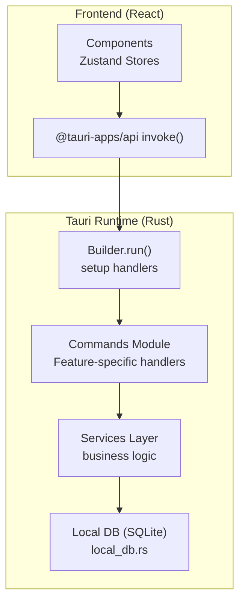
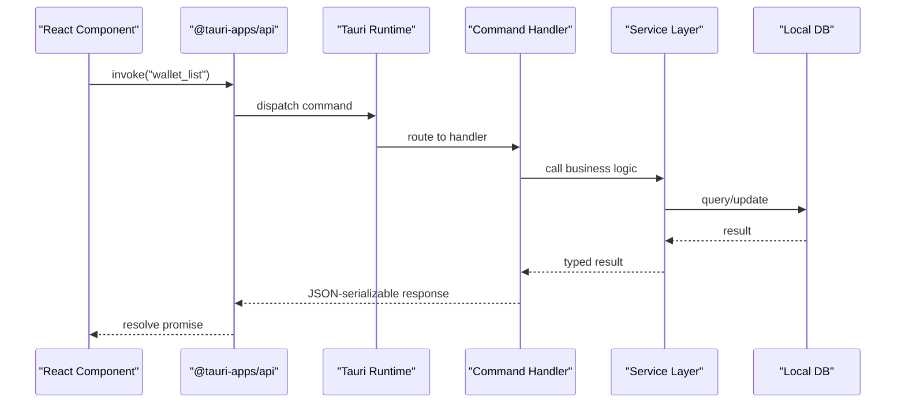
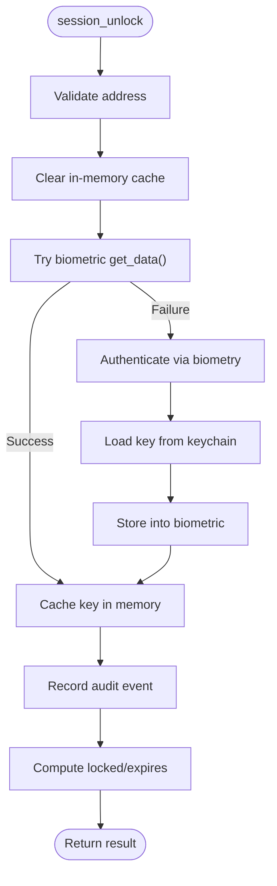
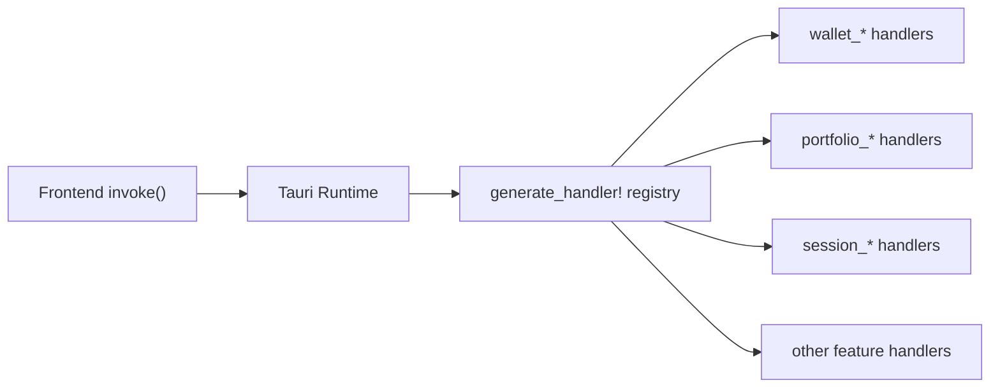
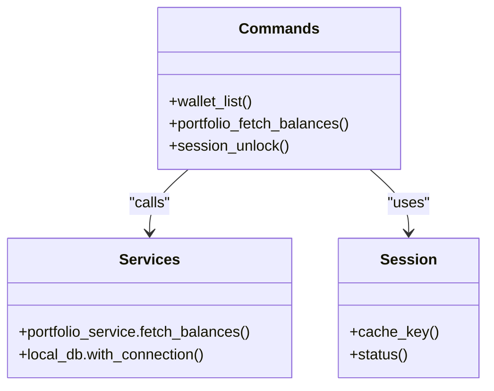
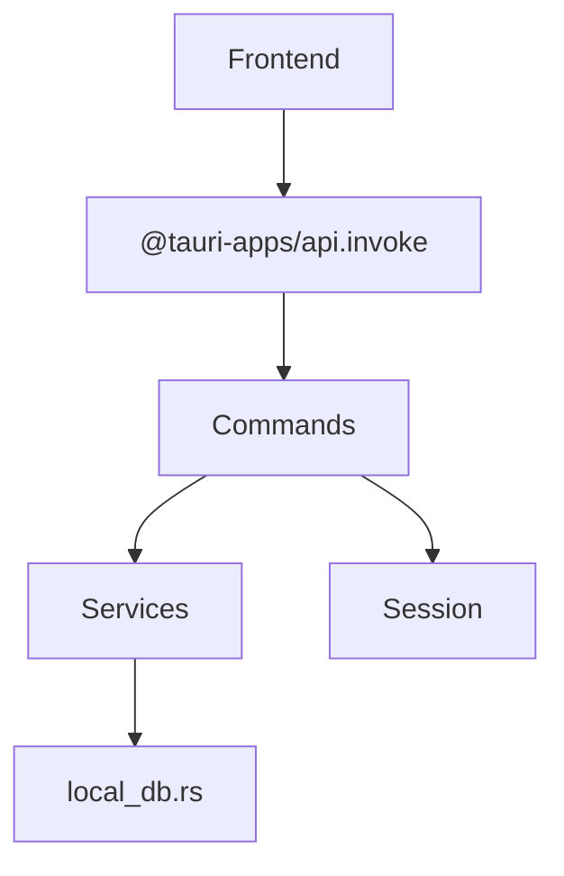

# Command System & Tauri Integration

<cite>
**Referenced Files in This Document**
- [src-tauri/src/main.rs](file://src-tauri/src/main.rs)
- [src-tauri/src/lib.rs](file://src-tauri/src/lib.rs)
- [src-tauri/src/commands/mod.rs](file://src-tauri/src/commands/mod.rs)
- [src-tauri/src/commands/session.rs](file://src-tauri/src/commands/session.rs)
- [src-tauri/src/commands/wallet.rs](file://src-tauri/src/commands/wallet.rs)
- [src-tauri/src/commands/portfolio.rs](file://src-tauri/src/commands/portfolio.rs)
- [src-tauri/src/session.rs](file://src-tauri/src/session.rs)
- [src-tauri/src/services/mod.rs](file://src-tauri/src/services/mod.rs)
- [src-tauri/src/services/local_db.rs](file://src-tauri/src/services/local_db.rs)
- [src-tauri/src/services/portfolio_service.rs](file://src-tauri/src/services/portfolio_service.rs)
- [src/lib/tauri.ts](file://src/lib/tauri.ts)
- [src/store/useWalletStore.ts](file://src/store/useWalletStore.ts)
- [src/store/useSessionStore.ts](file://src/store/useSessionStore.ts)
- [src/components/automation/ActivityLog.tsx](file://src/components/automation/ActivityLog.tsx)
</cite>

## Table of Contents
1. [Introduction](#introduction)
2. [Project Structure](#project-structure)
3. [Core Components](#core-components)
4. [Architecture Overview](#architecture-overview)
5. [Detailed Component Analysis](#detailed-component-analysis)
6. [Dependency Analysis](#dependency-analysis)
7. [Performance Considerations](#performance-considerations)
8. [Troubleshooting Guide](#troubleshooting-guide)
9. [Conclusion](#conclusion)

## Introduction
This document explains the Tauri command system and frontend-backend integration in the project. It covers the command handler architecture, parameter serialization, response formatting, session management (authentication, persistence, security context), command routing, error handling, async operations, and integration patterns between Rust services and the React frontend. It also documents security practices, input validation, and the relationship between commands and underlying service layers.

## Project Structure
The Tauri backend is implemented in Rust under src-tauri, with commands grouped by feature and backed by service modules. The frontend is a React application that invokes commands via @tauri-apps/api and manages state with Zustand stores.

**Diagram sources**
- [src-tauri/src/lib.rs:34-198](file://src-tauri/src/lib.rs#L34-L198)
- [src-tauri/src/commands/mod.rs:1-27](file://src-tauri/src/commands/mod.rs#L1-L27)
- [src-tauri/src/services/mod.rs:1-37](file://src-tauri/src/services/mod.rs#L1-L37)
- [src-tauri/src/services/local_db.rs:1-800](file://src-tauri/src/services/local_db.rs#L1-L800)

**Section sources**
- [src-tauri/src/lib.rs:34-198](file://src-tauri/src/lib.rs#L34-L198)
- [src-tauri/src/commands/mod.rs:1-27](file://src-tauri/src/commands/mod.rs#L1-L27)
- [src-tauri/src/services/mod.rs:1-37](file://src-tauri/src/services/mod.rs#L1-L37)

## Core Components
- Command registration and routing: The Tauri Builder registers all commands in generate_handler! and exposes them to the frontend.
- Command handlers: Feature-specific modules define typed input/output structs and return serialized JSON-compatible results.
- Session management: An in-memory cache with expiration controls access to decrypted private keys; integrates with biometric/keychain plugins.
- Service layer: Business logic for portfolio, wallet, market, strategy, and other domains encapsulated in services.
- Frontend integration: React components invoke commands via @tauri-apps/api and synchronize state with Zustand stores.

**Section sources**
- [src-tauri/src/lib.rs:90-190](file://src-tauri/src/lib.rs#L90-L190)
- [src-tauri/src/commands/session.rs:61-155](file://src-tauri/src/commands/session.rs#L61-L155)
- [src-tauri/src/commands/wallet.rs:169-284](file://src-tauri/src/commands/wallet.rs#L169-L284)
- [src-tauri/src/commands/portfolio.rs:38-406](file://src-tauri/src/commands/portfolio.rs#L38-L406)
- [src/lib/tauri.ts:1-4](file://src/lib/tauri.ts#L1-L4)
- [src/store/useWalletStore.ts:1-48](file://src/store/useWalletStore.ts#L1-L48)
- [src/store/useSessionStore.ts:1-28](file://src/store/useSessionStore.ts#L1-L28)

## Architecture Overview
The system follows a layered pattern:
- UI layer (React) invokes commands using @tauri-apps/api.invoke.
- Tauri runtime routes commands to registered handlers.
- Handlers validate inputs, call services, and return structured results.
- Services interact with external APIs and local SQLite database.
- Session module enforces security context and caches decrypted keys.

**Diagram sources**
- [src-tauri/src/lib.rs:90-190](file://src-tauri/src/lib.rs#L90-L190)
- [src-tauri/src/commands/wallet.rs:260-264](file://src-tauri/src/commands/wallet.rs#L260-L264)
- [src-tauri/src/services/local_db.rs:505-516](file://src-tauri/src/services/local_db.rs#L505-L516)

## Detailed Component Analysis

### Command Handler Architecture
- Registration: All commands are listed in generate_handler! and bound to the Tauri runtime during Builder.run().
- Routing: Tauri routes incoming invocations to the matching #[tauri::command] function by name.
- Parameter serialization: Handlers accept typed inputs (Deserialize) and return typed outputs (Serialize). Errors are returned as String or custom error types implementing Serialize.
- Async operations: Many commands are async and delegate to services; the runtime spawns futures appropriately.

Concrete examples:
- Wallet listing: wallet_list returns a typed result containing addresses.
- Portfolio queries: portfolio_fetch_balances and related commands return structured assets/transactions/NFTs.
- Session operations: session_unlock, session_lock, session_status enforce security and manage cached keys.

**Section sources**
- [src-tauri/src/lib.rs:90-190](file://src-tauri/src/lib.rs#L90-L190)
- [src-tauri/src/commands/wallet.rs:260-264](file://src-tauri/src/commands/wallet.rs#L260-L264)
- [src-tauri/src/commands/portfolio.rs:38-173](file://src-tauri/src/commands/portfolio.rs#L38-L173)
- [src-tauri/src/commands/session.rs:61-155](file://src-tauri/src/commands/session.rs#L61-L155)

### Parameter Serialization and Response Formatting
- Inputs: Structs annotated with #[derive(Debug, Deserialize)] and snake_case/camelCase field names for compatibility with frontend.
- Outputs: Structs annotated with #[derive(Debug, Serialize)] and camelCase field names for JSON compatibility.
- Errors: Custom enums derive Serialize to produce string messages; some commands return Result<T, String> with descriptive errors.

Examples:
- Wallet import mnemonic input struct defines mnemonic field.
- Portfolio asset output struct defines fields like id, symbol, chain, balance, value_usd, etc.
- Session unlock result includes locked flag and optional expiry seconds.

**Section sources**
- [src-tauri/src/commands/wallet.rs:51-64](file://src-tauri/src/commands/wallet.rs#L51-L64)
- [src-tauri/src/commands/portfolio.rs:88-114](file://src-tauri/src/commands/portfolio.rs#L88-L114)
- [src-tauri/src/commands/session.rs:25-55](file://src-tauri/src/commands/session.rs#L25-L55)

### Session Management System
- Security context: In-memory cache stores decrypted private keys per address with 30-minute inactivity expiry.
- Authentication: session_unlock attempts biometric retrieval; on failure/fallback, it authenticates and migrates to biometric storage.
- Persistence: Private keys are stored in OS keychain and optionally biometric keychain; addresses list is persisted to a JSON file.
- Lifecycle: prune_expired periodically removes expired entries; clear_all clears all sessions; status reports lock state and remaining expiry.

**Diagram sources**
- [src-tauri/src/commands/session.rs:61-125](file://src-tauri/src/commands/session.rs#L61-L125)
- [src-tauri/src/session.rs:30-107](file://src-tauri/src/session.rs#L30-L107)

**Section sources**
- [src-tauri/src/session.rs:1-145](file://src-tauri/src/session.rs#L1-L145)
- [src-tauri/src/commands/session.rs:61-155](file://src-tauri/src/commands/session.rs#L61-L155)
- [src-tauri/src/commands/wallet.rs:128-167](file://src-tauri/src/commands/wallet.rs#L128-L167)

### Command Routing Mechanism
- Central registration: All commands are listed in generate_handler!, enabling the runtime to route invocations.
- Feature grouping: commands/mod.rs re-exports feature modules for centralized access.
- Invocation: Frontend calls invoke with the command name and payload; Tauri resolves to the Rust handler.

**Diagram sources**
- [src-tauri/src/lib.rs:90-190](file://src-tauri/src/lib.rs#L90-L190)
- [src-tauri/src/commands/mod.rs:1-27](file://src-tauri/src/commands/mod.rs#L1-L27)

**Section sources**
- [src-tauri/src/lib.rs:90-190](file://src-tauri/src/lib.rs#L90-L190)
- [src-tauri/src/commands/mod.rs:1-27](file://src-tauri/src/commands/mod.rs#L1-L27)

### Error Handling Strategies
- Typed errors: Many services define custom error enums deriving Serialize to return descriptive messages.
- Propagation: Handlers convert lower-level errors to String or custom error types; callers receive structured errors.
- Frontend resilience: Stores catch invocation errors and reset state to recover gracefully.

Examples:
- WalletError variants for invalid mnemonic/private key and keychain errors.
- PortfolioError variants for missing API key, invalid address, request failures.
- Frontend store refreshWallets catches errors and resets addresses.

**Section sources**
- [src-tauri/src/commands/wallet.rs:18-37](file://src-tauri/src/commands/wallet.rs#L18-L37)
- [src-tauri/src/services/portfolio_service.rs:27-46](file://src-tauri/src/services/portfolio_service.rs#L27-L46)
- [src/store/useWalletStore.ts:23-37](file://src/store/useWalletStore.ts#L23-L37)

### Async Operation Management
- Background tasks: The runtime spawns async tasks for periodic cleanup and initial sync operations.
- Command-level async: Handlers like portfolio_fetch_balances and wallet sync operations are async and call services.
- Interval-based maintenance: Periodic pruning of expired sessions keeps memory tidy.

**Section sources**
- [src-tauri/src/lib.rs:50-87](file://src-tauri/src/lib.rs#L50-L87)
- [src-tauri/src/commands/portfolio.rs:38-87](file://src-tauri/src/commands/portfolio.rs#L38-L87)
- [src-tauri/src/session.rs:109-115](file://src-tauri/src/session.rs#L109-L115)

### Integration Patterns: Rust Services and React Frontend
- Command invocation: React components call invoke with command names and typed payloads; results are typed interfaces.
- State synchronization: Zustand stores persist subsets of state and reactively update UI.
- Real-time updates: Long-running operations can be polled or triggered via background tasks; stores expose setters to reflect changes.

Examples:
- useWalletStore.refreshWallets invokes wallet_list and updates addresses and active address.
- useSessionStore manages lock state and expiry for UI prompts.
- ActivityLog displays command logs fetched from the database.

**Section sources**
- [src/store/useWalletStore.ts:16-47](file://src/store/useWalletStore.ts#L16-L47)
- [src/store/useSessionStore.ts:1-28](file://src/store/useSessionStore.ts#L1-L28)
- [src/components/automation/ActivityLog.tsx:1-34](file://src/components/automation/ActivityLog.tsx#L1-L34)

### Relationship Between Commands and Service Layers
- Commands orchestrate: They validate inputs, enforce security (e.g., session checks), and call services.
- Services encapsulate: They interact with external systems (HTTP APIs) and local storage (SQLite).
- Dependency injection: Services are invoked with AppHandle or direct module calls; database access is centralized via local_db.rs.

**Diagram sources**
- [src-tauri/src/commands/wallet.rs:260-264](file://src-tauri/src/commands/wallet.rs#L260-L264)
- [src-tauri/src/commands/portfolio.rs:38-87](file://src-tauri/src/commands/portfolio.rs#L38-L87)
- [src-tauri/src/commands/session.rs:61-125](file://src-tauri/src/commands/session.rs#L61-L125)
- [src-tauri/src/services/portfolio_service.rs:271-418](file://src-tauri/src/services/portfolio_service.rs#L271-L418)
- [src-tauri/src/services/local_db.rs:505-516](file://src-tauri/src/services/local_db.rs#L505-L516)
- [src-tauri/src/session.rs:30-107](file://src-tauri/src/session.rs#L30-L107)

**Section sources**
- [src-tauri/src/services/mod.rs:1-37](file://src-tauri/src/services/mod.rs#L1-L37)
- [src-tauri/src/services/portfolio_service.rs:1-498](file://src-tauri/src/services/portfolio_service.rs#L1-L498)
- [src-tauri/src/services/local_db.rs:1-800](file://src-tauri/src/services/local_db.rs#L1-L800)

### Command Security, Input Sanitization, and Permission Validation
- Input validation: Handlers validate required fields and trim whitespace; invalid inputs return explicit errors.
- Biometric authentication: session_unlock uses biometry plugin to securely unlock wallets; fallback authenticates via keyring.
- Key storage: Private keys are stored in OS keychain and optionally biometric keychain; sensitive operations refresh expiry.
- Audit logging: Security events are recorded for unlock/lock operations.

Recommendations:
- Enforce strict address format validation.
- Add rate limiting for sensitive commands.
- Consider per-command permission checks for privileged operations.

**Section sources**
- [src-tauri/src/commands/session.rs:61-125](file://src-tauri/src/commands/session.rs#L61-L125)
- [src-tauri/src/commands/wallet.rs:169-258](file://src-tauri/src/commands/wallet.rs#L169-L258)
- [src-tauri/src/session.rs:30-107](file://src-tauri/src/session.rs#L30-L107)

## Dependency Analysis
- Commands depend on services for business logic and on the session module for security context.
- Services depend on external APIs and local_db for persistence.
- Frontend depends on @tauri-apps/api for invoking commands and Zustand for state.

**Diagram sources**
- [src-tauri/src/lib.rs:90-190](file://src-tauri/src/lib.rs#L90-L190)
- [src-tauri/src/commands/mod.rs:1-27](file://src-tauri/src/commands/mod.rs#L1-L27)
- [src-tauri/src/services/mod.rs:1-37](file://src-tauri/src/services/mod.rs#L1-L37)
- [src-tauri/src/services/local_db.rs:1-800](file://src-tauri/src/services/local_db.rs#L1-L800)

**Section sources**
- [src-tauri/src/lib.rs:90-190](file://src-tauri/src/lib.rs#L90-L190)
- [src-tauri/src/services/mod.rs:1-37](file://src-tauri/src/services/mod.rs#L1-L37)

## Performance Considerations
- Prefer local DB reads before external API calls to reduce latency and cost.
- Batch operations where possible (e.g., multi-address portfolio queries).
- Use async operations for I/O-bound tasks and avoid blocking the UI thread.
- Cache frequently accessed data and invalidate on changes.

## Troubleshooting Guide
Common issues and remedies:
- Missing API keys: Portfolio commands require configured keys; ensure environment variables or settings are set.
- Invalid addresses: Validate EVM-style addresses and handle Flow addresses separately.
- Keychain access: On some platforms, OS prompts may be required; ensure biometry/keychain permissions are granted.
- Frontend state not updating: Verify invoke calls resolve and Zustand setters are invoked; check for caught exceptions.

**Section sources**
- [src-tauri/src/services/portfolio_service.rs:271-318](file://src-tauri/src/services/portfolio_service.rs#L271-L318)
- [src-tauri/src/commands/wallet.rs:169-258](file://src-tauri/src/commands/wallet.rs#L169-L258)
- [src/store/useWalletStore.ts:23-37](file://src/store/useWalletStore.ts#L23-L37)

## Conclusion
The Tauri command system provides a robust, typed bridge between the React frontend and Rust services. Commands are organized by feature, validated rigorously, and integrated with a secure session layer. Services encapsulate business logic and persistence, while the frontend synchronizes state through typed stores and command invocations. Extending the system involves adding new commands, services, and stores following established patterns for serialization, error handling, and security.