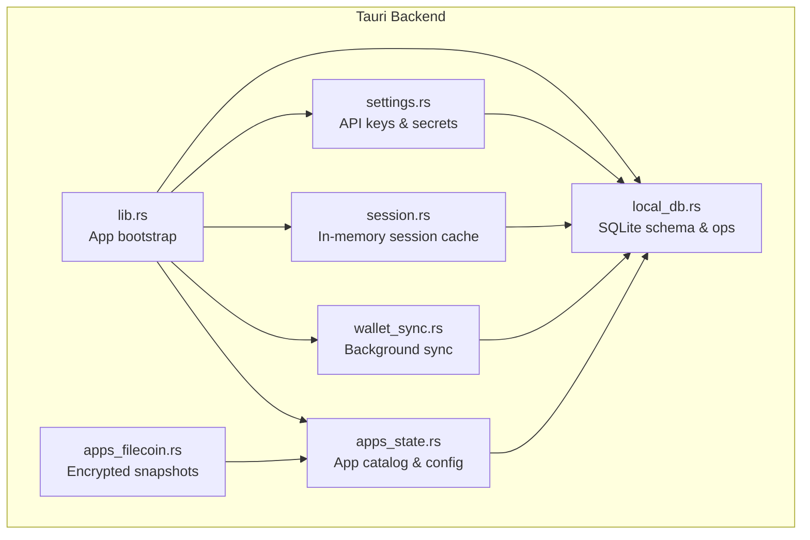
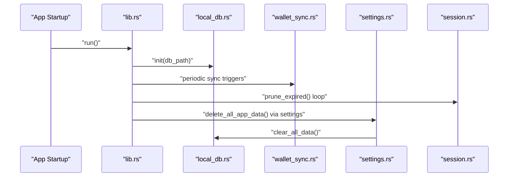
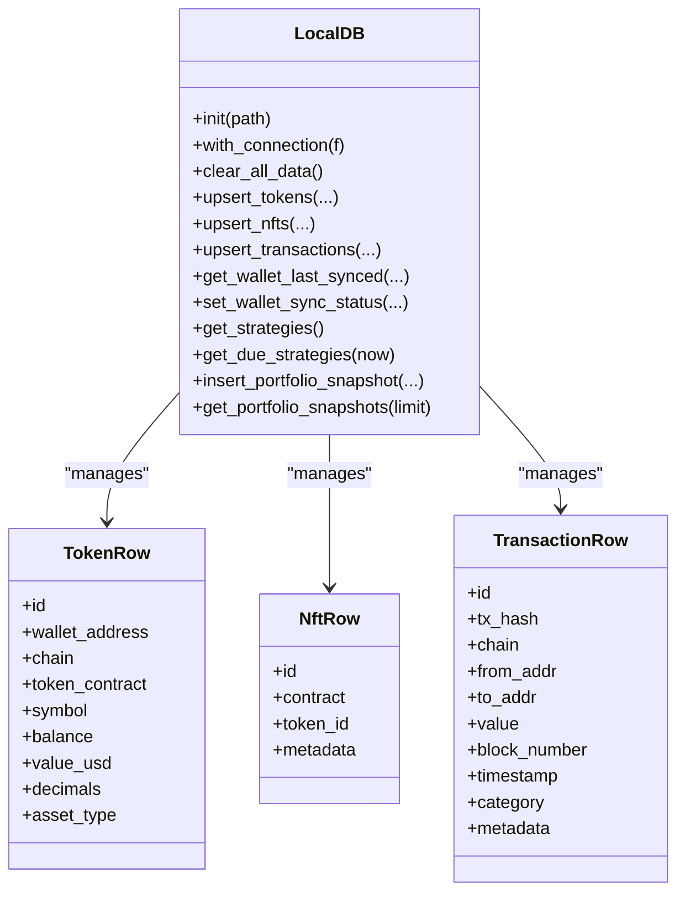
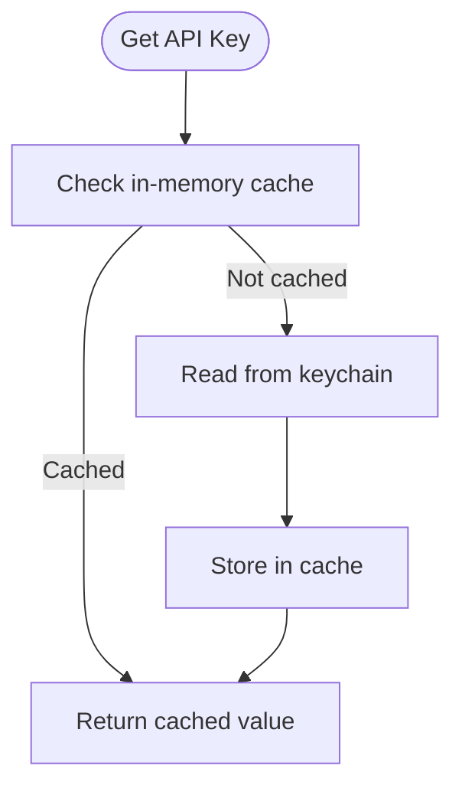
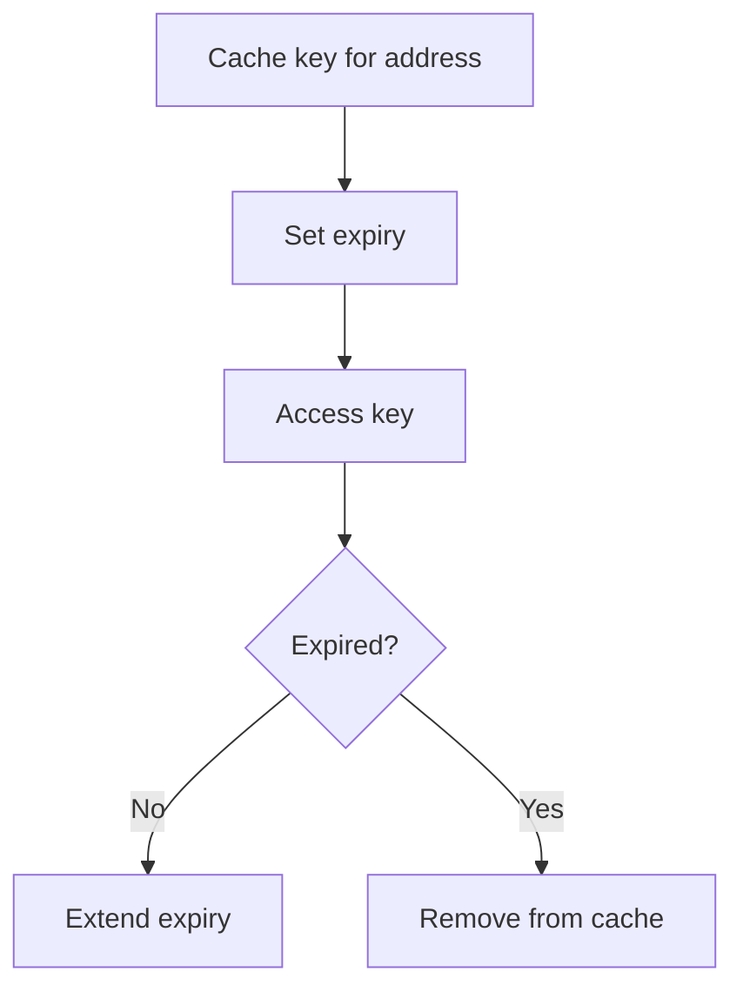
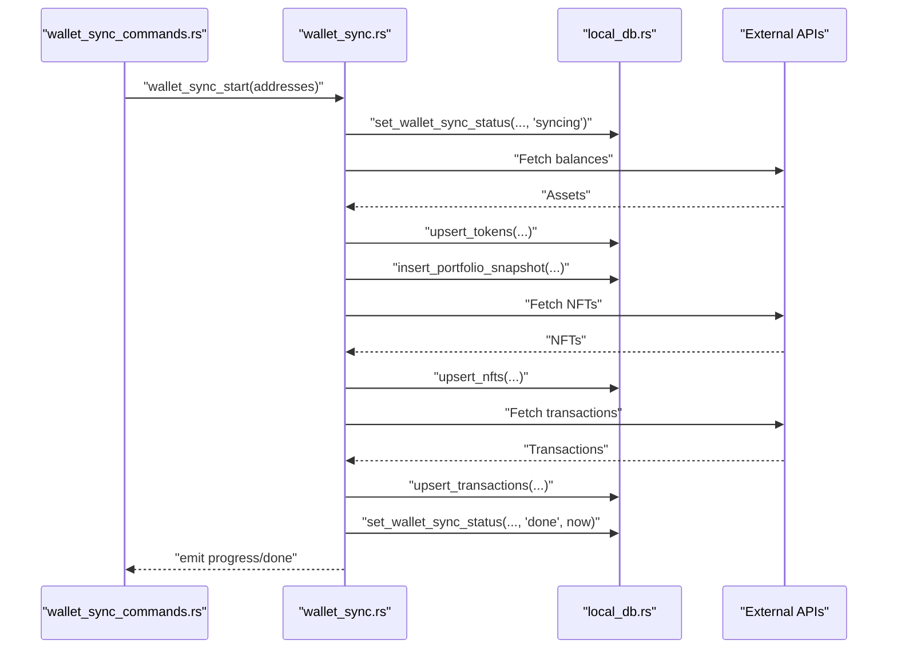
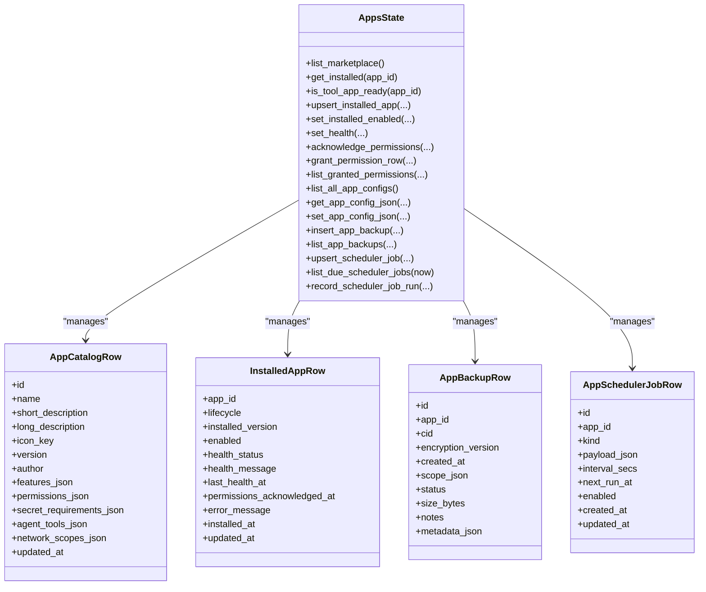
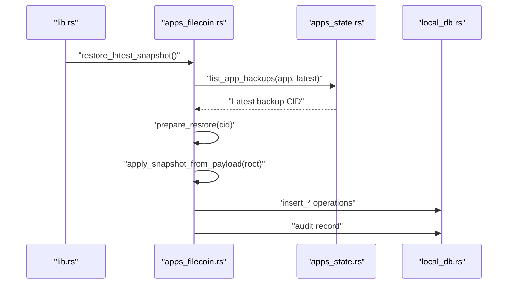
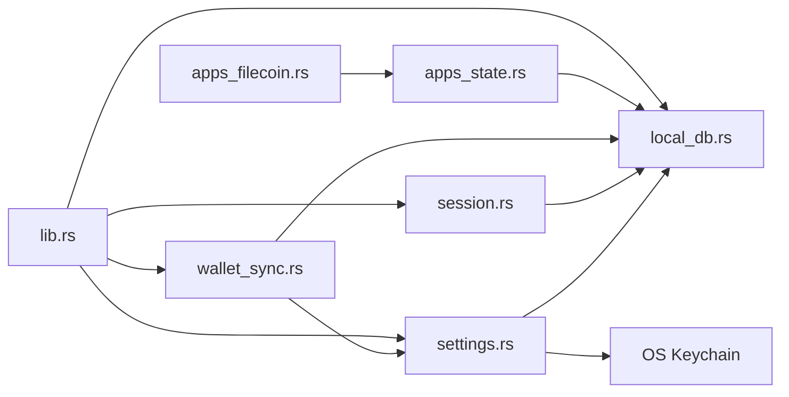

# Database & Storage Services

<cite>
**Referenced Files in This Document**
- [Cargo.toml](file://src-tauri/Cargo.toml)
- [lib.rs](file://src-tauri/src/lib.rs)
- [main.rs](file://src-tauri/src/main.rs)
- [local_db.rs](file://src-tauri/src/services/local_db.rs)
- [settings.rs](file://src-tauri/src/services/settings.rs)
- [session.rs](file://src-tauri/src/session.rs)
- [wallet_sync.rs](file://src-tauri/src/services/wallet_sync.rs)
- [wallet_sync_commands.rs](file://src-tauri/src/commands/wallet_sync.rs)
- [apps_state.rs](file://src-tauri/src/services/apps/state.rs)
- [apps_filecoin.rs](file://src-tauri/src/services/apps/filecoin.rs)
- [strategy_legacy.rs](file://src-tauri/src/services/strategy_legacy.rs)
</cite>

## Table of Contents
1. [Introduction](#introduction)
2. [Project Structure](#project-structure)
3. [Core Components](#core-components)
4. [Architecture Overview](#architecture-overview)
5. [Detailed Component Analysis](#detailed-component-analysis)
6. [Dependency Analysis](#dependency-analysis)
7. [Performance Considerations](#performance-considerations)
8. [Troubleshooting Guide](#troubleshooting-guide)
9. [Conclusion](#conclusion)
10. [Appendices](#appendices)

## Introduction
This document explains the database and local storage service architecture powering the application. It covers SQLite integration, schema management, data persistence strategies, connection handling, transaction management, data migration procedures, settings and session persistence, configuration storage, practical examples of database operations, schema updates, backup procedures, encryption at rest, secure storage mechanisms, data integrity verification, performance optimization, indexing strategies, query optimization techniques, and the relationship between local storage and cloud synchronization.

## Project Structure
The storage stack is implemented in the Tauri backend under src-tauri. The key modules are:
- Local database service: schema creation, migrations, CRUD helpers, and typed models
- Settings and session management: API key caching, biometric-backed secrets, and in-memory session cache
- Wallet synchronization: background sync pipeline to fetch tokens, NFTs, and transactions
- App catalog and configuration persistence: SQLite-backed catalogs, installations, backups, and scheduler jobs
- Cloud integration: encrypted app snapshots and auto-restore flows

**Diagram sources**
- [lib.rs:40-89](file://src-tauri/src/lib.rs#L40-L89)
- [local_db.rs:10-416](file://src-tauri/src/services/local_db.rs#L10-L416)
- [settings.rs:1-243](file://src-tauri/src/services/settings.rs#L1-L243)
- [session.rs:1-145](file://src-tauri/src/session.rs#L1-L145)
- [wallet_sync.rs:1-453](file://src-tauri/src/services/wallet_sync.rs#L1-L453)
- [apps_state.rs:1-458](file://src-tauri/src/services/apps/state.rs#L1-L458)
- [apps_filecoin.rs:72-97](file://src-tauri/src/services/apps/filecoin.rs#L72-L97)

**Section sources**
- [Cargo.toml:20-44](file://src-tauri/Cargo.toml#L20-L44)
- [lib.rs:40-89](file://src-tauri/src/lib.rs#L40-L89)

## Core Components
- Local database service
  - Initializes SQLite, creates schema, applies migrations, and exposes typed CRUD helpers
  - Provides models for tokens, NFTs, transactions, strategies, approvals, executions, audits, market data, and autonomous agent artifacts
  - Manages indexes for efficient queries
- Settings and session management
  - API key caching with in-memory locks and keychain-backed persistence
  - Biometric-backed secure storage for secrets
  - In-memory session cache for decrypted private keys with automatic expiry
- Wallet synchronization
  - Background pipeline to fetch balances, NFTs, and transactions from external APIs and persist locally
  - Emits progress and completion events
- App catalog and configuration
  - Catalog, installation state, permissions, configurations, backups, and scheduler jobs persisted in SQLite
- Cloud synchronization
  - Encrypted snapshot preparation and restoration for app data

**Section sources**
- [local_db.rs:10-416](file://src-tauri/src/services/local_db.rs#L10-L416)
- [settings.rs:1-243](file://src-tauri/src/services/settings.rs#L1-L243)
- [session.rs:1-145](file://src-tauri/src/session.rs#L1-L145)
- [wallet_sync.rs:1-453](file://src-tauri/src/services/wallet_sync.rs#L1-L453)
- [apps_state.rs:1-458](file://src-tauri/src/services/apps/state.rs#L1-L458)
- [apps_filecoin.rs:72-97](file://src-tauri/src/services/apps/filecoin.rs#L72-L97)

## Architecture Overview
The application initializes the local database during startup, sets up periodic maintenance, and orchestrates background tasks. Wallet synchronization is triggered periodically and emits progress updates. Settings and session caches provide secure, low-latency access to secrets and unlocked keys. App data is persisted in SQLite with indexes and migrations. Encrypted snapshots enable cloud-backed backup and restore.

**Diagram sources**
- [lib.rs:40-89](file://src-tauri/src/lib.rs#L40-L89)
- [local_db.rs:438-448](file://src-tauri/src/services/local_db.rs#L438-L448)
- [settings.rs:203-242](file://src-tauri/src/services/settings.rs#L203-L242)
- [session.rs:109-115](file://src-tauri/src/session.rs#L109-L115)
- [wallet_sync.rs:260-452](file://src-tauri/src/services/wallet_sync.rs#L260-L452)

## Detailed Component Analysis

### Local Database Service
- Schema management
  - Creates tables and indexes on initialization
  - Applies migrations to add new columns and backfills data
- Connection handling
  - Stores DB path in a thread-safe static mutex
  - Provides a scoped connection function to execute queries
- Typed models and operations
  - Tokens, NFTs, transactions, strategies, approvals, executions, audits, market data, and autonomous agent artifacts
  - Upserts, inserts, updates, deletes, and queries with pagination and filtering
- Indexes
  - Wallet-address and chain-based indexes for fast filtering
  - Timestamp and score-based indexes for ordering and ranking
- Migrations
  - Adds new columns with defaults and backfills legacy data

**Diagram sources**
- [local_db.rs:438-448](file://src-tauri/src/services/local_db.rs#L438-L448)
- [local_db.rs:1476-1597](file://src-tauri/src/services/local_db.rs#L1476-L1597)
- [local_db.rs:1713-1745](file://src-tauri/src/services/local_db.rs#L1713-L1745)

**Section sources**
- [local_db.rs:10-416](file://src-tauri/src/services/local_db.rs#L10-L416)
- [local_db.rs:438-448](file://src-tauri/src/services/local_db.rs#L438-L448)
- [local_db.rs:450-484](file://src-tauri/src/services/local_db.rs#L450-L484)
- [local_db.rs:1476-1597](file://src-tauri/src/services/local_db.rs#L1476-L1597)
- [local_db.rs:1600-1642](file://src-tauri/src/services/local_db.rs#L1600-L1642)
- [local_db.rs:1683-1710](file://src-tauri/src/services/local_db.rs#L1683-L1710)
- [local_db.rs:1712-1745](file://src-tauri/src/services/local_db.rs#L1712-L1745)

### Settings Management System
- API key caching
  - In-memory cache per key type with read/write locks
  - Reads from OS keychain on first access and caches for session lifetime
- Secrets storage
  - Keychain-backed entries for API keys and app secrets
  - Biometric-backed secure storage for wallet unlock data
- Environment fallback
  - Some keys support environment variable fallback
- Data deletion
  - Comprehensive cleanup of DB, keychain, session, and local files

**Diagram sources**
- [settings.rs:22-36](file://src-tauri/src/services/settings.rs#L22-L36)
- [settings.rs:84-101](file://src-tauri/src/services/settings.rs#L84-L101)
- [settings.rs:132-143](file://src-tauri/src/services/settings.rs#L132-L143)

**Section sources**
- [settings.rs:1-243](file://src-tauri/src/services/settings.rs#L1-L243)

### Session Persistence
- In-memory cache for decrypted private keys
  - Single active key retained at a time
  - Automatic expiry after inactivity
  - Secure wipe on clear
- Global pruning loop to keep memory footprint minimal

**Diagram sources**
- [session.rs:60-75](file://src-tauri/src/session.rs#L60-L75)
- [session.rs:31-46](file://src-tauri/src/session.rs#L31-L46)
- [session.rs:109-115](file://src-tauri/src/session.rs#L109-L115)

**Section sources**
- [session.rs:1-145](file://src-tauri/src/session.rs#L1-L145)

### Wallet Synchronization Pipeline
- Network selection
  - Base networks plus Flow when installed
- Steps
  - Fetch tokens and upsert into tokens table
  - Snapshot portfolio totals and top assets
  - Fetch NFTs per network and upsert into NFTs table
  - Fetch transactions per network and upsert into transactions table
- Progress and completion
  - Emits progress and completion events
- Post-sync actions
  - Captures portfolio snapshots and refreshes market opportunities

**Diagram sources**
- [wallet_sync_commands.rs:34-89](file://src-tauri/src/commands/wallet_sync.rs#L34-L89)
- [wallet_sync.rs:260-452](file://src-tauri/src/services/wallet_sync.rs#L260-L452)
- [local_db.rs:1476-1597](file://src-tauri/src/services/local_db.rs#L1476-L1597)
- [local_db.rs:556-583](file://src-tauri/src/services/local_db.rs#L556-L583)

**Section sources**
- [wallet_sync.rs:1-453](file://src-tauri/src/services/wallet_sync.rs#L1-L453)
- [wallet_sync_commands.rs:1-90](file://src-tauri/src/commands/wallet_sync.rs#L1-L90)

### App Catalog, Configuration, Backups, and Scheduler
- Catalog and installation state
  - Marketplace listing with installed status
  - Lifecycle transitions and health reporting
- Permissions and configurations
  - Permission grants and app-specific JSON configs
- Backups
  - Backup records with encryption version and metadata
- Scheduler
  - Jobs with intervals and next-run scheduling

**Diagram sources**
- [apps_state.rs:88-140](file://src-tauri/src/services/apps/state.rs#L88-L140)
- [apps_state.rs:183-212](file://src-tauri/src/services/apps/state.rs#L183-L212)
- [apps_state.rs:327-347](file://src-tauri/src/services/apps/state.rs#L327-L347)
- [apps_state.rs:378-403](file://src-tauri/src/services/apps/state.rs#L378-L403)

**Section sources**
- [apps_state.rs:1-458](file://src-tauri/src/services/apps/state.rs#L1-L458)

### Cloud Synchronization and Encrypted Snapshots
- Auto-restore flow for app data
  - Locates latest backup, prepares encrypted payload, decodes and validates, applies snapshot, records audit
- Encrypted backup preparation
  - Retrieves app secret, builds snapshot payload, encrypts, and stores metadata

**Diagram sources**
- [lib.rs:50-52](file://src-tauri/src/lib.rs#L50-L52)
- [apps_filecoin.rs:72-97](file://src-tauri/src/services/apps/filecoin.rs#L72-L97)
- [apps_state.rs:349-376](file://src-tauri/src/services/apps/state.rs#L349-L376)

**Section sources**
- [apps_filecoin.rs:72-97](file://src-tauri/src/services/apps/filecoin.rs#L72-L97)
- [apps_state.rs:327-376](file://src-tauri/src/services/apps/state.rs#L327-L376)

## Dependency Analysis
- SQLite integration
  - rusqlite with bundled feature for portability
  - Static DB path storage guarded by a mutex
- External integrations
  - reqwest for HTTP requests to external APIs
  - keyring and tauri-plugin-biometry for secure secrets
  - chrono for timestamp parsing
- Internal dependencies
  - Settings and session modules depend on local DB for clearing data
  - Wallet sync depends on settings for API keys and local DB for persistence
  - App state module depends on local DB for catalog and configuration persistence

**Diagram sources**
- [Cargo.toml:20-44](file://src-tauri/Cargo.toml#L20-L44)
- [lib.rs:40-89](file://src-tauri/src/lib.rs#L40-L89)
- [settings.rs:1-243](file://src-tauri/src/services/settings.rs#L1-L243)
- [session.rs:1-145](file://src-tauri/src/session.rs#L1-L145)
- [wallet_sync.rs:1-453](file://src-tauri/src/services/wallet_sync.rs#L1-L453)
- [apps_state.rs:1-458](file://src-tauri/src/services/apps/state.rs#L1-L458)
- [apps_filecoin.rs:72-97](file://src-tauri/src/services/apps/filecoin.rs#L72-L97)

**Section sources**
- [Cargo.toml:20-44](file://src-tauri/Cargo.toml#L20-L44)
- [lib.rs:40-89](file://src-tauri/src/lib.rs#L40-L89)

## Performance Considerations
- Indexing strategy
  - Wallet and chain indexes on tokens, NFTs, and transactions
  - Timestamp and score-based indexes for ordering and ranking
  - Composite indexes for category-chain filtering on market opportunities
- Query optimization
  - Pagination via LIMIT clauses
  - Sorting by timestamps and scores to leverage indexes
  - Upsert patterns to avoid full-table scans
- Concurrency and connection handling
  - Single DB path stored statically; each operation opens a new connection to minimize contention
  - Consider connection pooling for high-throughput scenarios
- Data volume management
  - Periodic pruning of stale tasks and approvals
  - Snapshotting portfolio totals to reduce aggregation cost

[No sources needed since this section provides general guidance]

## Troubleshooting Guide
- Database initialization failures
  - Ensure the app data directory exists and is writable
  - Verify schema creation and migration steps succeed
- Migration errors
  - Check for missing columns and backfill logic
  - Validate legacy strategy migration completeness
- Wallet sync errors
  - Confirm API key availability and validity
  - Inspect progress and completion events for failed steps
- Settings and session issues
  - Verify keychain entries and biometric data presence
  - Confirm in-memory cache state and expiry
- App backup/restore problems
  - Validate backup records and encryption version
  - Check snapshot payload integrity and scope

**Section sources**
- [local_db.rs:438-448](file://src-tauri/src/services/local_db.rs#L438-L448)
- [strategy_legacy.rs:355-379](file://src-tauri/src/services/strategy_legacy.rs#L355-L379)
- [wallet_sync.rs:260-452](file://src-tauri/src/services/wallet_sync.rs#L260-L452)
- [settings.rs:203-242](file://src-tauri/src/services/settings.rs#L203-L242)
- [session.rs:109-115](file://src-tauri/src/session.rs#L109-L115)
- [apps_state.rs:327-376](file://src-tauri/src/services/apps/state.rs#L327-L376)

## Conclusion
The storage architecture combines SQLite for local persistence, secure keychain-backed secrets, and in-memory session caching to deliver a robust, performant, and secure data layer. The schema and migrations ensure forward compatibility, while indexes and query patterns optimize performance. Cloud synchronization complements local storage with encrypted snapshots, enabling backup and restore workflows.

[No sources needed since this section summarizes without analyzing specific files]

## Appendices

### Practical Examples

- Database operations
  - Upsert tokens for a wallet and chain
    - [local_db.rs:1476-1513](file://src-tauri/src/services/local_db.rs#L1476-L1513)
  - Upsert NFTs for a wallet and chain
    - [local_db.rs:1516-1550](file://src-tauri/src/services/local_db.rs#L1516-L1550)
  - Upsert transactions for a wallet and chain
    - [local_db.rs:1553-1597](file://src-tauri/src/services/local_db.rs#L1553-L1597)
  - Get transactions for multiple wallets
    - [local_db.rs:1600-1642](file://src-tauri/src/services/local_db.rs#L1600-L1642)
  - Get NFTs for multiple wallets
    - [local_db.rs:1655-1680](file://src-tauri/src/services/local_db.rs#L1655-L1680)
  - Get tokens for multiple wallets
    - [local_db.rs:1683-1710](file://src-tauri/src/services/local_db.rs#L1683-L1710)
  - Insert portfolio snapshot
    - [local_db.rs:556-583](file://src-tauri/src/services/local_db.rs#L556-L583)
  - Get portfolio snapshots
    - [local_db.rs:586-609](file://src-tauri/src/services/local_db.rs#L586-L609)
  - Clear all data
    - [local_db.rs:612-644](file://src-tauri/src/services/local_db.rs#L612-L644)

- Schema updates and migrations
  - Add new columns with defaults and backfill data
    - [local_db.rs:450-484](file://src-tauri/src/services/local_db.rs#L450-L484)
  - Legacy strategy migration
    - [strategy_legacy.rs:355-379](file://src-tauri/src/services/strategy_legacy.rs#L355-L379)

- Data backup procedures
  - List app backups
    - [apps_state.rs:349-376](file://src-tauri/src/services/apps/state.rs#L349-L376)
  - Prepare encrypted backup
    - [apps_filecoin.rs:99-107](file://src-tauri/src/services/apps/filecoin.rs#L99-L107)
  - Restore latest snapshot
    - [apps_filecoin.rs:72-97](file://src-tauri/src/services/apps/filecoin.rs#L72-L97)

- Security and integrity
  - Delete all app data (DB, keychain, session, files)
    - [settings.rs:203-242](file://src-tauri/src/services/settings.rs#L203-L242)
  - In-memory session cache with secure wipe
    - [session.rs:78-84](file://src-tauri/src/session.rs#L78-L84)

**Section sources**
- [local_db.rs:556-644](file://src-tauri/src/services/local_db.rs#L556-L644)
- [local_db.rs:1476-1597](file://src-tauri/src/services/local_db.rs#L1476-L1597)
- [local_db.rs:1600-1710](file://src-tauri/src/services/local_db.rs#L1600-L1710)
- [apps_state.rs:349-376](file://src-tauri/src/services/apps/state.rs#L349-L376)
- [apps_filecoin.rs:72-107](file://src-tauri/src/services/apps/filecoin.rs#L72-L107)
- [settings.rs:203-242](file://src-tauri/src/services/settings.rs#L203-L242)
- [session.rs:78-84](file://src-tauri/src/session.rs#L78-L84)