# Enhanced Filecoin Integration

<cite>
**Referenced Files in This Document**
- [filecoin.ts](file://apps-runtime/src/providers/filecoin.ts)
- [filecoin.rs](file://src-tauri/src/services/apps/filecoin.rs)
- [main.ts](file://apps-runtime/src/main.ts)
- [runtime.rs](file://src-tauri/src/services/apps/runtime.rs)
- [payload.rs](file://src-tauri/src/services/apps/payload.rs)
- [state.rs](file://src-tauri/src/services/apps/state.rs)
- [integration_prompt.rs](file://src-tauri/src/services/apps/integration_prompt.rs)
- [filecoin.test.ts](file://apps-runtime/src/providers/filecoin.test.ts)
- [README.md](file://README.md)
</cite>

## Table of Contents
1. [Introduction](#introduction)
2. [Architecture Overview](#architecture-overview)
3. [Core Components](#core-components)
4. [Filecoin Storage Provider](#filecoin-storage-provider)
5. [Sidecar Runtime Integration](#sidecar-runtime-integration)
6. [Backup and Restore Pipeline](#backup-and-restore-pipeline)
7. [Configuration Management](#configuration-management)
8. [Data Payload Structure](#data-payload-structure)
9. [Cost Management](#cost-management)
10. [Security Model](#security-model)
11. [Performance Considerations](#performance-considerations)
12. [Troubleshooting Guide](#troubleshooting-guide)
13. [Conclusion](#conclusion)

## Introduction

The Enhanced Filecoin Integration represents a sophisticated backup and storage solution for SHADOW Protocol, leveraging Filecoin's decentralized storage network through the Synapse SDK. This integration provides encrypted, distributed storage of agent state, configurations, and portfolio data with automatic redundancy and cost management capabilities.

The system operates as a hybrid architecture combining Rust-based backend services with TypeScript/JavaScript frontends, utilizing a sidecar runtime pattern to isolate integration concerns while maintaining seamless user experience. The integration supports both automated and manual backup workflows, with comprehensive cost quoting and dataset management capabilities.

## Architecture Overview

The Filecoin integration follows a layered architecture pattern that ensures security, isolation, and maintainability:

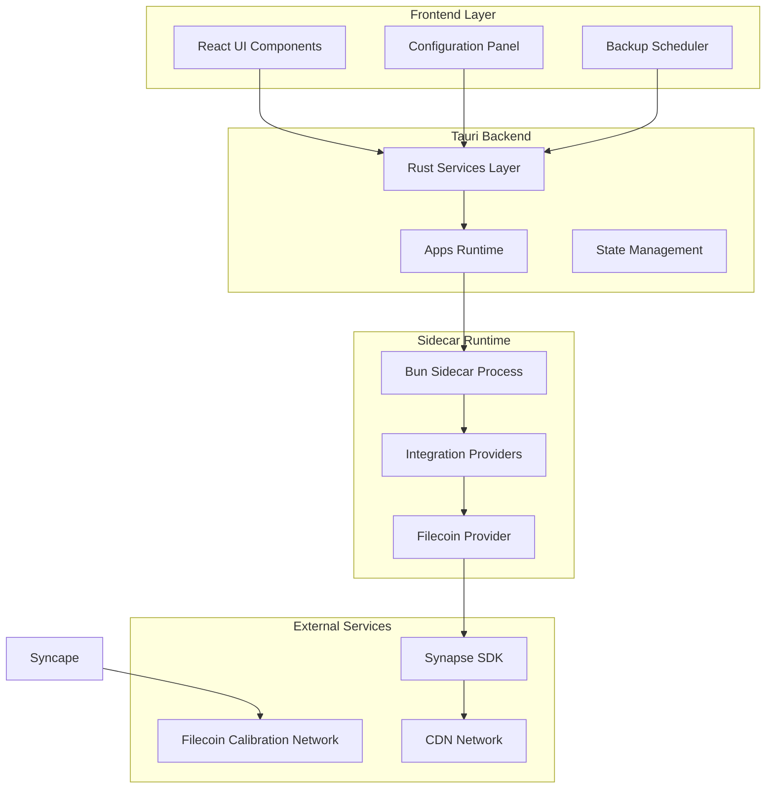

**Diagram sources**
- [filecoin.rs:1-405](file://src-tauri/src/services/apps/filecoin.rs#L1-L405)
- [runtime.rs:1-144](file://src-tauri/src/services/apps/runtime.rs#L1-L144)
- [main.ts:1-654](file://apps-runtime/src/main.ts#L1-L654)

The architecture ensures that sensitive operations remain within the secure Rust backend while providing flexible integration points through the sidecar runtime. The design follows SHADOW Protocol's security principles by keeping private keys and sensitive operations within the native layer.

**Section sources**
- [filecoin.rs:1-405](file://src-tauri/src/services/apps/filecoin.rs#L1-L405)
- [runtime.rs:1-144](file://src-tauri/src/services/apps/runtime.rs#L1-L144)
- [README.md:135-170](file://README.md#L135-L170)

## Core Components

### Filecoin Storage Provider Interface

The integration centers around a well-defined interface that abstracts Filecoin storage operations:

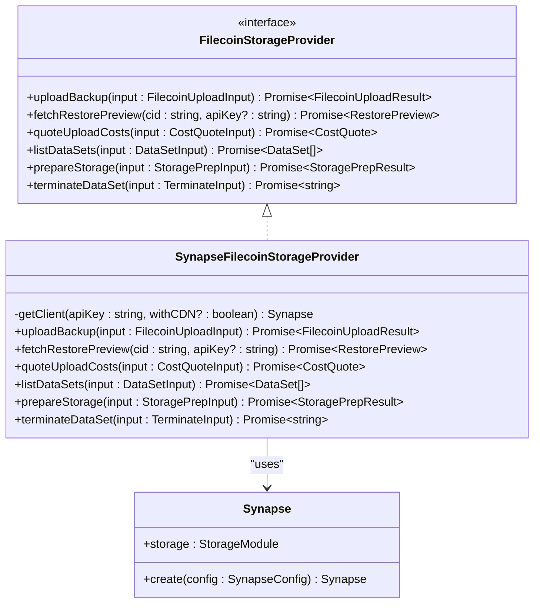

**Diagram sources**
- [filecoin.ts:42-63](file://apps-runtime/src/providers/filecoin.ts#L42-L63)
- [filecoin.ts:65-260](file://apps-runtime/src/providers/filecoin.ts#L65-L260)

The provider interface ensures consistent behavior across different storage backends while the Synapse implementation leverages the Filecoin ecosystem's capabilities. The design supports extensibility for future storage providers.

**Section sources**
- [filecoin.ts:42-63](file://apps-runtime/src/providers/filecoin.ts#L42-L63)
- [filecoin.ts:65-260](file://apps-runtime/src/providers/filecoin.ts#L65-L260)

### Sidecar Runtime Communication

The integration employs a robust communication mechanism between the Rust backend and the sidecar runtime:

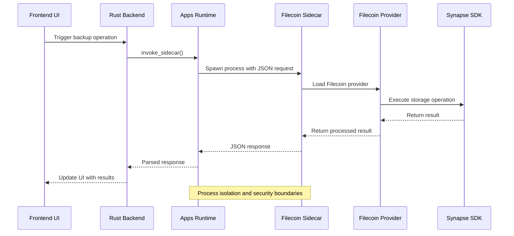

**Diagram sources**
- [runtime.rs:69-131](file://src-tauri/src/services/apps/runtime.rs#L69-L131)
- [main.ts:422-455](file://apps-runtime/src/main.ts#L422-L455)

The sidecar architecture provides process isolation, preventing potential security vulnerabilities from affecting the main application while maintaining efficient communication through JSON-based IPC.

**Section sources**
- [runtime.rs:69-131](file://src-tauri/src/services/apps/runtime.rs#L69-L131)
- [main.ts:422-455](file://apps-runtime/src/main.ts#L422-L455)

## Filecoin Storage Provider

### Implementation Details

The SynapseFilecoinStorageProvider implements comprehensive Filecoin storage functionality with robust error handling and validation:

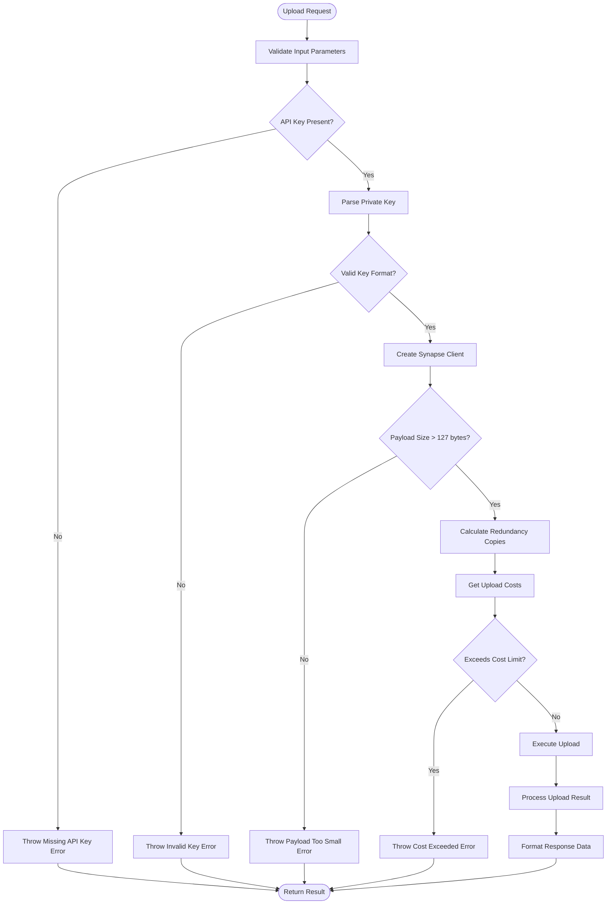

**Diagram sources**
- [filecoin.ts:144-241](file://apps-runtime/src/providers/filecoin.ts#L144-L241)

The provider implements strict validation for payload sizes, ensuring compliance with Filecoin's minimum requirements. The redundancy calculation logic optimizes storage costs while maintaining data availability guarantees.

**Section sources**
- [filecoin.ts:144-241](file://apps-runtime/src/providers/filecoin.ts#L144-L241)

### Key Features

The Filecoin storage provider offers several advanced features:

- **Encrypted Payload Handling**: All data is encrypted before transmission to Filecoin storage
- **Redundancy Control**: Configurable redundancy levels (1-5 copies) for data durability
- **Cost Management**: Built-in cost limiting and quote validation
- **CDN Integration**: Optional Content Delivery Network for improved access speeds
- **Auto-renewal**: Automatic dataset renewal capabilities
- **Multi-format Support**: Handles various data formats and sizes

## Sidecar Runtime Integration

### Process Management

The sidecar runtime provides isolated execution environments for integration providers:

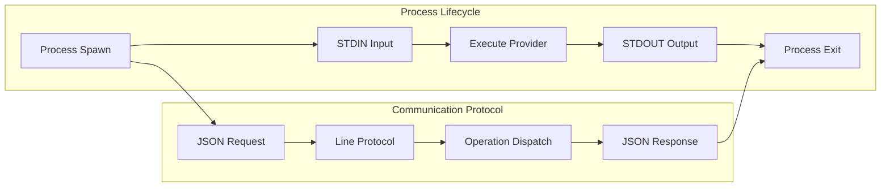

**Diagram sources**
- [runtime.rs:77-131](file://src-tauri/src/services/apps/runtime.rs#L77-L131)
- [main.ts:77-109](file://apps-runtime/src/main.ts#L77-L109)

The runtime enforces strict process isolation with automatic cleanup and resource management. Each operation runs in a separate process to prevent state leakage and ensure system stability.

**Section sources**
- [runtime.rs:49-131](file://src-tauri/src/services/apps/runtime.rs#L49-L131)
- [main.ts:77-109](file://apps-runtime/src/main.ts#L77-L109)

### Operation Types

The sidecar supports multiple Filecoin operations through a unified interface:

| Operation | Purpose | Parameters |
|-----------|---------|------------|
| `filecoin.backup_upload` | Upload encrypted backup | ciphertextHex, scope, apiKey, policy |
| `filecoin.restore_fetch` | Download and decrypt backup | cid, apiKey |
| `filecoin.cost_quote` | Get storage cost estimate | apiKey, dataSize, withCDN |
| `filecoin.storage_prepare` | Prepare storage allocation | apiKey, dataSize |
| `filecoin.datasets_list` | List active datasets | apiKey |
| `filecoin.dataset_terminate` | Terminate storage dataset | apiKey, dataSetId |

Each operation follows the same JSON protocol, ensuring consistency and reliability across all Filecoin operations.

**Section sources**
- [main.ts:422-510](file://apps-runtime/src/main.ts#L422-L510)

## Backup and Restore Pipeline

### Automated Backup Workflow

The backup system implements a comprehensive automated workflow that captures agent state and configuration data:

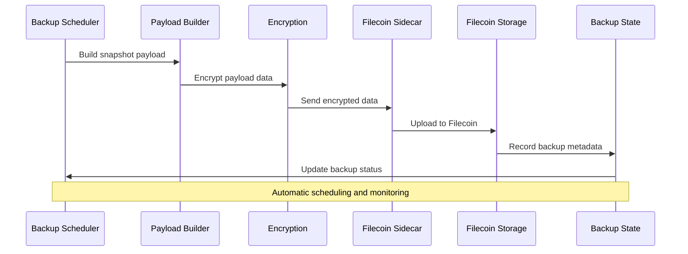

**Diagram sources**
- [filecoin.rs:303-326](file://src-tauri/src/services/apps/filecoin.rs#L303-L326)
- [payload.rs:18-143](file://src-tauri/src/services/apps/payload.rs#L18-L143)

The automated workflow captures agent memory, soul data, app configurations, strategies, transaction history, and portfolio snapshots based on configurable scope parameters.

**Section sources**
- [filecoin.rs:303-326](file://src-tauri/src/services/apps/filecoin.rs#L303-L326)
- [payload.rs:18-143](file://src-tauri/src/services/apps/payload.rs#L18-L143)

### Restore Process

The restore process provides secure recovery of backed-up data:

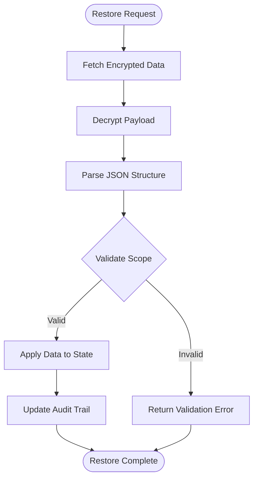

**Diagram sources**
- [filecoin.rs:138-186](file://src-tauri/src/services/apps/filecoin.rs#L138-L186)

The restore process validates data integrity, applies updates to the local state, and maintains comprehensive audit trails for security and compliance purposes.

**Section sources**
- [filecoin.rs:138-186](file://src-tauri/src/services/apps/filecoin.rs#L138-L186)

## Configuration Management

### Integration Configuration

The Filecoin integration supports flexible configuration through structured JSON objects:

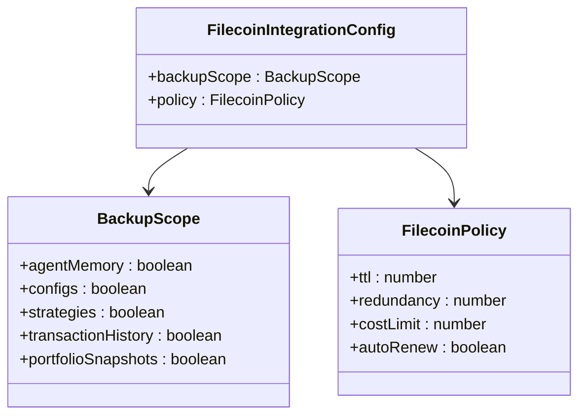

**Diagram sources**
- [apps.ts:517-544](file://src/lib/apps.ts#L517-L544)

The configuration system allows fine-grained control over what data gets backed up, how redundancy is managed, and cost constraints applied to storage operations.

**Section sources**
- [apps.ts:517-544](file://src/lib/apps.ts#L517-L544)

### State Persistence

Backup metadata and configuration are persisted in SQLite databases with comprehensive indexing and querying capabilities:

| Table | Purpose | Key Fields |
|-------|---------|------------|
| `app_backups` | Backup records | id, app_id, cid, status, created_at |
| `app_configs` | Integration configs | app_id, config_json, updated_at |
| `installed_apps` | App installation state | app_id, enabled, lifecycle |

The database schema supports efficient querying, backup history tracking, and integration health monitoring.

**Section sources**
- [state.rs:52-65](file://src-tauri/src/services/apps/state.rs#L52-L65)
- [state.rs:327-347](file://src-tauri/src/services/apps/state.rs#L327-L347)

## Data Payload Structure

### Snapshot Format

The backup payload follows a structured JSON format designed for extensibility and security:

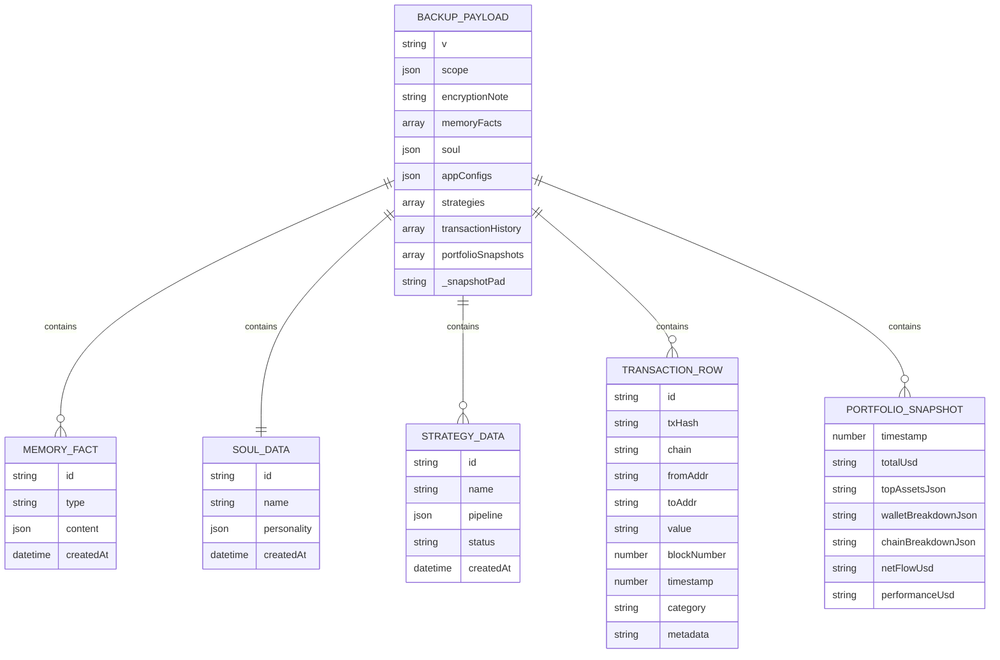

**Diagram sources**
- [payload.rs:18-143](file://src-tauri/src/services/apps/payload.rs#L18-L143)

The payload structure supports incremental updates, efficient compression, and future extensibility for additional data types.

**Section sources**
- [payload.rs:18-143](file://src-tauri/src/services/apps/payload.rs#L18-L143)

### Encryption and Security

All backup data undergoes client-side encryption before transmission to Filecoin storage. The encryption process includes:

- AES-GCM symmetric encryption
- Random salt generation
- HMAC authentication
- Key derivation from user's wallet seed
- Zeroization of sensitive buffers

This approach ensures data confidentiality even if Filecoin storage nodes are compromised.

## Cost Management

### Pricing Model

The integration implements sophisticated cost management with real-time pricing and budget controls:

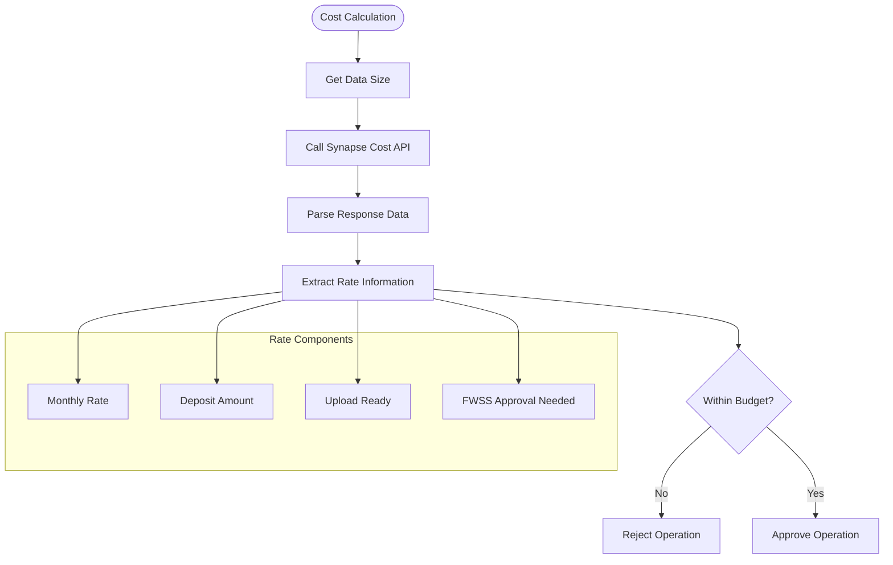

**Diagram sources**
- [filecoin.ts:85-107](file://apps-runtime/src/providers/filecoin.ts#L85-L107)
- [filecoin.rs:329-356](file://src-tauri/src/services/apps/filecoin.rs#L329-L356)

The cost management system provides transparency and control over storage expenses while ensuring operational continuity.

**Section sources**
- [filecoin.ts:85-107](file://apps-runtime/src/providers/filecoin.ts#L85-L107)
- [filecoin.rs:329-356](file://src-tauri/src/services/apps/filecoin.rs#L329-L356)

### Budget Controls

Multiple layers of budget protection prevent unexpected costs:

- **Per-operation cost limits**: Individual upload cost caps
- **Cumulative spending limits**: Daily/weekly/monthly budgets
- **Approval thresholds**: Large operations require manual approval
- **Graceful degradation**: Operations continue with reduced redundancy when budgets are exceeded

## Security Model

### Key Management

The integration leverages SHADOW Protocol's secure key management system:

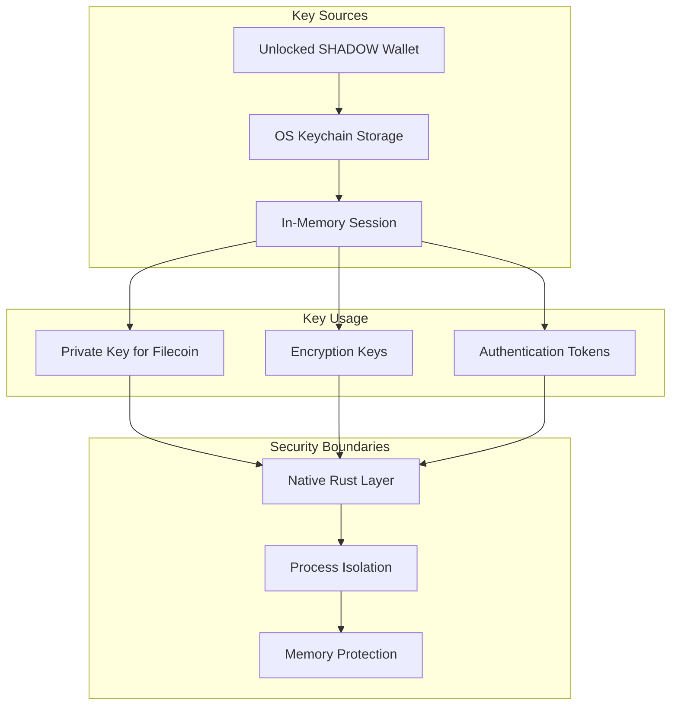

**Diagram sources**
- [filecoin.rs:13-17](file://src-tauri/src/services/apps/filecoin.rs#L13-L17)
- [runtime.rs:77-84](file://src-tauri/src/services/apps/runtime.rs#L77-L84)

The security model ensures that private keys never leave the secure native layer and are automatically cleared when sessions expire.

**Section sources**
- [filecoin.rs:13-17](file://src-tauri/src/services/apps/filecoin.rs#L13-L17)
- [runtime.rs:77-84](file://src-tauri/src/services/apps/runtime.rs#L77-L84)

### Data Protection

Data protection encompasses multiple security layers:

- **Transport encryption**: All data transmitted to Filecoin is encrypted
- **Storage encryption**: Data is encrypted before leaving the client
- **Process isolation**: Sidecar processes run in separate memory spaces
- **Zeroization**: Sensitive data is automatically cleared from memory
- **Audit logging**: All operations are logged for security monitoring

## Performance Considerations

### Optimization Strategies

The integration implements several performance optimization techniques:

- **Lazy loading**: Providers are loaded only when needed
- **Connection pooling**: Reuse of Synapse connections where possible
- **Background processing**: Long-running operations don't block UI
- **Compression**: Efficient compression reduces storage costs
- **Caching**: Frequently accessed data is cached locally

### Scalability Features

The system scales effectively through:

- **Asynchronous processing**: Non-blocking operations for better responsiveness
- **Batch operations**: Multiple datasets can be processed concurrently
- **Resource limits**: Configurable limits prevent resource exhaustion
- **Progress tracking**: Users receive real-time feedback on operation status

## Troubleshooting Guide

### Common Issues and Solutions

| Issue | Symptoms | Solution |
|-------|----------|----------|
| Authentication failures | "Wallet locked" errors | Unlock SHADOW wallet session |
| Upload failures | "Invalid Filecoin Private Key" | Verify API key format and validity |
| Cost exceeded | "Quoted deposit exceeds configured cost cap" | Increase budget limit or reduce redundancy |
| Network timeouts | Operation timed out errors | Check internet connectivity and retry |
| Storage not ready | "Upload not ready" status | Wait for network confirmation and retry |

### Debugging Procedures

1. **Verify wallet state**: Ensure SHADOW wallet is unlocked
2. **Check API key validity**: Validate Filecoin private key format
3. **Monitor network status**: Confirm Filecoin Calibration network connectivity
4. **Review backup logs**: Check application logs for detailed error messages
5. **Test connectivity**: Use health check operations to verify system status

**Section sources**
- [filecoin.ts:67-82](file://apps-runtime/src/providers/filecoin.ts#L67-L82)
- [filecoin.rs:13-17](file://src-tauri/src/services/apps/filecoin.rs#L13-L17)

## Conclusion

The Enhanced Filecoin Integration represents a comprehensive solution for decentralized data storage within SHADOW Protocol. The integration successfully combines security, reliability, and user experience through its layered architecture, robust error handling, and comprehensive feature set.

Key achievements include:

- **Security-first design**: Private keys and sensitive operations remain within secure native boundaries
- **Decentralized storage**: Leverages Filecoin's distributed network for reliable data preservation
- **Flexible configuration**: Granular control over backup scope, redundancy, and costs
- **Automated operations**: Seamless backup scheduling with minimal user intervention
- **Transparent pricing**: Real-time cost estimation and budget management
- **Robust error handling**: Comprehensive validation and graceful degradation

The integration serves as a foundation for future enhancements, including expanded storage providers, advanced analytics, and enhanced automation capabilities. Its modular design ensures compatibility with evolving Filecoin ecosystem developments while maintaining SHADOW Protocol's core security and privacy principles.