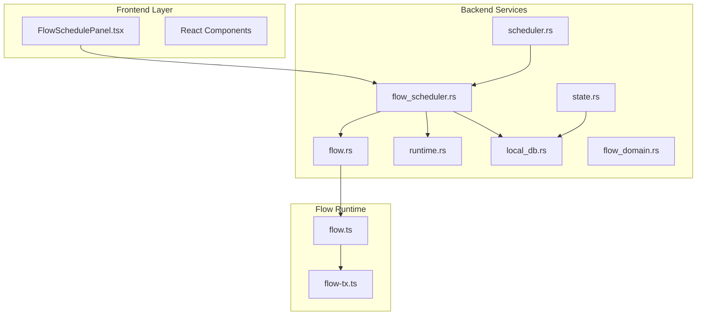
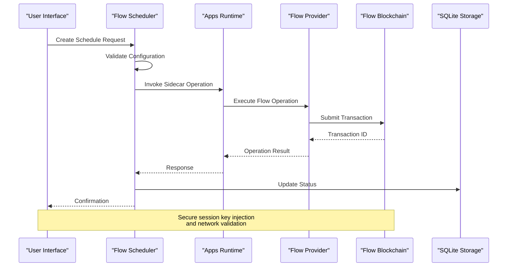
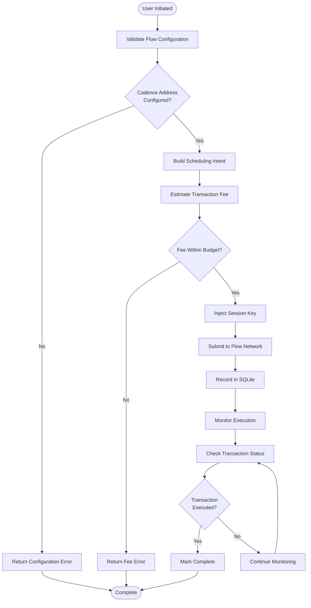
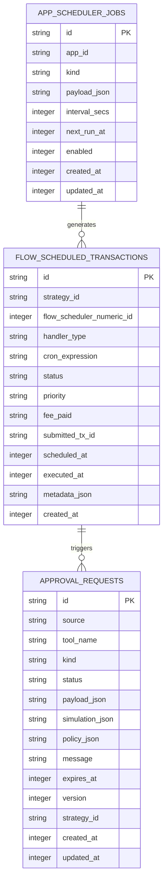
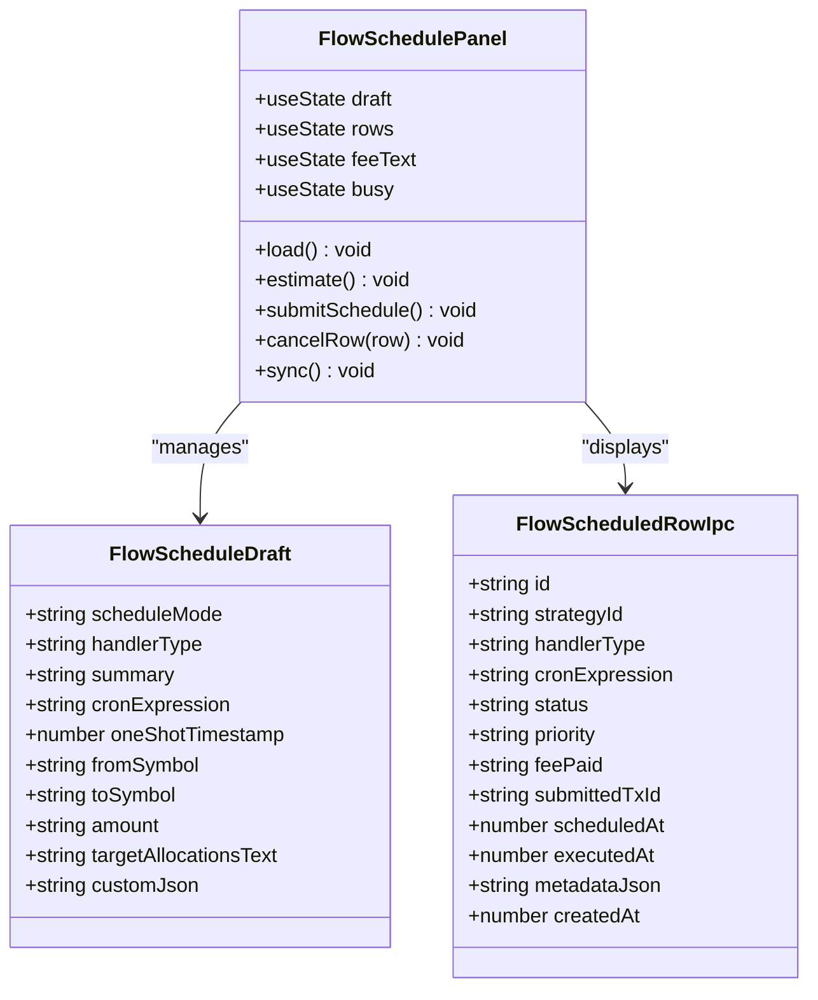
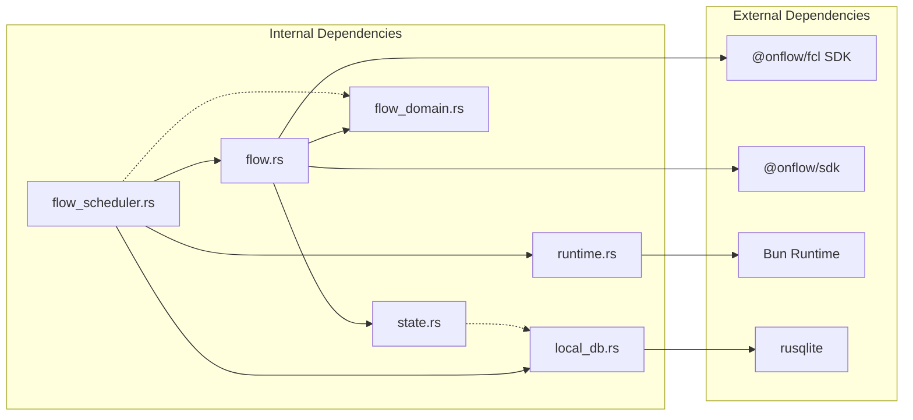

# Flow Blockchain Transaction Scheduling

<cite>
**Referenced Files in This Document**
- [flow_scheduler.rs](file://src-tauri/src/services/apps/flow_scheduler.rs)
- [flow.rs](file://src-tauri/src/services/apps/flow.rs)
- [runtime.rs](file://src-tauri/src/services/apps/runtime.rs)
- [local_db.rs](file://src-tauri/src/services/local_db.rs)
- [state.rs](file://src-tauri/src/services/apps/state.rs)
- [flow_domain.rs](file://src-tauri/src/services/flow_domain.rs)
- [FlowSchedulePanel.tsx](file://src/components/strategy/FlowSchedulePanel.tsx)
- [flow-tx.ts](file://apps-runtime/src/providers/flow-tx.ts)
- [flow.ts](file://apps-runtime/src/providers/flow.ts)
- [scheduler.rs](file://src-tauri/src/services/apps/scheduler.rs)
</cite>

## Table of Contents
1. [Introduction](#introduction)
2. [Project Structure](#project-structure)
3. [Core Components](#core-components)
4. [Architecture Overview](#architecture-overview)
5. [Detailed Component Analysis](#detailed-component-analysis)
6. [Dependency Analysis](#dependency-analysis)
7. [Performance Considerations](#performance-considerations)
8. [Troubleshooting Guide](#troubleshooting-guide)
9. [Conclusion](#conclusion)

## Introduction

The Flow Blockchain Transaction Scheduling system in Shadow Protocol provides a comprehensive framework for creating, managing, and executing scheduled transactions on the Flow blockchain. This system enables users to set up recurring financial operations, one-time transactions, and automated trading strategies through a secure, auditable interface that integrates with the broader Shadow Protocol ecosystem.

The system combines a Rust-based backend with a TypeScript/React frontend, utilizing Flow's native Cadence programming language for blockchain operations. It supports both manual user-initiated schedules and automated agent-driven executions, providing robust transaction management with comprehensive logging and status tracking.

## Project Structure

The Flow transaction scheduling system is organized across multiple layers within the Shadow Protocol architecture:

**Diagram sources**
- [flow_scheduler.rs:1-277](file://src-tauri/src/services/apps/flow_scheduler.rs#L1-L277)
- [flow.rs:1-164](file://src-tauri/src/services/apps/flow.rs#L1-L164)
- [runtime.rs:1-144](file://src-tauri/src/services/apps/runtime.rs#L1-L144)

The system follows a layered architecture pattern where the frontend provides user interaction, the backend handles business logic and data persistence, and the Flow runtime manages blockchain operations through secure sidecar processes.

**Section sources**
- [flow_scheduler.rs:1-277](file://src-tauri/src/services/apps/flow_scheduler.rs#L1-L277)
- [flow.rs:1-164](file://src-tauri/src/services/apps/flow.rs#L1-L164)
- [runtime.rs:1-144](file://src-tauri/src/services/apps/runtime.rs#L1-L144)

## Core Components

### Flow Scheduler Service

The core scheduler service orchestrates all Flow transaction scheduling operations through a centralized Rust module that handles:

- **Transaction Submission**: Processes user requests to schedule Flow transactions
- **Fee Estimation**: Calculates transaction costs using FlowTransactionScheduler
- **Status Tracking**: Monitors transaction execution status and updates local records
- **Cancellation Management**: Handles cancel intent logging for scheduled transactions

The scheduler service maintains a comprehensive SQLite database schema specifically designed for Flow transaction tracking, including support for cron expressions, execution priorities, and detailed metadata storage.

### Flow Adapter Layer

The Flow adapter provides essential blockchain integration capabilities:

- **Account Management**: Validates and manages Flow account configurations
- **Network Detection**: Automatically detects Flow network (mainnet/testnet) from app settings
- **Transaction Preparation**: Prepares sponsored transactions with proper session key injection
- **Balance Queries**: Fetches Flow token balances through REST access nodes

### Runtime Integration

The system utilizes a secure sidecar architecture for Flow operations:

- **Isolated Processes**: Each Flow operation runs in separate Bun processes for crash isolation
- **Session Key Security**: Manages private key material securely during transaction signing
- **Timeout Management**: Implements strict timeouts for all external blockchain operations
- **Error Handling**: Provides comprehensive error propagation and logging

### Frontend Interface

The React-based user interface offers intuitive controls for:

- **Schedule Creation**: Supports recurring cron schedules and one-time executions
- **Fee Estimation**: Real-time fee calculation with network-specific pricing
- **Status Monitoring**: Live transaction status updates and historical tracking
- **Approval Workflows**: Integration with Shadow Protocol's approval system for automated transactions

**Section sources**
- [flow_scheduler.rs:37-130](file://src-tauri/src/services/apps/flow_scheduler.rs#L37-L130)
- [flow.rs:9-34](file://src-tauri/src/services/apps/flow.rs#L9-L34)
- [runtime.rs:69-131](file://src-tauri/src/services/apps/runtime.rs#L69-L131)
- [FlowSchedulePanel.tsx:148-267](file://src/components/strategy/FlowSchedulePanel.tsx#L148-L267)

## Architecture Overview

The Flow transaction scheduling system implements a distributed architecture that ensures security, reliability, and scalability:

**Diagram sources**
- [flow_scheduler.rs:68-130](file://src-tauri/src/services/apps/flow_scheduler.rs#L68-L130)
- [runtime.rs:69-131](file://src-tauri/src/services/apps/runtime.rs#L69-L131)
- [flow.ts:314-338](file://apps-runtime/src/providers/flow.ts#L314-L338)

The architecture emphasizes security through session key isolation, network detection, and comprehensive error handling. All blockchain operations are performed through secure sidecar processes that prevent direct access to sensitive cryptographic material.

**Section sources**
- [flow_scheduler.rs:12-23](file://src-tauri/src/services/apps/flow_scheduler.rs#L12-L23)
- [flow.rs:129-163](file://src-tauri/src/services/apps/flow.rs#L129-L163)
- [flow-tx.ts:57-102](file://apps-runtime/src/providers/flow-tx.ts#L57-L102)

## Detailed Component Analysis

### Transaction Scheduling Workflow

The transaction scheduling process follows a multi-stage workflow that ensures reliability and auditability:

**Diagram sources**
- [flow_scheduler.rs:68-130](file://src-tauri/src/services/apps/flow_scheduler.rs#L68-L130)
- [flow_scheduler.rs:193-211](file://src-tauri/src/services/apps/flow_scheduler.rs#L193-L211)

### Database Schema Design

The SQLite database schema for Flow transaction tracking includes specialized tables and indexes optimized for performance:

**Diagram sources**
- [local_db.rs:309-323](file://src-tauri/src/services/local_db.rs#L309-L323)
- [local_db.rs:279-289](file://src-tauri/src/services/local_db.rs#L279-L289)

The schema includes comprehensive indexing strategies to optimize frequent queries for status monitoring, recent transactions, and strategy associations.

### Frontend User Experience

The React-based interface provides an intuitive workflow for transaction scheduling:

**Diagram sources**
- [FlowSchedulePanel.tsx:148-163](file://src/components/strategy/FlowSchedulePanel.tsx#L148-L163)
- [FlowSchedulePanel.tsx:1-100](file://src/components/strategy/FlowSchedulePanel.tsx#L1-L100)

**Section sources**
- [flow_scheduler.rs:254-276](file://src-tauri/src/services/apps/flow_scheduler.rs#L254-L276)
- [local_db.rs:2828-2951](file://src-tauri/src/services/local_db.rs#L2828-L2951)
- [FlowSchedulePanel.tsx:1-100](file://src/components/strategy/FlowSchedulePanel.tsx#L1-L100)

### Security and Validation

The system implements multiple layers of security and validation:

- **Session Key Isolation**: Private keys are injected only during transaction signing operations
- **Network Validation**: Automatic detection and enforcement of correct Flow network configuration
- **Address Validation**: Comprehensive validation of Flow account addresses using domain-specific logic
- **Transaction Limits**: Configurable execution limits to prevent excessive resource consumption
- **Approval Workflows**: Integration with Shadow Protocol's approval system for automated transactions

**Section sources**
- [flow.rs:9-34](file://src-tauri/src/services/apps/flow.rs#L9-L34)
- [flow-tx.ts:68-70](file://apps-runtime/src/providers/flow-tx.ts#L68-L70)
- [flow_domain.rs:10-32](file://src-tauri/src/services/flow_domain.rs#L10-L32)

## Dependency Analysis

The Flow transaction scheduling system exhibits well-structured dependencies that promote maintainability and testability:

**Diagram sources**
- [flow_scheduler.rs:1-11](file://src-tauri/src/services/apps/flow_scheduler.rs#L1-L11)
- [flow.rs:1-8](file://src-tauri/src/services/apps/flow.rs#L1-L8)
- [runtime.rs:1-12](file://src-tauri/src/services/apps/runtime.rs#L1-L12)

The dependency graph reveals a clean separation of concerns where each module has a specific responsibility and minimal coupling to other components. This design facilitates independent testing and maintenance of individual system components.

**Section sources**
- [flow_scheduler.rs:1-11](file://src-tauri/src/services/apps/flow_scheduler.rs#L1-L11)
- [flow.rs:1-8](file://src-tauri/src/services/apps/flow.rs#L1-L8)
- [runtime.rs:1-12](file://src-tauri/src/services/apps/runtime.rs#L1-L12)

## Performance Considerations

The Flow transaction scheduling system incorporates several performance optimization strategies:

### Asynchronous Processing
- Non-blocking transaction submission through sidecar processes
- Concurrent status polling for multiple scheduled transactions
- Background synchronization operations to minimize UI blocking

### Database Optimization
- Indexed queries for frequently accessed transaction statuses
- Batch operations for bulk status updates
- Efficient pagination for large transaction histories

### Network Efficiency
- Connection pooling for Flow API requests
- Optimized fee estimation caching
- Reduced network calls through intelligent retry logic

### Memory Management
- Stream-based processing for large transaction payloads
- Proper resource cleanup in sidecar processes
- Garbage collection optimization for long-running sessions

## Troubleshooting Guide

### Common Issues and Solutions

**Transaction Submission Failures**
- Verify Flow account configuration in app settings
- Check network connectivity to Flow access nodes
- Ensure sufficient FLOW balance for transaction fees
- Confirm session key unlock status

**Status Update Delays**
- Monitor network congestion on Flow blockchain
- Check local database connectivity
- Verify sidecar process health
- Review timeout configurations

**Fee Estimation Errors**
- Validate execution effort parameters
- Check priority level compatibility
- Ensure correct data size measurements
- Verify network selection accuracy

**Security Concerns**
- Monitor session key injection logs
- Verify transaction authorization signatures
- Check for unauthorized access attempts
- Review approval workflow compliance

**Section sources**
- [flow_scheduler.rs:193-211](file://src-tauri/src/services/apps/flow_scheduler.rs#L193-L211)
- [runtime.rs:104-131](file://src-tauri/src/services/apps/runtime.rs#L104-L131)

## Conclusion

The Flow Blockchain Transaction Scheduling system represents a sophisticated integration of modern web technologies with blockchain infrastructure. Through its layered architecture, comprehensive security measures, and user-friendly interface, it provides a reliable foundation for automated financial operations on the Flow blockchain.

The system's strength lies in its modular design, which enables independent development and testing of components while maintaining cohesive functionality. The combination of Rust-based backend services, secure sidecar processes, and React-based frontend creates a robust platform that can scale to meet the demands of complex financial automation scenarios.

Future enhancements could include expanded transaction types, advanced analytics capabilities, and integration with additional blockchain networks. The current architecture provides a solid foundation for such extensions while maintaining the security and reliability that are paramount for financial applications.