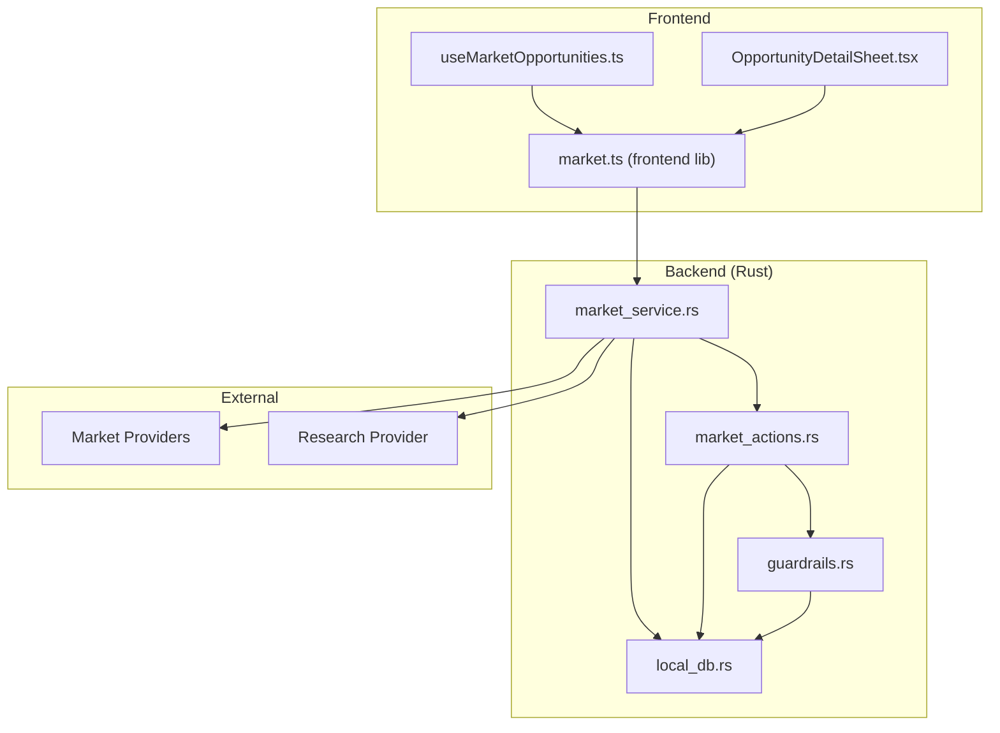
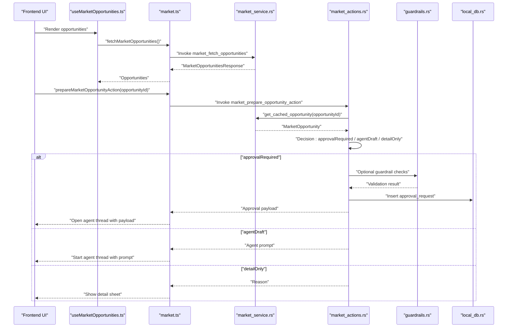
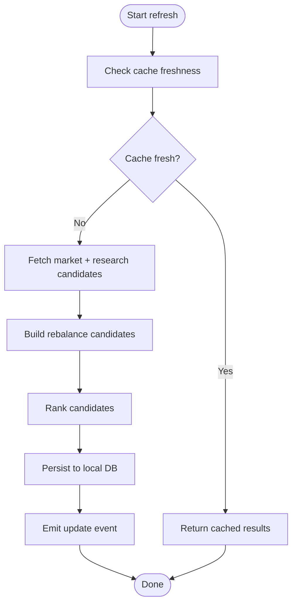
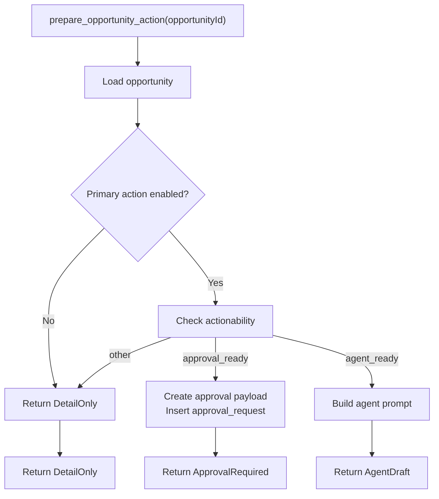
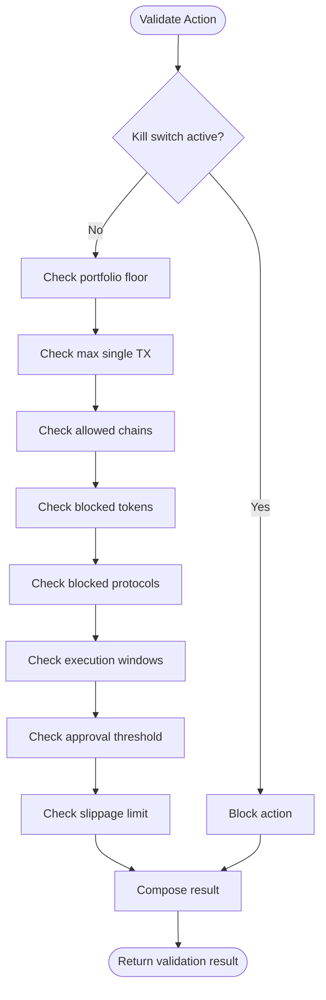
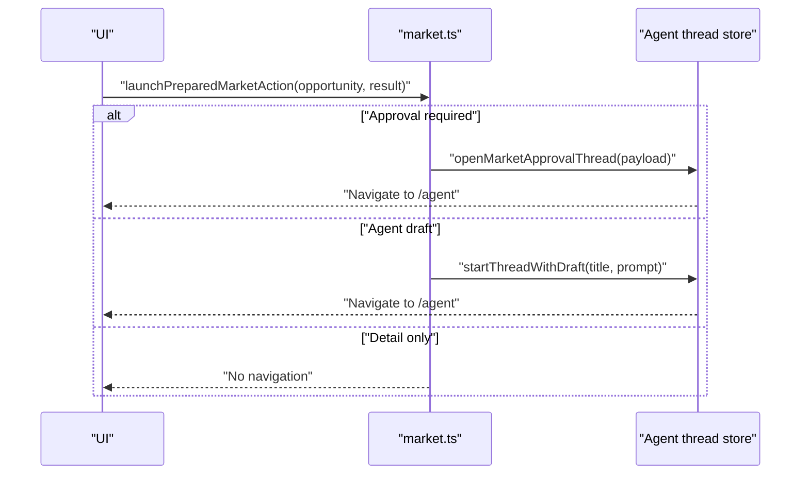
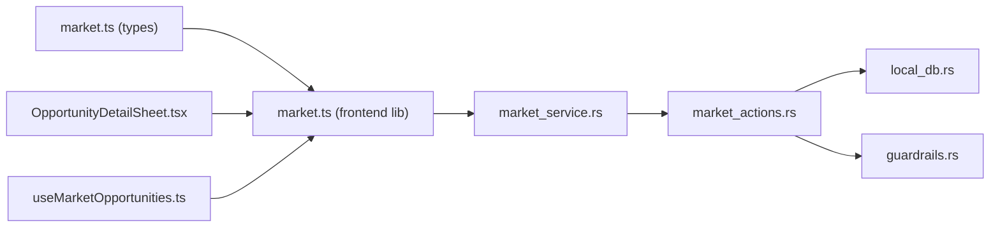

# Market Action Preparation

<cite>
**Referenced Files in This Document**
- [market.ts](file://src/lib/market.ts)
- [market.ts](file://src/types/market.ts)
- [market_actions.rs](file://src-tauri/src/services/market_actions.rs)
- [market_service.rs](file://src-tauri/src/services/market_service.rs)
- [guardrails.rs](file://src-tauri/src/services/guardrails.rs)
- [local_db.rs](file://src-tauri/src/services/local_db.rs)
- [useMarketOpportunities.ts](file://src/hooks/useMarketOpportunities.ts)
- [OpportunityDetailSheet.tsx](file://src/components/market/OpportunityDetailSheet.tsx)
- [README.md](file://README.md)
</cite>

## Table of Contents
1. [Introduction](#introduction)
2. [Project Structure](#project-structure)
3. [Core Components](#core-components)
4. [Architecture Overview](#architecture-overview)
5. [Detailed Component Analysis](#detailed-component-analysis)
6. [Dependency Analysis](#dependency-analysis)
7. [Performance Considerations](#performance-considerations)
8. [Troubleshooting Guide](#troubleshooting-guide)
9. [Conclusion](#conclusion)

## Introduction
This document explains the market action preparation and execution pipeline in SHADOW Protocol. It covers how market opportunities are discovered, evaluated, and transformed into executable transactions or agent workflows. The system integrates approval workflows, agent draft generation, guardrail enforcement, and readiness assessments. Practical examples demonstrate preparing swaps, rebalances, and yield farming actions, along with payload generation and agent prompts. The document also addresses validation, sanitization, scheduling, batch processing, and monitoring of prepared actions.

## Project Structure
The market action preparation pipeline spans the frontend and Rust backend:
- Frontend: React hooks and UI components for fetching opportunities, rendering details, and launching prepared actions.
- Backend: Rust services for market data ingestion, ranking, caching, and action preparation; guardrails for risk validation; and local persistence for approvals and audits.

**Diagram sources**
- [useMarketOpportunities.ts:1-131](file://src/hooks/useMarketOpportunities.ts#L1-L131)
- [OpportunityDetailSheet.tsx:1-110](file://src/components/market/OpportunityDetailSheet.tsx#L1-L110)
- [market.ts:1-135](file://src/lib/market.ts#L1-L135)
- [market_service.rs:1-745](file://src-tauri/src/services/market_service.rs#L1-L745)
- [market_actions.rs:1-141](file://src-tauri/src/services/market_actions.rs#L1-L141)
- [guardrails.rs:1-620](file://src-tauri/src/services/guardrails.rs#L1-L620)
- [local_db.rs:1-800](file://src-tauri/src/services/local_db.rs#L1-L800)

**Section sources**
- [README.md:135-171](file://README.md#L135-L171)
- [market.ts:1-135](file://src/lib/market.ts#L1-L135)
- [market_service.rs:189-218](file://src-tauri/src/services/market_service.rs#L189-L218)

## Core Components
- Market opportunity discovery and caching: The backend periodically refreshes opportunities from market and research providers, ranks candidates, and persists them to local storage.
- Action preparation: Based on opportunity metadata and readiness, the system decides whether to present an approval payload, an agent draft, or a detail-only view.
- Guardrails: Risk and execution constraints are enforced before any action proceeds autonomously.
- Frontend orchestration: Hooks fetch and refresh opportunities, while UI components render details and launch prepared actions.

Key responsibilities:
- Opportunity ingestion and ranking: [market_service.rs:263-365](file://src-tauri/src/services/market_service.rs#L263-L365)
- Action preparation logic: [market_actions.rs:8-36](file://src-tauri/src/services/market_actions.rs#L8-L36)
- Approval payload construction: [market_actions.rs:38-118](file://src-tauri/src/services/market_actions.rs#L38-L118)
- Agent prompt building: [market_actions.rs:120-141](file://src-tauri/src/services/market_actions.rs#L120-L141)
- Guardrail validation: [guardrails.rs:277-426](file://src-tauri/src/services/guardrails.rs#L277-L426)
- Frontend invocation and routing: [market.ts:16-135](file://src/lib/market.ts#L16-L135)

**Section sources**
- [market_service.rs:220-261](file://src-tauri/src/services/market_service.rs#L220-L261)
- [market_actions.rs:8-141](file://src-tauri/src/services/market_actions.rs#L8-L141)
- [guardrails.rs:182-230](file://src-tauri/src/services/guardrails.rs#L182-L230)
- [market.ts:16-135](file://src/lib/market.ts#L16-L135)

## Architecture Overview
The pipeline begins with periodic market refreshes, followed by action preparation and optional guardrail checks. Approved actions are persisted as approval requests and routed to the agent workspace for human review and execution.

**Diagram sources**
- [useMarketOpportunities.ts:27-131](file://src/hooks/useMarketOpportunities.ts#L27-L131)
- [market.ts:16-59](file://src/lib/market.ts#L16-L59)
- [market_service.rs:367-396](file://src-tauri/src/services/market_service.rs#L367-L396)
- [market_actions.rs:8-141](file://src-tauri/src/services/market_actions.rs#L8-L141)
- [guardrails.rs:277-426](file://src-tauri/src/services/guardrails.rs#L277-L426)
- [local_db.rs:117-136](file://src-tauri/src/services/local_db.rs#L117-L136)

## Detailed Component Analysis

### Market Opportunity Discovery and Refresh
- Periodic refresh: The backend schedules regular market refresh cycles and occasionally includes research data.
- Candidate generation: Market and research providers supply candidates; the system builds rebalance candidates from portfolio context.
- Ranking and persistence: Candidates are ranked and stored in local DB with freshness metadata.
- Frontend integration: React Query fetches opportunities, listens for updates, and exposes a refresh method.

**Diagram sources**
- [market_service.rs:263-365](file://src-tauri/src/services/market_service.rs#L263-L365)
- [market_service.rs:462-529](file://src-tauri/src/services/market_service.rs#L462-L529)
- [market_service.rs:386-396](file://src-tauri/src/services/market_service.rs#L386-L396)

**Section sources**
- [market_service.rs:189-218](file://src-tauri/src/services/market_service.rs#L189-L218)
- [market_service.rs:263-365](file://src-tauri/src/services/market_service.rs#L263-L365)
- [useMarketOpportunities.ts:27-131](file://src/hooks/useMarketOpportunities.ts#L27-L131)

### Action Preparation Logic
- Input: Opportunity ID.
- Decision tree:
  - If the primary action is disabled, return detail-only with a reason.
  - If actionability is approval-ready, construct an approval payload and persist an approval request.
  - If agent-ready, build an agent prompt summarizing opportunity details.
  - Otherwise, return detail-only.

**Diagram sources**
- [market_actions.rs:8-36](file://src-tauri/src/services/market_actions.rs#L8-L36)
- [market_actions.rs:38-118](file://src-tauri/src/services/market_actions.rs#L38-L118)
- [market_actions.rs:120-141](file://src-tauri/src/services/market_actions.rs#L120-L141)

**Section sources**
- [market_actions.rs:8-36](file://src-tauri/src/services/market_actions.rs#L8-L36)
- [market_actions.rs:38-118](file://src-tauri/src/services/market_actions.rs#L38-L118)
- [market_actions.rs:120-141](file://src-tauri/src/services/market_actions.rs#L120-L141)

### Approval Payload Construction
- Payload structure includes:
  - Name, summary, trigger (manual market opportunity), action (rebalance with category, chain, symbols), and guardrails (approval_required mode).
- Approval record fields include source, tool name, kind, status, message, expiration, and version.
- Simulation and policy JSON are attached for audit and approval gating.

Practical implications:
- The payload encodes a guarded strategy creation workflow.
- Expiration ensures timely user intervention.
- Versioning supports policy updates.

**Section sources**
- [market_actions.rs:46-118](file://src-tauri/src/services/market_actions.rs#L46-L118)
- [local_db.rs:117-136](file://src-tauri/src/services/local_db.rs#L117-L136)

### Agent Draft Generation
- Prompt composition pulls together opportunity title, category, chain, summary, metrics, and portfolio relevance reasons.
- The prompt directs the agent to propose a concise plan or indicate unsupported execution.

Practical implications:
- Agents receive structured context for informed decision-making.
- Clear guidance reduces ambiguity in agent workflows.

**Section sources**
- [market_actions.rs:120-141](file://src-tauri/src/services/market_actions.rs#L120-L141)

### Action Readiness Assessment and Guardrail Enforcement
- Readiness notes and guardrail notes are included in opportunity details.
- Guardrails enforce constraints such as kill switch, portfolio floor, single transaction limits, allowed chains, blocked tokens/protocols, execution windows, approval thresholds, and slippage limits.
- Validation returns allowed/denied, violations/warnings, and approval requirements.

**Diagram sources**
- [guardrails.rs:277-426](file://src-tauri/src/services/guardrails.rs#L277-L426)

**Section sources**
- [market_service.rs:367-396](file://src-tauri/src/services/market_service.rs#L367-L396)
- [guardrails.rs:182-230](file://src-tauri/src/services/guardrails.rs#L182-L230)
- [guardrails.rs:277-426](file://src-tauri/src/services/guardrails.rs#L277-L426)

### Frontend Launch and Routing
- The frontend invokes preparation and routes outcomes:
  - Approval required: opens an agent thread with the approval payload.
  - Agent draft: starts an agent thread with the generated prompt.
  - Detail only: opens the opportunity detail sheet.

**Diagram sources**
- [market.ts:110-135](file://src/lib/market.ts#L110-L135)

**Section sources**
- [market.ts:110-135](file://src/lib/market.ts#L110-L135)

### Practical Examples

#### Preparing a Rebalance Action
- Scenario: Opportunity indicates overweight exposure on a chain or excessive stablecoin allocation.
- Preparation:
  - Decision: approval-ready → create approval payload with action type "rebalance".
  - Payload includes category, chain, symbols, and guardrails set to approval-required.
  - Persist approval request and return approval payload to frontend.
- Frontend: Open agent thread with payload for human approval.

**Section sources**
- [market_actions.rs:26-35](file://src-tauri/src/services/market_actions.rs#L26-L35)
- [market_actions.rs:46-118](file://src-tauri/src/services/market_actions.rs#L46-L118)
- [market.ts:110-135](file://src/lib/market.ts#L110-L135)

#### Preparing a Yield Farming Action
- Scenario: Opportunity is a yield farm with clear tokens and APY.
- Preparation:
  - Decision: agent-ready → build agent prompt with metrics and portfolio fit.
- Frontend: Start agent thread with prompt to propose a plan.

**Section sources**
- [market_actions.rs:28-31](file://src-tauri/src/services/market_actions.rs#L28-L31)
- [market_actions.rs:120-141](file://src-tauri/src/services/market_actions.rs#L120-L141)

#### Preparing a Swap Action
- Scenario: Opportunity involves swapping tokens on a specific chain.
- Preparation:
  - Decision: approval-ready → create approval payload with action type "rebalance" and appropriate symbols.
  - Guardrails ensure slippage and approval thresholds are respected.
- Frontend: Open agent thread with payload for approval.

Note: Swap execution is noted as not yet fully end-to-end live in the project’s realistic capability notes.

**Section sources**
- [market_actions.rs:26-35](file://src-tauri/src/services/market_actions.rs#L26-L35)
- [guardrails.rs:277-426](file://src-tauri/src/services/guardrails.rs#L277-L426)
- [README.md:191-202](file://README.md#L191-L202)

### Validation Pipeline, Parameter Sanitization, and Error Handling
- Wallet address sanitization trims and filters valid Ethereum addresses.
- Opportunity ID validation ensures non-empty input.
- Cache freshness checks prevent unnecessary refreshes.
- Error handling:
  - Provider failures fall back to cached results with emitted events.
  - DB errors propagate as strings.
  - Frontend displays query errors and empty responses when Tauri runtime is unavailable.

**Section sources**
- [market_service.rs:421-428](file://src-tauri/src/services/market_service.rs#L421-L428)
- [market_service.rs:561-624](file://src-tauri/src/services/market_service.rs#L561-L624)
- [market_actions.rs:11-14](file://src-tauri/src/services/market_actions.rs#L11-L14)
- [useMarketOpportunities.ts:94-131](file://src/hooks/useMarketOpportunities.ts#L94-L131)

### Scheduling, Batch Processing, and Monitoring
- Scheduling: Background task runs at fixed intervals; every fourth cycle includes research refresh.
- Batch processing: Opportunities refreshed in batches and ranked together.
- Monitoring: Events emitted on updates and failures; audit logs record approval creation and guardrail violations.

**Section sources**
- [market_service.rs:189-218](file://src-tauri/src/services/market_service.rs#L189-L218)
- [market_service.rs:347-365](file://src-tauri/src/services/market_service.rs#L347-L365)
- [market_service.rs:601-624](file://src-tauri/src/services/market_service.rs#L601-L624)
- [local_db.rs:169-179](file://src-tauri/src/services/local_db.rs#L169-L179)

## Dependency Analysis
The system exhibits clear separation of concerns:
- Frontend depends on typed market types and invokes Tauri commands.
- Backend services depend on local DB for persistence and guardrails for risk validation.
- Market actions service depends on market service for opportunity data and guardrails for validation.

**Diagram sources**
- [market.ts:1-135](file://src/lib/market.ts#L1-L135)
- [market.ts:100-134](file://src/types/market.ts#L100-L134)
- [market_service.rs:1-745](file://src-tauri/src/services/market_service.rs#L1-L745)
- [market_actions.rs:1-141](file://src-tauri/src/services/market_actions.rs#L1-L141)
- [guardrails.rs:1-620](file://src-tauri/src/services/guardrails.rs#L1-L620)
- [local_db.rs:1-800](file://src-tauri/src/services/local_db.rs#L1-L800)
- [OpportunityDetailSheet.tsx:1-110](file://src/components/market/OpportunityDetailSheet.tsx#L1-L110)
- [useMarketOpportunities.ts:1-131](file://src/hooks/useMarketOpportunities.ts#L1-L131)

**Section sources**
- [market.ts:1-135](file://src/lib/market.ts#L1-L135)
- [market_service.rs:1-745](file://src-tauri/src/services/market_service.rs#L1-L745)
- [market_actions.rs:1-141](file://src-tauri/src/services/market_actions.rs#L1-L141)
- [guardrails.rs:1-620](file://src-tauri/src/services/guardrails.rs#L1-L620)
- [local_db.rs:1-800](file://src-tauri/src/services/local_db.rs#L1-L800)

## Performance Considerations
- Cache-first fetch: Freshness checks avoid redundant provider calls.
- Indexing: DB indices on market opportunities and approval requests optimize queries.
- Event-driven updates: Frontend invalidates queries on backend events to minimize polling overhead.
- Guardrail checks: Lightweight validation prevents expensive downstream failures.

[No sources needed since this section provides general guidance]

## Troubleshooting Guide
Common issues and resolutions:
- No opportunities returned:
  - Verify Tauri runtime availability and sanitized wallet addresses.
  - Check for cached fallback and emitted refresh failed events.
- Preparation returns detail-only:
  - Inspect opportunity primary action and actionability fields.
  - Review guardrail notes and execution readiness notes in detail sheet.
- Approval not appearing:
  - Confirm approval request insertion and expiration timestamps.
  - Check audit logs for approval creation events.
- Guardrail violations:
  - Review violation reasons and adjust configuration.
  - Consider approval threshold overrides if applicable.

**Section sources**
- [useMarketOpportunities.ts:94-131](file://src/hooks/useMarketOpportunities.ts#L94-L131)
- [market_service.rs:601-624](file://src-tauri/src/services/market_service.rs#L601-L624)
- [market_actions.rs:100-118](file://src-tauri/src/services/market_actions.rs#L100-L118)
- [local_db.rs:169-179](file://src-tauri/src/services/local_db.rs#L169-L179)
- [guardrails.rs:484-519](file://src-tauri/src/services/guardrails.rs#L484-L519)

## Conclusion
The market action preparation pipeline in SHADOW Protocol transforms market insights into safe, auditable, and human-in-the-loop actions. By combining robust opportunity discovery, structured action preparation, guardrail enforcement, and agent-assisted workflows, the system balances automation with explicit control. While some execution flows (such as swaps) remain in progress, the foundation is solid for scalable, secure, and transparent market action execution.