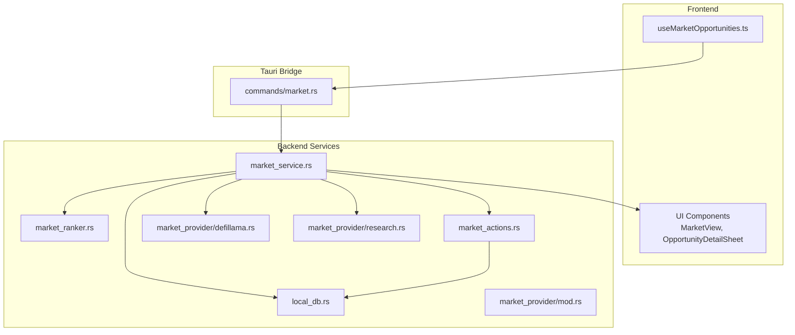
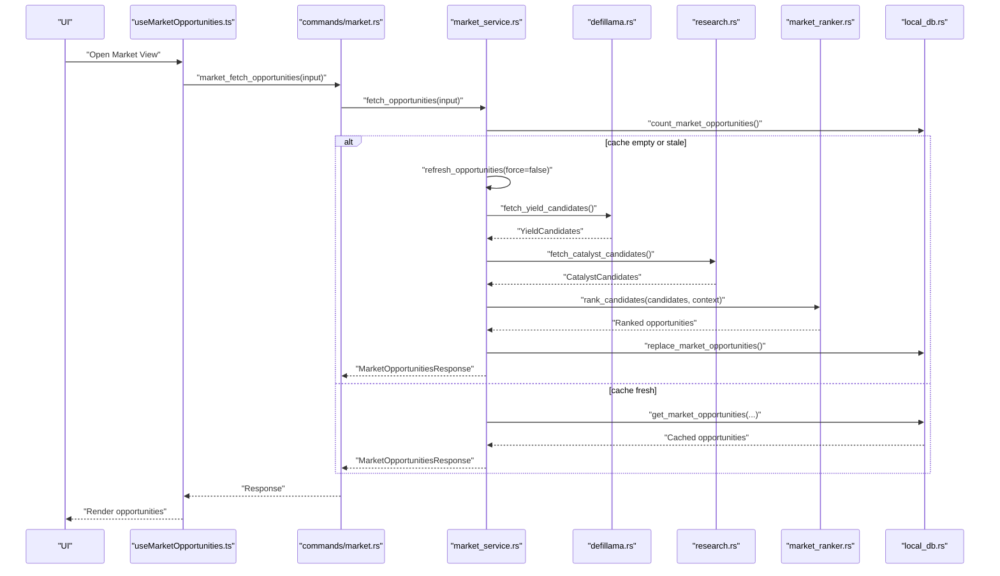
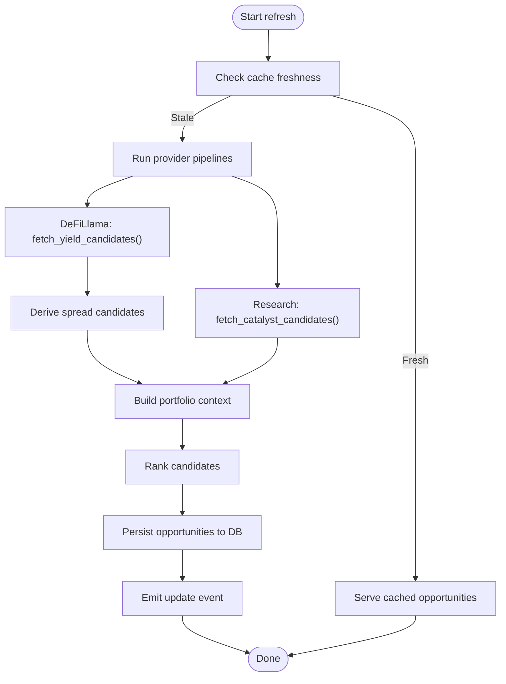
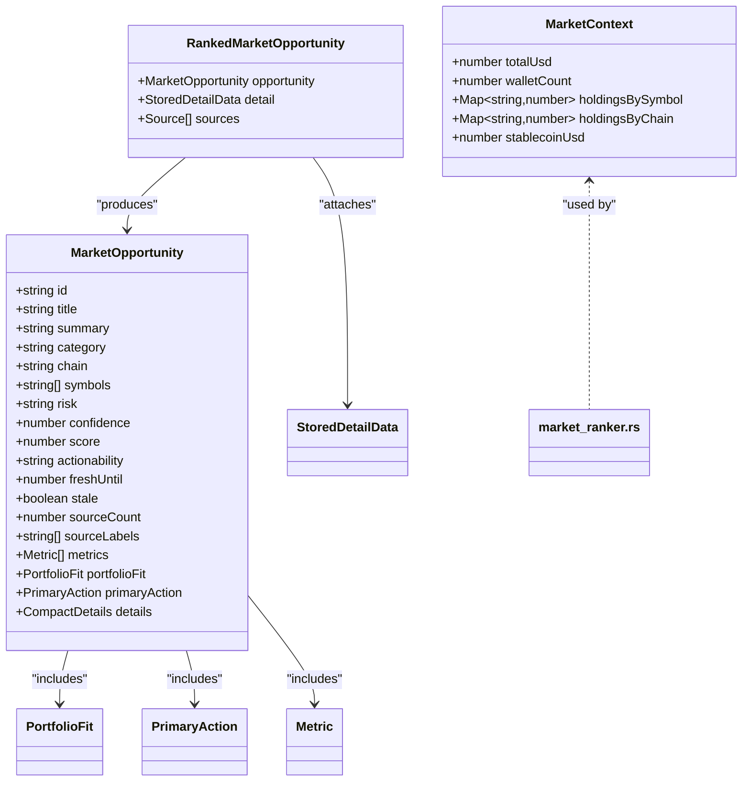
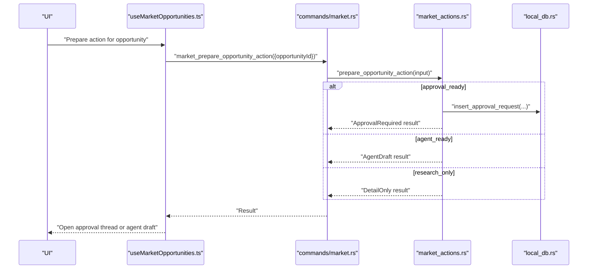
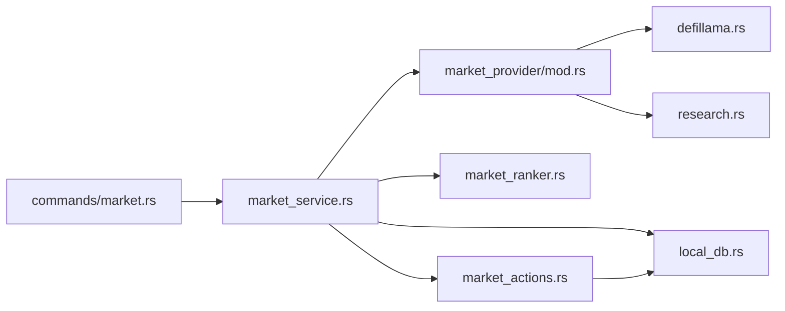

# Market Data & Opportunity Services

<cite>
**Referenced Files in This Document**
- [market.ts](file://src/lib/market.ts)
- [market.ts (types)](file://src/types/market.ts)
- [market.rs (commands)](file://src-tauri/src/commands/market.rs)
- [market_service.rs](file://src-tauri/src/services/market_service.rs)
- [market_ranker.rs](file://src-tauri/src/services/market_ranker.rs)
- [market_actions.rs](file://src-tauri/src/services/market_actions.rs)
- [mod.rs (market_provider)](file://src-tauri/src/services/market_provider/mod.rs)
- [defillama.rs](file://src-tauri/src/services/market_provider/defillama.rs)
- [research.rs](file://src-tauri/src/services/market_provider/research.rs)
- [local_db.rs](file://src-tauri/src/services/local_db.rs)
- [useMarketOpportunities.ts](file://src/hooks/useMarketOpportunities.ts)
</cite>

## Table of Contents
1. [Introduction](#introduction)
2. [Project Structure](#project-structure)
3. [Core Components](#core-components)
4. [Architecture Overview](#architecture-overview)
5. [Detailed Component Analysis](#detailed-component-analysis)
6. [Dependency Analysis](#dependency-analysis)
7. [Performance Considerations](#performance-considerations)
8. [Troubleshooting Guide](#troubleshooting-guide)
9. [Conclusion](#conclusion)
10. [Appendices](#appendices)

## Introduction
This document describes the market data and opportunity discovery service layer. It explains how market data is aggregated from external providers, how DeFi opportunities are scanned and ranked, how real-time price tracking is maintained, and how the system integrates DeFiLlama and research data sources. It also documents the opportunity ranking algorithm, risk assessment models, filtering criteria, caching strategies, and the market action preparation and execution pipeline. Practical examples illustrate retrieval workflows, discovery processes, and performance optimizations for large datasets.

## Project Structure
The market data and opportunity services span both frontend and backend layers:
- Frontend hook orchestrating queries and events for market opportunities
- Tauri commands bridging frontend requests to backend services
- Backend services for fetching, ranking, caching, and emitting opportunities
- Provider integrations for DeFiLlama yield data and research synthesis
- Local database for persistence and cache invalidation

**Diagram sources**
- [useMarketOpportunities.ts:1-131](file://src/hooks/useMarketOpportunities.ts#L1-L131)
- [market.rs (commands):1-36](file://src-tauri/src/commands/market.rs#L1-L36)
- [market_service.rs:1-745](file://src-tauri/src/services/market_service.rs#L1-L745)
- [market_ranker.rs:1-559](file://src-tauri/src/services/market_ranker.rs#L1-L559)
- [market_actions.rs:1-141](file://src-tauri/src/services/market_actions.rs#L1-L141)
- [local_db.rs:180-220](file://src-tauri/src/services/local_db.rs#L180-L220)
- [mod.rs (market_provider):1-160](file://src-tauri/src/services/market_provider/mod.rs#L1-L160)
- [defillama.rs:1-151](file://src-tauri/src/services/market_provider/defillama.rs#L1-L151)
- [research.rs:1-112](file://src-tauri/src/services/market_provider/research.rs#L1-L112)

**Section sources**
- [market.ts:1-135](file://src/lib/market.ts#L1-L135)
- [market.ts (types):1-134](file://src/types/market.ts#L1-L134)
- [market.rs (commands):1-36](file://src-tauri/src/commands/market.rs#L1-L36)
- [market_service.rs:189-218](file://src-tauri/src/services/market_service.rs#L189-L218)
- [local_db.rs:180-220](file://src-tauri/src/services/local_db.rs#L180-L220)

## Core Components
- Frontend market API and UI integration:
  - Provides typed functions to fetch opportunities, refresh, get details, and prepare actions
  - Exposes helpers for labels and launching prepared actions
- Backend market service:
  - Orchestrates provider runs, cache freshness checks, and emits updates
  - Builds portfolio context and rebalance candidates
  - Persists ranked opportunities and exposes detail retrieval
- Ranking and risk engine:
  - Computes global/personal scores per category
  - Applies risk buckets and guardrail compatibility
- Action preparation:
  - Translates opportunity readiness into approval drafts or agent prompts
- Provider integrations:
  - DeFiLlama yield pools API
  - Research synthesis via Sonar client
- Persistence:
  - SQLite-backed cache for opportunities and provider run metadata

**Section sources**
- [market.ts:16-135](file://src/lib/market.ts#L16-L135)
- [market.ts (types):39-134](file://src/types/market.ts#L39-L134)
- [market_service.rs:220-365](file://src-tauri/src/services/market_service.rs#L220-L365)
- [market_ranker.rs:17-493](file://src-tauri/src/services/market_ranker.rs#L17-L493)
- [market_actions.rs:8-141](file://src-tauri/src/services/market_actions.rs#L8-L141)
- [defillama.rs:27-116](file://src-tauri/src/services/market_provider/defillama.rs#L27-L116)
- [research.rs:23-83](file://src-tauri/src/services/market_provider/research.rs#L23-L83)
- [local_db.rs:180-220](file://src-tauri/src/services/local_db.rs#L180-L220)

## Architecture Overview
The system follows a layered architecture:
- UI invokes frontend functions to fetch opportunities
- Tauri commands forward requests to backend services
- Backend services coordinate provider data ingestion, candidate derivation, ranking, and persistence
- Frontend listens for update events and refresh failures to keep the UI reactive

**Diagram sources**
- [useMarketOpportunities.ts:39-62](file://src/hooks/useMarketOpportunities.ts#L39-L62)
- [market.rs (commands):8-28](file://src-tauri/src/commands/market.rs#L8-L28)
- [market_service.rs:220-261](file://src-tauri/src/services/market_service.rs#L220-L261)
- [market_service.rs:263-365](file://src-tauri/src/services/market_service.rs#L263-L365)
- [defillama.rs:27-116](file://src-tauri/src/services/market_provider/defillama.rs#L27-L116)
- [research.rs:23-83](file://src-tauri/src/services/market_provider/research.rs#L23-L83)
- [market_ranker.rs:17-35](file://src-tauri/src/services/market_ranker.rs#L17-L35)
- [local_db.rs:180-220](file://src-tauri/src/services/local_db.rs#L180-L220)

## Detailed Component Analysis

### Market Data Aggregation and Real-Time Tracking
- DeFiLlama integration:
  - Fetches yield pools with APY, TVL, and chain metadata
  - Normalizes chain, symbol, and protocol identifiers
  - Filters and sorts candidates by quality thresholds
- Research integration:
  - Uses a structured prompt to synthesize catalyst opportunities
  - Normalizes chains and sanitizes JSON extraction
- Real-time tracking:
  - Freshness windows define validity periods for opportunities
  - Background refresh cycles run at fixed intervals
  - Research refresh occurs less frequently than market data

**Diagram sources**
- [market_service.rs:263-365](file://src-tauri/src/services/market_service.rs#L263-L365)
- [defillama.rs:27-116](file://src-tauri/src/services/market_provider/defillama.rs#L27-L116)
- [research.rs:23-83](file://src-tauri/src/services/market_provider/research.rs#L23-L83)
- [market_service.rs:462-529](file://src-tauri/src/services/market_service.rs#L462-L529)
- [local_db.rs:180-220](file://src-tauri/src/services/local_db.rs#L180-L220)

**Section sources**
- [defillama.rs:27-116](file://src-tauri/src/services/market_provider/defillama.rs#L27-L116)
- [research.rs:23-83](file://src-tauri/src/services/market_provider/research.rs#L23-L83)
- [market_service.rs:561-593](file://src-tauri/src/services/market_service.rs#L561-L593)
- [market_service.rs:189-218](file://src-tauri/src/services/market_service.rs#L189-L218)

### Opportunity Discovery and Ranking
- Candidate generation:
  - Yield: APY, TVL, stability, and protocol safety
  - Spread watch: Derived from yield differences across chains
  - Rebalance: Portfolio-derived drift and notional thresholds
  - Catalyst: Research confidence and relevance
- Scoring:
  - Global and personal scores computed via weighted normalization
  - Freshness contributes to score decay
  - Risk buckets derived from explicit thresholds
- Filtering and presentation:
  - Category and chain filters applied at query time
  - Portfolio fit and guardrail compatibility influence actionability

**Diagram sources**
- [market.ts (types):39-134](file://src/types/market.ts#L39-L134)
- [market_ranker.rs:10-15](file://src-tauri/src/services/market_ranker.rs#L10-L15)
- [market_service.rs:180-187](file://src-tauri/src/services/market_service.rs#L180-L187)

**Section sources**
- [market_ranker.rs:17-493](file://src-tauri/src/services/market_ranker.rs#L17-L493)
- [market_service.rs:462-529](file://src-tauri/src/services/market_service.rs#L462-L529)
- [market.ts (types):14-59](file://src/types/market.ts#L14-L59)

### Risk Assessment and Guardrails
- Risk buckets:
  - Stablecoin yield with high TVL and capped APY: low risk
  - APY thresholds: medium/high risk tiers
- Guardrails:
  - Personal guardrail fit considers APY caps and asset presence
  - Research-only opportunities are explicitly non-executable
  - Approval-required strategies enforce policy gates

**Section sources**
- [market_ranker.rs:80-86](file://src-tauri/src/services/market_ranker.rs#L80-L86)
- [market_ranker.rs:254-255](file://src-tauri/src/services/market_ranker.rs#L254-L255)
- [market_ranker.rs:436-437](file://src-tauri/src/services/market_ranker.rs#L436-L437)
- [market_actions.rs:26-35](file://src-tauri/src/services/market_actions.rs#L26-L35)

### Opportunity Filtering Criteria
- Category and chain filters
- Research inclusion toggle
- Limiting results to a fixed number
- Portfolio coverage and relevance reasons
- Freshness and staleness flags

**Section sources**
- [market.ts:61-76](file://src/types/market.ts#L61-L76)
- [market_service.rs:238-261](file://src-tauri/src/services/market_service.rs#L238-L261)
- [market_service.rs:398-419](file://src-tauri/src/services/market_service.rs#L398-L419)

### Market Action Preparation and Execution Pipeline
- Preparation outcomes:
  - Approval required: persists an approval request with payload and simulation
  - Agent draft: builds a prompt for agent-driven analysis
  - Detail only: research-only or disabled actions
- Execution:
  - Approval gating ensures policy-compliant strategy creation
  - Simulation metadata included for validation

**Diagram sources**
- [useMarketOpportunities.ts:94-109](file://src/hooks/useMarketOpportunities.ts#L94-L109)
- [market.rs (commands):30-35](file://src-tauri/src/commands/market.rs#L30-L35)
- [market_actions.rs:8-36](file://src-tauri/src/services/market_actions.rs#L8-L36)
- [market_actions.rs:38-118](file://src-tauri/src/services/market_actions.rs#L38-L118)
- [local_db.rs:117-136](file://src-tauri/src/services/local_db.rs#L117-L136)

**Section sources**
- [market_actions.rs:8-141](file://src-tauri/src/services/market_actions.rs#L8-L141)
- [market_service.rs:386-396](file://src-tauri/src/services/market_service.rs#L386-L396)

### Data Caching and Freshness Guarantees
- Cache freshness:
  - Market refresh window and research refresh window
  - Latest provider run timestamps and statuses
- Fallback:
  - On provider errors, serve cached opportunities with stale flag
- Indexing:
  - Scores, last seen, and category+chain indexes optimize queries

**Section sources**
- [market_service.rs:12-16](file://src-tauri/src/services/market_service.rs#L12-L16)
- [market_service.rs:561-593](file://src-tauri/src/services/market_service.rs#L561-L593)
- [market_service.rs:601-624](file://src-tauri/src/services/market_service.rs#L601-L624)
- [local_db.rs:205-207](file://src-tauri/src/services/local_db.rs#L205-L207)

### Practical Examples

#### Example: Retrieving Opportunities
- Frontend:
  - Call the fetch function with category, chain, research flag, wallet addresses, and limit
  - React to emitted updates and refresh failures
- Backend:
  - If cache is empty or stale, run provider pipelines and persist results
  - Return opportunities with freshness and availability metadata

**Section sources**
- [market.ts:16-28](file://src/lib/market.ts#L16-L28)
- [useMarketOpportunities.ts:39-62](file://src/hooks/useMarketOpportunities.ts#L39-L62)
- [market_service.rs:220-261](file://src-tauri/src/services/market_service.rs#L220-L261)

#### Example: Opportunity Discovery Workflow
- Build portfolio context from local tokens
- Derive rebalance candidates from chain and stablecoin concentration
- Combine with yield, spread, and catalyst candidates
- Rank and persist top opportunities

**Section sources**
- [market_service.rs:430-460](file://src-tauri/src/services/market_service.rs#L430-L460)
- [market_service.rs:462-529](file://src-tauri/src/services/market_service.rs#L462-L529)
- [market_provider/mod.rs:84-143](file://src-tauri/src/services/market_provider/mod.rs#L84-L143)

#### Example: Data Caching Strategies
- Use cache freshness checks to avoid redundant provider calls
- Emit update events to notify clients and invalidate queries
- Store detailed payloads and sources for opportunity detail views

**Section sources**
- [market_service.rs:561-593](file://src-tauri/src/services/market_service.rs#L561-L593)
- [market_service.rs:352-362](file://src-tauri/src/services/market_service.rs#L352-L362)
- [local_db.rs:180-220](file://src-tauri/src/services/local_db.rs#L180-L220)

## Dependency Analysis
The backend services form a cohesive pipeline with clear boundaries:
- Commands depend on services for orchestration
- Market service depends on provider modules, ranker, and local DB
- Ranker depends on market context and candidate types
- Actions depend on cached opportunities and DB for approvals
- Providers depend on external APIs and internal normalization

**Diagram sources**
- [market.rs (commands):1-36](file://src-tauri/src/commands/market.rs#L1-L36)
- [market_service.rs:1-745](file://src-tauri/src/services/market_service.rs#L1-L745)
- [market_ranker.rs:1-559](file://src-tauri/src/services/market_ranker.rs#L1-L559)
- [market_actions.rs:1-141](file://src-tauri/src/services/market_actions.rs#L1-L141)
- [mod.rs (market_provider):1-160](file://src-tauri/src/services/market_provider/mod.rs#L1-L160)
- [defillama.rs:1-151](file://src-tauri/src/services/market_provider/defillama.rs#L1-L151)
- [research.rs:1-112](file://src-tauri/src/services/market_provider/research.rs#L1-L112)
- [local_db.rs:1-800](file://src-tauri/src/services/local_db.rs#L1-L800)

**Section sources**
- [market.rs (commands):1-36](file://src-tauri/src/commands/market.rs#L1-L36)
- [market_service.rs:1-745](file://src-tauri/src/services/market_service.rs#L1-L745)
- [market_ranker.rs:1-559](file://src-tauri/src/services/market_ranker.rs#L1-L559)
- [market_actions.rs:1-141](file://src-tauri/src/services/market_actions.rs#L1-L141)
- [mod.rs (market_provider):1-160](file://src-tauri/src/services/market_provider/mod.rs#L1-L160)
- [defillama.rs:1-151](file://src-tauri/src/services/market_provider/defillama.rs#L1-L151)
- [research.rs:1-112](file://src-tauri/src/services/market_provider/research.rs#L1-L112)
- [local_db.rs:1-800](file://src-tauri/src/services/local_db.rs#L1-L800)

## Performance Considerations
- Provider timeouts and structured parsing prevent slow or broken pipelines
- Sorting and truncation limit candidate sets early
- Indexes on scores, last seen, and category+chain improve query performance
- Background refresh decouples UI responsiveness from provider latency
- Event-driven invalidation reduces unnecessary polling

[No sources needed since this section provides general guidance]

## Troubleshooting Guide
- Refresh failures:
  - When provider calls fail, the system falls back to cached opportunities and emits a refresh failed event
  - UI invalidates queries and surfaces stale state
- Validation:
  - Wallet addresses are sanitized and validated before use
  - Opportunity IDs are trimmed and checked for emptiness
- Audit and logging:
  - Approval creation is audited with event metadata

**Section sources**
- [market_service.rs:292-300](file://src-tauri/src/services/market_service.rs#L292-L300)
- [market_service.rs:601-624](file://src-tauri/src/services/market_service.rs#L601-L624)
- [useMarketOpportunities.ts:64-92](file://src/hooks/useMarketOpportunities.ts#L64-L92)
- [market_actions.rs:101-110](file://src-tauri/src/services/market_actions.rs#L101-L110)

## Conclusion
The market data and opportunity discovery service layer integrates external DeFiLlama yield data and research synthesis into a robust, cache-aware pipeline. It computes personalized and global scores, applies guardrails, and prepares actionable outcomes through approval drafts or agent prompts. The system balances freshness guarantees with resilience via fallbacks and efficient indexing, while the frontend reacts to updates with minimal overhead.

[No sources needed since this section summarizes without analyzing specific files]

## Appendices

### API Surface and Types
- Frontend functions:
  - fetchMarketOpportunities, refreshMarketOpportunities, getMarketOpportunityDetail, prepareMarketOpportunityAction
- Backend commands:
  - market_fetch_opportunities, market_refresh_opportunities, market_get_opportunity_detail, market_prepare_opportunity_action
- Data models:
  - MarketOpportunity, MarketOpportunitiesResponse, MarketOpportunityDetail, MarketPrepareOpportunityActionResult

**Section sources**
- [market.ts:16-59](file://src/lib/market.ts#L16-L59)
- [market.rs (commands):8-35](file://src-tauri/src/commands/market.rs#L8-L35)
- [market.ts (types):39-134](file://src/types/market.ts#L39-L134)