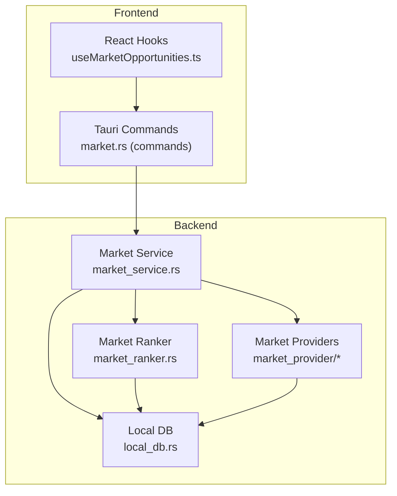
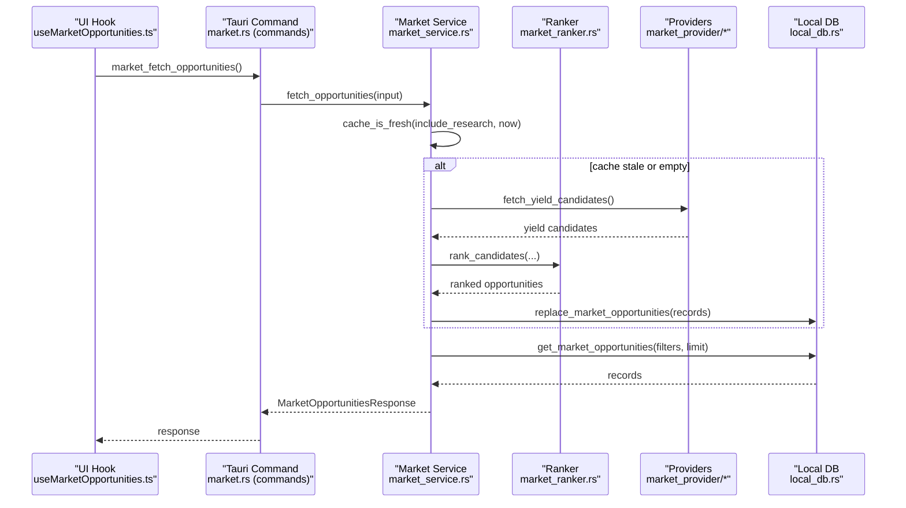
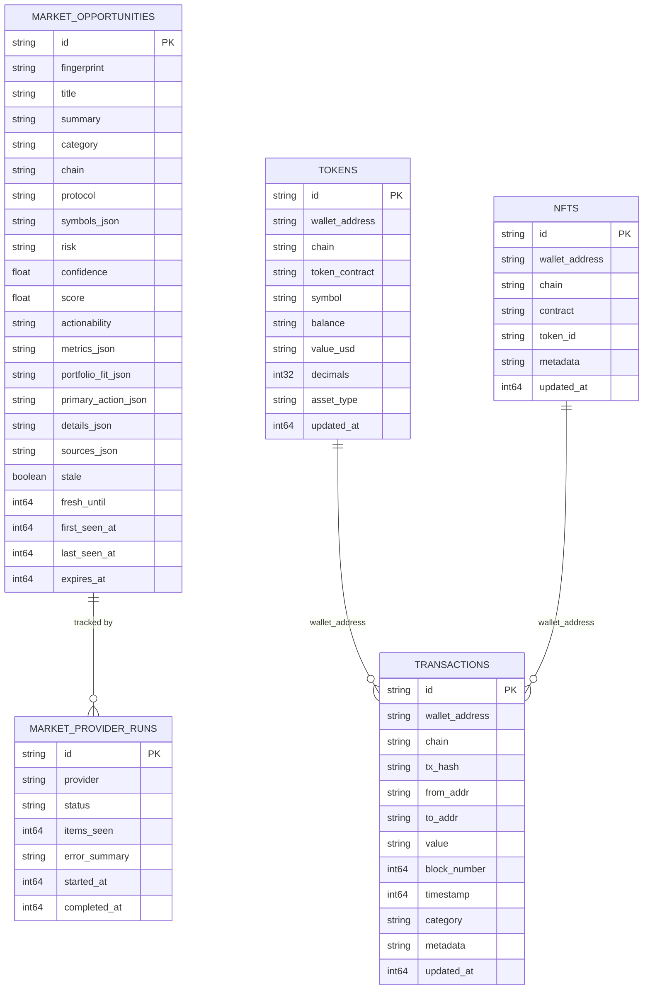
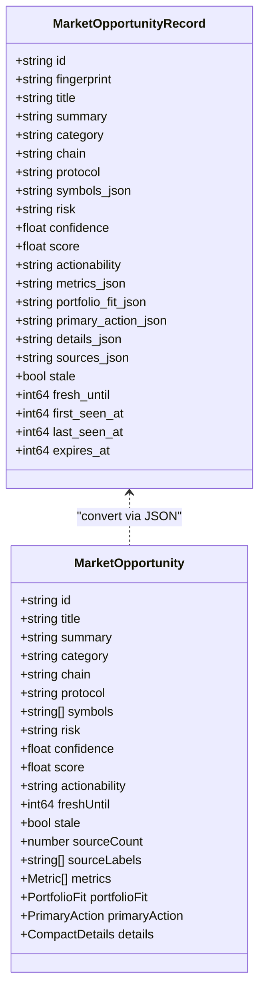
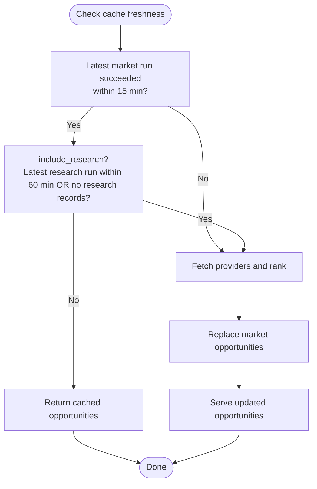
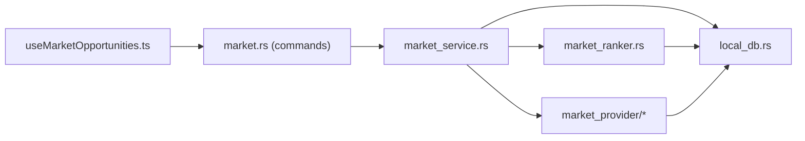

# Market Data Cache & Persistence

<cite>
**Referenced Files in This Document**
- [local_db.rs](file://src-tauri/src/services/local_db.rs)
- [market_service.rs](file://src-tauri/src/services/market_service.rs)
- [market_provider/mod.rs](file://src-tauri/src/services/market_provider/mod.rs)
- [market_provider/defillama.rs](file://src-tauri/src/services/market_provider/defillama.rs)
- [market_provider/research.rs](file://src-tauri/src/services/market_provider/research.rs)
- [market_ranker.rs](file://src-tauri/src/services/market_ranker.rs)
- [market.rs](file://src/lib/market.ts)
- [useMarketOpportunities.ts](file://src/hooks/useMarketOpportunities.ts)
- [market.rs (commands)](file://src-tauri/src/commands/market.rs)
- [market.ts (types)](file://src/types/market.ts)
</cite>

## Table of Contents
1. [Introduction](#introduction)
2. [Project Structure](#project-structure)
3. [Core Components](#core-components)
4. [Architecture Overview](#architecture-overview)
5. [Detailed Component Analysis](#detailed-component-analysis)
6. [Dependency Analysis](#dependency-analysis)
7. [Performance Considerations](#performance-considerations)
8. [Troubleshooting Guide](#troubleshooting-guide)
9. [Conclusion](#conclusion)

## Introduction
This document describes the market data caching and persistence system used to discover, rank, and serve market opportunities locally. It covers the SQLite schema for market opportunities, provider run tracking, and metadata storage; cache invalidation strategies and data freshness guarantees; TTL management; record structures and serialization formats; and practical procedures for cache warming, bulk operations, and maintenance. It also documents the provider run logging system, error tracking, and performance metrics collection, along with data migration strategies, backup procedures, and cache consistency across application restarts.

## Project Structure
The market data system spans Rust backend services, SQLite persistence, and TypeScript frontend bindings:
- Backend services orchestrate fetching, ranking, and persistence of market opportunities.
- SQLite stores opportunities, provider runs, and related metadata.
- Frontend hooks and commands expose market APIs to the UI.

**Diagram sources**
- [market.rs (commands):1-36](file://src-tauri/src/commands/market.rs#L1-L36)
- [market_service.rs:1-745](file://src-tauri/src/services/market_service.rs#L1-L745)
- [market_ranker.rs:1-559](file://src-tauri/src/services/market_ranker.rs#L1-L559)
- [market_provider/mod.rs:1-160](file://src-tauri/src/services/market_provider/mod.rs#L1-L160)
- [local_db.rs:1-2735](file://src-tauri/src/services/local_db.rs#L1-L2735)

**Section sources**
- [market.rs (commands):1-36](file://src-tauri/src/commands/market.rs#L1-L36)
- [market_service.rs:1-745](file://src-tauri/src/services/market_service.rs#L1-L745)
- [market_ranker.rs:1-559](file://src-tauri/src/services/market_ranker.rs#L1-L559)
- [market_provider/mod.rs:1-160](file://src-tauri/src/services/market_provider/mod.rs#L1-L160)
- [local_db.rs:1-2735](file://src-tauri/src/services/local_db.rs#L1-L2735)

## Core Components
- Market Service: orchestrates fetching, ranking, and serving opportunities; manages cache freshness and fallback behavior.
- Market Ranker: computes scores, actionability, and personalization metrics.
- Market Providers: external integrations (DeFiLlama yield pools, Sonar research).
- Local Database: SQLite schema and operations for opportunities, provider runs, and metadata.
- Frontend Bindings: Tauri commands and React hooks for UI consumption.

**Section sources**
- [market_service.rs:1-745](file://src-tauri/src/services/market_service.rs#L1-L745)
- [market_ranker.rs:1-559](file://src-tauri/src/services/market_ranker.rs#L1-L559)
- [market_provider/mod.rs:1-160](file://src-tauri/src/services/market_provider/mod.rs#L1-L160)
- [local_db.rs:1-2735](file://src-tauri/src/services/local_db.rs#L1-L2735)
- [market.rs (commands):1-36](file://src-tauri/src/commands/market.rs#L1-L36)
- [market.ts:1-135](file://src/lib/market.ts#L1-L135)
- [useMarketOpportunities.ts:1-131](file://src/hooks/useMarketOpportunities.ts#L1-L131)

## Architecture Overview
End-to-end flow from provider data to UI presentation:

**Diagram sources**
- [market.rs (commands):1-36](file://src-tauri/src/commands/market.rs#L1-L36)
- [market_service.rs:220-261](file://src-tauri/src/services/market_service.rs#L220-L261)
- [market_ranker.rs:17-35](file://src-tauri/src/services/market_ranker.rs#L17-L35)
- [market_provider/mod.rs:84-143](file://src-tauri/src/services/market_provider/mod.rs#L84-L143)
- [local_db.rs:1274-1370](file://src-tauri/src/services/local_db.rs#L1274-L1370)

## Detailed Component Analysis

### Local Database Schema and Operations
The SQLite schema supports:
- Market opportunities table with JSON fields for structured metadata.
- Provider runs tracking with timestamps and status.
- Supporting tables for tokens, NFTs, transactions, and portfolio snapshots (used for context building).
- Indexes optimized for filtering and sorting opportunities.

Key tables and indices:
- market_opportunities: primary table for opportunities with JSON fields for metrics, portfolio fit, primary action, details, and sources; includes stale/fresh/expires flags.
- market_provider_runs: tracks provider run status, items seen, and timing.
- Additional tables for tokens, NFTs, transactions, and portfolio snapshots support portfolio context used by rebalance candidates.

Operations:
- Replace bulk opportunities via DELETE + INSERT.
- Query with filters by category, chain, and research inclusion.
- Upsert provider runs and update completion status.
- Count and pagination helpers.

**Diagram sources**
- [local_db.rs:180-220](file://src-tauri/src/services/local_db.rs#L180-L220)
- [local_db.rs:209-219](file://src-tauri/src/services/local_db.rs#L209-L219)
- [local_db.rs:17-59](file://src-tauri/src/services/local_db.rs#L17-L59)
- [local_db.rs:1310-1370](file://src-tauri/src/services/local_db.rs#L1310-L1370)

**Section sources**
- [local_db.rs:180-220](file://src-tauri/src/services/local_db.rs#L180-L220)
- [local_db.rs:209-219](file://src-tauri/src/services/local_db.rs#L209-L219)
- [local_db.rs:1310-1370](file://src-tauri/src/services/local_db.rs#L1310-L1370)
- [local_db.rs:1274-1308](file://src-tauri/src/services/local_db.rs#L1274-L1308)

### Market Opportunity Record Structure and Serialization
Records are stored as JSON blobs for complex fields:
- symbols_json, metrics_json, portfolio_fit_json, primary_action_json, details_json, sources_json.
- The service converts between typed structures and JSON for persistence and retrieval.

Serialization and deserialization:
- Typed structs define the internal representation.
- JSON conversion occurs during insert/update and retrieval.

**Diagram sources**
- [local_db.rs:1047-1070](file://src-tauri/src/services/local_db.rs#L1047-L1070)
- [market_service.rs:53-73](file://src-tauri/src/services/market_service.rs#L53-L73)
- [market_service.rs:626-694](file://src-tauri/src/services/market_service.rs#L626-L694)

**Section sources**
- [local_db.rs:1047-1070](file://src-tauri/src/services/local_db.rs#L1047-L1070)
- [market_service.rs:53-73](file://src-tauri/src/services/market_service.rs#L53-L73)
- [market_service.rs:626-694](file://src-tauri/src/services/market_service.rs#L626-L694)

### Cache Invalidation Strategies and Data Freshness Guarantees
Freshness checks:
- Market refresh interval: 15 minutes for yield/spread/rebalance data.
- Research refresh interval: 1 hour for catalyst data.
- cache_is_fresh evaluates latest provider run status and elapsed time against thresholds.

Fallback behavior:
- If cache is fresh, return existing opportunities.
- If provider fetch fails, serve cached opportunities with stale flag.

**Diagram sources**
- [market_service.rs:14-16](file://src-tauri/src/services/market_service.rs#L14-L16)
- [market_service.rs:561-593](file://src-tauri/src/services/market_service.rs#L561-L593)
- [market_service.rs:263-365](file://src-tauri/src/services/market_service.rs#L263-L365)

**Section sources**
- [market_service.rs:14-16](file://src-tauri/src/services/market_service.rs#L14-L16)
- [market_service.rs:561-593](file://src-tauri/src/services/market_service.rs#L561-L593)
- [market_service.rs:263-365](file://src-tauri/src/services/market_service.rs#L263-L365)

### TTL Management for Different Data Types
- Yield/spread/rebalance candidates: fresh_until set to now + 15 minutes.
- Catalyst candidates: fresh_until set to now + 60 minutes.
- Opportunities stored with expires_at computed as fresh_until + refresh interval.
- UI and service logic surfaces stale flag when fresh_until < now.

**Section sources**
- [market_provider/defillama.rs:102-103](file://src-tauri/src/services/market_provider/defillama.rs#L102-L103)
- [market_provider/research.rs:78-79](file://src-tauri/src/services/market_provider/research.rs#L78-L79)
- [market_service.rs:655-656](file://src-tauri/src/services/market_service.rs#L655-L656)

### Provider Run Logging, Error Tracking, and Metrics Collection
Provider runs:
- insert_market_provider_run starts a run with status "running".
- update_market_provider_run updates status, items_seen, and completed_at.
- get_latest_market_provider_run retrieves the most recent run per provider.

Error tracking:
- On provider failures, status is set to "failed" and error_summary is recorded.
- fallback_to_cached serves stale cached data and emits a UI event.

Metrics:
- items_seen counts processed candidates.
- Timing fields (started_at, completed_at) enable latency measurements.

**Section sources**
- [local_db.rs:1417-1451](file://src-tauri/src/services/local_db.rs#L1417-L1451)
- [local_db.rs:1453-1473](file://src-tauri/src/services/local_db.rs#L1453-L1473)
- [market_service.rs:281-310](file://src-tauri/src/services/market_service.rs#L281-L310)
- [market_service.rs:532-559](file://src-tauri/src/services/market_service.rs#L532-L559)
- [market_service.rs:601-624](file://src-tauri/src/services/market_service.rs#L601-L624)

### Practical Procedures

#### Cache Warming
- Trigger refresh_opportunities with include_research and wallet addresses to prime the cache.
- Use force: true to bypass freshness checks for initial load.

**Section sources**
- [market_service.rs:263-365](file://src-tauri/src/services/market_service.rs#L263-L365)
- [market.rs:30-40](file://src/lib/market.ts#L30-L40)

#### Bulk Data Operations
- replace_market_opportunities deletes all existing opportunities and inserts a batch.
- get_market_opportunities paginates with limit and optional filters.

**Section sources**
- [local_db.rs:1274-1308](file://src-tauri/src/services/local_db.rs#L1274-L1308)
- [local_db.rs:1310-1370](file://src-tauri/src/services/local_db.rs#L1310-L1370)

#### Cache Maintenance
- Clear all data: clears market opportunities and related tables.
- Clear autonomous data: clears agent-related tables for clean restarts.
- Expire stale items: scheduled cleanup of approvals, tasks, and matches can be implemented similarly.

**Section sources**
- [local_db.rs:611-644](file://src-tauri/src/services/local_db.rs#L611-L644)
- [local_db.rs:2722-2734](file://src-tauri/src/services/local_db.rs#L2722-L2734)

### Data Migration Strategies
- Schema migration runs ALTER TABLE to add missing columns and seeds catalog data.
- Data migrations executed post-schema ensures backward compatibility.

**Section sources**
- [local_db.rs:450-484](file://src-tauri/src/services/local_db.rs#L450-L484)

### Backup Procedures
- Application backup table supports storing backup metadata, CIDs, and scopes.
- Backups can be queried by app_id and created_at for auditing.

**Section sources**
- [local_db.rs:264-275](file://src-tauri/src/services/local_db.rs#L264-L275)
- [local_db.rs:277-291](file://src-tauri/src/services/local_db.rs#L277-L291)

### Cache Consistency Across Application Restarts
- Database initialization sets DB_PATH and applies schema + migrations.
- On startup, market_service refreshes opportunities if cache is stale.
- Frontend listens for market_opportunities_updated and market_opportunities_refresh_failed events to invalidate queries and surface errors.

**Section sources**
- [local_db.rs:438-448](file://src-tauri/src/services/local_db.rs#L438-L448)
- [market_service.rs:189-218](file://src-tauri/src/services/market_service.rs#L189-L218)
- [useMarketOpportunities.ts:64-92](file://src/hooks/useMarketOpportunities.ts#L64-L92)

## Dependency Analysis
The system exhibits clear separation of concerns:
- Market Service depends on Market Ranker and Market Providers.
- Market Ranker depends on Market Provider candidate types and Market Service context.
- Local DB encapsulates schema and CRUD operations.
- Frontend binds to Tauri commands and React Query for caching and invalidation.

**Diagram sources**
- [market_service.rs:1-745](file://src-tauri/src/services/market_service.rs#L1-L745)
- [market_ranker.rs:1-559](file://src-tauri/src/services/market_ranker.rs#L1-L559)
- [market_provider/mod.rs:1-160](file://src-tauri/src/services/market_provider/mod.rs#L1-L160)
- [local_db.rs:1-2735](file://src-tauri/src/services/local_db.rs#L1-L2735)
- [market.rs (commands):1-36](file://src-tauri/src/commands/market.rs#L1-L36)
- [useMarketOpportunities.ts:1-131](file://src/hooks/useMarketOpportunities.ts#L1-L131)

**Section sources**
- [market_service.rs:1-745](file://src-tauri/src/services/market_service.rs#L1-L745)
- [market_ranker.rs:1-559](file://src-tauri/src/services/market_ranker.rs#L1-L559)
- [market_provider/mod.rs:1-160](file://src-tauri/src/services/market_provider/mod.rs#L1-L160)
- [local_db.rs:1-2735](file://src-tauri/src/services/local_db.rs#L1-L2735)
- [market.rs (commands):1-36](file://src-tauri/src/commands/market.rs#L1-L36)
- [useMarketOpportunities.ts:1-131](file://src/hooks/useMarketOpportunities.ts#L1-L131)

## Performance Considerations
- SQLite indexing: composite indexes on category+chain and score ordering optimize opportunity queries.
- JSON fields: minimize unnecessary conversions; keep serialized payloads compact.
- Batch operations: replace_market_opportunities reduces transaction overhead compared to individual inserts.
- TTL and stale flags: prevent UI thrashing by surfacing stale state and scheduling refreshes.

[No sources needed since this section provides general guidance]

## Troubleshooting Guide
Common scenarios and remedies:
- No opportunities served: verify cache freshness and provider runs; check fallback_to_cached behavior and emitted UI events.
- Stale opportunities shown: confirm cache_is_fresh logic and refresh intervals; force refresh via UI.
- Provider failures: inspect provider run status and error_summary; ensure fallback_to_cached path is triggered.

**Section sources**
- [market_service.rs:561-593](file://src-tauri/src/services/market_service.rs#L561-L593)
- [market_service.rs:601-624](file://src-tauri/src/services/market_service.rs#L601-L624)
- [local_db.rs:1417-1451](file://src-tauri/src/services/local_db.rs#L1417-L1451)

## Conclusion
The market data caching and persistence system combines robust provider integrations, intelligent ranking, and efficient local storage to deliver timely, personalized opportunities. Its cache freshness logic, TTL management, and comprehensive provider run tracking ensure reliability and observability. The schema and operations support scalable bulk updates and maintain consistency across application restarts, while the frontend integrates seamlessly with React Query for responsive UX.