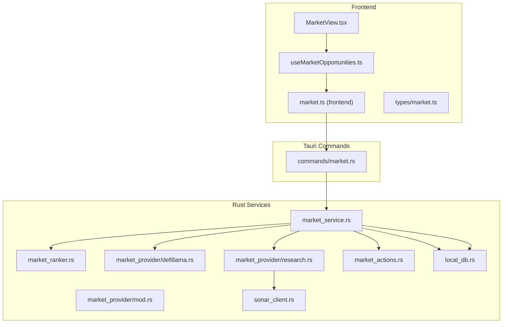
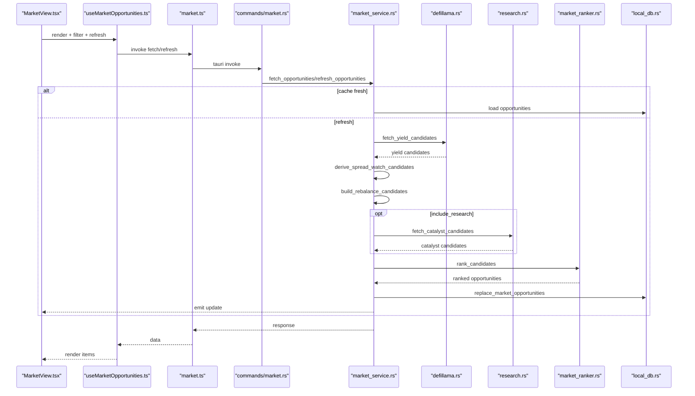
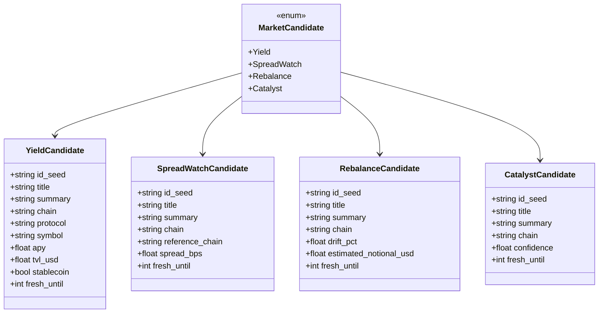
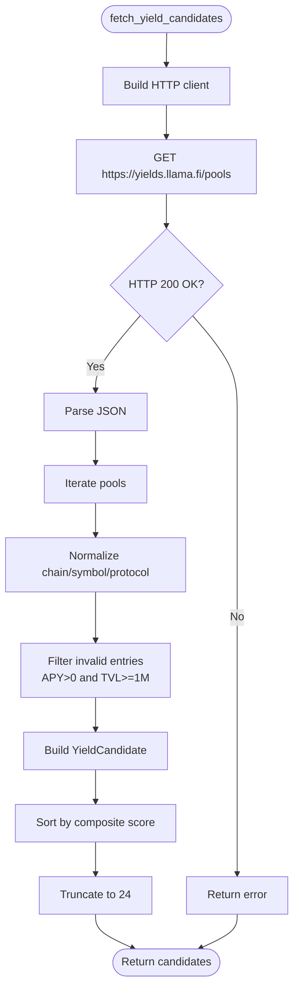
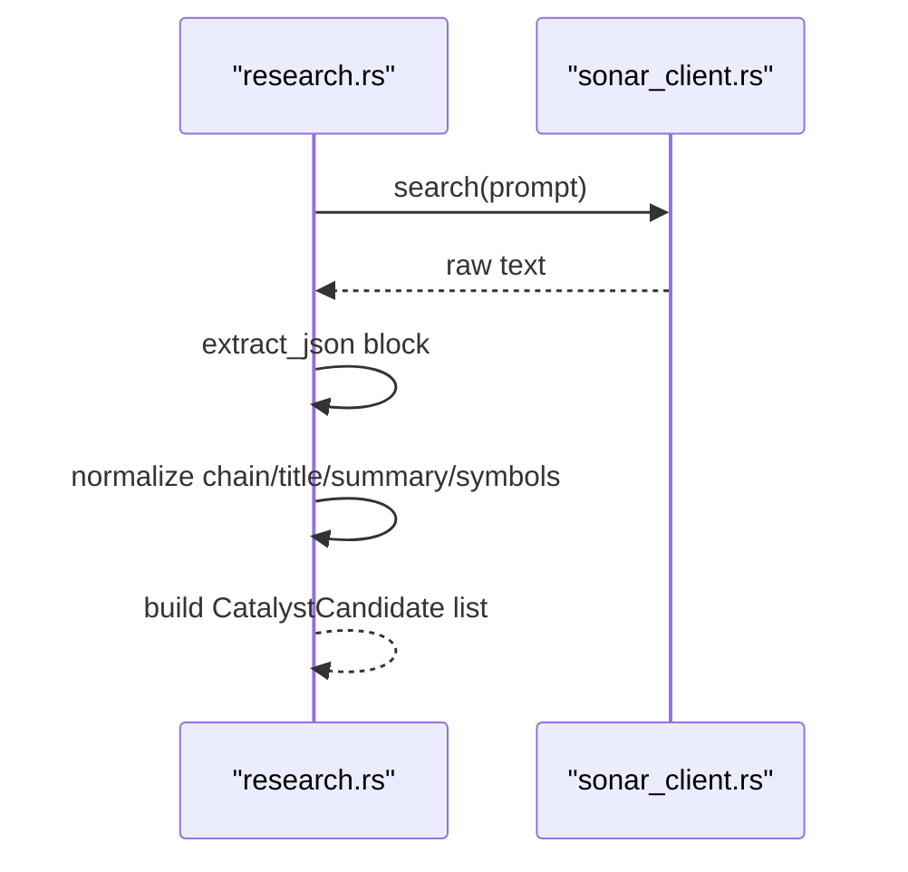
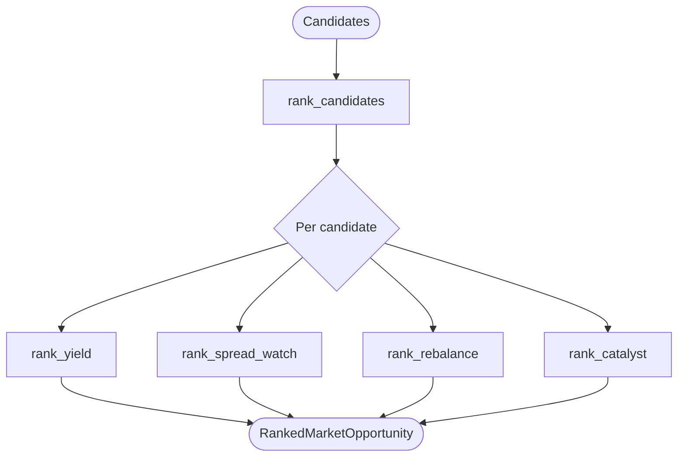
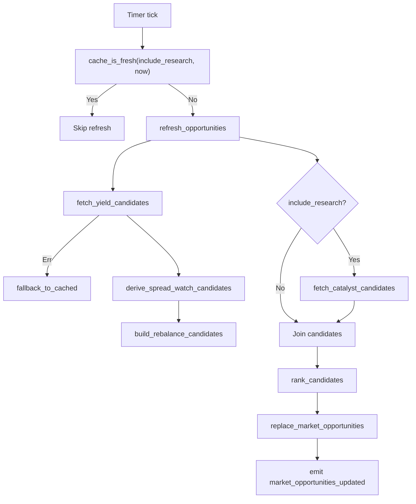
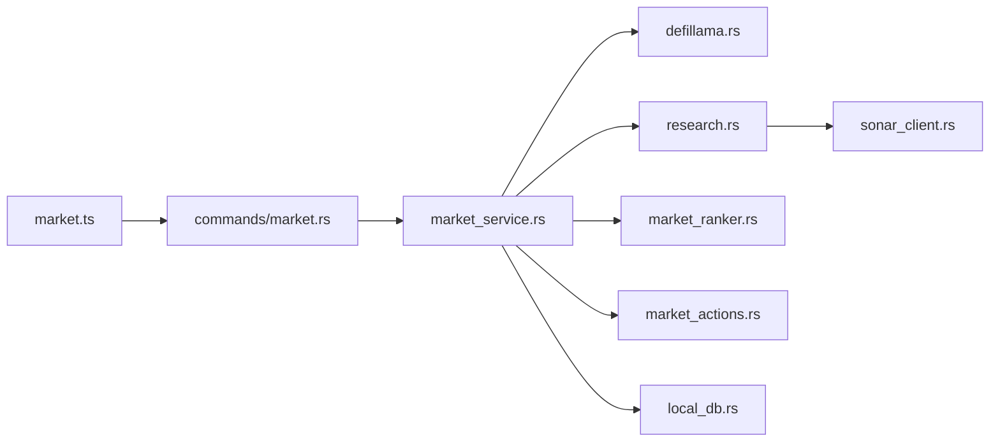

# Market Provider Integration

<cite>
**Referenced Files in This Document**
- [market.ts](file://src/lib/market.ts)
- [useMarketOpportunities.ts](file://src/hooks/useMarketOpportunities.ts)
- [MarketView.tsx](file://src/components/market/MarketView.tsx)
- [market.ts](file://src/types/market.ts)
- [mod.rs](file://src-tauri/src/services/market_provider/mod.rs)
- [defillama.rs](file://src-tauri/src/services/market_provider/defillama.rs)
- [research.rs](file://src-tauri/src/services/market_provider/research.rs)
- [market_service.rs](file://src-tauri/src/services/market_service.rs)
- [market.rs](file://src-tauri/src/commands/market.rs)
- [sonar_client.rs](file://src-tauri/src/services/sonar_client.rs)
- [market_ranker.rs](file://src-tauri/src/services/market_ranker.rs)
- [market_actions.rs](file://src-tauri/src/services/market_actions.rs)
- [local_db.rs](file://src-tauri/src/services/local_db.rs)
</cite>

## Table of Contents
1. [Introduction](#introduction)
2. [Project Structure](#project-structure)
3. [Core Components](#core-components)
4. [Architecture Overview](#architecture-overview)
5. [Detailed Component Analysis](#detailed-component-analysis)
6. [Dependency Analysis](#dependency-analysis)
7. [Performance Considerations](#performance-considerations)
8. [Troubleshooting Guide](#troubleshooting-guide)
9. [Conclusion](#conclusion)
10. [Appendices](#appendices)

## Introduction
This document explains the market provider integration system that powers the Market View. It covers the modular provider architecture supporting multiple data sources (DeFiLlama for yield opportunities and Sonar research for catalyst events), the provider abstraction layer, candidate fetching and normalization, provider lifecycle and error handling with fallbacks, and the provider run tracking system. It also documents caching strategies, performance monitoring, and practical guidance for extending the system with new providers and data transformations.

## Project Structure
The market integration spans frontend hooks and UI, Tauri commands, Rust services for provider orchestration, and local persistence.

**Diagram sources**
- [MarketView.tsx:1-267](file://src/components/market/MarketView.tsx#L1-L267)
- [useMarketOpportunities.ts:1-131](file://src/hooks/useMarketOpportunities.ts#L1-L131)
- [market.ts:1-135](file://src/lib/market.ts#L1-L135)
- [market.ts:1-134](file://src/types/market.ts#L1-L134)
- [market.rs:1-36](file://src-tauri/src/commands/market.rs#L1-L36)
- [market_service.rs:1-745](file://src-tauri/src/services/market_service.rs#L1-L745)
- [market_ranker.rs:1-559](file://src-tauri/src/services/market_ranker.rs#L1-L559)
- [mod.rs:1-160](file://src-tauri/src/services/market_provider/mod.rs#L1-L160)
- [defillama.rs:1-151](file://src-tauri/src/services/market_provider/defillama.rs#L1-L151)
- [research.rs:1-112](file://src-tauri/src/services/market_provider/research.rs#L1-L112)
- [market_actions.rs:1-141](file://src-tauri/src/services/market_actions.rs#L1-L141)
- [sonar_client.rs:1-78](file://src-tauri/src/services/sonar_client.rs#L1-L78)
- [local_db.rs:1-200](file://src-tauri/src/services/local_db.rs#L1-L200)

**Section sources**
- [market.ts:1-135](file://src/lib/market.ts#L1-L135)
- [useMarketOpportunities.ts:1-131](file://src/hooks/useMarketOpportunities.ts#L1-L131)
- [MarketView.tsx:1-267](file://src/components/market/MarketView.tsx#L1-L267)
- [market.ts:1-134](file://src/types/market.ts#L1-L134)
- [market.rs:1-36](file://src-tauri/src/commands/market.rs#L1-L36)
- [market_service.rs:1-745](file://src-tauri/src/services/market_service.rs#L1-L745)
- [market_ranker.rs:1-559](file://src-tauri/src/services/market_ranker.rs#L1-L559)
- [mod.rs:1-160](file://src-tauri/src/services/market_provider/mod.rs#L1-L160)
- [defillama.rs:1-151](file://src-tauri/src/services/market_provider/defillama.rs#L1-L151)
- [research.rs:1-112](file://src-tauri/src/services/market_provider/research.rs#L1-L112)
- [market_actions.rs:1-141](file://src-tauri/src/services/market_actions.rs#L1-L141)
- [sonar_client.rs:1-78](file://src-tauri/src/services/sonar_client.rs#L1-L78)
- [local_db.rs:1-200](file://src-tauri/src/services/local_db.rs#L1-L200)

## Core Components
- Frontend integration:
  - UI component renders filtered lists and triggers refresh.
  - React Query hook manages caching, polling, and event-driven invalidation.
  - Frontend library exposes typed invocations to Tauri commands.
- Tauri commands:
  - Expose market operations to the frontend via typed inputs and outputs.
- Rust services:
  - Market service orchestrates provider runs, caching, ranking, and persistence.
  - Provider module defines normalized candidate types and derived candidates.
  - DeFiLlama provider fetches and normalizes yield data.
  - Research provider synthesizes catalysts via Sonar client.
  - Ranker computes per-opportunity scores and actionability.
  - Actions resolve prepared actions (approval or agent draft).
  - Local DB persists opportunities, provider runs, and related artifacts.

**Section sources**
- [MarketView.tsx:1-267](file://src/components/market/MarketView.tsx#L1-L267)
- [useMarketOpportunities.ts:1-131](file://src/hooks/useMarketOpportunities.ts#L1-L131)
- [market.ts:1-135](file://src/lib/market.ts#L1-L135)
- [market.rs:1-36](file://src-tauri/src/commands/market.rs#L1-L36)
- [market_service.rs:1-745](file://src-tauri/src/services/market_service.rs#L1-L745)
- [mod.rs:1-160](file://src-tauri/src/services/market_provider/mod.rs#L1-L160)
- [defillama.rs:1-151](file://src-tauri/src/services/market_provider/defillama.rs#L1-L151)
- [research.rs:1-112](file://src-tauri/src/services/market_provider/research.rs#L1-L112)
- [market_ranker.rs:1-559](file://src-tauri/src/services/market_ranker.rs#L1-L559)
- [market_actions.rs:1-141](file://src-tauri/src/services/market_actions.rs#L1-L141)
- [local_db.rs:1-200](file://src-tauri/src/services/local_db.rs#L1-L200)

## Architecture Overview
The system follows a provider-agnostic pipeline:
- Frontend requests opportunities or triggers refresh.
- Tauri command invokes Rust service.
- Service checks cache freshness; if stale, runs provider fetchers and ranking.
- Results are persisted and emitted to the UI.

**Diagram sources**
- [MarketView.tsx:1-267](file://src/components/market/MarketView.tsx#L1-L267)
- [useMarketOpportunities.ts:1-131](file://src/hooks/useMarketOpportunities.ts#L1-L131)
- [market.ts:1-135](file://src/lib/market.ts#L1-L135)
- [market.rs:1-36](file://src-tauri/src/commands/market.rs#L1-L36)
- [market_service.rs:220-365](file://src-tauri/src/services/market_service.rs#L220-L365)
- [defillama.rs:27-116](file://src-tauri/src/services/market_provider/defillama.rs#L27-L116)
- [research.rs:23-83](file://src-tauri/src/services/market_provider/research.rs#L23-L83)
- [market_ranker.rs:17-35](file://src-tauri/src/services/market_ranker.rs#L17-L35)
- [local_db.rs:180-200](file://src-tauri/src/services/local_db.rs#L180-L200)

## Detailed Component Analysis

### Provider Abstraction Layer
- Candidate types unify distinct sources into a single enum for downstream ranking and rendering.
- Derived candidates (spread watch) are computed from base yield data.
- Normalization functions ensure consistent labels, symbols, and chains across providers.

**Diagram sources**
- [mod.rs:62-82](file://src-tauri/src/services/market_provider/mod.rs#L62-L82)
- [mod.rs:15-74](file://src-tauri/src/services/market_provider/mod.rs#L15-L74)

**Section sources**
- [mod.rs:62-160](file://src-tauri/src/services/market_provider/mod.rs#L62-L160)

### DeFiLlama Provider (Yield)
- Fetches pools from a public endpoint, filters and validates fields, normalizes chain/symbol/protocol, and sorts by a composite score.
- Emits fresh windows and applies a cap on returned items.

**Diagram sources**
- [defillama.rs:27-116](file://src-tauri/src/services/market_provider/defillama.rs#L27-L116)

**Section sources**
- [defillama.rs:1-151](file://src-tauri/src/services/market_provider/defillama.rs#L1-L151)

### Research Provider (Catalyst)
- Uses Sonar client to synthesize research into structured JSON, then normalizes and builds catalyst candidates.
- Includes robust extraction of JSON blocks from LLM output.

**Diagram sources**
- [research.rs:23-83](file://src-tauri/src/services/market_provider/research.rs#L23-L83)
- [sonar_client.rs:33-77](file://src-tauri/src/services/sonar_client.rs#L33-L77)

**Section sources**
- [research.rs:1-112](file://src-tauri/src/services/market_provider/research.rs#L1-L112)
- [sonar_client.rs:1-78](file://src-tauri/src/services/sonar_client.rs#L1-L78)

### Ranking and Normalization
- Ranker computes global/personal scores, assigns risk/actionability, and produces normalized opportunity records with metrics and portfolio fit.
- Provides helpers for freshness scoring, normalization, and ID sanitization.

**Diagram sources**
- [market_ranker.rs:17-49](file://src-tauri/src/services/market_ranker.rs#L17-L49)
- [market_ranker.rs:50-493](file://src-tauri/src/services/market_ranker.rs#L50-L493)

**Section sources**
- [market_ranker.rs:1-559](file://src-tauri/src/services/market_ranker.rs#L1-L559)

### Provider Lifecycle Management and Fallbacks
- Periodic refresh cycles alternate between market and research refreshes.
- Cache freshness checks consider provider run status and completion timestamps.
- Fallback to cached results preserves UI responsiveness during transient failures.

**Diagram sources**
- [market_service.rs:189-218](file://src-tauri/src/services/market_service.rs#L189-L218)
- [market_service.rs:263-365](file://src-tauri/src/services/market_service.rs#L263-L365)
- [market_service.rs:561-624](file://src-tauri/src/services/market_service.rs#L561-L624)

**Section sources**
- [market_service.rs:189-218](file://src-tauri/src/services/market_service.rs#L189-L218)
- [market_service.rs:263-365](file://src-tauri/src/services/market_service.rs#L263-L365)
- [market_service.rs:561-624](file://src-tauri/src/services/market_service.rs#L561-L624)

### Data Normalization Processes
- Chain normalization and display mapping ensures consistent labels across providers.
- Symbol normalization trims separators and uppercases tokens.
- Protocol normalization capitalizes first letter for readability.

**Section sources**
- [defillama.rs:118-150](file://src-tauri/src/services/market_provider/defillama.rs#L118-L150)
- [research.rs:85-104](file://src-tauri/src/services/market_provider/research.rs#L85-L104)
- [market_service.rs:704-733](file://src-tauri/src/services/market_service.rs#L704-L733)

### Provider Run Tracking System
- Each provider run is recorded with status, timestamps, and item counts.
- Latest runs drive cache freshness decisions.

**Section sources**
- [market_service.rs:281-310](file://src-tauri/src/services/market_service.rs#L281-L310)
- [market_service.rs:532-559](file://src-tauri/src/services/market_service.rs#L532-L559)
- [market_service.rs:562-593](file://src-tauri/src/services/market_service.rs#L562-L593)

### Error Handling Strategies and Fallback Mechanisms
- Provider fetch errors mark run as failed and optionally fall back to cached results.
- Research fetch errors are tolerated and logged; results remain empty.
- UI listens for refresh failure events and displays stale notices.

**Section sources**
- [market_service.rs:292-300](file://src-tauri/src/services/market_service.rs#L292-L300)
- [market_service.rs:543-558](file://src-tauri/src/services/market_service.rs#L543-L558)
- [useMarketOpportunities.ts:72-92](file://src/hooks/useMarketOpportunities.ts#L72-L92)

### Practical Examples

#### Adding a New Market Provider
- Define a new module under the provider namespace with a fetch function returning a normalized candidate type.
- Extend the provider enum and add a branch in the join stage to convert to MarketCandidate.
- Integrate into refresh orchestration and consider cache freshness for the new provider.
- Add run tracking similar to existing providers.

Steps mapping to code:
- Create provider module and fetch function analogous to DeFiLlama and Research modules.
- Add candidate conversion to MarketCandidate and extend the join logic.
- Record provider run and update cache freshness checks.

**Section sources**
- [mod.rs:62-82](file://src-tauri/src/services/market_provider/mod.rs#L62-L82)
- [market_service.rs:318-334](file://src-tauri/src/services/market_service.rs#L318-L334)
- [market_service.rs:532-559](file://src-tauri/src/services/market_service.rs#L532-L559)

#### Implementing Provider-Specific Data Transformations
- Use normalization helpers for chain, symbol, and protocol.
- Apply domain-specific filtering and scoring thresholds.
- Ensure deterministic id generation and freshness windows.

**Section sources**
- [defillama.rs:118-150](file://src-tauri/src/services/market_provider/defillama.rs#L118-L150)
- [research.rs:85-104](file://src-tauri/src/services/market_provider/research.rs#L85-L104)

#### Handling Provider Failures
- Wrap provider calls with error propagation to the run tracker.
- Return early with a failed status and optionally serve cached data.
- UI reacts to refresh failure events and informs the user.

**Section sources**
- [market_service.rs:292-300](file://src-tauri/src/services/market_service.rs#L292-L300)
- [market_service.rs:601-624](file://src-tauri/src/services/market_service.rs#L601-L624)
- [useMarketOpportunities.ts:72-92](file://src/hooks/useMarketOpportunities.ts#L72-L92)

### Performance Monitoring and Caching Strategies
- Periodic refresh cadence balances freshness and cost.
- Separate intervals for market and research refreshes.
- Cache freshness validated against latest successful provider runs.
- Local DB stores opportunities with TTL and staleness flags.
- UI caches via React Query with a short stale window.

**Section sources**
- [market_service.rs:12-16](file://src-tauri/src/services/market_service.rs#L12-L16)
- [market_service.rs:561-593](file://src-tauri/src/services/market_service.rs#L561-L593)
- [local_db.rs:180-200](file://src-tauri/src/services/local_db.rs#L180-L200)
- [useMarketOpportunities.ts:60-62](file://src/hooks/useMarketOpportunities.ts#L60-L62)

## Dependency Analysis
The system exhibits clear separation of concerns:
- Frontend depends on typed commands and emits events for updates.
- Rust services encapsulate orchestration, persistence, and provider logic.
- Providers depend on external APIs and produce normalized outputs.
- Ranking and actions consume normalized data to produce final opportunities.

**Diagram sources**
- [market.ts:1-135](file://src/lib/market.ts#L1-L135)
- [market.rs:1-36](file://src-tauri/src/commands/market.rs#L1-L36)
- [market_service.rs:1-745](file://src-tauri/src/services/market_service.rs#L1-L745)
- [defillama.rs:1-151](file://src-tauri/src/services/market_provider/defillama.rs#L1-L151)
- [research.rs:1-112](file://src-tauri/src/services/market_provider/research.rs#L1-L112)
- [market_ranker.rs:1-559](file://src-tauri/src/services/market_ranker.rs#L1-L559)
- [market_actions.rs:1-141](file://src-tauri/src/services/market_actions.rs#L1-L141)
- [sonar_client.rs:1-78](file://src-tauri/src/services/sonar_client.rs#L1-L78)
- [local_db.rs:1-200](file://src-tauri/src/services/local_db.rs#L1-L200)

**Section sources**
- [market_service.rs:1-745](file://src-tauri/src/services/market_service.rs#L1-L745)
- [market.rs:1-36](file://src-tauri/src/commands/market.rs#L1-L36)

## Performance Considerations
- Network timeouts and retry strategies should be tuned per provider.
- Ranking and normalization are CPU-bound; keep candidate sets bounded.
- Cache invalidation leverages freshness windows; avoid unnecessary re-runs.
- UI pagination and limit controls reduce payload sizes.

## Troubleshooting Guide
- If opportunities fail to refresh, check provider run records for errors and timestamps.
- Verify Sonar API key and network connectivity for research provider.
- Confirm wallet addresses are properly sanitized and formatted.
- Inspect emitted events for UI-driven invalidation and stale notices.

**Section sources**
- [market_service.rs:292-300](file://src-tauri/src/services/market_service.rs#L292-L300)
- [market_service.rs:543-558](file://src-tauri/src/services/market_service.rs#L543-L558)
- [sonar_client.rs:33-77](file://src-tauri/src/services/sonar_client.rs#L33-L77)
- [useMarketOpportunities.ts:72-92](file://src/hooks/useMarketOpportunities.ts#L72-L92)

## Conclusion
The market provider integration system cleanly separates concerns across frontend, Tauri commands, Rust services, and local persistence. Its modular provider architecture enables extensibility, robust error handling with fallbacks, and strong caching and performance characteristics. The ranking and normalization layers ensure consistent, wallet-aware opportunities across heterogeneous data sources.

## Appendices

### API Surface and Data Contracts
- Frontend invocations map to typed Tauri commands and responses.
- Opportunity types define normalized fields for rendering and actionability.

**Section sources**
- [market.ts:1-135](file://src/lib/market.ts#L1-L135)
- [market.ts:1-134](file://src/types/market.ts#L1-L134)
- [market.rs:8-35](file://src-tauri/src/commands/market.rs#L8-L35)