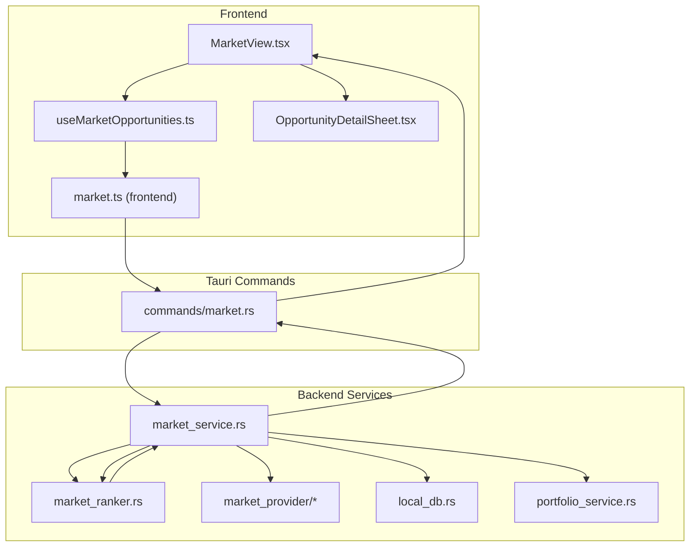
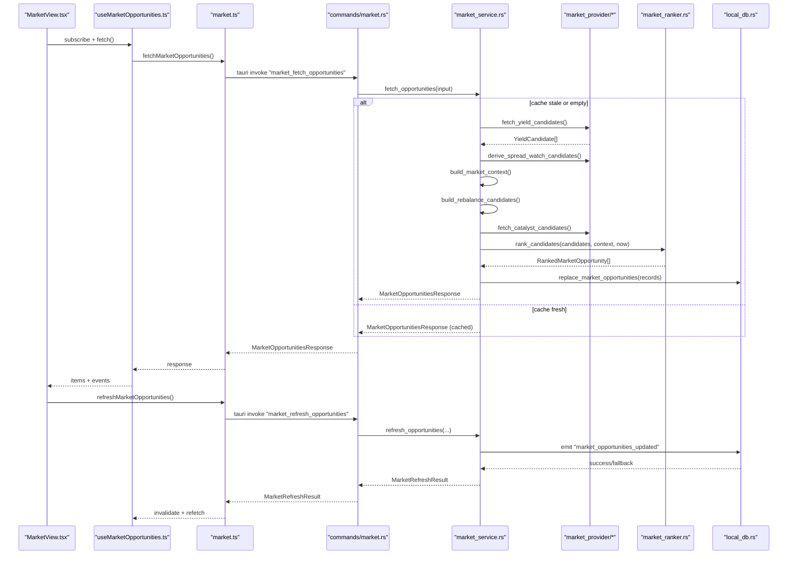
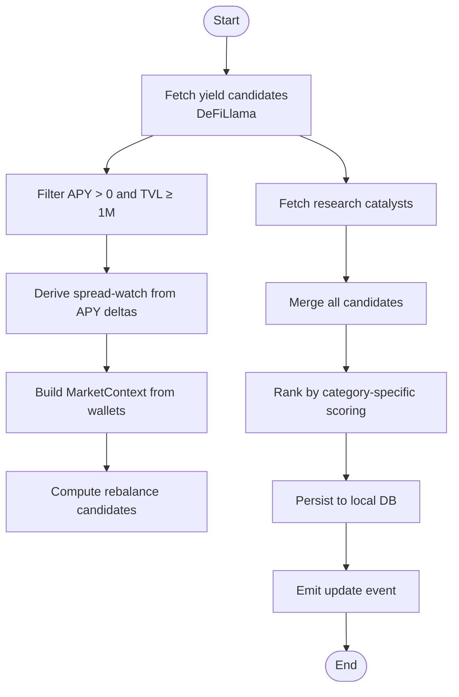
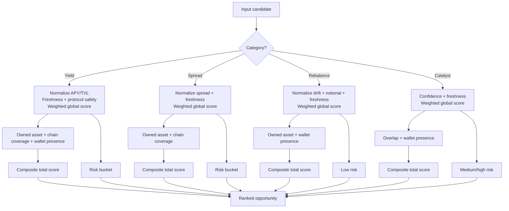
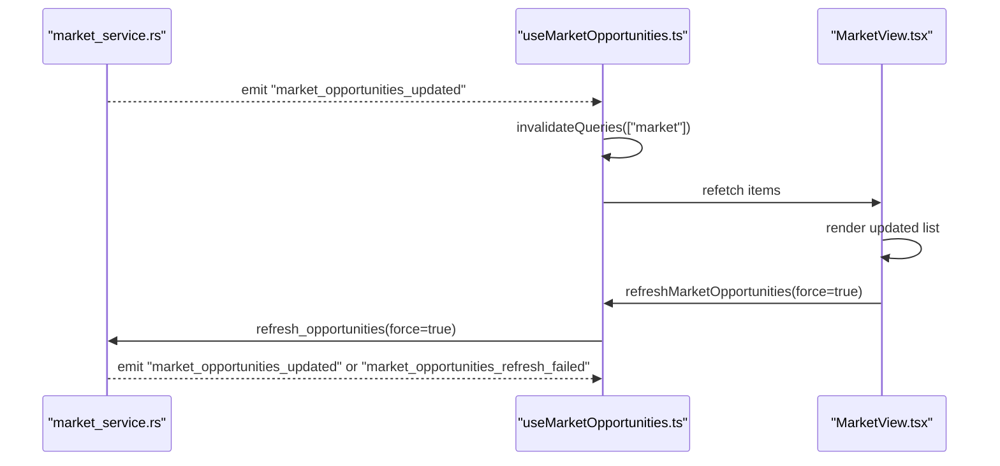
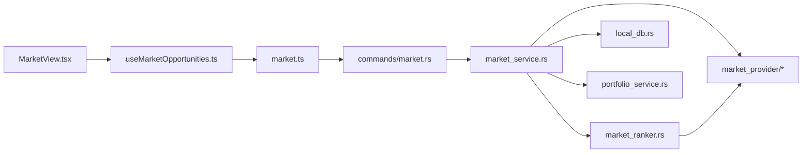
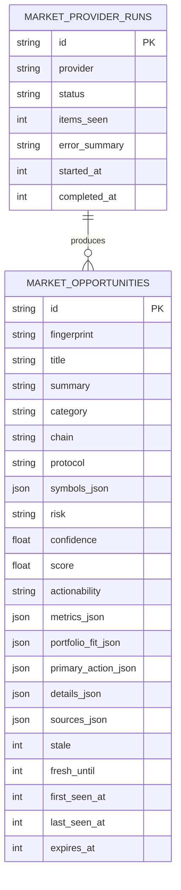

# Opportunity Scanner & Ranking

<cite>
**Referenced Files in This Document**
- [market_service.rs](file://src-tauri/src/services/market_service.rs)
- [market_ranker.rs](file://src-tauri/src/services/market_ranker.rs)
- [market_provider/mod.rs](file://src-tauri/src/services/market_provider/mod.rs)
- [market_provider/defillama.rs](file://src-tauri/src/services/market_provider/defillama.rs)
- [market_provider/research.rs](file://src-tauri/src/services/market_provider/research.rs)
- [market.ts](file://src/lib/market.ts)
- [useMarketOpportunities.ts](file://src/hooks/useMarketOpportunities.ts)
- [MarketView.tsx](file://src/components/market/MarketView.tsx)
- [OpportunityDetailSheet.tsx](file://src/components/market/OpportunityDetailSheet.tsx)
- [market.rs](file://src-tauri/src/commands/market.rs)
- [local_db.rs](file://src-tauri/src/services/local_db.rs)
- [portfolio_service.rs](file://src-tauri/src/services/portfolio_service.rs)
- [market.ts (frontend types)](file://src/types/market.ts)
</cite>

## Table of Contents
1. [Introduction](#introduction)
2. [Project Structure](#project-structure)
3. [Core Components](#core-components)
4. [Architecture Overview](#architecture-overview)
5. [Detailed Component Analysis](#detailed-component-analysis)
6. [Dependency Analysis](#dependency-analysis)
7. [Performance Considerations](#performance-considerations)
8. [Troubleshooting Guide](#troubleshooting-guide)
9. [Conclusion](#conclusion)
10. [Appendices](#appendices)

## Introduction
This document explains the opportunity scanning and ranking system that powers the Market view. It covers how multi-source signals are ingested, transformed, and ranked into actionable opportunities, including yield farms, spread-watch alerts, portfolio rebalances, and research catalysts. It documents the ranking algorithms, risk assessment, portfolio-fit scoring, and the end-to-end pipeline from data ingestion to UI presentation. Practical examples demonstrate filtering, risk-adjusted scoring, and portfolio-specific recommendations, along with performance optimization strategies for large-scale processing and real-time updates.

## Project Structure
The system spans Rust backend services, Tauri commands, React frontend hooks and views, and a local SQLite store. The backend orchestrates providers, computes rankings, persists results, and emits updates. The frontend queries and renders opportunities, supports filtering and refreshing, and launches agent or approval flows based on actionability.

**Diagram sources**
- [MarketView.tsx:1-267](file://src/components/market/MarketView.tsx#L1-L267)
- [useMarketOpportunities.ts:1-131](file://src/hooks/useMarketOpportunities.ts#L1-L131)
- [market.ts:1-135](file://src/lib/market.ts#L1-L135)
- [market.rs:1-36](file://src-tauri/src/commands/market.rs#L1-L36)
- [market_service.rs:1-745](file://src-tauri/src/services/market_service.rs#L1-L745)
- [market_ranker.rs:1-559](file://src-tauri/src/services/market_ranker.rs#L1-L559)
- [market_provider/mod.rs:1-160](file://src-tauri/src/services/market_provider/mod.rs#L1-L160)
- [local_db.rs:1-800](file://src-tauri/src/services/local_db.rs#L1-L800)
- [portfolio_service.rs:1-498](file://src-tauri/src/services/portfolio_service.rs#L1-L498)

**Section sources**
- [market_service.rs:1-745](file://src-tauri/src/services/market_service.rs#L1-L745)
- [market_ranker.rs:1-559](file://src-tauri/src/services/market_ranker.rs#L1-L559)
- [market_provider/mod.rs:1-160](file://src-tauri/src/services/market_provider/mod.rs#L1-L160)
- [market_provider/defillama.rs:1-151](file://src-tauri/src/services/market_provider/defillama.rs#L1-L151)
- [market_provider/research.rs:1-112](file://src-tauri/src/services/market_provider/research.rs#L1-L112)
- [market.ts:1-135](file://src/lib/market.ts#L1-L135)
- [useMarketOpportunities.ts:1-131](file://src/hooks/useMarketOpportunities.ts#L1-L131)
- [MarketView.tsx:1-267](file://src/components/market/MarketView.tsx#L1-L267)
- [OpportunityDetailSheet.tsx:1-110](file://src/components/market/OpportunityDetailSheet.tsx#L1-L110)
- [market.rs:1-36](file://src-tauri/src/commands/market.rs#L1-L36)
- [local_db.rs:1-800](file://src-tauri/src/services/local_db.rs#L1-L800)
- [portfolio_service.rs:1-498](file://src-tauri/src/services/portfolio_service.rs#L1-L498)
- [market.ts (frontend types):1-134](file://src/types/market.ts#L1-L134)

## Core Components
- Multi-source providers:
  - Yield candidates from DeFiLlama pools.
  - Spread-watch candidates derived from yield APY differences across chains.
  - Portfolio-derived rebalance candidates.
  - Research catalysts synthesized from AI.
- Ranking engine:
  - Category-specific scoring with weighted factors.
  - Freshness decay and normalization.
  - Risk buckets and guardrail compatibility.
- Portfolio context:
  - Aggregated holdings by symbol and chain.
  - Stablecoin and total portfolio valuation.
- Persistence and caching:
  - SQLite-backed market opportunities and provider runs.
  - TTL-based freshness and cache invalidation.
- Frontend:
  - Query orchestration, filtering, and real-time refresh.
  - Actionability-driven UX (agent-ready, approval-required, research-only).

**Section sources**
- [market_provider/mod.rs:1-160](file://src-tauri/src/services/market_provider/mod.rs#L1-L160)
- [market_provider/defillama.rs:1-151](file://src-tauri/src/services/market_provider/defillama.rs#L1-L151)
- [market_provider/research.rs:1-112](file://src-tauri/src/services/market_provider/research.rs#L1-L112)
- [market_service.rs:430-529](file://src-tauri/src/services/market_service.rs#L430-L529)
- [market_ranker.rs:1-559](file://src-tauri/src/services/market_ranker.rs#L1-L559)
- [local_db.rs:180-220](file://src-tauri/src/services/local_db.rs#L180-L220)
- [market.ts:1-135](file://src/lib/market.ts#L1-L135)
- [useMarketOpportunities.ts:1-131](file://src/hooks/useMarketOpportunities.ts#L1-L131)
- [MarketView.tsx:1-267](file://src/components/market/MarketView.tsx#L1-L267)

## Architecture Overview
End-to-end flow:
- Providers fetch raw signals (yield pools, research).
- Candidates are enriched and transformed (e.g., spread derivation).
- A MarketContext is built from wallet holdings.
- Ranker computes category-specific scores, risk, and portfolio-fit.
- Results are persisted, tagged with freshness, and emitted to the UI.
- Frontend queries, caches, and displays opportunities with actionability.

**Diagram sources**
- [MarketView.tsx:1-267](file://src/components/market/MarketView.tsx#L1-L267)
- [useMarketOpportunities.ts:1-131](file://src/hooks/useMarketOpportunities.ts#L1-L131)
- [market.ts:1-135](file://src/lib/market.ts#L1-L135)
- [market.rs:1-36](file://src-tauri/src/commands/market.rs#L1-L36)
- [market_service.rs:220-365](file://src-tauri/src/services/market_service.rs#L220-L365)
- [market_provider/mod.rs:84-160](file://src-tauri/src/services/market_provider/mod.rs#L84-L160)
- [market_provider/defillama.rs:27-116](file://src-tauri/src/services/market_provider/defillama.rs#L27-L116)
- [market_provider/research.rs:23-83](file://src-tauri/src/services/market_provider/research.rs#L23-L83)
- [market_ranker.rs:17-48](file://src-tauri/src/services/market_ranker.rs#L17-L48)
- [local_db.rs:180-220](file://src-tauri/src/services/local_db.rs#L180-L220)

## Detailed Component Analysis

### Multi-source Opportunity Detection
- Yield candidates:
  - Fetched from DeFiLlama, filtered by positive APY and minimum TVL, normalized to canonical symbols/chains, and truncated to top-ranked sets.
- Spread-watch candidates:
  - Derived by grouping yield candidates by symbol and computing APY spread across chains; only significant spreads are retained.
- Rebalance candidates:
  - Portfolio-derived drift thresholds for stablecoin allocation and chain concentration; includes notional sizing and freshness.
- Research catalysts:
  - AI-generated opportunities with confidence and symbol coverage; normalized to supported chains.

**Diagram sources**
- [market_provider/defillama.rs:27-116](file://src-tauri/src/services/market_provider/defillama.rs#L27-L116)
- [market_provider/mod.rs:84-160](file://src-tauri/src/services/market_provider/mod.rs#L84-L160)
- [market_service.rs:430-529](file://src-tauri/src/services/market_service.rs#L430-L529)
- [market_provider/research.rs:23-83](file://src-tauri/src/services/market_provider/research.rs#L23-L83)
- [market_service.rs:318-365](file://src-tauri/src/services/market_service.rs#L318-L365)
- [local_db.rs:180-220](file://src-tauri/src/services/local_db.rs#L180-L220)

**Section sources**
- [market_provider/defillama.rs:1-151](file://src-tauri/src/services/market_provider/defillama.rs#L1-L151)
- [market_provider/mod.rs:1-160](file://src-tauri/src/services/market_provider/mod.rs#L1-L160)
- [market_service.rs:430-529](file://src-tauri/src/services/market_service.rs#L430-L529)
- [market_provider/research.rs:1-112](file://src-tauri/src/services/market_provider/research.rs#L1-L112)

### Market Ranker Implementation
- Yield:
  - Global score: weighted combination of APY, TVL, protocol safety, and freshness.
  - Personal score: rewards owned assets, chain coverage, and wallet presence.
  - Risk: low/medium/high based on stablecoin flag, APY, and TVL thresholds.
  - Confidence: composite of global and personal scores.
- Spread-watch:
  - Global score: weighted spread magnitude and freshness.
  - Personal score: owned assets and chain coverage.
  - Risk: medium/high depending on spread size.
- Rebalance:
  - Global score: drift severity and notional importance.
  - Personal score: asset overlap and wallet presence.
  - Actionability: approval-ready when conditions met.
- Catalyst:
  - Global score: research confidence and freshness.
  - Personal score: asset overlap and wallet presence.
  - Actionability: research-only.

**Diagram sources**
- [market_ranker.rs:50-187](file://src-tauri/src/services/market_ranker.rs#L50-L187)
- [market_ranker.rs:189-294](file://src-tauri/src/services/market_ranker.rs#L189-L294)
- [market_ranker.rs:296-404](file://src-tauri/src/services/market_ranker.rs#L296-L404)
- [market_ranker.rs:407-493](file://src-tauri/src/services/market_ranker.rs#L407-L493)

**Section sources**
- [market_ranker.rs:1-559](file://src-tauri/src/services/market_ranker.rs#L1-L559)

### Candidate Evaluation Pipeline and Weighted Scoring
- Normalization:
  - Scales numeric features to [0,1] using fixed floors and ceilings per category.
- Freshness:
  - Penalizes candidates past their freshness window; caps remaining lifetime influence.
- Weighted scoring:
  - Computes a weighted sum of normalized factors; clamps to [0,1].
- Risk assessment:
  - Heuristic thresholds define risk buckets aligned with opportunity category.
- Portfolio fit:
  - Boolean and ratio-based measures of asset ownership, chain coverage, and wallet presence.

Practical examples:
- Filtering by minimum APY and TVL ensures high-liquidity, meaningful opportunities.
- Risk-adjusted scoring caps high APY when TVL or stability flags are unfavorable.
- Portfolio-specific recommendations prioritize assets already held or chains with existing exposure.

**Section sources**
- [market_ranker.rs:517-534](file://src-tauri/src/services/market_ranker.rs#L517-L534)
- [market_ranker.rs:508-515](file://src-tauri/src/services/market_ranker.rs#L508-L515)
- [market_ranker.rs:517-523](file://src-tauri/src/services/market_ranker.rs#L517-L523)

### Ranking Breakdown, Confidence Scoring, and Actionability
- Ranking breakdown:
  - Global score, personal score, and total score with rationale per category.
- Confidence:
  - Composite score derived from global and personal components; capped to [0,1].
- Actionability:
  - agent_ready: route/execute via agent assistance.
  - approval_ready: requires governance or approval before execution.
  - research_only: informational; no direct execution path.

**Section sources**
- [market_ranker.rs:169-184](file://src-tauri/src/services/market_ranker.rs#L169-L184)
- [market_ranker.rs:281-291](file://src-tauri/src/services/market_ranker.rs#L281-L291)
- [market_ranker.rs:388-402](file://src-tauri/src/services/market_ranker.rs#L388-L402)
- [market_ranker.rs:480-490](file://src-tauri/src/services/market_ranker.rs#L480-L490)
- [market.ts (frontend types):85-98](file://src/types/market.ts#L85-L98)

### Real-time Updates and Frontend Integration
- Backend:
  - Periodic refresh with alternating research inclusion.
  - Emits “market_opportunities_updated” and “market_opportunities_refresh_failed”.
- Frontend:
  - React Query-based caching and refetch on events.
  - Filters by category and chain; refresh triggers background update.
  - Launches agent threads or approval flows based on actionability.

**Diagram sources**
- [market_service.rs:213-217](file://src-tauri/src/services/market_service.rs#L213-L217)
- [market_service.rs:352-362](file://src-tauri/src/services/market_service.rs#L352-L362)
- [useMarketOpportunities.ts:64-92](file://src/hooks/useMarketOpportunities.ts#L64-L92)
- [MarketView.tsx:173-183](file://src/components/market/MarketView.tsx#L173-L183)

**Section sources**
- [market_service.rs:189-218](file://src-tauri/src/services/market_service.rs#L189-L218)
- [useMarketOpportunities.ts:1-131](file://src/hooks/useMarketOpportunities.ts#L1-L131)
- [MarketView.tsx:1-267](file://src/components/market/MarketView.tsx#L1-L267)

## Dependency Analysis
- Coupling:
  - market_service depends on market_provider, market_ranker, local_db, and portfolio_service.
  - market_ranker depends on market_provider candidate types and market_service helpers.
  - Frontend depends on Tauri commands and React Query.
- Cohesion:
  - Each provider module encapsulates a single data source.
  - Ranking logic is centralized and category-specific.
- External dependencies:
  - DeFiLlama API for yield data.
  - Sonar client for research synthesis.
  - SQLite for persistence and indexing.

**Diagram sources**
- [market_service.rs:1-745](file://src-tauri/src/services/market_service.rs#L1-L745)
- [market_ranker.rs:1-559](file://src-tauri/src/services/market_ranker.rs#L1-L559)
- [market_provider/mod.rs:1-160](file://src-tauri/src/services/market_provider/mod.rs#L1-L160)
- [local_db.rs:1-800](file://src-tauri/src/services/local_db.rs#L1-L800)
- [portfolio_service.rs:1-498](file://src-tauri/src/services/portfolio_service.rs#L1-L498)
- [MarketView.tsx:1-267](file://src/components/market/MarketView.tsx#L1-L267)
- [useMarketOpportunities.ts:1-131](file://src/hooks/useMarketOpportunities.ts#L1-L131)
- [market.ts:1-135](file://src/lib/market.ts#L1-L135)
- [market.rs:1-36](file://src-tauri/src/commands/market.rs#L1-L36)

**Section sources**
- [market_service.rs:1-745](file://src-tauri/src/services/market_service.rs#L1-L745)
- [market_ranker.rs:1-559](file://src-tauri/src/services/market_ranker.rs#L1-L559)
- [market_provider/mod.rs:1-160](file://src-tauri/src/services/market_provider/mod.rs#L1-L160)
- [local_db.rs:1-800](file://src-tauri/src/services/local_db.rs#L1-L800)
- [portfolio_service.rs:1-498](file://src-tauri/src/services/portfolio_service.rs#L1-L498)
- [market.ts:1-135](file://src/lib/market.ts#L1-L135)
- [market.rs:1-36](file://src-tauri/src/commands/market.rs#L1-L36)

## Performance Considerations
- Provider limits and truncation:
  - Yield lists are sorted and truncated to a fixed cap to bound downstream computation.
- Freshness windows:
  - Candidates carry freshness timestamps; expired items are downweighted to avoid stale recommendations.
- Indexing:
  - SQLite indices on category, score, and timestamps optimize retrieval and sorting.
- Background refresh cadence:
  - Market refresh interval is 15 minutes; research refresh is hourly, with alternating inclusion to balance latency and cost.
- Portfolio context building:
  - Aggregation across wallets is linear in token count; keep wallet lists minimal and normalized.
- UI caching:
  - React Query caching with short staleness reduces redundant backend calls.

[No sources needed since this section provides general guidance]

## Troubleshooting Guide
- No opportunities shown:
  - Verify wallet addresses are valid and synced; portfolio-derived rebalances require holdings.
  - Check filters (category/chain) and refresh.
- Stale data:
  - Observe “stale” indicator; backend falls back to cached results when providers fail.
- Actionability mismatch:
  - research_only opportunities do not expose direct actions; use “View detail” or agent flow.
- Errors:
  - Inspect emitted “market_opportunities_refresh_failed” event and logs; backend attempts fallback to cached data.

**Section sources**
- [market_service.rs:601-624](file://src-tauri/src/services/market_service.rs#L601-L624)
- [MarketView.tsx:186-196](file://src/components/market/MarketView.tsx#L186-L196)
- [market.ts:110-134](file://src/lib/market.ts#L110-L134)

## Conclusion
The opportunity scanning and ranking system aggregates multi-source signals, applies category-specific scoring with risk and portfolio-fit adjustments, and surfaces timely, actionable insights. Its modular design enables incremental improvements per category, robust caching for resilience, and a clear separation between data ingestion, ranking, persistence, and presentation.

[No sources needed since this section summarizes without analyzing specific files]

## Appendices

### Practical Examples

- Opportunity filtering:
  - Minimum APY and TVL thresholds ensure meaningful yield opportunities.
  - Chain and category filters refine the shortlist.
- Risk-adjusted scoring:
  - High APY on low TVL or unstable protocols receives lower global/personal scores.
  - Spread-watch risk increases with larger spreads.
- Portfolio-specific recommendations:
  - Owned assets and chain presence improve personal scores; rebalance candidates appear when drift exceeds thresholds.

**Section sources**
- [market_provider/defillama.rs:61-66](file://src-tauri/src/services/market_provider/defillama.rs#L61-L66)
- [market_ranker.rs:80-86](file://src-tauri/src/services/market_ranker.rs#L80-L86)
- [market_ranker.rs:226-227](file://src-tauri/src/services/market_ranker.rs#L226-L227)
- [market_service.rs:462-529](file://src-tauri/src/services/market_service.rs#L462-L529)

### Data Model Overview

**Diagram sources**
- [local_db.rs:180-220](file://src-tauri/src/services/local_db.rs#L180-L220)
- [local_db.rs:209-219](file://src-tauri/src/services/local_db.rs#L209-L219)