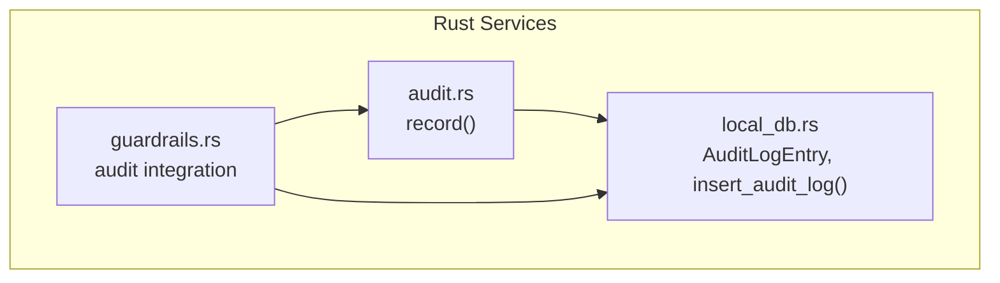
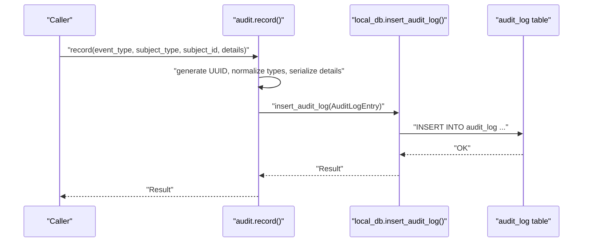
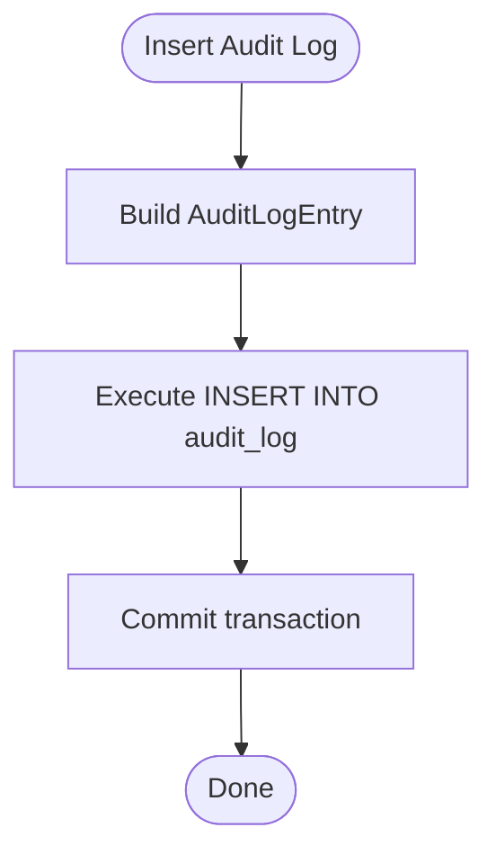
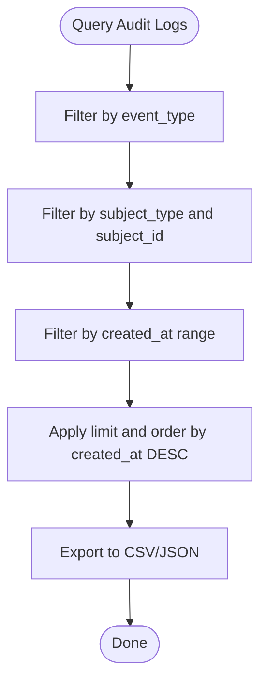
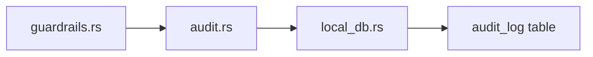
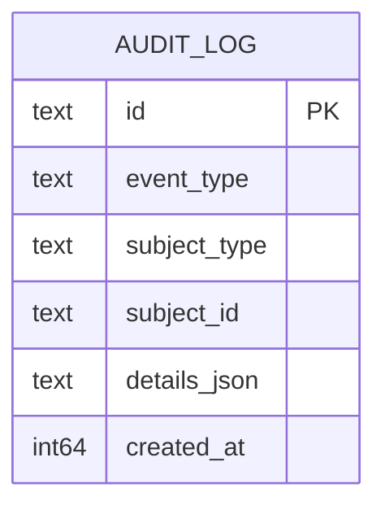

# Audit Logging System

<cite>
**Referenced Files in This Document**
- [audit.rs](file://src-tauri/src/services/audit.rs)
- [local_db.rs](file://src-tauri/src/services/local_db.rs)
- [guardrails.rs](file://src-tauri/src/services/guardrails.rs)
</cite>

## Table of Contents
1. [Introduction](#introduction)
2. [Project Structure](#project-structure)
3. [Core Components](#core-components)
4. [Architecture Overview](#architecture-overview)
5. [Detailed Component Analysis](#detailed-component-analysis)
6. [Dependency Analysis](#dependency-analysis)
7. [Performance Considerations](#performance-considerations)
8. [Troubleshooting Guide](#troubleshooting-guide)
9. [Conclusion](#conclusion)
10. [Appendices](#appendices)

## Introduction
This document describes the audit logging system used to capture and persist operational, security, and system events. It explains the audit log entry structure, event categorization, serialization of event details, and integration with the local database layer. It also covers query interfaces, filtering capabilities, export readiness, performance considerations for high-volume logging, and alignment with external compliance frameworks.

## Project Structure
The audit logging system spans two Rust modules:
- A service module that records audit events and serializes details.
- A local database module that defines the audit log schema, indexes, and persistence operations.

**Diagram sources**
- [audit.rs:1-25](file://src-tauri/src/services/audit.rs#L1-L25)
- [local_db.rs:1034-1043](file://src-tauri/src/services/local_db.rs#L1034-L1043)
- [local_db.rs:1257-1272](file://src-tauri/src/services/local_db.rs#L1257-L1272)
- [guardrails.rs:217-275](file://src-tauri/src/services/guardrails.rs#L217-L275)
- [guardrails.rs:484-519](file://src-tauri/src/services/guardrails.rs#L484-L519)

**Section sources**
- [audit.rs:1-25](file://src-tauri/src/services/audit.rs#L1-L25)
- [local_db.rs:169-178](file://src-tauri/src/services/local_db.rs#L169-L178)
- [local_db.rs:1034-1043](file://src-tauri/src/services/local_db.rs#L1034-L1043)
- [local_db.rs:1257-1272](file://src-tauri/src/services/local_db.rs#L1257-L1272)
- [guardrails.rs:217-275](file://src-tauri/src/services/guardrails.rs#L217-L275)
- [guardrails.rs:484-519](file://src-tauri/src/services/guardrails.rs#L484-L519)

## Core Components
- Audit entry structure: The audit log entry includes a unique identifier, event type, subject type, optional subject identifier, serialized details, and a creation timestamp.
- Event recording: The record function constructs an entry with a UUID, normalized event and subject types, optional subject ID, JSON-serialized details, and a UNIX epoch timestamp.
- Database integration: The local database module defines the audit_log table, creates an index on created_at, and exposes an insert function to persist entries.

Key data model and persistence:
- AuditLogEntry fields: id, event_type, subject_type, subject_id, details_json, created_at.
- Schema: audit_log table with primary key on id and an index on created_at.
- Insert operation: insert_audit_log writes a single audit log row.

**Section sources**
- [local_db.rs:1034-1043](file://src-tauri/src/services/local_db.rs#L1034-L1043)
- [local_db.rs:169-178](file://src-tauri/src/services/local_db.rs#L169-L178)
- [local_db.rs:1257-1272](file://src-tauri/src/services/local_db.rs#L1257-L1272)
- [audit.rs:5-24](file://src-tauri/src/services/audit.rs#L5-L24)

## Architecture Overview
The audit logging pipeline captures events, serializes details, and persists them to the local database. Guardrails integrate with the audit system to record guardrail-related events.

**Diagram sources**
- [audit.rs:5-24](file://src-tauri/src/services/audit.rs#L5-L24)
- [local_db.rs:1257-1272](file://src-tauri/src/services/local_db.rs#L1257-L1272)

## Detailed Component Analysis

### Audit Entry Structure
- Fields:
  - id: Unique identifier for the event.
  - event_type: Category/type of the event (e.g., guardrails_updated, kill_switch_activated, guardrail_violation).
  - subject_type: Type of the subject (e.g., guardrails, action).
  - subject_id: Optional identifier for the subject (e.g., a guardrail violation ID).
  - details_json: Serialized details payload as JSON.
  - created_at: UNIX epoch seconds timestamp.

- Serialization:
  - The details payload is serialized to JSON using a serde-compatible type.
  - Timestamps are derived from the system clock as UNIX epoch seconds.

- Indexing:
  - An index exists on created_at to optimize chronological queries.

**Section sources**
- [local_db.rs:1034-1043](file://src-tauri/src/services/local_db.rs#L1034-L1043)
- [local_db.rs:169-178](file://src-tauri/src/services/local_db.rs#L169-L178)
- [audit.rs:11-21](file://src-tauri/src/services/audit.rs#L11-L21)

### Recording Audit Events
- Function signature: record(event_type, subject_type, subject_id, details).
- Behavior:
  - Generates a new UUID for the event.
  - Normalizes string inputs to owned strings.
  - Serializes details to JSON; falls back to an empty JSON object if serialization fails.
  - Captures the current UNIX epoch timestamp.
  - Inserts the entry via the database layer.

Practical examples of recorded events:
- Guardrails configuration updates:
  - event_type: guardrails_updated
  - subject_type: guardrails
  - details: JSON containing configuration changes (e.g., kill switch state)
- Kill switch activation/deactivation:
  - event_type: kill_switch_activated / kill_switch_deactivated
  - subject_type: guardrails
  - details: JSON indicating trigger (e.g., manual)
- Guardrail violations:
  - event_type: guardrail_violation
  - subject_type: action
  - subject_id: optional (e.g., guardrail violation ID)
  - details: JSON including action type and violated guardrail types

**Section sources**
- [audit.rs:5-24](file://src-tauri/src/services/audit.rs#L5-L24)
- [guardrails.rs:217-275](file://src-tauri/src/services/guardrails.rs#L217-L275)
- [guardrails.rs:484-519](file://src-tauri/src/services/guardrails.rs#L484-L519)

### Database Integration and Persistence
- Schema:
  - audit_log table with fields: id, event_type, subject_type, subject_id, details_json, created_at.
  - Index on created_at for efficient time-based queries.
- Insertion:
  - insert_audit_log performs a single-row insertion with prepared parameters.

**Diagram sources**
- [local_db.rs:1257-1272](file://src-tauri/src/services/local_db.rs#L1257-L1272)

**Section sources**
- [local_db.rs:169-178](file://src-tauri/src/services/local_db.rs#L169-L178)
- [local_db.rs:1257-1272](file://src-tauri/src/services/local_db.rs#L1257-L1272)

### Query Interface and Filtering Capabilities
- Current database operations expose retrieval helpers for other tables but do not define dedicated audit log query functions in the shown excerpts.
- To enable robust querying and filtering, consider adding:
  - Select by event_type with pagination.
  - Select by subject_type and subject_id.
  - Range queries using created_at timestamps.
  - Limit and ordering by created_at DESC.
- Export readiness:
  - Add a function to fetch audit logs with filters and return structured records suitable for export.

Note: The following query interface is conceptual and not present in the current codebase; it is proposed for completeness.

[No sources needed since this diagram shows conceptual workflow, not actual code structure]

### Compliance Reporting Capabilities
- Event categorization supports compliance-relevant categories:
  - Security: kill_switch_activated, guardrail_violation.
  - Configuration: guardrails_updated.
- Timestamps support temporal compliance reporting.
- JSON details enable detailed reconstruction of events for audits.

[No sources needed since this section doesn't analyze specific source files]

## Dependency Analysis
The audit system integrates guardrails and the local database layer.

**Diagram sources**
- [guardrails.rs:217-275](file://src-tauri/src/services/guardrails.rs#L217-L275)
- [guardrails.rs:484-519](file://src-tauri/src/services/guardrails.rs#L484-L519)
- [audit.rs:1-25](file://src-tauri/src/services/audit.rs#L1-L25)
- [local_db.rs:1034-1043](file://src-tauri/src/services/local_db.rs#L1034-L1043)

**Section sources**
- [guardrails.rs:217-275](file://src-tauri/src/services/guardrails.rs#L217-L275)
- [guardrails.rs:484-519](file://src-tauri/src/services/guardrails.rs#L484-L519)
- [audit.rs:1-25](file://src-tauri/src/services/audit.rs#L1-L25)
- [local_db.rs:1034-1043](file://src-tauri/src/services/local_db.rs#L1034-L1043)

## Performance Considerations
- High-volume logging:
  - Use batched inserts when feasible to reduce transaction overhead.
  - Consider asynchronous logging to avoid blocking critical paths.
  - Tune SQLite pragmas and WAL mode for write-heavy workloads.
- Indexing:
  - The created_at index supports chronological queries; ensure appropriate filters leverage this index.
- Serialization:
  - Keep details payloads minimal to reduce storage and improve throughput.
- Retention:
  - Implement periodic cleanup or archival to control growth.

[No sources needed since this section provides general guidance]

## Troubleshooting Guide
- Serialization failures:
  - Details serialization falls back to an empty JSON object if serialization fails. Verify the details payload conforms to serde serialization.
- Timestamp anomalies:
  - Timestamps are derived from the system clock. Ensure system time is synchronized.
- Database initialization:
  - The database must be initialized before inserting audit logs. Confirm initialization occurs during application startup.

**Section sources**
- [audit.rs:11-21](file://src-tauri/src/services/audit.rs#L11-L21)
- [local_db.rs:437-448](file://src-tauri/src/services/local_db.rs#L437-L448)

## Conclusion
The audit logging system provides a compact, extensible foundation for capturing operational and security-relevant events. It offers a standardized entry structure, robust serialization, and a durable local database backend. Extending the query interface and implementing retention/export capabilities will further strengthen compliance reporting and operational visibility.

## Appendices

### Audit Log Data Model

**Diagram sources**
- [local_db.rs:169-178](file://src-tauri/src/services/local_db.rs#L169-L178)