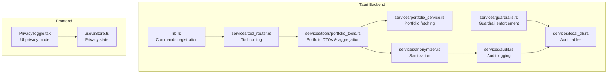
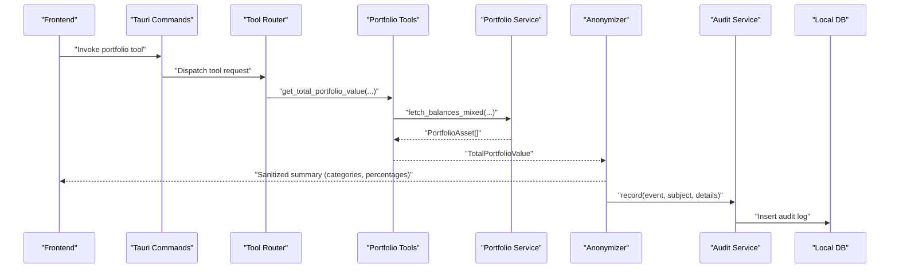
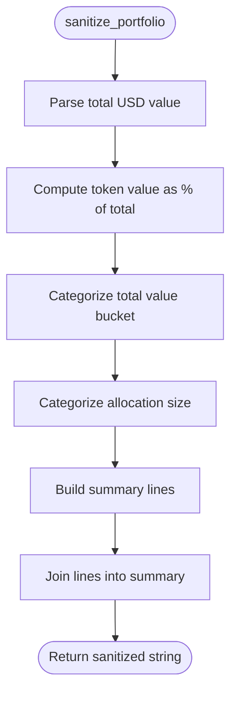
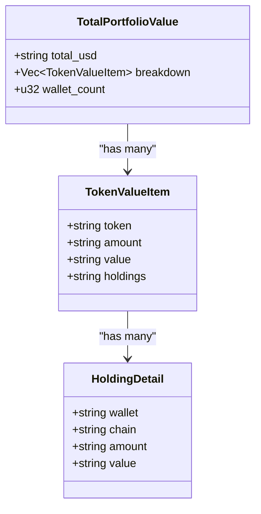
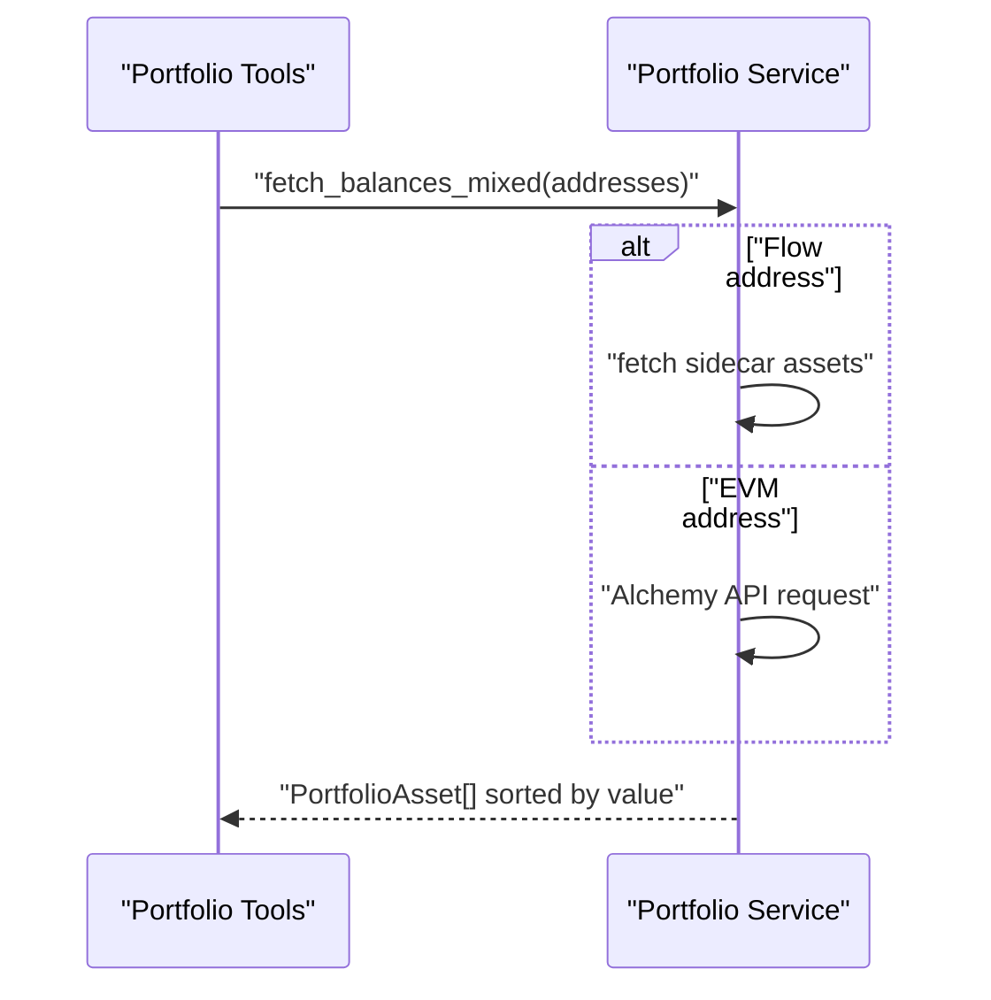
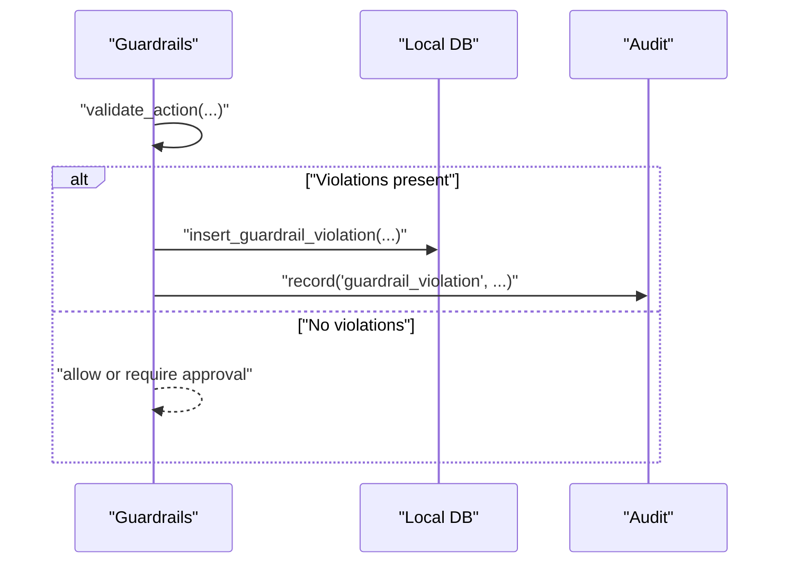
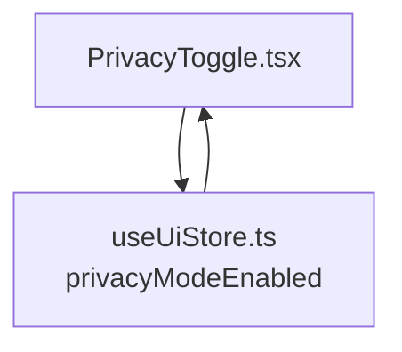
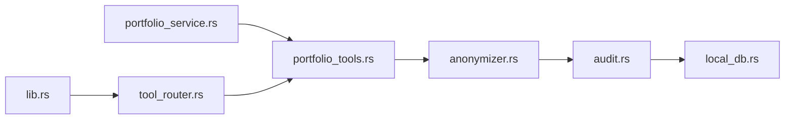

# Data Anonymization Service

<cite>
**Referenced Files in This Document**
- [anonymizer.rs](file://src-tauri/src/services/anonymizer.rs)
- [portfolio_tools.rs](file://src-tauri/src/services/tools/portfolio_tools.rs)
- [portfolio_service.rs](file://src-tauri/src/services/portfolio_service.rs)
- [audit.rs](file://src-tauri/src/services/audit.rs)
- [guardrails.rs](file://src-tauri/src/services/guardrails.rs)
- [local_db.rs](file://src-tauri/src/services/local_db.rs)
- [tool_router.rs](file://src-tauri/src/services/tool_router.rs)
- [lib.rs](file://src-tauri/src/lib.rs)
- [PrivacyToggle.tsx](file://src/components/shared/PrivacyToggle.tsx)
- [useUiStore.ts](file://src/store/useUiStore.ts)
</cite>

## Table of Contents
1. [Introduction](#introduction)
2. [Project Structure](#project-structure)
3. [Core Components](#core-components)
4. [Architecture Overview](#architecture-overview)
5. [Detailed Component Analysis](#detailed-component-analysis)
6. [Dependency Analysis](#dependency-analysis)
7. [Performance Considerations](#performance-considerations)
8. [Troubleshooting Guide](#troubleshooting-guide)
9. [Conclusion](#conclusion)

## Introduction
This document describes the data anonymization service that protects sensitive information in audit trails and user data. It explains the anonymization algorithms and techniques used to transform raw portfolio data into privacy-preserving summaries suitable for external AI processing. The service focuses on:
- Data masking strategies (shortening wallet addresses)
- Pseudonymization processes (removing direct identifiers)
- Aggregation and categorization (replacing exact values with categories and percentages)
- Compliance with privacy regulations (privacy-by-design transformations)
- Integration with the audit system and guardrails
- Preservation of analytical utility while maintaining privacy
- Performance implications and balancing data utility vs. privacy

## Project Structure
The anonymization pipeline lives in the Tauri backend under the services module. It integrates with portfolio data retrieval, tool orchestration, and audit logging.

**Diagram sources**
- [lib.rs:90-190](file://src-tauri/src/lib.rs#L90-L190)
- [tool_router.rs:161-192](file://src-tauri/src/services/tool_router.rs#L161-L192)
- [portfolio_tools.rs:108-187](file://src-tauri/src/services/tools/portfolio_tools.rs#L108-L187)
- [portfolio_service.rs:228-269](file://src-tauri/src/services/portfolio_service.rs#L228-L269)
- [anonymizer.rs:7-28](file://src-tauri/src/services/anonymizer.rs#L7-L28)
- [audit.rs:5-24](file://src-tauri/src/services/audit.rs#L5-L24)
- [guardrails.rs:485-519](file://src-tauri/src/services/guardrails.rs#L485-L519)
- [local_db.rs:372-413](file://src-tauri/src/services/local_db.rs#L372-L413)

**Section sources**
- [lib.rs:90-190](file://src-tauri/src/lib.rs#L90-L190)
- [tool_router.rs:161-192](file://src-tauri/src/services/tool_router.rs#L161-L192)
- [portfolio_tools.rs:108-187](file://src-tauri/src/services/tools/portfolio_tools.rs#L108-L187)
- [portfolio_service.rs:228-269](file://src-tauri/src/services/portfolio_service.rs#L228-L269)
- [anonymizer.rs:7-28](file://src-tauri/src/services/anonymizer.rs#L7-L28)
- [audit.rs:5-24](file://src-tauri/src/services/audit.rs#L5-L24)
- [guardrails.rs:485-519](file://src-tauri/src/services/guardrails.rs#L485-L519)
- [local_db.rs:372-413](file://src-tauri/src/services/local_db.rs#L372-L413)

## Core Components
- Anonymization service: Transforms portfolio totals and allocations into category-labeled, percentage-weighted summaries without exposing exact values or addresses.
- Portfolio tooling: Provides DTOs and aggregation functions for portfolio data, including shortening wallet addresses and computing totals.
- Portfolio service: Fetches balances across chains and hydrates values, preparing data for anonymization.
- Audit and guardrails: Logs guardrail violations and integrates anonymized audit events for compliance.
- Frontend privacy toggle: UI state for enabling/disabling privacy mode.

Key anonymization behaviors:
- Wallet addresses are shortened to a safe, non-identifiable form.
- Exact USD values are replaced with categorical buckets for total portfolio value.
- Asset allocations are expressed as percentages and categorized (dominant, significant, moderate, small).
- No original sensitive identifiers (full wallet addresses) are emitted in sanitized output.

**Section sources**
- [anonymizer.rs:7-28](file://src-tauri/src/services/anonymizer.rs#L7-L28)
- [anonymizer.rs:30-55](file://src-tauri/src/services/anonymizer.rs#L30-L55)
- [portfolio_tools.rs:92-97](file://src-tauri/src/services/tools/portfolio_tools.rs#L92-L97)
- [portfolio_tools.rs:134-187](file://src-tauri/src/services/tools/portfolio_tools.rs#L134-L187)
- [portfolio_service.rs:228-269](file://src-tauri/src/services/portfolio_service.rs#L228-L269)

## Architecture Overview
The anonymization pipeline follows a clear flow from data ingestion to sanitization and audit logging.

**Diagram sources**
- [lib.rs:119-158](file://src-tauri/src/lib.rs#L119-L158)
- [tool_router.rs:161-192](file://src-tauri/src/services/tool_router.rs#L161-L192)
- [portfolio_tools.rs:108-124](file://src-tauri/src/services/tools/portfolio_tools.rs#L108-L124)
- [portfolio_service.rs:228-269](file://src-tauri/src/services/portfolio_service.rs#L228-L269)
- [anonymizer.rs:7-28](file://src-tauri/src/services/anonymizer.rs#L7-L28)
- [audit.rs:5-24](file://src-tauri/src/services/audit.rs#L5-L24)
- [local_db.rs:372-413](file://src-tauri/src/services/local_db.rs#L372-L413)

## Detailed Component Analysis

### Anonymization Service
The anonymization service transforms portfolio data into a privacy-preserving summary:
- Converts total portfolio value into categorical buckets (e.g., micro, small, medium, large, whale).
- Computes allocation percentages per token and categorizes them (dominant, significant, moderate, small).
- Shortens wallet addresses in holdings to a non-identifiable form.
- Produces a human-readable summary string suitable for external AI processing.

**Diagram sources**
- [anonymizer.rs:7-28](file://src-tauri/src/services/anonymizer.rs#L7-L28)
- [anonymizer.rs:30-55](file://src-tauri/src/services/anonymizer.rs#L30-L55)

**Section sources**
- [anonymizer.rs:7-28](file://src-tauri/src/services/anonymizer.rs#L7-L28)
- [anonymizer.rs:30-55](file://src-tauri/src/services/anonymizer.rs#L30-L55)

### Portfolio Tools and DTOs
Portfolio tools define the data structures and aggregation logic:
- TotalPortfolioValue aggregates token-level balances and counts wallets.
- TokenValueItem and HoldingDetail capture per-token totals and per-wallet holdings.
- Shortening of wallet addresses ensures no full identifiers leak into summaries.
- Aggregation computes totals and formats balances for downstream anonymization.

**Diagram sources**
- [portfolio_tools.rs:61-90](file://src-tauri/src/services/tools/portfolio_tools.rs#L61-L90)
- [portfolio_tools.rs:134-187](file://src-tauri/src/services/tools/portfolio_tools.rs#L134-L187)

**Section sources**
- [portfolio_tools.rs:61-90](file://src-tauri/src/services/tools/portfolio_tools.rs#L61-L90)
- [portfolio_tools.rs:92-97](file://src-tauri/src/services/tools/portfolio_tools.rs#L92-L97)
- [portfolio_tools.rs:134-187](file://src-tauri/src/services/tools/portfolio_tools.rs#L134-L187)

### Portfolio Service
The portfolio service fetches balances across supported chains and hydrates values:
- Mixed-mode fetching supports both EVM-style and Flow-style addresses.
- Balances are normalized and sorted by value.
- Values are formatted for downstream aggregation and anonymization.

**Diagram sources**
- [portfolio_service.rs:228-269](file://src-tauri/src/services/portfolio_service.rs#L228-L269)
- [portfolio_service.rs:271-418](file://src-tauri/src/services/portfolio_service.rs#L271-L418)

**Section sources**
- [portfolio_service.rs:228-269](file://src-tauri/src/services/portfolio_service.rs#L228-L269)
- [portfolio_service.rs:271-418](file://src-tauri/src/services/portfolio_service.rs#L271-L418)

### Audit and Guardrails Integration
Guardrails enforce policies and log violations to the database. The anonymization service integrates with the audit system by recording anonymized events for compliance.

**Diagram sources**
- [guardrails.rs:485-519](file://src-tauri/src/services/guardrails.rs#L485-L519)
- [audit.rs:5-24](file://src-tauri/src/services/audit.rs#L5-L24)
- [local_db.rs:2500-2515](file://src-tauri/src/services/local_db.rs#L2500-L2515)

**Section sources**
- [guardrails.rs:485-519](file://src-tauri/src/services/guardrails.rs#L485-L519)
- [audit.rs:5-24](file://src-tauri/src/services/audit.rs#L5-L24)
- [local_db.rs:372-413](file://src-tauri/src/services/local_db.rs#L372-L413)
- [local_db.rs:2500-2515](file://src-tauri/src/services/local_db.rs#L2500-L2515)

### Frontend Privacy Mode
The UI exposes a privacy toggle that reflects global privacy state. While the anonymization occurs in the backend, the frontend state helps coordinate user-facing privacy expectations.

**Diagram sources**
- [PrivacyToggle.tsx:10-31](file://src/components/shared/PrivacyToggle.tsx#L10-L31)
- [useUiStore.ts:29-92](file://src/store/useUiStore.ts#L29-L92)

**Section sources**
- [PrivacyToggle.tsx:10-31](file://src/components/shared/PrivacyToggle.tsx#L10-L31)
- [useUiStore.ts:29-92](file://src/store/useUiStore.ts#L29-L92)

## Dependency Analysis
The anonymization service depends on portfolio tooling and portfolio service for data preparation, and integrates with audit/logging for compliance.

**Diagram sources**
- [portfolio_tools.rs:108-187](file://src-tauri/src/services/tools/portfolio_tools.rs#L108-L187)
- [portfolio_service.rs:228-269](file://src-tauri/src/services/portfolio_service.rs#L228-L269)
- [anonymizer.rs:7-28](file://src-tauri/src/services/anonymizer.rs#L7-L28)
- [audit.rs:5-24](file://src-tauri/src/services/audit.rs#L5-L24)
- [local_db.rs:372-413](file://src-tauri/src/services/local_db.rs#L372-L413)
- [lib.rs:119-158](file://src-tauri/src/lib.rs#L119-L158)
- [tool_router.rs:161-192](file://src-tauri/src/services/tool_router.rs#L161-L192)

**Section sources**
- [portfolio_tools.rs:108-187](file://src-tauri/src/services/tools/portfolio_tools.rs#L108-L187)
- [portfolio_service.rs:228-269](file://src-tauri/src/services/portfolio_service.rs#L228-L269)
- [anonymizer.rs:7-28](file://src-tauri/src/services/anonymizer.rs#L7-L28)
- [audit.rs:5-24](file://src-tauri/src/services/audit.rs#L5-L24)
- [local_db.rs:372-413](file://src-tauri/src/services/local_db.rs#L372-L413)
- [lib.rs:119-158](file://src-tauri/src/lib.rs#L119-L158)
- [tool_router.rs:161-192](file://src-tauri/src/services/tool_router.rs#L161-L192)

## Performance Considerations
- Parsing and formatting: Converting USD strings to numeric values and formatting percentages is linear in the number of tokens.
- Aggregation: Hash map-based aggregation scales with distinct tokens; sorting by value adds overhead proportional to the number of assets.
- Network requests: Portfolio fetching involves external API calls; caching and batching can reduce latency and cost.
- Audit writes: Logging to local database is synchronous in the current implementation; consider asynchronous buffering for high-throughput scenarios.
- UI privacy toggle: Minimal overhead; primarily state synchronization.

Recommendations:
- Cache sanitized summaries when inputs are unchanged to avoid recomputation.
- Batch tool invocations to reduce repeated parsing/formatting.
- Offload audit writes to a background worker if throughput increases.

[No sources needed since this section provides general guidance]

## Troubleshooting Guide
Common issues and resolutions:
- Missing or invalid addresses: Portfolio fetching validates addresses; ensure EVM-style addresses are used for Alchemy queries.
- Empty or zero balances: Assets with zero balances or missing prices are filtered out during hydration.
- Audit logging failures: Guardrail violation logging falls back gracefully; check database initialization and permissions.
- Sanitization errors: Ensure TotalPortfolioValue fields are populated; malformed USD strings can cause parsing to default.

**Section sources**
- [portfolio_service.rs:271-275](file://src-tauri/src/services/portfolio_service.rs#L271-L275)
- [portfolio_service.rs:316-331](file://src-tauri/src/services/portfolio_service.rs#L316-L331)
- [guardrails.rs:505-507](file://src-tauri/src/services/guardrails.rs#L505-L507)
- [anonymizer.rs:14-15](file://src-tauri/src/services/anonymizer.rs#L14-L15)

## Conclusion
The anonymization service provides a robust, privacy-preserving transformation of portfolio data by:
- Masking wallet identifiers
- Replacing exact values with categorical buckets
- Expressing allocations as percentages and categories
- Integrating with audit and guardrails for compliance

This approach preserves analytical utility (distribution insights, relative weights) while minimizing privacy risks. The modular design enables future enhancements such as configurable thresholds, additional masking strategies, and asynchronous audit logging.