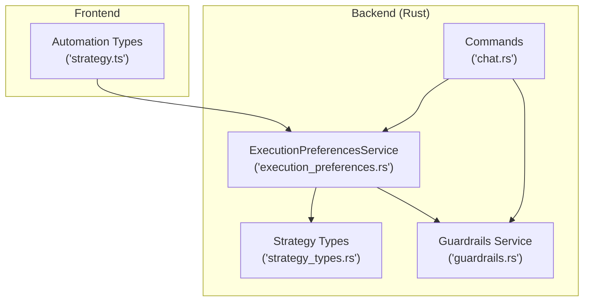
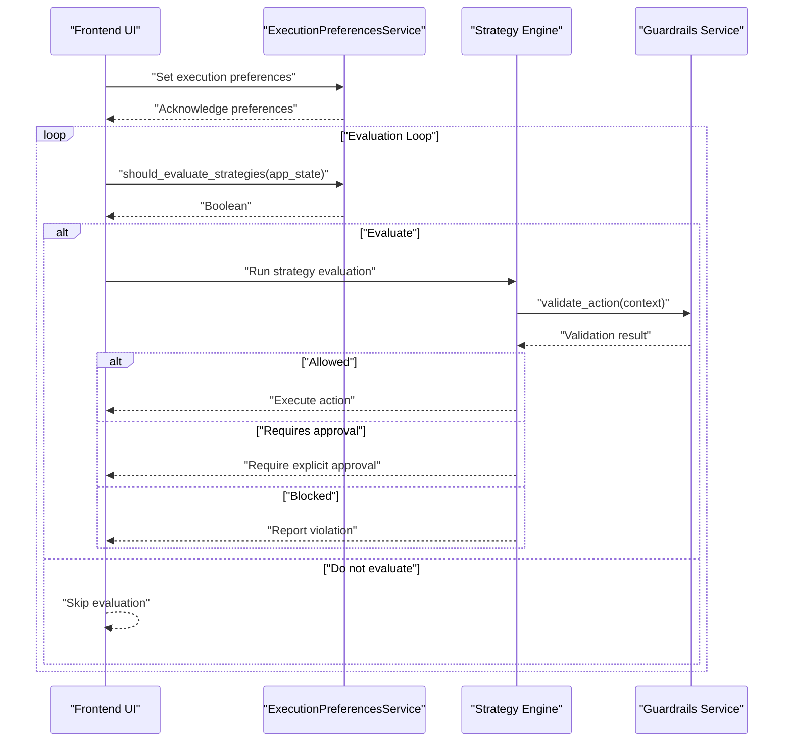
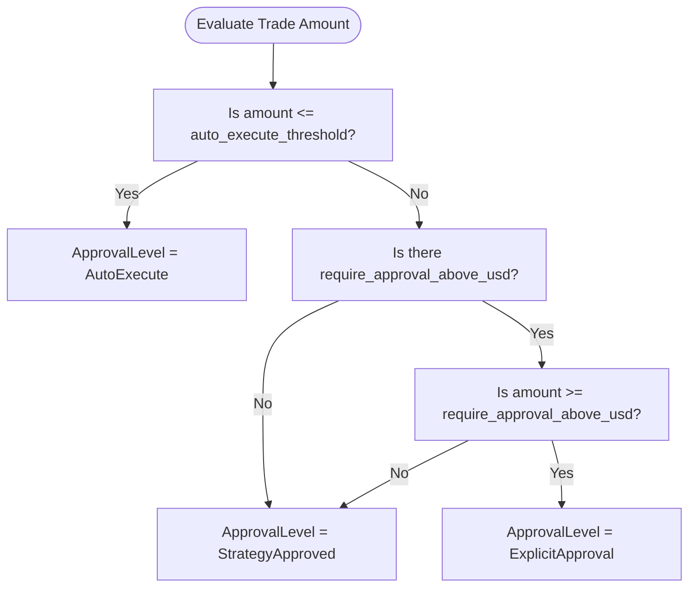
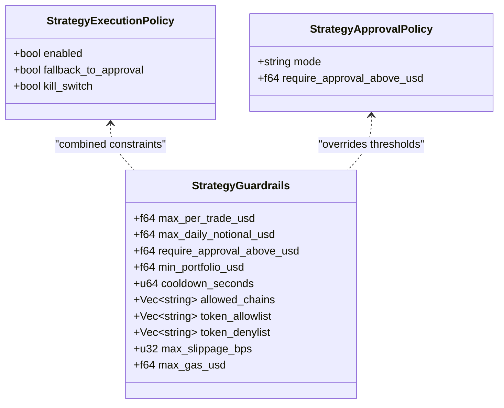
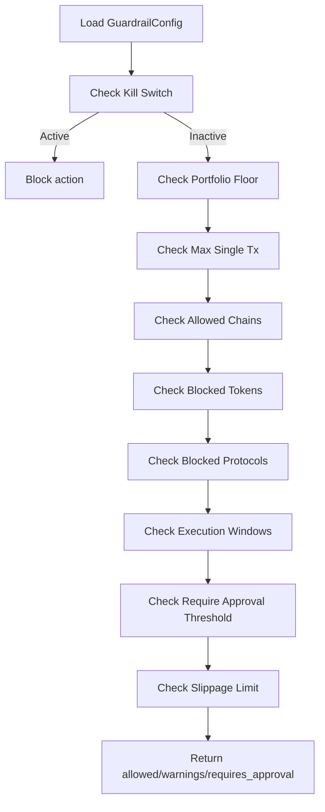
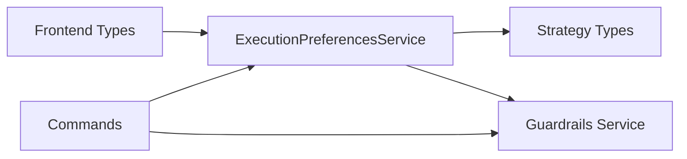

# Execution Preferences

<cite>
**Referenced Files in This Document**
- [execution_preferences.rs](file://src-tauri/src/services/execution_preferences.rs)
- [strategy_types.rs](file://src-tauri/src/services/strategy_types.rs)
- [guardrails.rs](file://src-tauri/src/services/guardrails.rs)
- [strategy.ts](file://src/types/automation.ts)
- [chat.rs](file://src-tauri/src/commands/chat.rs)
</cite>

## Table of Contents
1. [Introduction](#introduction)
2. [Project Structure](#project-structure)
3. [Core Components](#core-components)
4. [Architecture Overview](#architecture-overview)
5. [Detailed Component Analysis](#detailed-component-analysis)
6. [Dependency Analysis](#dependency-analysis)
7. [Performance Considerations](#performance-considerations)
8. [Troubleshooting Guide](#troubleshooting-guide)
9. [Conclusion](#conclusion)

## Introduction
This document explains the execution preferences system that governs user policy management and operational control for strategy automation. It covers how users configure execution modes, approval thresholds, and risk-related constraints, and how these preferences integrate with guardrails, strategy execution, and autonomous operations. It also documents preference validation, conflict resolution, and backward compatibility considerations, along with the relationship between user preferences and system-wide security policies.

## Project Structure
The execution preferences system spans Rust backend services and TypeScript frontend types:
- Rust backend defines execution preferences, approval levels, and guardrails validation.
- Frontend types define automation strategy structures and approval modes.
- Commands demonstrate how execution preferences influence strategy activation and scheduling.

**Diagram sources**
- [execution_preferences.rs:1-159](file://src-tauri/src/services/execution_preferences.rs#L1-L159)
- [strategy_types.rs:1-417](file://src-tauri/src/services/strategy_types.rs#L1-L417)
- [guardrails.rs:1-620](file://src-tauri/src/services/guardrails.rs#L1-L620)
- [strategy.ts:1-22](file://src/types/automation.ts#L1-L22)
- [chat.rs:448-456](file://src-tauri/src/commands/chat.rs#L448-L456)

**Section sources**
- [execution_preferences.rs:1-159](file://src-tauri/src/services/execution_preferences.rs#L1-L159)
- [strategy_types.rs:1-417](file://src-tauri/src/services/strategy_types.rs#L1-L417)
- [guardrails.rs:1-620](file://src-tauri/src/services/guardrails.rs#L1-L620)
- [strategy.ts:1-22](file://src/types/automation.ts#L1-L22)
- [chat.rs:448-456](file://src-tauri/src/commands/chat.rs#L448-L456)

## Core Components
- ExecutionPreferencesService: central service managing user execution preferences, including execution mode, auto-execution thresholds, and approval determination.
- StrategyExecutionPreferences and ExecutionPreference: structured preferences consumed by the engine and UI.
- ApprovalLevel: categorization of execution approvals derived from preferences and trade size.
- Guardrails: system-wide security constraints validated before any autonomous action.
- Automation Strategy Types: frontend types defining strategy structure and approval modes.

Key responsibilities:
- Determine when strategies should be evaluated based on execution mode and app state.
- Compute approval levels for trades based on configured thresholds.
- Enforce guardrails alongside strategy-level guardrails and approval policies.
- Provide defaults and backward compatibility for missing configurations.

**Section sources**
- [execution_preferences.rs:12-111](file://src-tauri/src/services/execution_preferences.rs#L12-L111)
- [strategy_types.rs:167-243](file://src-tauri/src/services/strategy_types.rs#L167-L243)
- [guardrails.rs:41-85](file://src-tauri/src/services/guardrails.rs#L41-L85)
- [strategy.ts:1-22](file://src/types/automation.ts#L1-L22)

## Architecture Overview
The execution preferences system integrates with strategy execution and guardrails to ensure safe, user-controlled automation.

**Diagram sources**
- [execution_preferences.rs:34-71](file://src-tauri/src/services/execution_preferences.rs#L34-L71)
- [guardrails.rs:277-426](file://src-tauri/src/services/guardrails.rs#L277-L426)
- [strategy_types.rs:167-243](file://src-tauri/src/services/strategy_types.rs#L167-L243)

## Detailed Component Analysis

### Execution Preferences Service
Responsibilities:
- Store and expose user execution preferences.
- Decide whether strategies should be evaluated based on execution mode and app state.
- Determine approval levels for trades based on configured thresholds.

Execution modes:
- ContinuousBackground: strategies are evaluated continuously.
- AppActiveOnly: strategies are evaluated only when the app is foreground.
- Scheduled: strategies are evaluated only within a configured time window.

Approval determination:
- AutoExecute: small trades below a configured threshold are auto-executed.
- StrategyApproved: medium trades follow strategy-level approval settings.
- ExplicitApproval: large trades above a configured threshold require explicit user approval.

**Diagram sources**
- [execution_preferences.rs:55-71](file://src-tauri/src/services/execution_preferences.rs#L55-L71)

**Section sources**
- [execution_preferences.rs:12-111](file://src-tauri/src/services/execution_preferences.rs#L12-L111)
- [execution_preferences.rs:34-71](file://src-tauri/src/services/execution_preferences.rs#L34-L71)

### Strategy Execution Preferences and Approval Policies
Structure and defaults:
- StrategyExecutionPolicy: controls whether execution is enabled, whether to fall back to approval, and whether a kill switch is active.
- StrategyApprovalPolicy: defines approval mode and optional threshold for requiring approval.
- StrategyGuardrails: strategy-level constraints (e.g., min portfolio, max slippage, allowed chains, token lists).

Integration points:
- StrategyExecutionPolicy influences whether a strategy attempts execution or requires approval.
- StrategyGuardrails complement system-wide guardrails to constrain actions.

**Diagram sources**
- [strategy_types.rs:192-243](file://src-tauri/src/services/strategy_types.rs#L192-L243)

**Section sources**
- [strategy_types.rs:192-243](file://src-tauri/src/services/strategy_types.rs#L192-L243)

### Guardrails and System-Wide Security Policies
Guardrails provide system-wide constraints validated before any autonomous action:
- Kill switch: global emergency block of all autonomous actions.
- Portfolio floor: minimum portfolio value post-action.
- Single transaction cap and daily/weekly spend limits.
- Allowed/block lists for chains, tokens, and protocols.
- Execution time windows.
- Slippage tolerance and warnings.

Validation pipeline:
- Load current guardrails configuration.
- Apply checks in order: kill switch, portfolio floor, single tx cap, allowed chains, blocked tokens/protocols, execution windows, approval thresholds, slippage warnings.
- Return allowed/warnings/requires_approval result.

**Diagram sources**
- [guardrails.rs:182-230](file://src-tauri/src/services/guardrails.rs#L182-L230)
- [guardrails.rs:277-426](file://src-tauri/src/services/guardrails.rs#L277-L426)

**Section sources**
- [guardrails.rs:17-85](file://src-tauri/src/services/guardrails.rs#L17-L85)
- [guardrails.rs:182-230](file://src-tauri/src/services/guardrails.rs#L182-L230)
- [guardrails.rs:277-426](file://src-tauri/src/services/guardrails.rs#L277-L426)

### Frontend Automation Strategy Types
Frontend types define the structure and approval modes for automation strategies:
- AutomationStrategyMode: monitor_only, approval_required, pre_authorized.
- AutomationStrategy: includes fields for trigger/action, guardrails, approvalPolicy, executionPolicy, and timing metadata.

These types inform UI behavior and strategy creation, aligning with backend execution preferences and guardrails.

**Section sources**
- [strategy.ts:1-22](file://src/types/automation.ts#L1-L22)

### Command Integration Example
Commands demonstrate how execution preferences influence strategy lifecycle:
- Strategies can be activated with specific modes and policies.
- Next run times can be set to immediate execution.

**Section sources**
- [chat.rs:448-456](file://src-tauri/src/commands/chat.rs#L448-L456)

## Dependency Analysis
Execution preferences depend on:
- Strategy types for execution policy and guardrails.
- Guardrails service for system-wide constraints.
- Frontend types for strategy structure and approval modes.

**Diagram sources**
- [execution_preferences.rs:10](file://src-tauri/src/services/execution_preferences.rs#L10)
- [strategy_types.rs:167-243](file://src-tauri/src/services/strategy_types.rs#L167-L243)
- [guardrails.rs:182-230](file://src-tauri/src/services/guardrails.rs#L182-L230)
- [strategy.ts:1-22](file://src/types/automation.ts#L1-L22)
- [chat.rs:448-456](file://src-tauri/src/commands/chat.rs#L448-L456)

**Section sources**
- [execution_preferences.rs:10](file://src-tauri/src/services/execution_preferences.rs#L10)
- [strategy_types.rs:167-243](file://src-tauri/src/services/strategy_types.rs#L167-L243)
- [guardrails.rs:182-230](file://src-tauri/src/services/guardrails.rs#L182-L230)
- [strategy.ts:1-22](file://src/types/automation.ts#L1-L22)
- [chat.rs:448-456](file://src-tauri/src/commands/chat.rs#L448-L456)

## Performance Considerations
- ExecutionPreferencesService uses asynchronous locking for thread-safe access to preferences.
- Guardrails validation short-circuits on kill switch activation to minimize computation.
- Approval level determination is constant-time comparisons based on numeric thresholds.
- Recommendations:
  - Keep preference updates infrequent to avoid frequent re-evaluation loops.
  - Use scheduled execution modes to reduce background workload.
  - Set reasonable approval thresholds to balance automation and oversight.

[No sources needed since this section provides general guidance]

## Troubleshooting Guide
Common issues and resolutions:
- Strategies not evaluating:
  - Verify execution mode and app foreground state.
  - Confirm scheduled windows include current time.
- Unexpected approvals:
  - Review auto_execute_threshold and require_approval_above_usd.
  - Check strategy-level approval policy overrides.
- Actions blocked:
  - Inspect guardrails violations (portfolio floor, single tx cap, blocked items, execution windows).
  - Temporarily disable kill switch via guardrails service if emergency.
- Validation errors:
  - Ensure guardrails configuration parses correctly; defaults are applied on parse failures.

**Section sources**
- [execution_preferences.rs:34-71](file://src-tauri/src/services/execution_preferences.rs#L34-L71)
- [guardrails.rs:182-230](file://src-tauri/src/services/guardrails.rs#L182-L230)
- [guardrails.rs:277-426](file://src-tauri/src/services/guardrails.rs#L277-L426)

## Conclusion
The execution preferences system provides a robust framework for user-driven control over strategy automation. By combining execution modes, approval thresholds, and system-wide guardrails, it ensures safe, configurable, and transparent autonomous operations. Proper configuration of execution preferences, strategy policies, and guardrails enables tailored risk profiles and operational scenarios while maintaining strong security boundaries.