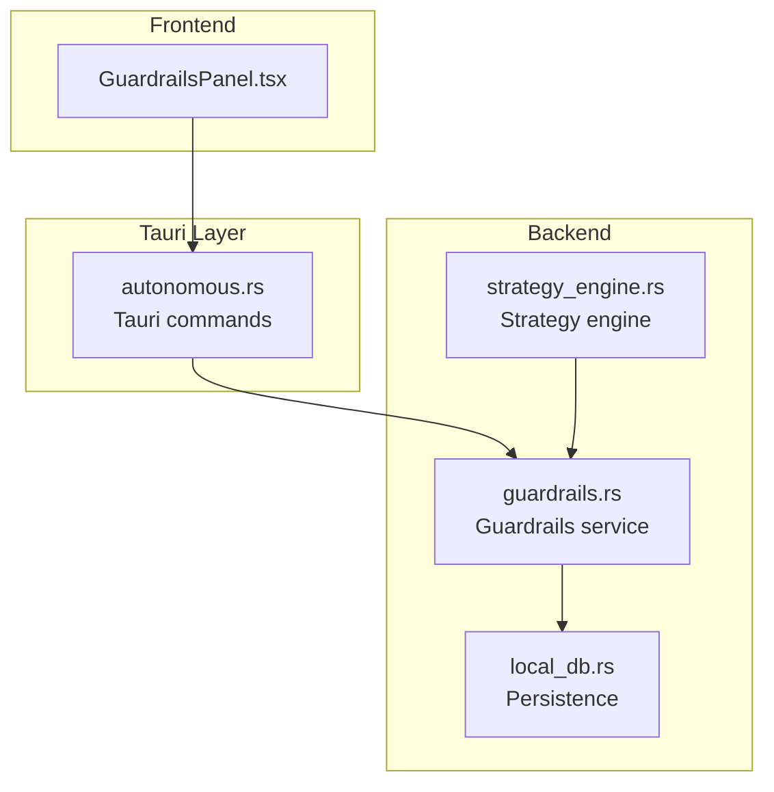
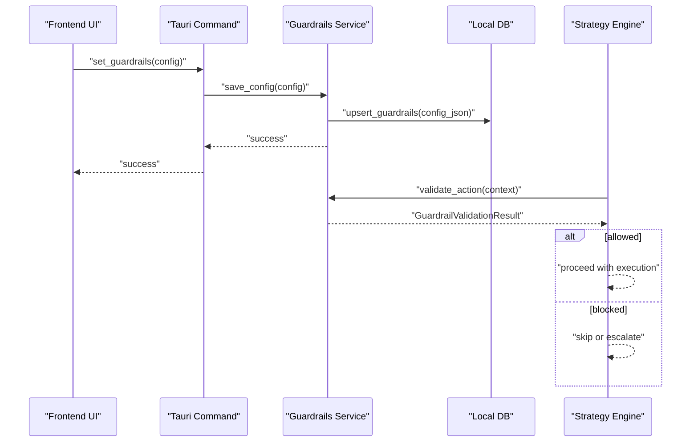
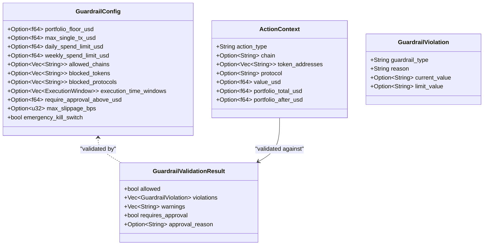
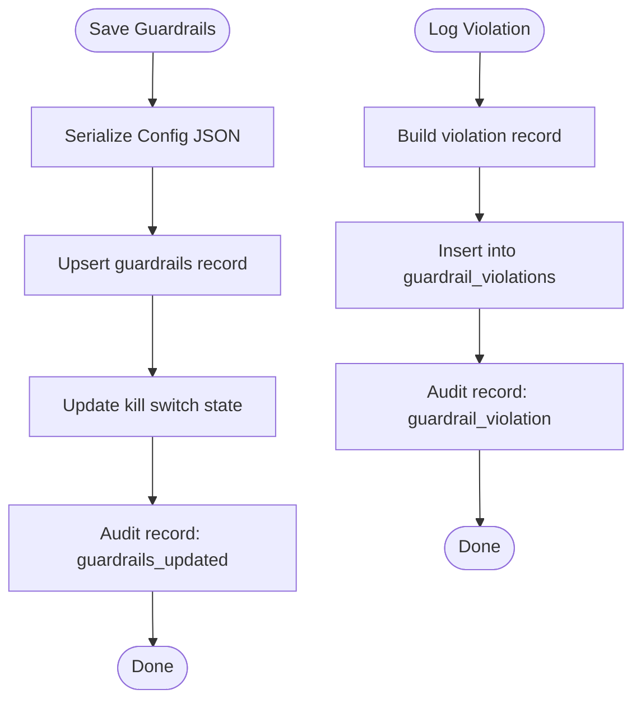
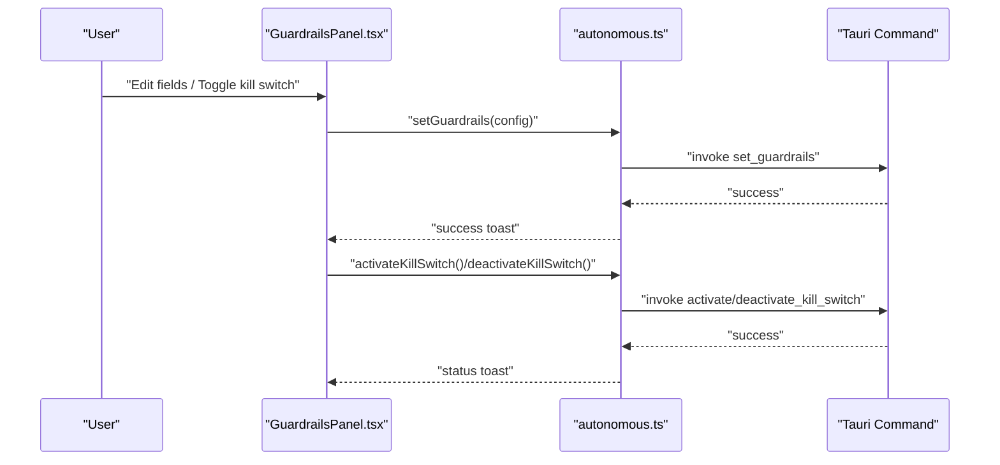
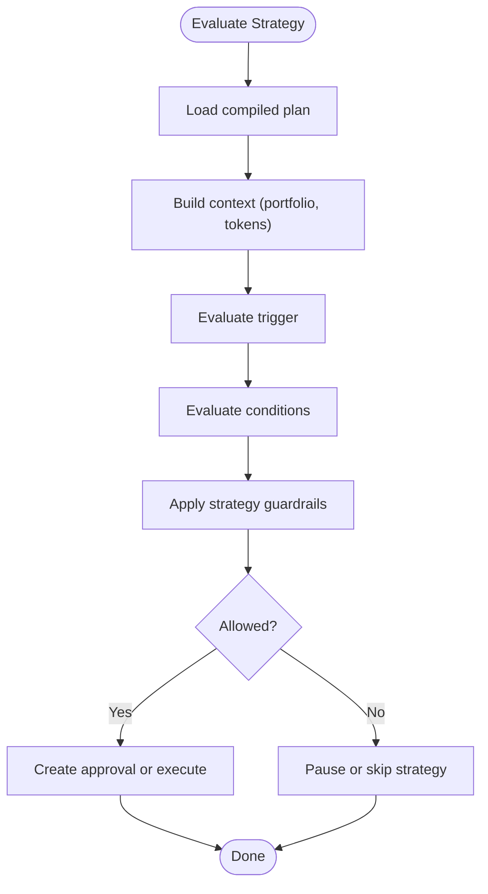
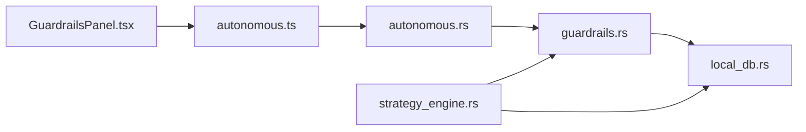

# Guardrails Enforcement

<cite>
**Referenced Files in This Document**
- [guardrails.rs](file://src-tauri/src/services/guardrails.rs)
- [local_db.rs](file://src-tauri/src/services/local_db.rs)
- [autonomous.rs](file://src-tauri/src/commands/autonomous.rs)
- [autonomous.ts](file://src/lib/autonomous.ts)
- [GuardrailsPanel.tsx](file://src/components/autonomous/GuardrailsPanel.tsx)
- [strategy_engine.rs](file://src-tauri/src/services/strategy_engine.rs)
- [strategy_types.rs](file://src-tauri/src/services/strategy_types.rs)
- [strategy.rs](file://src-tauri/src/commands/strategy.rs)
</cite>

## Table of Contents
1. [Introduction](#introduction)
2. [Project Structure](#project-structure)
3. [Core Components](#core-components)
4. [Architecture Overview](#architecture-overview)
5. [Detailed Component Analysis](#detailed-component-analysis)
6. [Dependency Analysis](#dependency-analysis)
7. [Performance Considerations](#performance-considerations)
8. [Troubleshooting Guide](#troubleshooting-guide)
9. [Conclusion](#conclusion)

## Introduction
This document describes the guardrails enforcement system that protects autonomous operations across strategy execution, market actions, and wallet transactions. It explains the risk assessment framework, policy validation mechanisms, automated intervention protocols, and configuration model. It also covers integration points with the strategy engine, approval workflows, and the user interface, along with monitoring, alerting, and compliance reporting capabilities.

## Project Structure
The guardrails system spans three layers:
- Frontend UI: a panel for configuring guardrails and toggling the kill switch.
- Tauri commands: typed IPC endpoints exposing guardrail operations to the UI.
- Backend service: validation logic, persistence, and audit logging.

**Diagram sources**
- [GuardrailsPanel.tsx:19-327](file://src/components/autonomous/GuardrailsPanel.tsx#L19-L327)
- [autonomous.rs:17-149](file://src-tauri/src/commands/autonomous.rs#L17-L149)
- [guardrails.rs:182-275](file://src-tauri/src/services/guardrails.rs#L182-L275)
- [local_db.rs:2436-2543](file://src-tauri/src/services/local_db.rs#L2436-L2543)
- [strategy_engine.rs:343-726](file://src-tauri/src/services/strategy_engine.rs#L343-L726)

**Section sources**
- [GuardrailsPanel.tsx:19-327](file://src/components/autonomous/GuardrailsPanel.tsx#L19-L327)
- [autonomous.rs:17-149](file://src-tauri/src/commands/autonomous.rs#L17-L149)
- [guardrails.rs:182-275](file://src-tauri/src/services/guardrails.rs#L182-L275)
- [local_db.rs:2436-2543](file://src-tauri/src/services/local_db.rs#L2436-L2543)
- [strategy_engine.rs:343-726](file://src-tauri/src/services/strategy_engine.rs#L343-L726)

## Core Components
- Guardrail configuration model: defines spending limits, allow/deny lists, time windows, slippage, and kill switch.
- Validation pipeline: evaluates incoming actions against guardrails and produces a structured result.
- Persistence: stores configuration and violations in the local database.
- Audit logging: records updates and violations for compliance.
- Frontend panel: allows users to edit guardrails and toggle the kill switch.
- Strategy engine integration: applies strategy-specific guardrails alongside global guardrails.

Key types and behaviors:
- Configuration serialization/deserialization with defaults.
- Validation order: kill switch, portfolio floor, single transaction cap, allowed chains, blocked tokens/protocols, execution windows, approval thresholds, slippage warnings.
- Violations logged with attempted action context and audit trail.
- Execution time window checks use UTC and support overnight ranges.

**Section sources**
- [guardrails.rs:42-85](file://src-tauri/src/services/guardrails.rs#L42-L85)
- [guardrails.rs:278-426](file://src-tauri/src/services/guardrails.rs#L278-L426)
- [local_db.rs:2436-2543](file://src-tauri/src/services/local_db.rs#L2436-L2543)
- [autonomous.ts:202-289](file://src/lib/autonomous.ts#L202-L289)
- [GuardrailsPanel.tsx:12-17](file://src/components/autonomous/GuardrailsPanel.tsx#L12-L17)

## Architecture Overview
The guardrails enforcement architecture enforces policies before any autonomous action proceeds. The flow below shows how a strategy action is validated against guardrails and how the system responds.

**Diagram sources**
- [autonomous.rs:96-109](file://src-tauri/src/commands/autonomous.rs#L96-L109)
- [guardrails.rs:207-230](file://src-tauri/src/services/guardrails.rs#L207-L230)
- [local_db.rs:2455-2494](file://src-tauri/src/services/local_db.rs#L2455-L2494)
- [strategy_engine.rs:343-726](file://src-tauri/src/services/strategy_engine.rs#L343-L726)

## Detailed Component Analysis

### Guardrails Service
The guardrails service encapsulates:
- Configuration loading and saving with defaults.
- Validation of actions against guardrails.
- Kill switch state management.
- Violation logging and audit events.

**Diagram sources**
- [guardrails.rs:42-85](file://src-tauri/src/services/guardrails.rs#L42-L85)
- [guardrails.rs:88-105](file://src-tauri/src/services/guardrails.rs#L88-L105)
- [guardrails.rs:107-135](file://src-tauri/src/services/guardrails.rs#L107-L135)

Validation logic highlights:
- Kill switch blocks all actions immediately.
- Portfolio floor checks post-action portfolio value.
- Single transaction cap compares action value to configured maximum.
- Allowed chains check membership; blocked tokens/protocols check presence.
- Execution windows check current UTC time/day.
- Approval threshold triggers requires_approval flag.
- Slippage tolerance warnings for extremely tight slippage.
- Daily/weekly spend limits produce warnings pending implementation.

**Section sources**
- [guardrails.rs:278-426](file://src-tauri/src/services/guardrails.rs#L278-L426)
- [guardrails.rs:428-482](file://src-tauri/src/services/guardrails.rs#L428-L482)
- [guardrails.rs:484-519](file://src-tauri/src/services/guardrails.rs#L484-L519)

### Persistence and Audit
Guardrails configuration and violations are persisted locally:
- Configuration stored as a single JSON record with timestamps.
- Violations stored with attempted action context and audit events recorded.

**Diagram sources**
- [guardrails.rs:207-230](file://src-tauri/src/services/guardrails.rs#L207-L230)
- [guardrails.rs:484-519](file://src-tauri/src/services/guardrails.rs#L484-L519)
- [local_db.rs:2436-2494](file://src-tauri/src/services/local_db.rs#L2436-L2494)
- [local_db.rs:2500-2515](file://src-tauri/src/services/local_db.rs#L2500-L2515)

**Section sources**
- [local_db.rs:2436-2494](file://src-tauri/src/services/local_db.rs#L2436-L2494)
- [local_db.rs:2500-2515](file://src-tauri/src/services/local_db.rs#L2500-L2515)

### Frontend Guardrails Panel
The UI enables:
- Editing guardrail thresholds and lists.
- Activating/deactivating the kill switch.
- Saving configuration via Tauri commands.

**Diagram sources**
- [GuardrailsPanel.tsx:31-71](file://src/components/autonomous/GuardrailsPanel.tsx#L31-L71)
- [autonomous.ts:241-289](file://src/lib/autonomous.ts#L241-L289)
- [autonomous.rs:96-149](file://src-tauri/src/commands/autonomous.rs#L96-L149)

**Section sources**
- [GuardrailsPanel.tsx:19-327](file://src/components/autonomous/GuardrailsPanel.tsx#L19-L327)
- [autonomous.ts:202-289](file://src/lib/autonomous.ts#L202-L289)
- [autonomous.rs:17-149](file://src-tauri/src/commands/autonomous.rs#L17-L149)

### Strategy Engine Integration
The strategy engine applies both global guardrails and strategy-specific guardrails:
- Strategy guardrails include per-trade limits, allowed chains, slippage, gas, and asset availability.
- Conditions are evaluated before generating approvals or executing actions.
- Violations or limits exceeding strategy guardrails can pause or skip strategies.

**Diagram sources**
- [strategy_engine.rs:343-726](file://src-tauri/src/services/strategy_engine.rs#L343-L726)
- [strategy_types.rs:169-243](file://src-tauri/src/services/strategy_types.rs#L169-L243)

**Section sources**
- [strategy_engine.rs:343-726](file://src-tauri/src/services/strategy_engine.rs#L343-L726)
- [strategy_types.rs:169-243](file://src-tauri/src/services/strategy_types.rs#L169-L243)

### Policy Validation Mechanisms
- Global guardrails: enforced by the guardrails service for any action.
- Strategy guardrails: enforced by the strategy engine during evaluation.
- Approval thresholds: can elevate small actions to require manual approval.
- Execution windows: restrict when actions can run.
- Kill switch: immediate global block of autonomous actions.

Examples of guardrail violations and intervention responses:
- Kill switch active: action blocked immediately.
- Single transaction exceeds configured maximum: action blocked.
- Portfolio floor would be breached: action blocked.
- Chain not in allowed list: action skipped.
- Token/protocol in deny list: action blocked.
- Approval threshold exceeded: requires approval.
- Extremely tight slippage: warning generated.

Escalation procedures:
- Strategy guardrails exceeding limits can cause the strategy to pause with a failure count and disabled reason.
- Violations are logged and audited for compliance reporting.

**Section sources**
- [guardrails.rs:278-426](file://src-tauri/src/services/guardrails.rs#L278-L426)
- [strategy_engine.rs:403-434](file://src-tauri/src/services/strategy_engine.rs#L403-L434)
- [strategy_engine.rs:436-499](file://src-tauri/src/services/strategy_engine.rs#L436-L499)

### Real-Time Monitoring, Alerting, and Compliance Reporting
- Violations are persisted with attempted action context and timestamp.
- Audit records capture guardrail updates and violations for compliance.
- Strategy engine emits alerts and briefs for monitor-only modes.
- Health monitoring and opportunity scanning are separate subsystems integrated via the orchestrator.

Compliance reporting:
- Guardrail updates and violations are audited with structured payloads.
- Violation logs include guardrail type, reasons, and attempted action context.

**Section sources**
- [guardrails.rs:219-227](file://src-tauri/src/services/guardrails.rs#L219-L227)
- [guardrails.rs:510-518](file://src-tauri/src/services/guardrails.rs#L510-L518)
- [strategy_engine.rs:331-341](file://src-tauri/src/services/strategy_engine.rs#L331-L341)

### Override Procedures and Exception Handling
- The guardrails service supports recording overrides for violations (placeholder in current implementation).
- Strategy engine can pause strategies exceeding guardrails and update status with reasons.
- Users can adjust guardrail thresholds via the UI to accommodate exceptions.

Operational flexibility:
- Approval-required mode allows human oversight for high-value or risky actions.
- Execution windows permit scheduling actions around market hours.
- Kill switch provides emergency stop capability.

**Section sources**
- [guardrails.rs:521-538](file://src-tauri/src/services/guardrails.rs#L521-L538)
- [strategy_engine.rs:406-416](file://src-tauri/src/services/strategy_engine.rs#L406-L416)

## Dependency Analysis
The guardrails system depends on:
- Local database for configuration and violation persistence.
- Audit service for compliance logging.
- Strategy engine for applying strategy-specific guardrails.
- Tauri commands for frontend-backend communication.

**Diagram sources**
- [GuardrailsPanel.tsx:3-10](file://src/components/autonomous/GuardrailsPanel.tsx#L3-L10)
- [autonomous.ts:1-11](file://src/lib/autonomous.ts#L1-L11)
- [autonomous.rs:8-11](file://src-tauri/src/commands/autonomous.rs#L8-L11)
- [guardrails.rs:11-12](file://src-tauri/src/services/guardrails.rs#L11-L12)
- [local_db.rs:2436-2494](file://src-tauri/src/services/local_db.rs#L2436-L2494)
- [strategy_engine.rs:10-19](file://src-tauri/src/services/strategy_engine.rs#L10-L19)

**Section sources**
- [autonomous.rs:8-11](file://src-tauri/src/commands/autonomous.rs#L8-L11)
- [guardrails.rs:11-12](file://src-tauri/src/services/guardrails.rs#L11-L12)
- [strategy_engine.rs:10-19](file://src-tauri/src/services/strategy_engine.rs#L10-L19)

## Performance Considerations
- Validation is lightweight and runs synchronously in the backend; keep guardrail sets minimal and avoid excessive dynamic checks.
- Logging violations adds database writes; ensure appropriate batching if throughput increases.
- Strategy guardrail evaluation computes portfolio metrics and drift; cache or precompute where feasible.

## Troubleshooting Guide
Common issues and resolutions:
- Actions blocked unexpectedly: verify kill switch, portfolio floor, single transaction cap, allowed chains, and blocked lists.
- Approval requests for small trades: adjust require approval threshold.
- Strategy paused due to limits: review strategy guardrails and lower per-trade amounts.
- No daily/weekly spend tracking: configure limits and implement tracking as needed.

Diagnostic steps:
- Inspect guardrail violations in the database.
- Review audit logs for guardrail updates and violations.
- Confirm execution windows align with intended schedule.

**Section sources**
- [local_db.rs:2518-2539](file://src-tauri/src/services/local_db.rs#L2518-L2539)
- [guardrails.rs:510-518](file://src-tauri/src/services/guardrails.rs#L510-L518)

## Conclusion
The guardrails enforcement system provides a robust, configurable safety net across autonomous operations. By combining global guardrails with strategy-specific controls, it balances risk mitigation with operational flexibility. The system’s persistence, audit logging, and UI enable effective monitoring, compliance, and responsive governance.