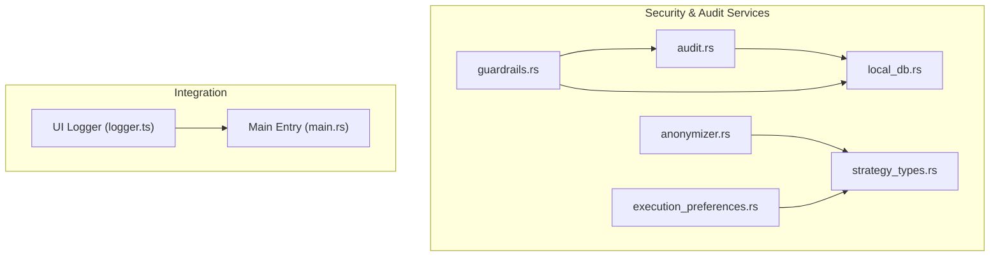
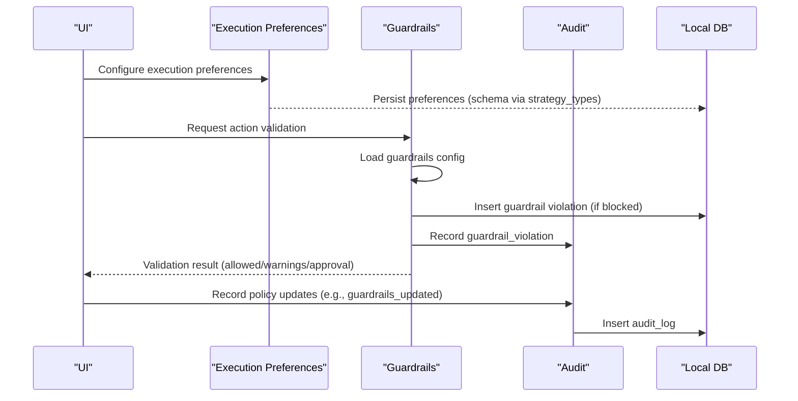
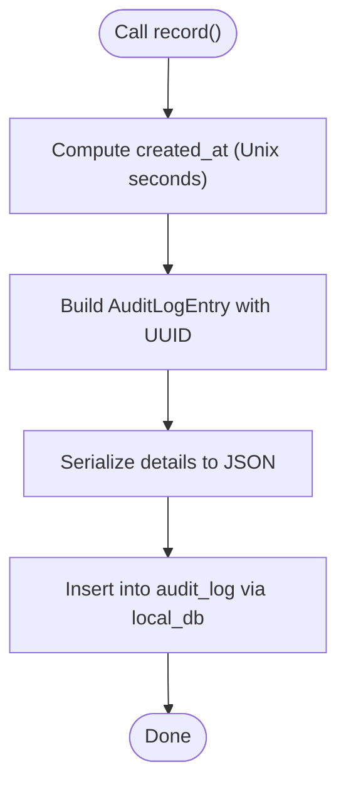
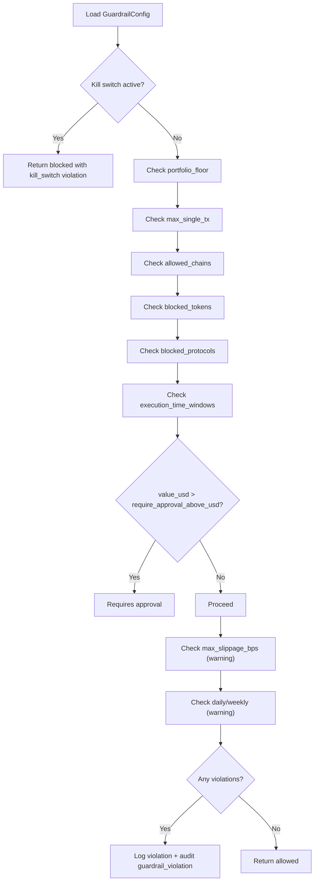
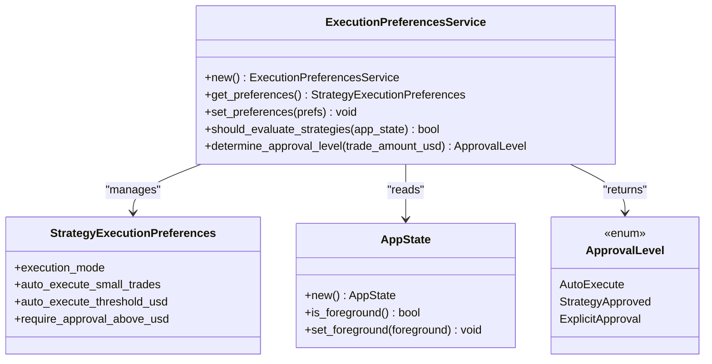
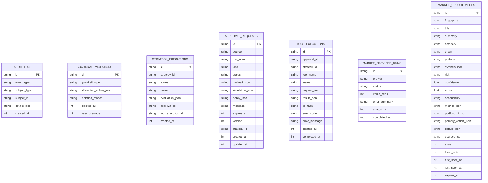
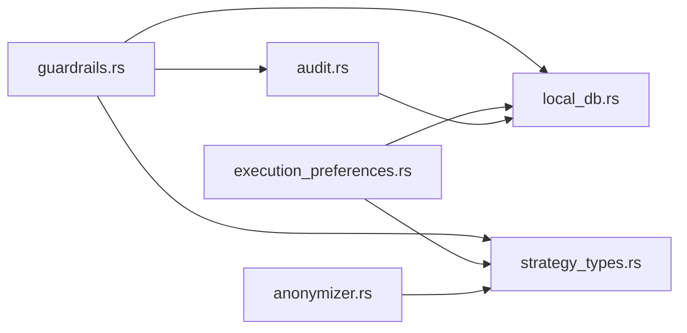

# Security & Audit Services

<cite>
**Referenced Files in This Document**
- [audit.rs](file://src-tauri/src/services/audit.rs)
- [guardrails.rs](file://src-tauri/src/services/guardrails.rs)
- [anonymizer.rs](file://src-tauri/src/services/anonymizer.rs)
- [execution_preferences.rs](file://src-tauri/src/services/execution_preferences.rs)
- [local_db.rs](file://src-tauri/src/services/local_db.rs)
- [strategy_types.rs](file://src-tauri/src/services/strategy_types.rs)
- [logger.ts](file://src/lib/logger.ts)
- [main.rs](file://src-tauri/src/main.rs)
</cite>

## Table of Contents
1. [Introduction](#introduction)
2. [Project Structure](#project-structure)
3. [Core Components](#core-components)
4. [Architecture Overview](#architecture-overview)
5. [Detailed Component Analysis](#detailed-component-analysis)
6. [Dependency Analysis](#dependency-analysis)
7. [Performance Considerations](#performance-considerations)
8. [Troubleshooting Guide](#troubleshooting-guide)
9. [Conclusion](#conclusion)
10. [Appendices](#appendices)

## Introduction
This document describes the Security & Audit Services subsystem that underpins safe, auditable, and privacy-compliant operation of the autonomous agent platform. It covers:
- Audit logging for events, actions, and policy changes
- Data anonymization for privacy protection
- Execution preferences for user-controlled automation
- Guardrails enforcement for risk-aware execution
- Integration touchpoints with the broader system and compliance workflows
- Cryptographic and integrity considerations

## Project Structure
Security and audit services are implemented in the Tauri backend under src-tauri/src/services. They rely on a local SQLite database for persistence and integrate with strategy execution and approval workflows.

**Diagram sources**
- [audit.rs:1-25](file://src-tauri/src/services/audit.rs#L1-L25)
- [guardrails.rs:1-620](file://src-tauri/src/services/guardrails.rs#L1-L620)
- [anonymizer.rs:1-56](file://src-tauri/src/services/anonymizer.rs#L1-L56)
- [execution_preferences.rs:1-159](file://src-tauri/src/services/execution_preferences.rs#L1-L159)
- [local_db.rs:1036-1272](file://src-tauri/src/services/local_db.rs#L1036-L1272)
- [strategy_types.rs:167-243](file://src-tauri/src/services/strategy_types.rs#L167-L243)
- [logger.ts:1-6](file://src/lib/logger.ts#L1-L6)
- [main.rs:1-7](file://src-tauri/src/main.rs#L1-L7)

**Section sources**
- [audit.rs:1-25](file://src-tauri/src/services/audit.rs#L1-L25)
- [guardrails.rs:1-620](file://src-tauri/src/services/guardrails.rs#L1-L620)
- [anonymizer.rs:1-56](file://src-tauri/src/services/anonymizer.rs#L1-L56)
- [execution_preferences.rs:1-159](file://src-tauri/src/services/execution_preferences.rs#L1-L159)
- [local_db.rs:1036-1272](file://src-tauri/src/services/local_db.rs#L1036-L1272)
- [strategy_types.rs:167-243](file://src-tauri/src/services/strategy_types.rs#L167-L243)
- [logger.ts:1-6](file://src/lib/logger.ts#L1-L6)
- [main.rs:1-7](file://src-tauri/src/main.rs#L1-L7)

## Core Components
- Audit logging: Centralized event recording with structured JSON details and timestamps.
- Guardrails enforcement: Policy-driven validation of autonomous actions with kill switch and violation logging.
- Data anonymization: Privacy-preserving portfolio sanitization for external processing.
- Execution preferences: User-configurable automation modes and approval thresholds.
- Local database: Persistent schema for audit logs, guardrail violations, approvals, and strategy execution records.

**Section sources**
- [audit.rs:5-24](file://src-tauri/src/services/audit.rs#L5-L24)
- [guardrails.rs:182-230](file://src-tauri/src/services/guardrails.rs#L182-L230)
- [anonymizer.rs:7-28](file://src-tauri/src/services/anonymizer.rs#L7-L28)
- [execution_preferences.rs:17-71](file://src-tauri/src/services/execution_preferences.rs#L17-L71)
- [local_db.rs:1069-1272](file://src-tauri/src/services/local_db.rs#L1069-L1272)

## Architecture Overview
The security subsystem is layered:
- Services (audit, guardrails, anonymizer, execution preferences) encapsulate domain logic.
- Persistence (local_db) stores audit trails, guardrail violations, approvals, and strategy execution records.
- Strategy types define guardrails and execution policies used by guardrails and execution preferences.
- UI logging utility supports development-time diagnostics.

**Diagram sources**
- [guardrails.rs:182-230](file://src-tauri/src/services/guardrails.rs#L182-L230)
- [guardrails.rs:484-519](file://src-tauri/src/services/guardrails.rs#L484-L519)
- [audit.rs:5-24](file://src-tauri/src/services/audit.rs#L5-L24)
- [local_db.rs:1257-1272](file://src-tauri/src/services/local_db.rs#L1257-L1272)
- [strategy_types.rs:167-243](file://src-tauri/src/services/strategy_types.rs#L167-L243)

## Detailed Component Analysis

### Audit Logging Service
Responsibilities:
- Create audit log entries with event type, subject type/id, serialized details, and timestamp.
- Persist entries to the local database.

Key behaviors:
- Generates a UUID for each entry.
- Serializes arbitrary details to JSON for flexible auditing.
- Stores created_at as Unix seconds.

**Diagram sources**
- [audit.rs:5-24](file://src-tauri/src/services/audit.rs#L5-L24)
- [local_db.rs:1257-1272](file://src-tauri/src/services/local_db.rs#L1257-L1272)

**Section sources**
- [audit.rs:5-24](file://src-tauri/src/services/audit.rs#L5-L24)
- [local_db.rs:1036-1043](file://src-tauri/src/services/local_db.rs#L1036-L1043)

### Guardrails Enforcement Service
Responsibilities:
- Load and persist user-configurable guardrails.
- Validate proposed actions against guardrails.
- Enforce emergency kill switch.
- Log violations and record policy changes in audit.

Core data structures:
- GuardrailConfig: user policy (limits, allowed chains, blocked tokens/protocols, time windows, slippage, kill switch).
- ActionContext: details about the action being validated.
- GuardrailViolation and GuardrailValidationResult: outcomes of validation.

Validation pipeline:
- Kill switch check (immediate block).
- Portfolio floor.
- Single transaction cap.
- Allowed chains.
- Blocked tokens/protocols.
- Execution windows.
- Approval thresholds.
- Slippage warnings.
- Daily/weekly limits (warning for now).

**Diagram sources**
- [guardrails.rs:277-426](file://src-tauri/src/services/guardrails.rs#L277-L426)
- [guardrails.rs:484-519](file://src-tauri/src/services/guardrails.rs#L484-L519)

**Section sources**
- [guardrails.rs:182-230](file://src-tauri/src/services/guardrails.rs#L182-L230)
- [guardrails.rs:277-426](file://src-tauri/src/services/guardrails.rs#L277-L426)
- [guardrails.rs:484-519](file://src-tauri/src/services/guardrails.rs#L484-L519)
- [local_db.rs:2496-2543](file://src-tauri/src/services/local_db.rs#L2496-L2543)

### Data Anonymization Service
Responsibilities:
- Sanitize portfolio data for external AI processing by removing sensitive identifiers and converting absolute values to categories and relative weights.

Processing:
- Categorize total portfolio value.
- Count wallets.
- Compute allocation percentages and categorize by dominance.
- Produce a human-readable sanitized report.

```mermaid
flowchart TD
Start(["sanitize_portfolio()"]) --> Parse["Parse total and breakdown"]
Parse --> Total["Compute total USD"]
Total --> ForEach["For each asset: compute % of total"]
ForEach --> Cat["Categorize allocation size"]
Cat --> Build["Build lines: totals, wallet count, allocations"]
Build --> Join["Join lines into sanitized string"]
Join --> End(["Return sanitized report"])
```

**Diagram sources**
- [anonymizer.rs:7-28](file://src-tauri/src/services/anonymizer.rs#L7-L28)
- [anonymizer.rs:30-55](file://src-tauri/src/services/anonymizer.rs#L30-L55)

**Section sources**
- [anonymizer.rs:7-28](file://src-tauri/src/services/anonymizer.rs#L7-L28)
- [anonymizer.rs:30-55](file://src-tauri/src/services/anonymizer.rs#L30-L55)

### Execution Preferences Service
Responsibilities:
- Manage user execution preferences for strategy automation.
- Determine whether strategies should be evaluated based on execution mode and app state.
- Decide approval levels based on trade size and thresholds.

Execution modes:
- ContinuousBackground: always evaluate.
- AppActiveOnly: evaluate when app is foreground.
- Scheduled: evaluate within a time window.

Approval levels:
- AutoExecute: immediate execution below threshold.
- StrategyApproved: execution per strategy-level policy.
- ExplicitApproval: requires user approval above threshold.

**Diagram sources**
- [execution_preferences.rs:17-71](file://src-tauri/src/services/execution_preferences.rs#L17-L71)
- [execution_preferences.rs:74-94](file://src-tauri/src/services/execution_preferences.rs#L74-L94)
- [execution_preferences.rs:97-105](file://src-tauri/src/services/execution_preferences.rs#L97-L105)
- [strategy_types.rs:167-243](file://src-tauri/src/services/strategy_types.rs#L167-L243)

**Section sources**
- [execution_preferences.rs:17-71](file://src-tauri/src/services/execution_preferences.rs#L17-L71)
- [execution_preferences.rs:74-94](file://src-tauri/src/services/execution_preferences.rs#L74-L94)
- [execution_preferences.rs:97-105](file://src-tauri/src/services/execution_preferences.rs#L97-L105)
- [strategy_types.rs:167-243](file://src-tauri/src/services/strategy_types.rs#L167-L243)

### Local Database Schema and Persistence
The local database persists:
- Audit logs (audit_log)
- Guardrail violations (guardrail_violations)
- Strategy execution records (strategy_executions)
- Approval requests (approval_requests)
- Tool executions (tool_executions)
- Market provider runs (market_provider_runs)
- Market opportunities (market_opportunities)

**Diagram sources**
- [local_db.rs:1069-1473](file://src-tauri/src/services/local_db.rs#L1069-L1473)

**Section sources**
- [local_db.rs:1069-1473](file://src-tauri/src/services/local_db.rs#L1069-L1473)

## Dependency Analysis
- Guardrails depends on:
  - Local DB for storing guardrail configurations and violations.
  - Audit service for logging policy changes and violations.
  - Strategy types for strategy-level guardrails and execution policies.
- Audit service depends on:
  - Local DB for inserting audit_log entries.
- Execution preferences depend on:
  - Strategy types for guardrails and execution policy structures.
  - Strategy execution records for determining approval levels.
- Anonymizer depends on:
  - Strategy types’ portfolio value structures for sanitization.

**Diagram sources**
- [guardrails.rs:11-12](file://src-tauri/src/services/guardrails.rs#L11-L12)
- [audit.rs:3](file://src-tauri/src/services/audit.rs#L3)
- [execution_preferences.rs:10](file://src-tauri/src/services/execution_preferences.rs#L10)
- [strategy_types.rs:167-243](file://src-tauri/src/services/strategy_types.rs#L167-L243)
- [local_db.rs:1069-1272](file://src-tauri/src/services/local_db.rs#L1069-L1272)

**Section sources**
- [guardrails.rs:11-12](file://src-tauri/src/services/guardrails.rs#L11-L12)
- [audit.rs:3](file://src-tauri/src/services/audit.rs#L3)
- [execution_preferences.rs:10](file://src-tauri/src/services/execution_preferences.rs#L10)
- [strategy_types.rs:167-243](file://src-tauri/src/services/strategy_types.rs#L167-L243)
- [local_db.rs:1069-1272](file://src-tauri/src/services/local_db.rs#L1069-L1272)

## Performance Considerations
- Audit logging is synchronous and lightweight; keep details minimal to avoid large JSON payloads.
- Guardrails validation iterates through policy checks; keep policy lists concise.
- Database writes are performed per operation; batch operations are not implemented here.
- Time window checks use UTC; ensure client-side time zone awareness for accurate policy interpretation.

[No sources needed since this section provides general guidance]

## Troubleshooting Guide
Common issues and remedies:
- Audit log insertion failures:
  - Verify database initialization and write permissions.
  - Check serialization of details to JSON.
- Guardrail violation logging failures:
  - Confirm ActionContext serializability and database connectivity.
  - Review violation reasons for clarity.
- Execution preferences not taking effect:
  - Ensure preferences are persisted and reloaded.
  - Validate approval thresholds and execution mode.
- Privacy sanitization anomalies:
  - Confirm input portfolio values are parseable and non-zero.

Operational tips:
- Use the UI logger for development diagnostics.
- Monitor guardrail violation counts and reasons in the database.
- Periodically review audit logs for policy changes and action validations.

**Section sources**
- [logger.ts:1-6](file://src/lib/logger.ts#L1-L6)
- [guardrails.rs:505-507](file://src-tauri/src/services/guardrails.rs#L505-L507)
- [local_db.rs:1257-1272](file://src-tauri/src/services/local_db.rs#L1257-L1272)

## Conclusion
The Security & Audit Services subsystem provides a robust foundation for safe, transparent, and privacy-conscious operation. Audit logging captures critical events; guardrails enforce user-defined policies with an emergency kill switch; anonymization protects sensitive portfolio data; and execution preferences give users fine-grained control over automation. Together, these components support compliance workflows and incident response while maintaining system integrity.

[No sources needed since this section summarizes without analyzing specific files]

## Appendices

### Compliance and Data Retention Notes
- Audit logs and guardrail violations are stored locally with timestamps; retention and archival policies should be defined externally.
- Sanitized portfolio reports can be used for external AI processing without exposing raw balances or addresses.
- Strategy execution records and approvals provide a trail for governance and compliance reviews.

[No sources needed since this section provides general guidance]

### Security and Integrity Considerations
- Cryptographic operations are not implemented in the referenced files; any future cryptographic hashing or signing should be introduced carefully and tested.
- Secure communication channels are not shown in the referenced files; ensure transport security if integrating with external systems.
- Audit trail integrity can be strengthened by adding checksums or append-only storage mechanisms in future designs.

[No sources needed since this section provides general guidance]