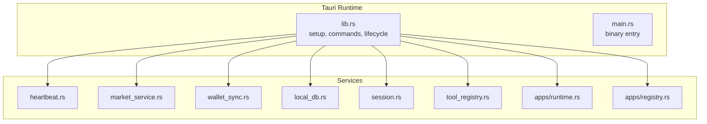
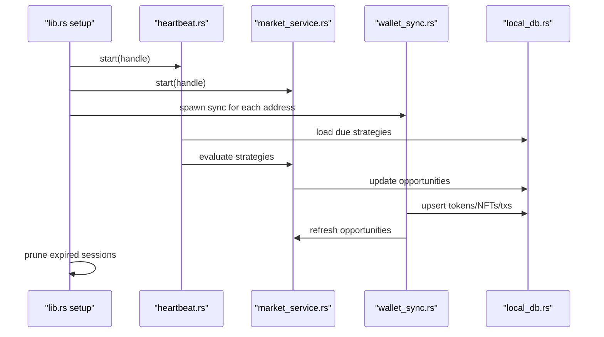
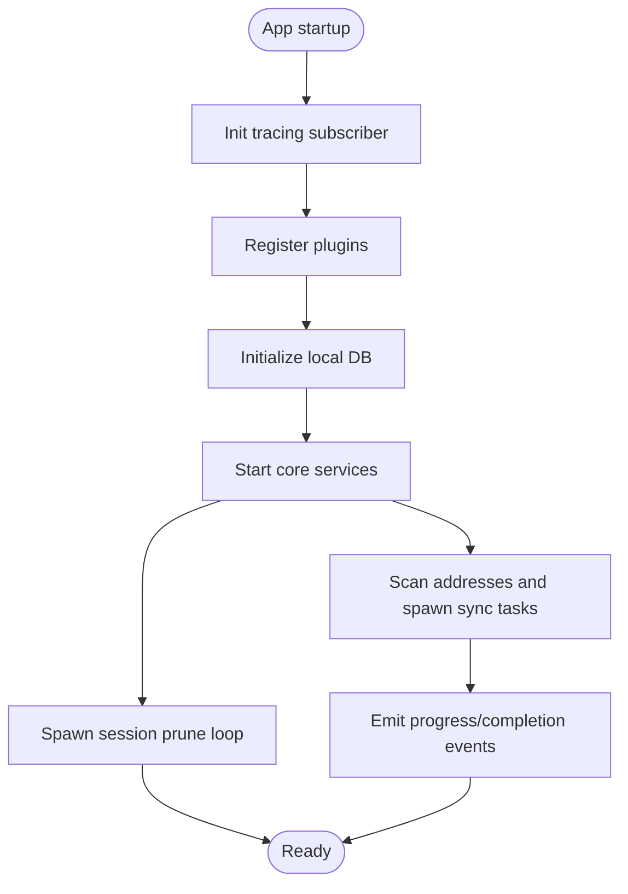
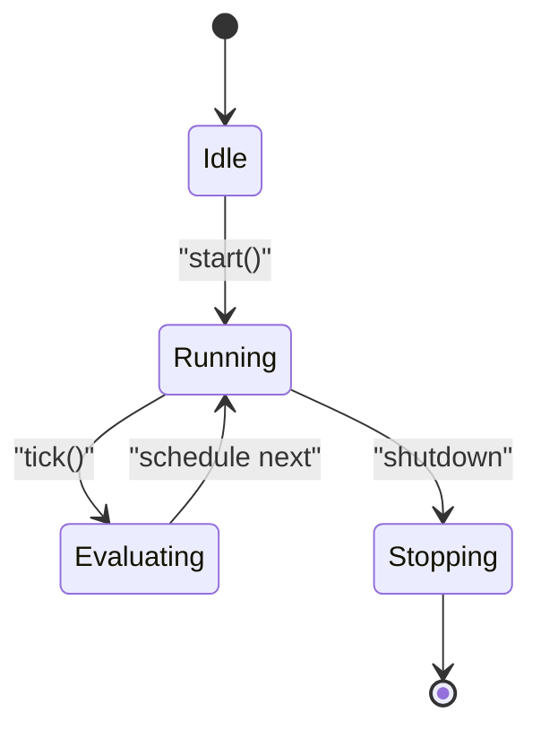
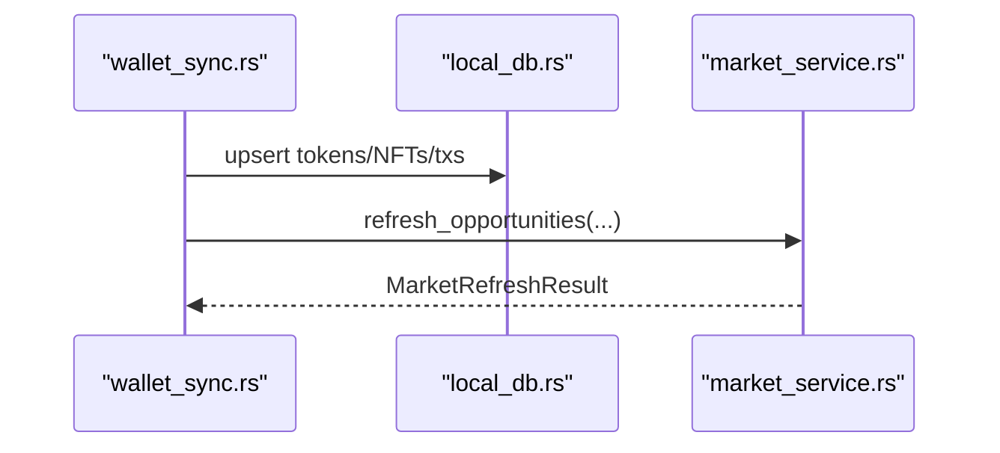
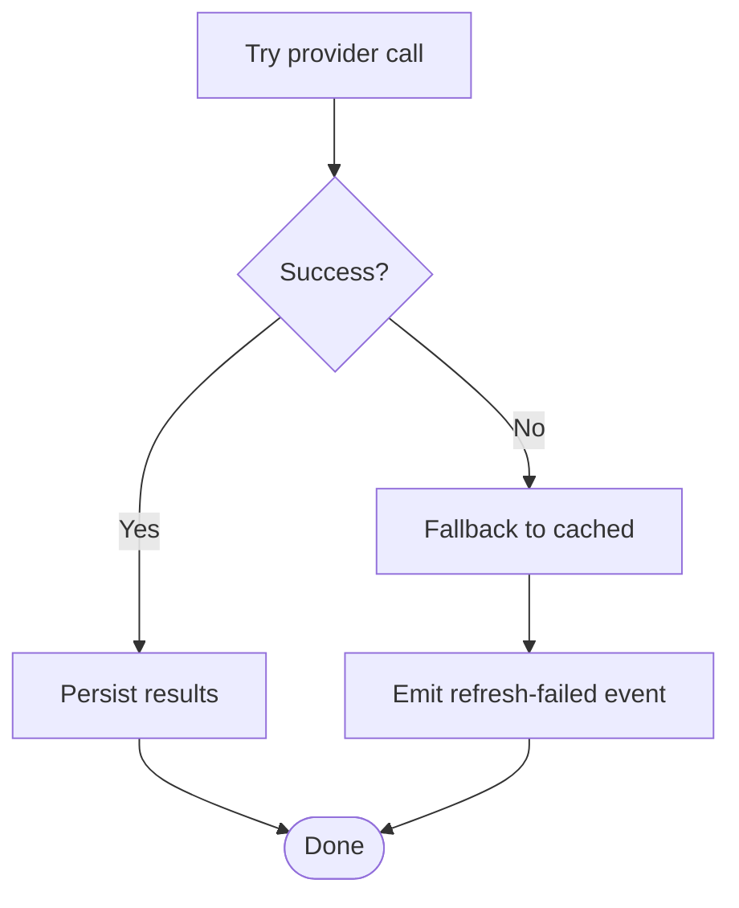
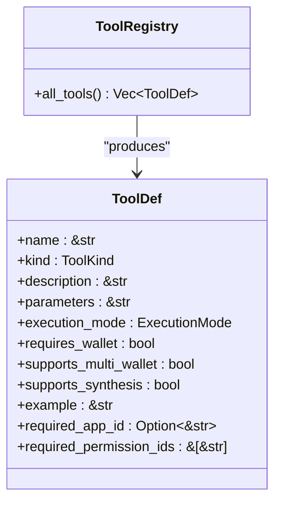
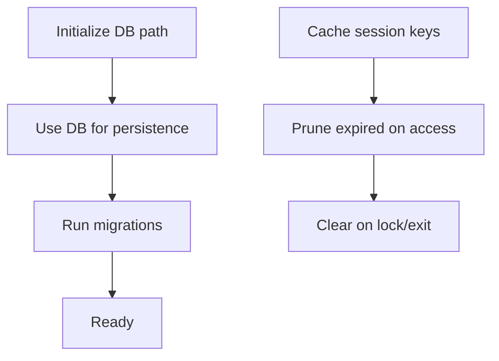
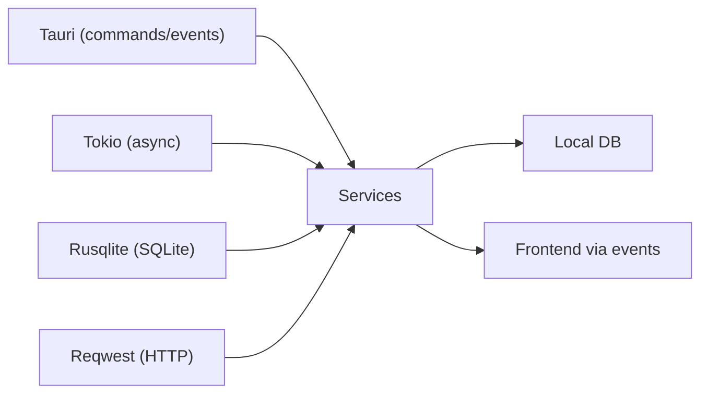

# Service Layer Overview

<cite>
**Referenced Files in This Document**
- [Cargo.toml](file://src-tauri/Cargo.toml)
- [lib.rs](file://src-tauri/src/lib.rs)
- [main.rs](file://src-tauri/src/main.rs)
- [services/mod.rs](file://src-tauri/src/services/mod.rs)
- [services/local_db.rs](file://src-tauri/src/services/local_db.rs)
- [services/session.rs](file://src-tauri/src/session.rs)
- [services/heartbeat.rs](file://src-tauri/src/services/heartbeat.rs)
- [services/market_service.rs](file://src-tauri/src/services/market_service.rs)
- [services/wallet_sync.rs](file://src-tauri/src/services/wallet_sync.rs)
- [services/tool_registry.rs](file://src-tauri/src/services/tool_registry.rs)
- [services/apps/runtime.rs](file://src-tauri/src/services/apps/runtime.rs)
- [services/apps/registry.rs](file://src-tauri/src/services/apps/registry.rs)
</cite>

## Table of Contents
1. [Introduction](#introduction)
2. [Project Structure](#project-structure)
3. [Core Components](#core-components)
4. [Architecture Overview](#architecture-overview)
5. [Detailed Component Analysis](#detailed-component-analysis)
6. [Dependency Analysis](#dependency-analysis)
7. [Performance Considerations](#performance-considerations)
8. [Troubleshooting Guide](#troubleshooting-guide)
9. [Conclusion](#conclusion)
10. [Appendices](#appendices)

## Introduction
This document explains the Rust service layer architecture for SHADOW Protocol’s modular service design. It focuses on the service abstraction pattern, dependency injection, lifecycle management, initialization sequencing, inter-service communication, error propagation, registry systems, configuration management, and resource cleanup. Practical examples illustrate service registration, dependency resolution, and composition patterns. It also covers service isolation, thread-safety considerations, performance optimization, and testing strategies for unit testing individual services.

## Project Structure
The service layer is organized under a dedicated module tree with clear separation of concerns:
- Top-level entry initializes logging, plugins, and spawns long-running services.
- Services are grouped by domain (apps, market, tools, portfolio, etc.) and expose start routines and typed APIs.
- A central registry defines agent tools and their execution modes and permissions.
- An isolated runtime bridges to a TypeScript sidecar for app integrations.

**Diagram sources**
- [lib.rs:34-89](file://src-tauri/src/lib.rs#L34-L89)
- [services/mod.rs:1-36](file://src-tauri/src/services/mod.rs#L1-L36)

**Section sources**
- [lib.rs:34-89](file://src-tauri/src/lib.rs#L34-L89)
- [services/mod.rs:1-36](file://src-tauri/src/services/mod.rs#L1-L36)

## Core Components
- Service Abstraction Pattern: Each service exposes a start routine and domain-specific APIs. Services encapsulate asynchronous loops, periodic tasks, and event emissions.
- Dependency Injection: Services receive an AppHandle and use it to emit events, access configuration, and coordinate with other services.
- Lifecycle Management: Services are started during setup and run indefinitely until the app exits. Cleanup occurs on exit or explicit pruning.
- Registry Systems: Central registries define tool capabilities and app catalogs, enabling permission-aware dispatch and discovery.
- Configuration Management: Services read environment variables and persisted settings to configure external clients and runtime behavior.
- Resource Cleanup: Database connections are managed via a singleton path, sessions are pruned on inactivity, and spawned processes are killed on drop.

**Section sources**
- [lib.rs:43-89](file://src-tauri/src/lib.rs#L43-L89)
- [services/local_db.rs:438-448](file://src-tauri/src/services/local_db.rs#L438-L448)
- [services/session.rs:16-23](file://src-tauri/src/session.rs#L16-L23)
- [services/tool_registry.rs:36-312](file://src-tauri/src/services/tool_registry.rs#L36-L312)
- [services/apps/registry.rs:21-124](file://src-tauri/src/services/apps/registry.rs#L21-L124)

## Architecture Overview
The service layer follows a modular, event-driven architecture:
- Initialization: The app sets up logging, plugins, and database. It then starts several services and periodically prunes sessions.
- Inter-Service Communication: Services communicate primarily through emitted events and shared state in the local database. For example, wallet sync emits progress and completion events and triggers market refresh.
- Error Propagation: Services log errors and, where appropriate, emit UI-friendly notifications. Some flows fall back to cached data when providers fail.
- Isolation: The apps runtime spawns a separate process per request to isolate failures and enforce resource limits.

**Diagram sources**
- [lib.rs:43-89](file://src-tauri/src/lib.rs#L43-L89)
- [services/heartbeat.rs:10-74](file://src-tauri/src/services/heartbeat.rs#L10-L74)
- [services/market_service.rs:189-218](file://src-tauri/src/services/market_service.rs#L189-L218)
- [services/wallet_sync.rs:260-452](file://src-tauri/src/services/wallet_sync.rs#L260-L452)

## Detailed Component Analysis

### Service Initialization Sequence
- Logging and Plugins: Initializes tracing subscriber and registers plugins.
- Database Setup: Creates and migrates the local SQLite database.
- Service Startup: Starts heartbeat, market service, shadow watcher, alpha service, and heartbeat.
- Periodic Maintenance: Spawns a loop to prune expired sessions.
- Wallet Sync: Scans addresses and spawns background sync tasks with progress and completion events.

**Diagram sources**
- [lib.rs:34-89](file://src-tauri/src/lib.rs#L34-L89)

**Section sources**
- [lib.rs:34-89](file://src-tauri/src/lib.rs#L34-L89)

### Service Lifecycle Management
- Heartbeat: Runs a periodic loop to expire stale approvals, load due strategies, evaluate them, and schedule app jobs.
- Market Service: Refreshes opportunities on startup and periodically, emitting updates to the UI.
- Wallet Sync: Performs multi-step sync across networks, emitting progress and completion events, and triggering downstream updates.

**Diagram sources**
- [services/heartbeat.rs:10-74](file://src-tauri/src/services/heartbeat.rs#L10-L74)
- [services/market_service.rs:189-218](file://src-tauri/src/services/market_service.rs#L189-L218)
- [services/wallet_sync.rs:260-452](file://src-tauri/src/services/wallet_sync.rs#L260-L452)

**Section sources**
- [services/heartbeat.rs:10-74](file://src-tauri/src/services/heartbeat.rs#L10-L74)
- [services/market_service.rs:189-218](file://src-tauri/src/services/market_service.rs#L189-L218)
- [services/wallet_sync.rs:260-452](file://src-tauri/src/services/wallet_sync.rs#L260-L452)

### Inter-Service Communication Patterns
- Event Emission: Services emit structured payloads to the frontend (e.g., wallet sync progress and completion).
- Shared State: All services coordinate around the local database for persistence and cross-service visibility.
- Cross-Service Calls: Wallet sync triggers market refresh after successful sync; heartbeat coordinates strategy evaluation.

**Diagram sources**
- [services/wallet_sync.rs:409-430](file://src-tauri/src/services/wallet_sync.rs#L409-L430)
- [services/market_service.rs:263-365](file://src-tauri/src/services/market_service.rs#L263-L365)

**Section sources**
- [services/wallet_sync.rs:409-430](file://src-tauri/src/services/wallet_sync.rs#L409-L430)
- [services/market_service.rs:263-365](file://src-tauri/src/services/market_service.rs#L263-L365)

### Error Propagation Mechanisms
- Logging: Services log errors with structured contexts (e.g., strategy evaluation failures).
- UI Notifications: Market service emits a refresh-failed event with a message payload when falling back to cached results.
- Graceful Degradation: Market service falls back to cached opportunities when provider calls fail.

**Diagram sources**
- [services/market_service.rs:292-300](file://src-tauri/src/services/market_service.rs#L292-L300)
- [services/market_service.rs:601-624](file://src-tauri/src/services/market_service.rs#L601-L624)

**Section sources**
- [services/market_service.rs:292-300](file://src-tauri/src/services/market_service.rs#L292-L300)
- [services/market_service.rs:601-624](file://src-tauri/src/services/market_service.rs#L601-L624)

### Service Registry System
- Tool Registry: Defines tool metadata, execution modes, and permission requirements. Used for dispatch and UI rendering.
- App Catalog Registry: Seeds and manages bundled app catalogs and permissions.

**Diagram sources**
- [services/tool_registry.rs:36-312](file://src-tauri/src/services/tool_registry.rs#L36-L312)

**Section sources**
- [services/tool_registry.rs:36-312](file://src-tauri/src/services/tool_registry.rs#L36-L312)
- [services/apps/registry.rs:21-124](file://src-tauri/src/services/apps/registry.rs#L21-L124)

### Service Configuration Management
- Environment Variables: Services read keys from environment or settings (e.g., Alchemy API key).
- Database-backed Settings: Services persist and retrieve configuration in the local database.
- Runtime Paths: The apps runtime locates the TypeScript script using resource directories and debug overrides.

**Diagram sources**
- [services/wallet_sync.rs:261-274](file://src-tauri/src/services/wallet_sync.rs#L261-L274)

**Section sources**
- [services/wallet_sync.rs:261-274](file://src-tauri/src/services/wallet_sync.rs#L261-L274)
- [services/apps/runtime.rs:49-67](file://src-tauri/src/services/apps/runtime.rs#L49-L67)

### Resource Cleanup Strategies
- Database: Singleton path is set during init; migrations ensure schema stability.
- Sessions: In-memory cache with expiration; periodic pruning removes stale entries.
- Processes: Sidecar processes are killed on drop to prevent orphaned processes.

**Diagram sources**
- [services/local_db.rs:438-448](file://src-tauri/src/services/local_db.rs#L438-L448)
- [services/session.rs:25-93](file://src-tauri/src/session.rs#L25-L93)
- [services/apps/runtime.rs:82-84](file://src-tauri/src/services/apps/runtime.rs#L82-L84)

**Section sources**
- [services/local_db.rs:438-448](file://src-tauri/src/services/local_db.rs#L438-L448)
- [services/session.rs:25-93](file://src-tauri/src/session.rs#L25-L93)
- [services/apps/runtime.rs:82-84](file://src-tauri/src/services/apps/runtime.rs#L82-L84)

### Practical Examples

#### Service Registration and Dependency Resolution
- Registration: Services are registered in the module tree and started from the setup routine.
- Dependency Resolution: Services receive AppHandle and use it to emit events and access shared resources.

**Section sources**
- [services/mod.rs:1-36](file://src-tauri/src/services/mod.rs#L1-L36)
- [lib.rs:43-89](file://src-tauri/src/lib.rs#L43-L89)

#### Service Composition Patterns
- Market refresh triggers wallet sync updates and vice versa.
- Heartbeat orchestrates strategy evaluation and scheduling.

**Section sources**
- [services/market_service.rs:189-218](file://src-tauri/src/services/market_service.rs#L189-L218)
- [services/wallet_sync.rs:409-430](file://src-tauri/src/services/wallet_sync.rs#L409-L430)
- [services/heartbeat.rs:10-74](file://src-tauri/src/services/heartbeat.rs#L10-L74)

### Service Isolation and Thread Safety
- Concurrency Model: Services use Tokio async runtime with intervals and spawn helpers.
- Thread Safety: Shared state is accessed via a singleton DB path and in-memory caches protected by locks; sessions are cleared on exit.
- Process Isolation: Apps runtime spawns a separate process per request to isolate crashes.

**Section sources**
- [Cargo.toml:35](file://src-tauri/Cargo.toml#L35)
- [services/session.rs:16-23](file://src-tauri/src/session.rs#L16-L23)
- [services/apps/runtime.rs:77-84](file://src-tauri/src/services/apps/runtime.rs#L77-L84)

### Performance Optimization Techniques
- Periodic Batching: Services schedule work at fixed intervals to avoid busy loops.
- Caching: Market service caches results and serves stale data when providers fail.
- Asynchronous I/O: Network requests and DB operations are performed asynchronously.

**Section sources**
- [services/market_service.rs:561-593](file://src-tauri/src/services/market_service.rs#L561-L593)
- [services/wallet_sync.rs:260-452](file://src-tauri/src/services/wallet_sync.rs#L260-L452)

### Testing Framework and Mocking Strategies
- Unit Tests: Registry modules include unit tests validating catalog coverage and session behavior.
- Mocking Strategies: For unit testing, replace external dependencies with mocks (e.g., HTTP client, DB connection) and inject test doubles via constructors or environment overrides.

**Section sources**
- [services/apps/registry.rs:126-138](file://src-tauri/src/services/apps/registry.rs#L126-L138)
- [services/session.rs:127-144](file://src-tauri/src/session.rs#L127-L144)

## Dependency Analysis
The service layer depends on Tauri for commands and event emission, Tokio for async runtime, Rusqlite for local persistence, and external providers for market data and blockchain operations.

**Diagram sources**
- [Cargo.toml:21-42](file://src-tauri/Cargo.toml#L21-L42)
- [lib.rs:40-191](file://src-tauri/src/lib.rs#L40-L191)

**Section sources**
- [Cargo.toml:21-42](file://src-tauri/Cargo.toml#L21-L42)
- [lib.rs:40-191](file://src-tauri/src/lib.rs#L40-L191)

## Performance Considerations
- Use bounded concurrency for network calls and DB writes.
- Prefer batched writes to minimize transaction overhead.
- Cache frequently accessed data and invalidate on schedule.
- Avoid blocking operations in async contexts; use non-blocking I/O.

## Troubleshooting Guide
- Database Initialization Failures: Verify DB path creation and migration steps.
- Missing API Keys: Ensure environment variables are set before starting services that require them.
- Stuck or Crashed Sidecar: Confirm process spawn and kill-on-drop behavior; check logs for spawn errors.
- Excessive CPU Usage: Review intervals and ensure tasks are not overlapping unnecessarily.

**Section sources**
- [services/local_db.rs:438-448](file://src-tauri/src/services/local_db.rs#L438-L448)
- [services/wallet_sync.rs:261-274](file://src-tauri/src/services/wallet_sync.rs#L261-L274)
- [services/apps/runtime.rs:77-84](file://src-tauri/src/services/apps/runtime.rs#L77-L84)

## Conclusion
SHADOW Protocol’s Rust service layer implements a robust, modular architecture with clear lifecycles, event-driven communication, and strong isolation guarantees. The design enables scalable extension, predictable error handling, and efficient resource utilization. By leveraging registries, configuration management, and rigorous testing strategies, teams can confidently evolve the service ecosystem.

## Appendices
- Binary Entry Point: The binary delegates to the library’s run function, which configures the runtime and services.

**Section sources**
- [main.rs:4-6](file://src-tauri/src/main.rs#L4-L6)