# Service Layer Overview

<cite>
**Referenced Files in This Document**
- [Cargo.toml](file://src-tauri/Cargo.toml)
- [lib.rs](file://src-tauri/src/lib.rs)
- [main.rs](file://src-tauri/src/main.rs)
- [services/mod.rs](file://src-tauri/src/services/mod.rs)
- [services/local_db.rs](file://src-tauri/src/services/local_db.rs)
- [services/session.rs](file://src-tauri/src/session.rs)
- [services/heartbeat.rs](file://src-tauri/src/services/heartbeat.rs)
- [services/market_service.rs](file://src-tauri/src/services/market_service.rs)
- [services/wallet_sync.rs](file://src-tauri/src/services/wallet_sync.rs)
- [services/tool_registry.rs](file://src-tauri/src/services/tool_registry.rs)
- [services/apps/runtime.rs](file://src-tauri/src/services/apps/runtime.rs)
- [services/apps/registry.rs](file://src-tauri/src/services/apps/registry.rs)
- [services/ai_kernel.rs](file://src-tauri/src/services/ai_kernel.rs)
- [services/ai_evaluation.rs](file://src-tauri/src/services/ai_evaluation.rs)
- [services/ai_memory.rs](file://src-tauri/src/services/ai_memory.rs)
- [services/ai_profiles.rs](file://src-tauri/src/services/ai_profiles.rs)
- [services/vincent_loopback.rs](file://src-tauri/src/services/vincent_loopback.rs)
- [services/apps/flow_scheduler.rs](file://src-tauri/src/services/apps/flow_scheduler.rs)
- [services/apps/filecoin.rs](file://src-tauri/src/services/apps/filecoin.rs)
- [services/apps/flow.rs](file://src-tauri/src/services/apps/flow.rs)
- [services/ollama_client.rs](file://src-tauri/src/services/ollama_client.rs)
- [services/apps/lit.rs](file://src-tauri/src/services/apps/lit.rs)
</cite>

## Update Summary
**Changes Made**
- Added comprehensive AI services including AI kernel, AI memory, AI profiles, and AI evaluation systems
- Integrated Vincent consent services with localhost loopback authentication
- Enhanced Flow blockchain services with scheduler and transaction management
- Improved Filecoin storage services with backup, restore, and autonomous snapshot capabilities
- Added Ollama client for local AI model interactions
- Expanded service registry to support new AI and blockchain integrations

## Table of Contents
1. [Introduction](#introduction)
2. [Project Structure](#project-structure)
3. [Core Components](#core-components)
4. [Architecture Overview](#architecture-overview)
5. [Detailed Component Analysis](#detailed-component-analysis)
6. [AI Services Architecture](#ai-services-architecture)
7. [Blockchain Integration Services](#blockchain-integration-services)
8. [Dependency Analysis](#dependency-analysis)
9. [Performance Considerations](#performance-considerations)
10. [Troubleshooting Guide](#troubleshooting-guide)
11. [Conclusion](#conclusion)
12. [Appendices](#appendices)

## Introduction
This document explains the Rust service layer architecture for SHADOW Protocol's modular service design. The service layer has been significantly enhanced to include comprehensive AI services, Vincent consent management, Flow blockchain scheduling, and advanced Filecoin storage capabilities. It focuses on the service abstraction pattern, dependency injection, lifecycle management, initialization sequencing, inter-service communication, error propagation, registry systems, configuration management, and resource cleanup. Practical examples illustrate service registration, dependency resolution, and composition patterns. It also covers service isolation, thread-safety considerations, performance optimization, and testing strategies for unit testing individual services.

## Project Structure
The service layer is organized under a dedicated module tree with clear separation of concerns, now including specialized domains for AI, blockchain, and storage services:
- Top-level entry initializes logging, plugins, and spawns long-running services.
- Services are grouped by domain (apps, market, tools, portfolio, AI, blockchain, storage) and expose start routines and typed APIs.
- A central registry defines agent tools and their execution modes and permissions.
- An isolated runtime bridges to a TypeScript sidecar for app integrations.
- AI services provide kernel orchestration, memory management, and evaluation frameworks.
- Blockchain services handle Flow transactions, scheduling, and Filecoin storage operations.
- Consent services manage Vincent authentication through localhost loopback.

```mermaid
graph TB
subgraph "Tauri Runtime"
L["lib.rs<br/>setup, commands, lifecycle"]
M["main.rs<br/>binary entry"]
end
subgraph "Core Services"
HB["heartbeat.rs"]
MS["market_service.rs"]
WS["wallet_sync.rs"]
DB["local_db.rs"]
SR["session.rs"]
TR["tool_registry.rs"]
AR["apps/runtime.rs"]
REG["apps/registry.rs"]
end
subgraph "AI Services"
AIK["ai_kernel.rs"]
AIM["ai_memory.rs"]
AIP["ai_profiles.rs"]
AIE["ai_evaluation.rs"]
OC["ollama_client.rs"]
end
subgraph "Blockchain Services"
FS["apps/flow_scheduler.rs"]
FL["apps/flow.rs"]
FC["apps/filecoin.rs"]
VL["vincent_loopback.rs"]
LIT["apps/lit.rs"]
end
L --> HB
L --> MS
L --> WS
L --> DB
L --> SR
L --> TR
L --> AR
L --> REG
L --> AIK
L --> AIM
L --> AIP
L --> AIE
L --> OC
L --> FS
L --> FL
L --> FC
L --> VL
L --> LIT
```

**Diagram sources**
- [lib.rs:34-89](file://src-tauri/src/lib.rs#L34-L89)
- [services/mod.rs:1-36](file://src-tauri/src/services/mod.rs#L1-L36)
- [services/ai_kernel.rs:1-299](file://src-tauri/src/services/ai_kernel.rs#L1-L299)
- [services/ai_memory.rs:1-183](file://src-tauri/src/services/ai_memory.rs#L1-L183)
- [services/ai_profiles.rs:1-87](file://src-tauri/src/services/ai_profiles.rs#L1-L87)
- [services/ai_evaluation.rs:1-92](file://src-tauri/src/services/ai_evaluation.rs#L1-L92)
- [services/vincent_loopback.rs:1-239](file://src-tauri/src/services/vincent_loopback.rs#L1-L239)
- [services/apps/flow_scheduler.rs:1-277](file://src-tauri/src/services/apps/flow_scheduler.rs#L1-L277)
- [services/apps/filecoin.rs:1-405](file://src-tauri/src/services/apps/filecoin.rs#L1-L405)

**Section sources**
- [lib.rs:34-89](file://src-tauri/src/lib.rs#L34-L89)
- [services/mod.rs:1-36](file://src-tauri/src/services/mod.rs#L1-L36)

## Core Components
- Service Abstraction Pattern: Each service exposes a start routine and domain-specific APIs. Services encapsulate asynchronous loops, periodic tasks, and event emissions.
- Dependency Injection: Services receive an AppHandle and use it to emit events, access configuration, and coordinate with other services.
- Lifecycle Management: Services are started during setup and run indefinitely until the app exits. Cleanup occurs on exit or explicit pruning.
- Registry Systems: Central registries define tool capabilities and app catalogs, enabling permission-aware dispatch and discovery.
- Configuration Management: Services read environment variables and persisted settings to configure external clients and runtime behavior.
- Resource Cleanup: Database connections are managed via a singleton path, sessions are pruned on inactivity, and spawned processes are killed on drop.
- AI Integration: Comprehensive AI services provide kernel orchestration, memory management, and evaluation frameworks.
- Blockchain Integration: Enhanced blockchain services handle transaction scheduling, consent management, and storage operations.
- Local AI Processing: Ollama client enables local AI model interactions for summarization and conversation processing.

**Section sources**
- [lib.rs:43-89](file://src-tauri/src/lib.rs#L43-L89)
- [services/local_db.rs:438-448](file://src-tauri/src/services/local_db.rs#L438-L448)
- [services/session.rs:16-23](file://src-tauri/src/session.rs#L16-L23)
- [services/tool_registry.rs:36-312](file://src-tauri/src/services/tool_registry.rs#L36-L312)
- [services/apps/registry.rs:21-124](file://src-tauri/src/services/apps/registry.rs#L21-L124)
- [services/ai_kernel.rs:1-299](file://src-tauri/src/services/ai_kernel.rs#L1-L299)
- [services/vincent_loopback.rs:1-239](file://src-tauri/src/services/vincent_loopback.rs#L1-L239)
- [services/apps/flow_scheduler.rs:1-277](file://src-tauri/src/services/apps/flow_scheduler.rs#L1-L277)
- [services/apps/filecoin.rs:1-405](file://src-tauri/src/services/apps/filecoin.rs#L1-L405)

## Architecture Overview
The service layer follows a modular, event-driven architecture with enhanced AI and blockchain capabilities:
- Initialization: The app sets up logging, plugins, and database. It then starts several services including new AI and blockchain services and periodically prunes sessions.
- Inter-Service Communication: Services communicate primarily through emitted events and shared state in the local database. AI services coordinate with blockchain services for transaction execution.
- Error Propagation: Services log errors and, where appropriate, emit UI-friendly notifications. AI services implement evaluation frameworks for quality assessment.
- Isolation: The apps runtime spawns a separate process per request to isolate failures and enforce resource limits.
- AI Orchestration: AI kernel manages conversation context, tool execution, and memory coordination across services.
- Blockchain Scheduling: Flow scheduler handles transaction timing, fee estimation, and status monitoring.
- Storage Management: Filecoin services provide encrypted backup, restore, and autonomous snapshot capabilities.

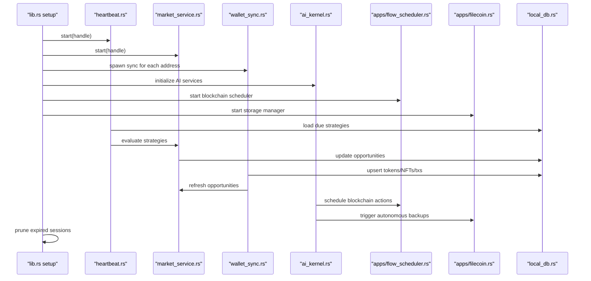

**Diagram sources**
- [lib.rs:43-89](file://src-tauri/src/lib.rs#L43-L89)
- [services/heartbeat.rs:10-74](file://src-tauri/src/services/heartbeat.rs#L10-L74)
- [services/market_service.rs:189-218](file://src-tauri/src/services/market_service.rs#L189-L218)
- [services/wallet_sync.rs:260-452](file://src-tauri/src/services/wallet_sync.rs#L260-L452)
- [services/ai_kernel.rs:1-299](file://src-tauri/src/services/ai_kernel.rs#L1-L299)
- [services/apps/flow_scheduler.rs:1-277](file://src-tauri/src/services/apps/flow_scheduler.rs#L1-L277)
- [services/apps/filecoin.rs:1-405](file://src-tauri/src/services/apps/filecoin.rs#L1-L405)

## Detailed Component Analysis

### Service Initialization Sequence
- Logging and Plugins: Initializes tracing subscriber and registers plugins.
- Database Setup: Creates and migrates the local SQLite database.
- Service Startup: Starts heartbeat, market service, shadow watcher, alpha service, and heartbeat.
- AI Service Initialization: Initializes AI kernel, memory context, and evaluation frameworks.
- Blockchain Service Startup: Starts Flow scheduler and Filecoin storage services.
- Periodic Maintenance: Spawns a loop to prune expired sessions.
- Wallet Sync: Scans addresses and spawns background sync tasks with progress and completion events.

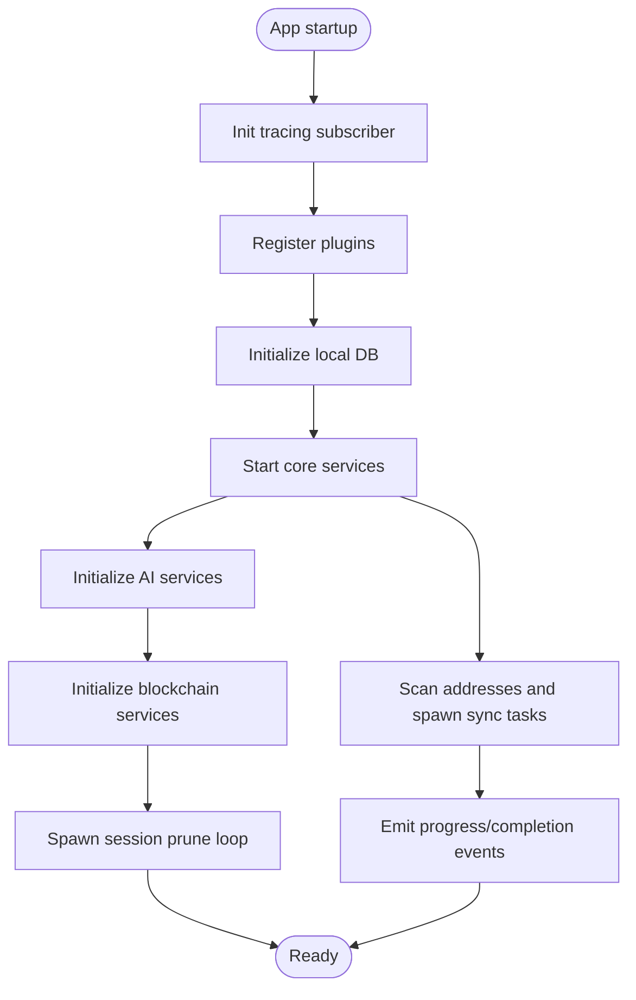

**Diagram sources**
- [lib.rs:34-89](file://src-tauri/src/lib.rs#L34-L89)

**Section sources**
- [lib.rs:34-89](file://src-tauri/src/lib.rs#L34-L89)

### Service Lifecycle Management
- Heartbeat: Runs a periodic loop to expire stale approvals, load due strategies, evaluate them, and schedule app jobs.
- Market Service: Refreshes opportunities on startup and periodically, emitting updates to the UI.
- Wallet Sync: Performs multi-step sync across networks, emitting progress and completion events, and triggering downstream updates.
- AI Kernel: Manages conversation context, tool execution, and memory coordination across services.
- Flow Scheduler: Handles transaction scheduling, fee estimation, and status monitoring for blockchain operations.
- Filecoin Storage: Provides encrypted backup, restore, and autonomous snapshot capabilities.

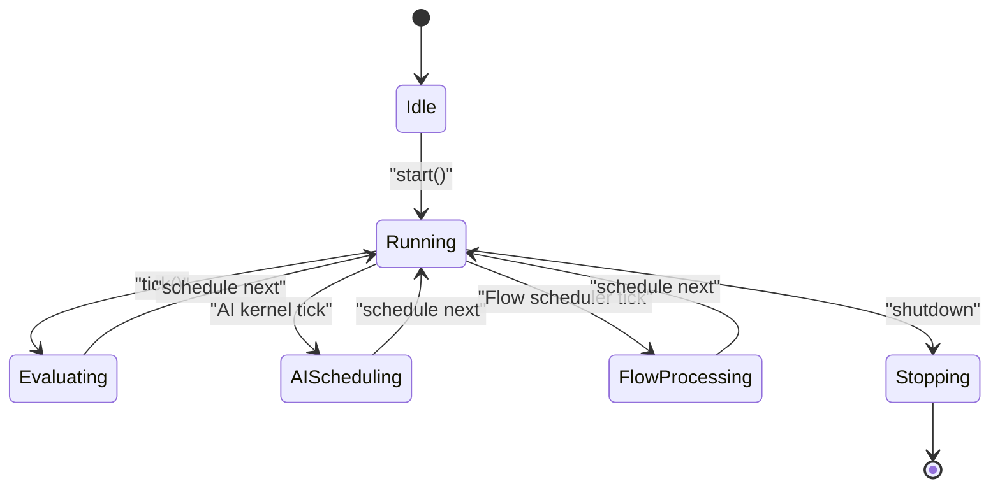

**Diagram sources**
- [services/heartbeat.rs:10-74](file://src-tauri/src/services/heartbeat.rs#L10-L74)
- [services/market_service.rs:189-218](file://src-tauri/src/services/market_service.rs#L189-L218)
- [services/wallet_sync.rs:260-452](file://src-tauri/src/services/wallet_sync.rs#L260-L452)
- [services/ai_kernel.rs:1-299](file://src-tauri/src/services/ai_kernel.rs#L1-L299)
- [services/apps/flow_scheduler.rs:1-277](file://src-tauri/src/services/apps/flow_scheduler.rs#L1-L277)
- [services/apps/filecoin.rs:1-405](file://src-tauri/src/services/apps/filecoin.rs#L1-L405)

**Section sources**
- [services/heartbeat.rs:10-74](file://src-tauri/src/services/heartbeat.rs#L10-L74)
- [services/market_service.rs:189-218](file://src-tauri/src/services/market_service.rs#L189-L218)
- [services/wallet_sync.rs:260-452](file://src-tauri/src/services/wallet_sync.rs#L260-L452)
- [services/ai_kernel.rs:1-299](file://src-tauri/src/services/ai_kernel.rs#L1-L299)
- [services/apps/flow_scheduler.rs:1-277](file://src-tauri/src/services/apps/flow_scheduler.rs#L1-L277)
- [services/apps/filecoin.rs:1-405](file://src-tauri/src/services/apps/filecoin.rs#L1-L405)

### Inter-Service Communication Patterns
- Event Emission: Services emit structured payloads to the frontend (e.g., wallet sync progress and completion).
- Shared State: All services coordinate around the local database for persistence and cross-service visibility.
- Cross-Service Calls: Wallet sync triggers market refresh after successful sync; heartbeat coordinates strategy evaluation.
- AI Coordination: AI kernel coordinates tool execution and memory management across services.
- Blockchain Integration: AI services trigger Flow scheduler for transaction execution; Filecoin services provide backup/restore capabilities.

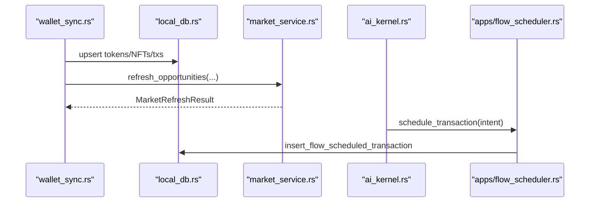

**Diagram sources**
- [services/wallet_sync.rs:409-430](file://src-tauri/src/services/wallet_sync.rs#L409-L430)
- [services/market_service.rs:263-365](file://src-tauri/src/services/market_service.rs#L263-L365)
- [services/ai_kernel.rs:1-299](file://src-tauri/src/services/ai_kernel.rs#L1-L299)
- [services/apps/flow_scheduler.rs:1-277](file://src-tauri/src/services/apps/flow_scheduler.rs#L1-L277)

**Section sources**
- [services/wallet_sync.rs:409-430](file://src-tauri/src/services/wallet_sync.rs#L409-L430)
- [services/market_service.rs:263-365](file://src-tauri/src/services/market_service.rs#L263-L365)
- [services/ai_kernel.rs:1-299](file://src-tauri/src/services/ai_kernel.rs#L1-L299)
- [services/apps/flow_scheduler.rs:1-277](file://src-tauri/src/services/apps/flow_scheduler.rs#L1-L277)

### Error Propagation Mechanisms
- Logging: Services log errors with structured contexts (e.g., strategy evaluation failures).
- UI Notifications: Market service emits a refresh-failed event with a message payload when falling back to cached results.
- Graceful Degradation: Market service falls back to cached opportunities when provider calls fail.
- AI Evaluation: AI services implement structured evaluation frameworks for quality assessment and error reporting.
- Consent Management: Vincent services handle authentication errors and timeout scenarios gracefully.

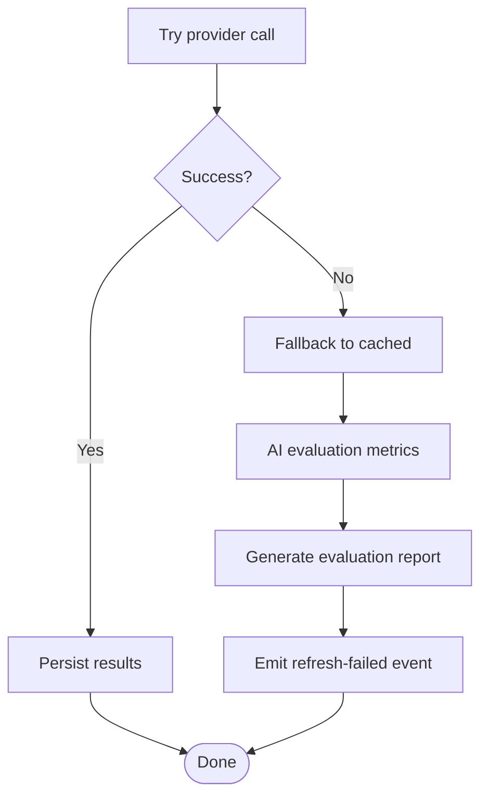

**Diagram sources**
- [services/market_service.rs:292-300](file://src-tauri/src/services/market_service.rs#L292-L300)
- [services/market_service.rs:601-624](file://src-tauri/src/services/market_service.rs#L601-L624)
- [services/ai_evaluation.rs:1-92](file://src-tauri/src/services/ai_evaluation.rs#L1-L92)
- [services/vincent_loopback.rs:1-239](file://src-tauri/src/services/vincent_loopback.rs#L1-L239)

**Section sources**
- [services/market_service.rs:292-300](file://src-tauri/src/services/market_service.rs#L292-L300)
- [services/market_service.rs:601-624](file://src-tauri/src/services/market_service.rs#L601-L624)
- [services/ai_evaluation.rs:1-92](file://src-tauri/src/services/ai_evaluation.rs#L1-L92)
- [services/vincent_loopback.rs:1-239](file://src-tauri/src/services/vincent_loopback.rs#L1-L239)

### Service Registry System
- Tool Registry: Defines tool metadata, execution modes, and permission requirements. Used for dispatch and UI rendering.
- App Catalog Registry: Seeds and manages bundled app catalogs and permissions.
- AI Capability Registry: Manages AI app capabilities and tool availability for kernel orchestration.

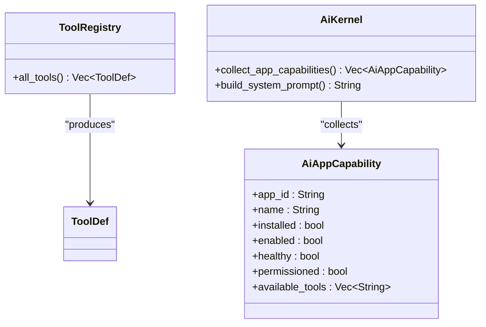

**Diagram sources**
- [services/tool_registry.rs:36-312](file://src-tauri/src/services/tool_registry.rs#L36-L312)
- [services/ai_kernel.rs:44-71](file://src-tauri/src/services/ai_kernel.rs#L44-L71)

**Section sources**
- [services/tool_registry.rs:36-312](file://src-tauri/src/services/tool_registry.rs#L36-L312)
- [services/apps/registry.rs:21-124](file://src-tauri/src/services/apps/registry.rs#L21-L124)
- [services/ai_kernel.rs:44-71](file://src-tauri/src/services/ai_kernel.rs#L44-L71)

### Service Configuration Management
- Environment Variables: Services read keys from environment or settings (e.g., Alchemy API key, Ollama API key).
- Database-backed Settings: Services persist and retrieve configuration in the local database.
- Runtime Paths: The apps runtime locates the TypeScript script using resource directories and debug overrides.
- AI Configuration: AI services use profile-based configuration with different context sizes and temperatures.
- Consent Configuration: Vincent services support configurable loopback ports and redirect URIs.

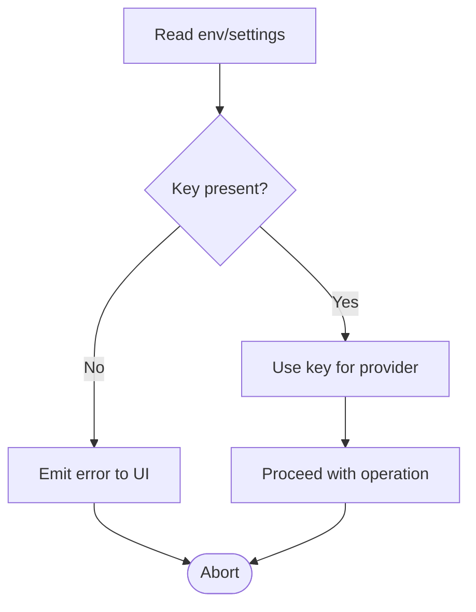

**Diagram sources**
- [services/wallet_sync.rs:261-274](file://src-tauri/src/services/wallet_sync.rs#L261-L274)
- [services/apps/runtime.rs:49-67](file://src-tauri/src/services/apps/runtime.rs#L49-L67)
- [services/ai_profiles.rs:23-66](file://src-tauri/src/services/ai_profiles.rs#L23-L66)
- [services/vincent_loopback.rs:25-30](file://src-tauri/src/services/vincent_loopback.rs#L25-L30)

**Section sources**
- [services/wallet_sync.rs:261-274](file://src-tauri/src/services/wallet_sync.rs#L261-L274)
- [services/apps/runtime.rs:49-67](file://src-tauri/src/services/apps/runtime.rs#L49-L67)
- [services/ai_profiles.rs:23-66](file://src-tauri/src/services/ai_profiles.rs#L23-L66)
- [services/vincent_loopback.rs:25-30](file://src-tauri/src/services/vincent_loopback.rs#L25-L30)

### Resource Cleanup Strategies
- Database: Singleton path is set during init; migrations ensure schema stability.
- Sessions: In-memory cache with expiration; periodic pruning removes stale entries.
- Processes: Sidecar processes are killed on drop to prevent orphaned processes.
- AI Memory: Structured memory management with bounded capacity for facts and rules.
- Consent State: Proper cleanup of Vincent consent tokens and JWT handling.

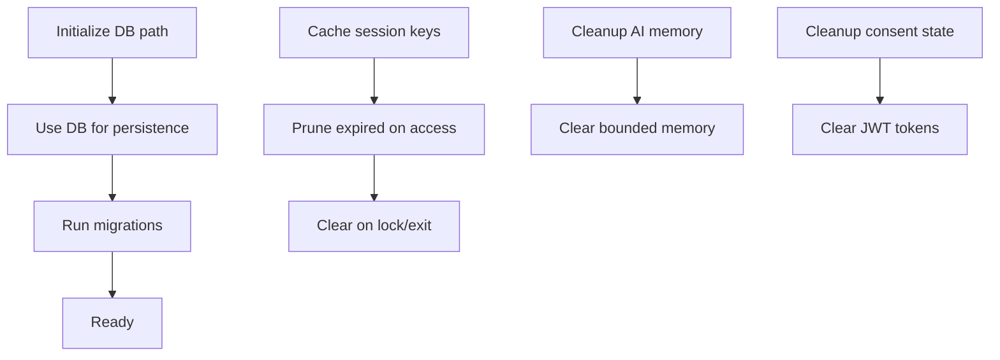

**Diagram sources**
- [services/local_db.rs:438-448](file://src-tauri/src/services/local_db.rs#L438-L448)
- [services/session.rs:25-93](file://src-tauri/src/session.rs#L25-L93)
- [services/apps/runtime.rs:82-84](file://src-tauri/src/services/apps/runtime.rs#L82-L84)
- [services/ai_memory.rs:40-89](file://src-tauri/src/services/ai_memory.rs#L40-L89)
- [services/vincent_loopback.rs:109-125](file://src-tauri/src/services/vincent_loopback.rs#L109-L125)

**Section sources**
- [services/local_db.rs:438-448](file://src-tauri/src/services/local_db.rs#L438-L448)
- [services/session.rs:25-93](file://src-tauri/src/session.rs#L25-L93)
- [services/apps/runtime.rs:82-84](file://src-tauri/src/services/apps/runtime.rs#L82-L84)
- [services/ai_memory.rs:40-89](file://src-tauri/src/services/ai_memory.rs#L40-L89)
- [services/vincent_loopback.rs:109-125](file://src-tauri/src/services/vincent_loopback.rs#L109-L125)

### Practical Examples

#### Service Registration and Dependency Resolution
- Registration: Services are registered in the module tree and started from the setup routine.
- Dependency Resolution: Services receive AppHandle and use it to emit events and access shared resources.
- AI Dependencies: AI kernel depends on memory services, tool registry, and Ollama client.
- Blockchain Dependencies: Flow scheduler depends on session management and local database.

**Section sources**
- [services/mod.rs:1-36](file://src-tauri/src/services/mod.rs#L1-L36)
- [lib.rs:43-89](file://src-tauri/src/lib.rs#L43-L89)
- [services/ai_kernel.rs:1-299](file://src-tauri/src/services/ai_kernel.rs#L1-L299)
- [services/apps/flow_scheduler.rs:1-277](file://src-tauri/src/services/apps/flow_scheduler.rs#L1-L277)

#### Service Composition Patterns
- Market refresh triggers wallet sync updates and vice versa.
- Heartbeat orchestrates strategy evaluation and scheduling.
- AI kernel coordinates tool execution and blockchain operations.
- Filecoin storage provides autonomous backup capabilities.

**Section sources**
- [services/market_service.rs:189-218](file://src-tauri/src/services/market_service.rs#L189-L218)
- [services/wallet_sync.rs:409-430](file://src-tauri/src/services/wallet_sync.rs#L409-L430)
- [services/heartbeat.rs:10-74](file://src-tauri/src/services/heartbeat.rs#L10-L74)
- [services/ai_kernel.rs:1-299](file://src-tauri/src/services/ai_kernel.rs#L1-L299)
- [services/apps/filecoin.rs:303-326](file://src-tauri/src/services/apps/filecoin.rs#L303-L326)

### Service Isolation and Thread Safety
- Concurrency Model: Services use Tokio async runtime with intervals and spawn helpers.
- Thread Safety: Shared state is accessed via a singleton DB path and in-memory caches protected by locks; sessions are cleared on exit.
- Process Isolation: Apps runtime spawns a separate process per request to isolate crashes.
- AI Memory Safety: Structured memory management prevents unbounded growth with bounded capacity limits.
- Consent Security: JWT handling with proper cleanup and timeout management.

**Section sources**
- [Cargo.toml:35](file://src-tauri/Cargo.toml#L35)
- [services/session.rs:16-23](file://src-tauri/src/session.rs#L16-L23)
- [services/apps/runtime.rs:77-84](file://src-tauri/src/services/apps/runtime.rs#L77-L84)
- [services/ai_memory.rs:5-7](file://src-tauri/src/services/ai_memory.rs#L5-L7)
- [services/vincent_loopback.rs:109-125](file://src-tauri/src/services/vincent_loopback.rs#L109-L125)

### Performance Optimization Techniques
- Periodic Batching: Services schedule work at fixed intervals to avoid busy loops.
- Caching: Market service caches results and serves stale data when providers fail.
- Asynchronous I/O: Network requests and DB operations are performed asynchronously.
- AI Context Management: Bounded memory limits prevent excessive context size.
- Blockchain Fee Optimization: Flow scheduler provides fee estimation before transaction submission.

**Section sources**
- [services/market_service.rs:561-593](file://src-tauri/src/services/market_service.rs#L561-L593)
- [services/wallet_sync.rs:260-452](file://src-tauri/src/services/wallet_sync.rs#L260-L452)
- [services/ai_memory.rs:5-7](file://src-tauri/src/services/ai_memory.rs#L5-L7)
- [services/apps/flow_scheduler.rs:37-66](file://src-tauri/src/services/apps/flow_scheduler.rs#L37-L66)

### Testing Framework and Mocking Strategies
- Unit Tests: Registry modules include unit tests validating catalog coverage and session behavior.
- AI Testing: AI kernel includes tests for tool observation compaction and capability rendering.
- Blockchain Testing: Flow scheduler includes tests for fee estimation and transaction submission.
- Consent Testing: Vincent services include tests for URL generation and JWT extraction.
- Mocking Strategies: For unit testing, replace external dependencies with mocks (e.g., HTTP client, DB connection) and inject test doubles via constructors or environment overrides.

**Section sources**
- [services/apps/registry.rs:126-138](file://src-tauri/src/services/apps/registry.rs#L126-L138)
- [services/session.rs:127-144](file://src-tauri/src/session.rs#L127-L144)
- [services/ai_kernel.rs:239-299](file://src-tauri/src/services/ai_kernel.rs#L239-L299)
- [services/apps/flow_scheduler.rs:1-277](file://src-tauri/src/services/apps/flow_scheduler.rs#L1-L277)
- [services/vincent_loopback.rs:1-239](file://src-tauri/src/services/vincent_loopback.rs#L1-L239)

## AI Services Architecture
The AI services provide a comprehensive framework for intelligent agent behavior with memory management, kernel orchestration, and evaluation capabilities.

### AI Kernel System
The AI kernel serves as the central coordinator for AI operations, managing conversation context, tool execution, and memory integration.

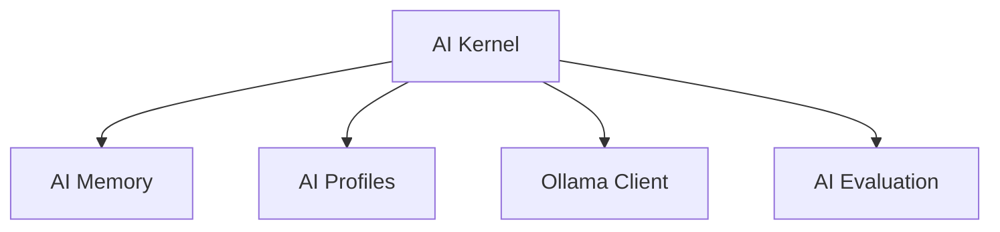

**Diagram sources**
- [services/ai_kernel.rs:1-299](file://src-tauri/src/services/ai_kernel.rs#L1-L299)
- [services/ai_memory.rs:1-183](file://src-tauri/src/services/ai_memory.rs#L1-L183)
- [services/ai_profiles.rs:1-87](file://src-tauri/src/services/ai_profiles.rs#L1-L87)
- [services/ai_evaluation.rs:1-92](file://src-tauri/src/services/ai_evaluation.rs#L1-L92)
- [services/ollama_client.rs:1-127](file://src-tauri/src/services/ollama_client.rs#L1-L127)

### AI Memory Management
Structured memory management with bounded capacity for different memory types including semantic, episodic, and procedural memory.

**Section sources**
- [services/ai_memory.rs:9-134](file://src-tauri/src/services/ai_memory.rs#L9-L134)
- [services/ai_kernel.rs:73-81](file://src-tauri/src/services/ai_kernel.rs#L73-L81)

### AI Profile Configuration
Different AI profiles with specific configurations for temperature, context size, and task directives.

**Section sources**
- [services/ai_profiles.rs:13-66](file://src-tauri/src/services/ai_profiles.rs#L13-L66)
- [services/ai_kernel.rs:83-113](file://src-tauri/src/services/ai_kernel.rs#L83-L113)

### AI Evaluation Framework
Structured evaluation framework for assessing AI performance across multiple metrics.

**Section sources**
- [services/ai_evaluation.rs:5-69](file://src-tauri/src/services/ai_evaluation.rs#L5-L69)
- [services/ai_kernel.rs:139-176](file://src-tauri/src/services/ai_kernel.rs#L139-L176)

## Blockchain Integration Services
Enhanced blockchain services provide comprehensive Flow transaction management, scheduling, and Filecoin storage capabilities.

### Flow Scheduler Architecture
Flow scheduler provides transaction scheduling, fee estimation, and status monitoring for blockchain operations.

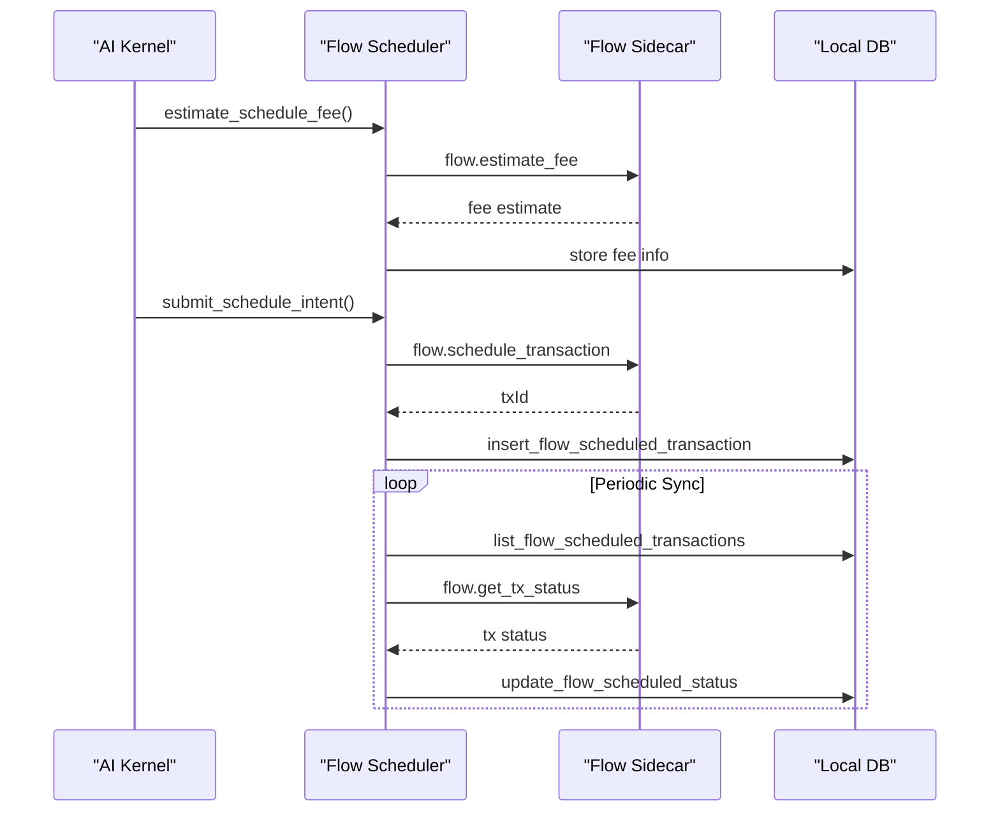

**Diagram sources**
- [services/apps/flow_scheduler.rs:37-66](file://src-tauri/src/services/apps/flow_scheduler.rs#L37-L66)
- [services/apps/flow_scheduler.rs:68-130](file://src-tauri/src/services/apps/flow_scheduler.rs#L68-L130)
- [services/apps/flow_scheduler.rs:193-211](file://src-tauri/src/services/apps/flow_scheduler.rs#L193-L211)
- [services/apps/flow_scheduler.rs:254-276](file://src-tauri/src/services/apps/flow_scheduler.rs#L254-L276)

### Filecoin Storage Services
Filecoin storage services provide encrypted backup, restore, and autonomous snapshot capabilities with comprehensive metadata management.

**Section sources**
- [services/apps/filecoin.rs:188-218](file://src-tauri/src/services/apps/filecoin.rs#L188-L218)
- [services/apps/filecoin.rs:253-284](file://src-tauri/src/services/apps/filecoin.rs#L253-L284)
- [services/apps/filecoin.rs:303-326](file://src-tauri/src/services/apps/filecoin.rs#L303-L326)

### Vincent Consent Management
Localhost loopback authentication for Vincent user consent with secure JWT handling and timeout management.

**Section sources**
- [services/vincent_loopback.rs:16-30](file://src-tauri/src/services/vincent_loopback.rs#L16-L30)
- [services/vincent_loopback.rs:132-213](file://src-tauri/src/services/vincent_loopback.rs#L132-L213)
- [services/vincent_loopback.rs:219-228](file://src-tauri/src/services/vincent_loopback.rs#L219-L228)

### Ollama Client Integration
Local AI model interaction for summarization and conversation processing with configurable context sizes and temperatures.

**Section sources**
- [services/ollama_client.rs:51-126](file://src-tauri/src/services/ollama_client.rs#L51-L126)
- [services/ai_kernel.rs:139-176](file://src-tauri/src/services/ai_kernel.rs#L139-L176)

## Dependency Analysis
The service layer depends on Tauri for commands and event emission, Tokio for async runtime, Rusqlite for local persistence, and external providers for market data, blockchain operations, and AI models.

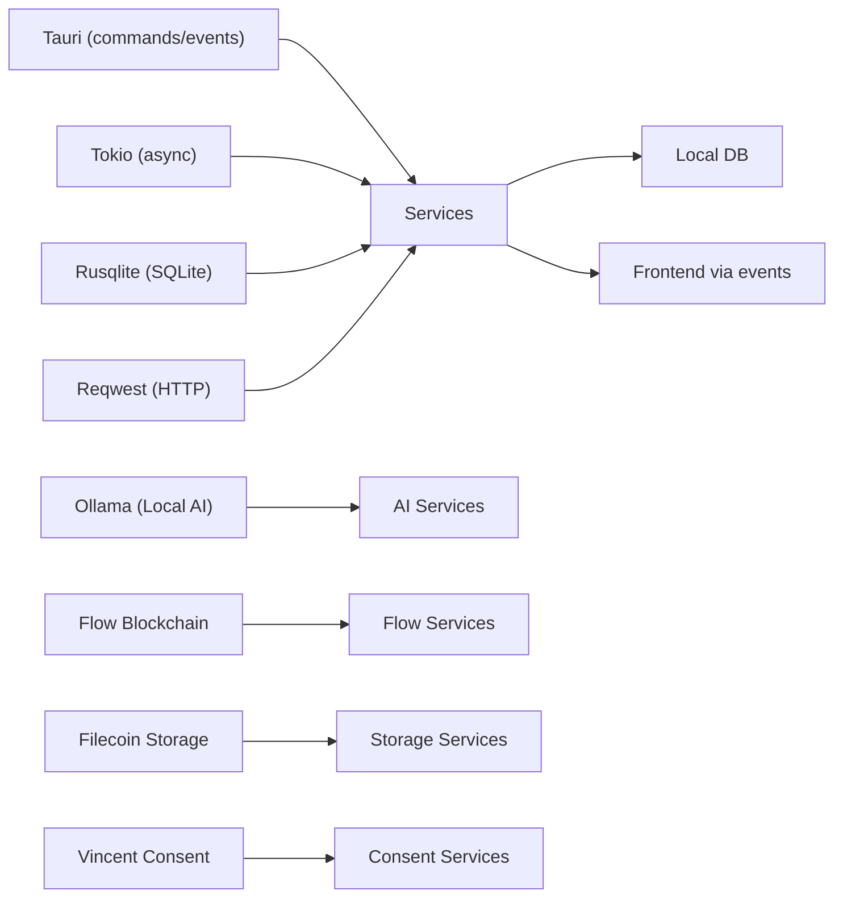

**Diagram sources**
- [Cargo.toml:21-42](file://src-tauri/Cargo.toml#L21-L42)
- [lib.rs:40-191](file://src-tauri/src/lib.rs#L40-L191)
- [services/ollama_client.rs:7](file://src-tauri/src/services/ollama_client.rs#L7)
- [services/apps/flow.rs:1-164](file://src-tauri/src/services/apps/flow.rs#L1-L164)
- [services/apps/filecoin.rs:1-405](file://src-tauri/src/services/apps/filecoin.rs#L1-L405)
- [services/vincent_loopback.rs:1-239](file://src-tauri/src/services/vincent_loopback.rs#L1-L239)

**Section sources**
- [Cargo.toml:21-42](file://src-tauri/Cargo.toml#L21-L42)
- [lib.rs:40-191](file://src-tauri/src/lib.rs#L40-L191)

## Performance Considerations
- Use bounded concurrency for network calls and DB writes.
- Prefer batched writes to minimize transaction overhead.
- Cache frequently accessed data and invalidate on schedule.
- Avoid blocking operations in async contexts; use non-blocking I/O.
- Implement AI memory bounds to prevent excessive context size.
- Use fee estimation before blockchain transaction submission.
- Optimize Filecoin backup operations with proper metadata management.

## Troubleshooting Guide
- Database Initialization Failures: Verify DB path creation and migration steps.
- Missing API Keys: Ensure environment variables are set before starting services that require them.
- Stuck or Crashed Sidecar: Confirm process spawn and kill-on-drop behavior; check logs for spawn errors.
- Excessive CPU Usage: Review intervals and ensure tasks are not overlapping unnecessarily.
- AI Model Issues: Verify Ollama installation and model availability for AI services.
- Blockchain Transaction Failures: Check fee estimation and network configuration for Flow services.
- Filecoin Backup Errors: Verify encryption keys and storage policies for Filecoin services.
- Consent Authentication Problems: Check loopback port availability and JWT handling for Vincent services.

**Section sources**
- [services/local_db.rs:438-448](file://src-tauri/src/services/local_db.rs#L438-L448)
- [services/wallet_sync.rs:261-274](file://src-tauri/src/services/wallet_sync.rs#L261-L274)
- [services/apps/runtime.rs:77-84](file://src-tauri/src/services/apps/runtime.rs#L77-L84)
- [services/ai_kernel.rs:139-176](file://src-tauri/src/services/ai_kernel.rs#L139-L176)
- [services/apps/flow_scheduler.rs:37-66](file://src-tauri/src/services/apps/flow_scheduler.rs#L37-L66)
- [services/apps/filecoin.rs:188-218](file://src-tauri/src/services/apps/filecoin.rs#L188-L218)
- [services/vincent_loopback.rs:132-213](file://src-tauri/src/services/vincent_loopback.rs#L132-L213)

## Conclusion
SHADOW Protocol's Rust service layer implements a robust, modular architecture with clear lifecycles, event-driven communication, and strong isolation guarantees. The recent enhancements include comprehensive AI services with kernel orchestration, memory management, and evaluation frameworks; Vincent consent management with secure localhost authentication; Flow blockchain scheduling with transaction management; and advanced Filecoin storage capabilities with encrypted backup and restore. The design enables scalable extension, predictable error handling, and efficient resource utilization. By leveraging registries, configuration management, and rigorous testing strategies, teams can confidently evolve the service ecosystem with sophisticated AI and blockchain capabilities.

## Appendices
- Binary Entry Point: The binary delegates to the library's run function, which configures the runtime and services.

**Section sources**
- [main.rs:4-6](file://src-tauri/src/main.rs#L4-L6)