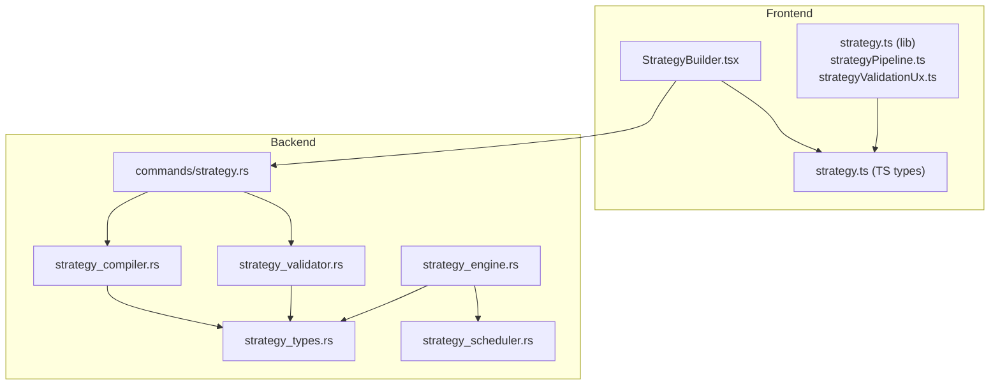
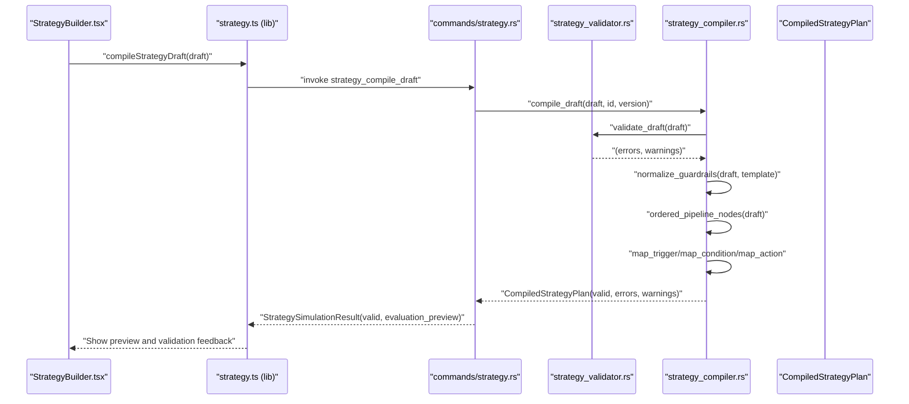
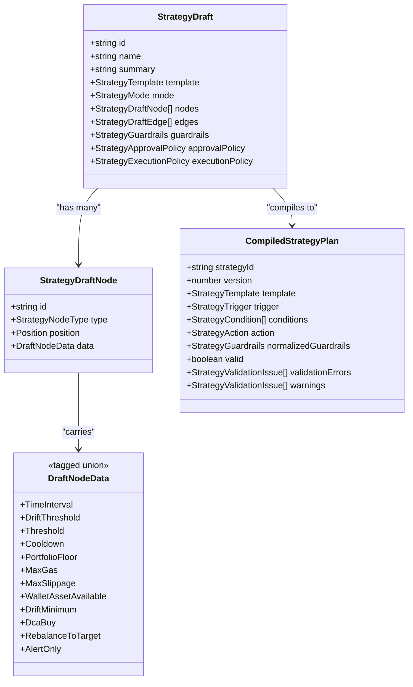
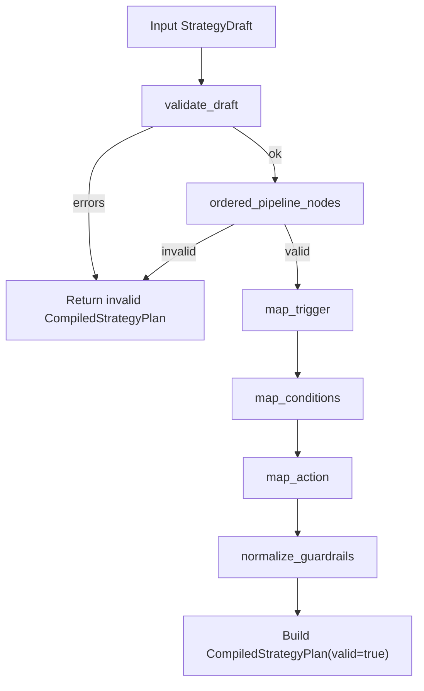
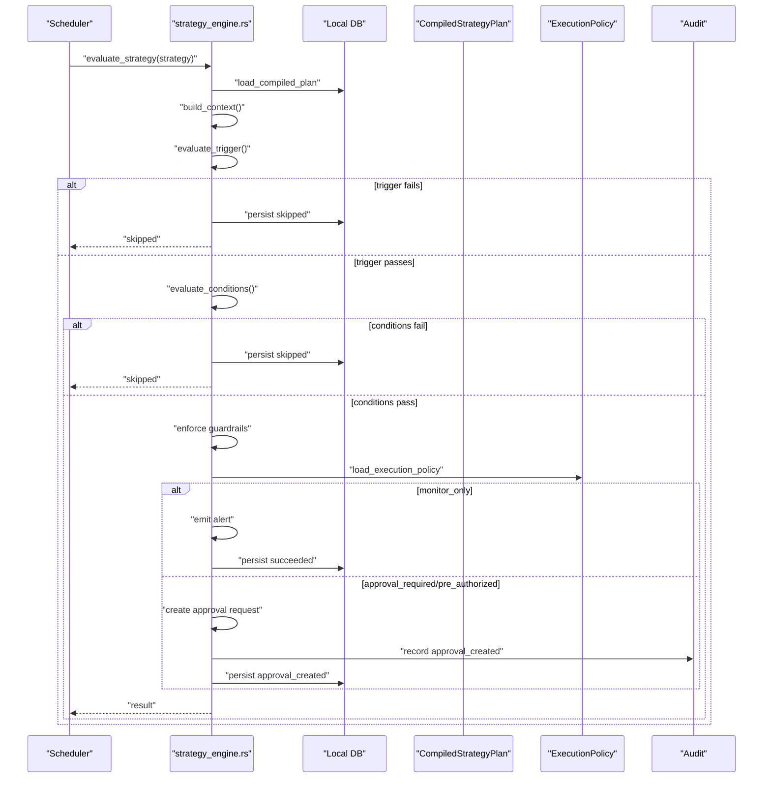
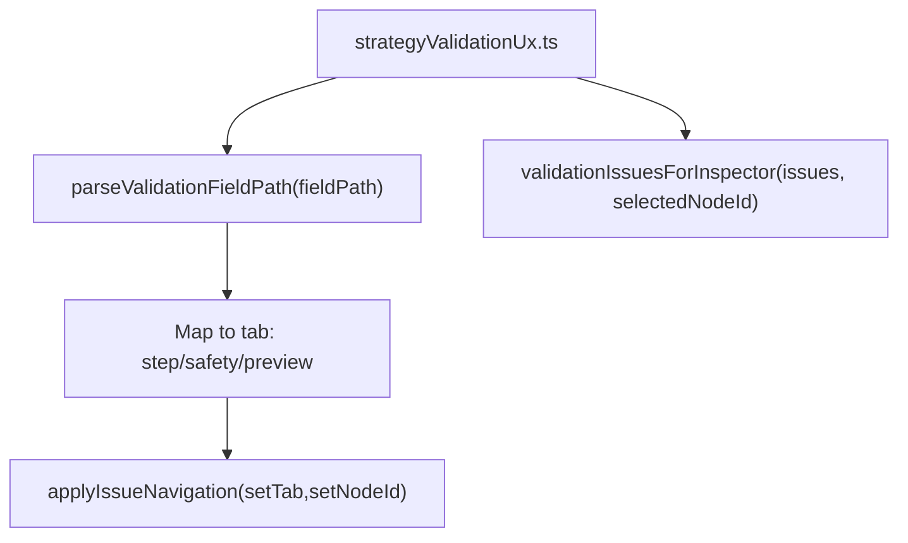
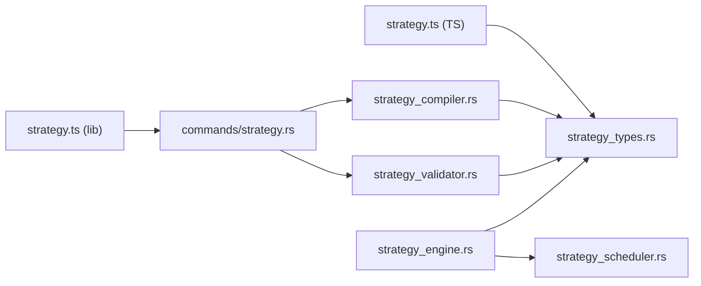

# Strategy Compilation & Validation

<cite>
**Referenced Files in This Document**
- [strategy.ts](file://src/types/strategy.ts)
- [strategy.ts](file://src/lib/strategy.ts)
- [strategyPipeline.ts](file://src/lib/strategyPipeline.ts)
- [strategyValidationUx.ts](file://src/lib/strategyValidationUx.ts)
- [StrategyBuilder.tsx](file://src/components/strategy/StrategyBuilder.tsx)
- [strategy_compiler.rs](file://src-tauri/src/services/strategy_compiler.rs)
- [strategy_validator.rs](file://src-tauri/src/services/strategy_validator.rs)
- [strategy_types.rs](file://src-tauri/src/services/strategy_types.rs)
- [strategy.rs](file://src-tauri/src/commands/strategy.rs)
- [strategy_engine.rs](file://src-tauri/src/services/strategy_engine.rs)
- [strategy_scheduler.rs](file://src-tauri/src/services/strategy_scheduler.rs)
</cite>

## Table of Contents
1. [Introduction](#introduction)
2. [Project Structure](#project-structure)
3. [Core Components](#core-components)
4. [Architecture Overview](#architecture-overview)
5. [Detailed Component Analysis](#detailed-component-analysis)
6. [Dependency Analysis](#dependency-analysis)
7. [Performance Considerations](#performance-considerations)
8. [Troubleshooting Guide](#troubleshooting-guide)
9. [Conclusion](#conclusion)
10. [Appendices](#appendices)

## Introduction
This document explains the strategy compilation and validation system that transforms interactive strategy drafts into executable automation plans. It covers the end-to-end pipeline from user-defined strategy graphs to compiled runtime plans, including AST-like transformation, structural and semantic validation, guardrails normalization, and runtime evaluation. It also documents the strategy template system, type checking mechanisms across frontend and backend, compilation artifacts, and the relationship between strategy definitions, compiled plans, and runtime execution contexts.

## Project Structure
The strategy system spans the frontend React UI and the Rust backend services:
- Frontend TypeScript types define the canonical shapes for drafts and compiled plans.
- Frontend libraries orchestrate default templates, pipeline ordering, and UX for validation navigation.
- Backend Rust services validate and compile strategy drafts into executable plans, and evaluate them at runtime.



**Diagram sources**
- [StrategyBuilder.tsx:1-287](file://src/components/strategy/StrategyBuilder.tsx#L1-L287)
- [strategy.ts:1-258](file://src/types/strategy.ts#L1-L258)
- [strategy.ts:1-218](file://src/lib/strategy.ts#L1-L218)
- [strategyPipeline.ts:1-116](file://src/lib/strategyPipeline.ts#L1-L116)
- [strategyValidationUx.ts:1-67](file://src/lib/strategyValidationUx.ts#L1-L67)
- [strategy.rs:1-309](file://src-tauri/src/commands/strategy.rs#L1-L309)
- [strategy_types.rs:1-417](file://src-tauri/src/services/strategy_types.rs#L1-L417)
- [strategy_validator.rs:1-457](file://src-tauri/src/services/strategy_validator.rs#L1-L457)
- [strategy_compiler.rs:1-369](file://src-tauri/src/services/strategy_compiler.rs#L1-L369)
- [strategy_engine.rs:1-726](file://src-tauri/src/services/strategy_engine.rs#L1-L726)
- [strategy_scheduler.rs:1-64](file://src-tauri/src/services/strategy_scheduler.rs#L1-L64)

**Section sources**
- [strategy.ts:1-258](file://src/types/strategy.ts#L1-L258)
- [strategy.ts:1-218](file://src/lib/strategy.ts#L1-L218)
- [strategyPipeline.ts:1-116](file://src/lib/strategyPipeline.ts#L1-L116)
- [strategyValidationUx.ts:1-67](file://src/lib/strategyValidationUx.ts#L1-L67)
- [strategy.rs:1-309](file://src-tauri/src/commands/strategy.rs#L1-L309)
- [strategy_types.rs:1-417](file://src-tauri/src/services/strategy_types.rs#L1-L417)
- [strategy_validator.rs:1-457](file://src-tauri/src/services/strategy_validator.rs#L1-L457)
- [strategy_compiler.rs:1-369](file://src-tauri/src/services/strategy_compiler.rs#L1-L369)
- [strategy_engine.rs:1-726](file://src-tauri/src/services/strategy_engine.rs#L1-L726)
- [strategy_scheduler.rs:1-64](file://src-tauri/src/services/strategy_scheduler.rs#L1-L64)

## Core Components
- Strategy Draft (frontend/backend): A directed acyclic graph with exactly one trigger, zero or more conditions, and exactly one action. Nodes carry typed payloads mapped to backend enums and structs.
- Validation: Structural checks (exactly one trigger/action, linear chain, no cycles, edge constraints) and semantic checks (template-node compatibility, guardrails bounds).
- Compilation: Transformation of draft nodes into tagged enums for triggers, conditions, and actions; normalization of guardrails; creation of a validated plan with metadata.
- Runtime Execution: Periodic evaluation against portfolio snapshots and balances; condition gating; approval workflows; and persistence of execution records.

**Section sources**
- [strategy_types.rs:228-243](file://src-tauri/src/services/strategy_types.rs#L228-L243)
- [strategy_validator.rs:13-106](file://src-tauri/src/services/strategy_validator.rs#L13-L106)
- [strategy_compiler.rs:185-292](file://src-tauri/src/services/strategy_compiler.rs#L185-L292)
- [strategy_engine.rs:343-725](file://src-tauri/src/services/strategy_engine.rs#L343-L725)

## Architecture Overview
The compilation and validation pipeline proceeds as follows:
- Frontend builds or loads a StrategyDraft and invokes a Tauri command to compile.
- Backend validates the draft (structural and semantic) and normalizes guardrails.
- Backend compiles the draft into a CompiledStrategyPlan.
- Frontend receives a StrategySimulationResult summarizing validity and an evaluation preview.
- At runtime, the engine evaluates the compiled plan against current context and enforces guardrails and policies.



**Diagram sources**
- [StrategyBuilder.tsx:1-287](file://src/components/strategy/StrategyBuilder.tsx#L1-L287)
- [strategy.ts:174-189](file://src/lib/strategy.ts#L174-L189)
- [strategy.rs:216-227](file://src-tauri/src/commands/strategy.rs#L216-L227)
- [strategy_compiler.rs:185-292](file://src-tauri/src/services/strategy_compiler.rs#L185-L292)
- [strategy_validator.rs:13-106](file://src-tauri/src/services/strategy_validator.rs#L13-L106)

## Detailed Component Analysis

### Strategy Templates and Type System
- Template-driven design defines three canonical strategies: DCA Buy, Rebalance To Target, and Alert Only.
- Draft nodes are strongly typed via tagged unions (frontend TS and backend Rust) ensuring structural correctness before compilation.
- Guardrails are normalized per template to ensure safe defaults for funds-moving strategies.



**Diagram sources**
- [strategy_types.rs:228-243](file://src-tauri/src/services/strategy_types.rs#L228-L243)
- [strategy_types.rs:37-125](file://src-tauri/src/services/strategy_types.rs#L37-L125)
- [strategy_types.rs:244-355](file://src-tauri/src/services/strategy_types.rs#L244-L355)

**Section sources**
- [strategy_types.rs:29-33](file://src-tauri/src/services/strategy_types.rs#L29-L33)
- [strategy_types.rs:37-125](file://src-tauri/src/services/strategy_types.rs#L37-L125)
- [strategy_types.rs:228-243](file://src-tauri/src/services/strategy_types.rs#L228-L243)
- [strategy_types.rs:244-355](file://src-tauri/src/services/strategy_types.rs#L244-L355)

### Validation Framework
- Structural validation ensures exactly one trigger and one action, a single linear chain, no cycles, and proper edge constraints.
- Semantic validation enforces template-node compatibility and guards mode/template combinations.
- Guardrails validation enforces positive and reasonable bounds for funds-moving strategies.

```mermaid
flowchart TD
Start([Start validate_draft]) --> Name["Validate name length"]
Name --> Summary["Validate summary length"]
Summary --> ModeTpl["Validate mode vs template"]
ModeTpl --> Count["Count triggers/actions"]
Count --> |1 each| Linear["Validate linear pipeline"]
Count --> |else| Errors["Emit count errors"]
Linear --> |OK| Template["Validate template-node pairs"]
Linear --> |KO| Errors
Template --> Guardrails["Validate guardrails bounds"]
Guardrails --> Done([Return (errors, warnings)])
Errors --> Done
```

**Diagram sources**
- [strategy_validator.rs:13-106](file://src-tauri/src/services/strategy_validator.rs#L13-L106)
- [strategy_validator.rs:119-223](file://src-tauri/src/services/strategy_validator.rs#L119-L223)
- [strategy_validator.rs:225-292](file://src-tauri/src/services/strategy_validator.rs#L225-L292)
- [strategy_validator.rs:294-340](file://src-tauri/src/services/strategy_validator.rs#L294-L340)

**Section sources**
- [strategy_validator.rs:13-106](file://src-tauri/src/services/strategy_validator.rs#L13-L106)
- [strategy_validator.rs:108-117](file://src-tauri/src/services/strategy_validator.rs#L108-L117)
- [strategy_validator.rs:119-223](file://src-tauri/src/services/strategy_validator.rs#L119-L223)
- [strategy_validator.rs:225-292](file://src-tauri/src/services/strategy_validator.rs#L225-L292)
- [strategy_validator.rs:294-340](file://src-tauri/src/services/strategy_validator.rs#L294-L340)

### Compilation Pipeline
- Draft is validated; if invalid, a plan with errors is returned.
- Pipeline order is derived from the trigger to action; if ambiguous or cyclic, an error is produced.
- Node payloads are mapped to compiled triggers, conditions, and actions.
- Guardrails are normalized according to template rules.
- Final plan includes validation outcomes and warnings.



**Diagram sources**
- [strategy_compiler.rs:185-292](file://src-tauri/src/services/strategy_compiler.rs#L185-L292)
- [strategy_compiler.rs:146-183](file://src-tauri/src/services/strategy_compiler.rs#L146-L183)
- [strategy_compiler.rs:19-118](file://src-tauri/src/services/strategy_compiler.rs#L19-L118)
- [strategy_compiler.rs:120-144](file://src-tauri/src/services/strategy_compiler.rs#L120-L144)

**Section sources**
- [strategy_compiler.rs:185-292](file://src-tauri/src/services/strategy_compiler.rs#L185-L292)
- [strategy_compiler.rs:146-183](file://src-tauri/src/services/strategy_compiler.rs#L146-L183)
- [strategy_compiler.rs:19-118](file://src-tauri/src/services/strategy_compiler.rs#L19-L118)
- [strategy_compiler.rs:120-144](file://src-tauri/src/services/strategy_compiler.rs#L120-L144)

### Runtime Execution Context
- The engine loads the compiled plan and constructs an evaluation context from portfolio snapshots and token balances.
- Triggers are evaluated (time-based scheduling, drift thresholds, or threshold metrics).
- Conditions are evaluated (portfolio floor, gas budget, slippage, wallet availability, cooldown, drift minimum).
- Guardrails are enforced (trade size, allowed chains, minimum portfolio).
- Execution mode determines whether to emit alerts, request approvals, or proceed directly.



**Diagram sources**
- [strategy_engine.rs:343-725](file://src-tauri/src/services/strategy_engine.rs#L343-L725)
- [strategy_scheduler.rs:9-36](file://src-tauri/src/services/strategy_scheduler.rs#L9-L36)
- [strategy.rs:126-214](file://src-tauri/src/commands/strategy.rs#L126-L214)

**Section sources**
- [strategy_engine.rs:343-725](file://src-tauri/src/services/strategy_engine.rs#L343-L725)
- [strategy_scheduler.rs:9-36](file://src-tauri/src/services/strategy_scheduler.rs#L9-L36)
- [strategy.rs:126-214](file://src-tauri/src/commands/strategy.rs#L126-L214)

### Strategy Builder UX and Validation Navigation
- The builder displays validation issues grouped by tabs: Step (selected node), Safety (guardrails), and Preview (overall plan).
- Field paths from backend guide navigation to specific nodes or global fields.
- Simulation preview summarizes would-trigger and expected action summary.



**Diagram sources**
- [strategyValidationUx.ts:8-67](file://src/lib/strategyValidationUx.ts#L8-L67)
- [StrategyBuilder.tsx:59-74](file://src/components/strategy/StrategyBuilder.tsx#L59-L74)

**Section sources**
- [strategyValidationUx.ts:1-67](file://src/lib/strategyValidationUx.ts#L1-L67)
- [StrategyBuilder.tsx:59-74](file://src/components/strategy/StrategyBuilder.tsx#L59-L74)

## Dependency Analysis
- Frontend types mirror backend types to ensure IPC compatibility.
- Commands orchestrate compilation, persistence, and retrieval of strategy artifacts.
- Compiler depends on validator for structural and semantic checks.
- Engine depends on scheduler for next-run computation and on compiled plans for evaluation.



**Diagram sources**
- [strategy.ts:1-258](file://src/types/strategy.ts#L1-L258)
- [strategy_types.rs:1-417](file://src-tauri/src/services/strategy_types.rs#L1-L417)
- [strategy.rs:1-309](file://src-tauri/src/commands/strategy.rs#L1-L309)
- [strategy_compiler.rs:1-369](file://src-tauri/src/services/strategy_compiler.rs#L1-L369)
- [strategy_validator.rs:1-457](file://src-tauri/src/services/strategy_validator.rs#L1-L457)
- [strategy_engine.rs:1-726](file://src-tauri/src/services/strategy_engine.rs#L1-L726)
- [strategy_scheduler.rs:1-64](file://src-tauri/src/services/strategy_scheduler.rs#L1-L64)

**Section sources**
- [strategy.ts:1-258](file://src/types/strategy.ts#L1-L258)
- [strategy_types.rs:1-417](file://src-tauri/src/services/strategy_types.rs#L1-L417)
- [strategy.rs:1-309](file://src-tauri/src/commands/strategy.rs#L1-L309)
- [strategy_compiler.rs:1-369](file://src-tauri/src/services/strategy_compiler.rs#L1-L369)
- [strategy_validator.rs:1-457](file://src-tauri/src/services/strategy_validator.rs#L1-L457)
- [strategy_engine.rs:1-726](file://src-tauri/src/services/strategy_engine.rs#L1-L726)
- [strategy_scheduler.rs:1-64](file://src-tauri/src/services/strategy_scheduler.rs#L1-L64)

## Performance Considerations
- Compilation complexity is linear in the number of nodes due to single-path pipeline derivation and simple mapping functions.
- Validation performs bounded checks (counts, edge constraints, template compatibility, guardrails), suitable for frequent user edits.
- Runtime evaluation is lightweight: parsing JSON, computing drift, and simple comparisons; expensive operations (network calls) are deferred to approval tooling.
- Caching and incremental compilation opportunities:
  - Cache compiled plans keyed by a stable hash of the draft (excluding transient fields) to avoid recomputation on minor edits.
  - Incremental validation: re-run only changed node validations when editing a single node; reuse structural checks if the graph topology remains unchanged.
  - Debounce simulation requests in the UI to reduce backend load during rapid edits.

[No sources needed since this section provides general guidance]

## Troubleshooting Guide
Common validation failures and remedies:
- Name too short or summary too long: Fix the metadata fields to meet length constraints.
- Invalid mode/template combination: Switch to a compatible mode for the chosen template.
- Multiple triggers or actions: Ensure exactly one trigger and one action in the graph.
- Non-linear pipeline or cycles: Remove extra edges and ensure a single path from trigger to action.
- Template-node mismatch: Adjust nodes to match the selected template’s requirements.
- Guardrail violations: Correct positive and reasonable values for funds-moving strategies.

Compilation and activation errors:
- Cannot activate invalid strategy: Fix validation errors before activation.
- Pre-authorized mode requires valid plan: Ensure compilation succeeds when selecting pre-authorized mode.
- Strategy paused due to limits: Reduce notional amounts or adjust guardrails.

Runtime execution skips:
- Stale portfolio snapshot: Wait for fresh portfolio data.
- One or more conditions blocked: Review and relax guardrails or conditions.
- Below minimum portfolio: Increase holdings or lower minimum guardrail.
- Chain not allowed: Select an allowed chain or update the allowlist.

**Section sources**
- [strategy_validator.rs:13-106](file://src-tauri/src/services/strategy_validator.rs#L13-L106)
- [strategy_compiler.rs:185-292](file://src-tauri/src/services/strategy_compiler.rs#L185-L292)
- [strategy.rs:119-140](file://src-tauri/src/commands/strategy.rs#L119-L140)
- [strategy_engine.rs:135-157](file://src-tauri/src/services/strategy_engine.rs#L135-L157)
- [strategy_engine.rs:375-401](file://src-tauri/src/services/strategy_engine.rs#L375-L401)
- [strategy_engine.rs:476-499](file://src-tauri/src/services/strategy_engine.rs#L476-L499)
- [strategy_engine.rs:436-474](file://src-tauri/src/services/strategy_engine.rs#L436-L474)

## Conclusion
The strategy system provides a robust, template-driven workflow for building automation strategies. Strong typing across frontend and backend, structured validation, and guardrails normalization ensure safe and predictable compilation. The runtime engine evaluates strategies efficiently against real-time portfolio context, enforcing guardrails and integrating with approval workflows. Extending the system involves adding new templates and node types with corresponding validation and mapping logic, maintaining the existing separation of concerns between validation, compilation, and execution.

## Appendices

### Strategy Compilation Workflows
- DCA Buy: Time interval trigger → optional conditions → DCA buy action; guardrails enforced for per-trade and daily notional caps.
- Rebalance To Target: Time interval or drift threshold trigger → optional conditions → rebalance action; guardrails enforce slippage and gas budgets.
- Alert Only: Threshold or time-based trigger → optional conditions → alert-only action; mode restrictions apply.

**Section sources**
- [strategy_compiler.rs:19-118](file://src-tauri/src/services/strategy_compiler.rs#L19-L118)
- [strategy_validator.rs:225-292](file://src-tauri/src/services/strategy_validator.rs#L225-L292)
- [strategy_types.rs:256-340](file://src-tauri/src/services/strategy_types.rs#L256-L340)

### Compilation Artifacts
- StrategyDraft: JSON-serializable frontend shape.
- CompiledStrategyPlan: Backend shape with tagged enums for triggers, conditions, and actions; includes normalized guardrails and validation metadata.
- StrategySimulationResult: Frontend-friendly result containing validity, preview, and optional plan.

**Section sources**
- [strategy_types.rs:228-243](file://src-tauri/src/services/strategy_types.rs#L228-L243)
- [strategy_types.rs:344-400](file://src-tauri/src/services/strategy_types.rs#L344-L400)
- [strategy.rs:98-117](file://src-tauri/src/commands/strategy.rs#L98-L117)