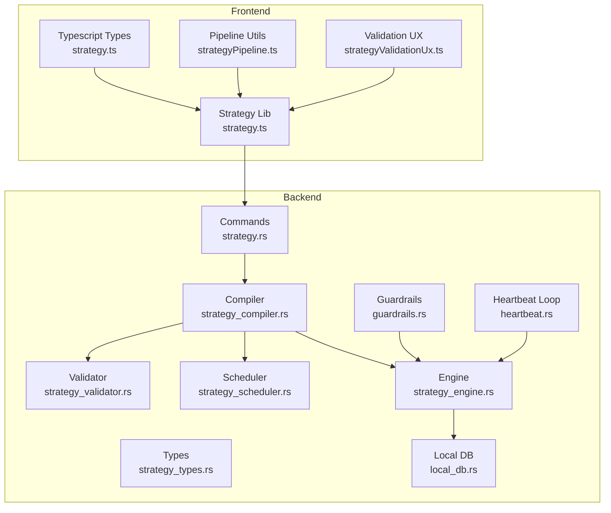
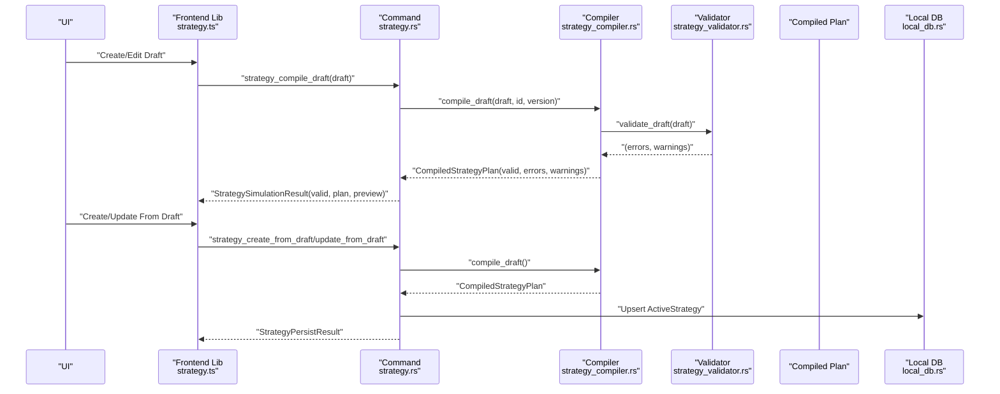
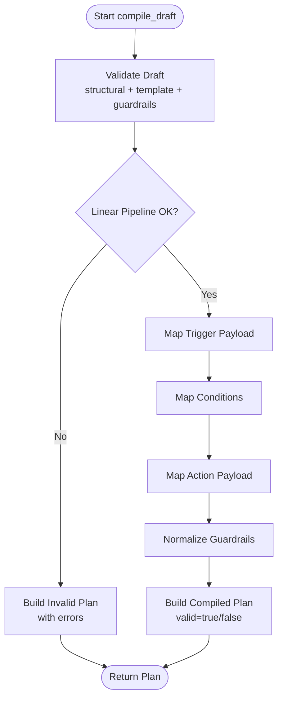
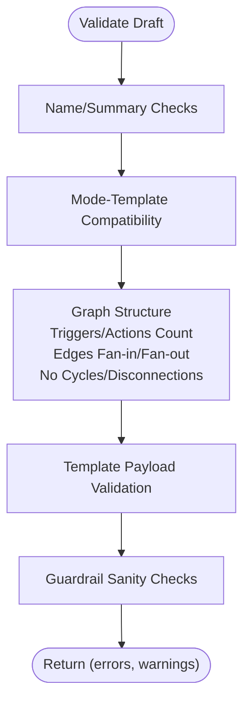
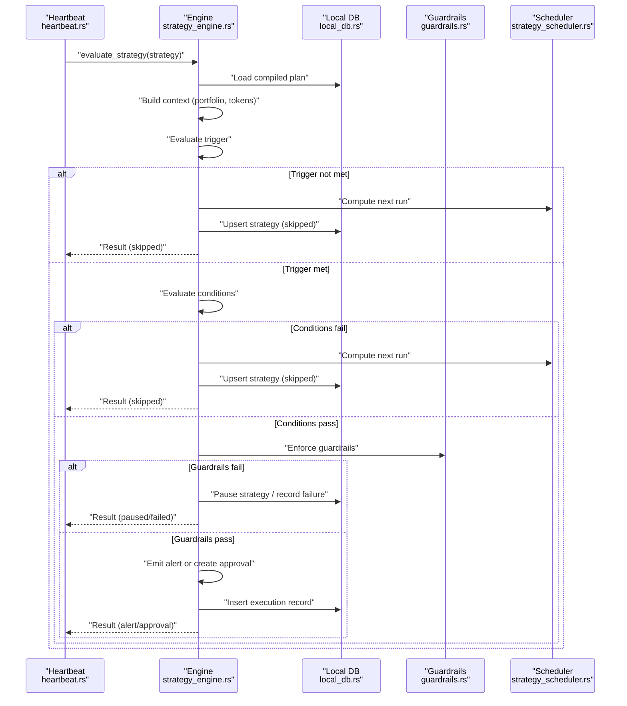
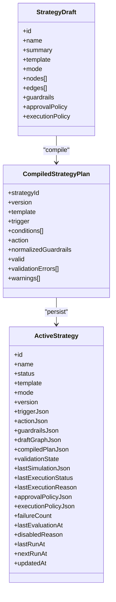
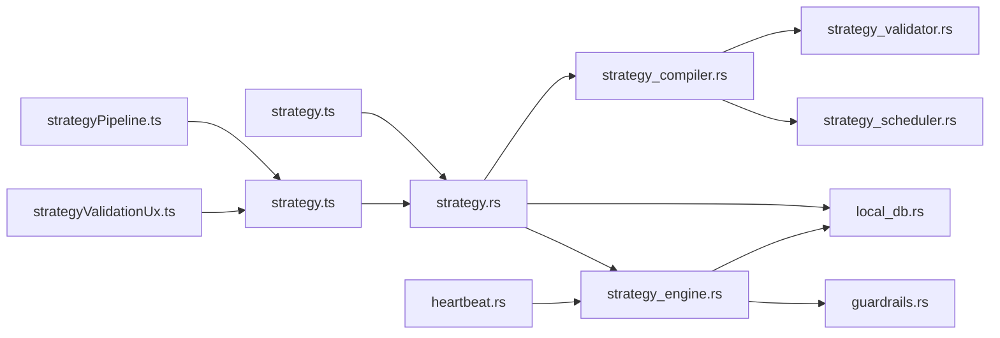

# Strategy Engine & Execution Services

<cite>
**Referenced Files in This Document**
- [strategy.ts](file://src/types/strategy.ts)
- [strategy.ts](file://src/lib/strategy.ts)
- [strategyPipeline.ts](file://src/lib/strategyPipeline.ts)
- [strategyValidationUx.ts](file://src/lib/strategyValidationUx.ts)
- [strategy_compiler.rs](file://src-tauri/src/services/strategy_compiler.rs)
- [strategy_validator.rs](file://src-tauri/src/services/strategy_validator.rs)
- [strategy_types.rs](file://src-tauri/src/services/strategy_types.rs)
- [strategy_engine.rs](file://src-tauri/src/services/strategy_engine.rs)
- [strategy_scheduler.rs](file://src-tauri/src/services/strategy_scheduler.rs)
- [strategy.rs](file://src-tauri/src/commands/strategy.rs)
- [local_db.rs](file://src-tauri/src/services/local_db.rs)
- [guardrails.rs](file://src-tauri/src/services/guardrails.rs)
- [task_manager.rs](file://src-tauri/src/services/task_manager.rs)
- [heartbeat.rs](file://src-tauri/src/services/heartbeat.rs)
</cite>

## Table of Contents
1. [Introduction](#introduction)
2. [Project Structure](#project-structure)
3. [Core Components](#core-components)
4. [Architecture Overview](#architecture-overview)
5. [Detailed Component Analysis](#detailed-component-analysis)
6. [Dependency Analysis](#dependency-analysis)
7. [Performance Considerations](#performance-considerations)
8. [Troubleshooting Guide](#troubleshooting-guide)
9. [Conclusion](#conclusion)
10. [Appendices](#appendices)

## Introduction
This document explains the Strategy Engine and Execution Services architecture, focusing on:
- Strategy compilation from a visual draft to a runtime plan
- Validation and guardrails enforcement
- Runtime evaluation and execution orchestration
- Monitoring, logging, and error handling
- Relationship between strategy drafts, compiled plans, and active executions

## Project Structure
The strategy system spans TypeScript front-end libraries and Rust back-end services:
- Front-end TypeScript types and helpers define the strategy DSL and UI integration
- Rust services implement validation, compilation, scheduling, and runtime evaluation
- Commands bridge the UI and backend services
- Local database persists strategy state, approvals, and execution logs

**Diagram sources**
- [strategy.ts:1-258](file://src/types/strategy.ts#L1-L258)
- [strategy.ts:1-218](file://src/lib/strategy.ts#L1-L218)
- [strategyPipeline.ts:1-116](file://src/lib/strategyPipeline.ts#L1-L116)
- [strategyValidationUx.ts:1-67](file://src/lib/strategyValidationUx.ts#L1-L67)
- [strategy.rs:1-309](file://src-tauri/src/commands/strategy.rs#L1-L309)
- [strategy_compiler.rs:1-369](file://src-tauri/src/services/strategy_compiler.rs#L1-L369)
- [strategy_validator.rs:1-457](file://src-tauri/src/services/strategy_validator.rs#L1-L457)
- [strategy_types.rs:1-417](file://src-tauri/src/services/strategy_types.rs#L1-L417)
- [strategy_scheduler.rs:1-64](file://src-tauri/src/services/strategy_scheduler.rs#L1-L64)
- [strategy_engine.rs:1-726](file://src-tauri/src/services/strategy_engine.rs#L1-L726)
- [local_db.rs:1-800](file://src-tauri/src/services/local_db.rs#L1-L800)
- [guardrails.rs:1-620](file://src-tauri/src/services/guardrails.rs#L1-L620)
- [heartbeat.rs:33-60](file://src-tauri/src/services/heartbeat.rs#L33-L60)

**Section sources**
- [strategy.ts:1-258](file://src/types/strategy.ts#L1-L258)
- [strategy.ts:1-218](file://src/lib/strategy.ts#L1-L218)
- [strategyPipeline.ts:1-116](file://src/lib/strategyPipeline.ts#L1-L116)
- [strategyValidationUx.ts:1-67](file://src/lib/strategyValidationUx.ts#L1-L67)
- [strategy.rs:1-309](file://src-tauri/src/commands/strategy.rs#L1-L309)
- [strategy_compiler.rs:1-369](file://src-tauri/src/services/strategy_compiler.rs#L1-L369)
- [strategy_validator.rs:1-457](file://src-tauri/src/services/strategy_validator.rs#L1-L457)
- [strategy_types.rs:1-417](file://src-tauri/src/services/strategy_types.rs#L1-L417)
- [strategy_scheduler.rs:1-64](file://src-tauri/src/services/strategy_scheduler.rs#L1-L64)
- [strategy_engine.rs:1-726](file://src-tauri/src/services/strategy_engine.rs#L1-L726)
- [local_db.rs:1-800](file://src-tauri/src/services/local_db.rs#L1-L800)
- [guardrails.rs:1-620](file://src-tauri/src/services/guardrails.rs#L1-L620)
- [heartbeat.rs:33-60](file://src-tauri/src/services/heartbeat.rs#L33-L60)

## Core Components
- Strategy Draft: A JSON-serializable graph of nodes (trigger, condition, action) plus policies and guardrails. Defined in TypeScript and mirrored in Rust.
- Compiled Strategy Plan: A normalized, validated runtime representation derived from a draft.
- Validation: Structural, semantic, and guardrail checks performed before activation.
- Scheduler: Computes next-run timestamps based on trigger semantics.
- Engine: Evaluates strategies on heartbeat ticks, enforces guardrails, and emits approvals or alerts.
- Persistence: Strategies, approvals, executions, and audit logs stored in a local database.

**Section sources**
- [strategy_types.rs:226-417](file://src-tauri/src/services/strategy_types.rs#L226-L417)
- [strategy_compiler.rs:185-292](file://src-tauri/src/services/strategy_compiler.rs#L185-L292)
- [strategy_validator.rs:13-106](file://src-tauri/src/services/strategy_validator.rs#L13-L106)
- [strategy_scheduler.rs:8-36](file://src-tauri/src/services/strategy_scheduler.rs#L8-L36)
- [strategy_engine.rs:343-725](file://src-tauri/src/services/strategy_engine.rs#L343-L725)
- [local_db.rs:80-167](file://src-tauri/src/services/local_db.rs#L80-L167)

## Architecture Overview
The system converts a user-authored StrategyDraft into a CompiledStrategyPlan, validates it, and runs it continuously via heartbeat evaluation.

**Diagram sources**
- [strategy.ts:174-218](file://src/lib/strategy.ts#L174-L218)
- [strategy.rs:216-268](file://src-tauri/src/commands/strategy.rs#L216-L268)
- [strategy_compiler.rs:185-292](file://src-tauri/src/services/strategy_compiler.rs#L185-L292)
- [strategy_validator.rs:13-106](file://src-tauri/src/services/strategy_validator.rs#L13-L106)
- [local_db.rs:685-758](file://src-tauri/src/services/local_db.rs#L685-L758)

## Detailed Component Analysis

### Strategy Compilation Pipeline
- Draft normalization and guardrails defaults
- Linear pipeline validation (exactly one trigger → action, no cycles, no fan-out/fan-in violations)
- Template-specific payload validation
- Mapping of draft nodes to compiled triggers, conditions, and actions
- Final plan with validation errors/warnings and normalized guardrails

**Diagram sources**
- [strategy_compiler.rs:185-292](file://src-tauri/src/services/strategy_compiler.rs#L185-L292)
- [strategy_validator.rs:13-223](file://src-tauri/src/services/strategy_validator.rs#L13-L223)

**Section sources**
- [strategy_compiler.rs:120-292](file://src-tauri/src/services/strategy_compiler.rs#L120-L292)
- [strategy_validator.rs:13-223](file://src-tauri/src/services/strategy_validator.rs#L13-L223)
- [strategy_types.rs:244-355](file://src-tauri/src/services/strategy_types.rs#L244-L355)

### Strategy Validation System
- Name/summary length constraints
- Mode/template compatibility (e.g., pre-authorized with alert-only disallowed)
- Graph structure: exactly one trigger and one action, linear chain, no cycles
- Template payload correctness
- Guardrail sanity checks (positive amounts, sane slippage, non-empty allowlists)

**Diagram sources**
- [strategy_validator.rs:13-106](file://src-tauri/src/services/strategy_validator.rs#L13-L106)

**Section sources**
- [strategy_validator.rs:108-340](file://src-tauri/src/services/strategy_validator.rs#L108-L340)
- [strategyValidationUx.ts:8-39](file://src/lib/strategyValidationUx.ts#L8-L39)

### Runtime Execution Environment
- Heartbeat loop evaluates active strategies
- Context builds portfolio totals and token balances
- Trigger evaluation (time-based, drift threshold, threshold)
- Condition evaluation (portfolio floor, gas, slippage, wallet availability, cooldown, drift minimum)
- Guardrail enforcement (trade size, allowed chains, min portfolio)
- Approval creation for actions requiring authorization
- Alert emission for monitor-only or alert-only strategies
- Execution record persistence and audit logging

**Diagram sources**
- [heartbeat.rs:33-60](file://src-tauri/src/services/heartbeat.rs#L33-L60)
- [strategy_engine.rs:343-725](file://src-tauri/src/services/strategy_engine.rs#L343-L725)
- [strategy_scheduler.rs:8-36](file://src-tauri/src/services/strategy_scheduler.rs#L8-L36)
- [guardrails.rs:277-426](file://src-tauri/src/services/guardrails.rs#L277-L426)
- [local_db.rs:685-758](file://src-tauri/src/services/local_db.rs#L685-L758)

**Section sources**
- [strategy_engine.rs:39-96](file://src-tauri/src/services/strategy_engine.rs#L39-L96)
- [strategy_engine.rs:120-255](file://src-tauri/src/services/strategy_engine.rs#L120-L255)
- [strategy_engine.rs:267-499](file://src-tauri/src/services/strategy_engine.rs#L267-L499)
- [strategy_engine.rs:505-725](file://src-tauri/src/services/strategy_engine.rs#L505-L725)
- [guardrails.rs:277-426](file://src-tauri/src/services/guardrails.rs#L277-L426)
- [local_db.rs:155-167](file://src-tauri/src/services/local_db.rs#L155-L167)

### Strategy Templates and Guardrails
- Templates: DCA Buy, Rebalance To Target, Alert Only
- Guardrails: per-trade/daily limits, slippage, gas, allowed chains, portfolio floor, cooldown
- UI defaults and normalization ensure safe baseline behavior

**Section sources**
- [strategy_types.rs:29-33](file://src-tauri/src/services/strategy_types.rs#L29-L33)
- [strategy_compiler.rs:120-144](file://src-tauri/src/services/strategy_compiler.rs#L120-L144)
- [strategy.ts:13-51](file://src/lib/strategy.ts#L13-L51)
- [strategy_validator.rs:294-340](file://src-tauri/src/services/strategy_validator.rs#L294-L340)

### Execution Logging and Monitoring
- StrategyExecutionRecord captures status, reason, approval/tool association, and evaluation payload
- Audit logging tracks strategy lifecycle events and guardrail violations
- Execution history endpoint returns recent runs for monitoring

**Section sources**
- [strategy_engine.rs:267-287](file://src-tauri/src/services/strategy_engine.rs#L267-L287)
- [strategy.rs:286-309](file://src-tauri/src/commands/strategy.rs#L286-L309)
- [local_db.rs:155-167](file://src-tauri/src/services/local_db.rs#L155-L167)

### Relationship Between Drafts, Plans, and Active Executions
- Draft: Author-time graph and policies
- Compiled Plan: Validated runtime form with normalized guardrails
- Active Strategy: Persisted state including draft, compiled plan, and scheduling fields

**Diagram sources**
- [strategy_types.rs:226-417](file://src-tauri/src/services/strategy_types.rs#L226-L417)
- [strategy_compiler.rs:185-292](file://src-tauri/src/services/strategy_compiler.rs#L185-L292)
- [strategy.rs:126-214](file://src-tauri/src/commands/strategy.rs#L126-L214)

**Section sources**
- [strategy_compiler.rs:185-292](file://src-tauri/src/services/strategy_compiler.rs#L185-L292)
- [strategy.rs:126-214](file://src-tauri/src/commands/strategy.rs#L126-L214)
- [local_db.rs:80-106](file://src-tauri/src/services/local_db.rs#L80-L106)

## Dependency Analysis
Key dependencies and interactions:
- Front-end types and helpers depend on backend strategy types
- Commands orchestrate compiler and validator, then persist ActiveStrategy
- Engine depends on scheduler, guardrails, and local DB
- Heartbeat invokes engine for all active strategies

**Diagram sources**
- [strategy.ts:1-258](file://src/types/strategy.ts#L1-L258)
- [strategy.ts:1-218](file://src/lib/strategy.ts#L1-L218)
- [strategyPipeline.ts:1-116](file://src/lib/strategyPipeline.ts#L1-L116)
- [strategyValidationUx.ts:1-67](file://src/lib/strategyValidationUx.ts#L1-L67)
- [strategy.rs:1-309](file://src-tauri/src/commands/strategy.rs#L1-L309)
- [strategy_compiler.rs:1-369](file://src-tauri/src/services/strategy_compiler.rs#L1-L369)
- [strategy_validator.rs:1-457](file://src-tauri/src/services/strategy_validator.rs#L1-L457)
- [strategy_scheduler.rs:1-64](file://src-tauri/src/services/strategy_scheduler.rs#L1-L64)
- [strategy_engine.rs:1-726](file://src-tauri/src/services/strategy_engine.rs#L1-L726)
- [guardrails.rs:1-620](file://src-tauri/src/services/guardrails.rs#L1-L620)
- [local_db.rs:1-800](file://src-tauri/src/services/local_db.rs#L1-L800)
- [heartbeat.rs:33-60](file://src-tauri/src/services/heartbeat.rs#L33-L60)

**Section sources**
- [strategy_compiler.rs:1-11](file://src-tauri/src/services/strategy_compiler.rs#L1-L11)
- [strategy_engine.rs:1-19](file://src-tauri/src/services/strategy_engine.rs#L1-L19)
- [strategy.rs:1-13](file://src-tauri/src/commands/strategy.rs#L1-L13)

## Performance Considerations
- Keep condition chains short to minimize evaluation overhead
- Use drift thresholds judiciously to avoid frequent evaluations
- Prefer monitor-only for low-frequency notifications to reduce approval traffic
- Guardrails checks are lightweight; place expensive checks (e.g., slippage estimation) behind approvals
- Persist and reuse evaluation context to avoid repeated DB reads

[No sources needed since this section provides general guidance]

## Troubleshooting Guide
Common issues and resolutions:
- Strategy fails to compile: Review validation errors/warnings returned by the compiler; fix structural or template mismatches
- Strategy not triggering: Verify next_run_at and trigger evaluation; check portfolio snapshot freshness
- Excessive guardrail failures: Adjust normalized guardrails (e.g., increase max_per_trade_usd)
- Kill switch active: Emergency kill switch blocks all autonomous actions; deactivate via guardrails service
- Execution history missing: Confirm records are inserted and queried with appropriate filters

**Section sources**
- [strategy_compiler.rs:190-222](file://src-tauri/src/services/strategy_compiler.rs#L190-L222)
- [strategy_engine.rs:403-434](file://src-tauri/src/services/strategy_engine.rs#L403-L434)
- [guardrails.rs:232-275](file://src-tauri/src/services/guardrails.rs#L232-L275)
- [strategy.rs:286-309](file://src-tauri/src/commands/strategy.rs#L286-L309)

## Conclusion
The Strategy Engine provides a robust framework for transforming user-defined automation into safe, auditable, and continuously evaluated runtime plans. Its layered validation, guardrails, and heartbeat-driven execution ensure reliability and transparency across diverse market conditions.

[No sources needed since this section summarizes without analyzing specific files]

## Appendices

### Example Workflows

- Strategy Compilation Workflow
  - Author a draft with nodes and edges
  - Call compile API to receive a simulation result
  - Fix validation errors and recompile until valid

  **Section sources**
  - [strategy.ts:174-178](file://src/lib/strategy.ts#L174-L178)
  - [strategy.rs:216-227](file://src-tauri/src/commands/strategy.rs#L216-L227)

- Execution Monitoring
  - Retrieve execution history to inspect statuses and reasons
  - Observe emitted alerts and approval requests

  **Section sources**
  - [strategy.ts:207-213](file://src/lib/strategy.ts#L207-L213)
  - [strategy.rs:286-309](file://src-tauri/src/commands/strategy.rs#L286-L309)
  - [strategy_engine.rs:331-341](file://src-tauri/src/services/strategy_engine.rs#L331-L341)

- Error Handling
  - Validation errors prevent activation
  - Runtime failures increment failure_count and may auto-pause
  - Guardrail violations are logged and can trigger kill switch

  **Section sources**
  - [strategy_validator.rs:13-106](file://src-tauri/src/services/strategy_validator.rs#L13-L106)
  - [strategy_engine.rs:44-60](file://src-tauri/src/services/strategy_engine.rs#L44-L60)
  - [guardrails.rs:285-294](file://src-tauri/src/services/guardrails.rs#L285-L294)

### Strategy Template Reference
- DCA Buy: Time-interval trigger with a recurring buy action
- Rebalance To Target: Time or drift-triggered rebalance to target allocations
- Alert Only: Threshold-based or monitor-only alert emission

**Section sources**
- [strategy_types.rs:29-33](file://src-tauri/src/services/strategy_types.rs#L29-L33)
- [strategy_compiler.rs:225-291](file://src-tauri/src/services/strategy_compiler.rs#L225-L291)
- [strategy.ts:13-172](file://src/lib/strategy.ts#L13-L172)

### Guardrails Enforcement
- Portfolio floor, max single transaction, allowed chains, blocked tokens/protocols, execution windows, approval thresholds, slippage limits
- Kill switch blocks all autonomous actions

**Section sources**
- [strategy_types.rs:169-190](file://src-tauri/src/services/strategy_types.rs#L169-L190)
- [guardrails.rs:277-426](file://src-tauri/src/services/guardrails.rs#L277-L426)
- [guardrails.rs:232-275](file://src-tauri/src/services/guardrails.rs#L232-L275)

### Task Management Integration
- Proactive tasks can complement strategies; tasks are validated against guardrails before approval

**Section sources**
- [task_manager.rs:445-481](file://src-tauri/src/services/task_manager.rs#L445-L481)