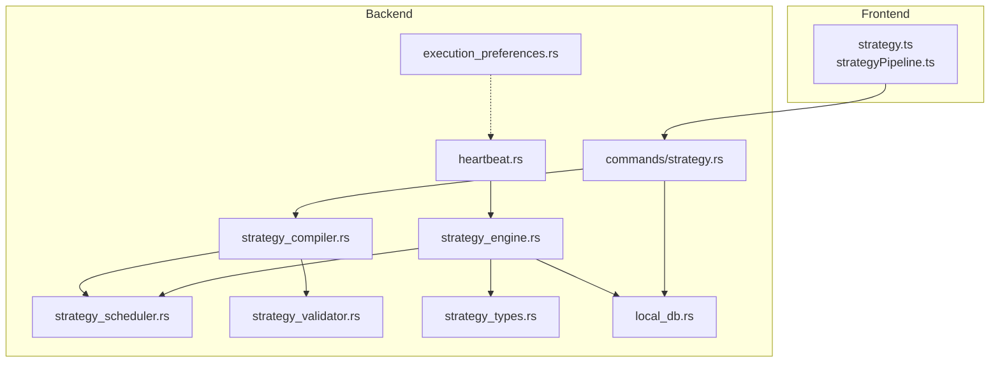
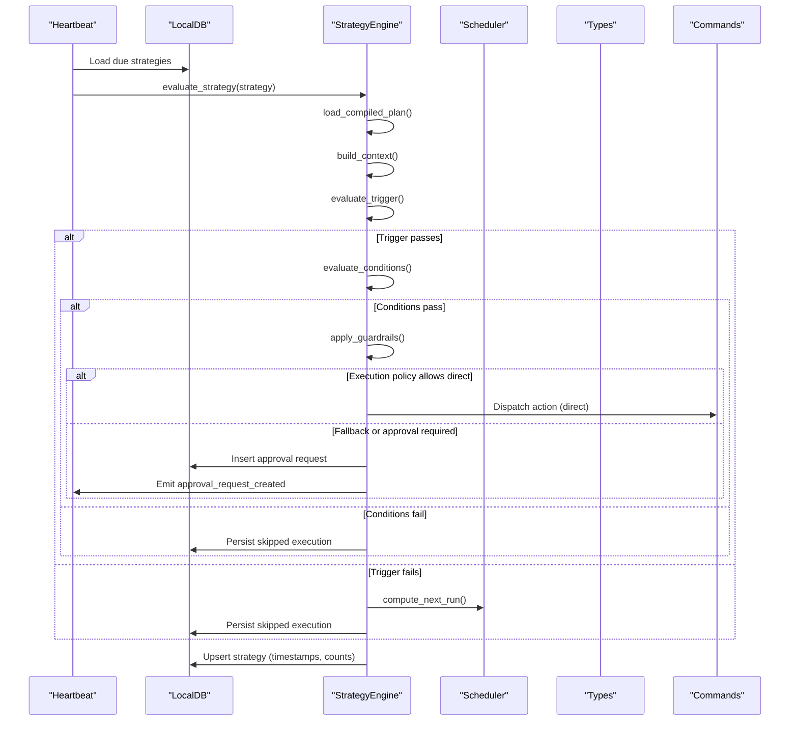
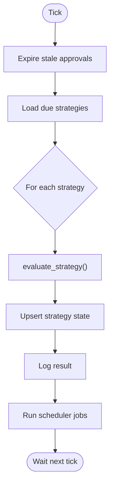
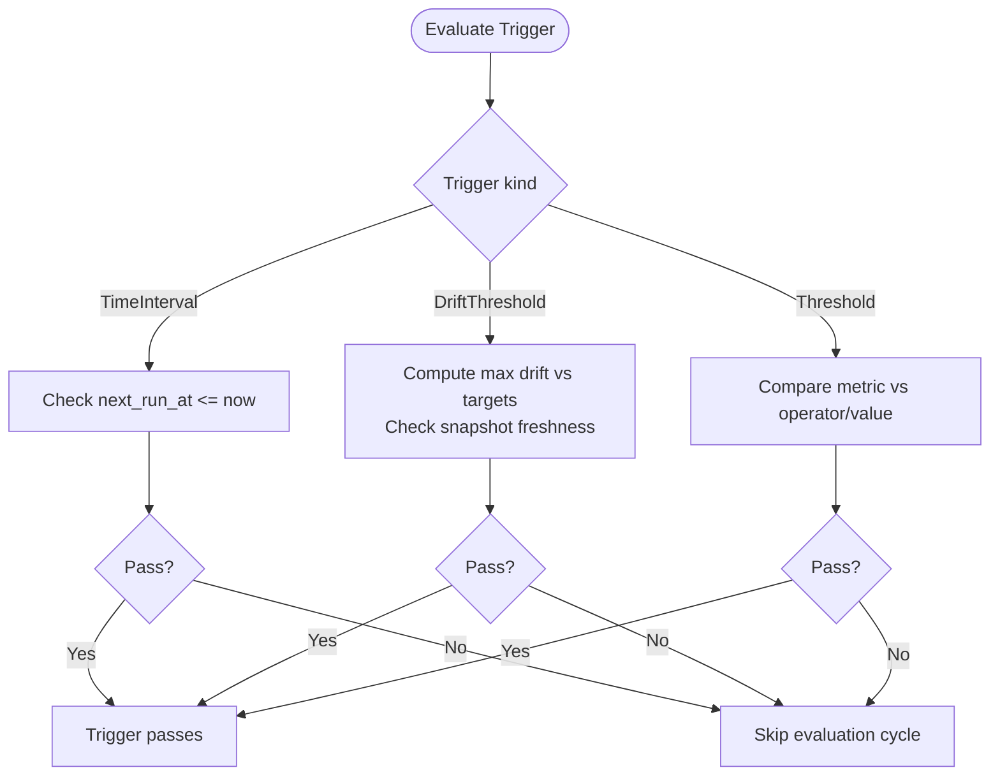
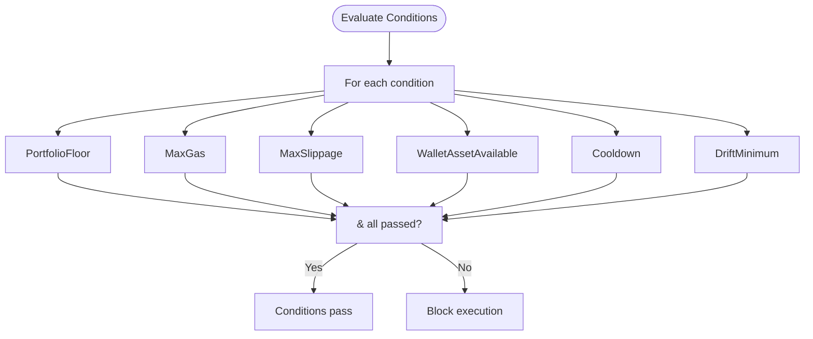
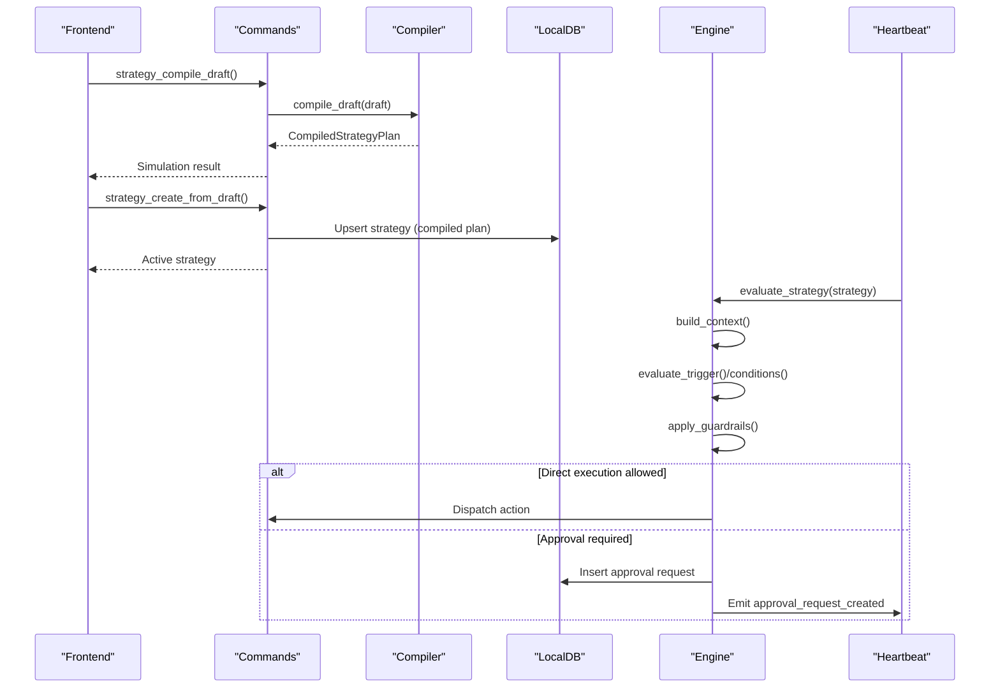
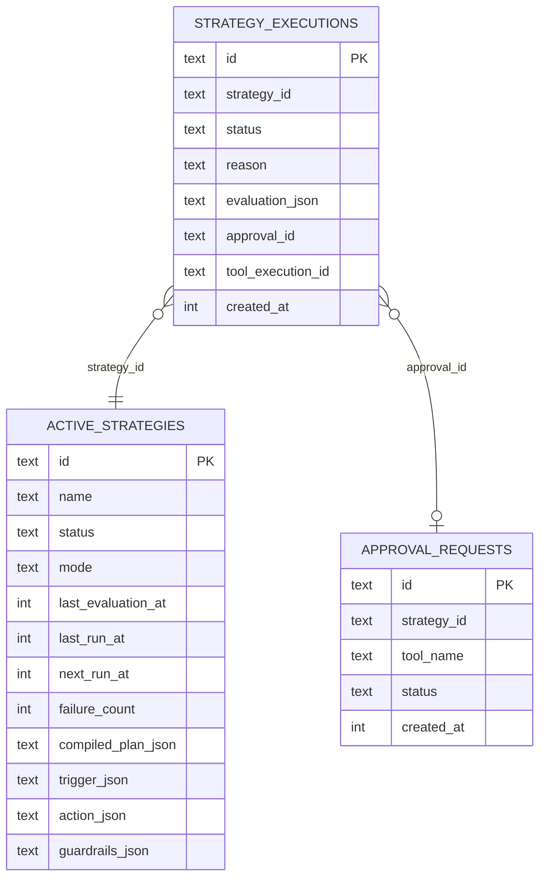
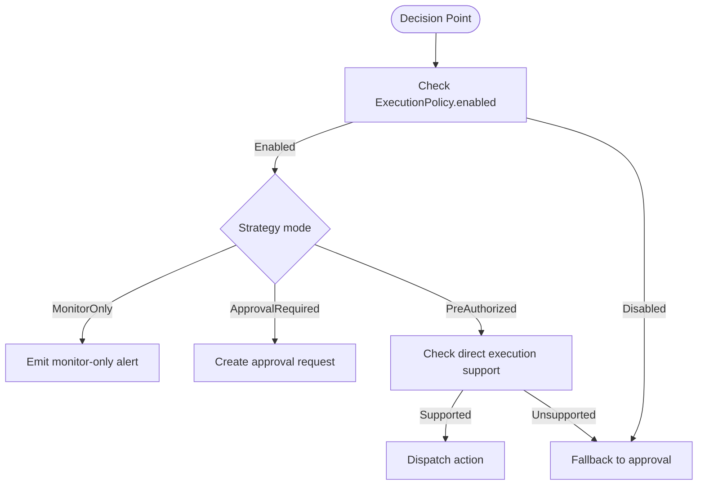

# Strategy Execution Engine

<cite>
**Referenced Files in This Document**
- [strategy_engine.rs](file://src-tauri/src/services/strategy_engine.rs)
- [heartbeat.rs](file://src-tauri/src/services/heartbeat.rs)
- [strategy_scheduler.rs](file://src-tauri/src/services/strategy_scheduler.rs)
- [strategy_compiler.rs](file://src-tauri/src/services/strategy_compiler.rs)
- [strategy_validator.rs](file://src-tauri/src/services/strategy_validator.rs)
- [strategy_types.rs](file://src-tauri/src/services/strategy_types.rs)
- [execution_preferences.rs](file://src-tauri/src/services/execution_preferences.rs)
- [strategy.ts](file://src/lib/strategy.ts)
- [strategyPipeline.ts](file://src/lib/strategyPipeline.ts)
- [strategy.rs](file://src-tauri/src/commands/strategy.rs)
- [local_db.rs](file://src-tauri/src/services/local_db.rs)
</cite>

## Table of Contents
1. [Introduction](#introduction)
2. [Project Structure](#project-structure)
3. [Core Components](#core-components)
4. [Architecture Overview](#architecture-overview)
5. [Detailed Component Analysis](#detailed-component-analysis)
6. [Dependency Analysis](#dependency-analysis)
7. [Performance Considerations](#performance-considerations)
8. [Troubleshooting Guide](#troubleshooting-guide)
9. [Conclusion](#conclusion)

## Introduction
This document explains the strategy execution engine architecture that powers heartbeat-driven automation. It covers the heartbeat-driven evaluation system, trigger evaluation logic, condition assessment, execution workflow (activation, context building, action dispatching), execution monitoring, error handling, execution policies and approval workflows, direct execution capabilities, and performance characteristics including parallelism and resource management. It also clarifies how evaluation results feed execution logs and system state updates.

## Project Structure
The strategy execution engine spans both the frontend and backend:
- Frontend TypeScript helpers orchestrate strategy creation, compilation, and execution history retrieval.
- Backend Rust services implement the heartbeat, strategy compiler, validator, scheduler, engine, and persistence.



**Diagram sources**
- [strategy.ts:174-218](file://src/lib/strategy.ts#L174-L218)
- [strategyPipeline.ts:8-39](file://src/lib/strategyPipeline.ts#L8-L39)
- [heartbeat.rs:10-75](file://src-tauri/src/services/heartbeat.rs#L10-L75)
- [strategy_scheduler.rs:8-36](file://src-tauri/src/services/strategy_scheduler.rs#L8-L36)
- [strategy_compiler.rs:185-292](file://src-tauri/src/services/strategy_compiler.rs#L185-L292)
- [strategy_validator.rs:13-106](file://src-tauri/src/services/strategy_validator.rs#L13-L106)
- [strategy_types.rs:226-355](file://src-tauri/src/services/strategy_types.rs#L226-L355)
- [strategy_engine.rs:343-725](file://src-tauri/src/services/strategy_engine.rs#L343-L725)
- [strategy.rs:216-309](file://src-tauri/src/commands/strategy.rs#L216-L309)
- [local_db.rs:80-167](file://src-tauri/src/services/local_db.rs#L80-L167)
- [execution_preferences.rs:17-71](file://src-tauri/src/services/execution_preferences.rs#L17-L71)

**Section sources**
- [strategy.ts:1-218](file://src/lib/strategy.ts#L1-L218)
- [strategyPipeline.ts:1-116](file://src/lib/strategyPipeline.ts#L1-L116)
- [heartbeat.rs:10-75](file://src-tauri/src/services/heartbeat.rs#L10-L75)
- [strategy_scheduler.rs:8-36](file://src-tauri/src/services/strategy_scheduler.rs#L8-L36)
- [strategy_compiler.rs:185-292](file://src-tauri/src/services/strategy_compiler.rs#L185-L292)
- [strategy_validator.rs:13-106](file://src-tauri/src/services/strategy_validator.rs#L13-L106)
- [strategy_types.rs:226-355](file://src-tauri/src/services/strategy_types.rs#L226-L355)
- [strategy_engine.rs:343-725](file://src-tauri/src/services/strategy_engine.rs#L343-L725)
- [strategy.rs:216-309](file://src-tauri/src/commands/strategy.rs#L216-L309)
- [local_db.rs:80-167](file://src-tauri/src/services/local_db.rs#L80-L167)
- [execution_preferences.rs:17-71](file://src-tauri/src/services/execution_preferences.rs#L17-L71)

## Core Components
- Heartbeat: Periodic tick that loads due strategies and evaluates them.
- Strategy Compiler: Converts a StrategyDraft into a CompiledStrategyPlan.
- Validator: Enforces structural and semantic constraints on drafts.
- Scheduler: Computes next-run timestamps for triggers.
- Engine: Evaluates triggers and conditions, applies guardrails, and dispatches actions or approvals.
- Commands: Tauri commands for compile/create/update/get/history.
- Persistence: Local database for strategies, executions, approvals, and audit logs.
- Execution Preferences: Controls when strategies are evaluated based on app state and user preferences.

**Section sources**
- [heartbeat.rs:10-75](file://src-tauri/src/services/heartbeat.rs#L10-L75)
- [strategy_compiler.rs:185-292](file://src-tauri/src/services/strategy_compiler.rs#L185-L292)
- [strategy_validator.rs:13-106](file://src-tauri/src/services/strategy_validator.rs#L13-L106)
- [strategy_scheduler.rs:8-36](file://src-tauri/src/services/strategy_scheduler.rs#L8-L36)
- [strategy_engine.rs:343-725](file://src-tauri/src/services/strategy_engine.rs#L343-L725)
- [strategy.rs:216-309](file://src-tauri/src/commands/strategy.rs#L216-L309)
- [local_db.rs:80-167](file://src-tauri/src/services/local_db.rs#L80-L167)
- [execution_preferences.rs:17-71](file://src-tauri/src/services/execution_preferences.rs#L17-L71)

## Architecture Overview
The engine runs on a 60-second heartbeat. Each tick:
- Loads due strategies from persistent storage.
- Compiles their draft into a plan if needed.
- Builds an evaluation context (portfolio value, balances, snapshots).
- Evaluates the trigger and conditions.
- Applies guardrails and execution policy.
- Emits alerts, creates approvals, or executes actions depending on mode and policy.
- Persists execution records and updates strategy state.



**Diagram sources**
- [heartbeat.rs:25-71](file://src-tauri/src/services/heartbeat.rs#L25-L71)
- [strategy_engine.rs:343-725](file://src-tauri/src/services/strategy_engine.rs#L343-L725)
- [strategy_scheduler.rs:8-36](file://src-tauri/src/services/strategy_scheduler.rs#L8-L36)
- [strategy.rs:216-309](file://src-tauri/src/commands/strategy.rs#L216-L309)
- [local_db.rs:918-935](file://src-tauri/src/services/local_db.rs#L918-L935)

## Detailed Component Analysis

### Heartbeat-driven Evaluation System
- Tick interval: 60 seconds.
- Responsibilities:
  - Expire stale approvals.
  - Load strategies whose next_run_at is due.
  - Invoke the engine for each strategy.
  - Update strategy state and log failures with auto-pause after consecutive errors.
  - Run scheduler jobs.



**Diagram sources**
- [heartbeat.rs:10-75](file://src-tauri/src/services/heartbeat.rs#L10-L75)

**Section sources**
- [heartbeat.rs:10-75](file://src-tauri/src/services/heartbeat.rs#L10-L75)

### Trigger Evaluation Logic
Triggers are derived from the compiled plan’s StrategyTrigger:
- TimeInterval: next run computed from interval (hourly/daily/weekly/monthly) or a fixed offset.
- DriftThreshold: computes observed drift against target allocations; skips if portfolio snapshot is too old.
- Threshold: compares a metric (e.g., portfolio_value_usd) against configured operator/value.



**Diagram sources**
- [strategy_engine.rs:120-159](file://src-tauri/src/services/strategy_engine.rs#L120-L159)
- [strategy_scheduler.rs:8-36](file://src-tauri/src/services/strategy_scheduler.rs#L8-L36)

**Section sources**
- [strategy_engine.rs:120-159](file://src-tauri/src/services/strategy_engine.rs#L120-L159)
- [strategy_scheduler.rs:8-36](file://src-tauri/src/services/strategy_scheduler.rs#L8-L36)

### Condition Assessment Mechanisms
Conditions are evaluated in order and must all pass:
- PortfolioFloor: total portfolio USD meets minimum.
- MaxGas: estimated gas cost for action ≤ configured cap.
- MaxSlippage: configured slippage ≤ configured cap.
- WalletAssetAvailable: sum of token balances ≥ minimum.
- Cooldown: last run was sufficiently long ago.
- DriftMinimum: observed drift ≥ minimum (only applicable for rebalance).

Results are summarized for logging and UI previews.



**Diagram sources**
- [strategy_engine.rs:169-255](file://src-tauri/src/services/strategy_engine.rs#L169-L255)

**Section sources**
- [strategy_engine.rs:169-255](file://src-tauri/src/services/strategy_engine.rs#L169-L255)

### Execution Workflow: Activation, Context Building, and Action Dispatching
- Activation: Drafts are compiled into CompiledStrategyPlan via compile_draft and validated by validate_draft. The resulting plan is persisted with the strategy.
- Context building: The engine constructs an EvalContext containing portfolio totals, token balances, and snapshot age.
- Action dispatching:
  - AlertOnly: emits UI alerts and brief notifications.
  - DcaBuy/RebalanceToTarget: either emits monitor-only alerts or creates approval requests depending on mode and execution policy.
  - Direct execution: Not implemented for native EVM actions in this engine; fallback to approvals is enforced when direct execution is unavailable.



**Diagram sources**
- [strategy.rs:216-309](file://src-tauri/src/commands/strategy.rs#L216-L309)
- [strategy_compiler.rs:185-292](file://src-tauri/src/services/strategy_compiler.rs#L185-L292)
- [strategy_engine.rs:343-725](file://src-tauri/src/services/strategy_engine.rs#L343-L725)
- [heartbeat.rs:33-69](file://src-tauri/src/services/heartbeat.rs#L33-L69)
- [local_db.rs:918-935](file://src-tauri/src/services/local_db.rs#L918-L935)

**Section sources**
- [strategy.rs:216-309](file://src-tauri/src/commands/strategy.rs#L216-L309)
- [strategy_compiler.rs:185-292](file://src-tauri/src/services/strategy_compiler.rs#L185-L292)
- [strategy_engine.rs:343-725](file://src-tauri/src/services/strategy_engine.rs#L343-L725)
- [heartbeat.rs:33-69](file://src-tauri/src/services/heartbeat.rs#L33-L69)
- [local_db.rs:918-935](file://src-tauri/src/services/local_db.rs#L918-L935)

### Execution Monitoring and Logs
- StrategyExecutionRecord captures each evaluation outcome with status, reason, and optional approval/tool execution linkage.
- Strategy state fields track last evaluation/run timestamps, failure count, and next run computation.
- Audit logs record strategy lifecycle events and approvals.



**Diagram sources**
- [local_db.rs:155-167](file://src-tauri/src/services/local_db.rs#L155-L167)
- [strategy_engine.rs:267-287](file://src-tauri/src/services/strategy_engine.rs#L267-L287)

**Section sources**
- [strategy_engine.rs:267-287](file://src-tauri/src/services/strategy_engine.rs#L267-L287)
- [local_db.rs:155-167](file://src-tauri/src/services/local_db.rs#L155-L167)

### Error Handling and Auto-Pause
- On evaluation failure, the engine increments failure_count and may auto-pause the strategy after three consecutive failures, recording an audit event.
- Skipped evaluations persist execution records with reasons (e.g., stale snapshot, conditions failed, chain not allowed).

**Section sources**
- [heartbeat.rs:44-68](file://src-tauri/src/services/heartbeat.rs#L44-L68)
- [strategy_engine.rs:403-434](file://src-tauri/src/services/strategy_engine.rs#L403-L434)

### Execution Policy System, Approval Workflows, and Direct Execution
- ExecutionPolicy controls whether direct execution is enabled and whether to fall back to approvals.
- ApprovalRequest is inserted with payload, simulation metadata, and expiration; UI can approve and trigger tool execution.
- Direct execution for native EVM actions is not implemented in this engine; when direct execution is unavailable, the engine falls back to approvals.



**Diagram sources**
- [strategy_engine.rs:572-620](file://src-tauri/src/services/strategy_engine.rs#L572-L620)
- [strategy_engine.rs:683-722](file://src-tauri/src/services/strategy_engine.rs#L683-L722)
- [strategy_types.rs:203-224](file://src-tauri/src/services/strategy_types.rs#L203-L224)

**Section sources**
- [strategy_engine.rs:572-620](file://src-tauri/src/services/strategy_engine.rs#L572-L620)
- [strategy_engine.rs:683-722](file://src-tauri/src/services/strategy_engine.rs#L683-L722)
- [strategy_types.rs:203-224](file://src-tauri/src/services/strategy_types.rs#L203-L224)

### Relationship Between Evaluation Results, Execution Logs, and System State Updates
- EvaluationResult drives strategy state updates (timestamps, counts, next_run_at).
- Execution logs capture detailed evaluation previews and outcomes.
- System state updates include pausing strategies on repeated failures and updating last_execution_status/reason.

**Section sources**
- [strategy_engine.rs:351-401](file://src-tauri/src/services/strategy_engine.rs#L351-L401)
- [strategy_engine.rs:501-535](file://src-tauri/src/services/strategy_engine.rs#L501-L535)
- [heartbeat.rs:44-68](file://src-tauri/src/services/heartbeat.rs#L44-L68)

## Dependency Analysis
Key dependencies and coupling:
- heartbeat depends on strategy_engine and scheduler.
- strategy_engine depends on types, scheduler, local_db, and emits UI events.
- commands depend on compiler and validator to materialize strategies.
- execution_preferences influences when heartbeat evaluates strategies.

```mermaid
graph LR
HB["heartbeat.rs"] --> ENG["strategy_engine.rs"]
ENG --> SCHED["strategy_scheduler.rs"]
ENG --> TYPES["strategy_types.rs"]
ENG --> DB["local_db.rs"]
CMDS["commands/strategy.rs"] --> COMP["strategy_compiler.rs"]
COMP --> VALID["strategy_validator.rs"]
CMDS --> DB
PREF["execution_preferences.rs"] -.controls. HB
```

**Diagram sources**
- [heartbeat.rs:10-75](file://src-tauri/src/services/heartbeat.rs#L10-L75)
- [strategy_engine.rs:343-725](file://src-tauri/src/services/strategy_engine.rs#L343-L725)
- [strategy_scheduler.rs:8-36](file://src-tauri/src/services/strategy_scheduler.rs#L8-L36)
- [strategy_compiler.rs:185-292](file://src-tauri/src/services/strategy_compiler.rs#L185-L292)
- [strategy_validator.rs:13-106](file://src-tauri/src/services/strategy_validator.rs#L13-L106)
- [strategy.rs:216-309](file://src-tauri/src/commands/strategy.rs#L216-L309)
- [local_db.rs:80-167](file://src-tauri/src/services/local_db.rs#L80-L167)
- [execution_preferences.rs:34-53](file://src-tauri/src/services/execution_preferences.rs#L34-L53)

**Section sources**
- [heartbeat.rs:10-75](file://src-tauri/src/services/heartbeat.rs#L10-L75)
- [strategy_engine.rs:343-725](file://src-tauri/src/services/strategy_engine.rs#L343-L725)
- [strategy_compiler.rs:185-292](file://src-tauri/src/services/strategy_compiler.rs#L185-L292)
- [strategy_validator.rs:13-106](file://src-tauri/src/services/strategy_validator.rs#L13-L106)
- [strategy.rs:216-309](file://src-tauri/src/commands/strategy.rs#L216-L309)
- [local_db.rs:80-167](file://src-tauri/src/services/local_db.rs#L80-L167)
- [execution_preferences.rs:34-53](file://src-tauri/src/services/execution_preferences.rs#L34-L53)

## Performance Considerations
- Tick cadence: 60 seconds provides coarse-grained periodicity suitable for off-chain automation.
- Linear pipeline assumption: The compiler enforces a single trigger-to-action chain, simplifying evaluation and reducing branching overhead.
- Guardrail early exits: Exceeding max_per_trade or failing chain/portfolio checks short-circuits execution to avoid unnecessary work.
- Snapshot freshness: DriftThreshold evaluation is skipped if portfolio snapshots are stale, preventing costly recomputations on outdated data.
- No explicit parallelization: The heartbeat iterates strategies sequentially; consider batching or concurrency if strategy counts grow substantially.
- Estimated gas: A small constant-time estimate avoids heavy computations for MaxGas checks.

[No sources needed since this section provides general guidance]

## Troubleshooting Guide
Common issues and diagnostics:
- Stale portfolio snapshot: DriftThreshold triggers are skipped; ensure portfolio sync is healthy.
- Validation errors: Strategies with invalid plans cannot be activated; inspect validation errors/warnings from the compiled plan.
- Auto-pause on failures: If a strategy repeatedly fails, it may be auto-paused; check failure_count and disabled_reason.
- Approval timeouts/expirations: Approvals created by the engine expire after a fixed window; re-evaluation will create a new approval request.
- Execution logs: Review StrategyExecutionRecord entries for status, reason, and approval linkage.

**Section sources**
- [strategy_engine.rs:135-137](file://src-tauri/src/services/strategy_engine.rs#L135-L137)
- [strategy_engine.rs:403-434](file://src-tauri/src/services/strategy_engine.rs#L403-L434)
- [heartbeat.rs:44-68](file://src-tauri/src/services/heartbeat.rs#L44-L68)
- [local_db.rs:937-966](file://src-tauri/src/services/local_db.rs#L937-L966)

## Conclusion
The strategy execution engine is a heartbeat-driven system that compiles user-defined strategies into executable plans, evaluates triggers and conditions under guardrails, and coordinates approvals or direct actions. It persists comprehensive execution logs and maintains robust state transitions, including auto-pause on repeated failures. The design emphasizes simplicity (linear pipelines), safety (guardrails and approvals), and observability (logs and audit trails). Future enhancements could include parallel evaluation and dynamic scheduling adjustments to scale with higher strategy volumes.