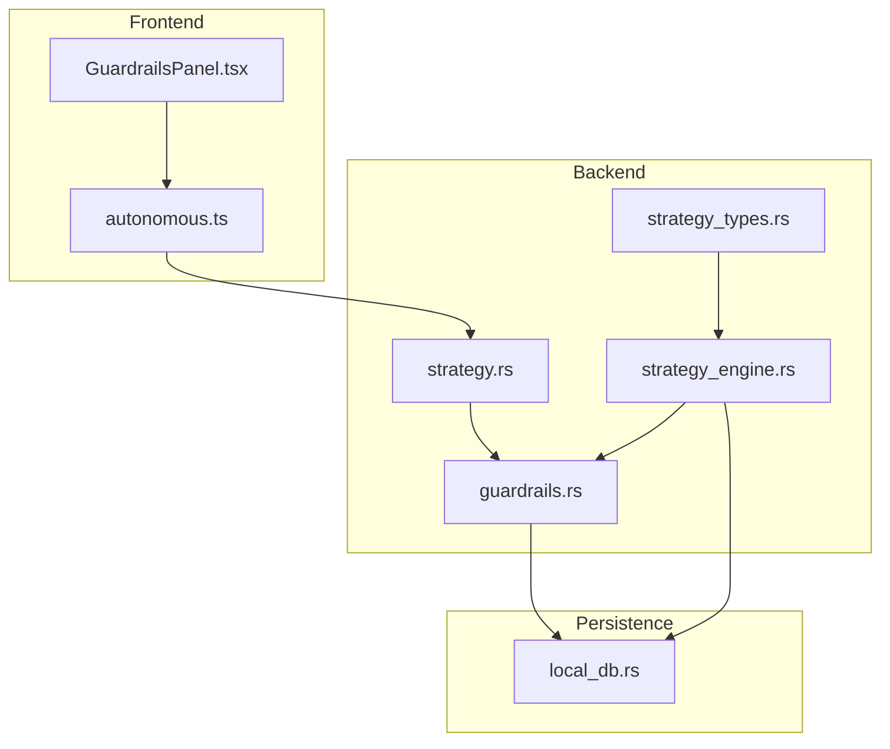
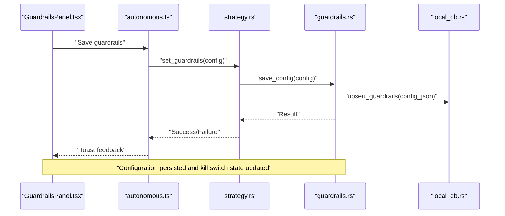
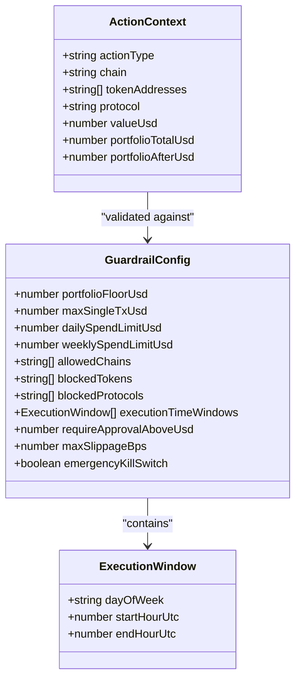
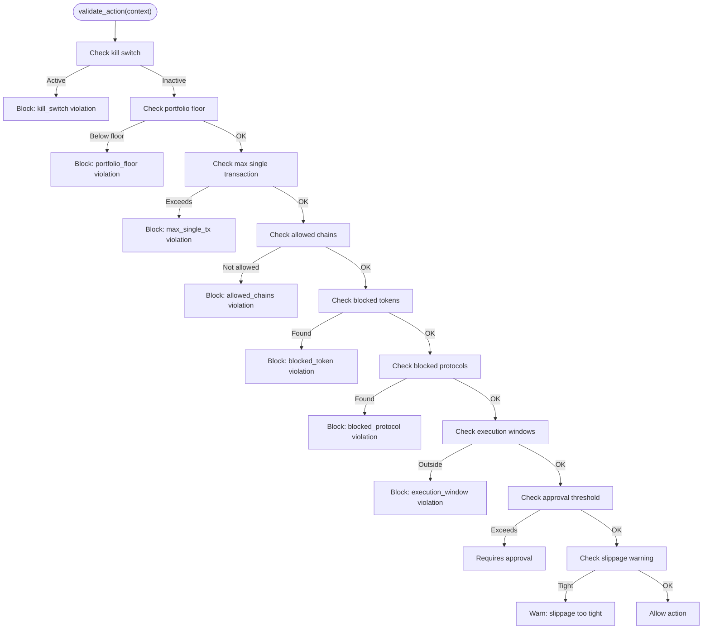
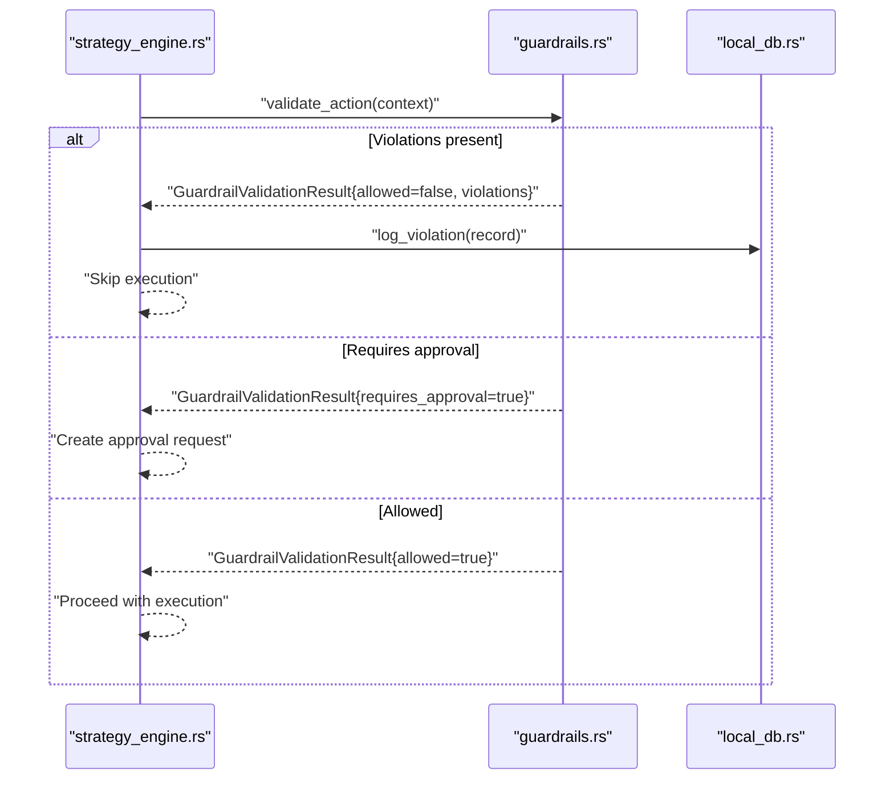
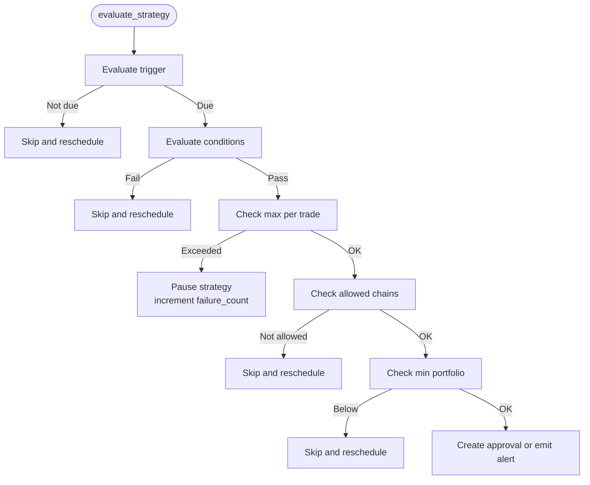
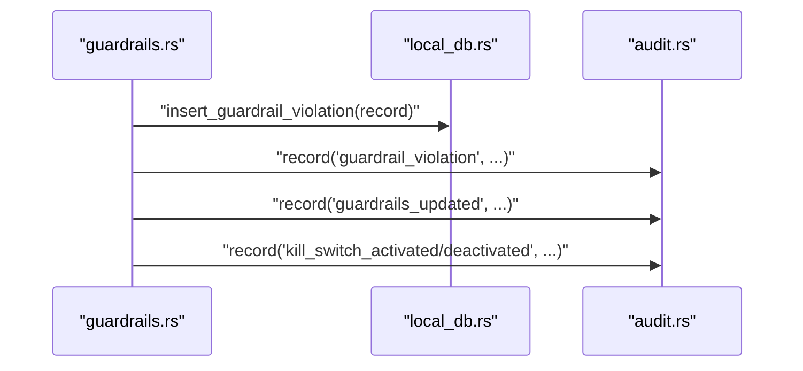
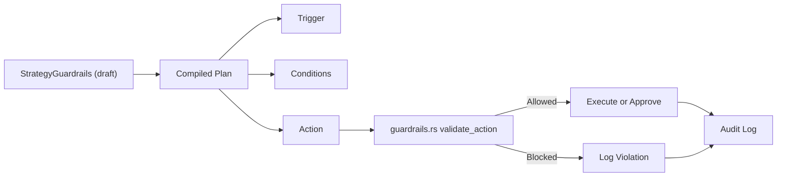
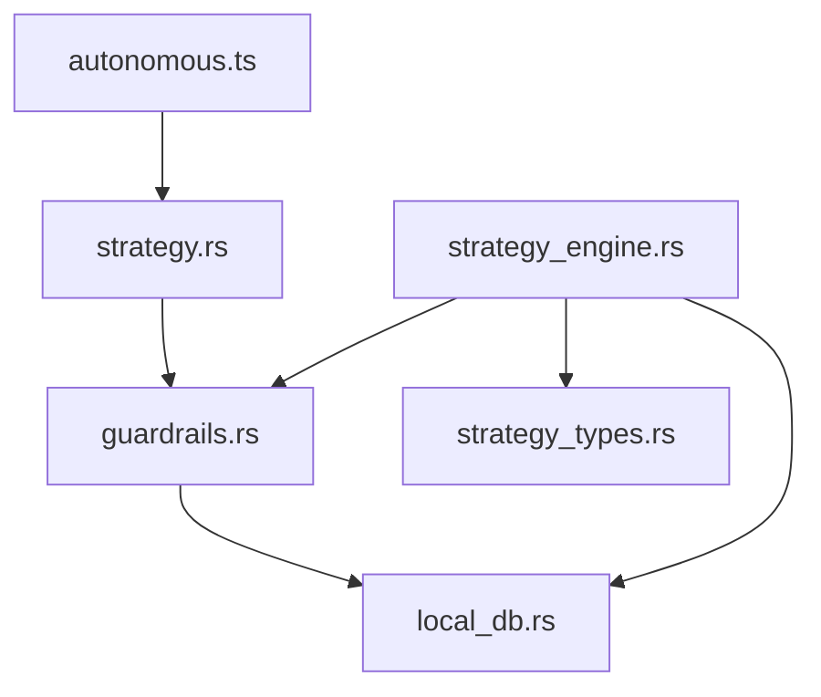

# Strategy Guardrails & Risk Management

<cite>
**Referenced Files in This Document**
- [guardrails.rs](file://src-tauri/src/services/guardrails.rs)
- [local_db.rs](file://src-tauri/src/services/local_db.rs)
- [autonomous.ts](file://src/lib/autonomous.ts)
- [GuardrailsPanel.tsx](file://src/components/autonomous/GuardrailsPanel.tsx)
- [strategy.ts](file://src/lib/strategy.ts)
- [strategy_engine.rs](file://src-tauri/src/services/strategy_engine.rs)
- [strategy_pipeline.ts](file://src/lib/strategyPipeline.ts)
- [strategy.rs](file://src-tauri/src/commands/strategy.rs)
- [strategy_types.rs](file://src-tauri/src/services/strategy_types.rs)
- [strategy_validator.rs](file://src-tauri/src/services/strategy_validator.rs)
</cite>

## Table of Contents
1. [Introduction](#introduction)
2. [Project Structure](#project-structure)
3. [Core Components](#core-components)
4. [Architecture Overview](#architecture-overview)
5. [Detailed Component Analysis](#detailed-component-analysis)
6. [Dependency Analysis](#dependency-analysis)
7. [Performance Considerations](#performance-considerations)
8. [Troubleshooting Guide](#troubleshooting-guide)
9. [Conclusion](#conclusion)

## Introduction
This document explains the strategy guardrails and risk management system. It covers the guardrail configuration framework, risk assessment algorithms, enforcement mechanisms, and operational controls. It documents guardrail types (amount limits, chain restrictions, portfolio thresholds, execution constraints), evaluation flows, risk scoring, and automatic strategy pausing. It also describes the guardrail override system, exception handling, and audit trails, along with performance characteristics, configuration best practices, and dynamic guardrail adjustment. Finally, it clarifies the relationship between guardrails, strategy execution, and system safety controls.

## Project Structure
The guardrail system spans the frontend React UI, the Tauri backend services, and the database layer:
- Frontend: Guardrails panel for configuration and kill switch control
- Backend: Guardrails service for validation, execution policy integration, and audit logging
- Database: Persistent guardrail configurations and violation records
- Strategy engine: Runtime enforcement of guardrails during strategy evaluation

**Diagram sources**
- [GuardrailsPanel.tsx](file://src/components/autonomous/GuardrailsPanel.tsx)
- [autonomous.ts](file://src/lib/autonomous.ts)
- [strategy.rs](file://src-tauri/src/commands/strategy.rs)
- [guardrails.rs](file://src-tauri/src/services/guardrails.rs)
- [strategy_engine.rs](file://src-tauri/src/services/strategy_engine.rs)
- [strategy_types.rs](file://src-tauri/src/services/strategy_types.rs)
- [local_db.rs](file://src-tauri/src/services/local_db.rs)

**Section sources**
- [GuardrailsPanel.tsx](file://src/components/autonomous/GuardrailsPanel.tsx)
- [autonomous.ts](file://src/lib/autonomous.ts)
- [strategy.rs](file://src-tauri/src/commands/strategy.rs)
- [guardrails.rs](file://src-tauri/src/services/guardrails.rs)
- [strategy_engine.rs](file://src-tauri/src/services/strategy_engine.rs)
- [strategy_types.rs](file://src-tauri/src/services/strategy_types.rs)
- [local_db.rs](file://src-tauri/src/services/local_db.rs)

## Core Components
- Guardrail configuration model and validation pipeline
- Execution policy integration with strategy runtime
- Audit and violation logging
- Kill switch and manual overrides
- Strategy-level guardrails and enforcement

Key responsibilities:
- Define guardrail types and semantics
- Validate proposed actions and strategies
- Enforce runtime constraints during strategy execution
- Record violations and maintain audit trails
- Provide safe defaults and emergency controls

**Section sources**
- [guardrails.rs](file://src-tauri/src/services/guardrails.rs)
- [strategy_engine.rs](file://src-tauri/src/services/strategy_engine.rs)
- [local_db.rs](file://src-tauri/src/services/local_db.rs)

## Architecture Overview
The guardrail system operates in two layers:
- Configuration and validation layer (Rust backend): Loads user-configured guardrails, validates actions, logs violations, and enforces kill switches
- Strategy execution layer (Rust backend): Integrates guardrails into strategy evaluation and execution decisions

**Diagram sources**
- [GuardrailsPanel.tsx](file://src/components/autonomous/GuardrailsPanel.tsx)
- [autonomous.ts](file://src/lib/autonomous.ts)
- [strategy.rs](file://src-tauri/src/commands/strategy.rs)
- [guardrails.rs](file://src-tauri/src/services/guardrails.rs)
- [local_db.rs](file://src-tauri/src/services/local_db.rs)

## Detailed Component Analysis

### Guardrail Configuration Framework
The configuration model supports:
- Amount limits: maximum single transaction, daily/weekly spend limits
- Chain restrictions: allowed chains
- Portfolio thresholds: minimum portfolio value
- Execution constraints: time windows, slippage tolerance, approval thresholds
- Safety controls: kill switch

**Diagram sources**
- [guardrails.rs](file://src-tauri/src/services/guardrails.rs)

**Section sources**
- [guardrails.rs](file://src-tauri/src/services/guardrails.rs)

### Risk Assessment Algorithms
Risk checks performed during action validation:
- Kill switch: immediate block if active
- Portfolio floor: block if post-action portfolio falls below threshold
- Single transaction cap: block if value exceeds configured maximum
- Allowed chains: block if chain not in allowlist
- Blocked tokens/protocols: block if present
- Execution windows: block if outside configured time windows
- Approval thresholds: mark action as requiring approval if value exceeds threshold
- Slippage tolerance: warn if configured slippage is extremely tight

**Diagram sources**
- [guardrails.rs](file://src-tauri/src/services/guardrails.rs)

**Section sources**
- [guardrails.rs](file://src-tauri/src/services/guardrails.rs)

### Enforcement Mechanisms
- Immediate blocking: violations cause instant rejection of the action
- Approval gating: actions exceeding thresholds require explicit approval
- Warning-only: non-blocking advisories (e.g., tight slippage)
- Kill switch: global emergency stop that blocks all autonomous actions

**Diagram sources**
- [strategy_engine.rs](file://src-tauri/src/services/strategy_engine.rs)
- [guardrails.rs](file://src-tauri/src/services/guardrails.rs)
- [local_db.rs](file://src-tauri/src/services/local_db.rs)

**Section sources**
- [strategy_engine.rs](file://src-tauri/src/services/strategy_engine.rs)
- [guardrails.rs](file://src-tauri/src/services/guardrails.rs)
- [local_db.rs](file://src-tauri/src/services/local_db.rs)

### Guardrail Types and Semantics
- Amount limits
  - Max single transaction USD
  - Daily spend limit USD
  - Weekly spend limit USD
- Chain restrictions
  - Allowed chains list
- Portfolio thresholds
  - Minimum portfolio USD
- Execution constraints
  - Execution time windows (by day and hour)
  - Maximum slippage tolerance (bps)
  - Approval threshold (above which approval is required)
- Safety controls
  - Emergency kill switch

These types are defined in the configuration model and enforced during validation and strategy execution.

**Section sources**
- [guardrails.rs](file://src-tauri/src/services/guardrails.rs)

### Risk Scoring and Automatic Strategy Pausing
The strategy engine applies guardrails during evaluation:
- Pauses strategies when notional exceeds max per trade
- Skips execution when chains are not allowed
- Skips execution when portfolio is below minimum
- Emits alerts or creates approvals depending on mode and policy

**Diagram sources**
- [strategy_engine.rs](file://src-tauri/src/services/strategy_engine.rs)

**Section sources**
- [strategy_engine.rs](file://src-tauri/src/services/strategy_engine.rs)

### Guardrail Override System, Exception Handling, and Audit Trails
- Override capability: the backend records violations and allows user overrides via audit entries
- Exception handling: validation failures return structured results; violations are logged to the database and audit log
- Audit trails: configuration updates, kill switch activations, guardrail violations, and approvals are recorded

**Diagram sources**
- [guardrails.rs](file://src-tauri/src/services/guardrails.rs)
- [local_db.rs](file://src-tauri/src/services/local_db.rs)

**Section sources**
- [guardrails.rs](file://src-tauri/src/services/guardrails.rs)
- [local_db.rs](file://src-tauri/src/services/local_db.rs)

### Relationship Between Guardrails, Strategy Execution, and System Safety Controls
- Strategy-level guardrails: min portfolio, max per trade, allowed chains, max slippage, cooldown, wallet asset availability
- Runtime enforcement: strategy engine evaluates triggers, conditions, and guardrails before deciding execution path
- Safety controls: kill switch and approval policies integrate with strategy modes (monitor-only, approval-required, pre-authorized)

**Diagram sources**
- [strategy_engine.rs](file://src-tauri/src/services/strategy_engine.rs)
- [strategy_types.rs](file://src-tauri/src/services/strategy_types.rs)
- [guardrails.rs](file://src-tauri/src/services/guardrails.rs)

**Section sources**
- [strategy_engine.rs](file://src-tauri/src/services/strategy_engine.rs)
- [strategy_types.rs](file://src-tauri/src/services/strategy_types.rs)
- [guardrails.rs](file://src-tauri/src/services/guardrails.rs)

## Dependency Analysis
- Frontend depends on Tauri commands to fetch and set guardrails
- Backend commands depend on guardrails service for validation and persistence
- Strategy engine depends on guardrails service and strategy types for runtime enforcement
- Database stores guardrail configurations and violation records

**Diagram sources**
- [autonomous.ts](file://src/lib/autonomous.ts)
- [strategy.rs](file://src-tauri/src/commands/strategy.rs)
- [guardrails.rs](file://src-tauri/src/services/guardrails.rs)
- [local_db.rs](file://src-tauri/src/services/local_db.rs)
- [strategy_engine.rs](file://src-tauri/src/services/strategy_engine.rs)
- [strategy_types.rs](file://src-tauri/src/services/strategy_types.rs)

**Section sources**
- [autonomous.ts](file://src/lib/autonomous.ts)
- [strategy.rs](file://src-tauri/src/commands/strategy.rs)
- [guardrails.rs](file://src-tauri/src/services/guardrails.rs)
- [local_db.rs](file://src-tauri/src/services/local_db.rs)
- [strategy_engine.rs](file://src-tauri/src/services/strategy_engine.rs)
- [strategy_types.rs](file://src-tauri/src/services/strategy_types.rs)

## Performance Considerations
- Validation cost: guardrail checks are lightweight and operate on in-memory configuration and simple arithmetic
- Database writes: violation logging and configuration updates occur infrequently and are bounded
- Strategy evaluation: guardrail checks are O(number of checks) per evaluation cycle
- Recommendations:
  - Keep guardrail lists concise (allowlists/blocklists)
  - Use reasonable slippage tolerances to avoid frequent rejections
  - Prefer time windows aligned with trading activity to minimize rejections
  - Monitor audit logs to tune guardrails and reduce false positives

[No sources needed since this section provides general guidance]

## Troubleshooting Guide
Common scenarios and resolutions:
- Actions blocked unexpectedly
  - Verify portfolio floor and after-action portfolio estimates
  - Check max single transaction and daily/weekly limits
  - Confirm allowed chains and blocked tokens/protocols
  - Review execution windows
- Approval requests appear frequently
  - Lower approval threshold or increase transaction sizes to meet threshold
- Kill switch activated
  - Deactivate kill switch from the UI panel
  - Review audit logs for activation events
- Violations not recorded
  - Ensure database initialization and write permissions
  - Confirm audit logging is enabled

**Section sources**
- [guardrails.rs](file://src-tauri/src/services/guardrails.rs)
- [local_db.rs](file://src-tauri/src/services/local_db.rs)

## Conclusion
The guardrail system provides robust, configurable safety controls for autonomous strategy execution. It combines user-defined guardrails with runtime enforcement, audit logging, and emergency controls to ensure responsible automation. By tuning guardrail parameters and leveraging approval workflows, users can balance autonomy with risk mitigation while maintaining system safety and transparency.