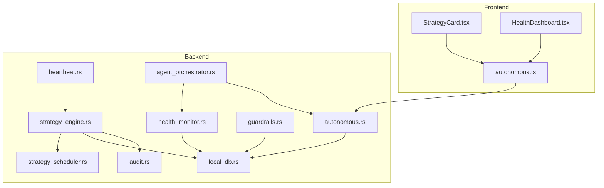
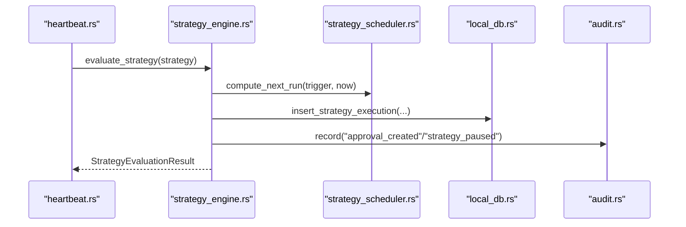
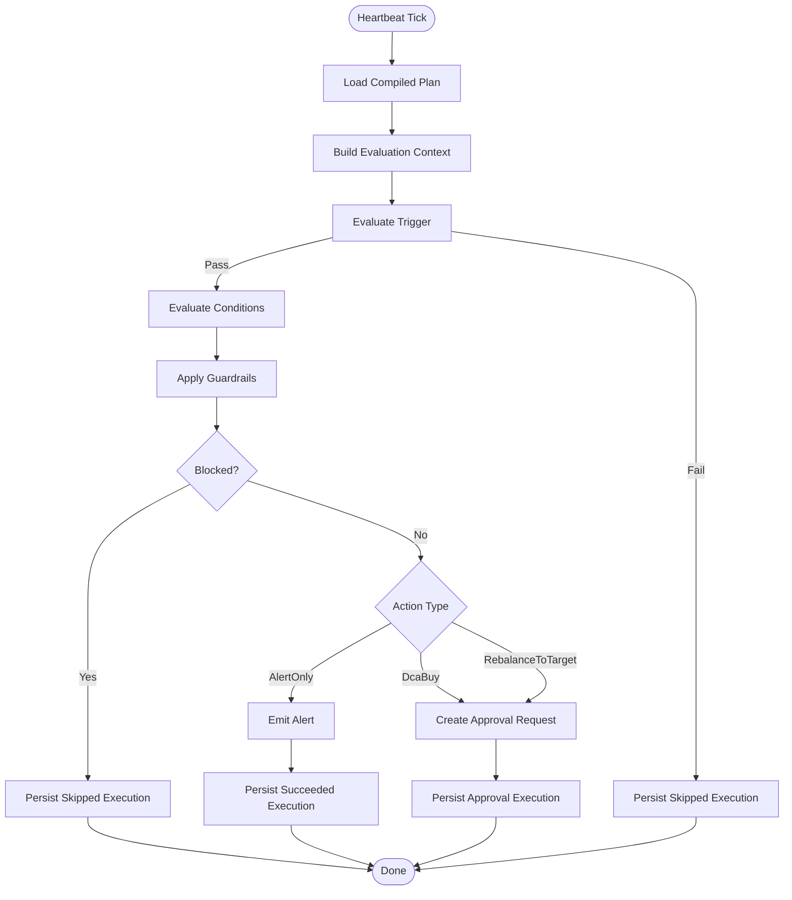
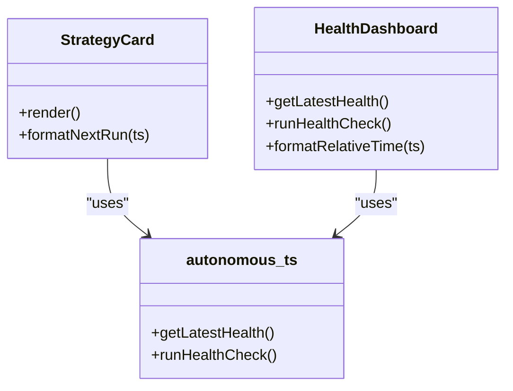
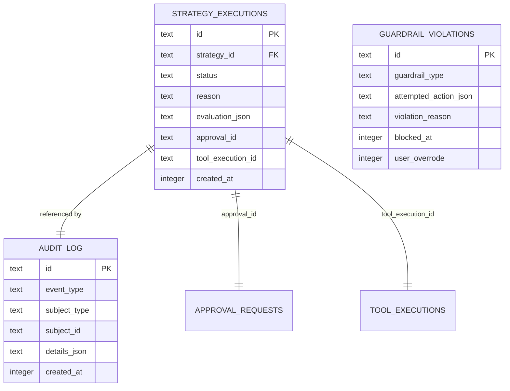
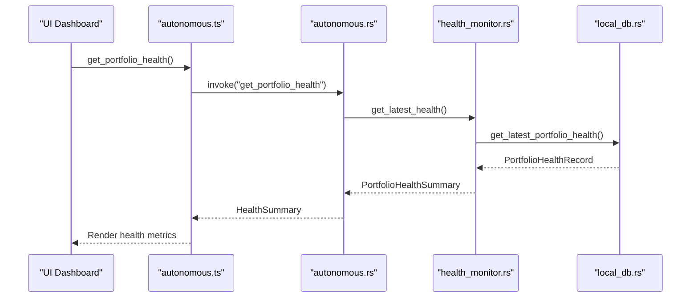
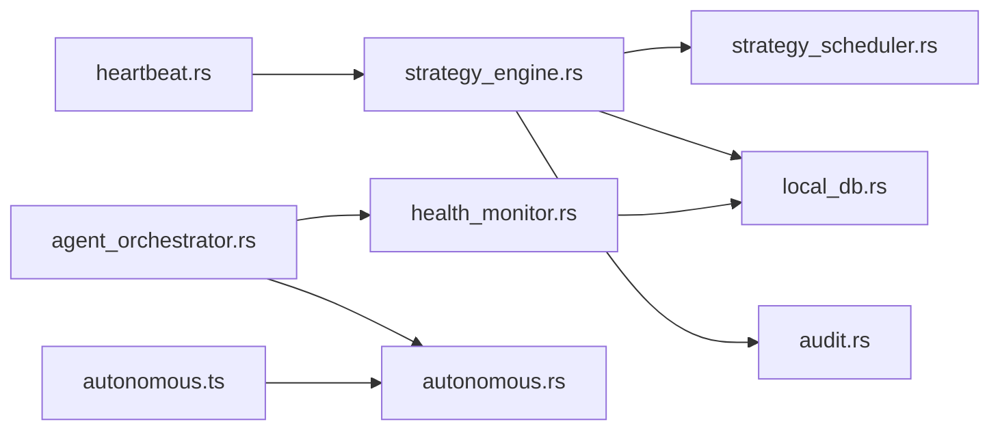

# Strategy Monitoring & Analytics

<cite>
**Referenced Files in This Document**
- [strategy_engine.rs](file://src-tauri/src/services/strategy_engine.rs)
- [strategy_scheduler.rs](file://src-tauri/src/services/strategy_scheduler.rs)
- [strategy_types.rs](file://src-tauri/src/services/strategy_types.rs)
- [local_db.rs](file://src-tauri/src/services/local_db.rs)
- [health_monitor.rs](file://src-tauri/src/services/health_monitor.rs)
- [autonomous.rs](file://src-tauri/src/commands/autonomous.rs)
- [guardrails.rs](file://src-tauri/src/services/guardrails.rs)
- [audit.rs](file://src-tauri/src/services/audit.rs)
- [agent_orchestrator.rs](file://src-tauri/src/services/agent_orchestrator.rs)
- [heartbeat.rs](file://src-tauri/src/services/heartbeat.rs)
- [StrategyCard.tsx](file://src/components/automation/StrategyCard.tsx)
- [HealthDashboard.tsx](file://src/components/autonomous/HealthDashboard.tsx)
- [autonomous.ts](file://src/lib/autonomous.ts)
- [strategy.ts](file://src/lib/strategy.ts)
- [strategy.ts (frontend types)](file://src/types/strategy.ts)
- [automation.ts (frontend types)](file://src/types/automation.ts)
</cite>

## Table of Contents
1. [Introduction](#introduction)
2. [Project Structure](#project-structure)
3. [Core Components](#core-components)
4. [Architecture Overview](#architecture-overview)
5. [Detailed Component Analysis](#detailed-component-analysis)
6. [Dependency Analysis](#dependency-analysis)
7. [Performance Considerations](#performance-considerations)
8. [Troubleshooting Guide](#troubleshooting-guide)
9. [Conclusion](#conclusion)
10. [Appendices](#appendices)

## Introduction
This document describes the strategy monitoring and analytics system in the Shadow Protocol codebase. It explains how execution tracking is implemented, how performance and operational metrics are collected, and how monitoring dashboards surface insights. It documents the execution logging system, audit trails, and compliance reporting. It also covers the monitoring API, alerting mechanisms, automated reporting, data retention, performance optimization, and real-time analytics. Finally, it clarifies the relationship between execution logs, monitoring data, and operational insights.

## Project Structure
The monitoring and analytics system spans both the frontend and the Tauri backend:
- Frontend components render strategy cards, health dashboards, and expose monitoring APIs to the UI.
- Backend services orchestrate strategy evaluation, health checks, guardrails enforcement, and persistence.
- A SQLite-backed local database stores strategy executions, health records, approvals, and audit logs.

**Diagram sources**
- [StrategyCard.tsx:1-103](file://src/components/automation/StrategyCard.tsx#L1-L103)
- [HealthDashboard.tsx:1-198](file://src/components/autonomous/HealthDashboard.tsx#L1-L198)
- [autonomous.ts:291-335](file://src/lib/autonomous.ts#L291-L335)
- [heartbeat.rs:33-60](file://src-tauri/src/services/heartbeat.rs#L33-L60)
- [strategy_engine.rs:343-726](file://src-tauri/src/services/strategy_engine.rs#L343-L726)
- [strategy_scheduler.rs:8-36](file://src-tauri/src/services/strategy_scheduler.rs#L8-L36)
- [health_monitor.rs:106-221](file://src-tauri/src/services/health_monitor.rs#L106-L221)
- [guardrails.rs:182-426](file://src-tauri/src/services/guardrails.rs#L182-L426)
- [agent_orchestrator.rs:92-148](file://src-tauri/src/services/agent_orchestrator.rs#L92-L148)
- [autonomous.rs:432-478](file://src-tauri/src/commands/autonomous.rs#L432-L478)
- [local_db.rs:10-200](file://src-tauri/src/services/local_db.rs#L10-L200)
- [audit.rs:5-24](file://src-tauri/src/services/audit.rs#L5-L24)

**Section sources**
- [StrategyCard.tsx:1-103](file://src/components/automation/StrategyCard.tsx#L1-L103)
- [HealthDashboard.tsx:1-198](file://src/components/autonomous/HealthDashboard.tsx#L1-L198)
- [autonomous.ts:291-335](file://src/lib/autonomous.ts#L291-L335)
- [heartbeat.rs:33-60](file://src-tauri/src/services/heartbeat.rs#L33-L60)
- [strategy_engine.rs:343-726](file://src-tauri/src/services/strategy_engine.rs#L343-L726)
- [strategy_scheduler.rs:8-36](file://src-tauri/src/services/strategy_scheduler.rs#L8-L36)
- [health_monitor.rs:106-221](file://src-tauri/src/services/health_monitor.rs#L106-L221)
- [guardrails.rs:182-426](file://src-tauri/src/services/guardrails.rs#L182-L426)
- [agent_orchestrator.rs:92-148](file://src-tauri/src/services/agent_orchestrator.rs#L92-L148)
- [autonomous.rs:432-478](file://src-tauri/src/commands/autonomous.rs#L432-L478)
- [local_db.rs:10-200](file://src-tauri/src/services/local_db.rs#L10-L200)
- [audit.rs:5-24](file://src-tauri/src/services/audit.rs#L5-L24)

## Core Components
- Strategy engine: evaluates compiled plans, applies guardrails, and persists execution records.
- Strategy scheduler: computes next run timestamps based on triggers.
- Health monitor: calculates portfolio health scores, generates alerts, and persists health records.
- Guardrails: enforces user-configurable constraints and logs violations.
- Agent orchestrator: coordinates health checks, opportunity scans, and task generation.
- Monitoring API: exposes commands for health, tasks, opportunities, and orchestrator state.
- Local database: persists strategies, executions, health records, approvals, and audit logs.
- Frontend dashboards: present strategy status, health metrics, and actionable insights.

**Section sources**
- [strategy_engine.rs:343-726](file://src-tauri/src/services/strategy_engine.rs#L343-L726)
- [strategy_scheduler.rs:8-36](file://src-tauri/src/services/strategy_scheduler.rs#L8-L36)
- [health_monitor.rs:106-221](file://src-tauri/src/services/health_monitor.rs#L106-L221)
- [guardrails.rs:182-426](file://src-tauri/src/services/guardrails.rs#L182-L426)
- [agent_orchestrator.rs:92-148](file://src-tauri/src/services/agent_orchestrator.rs#L92-L148)
- [autonomous.rs:432-478](file://src-tauri/src/commands/autonomous.rs#L432-L478)
- [local_db.rs:10-200](file://src-tauri/src/services/local_db.rs#L10-L200)
- [StrategyCard.tsx:1-103](file://src/components/automation/StrategyCard.tsx#L1-L103)
- [HealthDashboard.tsx:1-198](file://src/components/autonomous/HealthDashboard.tsx#L1-L198)

## Architecture Overview
The system operates on a heartbeat-driven evaluation cycle for strategies and an orchestrator-driven workflow for health checks and opportunities.

**Diagram sources**
- [heartbeat.rs:33-60](file://src-tauri/src/services/heartbeat.rs#L33-L60)
- [strategy_engine.rs:343-726](file://src-tauri/src/services/strategy_engine.rs#L343-L726)
- [strategy_scheduler.rs:8-36](file://src-tauri/src/services/strategy_scheduler.rs#L8-L36)
- [local_db.rs:155-167](file://src-tauri/src/services/local_db.rs#L155-L167)
- [audit.rs:5-24](file://src-tauri/src/services/audit.rs#L5-L24)

## Detailed Component Analysis

### Execution Tracking Framework
- Strategy evaluation flow:
  - The heartbeat invokes the strategy engine to evaluate each active strategy.
  - The engine loads the compiled plan, builds a context (portfolio value, tokens, snapshots), evaluates triggers and conditions, applies guardrails, and decides whether to emit alerts, create approvals, or execute actions.
  - Execution records are persisted with status, reason, evaluation JSON, and timestamps.
- Scheduling:
  - The scheduler computes the next run time based on trigger type (time interval, drift threshold, threshold).
- Persistence:
  - Strategy execution records are stored in the local database with indexes for efficient queries.

**Diagram sources**
- [strategy_engine.rs:343-726](file://src-tauri/src/services/strategy_engine.rs#L343-L726)
- [strategy_scheduler.rs:8-36](file://src-tauri/src/services/strategy_scheduler.rs#L8-L36)
- [local_db.rs:155-167](file://src-tauri/src/services/local_db.rs#L155-L167)

**Section sources**
- [strategy_engine.rs:343-726](file://src-tauri/src/services/strategy_engine.rs#L343-L726)
- [strategy_scheduler.rs:8-36](file://src-tauri/src/services/strategy_scheduler.rs#L8-L36)
- [local_db.rs:155-167](file://src-tauri/src/services/local_db.rs#L155-L167)

### Performance Metrics Collection
- Strategy-level metrics:
  - Status, reason, last execution timestamps, failure counts, and next run times are tracked in the active strategies table and surfaced in the UI.
  - Strategy execution records capture evaluation outcomes and approval/tool execution linkage.
- Health metrics:
  - Portfolio health summary includes overall score, drift score, concentration score, performance score, risk score, component scores, alerts, drift analysis, and recommendations.
  - Health records are persisted and can be retrieved via the monitoring API.
- Guardrails metrics:
  - Violations are logged with guardrail type, attempted action, violation reasons, and timestamps.

**Section sources**
- [strategy_engine.rs:343-726](file://src-tauri/src/services/strategy_engine.rs#L343-L726)
- [health_monitor.rs:106-221](file://src-tauri/src/services/health_monitor.rs#L106-L221)
- [guardrails.rs:484-507](file://src-tauri/src/services/guardrails.rs#L484-L507)
- [local_db.rs:372-382](file://src-tauri/src/services/local_db.rs#L372-L382)

### Monitoring Dashboards
- Strategy dashboard:
  - Strategy cards display next run time, mode/status, failure counts, and last execution status/reason.
- Health dashboard:
  - Displays overall and component scores, risk alerts, and recommendations.
  - Provides on-demand health checks and retrieval of latest health summaries.

**Diagram sources**
- [StrategyCard.tsx:1-103](file://src/components/automation/StrategyCard.tsx#L1-L103)
- [HealthDashboard.tsx:1-198](file://src/components/autonomous/HealthDashboard.tsx#L1-L198)
- [autonomous.ts:291-335](file://src/lib/autonomous.ts#L291-L335)

**Section sources**
- [StrategyCard.tsx:1-103](file://src/components/automation/StrategyCard.tsx#L1-L103)
- [HealthDashboard.tsx:1-198](file://src/components/autonomous/HealthDashboard.tsx#L1-L198)
- [autonomous.ts:291-335](file://src/lib/autonomous.ts#L291-L335)

### Execution Logging System and Audit Trails
- Strategy execution records:
  - Persisted with strategy_id, status, reason, evaluation JSON, approval_id, tool_execution_id, and created_at.
- Audit logs:
  - Centralized audit entries with event_type, subject_type, subject_id, details JSON, and created_at.
- Guardrail violations:
  - Logged with guardrail type, attempted action JSON, violation reasons, blocked_at, and user_override flag.

**Diagram sources**
- [local_db.rs:155-167](file://src-tauri/src/services/local_db.rs#L155-L167)
- [local_db.rs:169-176](file://src-tauri/src/services/local_db.rs#L169-L176)
- [local_db.rs:372-382](file://src-tauri/src/services/local_db.rs#L372-L382)

**Section sources**
- [strategy_engine.rs:267-287](file://src-tauri/src/services/strategy_engine.rs#L267-L287)
- [audit.rs:5-24](file://src-tauri/src/services/audit.rs#L5-L24)
- [guardrails.rs:484-507](file://src-tauri/src/services/guardrails.rs#L484-L507)
- [local_db.rs:155-167](file://src-tauri/src/services/local_db.rs#L155-L167)

### Compliance Reporting
- Audit log entries capture events with structured details JSON for downstream compliance systems.
- Guardrail violation records provide a trail of blocked actions with timestamps and reasons.
- Strategy execution records include approval linkage and tool execution linkage for traceability.

**Section sources**
- [audit.rs:5-24](file://src-tauri/src/services/audit.rs#L5-L24)
- [guardrails.rs:484-507](file://src-tauri/src/services/guardrails.rs#L484-L507)
- [strategy_engine.rs:267-287](file://src-tauri/src/services/strategy_engine.rs#L267-L287)

### Monitoring API and Alerting Mechanisms
- Monitoring API:
  - Commands expose health summaries, task lists, opportunities, orchestrator state, and on-demand analysis.
- Alerting:
  - Strategies can emit alerts without execution.
  - Health monitor generates alerts with severity, titles, messages, affected assets, and recommended actions.
  - Agent orchestrator converts health alerts into generated tasks with confidence and expiry.

**Diagram sources**
- [autonomous.ts:291-335](file://src/lib/autonomous.ts#L291-L335)
- [autonomous.rs:432-478](file://src-tauri/src/commands/autonomous.rs#L432-L478)
- [health_monitor.rs:509-520](file://src-tauri/src/services/health_monitor.rs#L509-L520)
- [local_db.rs:510-520](file://src-tauri/src/services/local_db.rs#L510-L520)

**Section sources**
- [autonomous.rs:432-478](file://src-tauri/src/commands/autonomous.rs#L432-L478)
- [health_monitor.rs:349-427](file://src-tauri/src/services/health_monitor.rs#L349-L427)
- [agent_orchestrator.rs:264-303](file://src-tauri/src/services/agent_orchestrator.rs#L264-L303)

### Automated Reporting
- Orchestrator runs periodic cycles:
  - Health checks with configurable intervals.
  - Opportunity scans with separate intervals.
  - Task generation from health alerts.
- One-off analysis:
  - On-demand analysis triggers health checks and opportunity scans and aggregates results.

**Section sources**
- [agent_orchestrator.rs:92-148](file://src-tauri/src/services/agent_orchestrator.rs#L92-L148)
- [agent_orchestrator.rs:492-519](file://src-tauri/src/services/agent_orchestrator.rs#L492-L519)

### Anomaly Detection
- Strategy-level anomalies:
  - Consecutive evaluation failures cause auto-pause and audit logging.
  - Exceeding guardrail limits pauses strategies and records audit events.
- Health-level anomalies:
  - Drift thresholds, concentration risks, large holdings, and risk thresholds trigger alerts and recommendations.

**Section sources**
- [heartbeat.rs:33-60](file://src-tauri/src/services/heartbeat.rs#L33-L60)
- [strategy_engine.rs:403-434](file://src-tauri/src/services/strategy_engine.rs#L403-L434)
- [health_monitor.rs:349-427](file://src-tauri/src/services/health_monitor.rs#L349-L427)

### Relationship Between Execution Logs, Monitoring Data, and Operational Insights
- Execution logs (strategy_executions) capture evaluation outcomes and approval/tool linkage.
- Monitoring data (health_monitor) produces health summaries and alerts.
- Operational insights:
  - Strategy cards reflect last execution status and next run times.
  - Health dashboards show component scores and recommendations.
  - Audit logs provide compliance traces for approvals and strategy state changes.

**Section sources**
- [strategy_engine.rs:267-287](file://src-tauri/src/services/strategy_engine.rs#L267-L287)
- [health_monitor.rs:106-221](file://src-tauri/src/services/health_monitor.rs#L106-L221)
- [StrategyCard.tsx:81-100](file://src/components/automation/StrategyCard.tsx#L81-L100)
- [HealthDashboard.tsx:178-198](file://src/components/autonomous/HealthDashboard.tsx#L178-L198)

## Dependency Analysis
Key dependencies and relationships:
- heartbeat depends on strategy_engine to evaluate strategies.
- strategy_engine depends on strategy_scheduler for scheduling, local_db for persistence, and audit for compliance.
- health_monitor depends on local_db for persistence and audit for logging.
- agent_orchestrator coordinates health_monitor and task_manager, and exposes commands via autonomous.rs.
- Frontend autonomous.ts consumes commands from autonomous.rs to render dashboards.

**Diagram sources**
- [heartbeat.rs:33-60](file://src-tauri/src/services/heartbeat.rs#L33-L60)
- [strategy_engine.rs:343-726](file://src-tauri/src/services/strategy_engine.rs#L343-L726)
- [strategy_scheduler.rs:8-36](file://src-tauri/src/services/strategy_scheduler.rs#L8-L36)
- [health_monitor.rs:106-221](file://src-tauri/src/services/health_monitor.rs#L106-L221)
- [agent_orchestrator.rs:92-148](file://src-tauri/src/services/agent_orchestrator.rs#L92-L148)
- [autonomous.rs:432-478](file://src-tauri/src/commands/autonomous.rs#L432-L478)
- [autonomous.ts:291-335](file://src/lib/autonomous.ts#L291-L335)

**Section sources**
- [strategy_engine.rs:343-726](file://src-tauri/src/services/strategy_engine.rs#L343-L726)
- [strategy_scheduler.rs:8-36](file://src-tauri/src/services/strategy_scheduler.rs#L8-L36)
- [health_monitor.rs:106-221](file://src-tauri/src/services/health_monitor.rs#L106-L221)
- [agent_orchestrator.rs:92-148](file://src-tauri/src/services/agent_orchestrator.rs#L92-L148)
- [autonomous.rs:432-478](file://src-tauri/src/commands/autonomous.rs#L432-L478)
- [autonomous.ts:291-335](file://src/lib/autonomous.ts#L291-L335)

## Performance Considerations
- Database indexing:
  - Strategy executions indexed by strategy_id and created_at descending for fast retrieval.
  - Audit logs indexed by created_at for chronological queries.
- Evaluation efficiency:
  - Strategy evaluation short-circuits on trigger/condition failures to avoid unnecessary work.
  - Guardrail checks early-exit when constraints are violated.
- Health computation:
  - Scores computed with simple aggregations; drift and concentration calculations optimized via early exits and sorting only when needed.
- Scheduling:
  - Next-run computations are constant-time based on trigger type.

[No sources needed since this section provides general guidance]

## Troubleshooting Guide
- Strategy not executing:
  - Check last execution status and reason in strategy cards.
  - Review strategy_executions for skipped or failed statuses.
- Auto-pause after failures:
  - Inspect failure_count and disabled_reason in active strategies.
  - Audit logs will show strategy_paused events with reasons.
- Guardrail violations:
  - Query guardrail_violations for blocked actions and violation reasons.
- Health dashboard empty:
  - Trigger on-demand analysis via run_analysis_now and verify health_monitor persistence.

**Section sources**
- [StrategyCard.tsx:81-100](file://src/components/automation/StrategyCard.tsx#L81-L100)
- [heartbeat.rs:33-60](file://src-tauri/src/services/heartbeat.rs#L33-L60)
- [audit.rs:5-24](file://src-tauri/src/services/audit.rs#L5-L24)
- [guardrails.rs:484-507](file://src-tauri/src/services/guardrails.rs#L484-L507)
- [autonomous.ts:333-335](file://src/lib/autonomous.ts#L333-L335)

## Conclusion
The Shadow Protocol’s strategy monitoring and analytics system integrates heartbeat-driven strategy evaluation, health monitoring, guardrails enforcement, and comprehensive logging. The frontend dashboards provide actionable insights, while the backend ensures robust persistence, compliance, and automated workflows. Together, these components support real-time analytics, anomaly detection, and operational transparency.

## Appendices

### Monitoring API Definitions
- get_portfolio_health: Returns latest health summary with scores, component scores, alerts, and recommendations.
- run_analysis_now: Executes on-demand health and opportunity scans and returns aggregated results.
- get_pending_tasks/approve_task/reject_task: Manage tasks generated from health alerts.
- get_guardrails/set_guardrails/activate_kill_switch/deactivate_kill_switch: Manage guardrails configuration and emergency kill switch.

**Section sources**
- [autonomous.rs:432-478](file://src-tauri/src/commands/autonomous.rs#L432-L478)
- [autonomous.rs:663-678](file://src-tauri/src/commands/autonomous.rs#L663-L678)
- [autonomous.rs:260-341](file://src-tauri/src/commands/autonomous.rs#L260-L341)
- [autonomous.rs:74-149](file://src-tauri/src/commands/autonomous.rs#L74-L149)

### Strategy Types and Templates
- Strategy templates include DCA buy, rebalance to target, and alert-only.
- Strategy modes include monitor-only, approval-required, and pre-authorized.
- Strategy types define triggers (time interval, drift threshold, threshold), conditions (portfolio floor, max gas, max slippage, asset availability, cooldown, drift minimum), and actions (DCA buy, rebalance to target, alert-only).

**Section sources**
- [strategy_types.rs:29-340](file://src-tauri/src/services/strategy_types.rs#L29-L340)
- [strategy.ts:100-131](file://src/lib/strategy.ts#L100-L131)
- [strategy.ts (frontend types):215-257](file://src/types/strategy.ts#L215-L257)
- [automation.ts (frontend types):1-22](file://src/types/automation.ts#L1-L22)