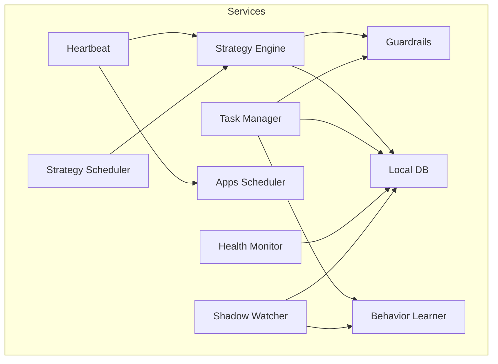
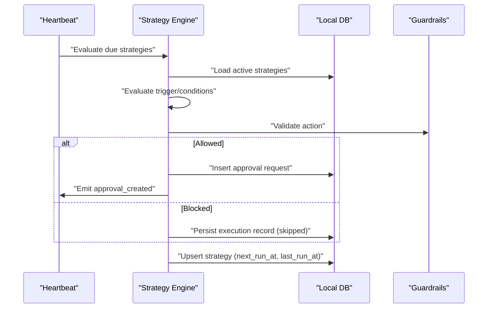
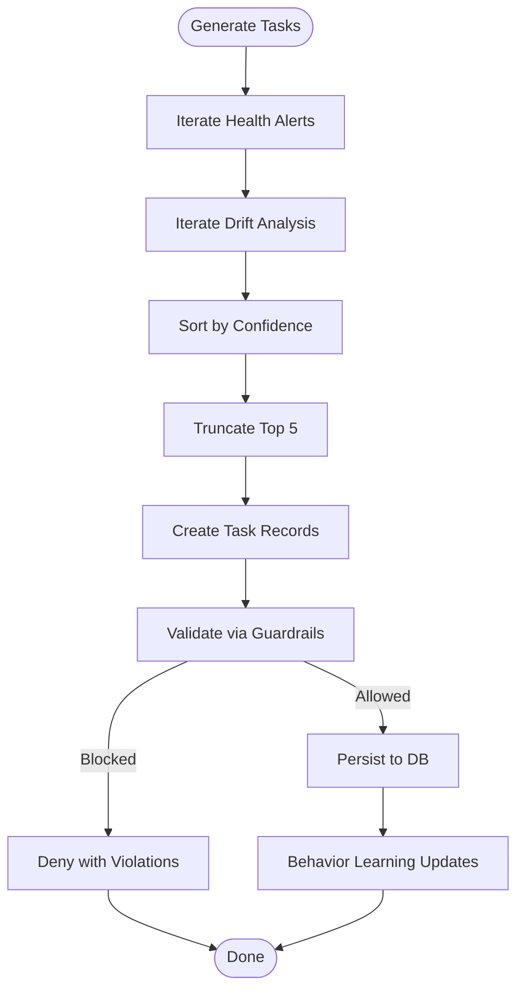
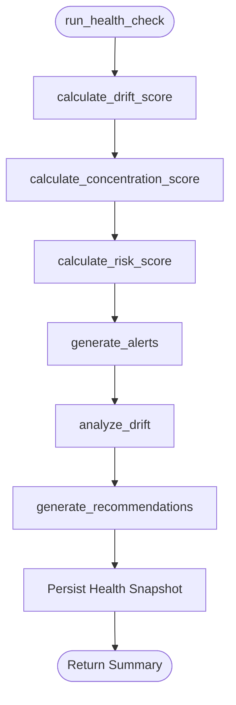
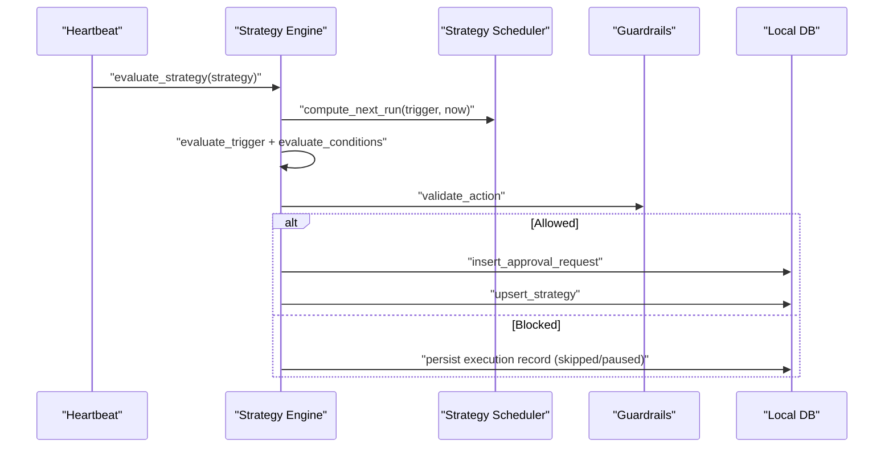
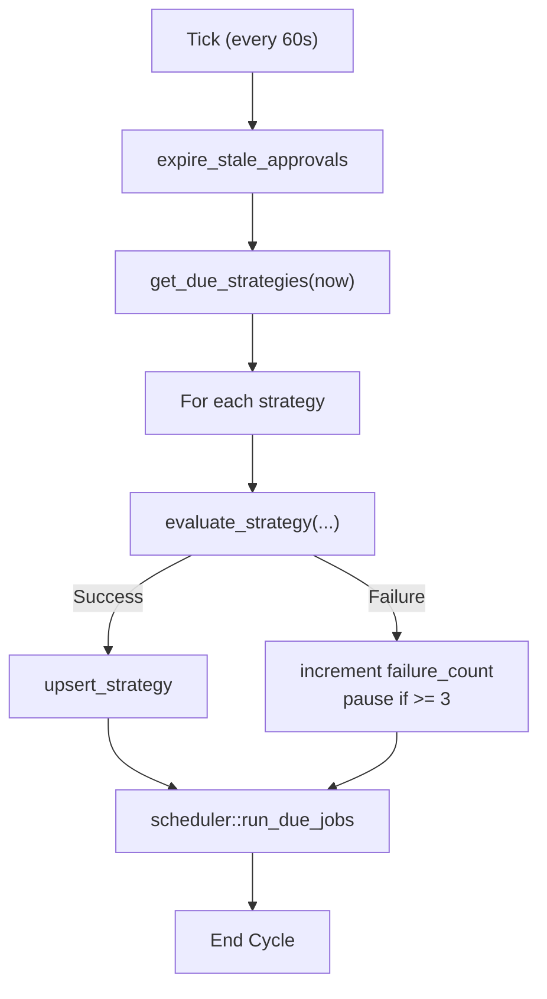
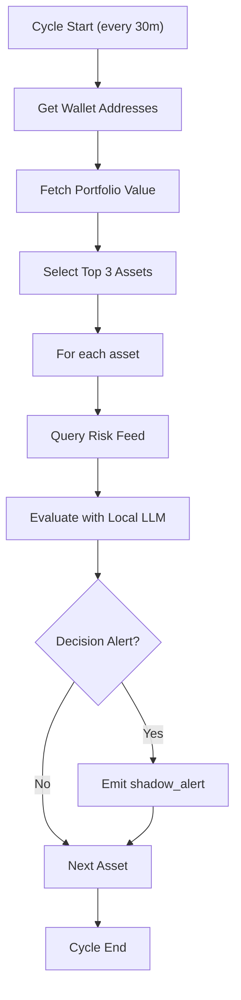
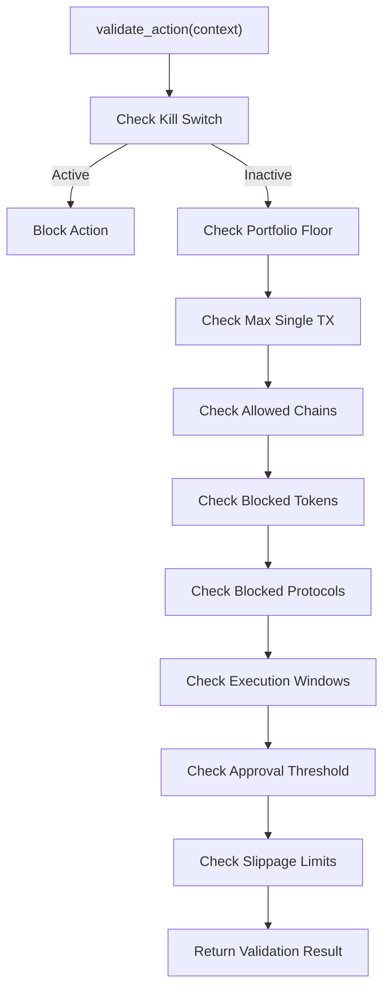
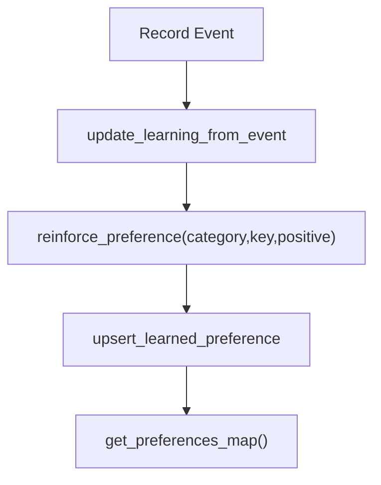
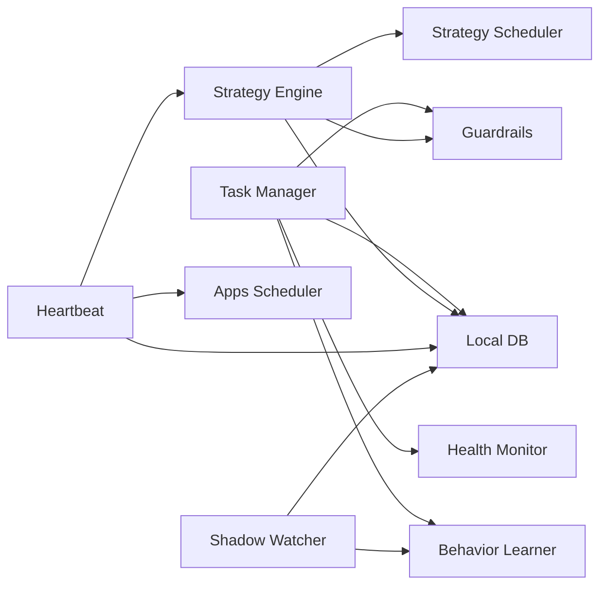

# Task Management & Scheduling Services

<cite>
**Referenced Files in This Document**
- [task_manager.rs](file://src-tauri/src/services/task_manager.rs)
- [health_monitor.rs](file://src-tauri/src/services/health_monitor.rs)
- [heartbeat.rs](file://src-tauri/src/services/heartbeat.rs)
- [shadow_watcher.rs](file://src-tauri/src/services/shadow_watcher.rs)
- [local_db.rs](file://src-tauri/src/services/local_db.rs)
- [guardrails.rs](file://src-tauri/src/services/guardrails.rs)
- [behavior_learner.rs](file://src-tauri/src/services/behavior_learner.rs)
- [strategy_engine.rs](file://src-tauri/src/services/strategy_engine.rs)
- [strategy_scheduler.rs](file://src-tauri/src/services/strategy_scheduler.rs)
- [strategy_types.rs](file://src-tauri/src/services/strategy_types.rs)
- [scheduler.rs](file://src-tauri/src/services/apps/scheduler.rs)
</cite>

## Table of Contents
1. [Introduction](#introduction)
2. [Project Structure](#project-structure)
3. [Core Components](#core-components)
4. [Architecture Overview](#architecture-overview)
5. [Detailed Component Analysis](#detailed-component-analysis)
6. [Dependency Analysis](#dependency-analysis)
7. [Performance Considerations](#performance-considerations)
8. [Troubleshooting Guide](#troubleshooting-guide)
9. [Conclusion](#conclusion)

## Introduction
This document explains the task management and system monitoring service layer powering autonomous operations in the platform. It covers:
- Task scheduling and lifecycle management (proactive suggestions, approvals, execution)
- Health monitoring and alerting (portfolio drift, concentration, risk)
- Heartbeat-driven strategy evaluation and automated actions
- Shadow Watcher for background risk monitoring and autonomous alerts
- Persistence, recovery, and graceful shutdown patterns
- Concurrency controls, throttling, and performance optimization
- Integration with the autonomous operation system and task dependency management

## Project Structure
The service layer is implemented in Rust under the Tauri backend (`src-tauri/src/services/`). Key modules:
- Task management: task creation, approval, execution lifecycle, persistence
- Health monitoring: portfolio health scoring, alerts, drift analysis
- Strategy engine: heartbeat-driven evaluation, guardrails, approval flows
- Auxiliary services: heartbeat scheduler, shadow watcher, guardrails, behavior learning, local database

**Diagram sources**
- [task_manager.rs:1-630](file://src-tauri/src/services/task_manager.rs#L1-L630)
- [health_monitor.rs:1-573](file://src-tauri/src/services/health_monitor.rs#L1-L573)
- [heartbeat.rs:1-75](file://src-tauri/src/services/heartbeat.rs#L1-L75)
- [shadow_watcher.rs:1-179](file://src-tauri/src/services/shadow_watcher.rs#L1-L179)
- [strategy_engine.rs:1-726](file://src-tauri/src/services/strategy_engine.rs#L1-L726)
- [strategy_scheduler.rs:1-64](file://src-tauri/src/services/strategy_scheduler.rs#L1-L64)
- [local_db.rs:1-2735](file://src-tauri/src/services/local_db.rs#L1-L2735)
- [guardrails.rs:1-620](file://src-tauri/src/services/guardrails.rs#L1-L620)
- [behavior_learner.rs:1-460](file://src-tauri/src/services/behavior_learner.rs#L1-L460)
- [scheduler.rs:1-96](file://src-tauri/src/services/apps/scheduler.rs#L1-L96)

**Section sources**
- [task_manager.rs:1-630](file://src-tauri/src/services/task_manager.rs#L1-L630)
- [health_monitor.rs:1-573](file://src-tauri/src/services/health_monitor.rs#L1-L573)
- [heartbeat.rs:1-75](file://src-tauri/src/services/heartbeat.rs#L1-L75)
- [shadow_watcher.rs:1-179](file://src-tauri/src/services/shadow_watcher.rs#L1-L179)
- [strategy_engine.rs:1-726](file://src-tauri/src/services/strategy_engine.rs#L1-L726)
- [strategy_scheduler.rs:1-64](file://src-tauri/src/services/strategy_scheduler.rs#L1-L64)
- [local_db.rs:1-2735](file://src-tauri/src/services/local_db.rs#L1-L2735)
- [guardrails.rs:1-620](file://src-tauri/src/services/guardrails.rs#L1-L620)
- [behavior_learner.rs:1-460](file://src-tauri/src/services/behavior_learner.rs#L1-L460)
- [scheduler.rs:1-96](file://src-tauri/src/services/apps/scheduler.rs#L1-L96)

## Core Components
- Task Manager: generates proactive tasks from health and drift, manages lifecycle (approve/reject/start/complete/fail), persists to local DB, integrates with guardrails and behavior learning.
- Health Monitor: computes portfolio health scores, detects drift/concentration/risk thresholds, emits alerts and recommendations, persists health snapshots.
- Strategy Engine: evaluates strategies on heartbeat ticks, applies guardrails, creates approval requests, emits alerts, updates execution records.
- Strategy Scheduler: computes next run timestamps for time-based and threshold triggers.
- Heartbeat: periodic tick that expires stale approvals, evaluates due strategies, runs app scheduler jobs.
- Shadow Watcher: periodic background monitoring of top positions, risk evaluation via LLM, emits autonomous alerts.
- Guardrails: centralized policy enforcement with kill switch, spend limits, chain/token allowlists, slippage caps.
- Behavior Learner: tracks user decisions and preferences, updates learned preferences for recommendation personalization.
- Local DB: SQLite-backed persistence for tasks, strategies, approvals, executions, health snapshots, behavior events, preferences.

**Section sources**
- [task_manager.rs:1-630](file://src-tauri/src/services/task_manager.rs#L1-L630)
- [health_monitor.rs:1-573](file://src-tauri/src/services/health_monitor.rs#L1-L573)
- [strategy_engine.rs:1-726](file://src-tauri/src/services/strategy_engine.rs#L1-L726)
- [strategy_scheduler.rs:1-64](file://src-tauri/src/services/strategy_scheduler.rs#L1-L64)
- [heartbeat.rs:1-75](file://src-tauri/src/services/heartbeat.rs#L1-L75)
- [shadow_watcher.rs:1-179](file://src-tauri/src/services/shadow_watcher.rs#L1-L179)
- [guardrails.rs:1-620](file://src-tauri/src/services/guardrails.rs#L1-L620)
- [behavior_learner.rs:1-460](file://src-tauri/src/services/behavior_learner.rs#L1-L460)
- [local_db.rs:1-2735](file://src-tauri/src/services/local_db.rs#L1-L2735)

## Architecture Overview
The system operates on a heartbeat-driven model:
- Heartbeat ticks every 60 seconds, expiring stale approvals, evaluating due strategies, and running app scheduler jobs.
- Strategy Engine loads compiled plans, evaluates triggers and conditions, enforces guardrails, and either emits alerts or creates approval requests.
- Task Manager generates proactive tasks from health alerts and drift analysis, validates against guardrails, and persists to local DB.
- Shadow Watcher periodically scans top positions, queries risk feeds, evaluates with LLM, and emits autonomous alerts.
- All state is persisted in a local SQLite database with dedicated tables for tasks, strategies, approvals, executions, health, behavior events, and preferences.

**Diagram sources**
- [heartbeat.rs:10-75](file://src-tauri/src/services/heartbeat.rs#L10-L75)
- [strategy_engine.rs:343-726](file://src-tauri/src/services/strategy_engine.rs#L343-L726)
- [strategy_scheduler.rs:8-36](file://src-tauri/src/services/strategy_scheduler.rs#L8-L36)
- [guardrails.rs:277-426](file://src-tauri/src/services/guardrails.rs#L277-L426)
- [local_db.rs:802-817](file://src-tauri/src/services/local_db.rs#L802-L817)

## Detailed Component Analysis

### Task Management Service
Responsibilities:
- Generate tasks from health alerts and drift analysis
- Enforce expiration and approval workflows
- Validate actions against guardrails
- Integrate with behavior learning for preference updates
- Persist tasks and maintain statistics

Key flows:
- Task generation from health alerts and drift analysis
- Approval validation with guardrails and kill switch
- Status transitions and persistence
- Statistics aggregation

**Diagram sources**
- [task_manager.rs:167-195](file://src-tauri/src/services/task_manager.rs#L167-L195)
- [task_manager.rs:198-303](file://src-tauri/src/services/task_manager.rs#L198-L303)
- [task_manager.rs:305-387](file://src-tauri/src/services/task_manager.rs#L305-L387)
- [task_manager.rs:428-558](file://src-tauri/src/services/task_manager.rs#L428-L558)
- [guardrails.rs:277-426](file://src-tauri/src/services/guardrails.rs#L277-L426)
- [behavior_learner.rs:111-158](file://src-tauri/src/services/behavior_learner.rs#L111-L158)

Practical examples:
- Creating a task from a health alert: [generate_task_from_alert:198-303](file://src-tauri/src/services/task_manager.rs#L198-L303)
- Generating a rebalance task from drift: [generate_rebalance_task:305-387](file://src-tauri/src/services/task_manager.rs#L305-L387)
- Approving a task with guardrails: [approve_task:429-499](file://src-tauri/src/services/task_manager.rs#L429-L499)
- Getting task statistics: [get_task_stats:561-582](file://src-tauri/src/services/task_manager.rs#L561-L582)

**Section sources**
- [task_manager.rs:1-630](file://src-tauri/src/services/task_manager.rs#L1-L630)
- [local_db.rs:1986-2175](file://src-tauri/src/services/local_db.rs#L1986-L2175)
- [guardrails.rs:1-620](file://src-tauri/src/services/guardrails.rs#L1-L620)
- [behavior_learner.rs:1-460](file://src-tauri/src/services/behavior_learner.rs#L1-L460)

### Health Monitoring Service
Responsibilities:
- Compute drift, concentration, risk, and performance scores
- Detect health alerts and generate recommendations
- Persist health snapshots and audit events

Core computations:
- Drift score calculation from target allocations
- Concentration score via HHI and penalties for large holdings
- Risk score considering stablecoin exposure and chain concentration
- Alert generation and drift analysis

**Diagram sources**
- [health_monitor.rs:107-221](file://src-tauri/src/services/health_monitor.rs#L107-L221)
- [health_monitor.rs:224-347](file://src-tauri/src/services/health_monitor.rs#L224-L347)
- [health_monitor.rs:350-427](file://src-tauri/src/services/health_monitor.rs#L350-L427)
- [health_monitor.rs:430-477](file://src-tauri/src/services/health_monitor.rs#L430-L477)
- [health_monitor.rs:480-507](file://src-tauri/src/services/health_monitor.rs#L480-L507)

Practical examples:
- Running a health check: [run_health_check:107-221](file://src-tauri/src/services/health_monitor.rs#L107-L221)
- Computing drift score: [calculate_drift_score:224-260](file://src-tauri/src/services/health_monitor.rs#L224-L260)
- Generating alerts: [generate_alerts:350-427](file://src-tauri/src/services/health_monitor.rs#L350-L427)

**Section sources**
- [health_monitor.rs:1-573](file://src-tauri/src/services/health_monitor.rs#L1-L573)
- [local_db.rs:2359-2399](file://src-tauri/src/services/local_db.rs#L2359-L2399)

### Strategy Engine and Scheduler
Responsibilities:
- Evaluate strategies on heartbeat ticks
- Apply guardrails and conditions
- Emit alerts or create approval requests
- Compute next run times for triggers

**Diagram sources**
- [strategy_engine.rs:343-726](file://src-tauri/src/services/strategy_engine.rs#L343-L726)
- [strategy_scheduler.rs:8-36](file://src-tauri/src/services/strategy_scheduler.rs#L8-L36)
- [guardrails.rs:277-426](file://src-tauri/src/services/guardrails.rs#L277-L426)
- [local_db.rs:802-817](file://src-tauri/src/services/local_db.rs#L802-L817)

Practical examples:
- Strategy evaluation: [evaluate_strategy:343-726](file://src-tauri/src/services/strategy_engine.rs#L343-L726)
- Next-run computation: [compute_next_run:9-36](file://src-tauri/src/services/strategy_scheduler.rs#L9-L36)

**Section sources**
- [strategy_engine.rs:1-726](file://src-tauri/src/services/strategy_engine.rs#L1-L726)
- [strategy_scheduler.rs:1-64](file://src-tauri/src/services/strategy_scheduler.rs#L1-L64)
- [strategy_types.rs:245-381](file://src-tauri/src/services/strategy_types.rs#L245-L381)
- [local_db.rs:802-817](file://src-tauri/src/services/local_db.rs#L802-L817)

### Heartbeat Service
Responsibilities:
- Periodic maintenance: expire stale approvals, evaluate due strategies, run app scheduler jobs
- Failure handling: auto-pause strategies after consecutive failures
- Audit logging and telemetry

**Diagram sources**
- [heartbeat.rs:10-75](file://src-tauri/src/services/heartbeat.rs#L10-L75)
- [local_db.rs:1179-1187](file://src-tauri/src/services/local_db.rs#L1179-L1187)
- [local_db.rs:802-817](file://src-tauri/src/services/local_db.rs#L802-L817)
- [scheduler.rs:12-33](file://src-tauri/src/services/apps/scheduler.rs#L12-L33)

**Section sources**
- [heartbeat.rs:1-75](file://src-tauri/src/services/heartbeat.rs#L1-L75)
- [local_db.rs:1179-1187](file://src-tauri/src/services/local_db.rs#L1179-L1187)
- [local_db.rs:802-817](file://src-tauri/src/services/local_db.rs#L802-L817)
- [scheduler.rs:1-96](file://src-tauri/src/services/apps/scheduler.rs#L1-L96)

### Shadow Watcher Service
Responsibilities:
- Periodic background monitoring of top portfolio positions
- Risk research via external APIs and local LLM evaluation
- Emit autonomous alerts to the UI

**Diagram sources**
- [shadow_watcher.rs:29-179](file://src-tauri/src/services/shadow_watcher.rs#L29-L179)
- [behavior_learner.rs:111-158](file://src-tauri/src/services/behavior_learner.rs#L111-L158)

**Section sources**
- [shadow_watcher.rs:1-179](file://src-tauri/src/services/shadow_watcher.rs#L1-L179)
- [behavior_learner.rs:1-460](file://src-tauri/src/services/behavior_learner.rs#L1-L460)

### Guardrails Service
Responsibilities:
- Centralized policy enforcement (spend limits, chain/token allowlists, slippage)
- Kill switch activation/deactivation
- Violation logging and audit trails

**Diagram sources**
- [guardrails.rs:277-426](file://src-tauri/src/services/guardrails.rs#L277-L426)

**Section sources**
- [guardrails.rs:1-620](file://src-tauri/src/services/guardrails.rs#L1-L620)

### Behavior Learner Service
Responsibilities:
- Record behavior events (approvals, rejections, task outcomes)
- Update learned preferences using Bayesian updates
- Provide preference maps for agent prompts

**Diagram sources**
- [behavior_learner.rs:111-158](file://src-tauri/src/services/behavior_learner.rs#L111-L158)
- [behavior_learner.rs:202-313](file://src-tauri/src/services/behavior_learner.rs#L202-L313)
- [local_db.rs:2251-2314](file://src-tauri/src/services/local_db.rs#L2251-L2314)

**Section sources**
- [behavior_learner.rs:1-460](file://src-tauri/src/services/behavior_learner.rs#L1-L460)
- [local_db.rs:2251-2314](file://src-tauri/src/services/local_db.rs#L2251-L2314)

### Local Database Layer
Responsibilities:
- Schema for tasks, strategies, approvals, executions, health, behavior, preferences
- CRUD operations for all entities
- Migration support and initialization

Key tables:
- tasks, behavior_events, learned_preferences, portfolio_health, guardrails, guardrail_violations, strategy_executions, approval_requests, tool_executions, market_opportunities, app_scheduler_jobs

**Section sources**
- [local_db.rs:1-2735](file://src-tauri/src/services/local_db.rs#L1-L2735)

## Dependency Analysis
- Task Manager depends on Health Monitor for context, Guardrails for validation, Behavior Learner for preference updates, and Local DB for persistence.
- Strategy Engine depends on Strategy Scheduler for next-run computation, Guardrails for validation, Local DB for strategy and execution records, and emits approval requests.
- Heartbeat orchestrates Strategy Engine, App Scheduler, and Local DB maintenance.
- Shadow Watcher depends on external services and Behavior Learner for context, emitting autonomous alerts.
- Guardrails is a cross-cutting concern for Strategy Engine and Task Manager.
- Local DB is the central persistence layer for all services.

**Diagram sources**
- [task_manager.rs:1-630](file://src-tauri/src/services/task_manager.rs#L1-L630)
- [health_monitor.rs:1-573](file://src-tauri/src/services/health_monitor.rs#L1-L573)
- [strategy_engine.rs:1-726](file://src-tauri/src/services/strategy_engine.rs#L1-L726)
- [strategy_scheduler.rs:1-64](file://src-tauri/src/services/strategy_scheduler.rs#L1-L64)
- [heartbeat.rs:1-75](file://src-tauri/src/services/heartbeat.rs#L1-L75)
- [shadow_watcher.rs:1-179](file://src-tauri/src/services/shadow_watcher.rs#L1-L179)
- [guardrails.rs:1-620](file://src-tauri/src/services/guardrails.rs#L1-L620)
- [behavior_learner.rs:1-460](file://src-tauri/src/services/behavior_learner.rs#L1-L460)
- [local_db.rs:1-2735](file://src-tauri/src/services/local_db.rs#L1-L2735)
- [scheduler.rs:1-96](file://src-tauri/src/services/apps/scheduler.rs#L1-L96)

**Section sources**
- [task_manager.rs:1-630](file://src-tauri/src/services/task_manager.rs#L1-L630)
- [health_monitor.rs:1-573](file://src-tauri/src/services/health_monitor.rs#L1-L573)
- [strategy_engine.rs:1-726](file://src-tauri/src/services/strategy_engine.rs#L1-L726)
- [strategy_scheduler.rs:1-64](file://src-tauri/src/services/strategy_scheduler.rs#L1-L64)
- [heartbeat.rs:1-75](file://src-tauri/src/services/heartbeat.rs#L1-L75)
- [shadow_watcher.rs:1-179](file://src-tauri/src/services/shadow_watcher.rs#L1-L179)
- [guardrails.rs:1-620](file://src-tauri/src/services/guardrails.rs#L1-L620)
- [behavior_learner.rs:1-460](file://src-tauri/src/services/behavior_learner.rs#L1-L460)
- [local_db.rs:1-2735](file://src-tauri/src/services/local_db.rs#L1-L2735)
- [scheduler.rs:1-96](file://src-tauri/src/services/apps/scheduler.rs#L1-L96)

## Performance Considerations
- Heartbeat cadence: 60 seconds balances responsiveness with CPU usage; adjust intervals carefully.
- Strategy evaluation: early exits on trigger/condition failures reduce unnecessary work.
- Guardrails checks short-circuit on kill switch; avoid repeated parsing by caching loaded config.
- Task generation: capped to top 5 tasks; sorting by confidence reduces downstream processing.
- Database operations: batched inserts and UPSERTs minimize contention; indexes on status/category/priority improve query performance.
- Shadow Watcher: configurable interval (30 minutes) with expected failure handling to avoid noisy logs.

[No sources needed since this section provides general guidance]

## Troubleshooting Guide
Common issues and resolutions:
- Strategies not executing:
  - Verify due strategies and next_run_at: [get_due_strategies:802-817](file://src-tauri/src/services/local_db.rs#L802-L817)
  - Check trigger evaluation and conditions: [evaluate_trigger:124-159](file://src-tauri/src/services/strategy_engine.rs#L124-L159), [evaluate_conditions:169-255](file://src-tauri/src/services/strategy_engine.rs#L169-L255)
  - Confirm guardrail violations: [validate_action:277-426](file://src-tauri/src/services/guardrails.rs#L277-L426)
- Approval requests stuck:
  - Expiration logic: [expire_stale_approvals:1179-1187](file://src-tauri/src/services/local_db.rs#L1179-L1187)
  - Heartbeat expiration cycle: [heartbeat:21-23](file://src-tauri/src/services/heartbeat.rs#L21-L23)
- Tasks not appearing:
  - Check suggested tasks and expiration: [get_tasks:2045-2106](file://src-tauri/src/services/local_db.rs#L2045-L2106), [expire_stale_tasks:2156-2164](file://src-tauri/src/services/local_db.rs#L2156-L2164)
- Kill switch blocking actions:
  - Check guardrails config and state: [is_kill_switch_active:233-235](file://src-tauri/src/services/guardrails.rs#L233-L235), [activate_kill_switch:238-255](file://src-tauri/src/services/guardrails.rs#L238-L255)
- Shadow Watcher skipping cycles:
  - Expected failures are downgraded to warnings: [is_expected_failure:64-75](file://src-tauri/src/services/shadow_watcher.rs#L64-L75)

**Section sources**
- [local_db.rs:802-817](file://src-tauri/src/services/local_db.rs#L802-L817)
- [local_db.rs:1179-1187](file://src-tauri/src/services/local_db.rs#L1179-L1187)
- [local_db.rs:2045-2106](file://src-tauri/src/services/local_db.rs#L2045-L2106)
- [local_db.rs:2156-2164](file://src-tauri/src/services/local_db.rs#L2156-L2164)
- [guardrails.rs:233-255](file://src-tauri/src/services/guardrails.rs#L233-L255)
- [strategy_engine.rs:124-255](file://src-tauri/src/services/strategy_engine.rs#L124-L255)
- [heartbeat.rs:21-23](file://src-tauri/src/services/heartbeat.rs#L21-L23)
- [shadow_watcher.rs:64-75](file://src-tauri/src/services/shadow_watcher.rs#L64-L75)

## Conclusion
The task management and monitoring layer combines proactive task generation, robust health monitoring, heartbeat-driven strategy evaluation, and autonomous risk surveillance. It enforces strict guardrails, persists state reliably, and integrates behavior learning to personalize recommendations. The modular design enables scalability, maintainability, and safe autonomous operations with clear audit trails and recovery mechanisms.