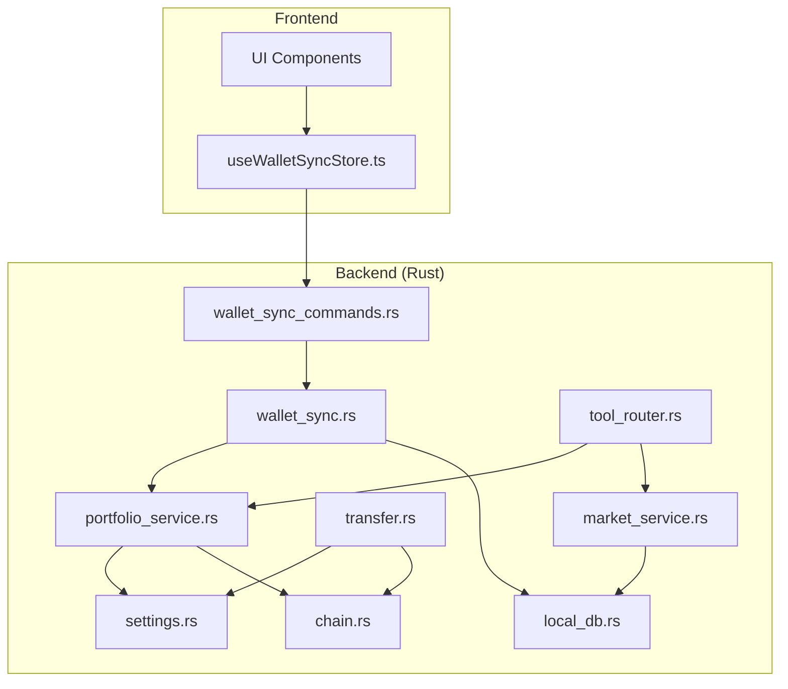
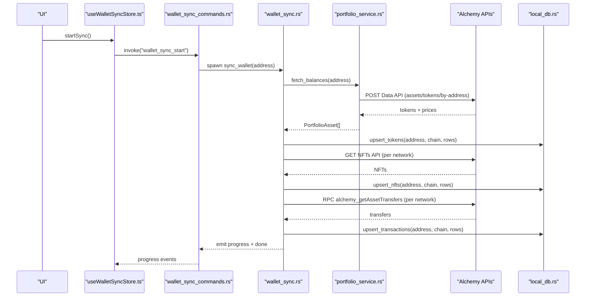
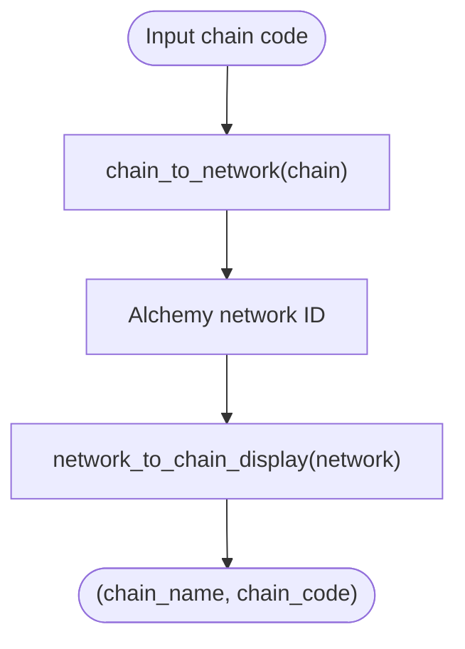
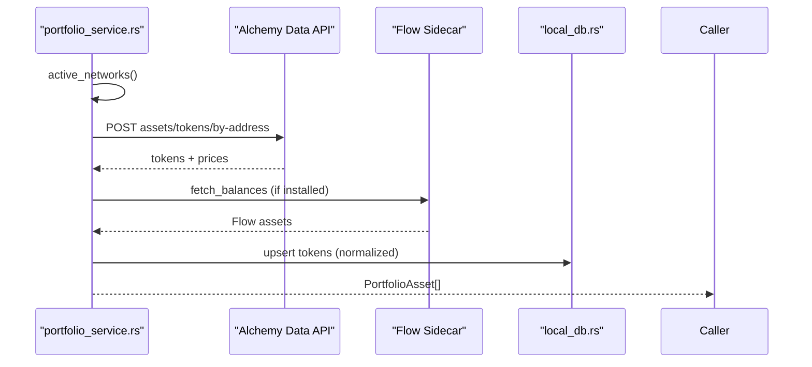
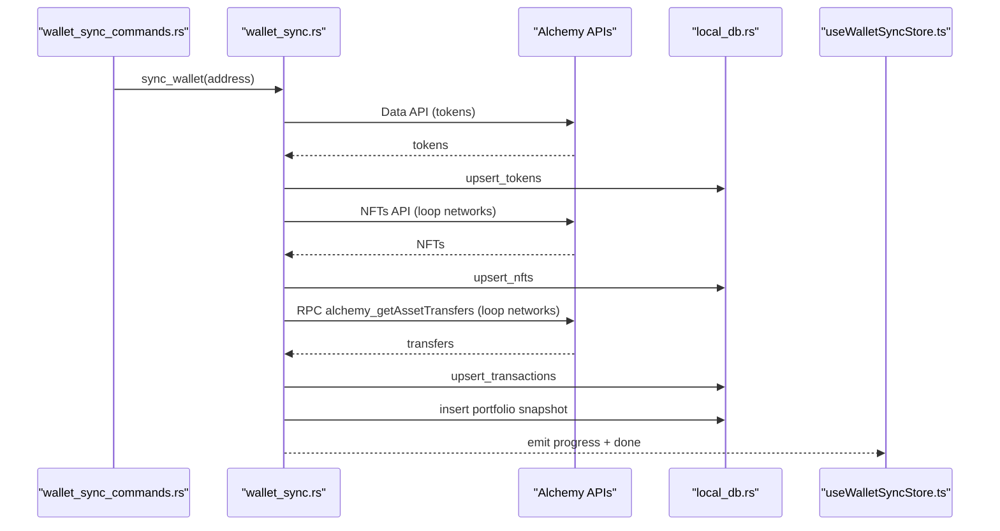
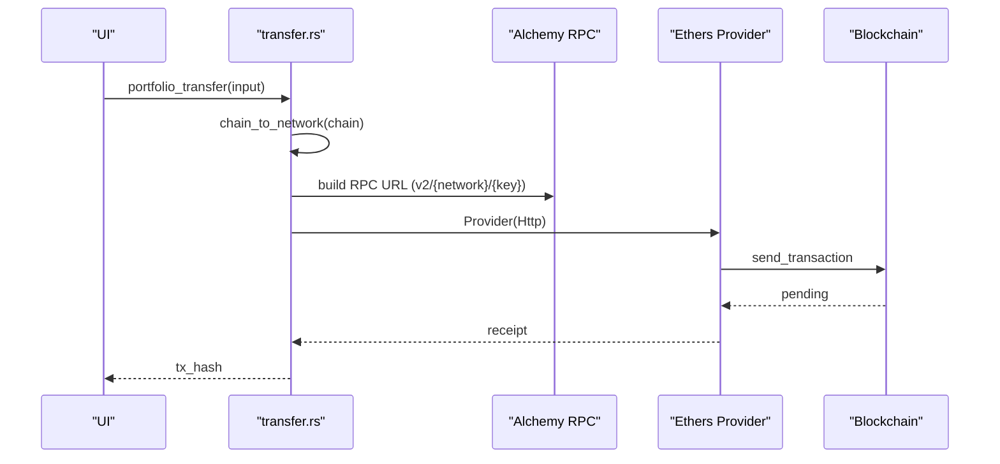
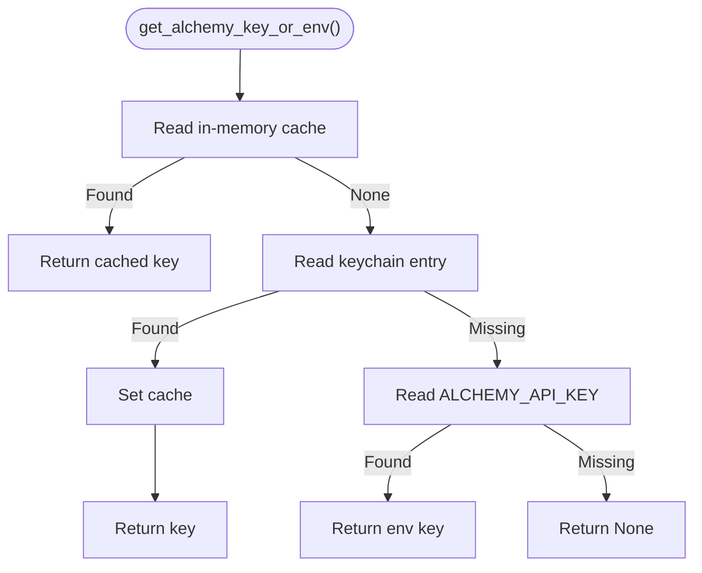
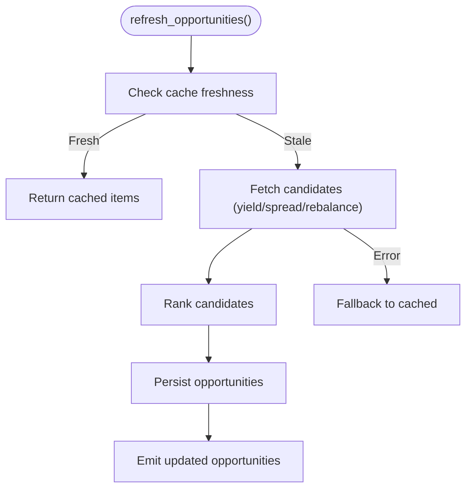
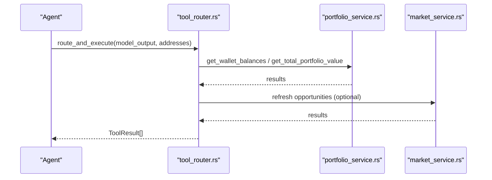
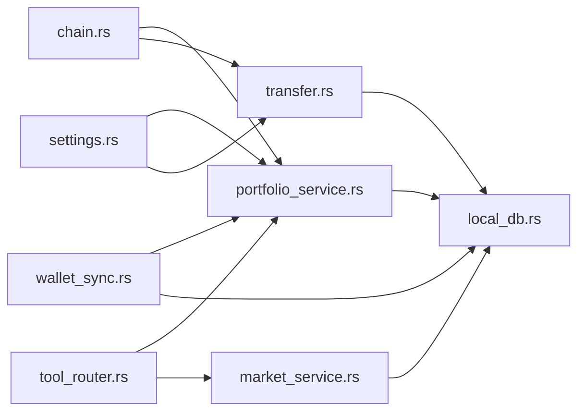

# Blockchain RPC Management

<cite>
**Referenced Files in This Document**
- [chain.rs](file://src-tauri/src/services/chain.rs)
- [portfolio_service.rs](file://src-tauri/src/services/portfolio_service.rs)
- [wallet_sync.rs](file://src-tauri/src/services/wallet_sync.rs)
- [transfer.rs](file://src-tauri/src/commands/transfer.rs)
- [settings.rs](file://src-tauri/src/services/settings.rs)
- [local_db.rs](file://src-tauri/src/services/local_db.rs)
- [market_service.rs](file://src-tauri/src/services/market_service.rs)
- [wallet_sync_commands.rs](file://src-tauri/src/commands/wallet_sync.rs)
- [tool_router.rs](file://src-tauri/src/services/tool_router.rs)
- [useWalletSyncStore.ts](file://src/store/useWalletSyncStore.ts)
</cite>

## Table of Contents
1. [Introduction](#introduction)
2. [Project Structure](#project-structure)
3. [Core Components](#core-components)
4. [Architecture Overview](#architecture-overview)
5. [Detailed Component Analysis](#detailed-component-analysis)
6. [Dependency Analysis](#dependency-analysis)
7. [Performance Considerations](#performance-considerations)
8. [Troubleshooting Guide](#troubleshooting-guide)
9. [Conclusion](#conclusion)

## Introduction
This document describes the blockchain RPC management layer that powers cross-chain portfolio aggregation, wallet synchronization, transaction broadcasting, and market data retrieval. It explains how the system maps chain identifiers to Alchemy networks, orchestrates RPC calls, manages API keys, and coordinates background sync and market refresh cycles. It also documents the integration with Alchemy APIs, Flow sidecar, and the local database for persistence and caching.

## Project Structure
The RPC management layer spans Rust backend services and frontend stores:
- Backend services: chain mapping, portfolio fetching, wallet sync, transfers, settings, local DB, market service, and tool routing.
- Frontend store: wallet sync progress and notifications.

**Diagram sources**
- [chain.rs:1-89](file://src-tauri/src/services/chain.rs#L1-L89)
- [portfolio_service.rs:1-498](file://src-tauri/src/services/portfolio_service.rs#L1-L498)
- [wallet_sync.rs:1-453](file://src-tauri/src/services/wallet_sync.rs#L1-L453)
- [transfer.rs:1-280](file://src-tauri/src/commands/transfer.rs#L1-L280)
- [settings.rs:1-243](file://src-tauri/src/services/settings.rs#L1-L243)
- [local_db.rs:1-800](file://src-tauri/src/services/local_db.rs#L1-L800)
- [market_service.rs:1-745](file://src-tauri/src/services/market_service.rs#L1-L745)
- [tool_router.rs:1-818](file://src-tauri/src/services/tool_router.rs#L1-L818)
- [wallet_sync_commands.rs:1-90](file://src-tauri/src/commands/wallet_sync.rs#L1-L90)

**Section sources**
- [chain.rs:1-89](file://src-tauri/src/services/chain.rs#L1-L89)
- [portfolio_service.rs:1-498](file://src-tauri/src/services/portfolio_service.rs#L1-L498)
- [wallet_sync.rs:1-453](file://src-tauri/src/services/wallet_sync.rs#L1-L453)
- [transfer.rs:1-280](file://src-tauri/src/commands/transfer.rs#L1-L280)
- [settings.rs:1-243](file://src-tauri/src/services/settings.rs#L1-L243)
- [local_db.rs:1-800](file://src-tauri/src/services/local_db.rs#L1-L800)
- [market_service.rs:1-745](file://src-tauri/src/services/market_service.rs#L1-L745)
- [tool_router.rs:1-818](file://src-tauri/src/services/tool_router.rs#L1-L818)
- [wallet_sync_commands.rs:1-90](file://src-tauri/src/commands/wallet_sync.rs#L1-L90)
- [useWalletSyncStore.ts:1-199](file://src/store/useWalletSyncStore.ts#L1-L199)

## Core Components
- Chain abstraction and mapping: Converts human-readable chain codes to Alchemy network identifiers and vice versa, including special handling for Flow EVM vs Cadence.
- Portfolio service: Aggregates balances across supported networks via Alchemy’s Data API and hydrates values using token prices.
- Wallet sync: Background orchestration to fetch tokens, NFTs, and transactions per wallet and network, storing results in local DB and emitting progress events.
- Transfer commands: Builds RPC URLs, signs transactions, and optionally monitors confirmations.
- Settings: Manages API keys with in-memory caching and environment fallback.
- Local DB: Schema-backed persistence for tokens, NFTs, transactions, snapshots, and market data.
- Market service: Periodic refresh of market opportunities with caching and fallback.
- Tool router: Dispatches agent-driven tool calls to appropriate services.

**Section sources**
- [chain.rs:1-89](file://src-tauri/src/services/chain.rs#L1-L89)
- [portfolio_service.rs:1-498](file://src-tauri/src/services/portfolio_service.rs#L1-L498)
- [wallet_sync.rs:1-453](file://src-tauri/src/services/wallet_sync.rs#L1-L453)
- [transfer.rs:1-280](file://src-tauri/src/commands/transfer.rs#L1-L280)
- [settings.rs:1-243](file://src-tauri/src/services/settings.rs#L1-L243)
- [local_db.rs:1-800](file://src-tauri/src/services/local_db.rs#L1-L800)
- [market_service.rs:1-745](file://src-tauri/src/services/market_service.rs#L1-L745)
- [tool_router.rs:1-818](file://src-tauri/src/services/tool_router.rs#L1-L818)

## Architecture Overview
The system integrates multiple RPC and API endpoints behind a unified chain abstraction and a settings layer. Wallet synchronization and portfolio queries rely on Alchemy’s REST APIs and RPC endpoints. Market data is fetched from external providers and cached locally. The UI listens for progress and completion events to reflect sync status.

**Diagram sources**
- [wallet_sync_commands.rs:59-89](file://src-tauri/src/commands/wallet_sync.rs#L59-L89)
- [wallet_sync.rs:260-452](file://src-tauri/src/services/wallet_sync.rs#L260-L452)
- [portfolio_service.rs:271-418](file://src-tauri/src/services/portfolio_service.rs#L271-L418)
- [local_db.rs:1-800](file://src-tauri/src/services/local_db.rs#L1-L800)
- [useWalletSyncStore.ts:111-151](file://src/store/useWalletSyncStore.ts#L111-L151)

## Detailed Component Analysis

### Chain Abstraction and Network Mapping
- Supported chains include Ethereum, Base, Polygon, and Flow variants (mainnet/testnet, EVM/Cadence).
- Mapping functions convert chain codes to Alchemy network identifiers and display labels.
- Special handling ensures Flow EVM and Flow Cadence are treated distinctly.

**Diagram sources**
- [chain.rs:9-89](file://src-tauri/src/services/chain.rs#L9-L89)

**Section sources**
- [chain.rs:1-89](file://src-tauri/src/services/chain.rs#L1-L89)

### Portfolio Balances via Alchemy
- Builds a list of networks to query, conditionally including Flow networks if the Flow app is installed.
- Calls Alchemy Data API to fetch tokens and prices, then normalizes balances and values.
- Hydrates Flow balances via a separate sidecar and merges results.

**Diagram sources**
- [portfolio_service.rs:16-25](file://src-tauri/src/services/portfolio_service.rs#L16-L25)
- [portfolio_service.rs:271-418](file://src-tauri/src/services/portfolio_service.rs#L271-L418)
- [local_db.rs:1-800](file://src-tauri/src/services/local_db.rs#L1-L800)

**Section sources**
- [portfolio_service.rs:1-498](file://src-tauri/src/services/portfolio_service.rs#L1-L498)

### Wallet Synchronization Orchestration
- Background job per wallet address with progress and completion events.
- Steps: fetch tokens, fetch NFTs per network, fetch transactions per network, update snapshots, refresh market opportunities.
- Emits structured progress payloads and finalization events.

**Diagram sources**
- [wallet_sync_commands.rs:59-89](file://src-tauri/src/commands/wallet_sync.rs#L59-L89)
- [wallet_sync.rs:260-452](file://src-tauri/src/services/wallet_sync.rs#L260-L452)
- [local_db.rs:1-800](file://src-tauri/src/services/local_db.rs#L1-L800)
- [useWalletSyncStore.ts:111-151](file://src/store/useWalletSyncStore.ts#L111-L151)

**Section sources**
- [wallet_sync.rs:1-453](file://src-tauri/src/services/wallet_sync.rs#L1-L453)
- [wallet_sync_commands.rs:1-90](file://src-tauri/src/commands/wallet_sync.rs#L1-L90)
- [useWalletSyncStore.ts:1-199](file://src/store/useWalletSyncStore.ts#L1-L199)

### Transaction Broadcasting and Confirmation Monitoring
- Validates addresses and amounts, resolves chain to Alchemy network, builds RPC URL.
- Uses Ethers provider to sign and send transactions, then polls for receipts to emit confirmation events.

**Diagram sources**
- [transfer.rs:79-160](file://src-tauri/src/commands/transfer.rs#L79-L160)

**Section sources**
- [transfer.rs:1-280](file://src-tauri/src/commands/transfer.rs#L1-L280)

### Settings and API Key Management
- API keys are cached in memory to avoid repeated OS keychain prompts.
- Supports Alchemy key via keychain or environment variable fallback.
- Provides helpers to set/remove keys and clear all app data.

**Diagram sources**
- [settings.rs:197-200](file://src-tauri/src/services/settings.rs#L197-L200)

**Section sources**
- [settings.rs:1-243](file://src-tauri/src/services/settings.rs#L1-L243)

### Market Data Fetching and Refresh
- Periodic refresh of market opportunities with caching and fallback to cached results on errors.
- Builds market context from local DB tokens and computes rebalancing candidates.

**Diagram sources**
- [market_service.rs:263-365](file://src-tauri/src/services/market_service.rs#L263-L365)

**Section sources**
- [market_service.rs:1-745](file://src-tauri/src/services/market_service.rs#L1-L745)

### Tool Router and Cross-Chain Operations
- Parses tool calls from model output and dispatches to portfolio, market, or app-specific tools.
- Handles multi-wallet aggregation for balances and portfolio value.

**Diagram sources**
- [tool_router.rs:100-196](file://src-tauri/src/services/tool_router.rs#L100-L196)
- [portfolio_service.rs:131-147](file://src-tauri/src/services/portfolio_service.rs#L131-L147)
- [market_service.rs:263-365](file://src-tauri/src/services/market_service.rs#L263-L365)

**Section sources**
- [tool_router.rs:1-818](file://src-tauri/src/services/tool_router.rs#L1-L818)

## Dependency Analysis
- Chain mapping is a foundational dependency for portfolio and transfer operations.
- Portfolio service depends on settings for API keys and chain mapping for network selection.
- Wallet sync depends on portfolio service for balances, Alchemy RPC for transfers, and local DB for persistence.
- Market service depends on local DB for caching and periodically triggers portfolio snapshots and market refresh.
- Tool router composes portfolio and market services to fulfill agent requests.

**Diagram sources**
- [chain.rs:1-89](file://src-tauri/src/services/chain.rs#L1-L89)
- [portfolio_service.rs:1-498](file://src-tauri/src/services/portfolio_service.rs#L1-L498)
- [wallet_sync.rs:1-453](file://src-tauri/src/services/wallet_sync.rs#L1-L453)
- [transfer.rs:1-280](file://src-tauri/src/commands/transfer.rs#L1-L280)
- [settings.rs:1-243](file://src-tauri/src/services/settings.rs#L1-L243)
- [local_db.rs:1-800](file://src-tauri/src/services/local_db.rs#L1-L800)
- [market_service.rs:1-745](file://src-tauri/src/services/market_service.rs#L1-L745)
- [tool_router.rs:1-818](file://src-tauri/src/services/tool_router.rs#L1-L818)

**Section sources**
- [chain.rs:1-89](file://src-tauri/src/services/chain.rs#L1-L89)
- [portfolio_service.rs:1-498](file://src-tauri/src/services/portfolio_service.rs#L1-L498)
- [wallet_sync.rs:1-453](file://src-tauri/src/services/wallet_sync.rs#L1-L453)
- [transfer.rs:1-280](file://src-tauri/src/commands/transfer.rs#L1-L280)
- [settings.rs:1-243](file://src-tauri/src/services/settings.rs#L1-L243)
- [local_db.rs:1-800](file://src-tauri/src/services/local_db.rs#L1-L800)
- [market_service.rs:1-745](file://src-tauri/src/services/market_service.rs#L1-L745)
- [tool_router.rs:1-818](file://src-tauri/src/services/tool_router.rs#L1-L818)

## Performance Considerations
- Connection pooling: The code uses per-request clients without explicit connection pools. Consider reusing a single HTTP client with connection reuse for higher throughput.
- Timeout tuning: Current timeouts are conservative; adjust per network latency and retry policies.
- Parallelization: Wallet sync loops across networks sequentially; consider concurrent requests per network to reduce total latency.
- Caching: Local DB and in-memory API key cache reduce redundant calls; ensure cache invalidation aligns with freshness requirements.
- Rate limiting: Respect Alchemy rate limits; implement backoff and jitter for retries on 429/5xx responses.
- Latency optimization: Prefer regionally proximate Alchemy endpoints and monitor RPC latency per network.

[No sources needed since this section provides general guidance]

## Troubleshooting Guide
- Missing API key: Both portfolio and transfer commands return explicit errors when the Alchemy key is missing. Ensure the key is set in the keychain or exported as an environment variable.
- Invalid addresses: Address validation enforces checksummed Ethereum-style addresses; ensure inputs conform to 0x-prefixed, 42-character format.
- Unsupported chain: Chain mapping returns None for unsupported codes; verify chain codes against the supported list.
- Sync failures: Wallet sync emits detailed progress and completion events; inspect emitted payloads and local DB state for clues.
- Market refresh errors: Market service falls back to cached results; check latest provider runs and error summaries in local DB.

**Section sources**
- [portfolio_service.rs:27-37](file://src-tauri/src/services/portfolio_service.rs#L27-L37)
- [transfer.rs:27-43](file://src-tauri/src/commands/transfer.rs#L27-L43)
- [settings.rs:197-200](file://src-tauri/src/services/settings.rs#L197-L200)
- [wallet_sync.rs:261-274](file://src-tauri/src/services/wallet_sync.rs#L261-L274)
- [market_service.rs:601-624](file://src-tauri/src/services/market_service.rs#L601-L624)

## Conclusion
The RPC management layer integrates Alchemy APIs and RPC endpoints through a robust chain abstraction, background synchronization, and local persistence. It supports multi-chain portfolios, wallet syncing, transaction broadcasting, and market data refresh with clear error handling and event-driven UI updates. Extending support for additional chains involves updating the chain mapping and network lists, while maintaining the existing patterns for API key management, RPC routing, and event emission.