# Flow Integration Guide

<cite>
**Referenced Files in This Document**
- [flow.ts](file://apps-runtime/src/providers/flow.ts)
- [flow-actions.ts](file://apps-runtime/src/providers/flow-actions.ts)
- [flow-bridge.ts](file://apps-runtime/src/providers/flow-bridge.ts)
- [flow-tx.ts](file://apps-runtime/src/providers/flow-tx.ts)
- [flow-signing.ts](file://apps-runtime/src/providers/flow-signing.ts)
- [flow-network.ts](file://apps-runtime/src/providers/flow-network.ts)
- [flow.rs](file://src-tauri/src/services/apps/flow.rs)
- [flow_actions.rs](file://src-tauri/src/services/apps/flow_actions.rs)
- [flow_bridge.rs](file://src-tauri/src/services/apps/flow_bridge.rs)
- [flow_scheduler.rs](file://src-tauri/src/services/apps/flow_scheduler.rs)
- [apps.ts](file://src/lib/apps.ts)
- [flow_domain.rs](file://src-tauri/src/services/flow_domain.rs)
- [main.ts](file://apps-runtime/src/main.ts)
- [runtime.rs](file://src-tauri/src/services/apps/runtime.rs)
- [apps.rs](file://src-tauri/src/commands/apps.rs)
- [AppSettingsPanel.tsx](file://src/components/apps/AppSettingsPanel.tsx)
- [useApps.ts](file://src/hooks/useApps.ts)
- [package.json](file://apps-runtime/package.json)
- [README.md](file://README.md)
</cite>

## Update Summary
**Changes Made**
- Added new Flow Actions component for composable DeFi previews
- Integrated Flow Bridge functionality for cross-VM token transfers
- Enhanced transaction management with improved signing and scheduling
- Expanded API endpoints for new Flow integration capabilities
- Updated transaction submission with session key support

## Table of Contents
1. [Introduction](#introduction)
2. [Flow Integration Architecture](#flow-integration-architecture)
3. [Core Components](#core-components)
4. [New Flow Actions System](#new-flow-actions-system)
5. [Flow Bridge Functionality](#flow-bridge-functionality)
6. [Enhanced Transaction Management](#enhanced-transaction-management)
7. [Configuration Management](#configuration-management)
8. [API Endpoints and Operations](#api-endpoints-and-operations)
9. [Address Validation and Normalization](#address-validation-and-normalization)
10. [Integration Setup](#integration-setup)
11. [Troubleshooting Guide](#troubleshooting-guide)
12. [Best Practices](#best-practices)

## Introduction

The Flow Integration in SHADOW Protocol provides seamless connectivity to the Flow blockchain ecosystem through a secure, privacy-focused architecture. This integration supports both Flow EVM wallets and native Flow Cadence accounts, enabling comprehensive portfolio management and automated trading capabilities.

Flow is a modern blockchain designed specifically for digital assets and NFTs, featuring a unique dual-address system where users can operate with either Ethereum-style EVM addresses or native Flow Cadence addresses. The SHADOW integration handles both address types while maintaining strict security boundaries and privacy controls.

**Updated** The integration now includes advanced Flow Actions composability, cross-VM bridging capabilities, and enhanced transaction management with session key support.

## Flow Integration Architecture

The Flow integration follows a multi-layered architecture that ensures security, performance, and maintainability:

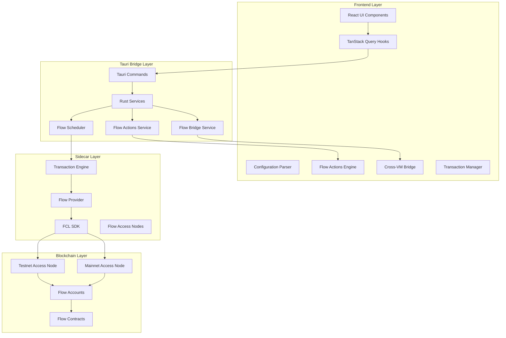

**Diagram sources**
- [AppSettingsPanel.tsx:361-575](file://src/components/apps/AppSettingsPanel.tsx#L361-L575)
- [apps.rs:557-657](file://src-tauri/src/commands/apps.rs#L557-L657)
- [flow_scheduler.rs:1-277](file://src-tauri/src/services/apps/flow_scheduler.rs#L1-L277)
- [flow_actions.rs:1-39](file://src-tauri/src/services/apps/flow_actions.rs#L1-L39)
- [flow_bridge.rs:1-40](file://src-tauri/src/services/apps/flow_bridge.rs#L1-L40)

The architecture consists of four distinct layers with enhanced capabilities for Flow Actions, bridging, and transaction management:

1. **Frontend Layer**: React components and hooks that manage user interactions with new Flow Actions and bridge components
2. **Tauri Bridge Layer**: Rust commands and services that handle secure communication with enhanced scheduling and preview capabilities
3. **Sidecar Layer**: Isolated Bun processes running integration adapters with Flow Actions engine and cross-VM bridge functionality
4. **Blockchain Layer**: Flow network access nodes and account data with support for advanced transaction types

**Section sources**
- [README.md:135-146](file://README.md#L135-L146)
- [runtime.rs:1-144](file://src-tauri/src/services/apps/runtime.rs#L1-L144)

## Core Components

### Flow Provider Interface

The Flow integration defines a comprehensive provider interface that abstracts blockchain interactions:

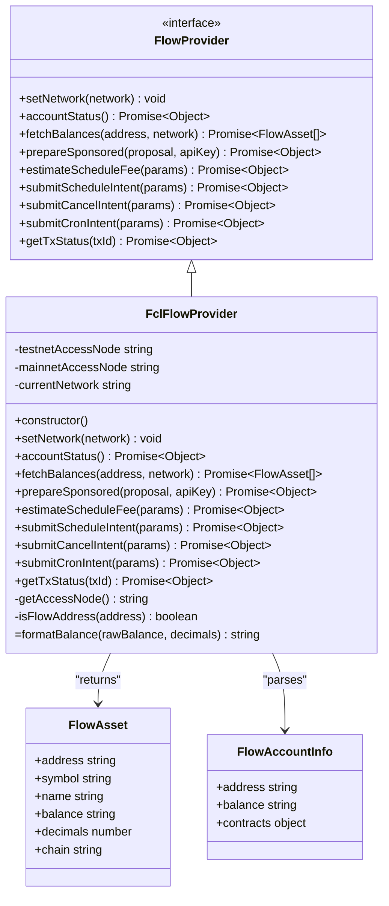

**Diagram sources**
- [flow.ts:19-37](file://apps-runtime/src/providers/flow.ts#L19-L37)
- [flow.ts:39-191](file://apps-runtime/src/providers/flow.ts#L39-L191)

The provider interface ensures consistent behavior across different network environments while allowing for flexible implementation details.

**Section sources**
- [flow.ts:1-191](file://apps-runtime/src/providers/flow.ts#L1-L191)

### Network Configuration

The integration supports both Flow testnet and mainnet environments with automatic access node selection:

| Network | Access Node URL | Purpose |
|---------|----------------|---------|
| Testnet | `https://rest-testnet.onflow.org` | Development and testing |
| Mainnet | `https://rest-mainnet.onflow.org` | Production deployment |

The network configuration automatically adapts based on user preferences and maintains backward compatibility with existing configurations.

**Section sources**
- [flow.ts:40-59](file://apps-runtime/src/providers/flow.ts#L40-L59)
- [flow.rs:36-47](file://src-tauri/src/services/apps/flow.rs#L36-L47)

## New Flow Actions System

### Flow Actions Composition Engine

The Flow Actions system provides composable DeFi operation previews with structured planning capabilities:

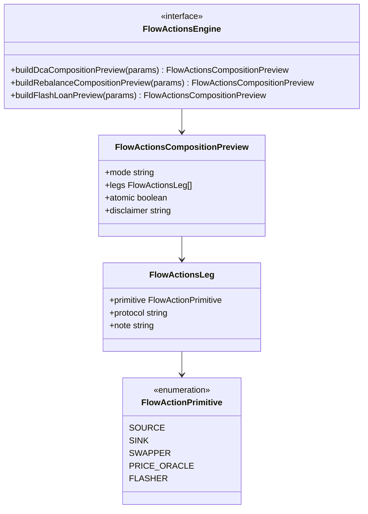

**Diagram sources**
- [flow-actions.ts:5-80](file://apps-runtime/src/providers/flow-actions.ts#L5-L80)

The system supports three primary composition types:

1. **DCA Compositions**: Dollar-cost averaging with source → swapper → sink legs
2. **Rebalance Compositions**: Multi-leg portfolio rebalancing with price oracle
3. **Flash Loan Compositions**: High-risk arbitrage with flasher → swapper → sink legs

**Section sources**
- [flow-actions.ts:1-80](file://apps-runtime/src/providers/flow-actions.ts#L1-L80)

### Flow Actions Service Integration

The Rust backend provides comprehensive Flow Actions service integration:

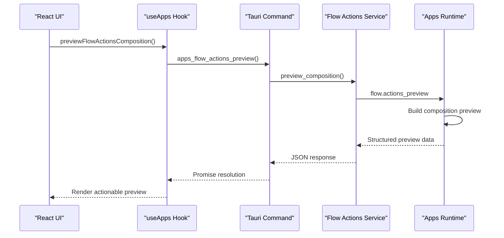

**Diagram sources**
- [flow_actions.rs:7-39](file://src-tauri/src/services/apps/flow_actions.rs#L7-L39)
- [main.ts:374-405](file://apps-runtime/src/main.ts#L374-L405)

**Section sources**
- [flow_actions.rs:1-39](file://src-tauri/src/services/apps/flow_actions.rs#L1-L39)
- [main.ts:374-405](file://apps-runtime/src/main.ts#L374-L405)

## Flow Bridge Functionality

### Cross-VM Bridge System

The Flow Bridge enables seamless token transfers between Cadence and Flow EVM virtual machines:

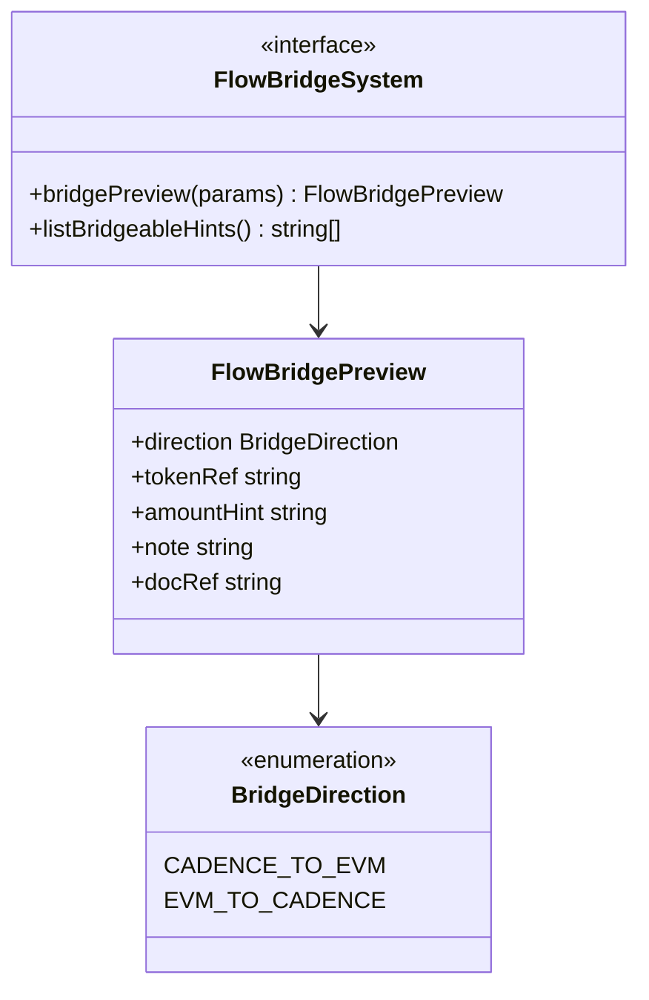

**Diagram sources**
- [flow-bridge.ts:5-36](file://apps-runtime/src/providers/flow-bridge.ts#L5-L36)

The bridge system provides comprehensive metadata for cross-VM transfers with important documentation references and validation hints.

**Section sources**
- [flow-bridge.ts:1-36](file://apps-runtime/src/providers/flow-bridge.ts#L1-L36)

### Bridge Service Integration

The Rust backend manages bridge preview generation and validation:

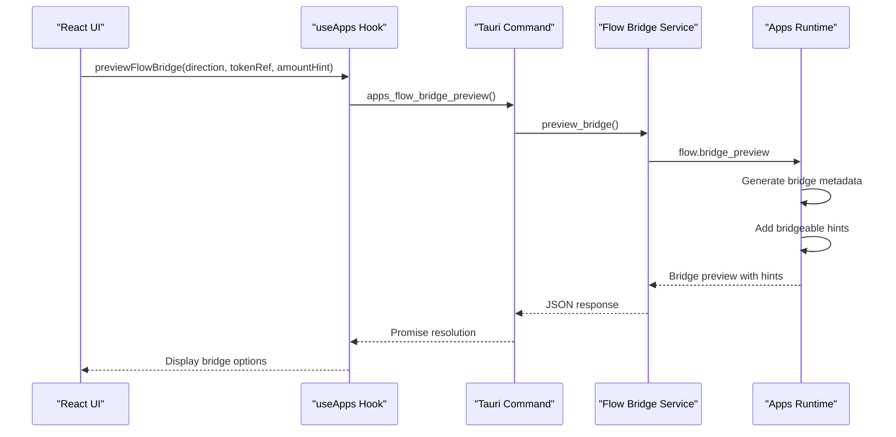

**Diagram sources**
- [flow_bridge.rs:7-40](file://src-tauri/src/services/apps/flow_bridge.rs#L7-L40)
- [main.ts:406-421](file://apps-runtime/src/main.ts#L406-L421)

**Section sources**
- [flow_bridge.rs:1-40](file://src-tauri/src/services/apps/flow_bridge.rs#L1-L40)
- [main.ts:406-421](file://apps-runtime/src/main.ts#L406-L421)

## Enhanced Transaction Management

### Advanced Transaction Submission

The enhanced transaction management system supports session keys and improved authorization:

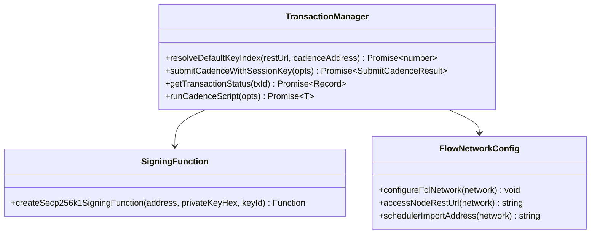

**Diagram sources**
- [flow-tx.ts:29-122](file://apps-runtime/src/providers/flow-tx.ts#L29-L122)
- [flow-signing.ts:32-58](file://apps-runtime/src/providers/flow-signing.ts#L32-L58)
- [flow-network.ts:25-34](file://apps-runtime/src/providers/flow-network.ts#L25-L34)

The system provides comprehensive transaction lifecycle management with session key support and automatic key resolution.

**Section sources**
- [flow-tx.ts:1-122](file://apps-runtime/src/providers/flow-tx.ts#L1-L122)
- [flow-signing.ts:1-58](file://apps-runtime/src/providers/flow-signing.ts#L1-L58)
- [flow-network.ts:1-34](file://apps-runtime/src/providers/flow-network.ts#L1-L34)

### Flow Scheduler Integration

The Flow Scheduler provides advanced transaction scheduling and management capabilities:

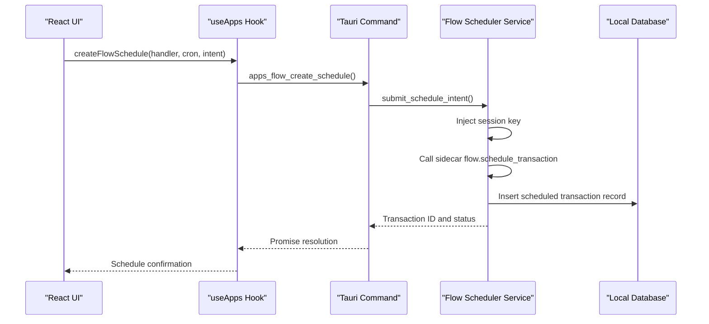

**Diagram sources**
- [flow_scheduler.rs:68-131](file://src-tauri/src/services/apps/flow_scheduler.rs#L68-L131)
- [apps.rs:606-657](file://src-tauri/src/commands/apps.rs#L606-L657)

**Section sources**
- [flow_scheduler.rs:1-277](file://src-tauri/src/services/apps/flow_scheduler.rs#L1-L277)
- [apps.rs:557-657](file://src-tauri/src/commands/apps.rs#L557-L657)

## Configuration Management

### Flow Integration Configuration Schema

The Flow integration uses a structured configuration system that supports both EVM and Cadence address types:

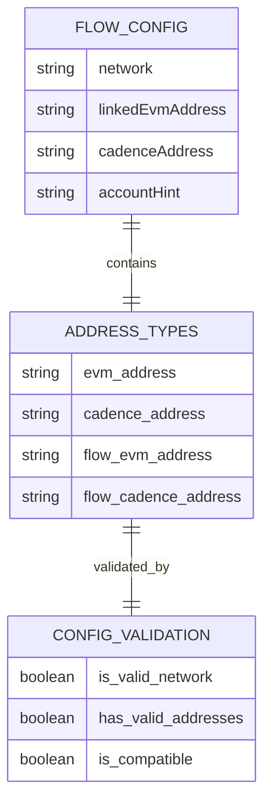

**Diagram sources**
- [apps.ts:57-65](file://src/lib/apps.ts#L57-L65)
- [apps.ts:137-166](file://src/lib/apps.ts#L137-L166)

The configuration system includes robust validation mechanisms to ensure address compatibility and prevent common integration errors.

**Section sources**
- [apps.ts:1-340](file://src/lib/apps.ts#L1-L340)

### Configuration Parsing and Validation

The integration includes sophisticated parsing and validation logic:

**Diagram sources**
- [apps.ts:137-166](file://src/lib/apps.ts#L137-L166)
- [apps.ts:127-135](file://src/lib/apps.ts#L127-L135)

**Section sources**
- [apps.ts:127-166](file://src/lib/apps.ts#L127-L166)

## API Endpoints and Operations

### Enhanced Sidecar Runtime Operations

The Flow integration exposes several key operations through the sidecar runtime with new capabilities:

| Operation | Purpose | Parameters | Response |
|-----------|---------|------------|----------|
| `flow.account_status` | Check network connectivity | `{ network: string }` | `{ connected: boolean, network: string }` |
| `flow.fetch_balances` | Retrieve account balances | `{ address: string, network: string }` | `{ assets: FlowAsset[] }` |
| `flow.prepare_sponsored` | Prepare sponsored transactions | `{ summary: string, apiKey: string, network: string }` | `{ status: string, cadencePreview: string }` |
| `flow.estimate_fee` | Estimate transaction fees | `{ network: string, executionEffort: number, priorityRaw: number, dataSizeMB: string }` | `{ fee: string, gasEstimate: number }` |
| `flow.schedule_transaction` | Submit scheduled transactions | `{ network: string, privateKeyHex: string, cadenceAddress: string, intentJson: string }` | `{ txId: string, status: string }` |
| `flow.cancel_scheduled` | Cancel scheduled transactions | `{ network: string, privateKeyHex: string, cadenceAddress: string, targetTxId: string }` | `{ txId: string, status: string }` |
| `flow.setup_cron` | Setup recurring schedules | `{ network: string, privateKeyHex: string, cadenceAddress: string, cronExpression: string }` | `{ txId: string, status: string }` |
| `flow.get_tx_status` | Check transaction status | `{ txId: string }` | `{ status: number, statusCode: number, events: object[] }` |
| `flow.actions_preview` | Generate Flow Actions preview | `{ kind: string, parameters... }` | `{ mode: string, legs: FlowActionsLeg[], atomic: boolean }` |
| `flow.bridge_preview` | Generate bridge metadata | `{ direction: string, tokenRef: string, amountHint: string }` | `{ direction: string, tokenRef: string, hints: string[] }` |

Each operation is designed with security in mind, ensuring that sensitive operations are properly isolated and validated.

**Section sources**
- [main.ts:183-421](file://apps-runtime/src/main.ts#L183-L421)
- [flow.rs:49-164](file://src-tauri/src/services/apps/flow.rs#L49-L164)

### Tauri Command Integration

The Rust backend provides Tauri commands that bridge the frontend to the sidecar runtime with enhanced Flow capabilities:

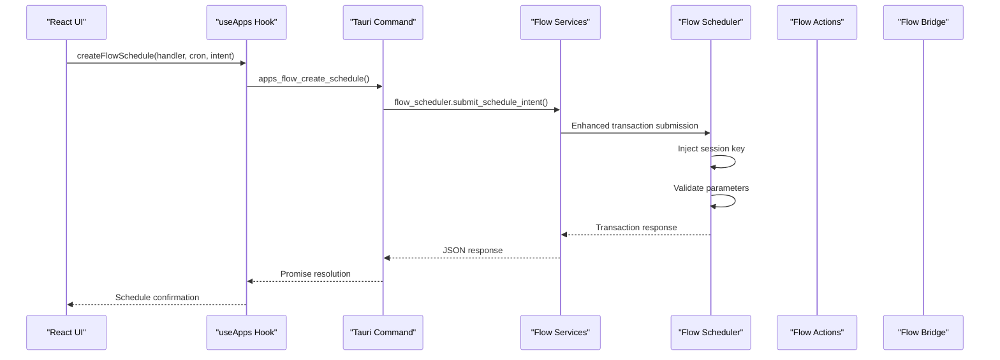

**Diagram sources**
- [apps.rs:606-657](file://src-tauri/src/commands/apps.rs#L606-L657)
- [flow_scheduler.rs:68-131](file://src-tauri/src/services/apps/flow_scheduler.rs#L68-L131)

**Section sources**
- [apps.rs:557-657](file://src-tauri/src/commands/apps.rs#L557-L657)
- [useApps.ts:1-189](file://src/hooks/useApps.ts#L1-L189)

## Address Validation and Normalization

### Address Type Detection

The integration includes sophisticated address validation to distinguish between different Flow address types:

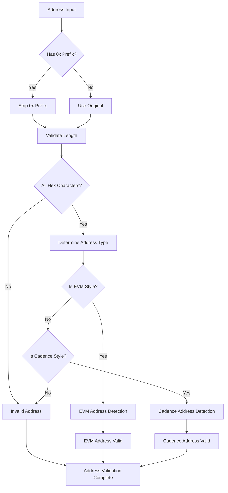

**Diagram sources**
- [flow_domain.rs:10-32](file://src-tauri/src/services/flow_domain.rs#L10-L32)
- [apps.ts:127-135](file://src/lib/apps.ts#L127-L135)

### Address Normalization

The system normalizes addresses for consistent handling across different components:

| Address Type | Pattern | Normalized Output |
|-------------|---------|-------------------|
| Flow EVM | `0x` + 40 hex | `0x` + 40 hex (uppercase) |
| Flow Cadence | 16 hex | 16 lowercase hex (no prefix) |
| Legacy EVM | `0x` + 40 hex | `0x` + 40 hex (uppercase) |
| Legacy Cadence | 16 hex | 16 lowercase hex (lowercase) |

**Section sources**
- [flow_domain.rs:25-45](file://src-tauri/src/services/flow_domain.rs#L25-L45)
- [apps.ts:127-135](file://src/lib/apps.ts#L127-L135)

## Integration Setup

### Frontend Configuration Interface

The Flow integration provides a comprehensive configuration interface within the application settings:

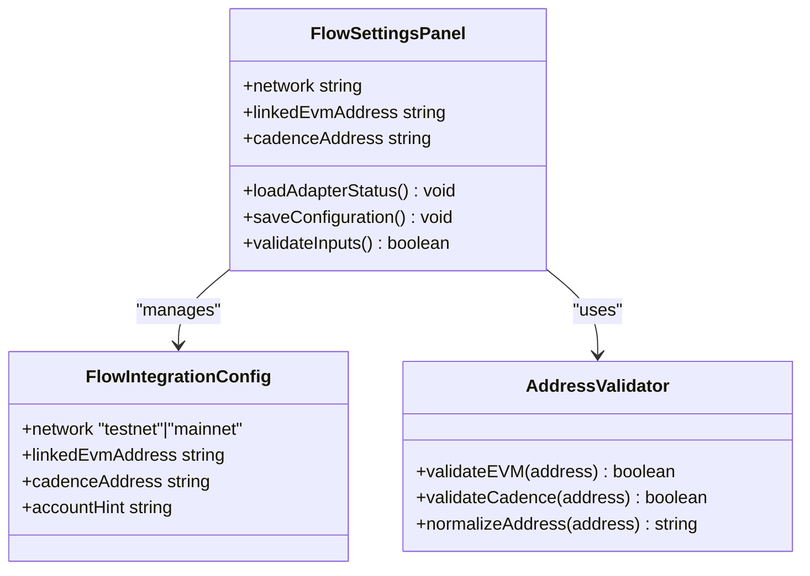

**Diagram sources**
- [AppSettingsPanel.tsx:361-575](file://src/components/apps/AppSettingsPanel.tsx#L361-L575)
- [apps.ts:57-65](file://src/lib/apps.ts#L57-L65)

The configuration interface includes intelligent suggestions and validation to guide users through the setup process.

**Section sources**
- [AppSettingsPanel.tsx:361-575](file://src/components/apps/AppSettingsPanel.tsx#L361-L575)
- [apps.ts:57-65](file://src/lib/apps.ts#L57-L65)

### Backend Service Integration

The Rust backend provides robust service layer integration with enhanced Flow capabilities:

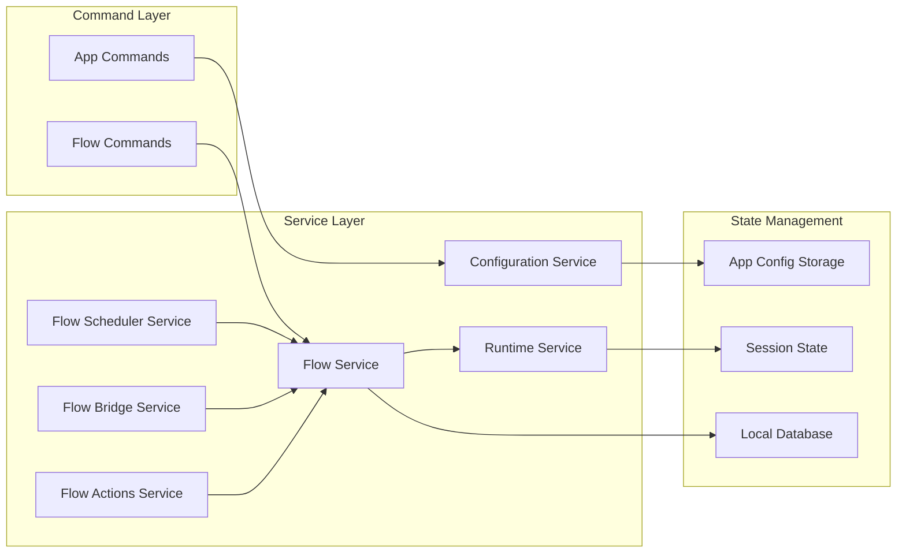

**Diagram sources**
- [flow.rs:1-164](file://src-tauri/src/services/apps/flow.rs#L1-L164)
- [flow_actions.rs:1-39](file://src-tauri/src/services/apps/flow_actions.rs#L1-L39)
- [flow_bridge.rs:1-40](file://src-tauri/src/services/apps/flow_bridge.rs#L1-L40)
- [flow_scheduler.rs:1-277](file://src-tauri/src/services/apps/flow_scheduler.rs#L1-L277)
- [apps.rs:1-776](file://src-tauri/src/commands/apps.rs#L1-L776)

**Section sources**
- [flow.rs:1-164](file://src-tauri/src/services/apps/flow.rs#L1-L164)
- [flow_actions.rs:1-39](file://src-tauri/src/services/apps/flow_actions.rs#L1-L39)
- [flow_bridge.rs:1-40](file://src-tauri/src/services/apps/flow_bridge.rs#L1-L40)
- [flow_scheduler.rs:1-277](file://src-tauri/src/services/apps/flow_scheduler.rs#L1-L277)
- [apps.rs:1-776](file://src-tauri/src/commands/apps.rs#L1-L776)

## Troubleshooting Guide

### Common Integration Issues

| Issue | Symptoms | Solution |
|-------|----------|----------|
| Network Connectivity Failure | Account status shows disconnected | Verify network configuration and access node availability |
| Invalid Address Format | Address validation fails | Ensure proper 16-character hex format for Cadence addresses |
| Transaction Preparation Error | Sponsored transaction fails | Check API key validity and session unlock status |
| Balance Retrieval Failure | Empty or partial balance data | Verify address format and network selection |
| Flow Actions Preview Error | Composition preview fails | Validate action parameters and protocol addresses |
| Bridge Preview Error | Cross-VM transfer metadata invalid | Check token references and bridge contract addresses |
| Transaction Scheduling Error | Scheduled transactions fail to submit | Verify session key injection and network configuration |

### Debug Information Collection

The integration provides comprehensive logging and debugging capabilities:

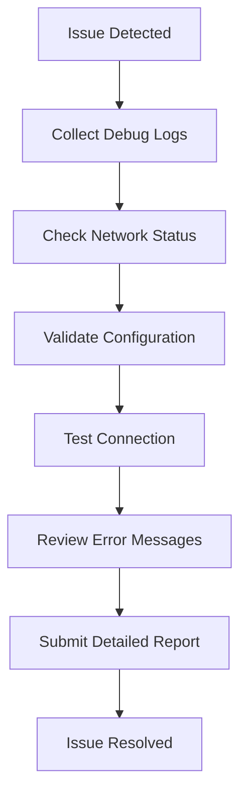

**Diagram sources**
- [flow.rs:63-76](file://src-tauri/src/services/apps/flow.rs#L63-L76)
- [main.ts:185-199](file://apps-runtime/src/main.ts#L185-L199)

### Performance Optimization

The integration includes several performance optimization strategies:

- **Lazy Loading**: Providers are loaded only when needed
- **Connection Pooling**: Efficient reuse of network connections
- **Caching**: Strategic caching of frequently accessed data
- **Timeout Management**: Proper timeout handling for network requests
- **Session Key Caching**: Efficient session key management for transaction signing

**Section sources**
- [main.ts:13-35](file://apps-runtime/src/main.ts#L13-L35)
- [flow.rs:63-76](file://src-tauri/src/services/apps/flow.rs#L63-L76)

## Best Practices

### Security Guidelines

1. **Address Validation**: Always validate addresses before processing
2. **Network Isolation**: Use appropriate network environments for different use cases
3. **Session Management**: Ensure proper session handling for sensitive operations
4. **Error Handling**: Implement comprehensive error handling and user feedback
5. **Transaction Authorization**: Use session keys for enhanced security in transaction signing
6. **Flow Actions Validation**: Always validate action compositions before execution
7. **Bridge Contract Verification**: Verify cross-VM bridge contracts on testnet before mainnet deployment

### Performance Recommendations

1. **Efficient Polling**: Use appropriate polling intervals for balance updates
2. **Batch Operations**: Combine multiple operations when possible
3. **Resource Cleanup**: Properly clean up resources after operations
4. **Monitoring**: Implement monitoring for performance metrics
5. **Cache Management**: Implement strategic caching for frequently accessed data

### User Experience Guidelines

1. **Clear Feedback**: Provide clear status indicators for all operations
2. **Graceful Degradation**: Handle failures gracefully with user-friendly messages
3. **Progress Indicators**: Show progress for long-running operations
4. **Helpful Documentation**: Provide contextual help and guidance
5. **Flow Actions Previews**: Always show actionable previews before executing complex operations
6. **Bridge Metadata**: Provide comprehensive cross-VM transfer metadata and warnings

The Flow integration represents a comprehensive solution for Flow blockchain connectivity within the SHADOW Protocol ecosystem, combining security, performance, and user experience excellence with advanced Flow Actions, bridging capabilities, and enhanced transaction management.