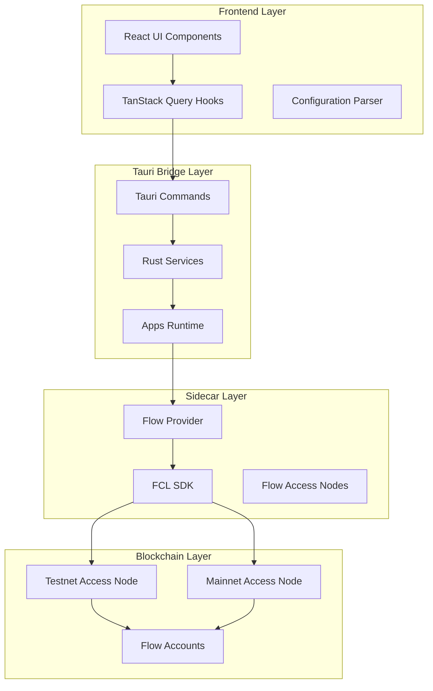
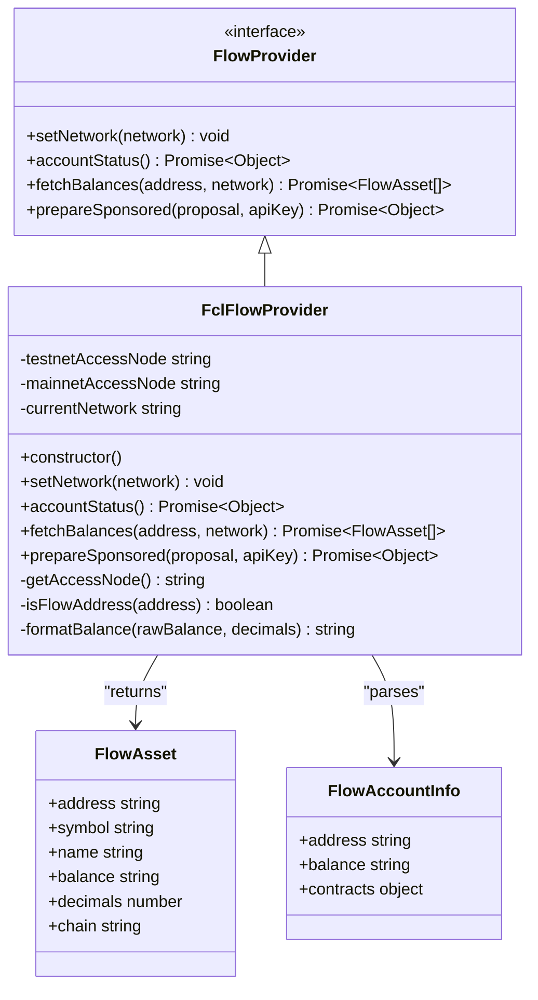
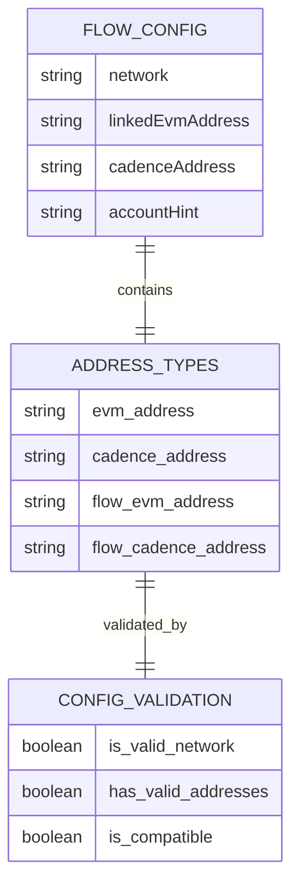
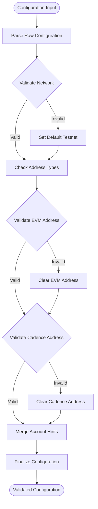
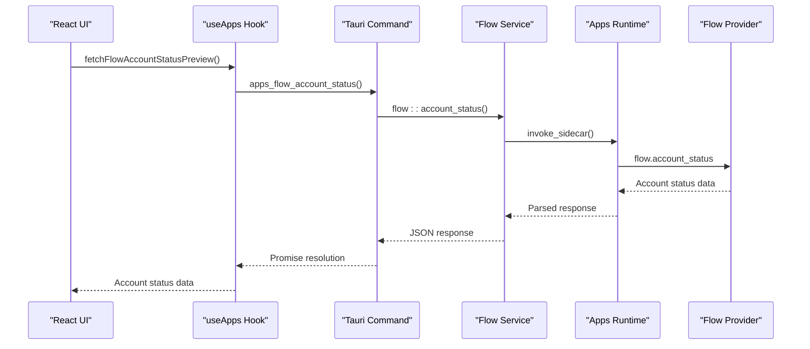
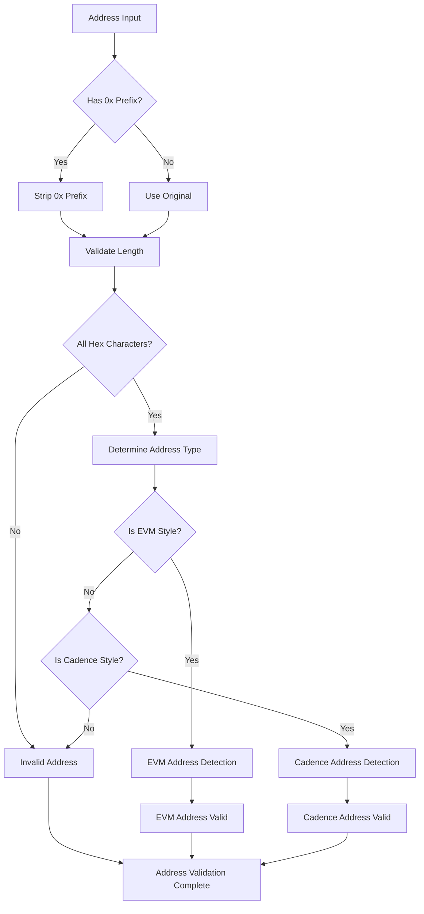
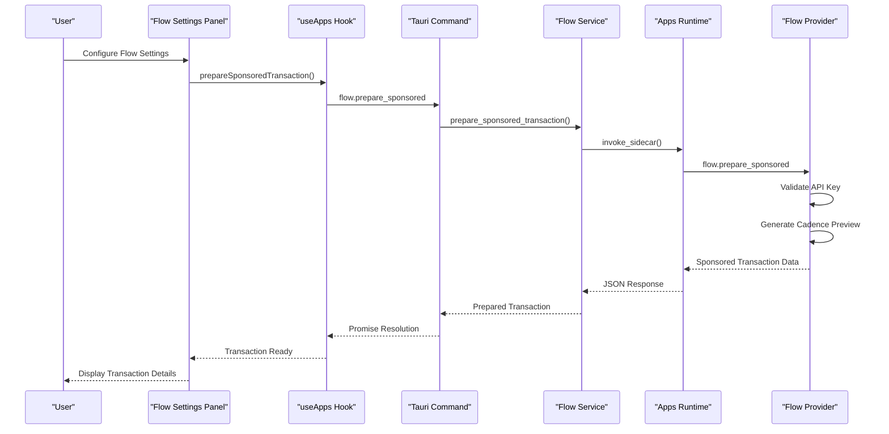
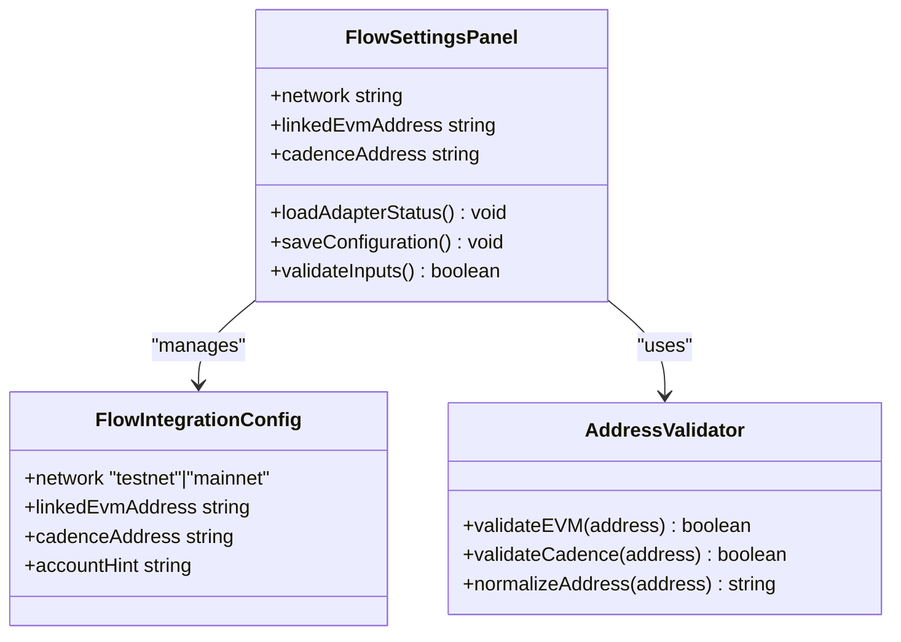
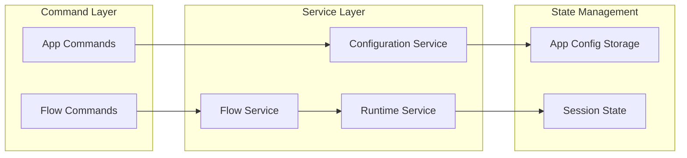
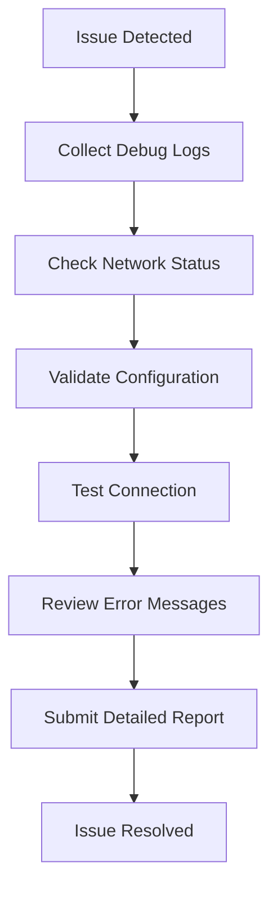

# Flow Integration Guide

<cite>
**Referenced Files in This Document**
- [flow.ts](file://apps-runtime/src/providers/flow.ts)
- [flow.rs](file://src-tauri/src/services/apps/flow.rs)
- [apps.ts](file://src/lib/apps.ts)
- [flow_domain.rs](file://src-tauri/src/services/flow_domain.rs)
- [main.ts](file://apps-runtime/src/main.ts)
- [runtime.rs](file://src-tauri/src/services/apps/runtime.rs)
- [apps.rs](file://src-tauri/src/commands/apps.rs)
- [AppSettingsPanel.tsx](file://src/components/apps/AppSettingsPanel.tsx)
- [useApps.ts](file://src/hooks/useApps.ts)
- [package.json](file://apps-runtime/package.json)
- [README.md](file://README.md)
</cite>

## Table of Contents
1. [Introduction](#introduction)
2. [Flow Integration Architecture](#flow-integration-architecture)
3. [Core Components](#core-components)
4. [Configuration Management](#configuration-management)
5. [API Endpoints and Operations](#api-endpoints-and-operations)
6. [Address Validation and Normalization](#address-validation-and-normalization)
7. [Transaction Preparation](#transaction-preparation)
8. [Integration Setup](#integration-setup)
9. [Troubleshooting Guide](#troubleshooting-guide)
10. [Best Practices](#best-practices)

## Introduction

The Flow Integration in SHADOW Protocol provides seamless connectivity to the Flow blockchain ecosystem through a secure, privacy-focused architecture. This integration supports both Flow EVM wallets and native Flow Cadence accounts, enabling comprehensive portfolio management and automated trading capabilities.

Flow is a modern blockchain designed specifically for digital assets and NFTs, featuring a unique dual-address system where users can operate with either Ethereum-style EVM addresses or native Flow Cadence addresses. The SHADOW integration handles both address types while maintaining strict security boundaries and privacy controls.

## Flow Integration Architecture

The Flow integration follows a multi-layered architecture that ensures security, performance, and maintainability:

**Diagram sources**
- [AppSettingsPanel.tsx:361-575](file://src/components/apps/AppSettingsPanel.tsx#L361-L575)
- [apps.rs:324-326](file://src-tauri/src/commands/apps.rs#L324-L326)
- [runtime.rs:69-144](file://src-tauri/src/services/apps/runtime.rs#L69-L144)

The architecture consists of four distinct layers:

1. **Frontend Layer**: React components and hooks that manage user interactions
2. **Tauri Bridge Layer**: Rust commands and services that handle secure communication
3. **Sidecar Layer**: Isolated Bun processes running integration adapters
4. **Blockchain Layer**: Flow network access nodes and account data

**Section sources**
- [README.md:135-146](file://README.md#L135-L146)
- [runtime.rs:1-144](file://src-tauri/src/services/apps/runtime.rs#L1-L144)

## Core Components

### Flow Provider Interface

The Flow integration defines a comprehensive provider interface that abstracts blockchain interactions:

**Diagram sources**
- [flow.ts:19-37](file://apps-runtime/src/providers/flow.ts#L19-L37)
- [flow.ts:39-191](file://apps-runtime/src/providers/flow.ts#L39-L191)

The provider interface ensures consistent behavior across different network environments while allowing for flexible implementation details.

**Section sources**
- [flow.ts:1-191](file://apps-runtime/src/providers/flow.ts#L1-L191)

### Network Configuration

The integration supports both Flow testnet and mainnet environments with automatic access node selection:

| Network | Access Node URL | Purpose |
|---------|----------------|---------|
| Testnet | `https://rest-testnet.onflow.org` | Development and testing |
| Mainnet | `https://rest-mainnet.onflow.org` | Production deployment |

The network configuration automatically adapts based on user preferences and maintains backward compatibility with existing configurations.

**Section sources**
- [flow.ts:40-59](file://apps-runtime/src/providers/flow.ts#L40-L59)
- [flow.rs:36-47](file://src-tauri/src/services/apps/flow.rs#L36-L47)

## Configuration Management

### Flow Integration Configuration Schema

The Flow integration uses a structured configuration system that supports both EVM and Cadence address types:

**Diagram sources**
- [apps.ts:57-65](file://src/lib/apps.ts#L57-L65)
- [apps.ts:137-166](file://src/lib/apps.ts#L137-L166)

The configuration system includes robust validation mechanisms to ensure address compatibility and prevent common integration errors.

**Section sources**
- [apps.ts:1-340](file://src/lib/apps.ts#L1-L340)

### Configuration Parsing and Validation

The integration includes sophisticated parsing and validation logic:

**Diagram sources**
- [apps.ts:137-166](file://src/lib/apps.ts#L137-L166)
- [apps.ts:127-135](file://src/lib/apps.ts#L127-L135)

**Section sources**
- [apps.ts:127-166](file://src/lib/apps.ts#L127-L166)

## API Endpoints and Operations

### Sidecar Runtime Operations

The Flow integration exposes several key operations through the sidecar runtime:

| Operation | Purpose | Parameters | Response |
|-----------|---------|------------|----------|
| `flow.account_status` | Check network connectivity | `{ network: string }` | `{ connected: boolean, network: string }` |
| `flow.fetch_balances` | Retrieve account balances | `{ address: string, network: string }` | `{ assets: FlowAsset[] }` |
| `flow.prepare_sponsored` | Prepare sponsored transactions | `{ summary: string, apiKey: string, network: string }` | `{ status: string, cadencePreview: string }` |

Each operation is designed with security in mind, ensuring that sensitive operations are properly isolated and validated.

**Section sources**
- [main.ts:174-208](file://apps-runtime/src/main.ts#L174-L208)
- [flow.rs:49-110](file://src-tauri/src/services/apps/flow.rs#L49-L110)

### Tauri Command Integration

The Rust backend provides Tauri commands that bridge the frontend to the sidecar runtime:

**Diagram sources**
- [useApps.ts:102-122](file://src/hooks/useApps.ts#L102-L122)
- [apps.rs:324-326](file://src-tauri/src/commands/apps.rs#L324-L326)
- [flow.rs:49-77](file://src-tauri/src/services/apps/flow.rs#L49-L77)

**Section sources**
- [apps.rs:324-326](file://src-tauri/src/commands/apps.rs#L324-L326)
- [useApps.ts:1-142](file://src/hooks/useApps.ts#L1-L142)

## Address Validation and Normalization

### Address Type Detection

The integration includes sophisticated address validation to distinguish between different Flow address types:

**Diagram sources**
- [flow_domain.rs:10-32](file://src-tauri/src/services/flow_domain.rs#L10-L32)
- [apps.ts:127-135](file://src/lib/apps.ts#L127-L135)

### Address Normalization

The system normalizes addresses for consistent handling across different components:

| Address Type | Pattern | Normalized Output |
|-------------|---------|-------------------|
| Flow EVM | `0x` + 40 hex | `0x` + 40 hex (uppercase) |
| Flow Cadence | 16 hex | 16 lowercase hex (no prefix) |
| Legacy EVM | `0x` + 40 hex | `0x` + 40 hex (uppercase) |
| Legacy Cadence | 16 hex | 16 lowercase hex (lowercase) |

**Section sources**
- [flow_domain.rs:25-45](file://src-tauri/src/services/flow_domain.rs#L25-L45)
- [apps.ts:127-135](file://src/lib/apps.ts#L127-L135)

## Transaction Preparation

### Sponsored Transaction Workflow

The Flow integration supports sponsored transactions through a secure preparation process:

**Diagram sources**
- [flow.ts:172-187](file://apps-runtime/src/providers/flow.ts#L172-L187)
- [flow.rs:112-145](file://src-tauri/src/services/apps/flow.rs#L112-L145)

The transaction preparation process includes comprehensive validation and preview generation to ensure user safety and transparency.

**Section sources**
- [flow.ts:172-187](file://apps-runtime/src/providers/flow.ts#L172-L187)
- [flow.rs:112-145](file://src-tauri/src/services/apps/flow.rs#L112-L145)

## Integration Setup

### Frontend Configuration Interface

The Flow integration provides a comprehensive configuration interface within the application settings:

**Diagram sources**
- [AppSettingsPanel.tsx:361-575](file://src/components/apps/AppSettingsPanel.tsx#L361-L575)
- [apps.ts:57-65](file://src/lib/apps.ts#L57-L65)

The configuration interface includes intelligent suggestions and validation to guide users through the setup process.

**Section sources**
- [AppSettingsPanel.tsx:361-575](file://src/components/apps/AppSettingsPanel.tsx#L361-L575)
- [apps.ts:57-65](file://src/lib/apps.ts#L57-L65)

### Backend Service Integration

The Rust backend provides robust service layer integration:

**Diagram sources**
- [flow.rs:1-146](file://src-tauri/src/services/apps/flow.rs#L1-L146)
- [apps.rs:1-380](file://src-tauri/src/commands/apps.rs#L1-L380)

**Section sources**
- [flow.rs:1-146](file://src-tauri/src/services/apps/flow.rs#L1-L146)
- [apps.rs:1-380](file://src-tauri/src/commands/apps.rs#L1-L380)

## Troubleshooting Guide

### Common Integration Issues

| Issue | Symptoms | Solution |
|-------|----------|----------|
| Network Connectivity Failure | Account status shows disconnected | Verify network configuration and access node availability |
| Invalid Address Format | Address validation fails | Ensure proper 16-character hex format for Cadence addresses |
| Transaction Preparation Error | Sponsored transaction fails | Check API key validity and session unlock status |
| Balance Retrieval Failure | Empty or partial balance data | Verify address format and network selection |

### Debug Information Collection

The integration provides comprehensive logging and debugging capabilities:

**Diagram sources**
- [flow.rs:63-76](file://src-tauri/src/services/apps/flow.rs#L63-L76)
- [main.ts:185-199](file://apps-runtime/src/main.ts#L185-L199)

### Performance Optimization

The integration includes several performance optimization strategies:

- **Lazy Loading**: Providers are loaded only when needed
- **Connection Pooling**: Efficient reuse of network connections
- **Caching**: Strategic caching of frequently accessed data
- **Timeout Management**: Proper timeout handling for network requests

**Section sources**
- [main.ts:13-35](file://apps-runtime/src/main.ts#L13-L35)
- [flow.rs:63-76](file://src-tauri/src/services/apps/flow.rs#L63-L76)

## Best Practices

### Security Guidelines

1. **Address Validation**: Always validate addresses before processing
2. **Network Isolation**: Use appropriate network environments for different use cases
3. **Session Management**: Ensure proper session handling for sensitive operations
4. **Error Handling**: Implement comprehensive error handling and user feedback

### Performance Recommendations

1. **Efficient Polling**: Use appropriate polling intervals for balance updates
2. **Batch Operations**: Combine multiple operations when possible
3. **Resource Cleanup**: Properly clean up resources after operations
4. **Monitoring**: Implement monitoring for performance metrics

### User Experience Guidelines

1. **Clear Feedback**: Provide clear status indicators for all operations
2. **Graceful Degradation**: Handle failures gracefully with user-friendly messages
3. **Progress Indicators**: Show progress for long-running operations
4. **Helpful Documentation**: Provide contextual help and guidance

The Flow integration represents a comprehensive solution for Flow blockchain connectivity within the SHADOW Protocol ecosystem, combining security, performance, and user experience excellence.