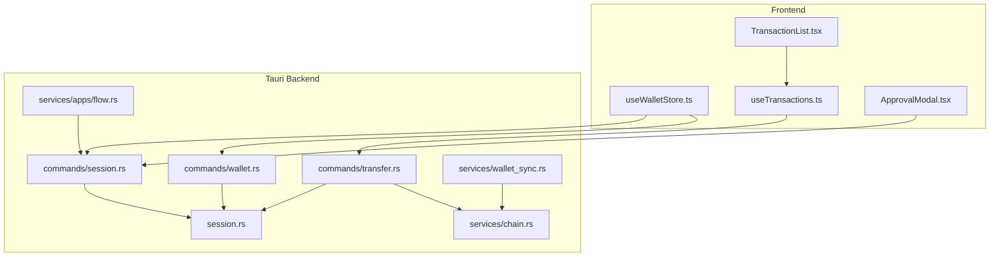
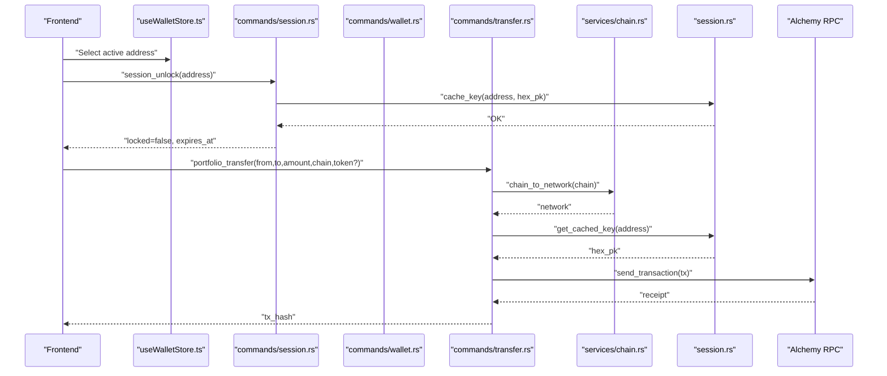
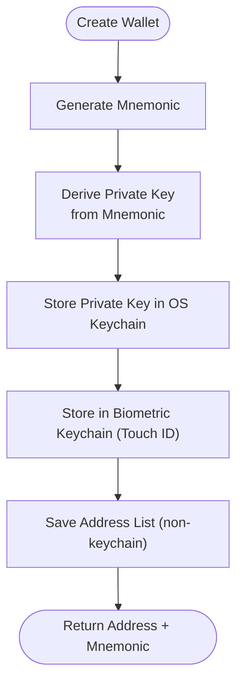
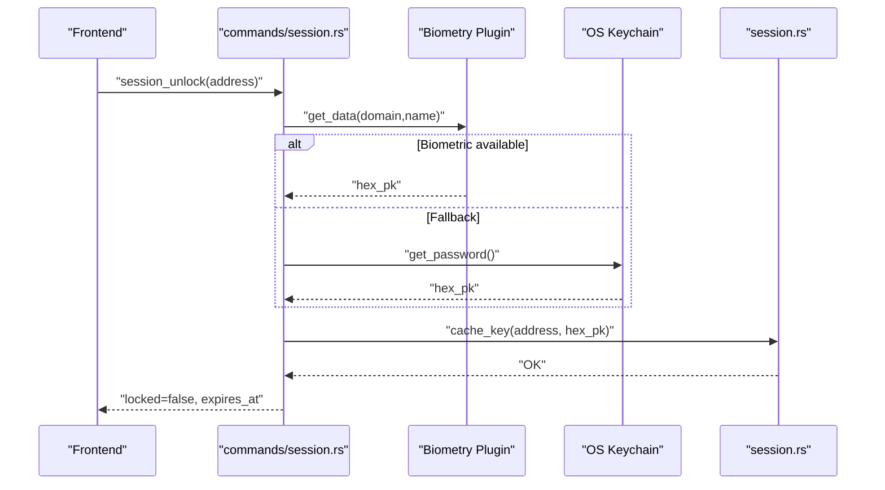
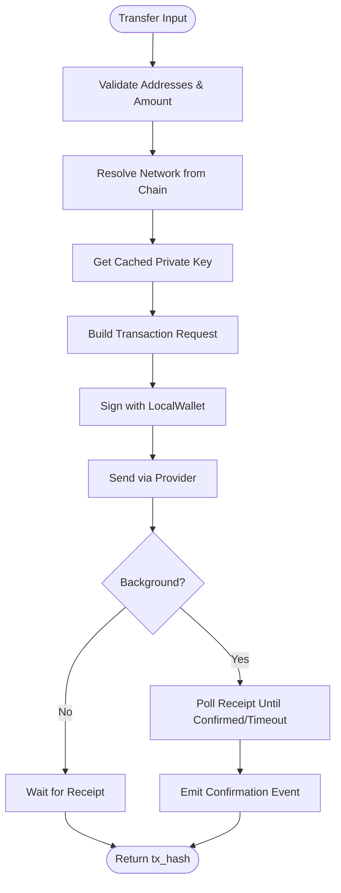
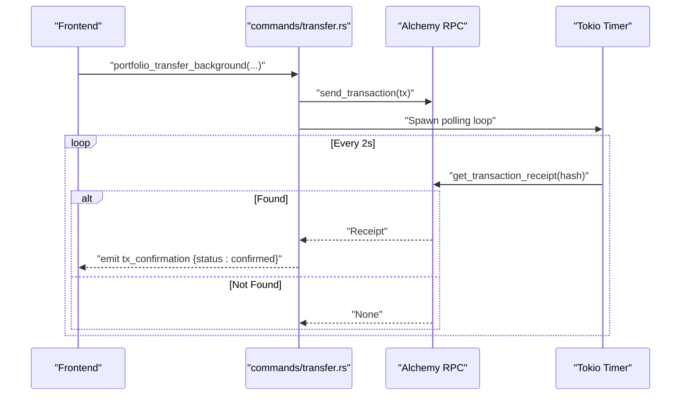
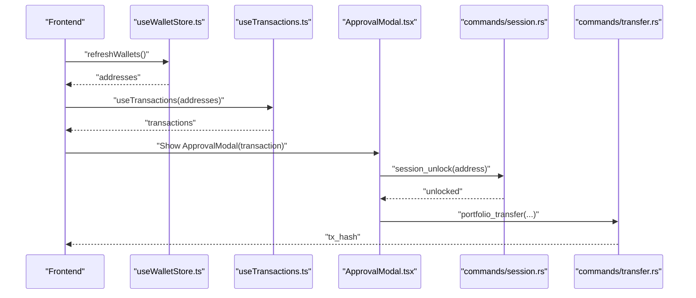
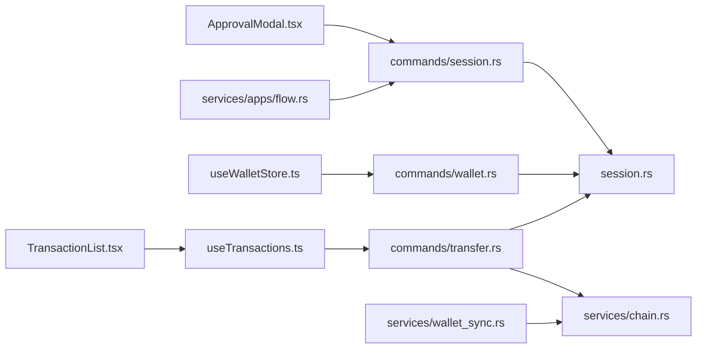

# Transaction Signing & Broadcasting

<cite>
**Referenced Files in This Document**
- [src-tauri/src/commands/transfer.rs](file://src-tauri/src/commands/transfer.rs)
- [src-tauri/src/commands/wallet.rs](file://src-tauri/src/commands/wallet.rs)
- [src-tauri/src/commands/session.rs](file://src-tauri/src/commands/session.rs)
- [src-tauri/src/services/chain.rs](file://src-tauri/src/services/chain.rs)
- [src-tauri/src/services/wallet_sync.rs](file://src-tauri/src/services/wallet_sync.rs)
- [src-tauri/src/services/apps/flow.rs](file://src-tauri/src/services/apps/flow.rs)
- [src-tauri/src/session.rs](file://src-tauri/src/session.rs)
- [src/hooks/useTransactions.ts](file://src/hooks/useTransactions.ts)
- [src/store/useWalletStore.ts](file://src/store/useWalletStore.ts)
- [src/components/portfolio/TransactionList.tsx](file://src/components/portfolio/TransactionList.tsx)
- [src/components/shared/ApprovalModal.tsx](file://src/components/shared/ApprovalModal.tsx)
- [src/types/wallet.ts](file://src/types/wallet.ts)
</cite>

## Table of Contents
1. [Introduction](#introduction)
2. [Project Structure](#project-structure)
3. [Core Components](#core-components)
4. [Architecture Overview](#architecture-overview)
5. [Detailed Component Analysis](#detailed-component-analysis)
6. [Dependency Analysis](#dependency-analysis)
7. [Performance Considerations](#performance-considerations)
8. [Troubleshooting Guide](#troubleshooting-guide)
9. [Conclusion](#conclusion)
10. [Appendices](#appendices)

## Introduction
This document explains the transaction signing and broadcasting mechanisms across supported networks. It covers multi-signature readiness, transaction construction, cryptographic signing, OS keychain and biometric integration, hardware wallet support, transaction serialization, fee calculation, gas optimization, broadcast mechanisms, error handling, transaction status monitoring, and the relationship between frontend components and backend signing services. It also addresses replay protection, nonce management, and network-specific transaction formats.

## Project Structure
The transaction lifecycle spans frontend React components and Tauri backend commands/services:
- Frontend: wallet selection, transaction queries, transaction list display, and approval modal.
- Backend: wallet creation/import, session unlock/cache, transfer execution, chain/network mapping, wallet sync, and Flow integration.

**Diagram sources**
- [src/store/useWalletStore.ts:16-47](file://src/store/useWalletStore.ts#L16-L47)
- [src/hooks/useTransactions.ts:23-47](file://src/hooks/useTransactions.ts#L23-L47)
- [src/components/portfolio/TransactionList.tsx:39-169](file://src/components/portfolio/TransactionList.tsx#L39-L169)
- [src/components/shared/ApprovalModal.tsx:25-84](file://src/components/shared/ApprovalModal.tsx#L25-L84)
- [src-tauri/src/commands/wallet.rs:169-200](file://src-tauri/src/commands/wallet.rs#L169-L200)
- [src-tauri/src/commands/session.rs:61-100](file://src-tauri/src/commands/session.rs#L61-L100)
- [src-tauri/src/commands/transfer.rs:78-160](file://src-tauri/src/commands/transfer.rs#L78-L160)
- [src-tauri/src/services/chain.rs:9-23](file://src-tauri/src/services/chain.rs#L9-L23)
- [src-tauri/src/session.rs:30-75](file://src-tauri/src/session.rs#L30-L75)
- [src-tauri/src/services/wallet_sync.rs:260-452](file://src-tauri/src/services/wallet_sync.rs#L260-452)
- [src-tauri/src/services/apps/flow.rs:85-119](file://src-tauri/src/services/apps/flow.rs#L85-L119)

**Section sources**
- [src/store/useWalletStore.ts:16-47](file://src/store/useWalletStore.ts#L16-L47)
- [src/hooks/useTransactions.ts:23-47](file://src/hooks/useTransactions.ts#L23-L47)
- [src/components/portfolio/TransactionList.tsx:39-169](file://src/components/portfolio/TransactionList.tsx#L39-L169)
- [src/components/shared/ApprovalModal.tsx:25-84](file://src/components/shared/ApprovalModal.tsx#L25-L84)
- [src-tauri/src/commands/wallet.rs:169-200](file://src-tauri/src/commands/wallet.rs#L169-L200)
- [src-tauri/src/commands/session.rs:61-100](file://src-tauri/src/commands/session.rs#L61-L100)
- [src-tauri/src/commands/transfer.rs:78-160](file://src-tauri/src/commands/transfer.rs#L78-L160)
- [src-tauri/src/services/chain.rs:9-23](file://src-tauri/src/services/chain.rs#L9-L23)
- [src-tauri/src/session.rs:30-75](file://src-tauri/src/session.rs#L30-L75)
- [src-tauri/src/services/wallet_sync.rs:260-452](file://src-tauri/src/services/wallet_sync.rs#L260-452)
- [src-tauri/src/services/apps/flow.rs:85-119](file://src-tauri/src/services/apps/flow.rs#L85-L119)

## Core Components
- Wallet creation and key storage: Generates mnemonics, derives private keys, stores in OS keychain, and integrates biometric unlock.
- Session management: Maintains an in-memory cache of decrypted private keys with expiration and biometric-backed retrieval.
- Transfer execution: Builds transactions, signs with cached or keychain-derived keys, broadcasts via RPC, and monitors status.
- Chain/network mapping: Normalizes chain codes to RPC endpoints and display labels.
- Wallet synchronization: Background sync of tokens, NFTs, and transaction history across multiple networks.
- Flow integration: Sponsored transaction preparation leveraging session key material and sidecar runtime.
- Frontend transaction list and approval modal: Displays transaction history and collects human-in-the-loop approvals.

**Section sources**
- [src-tauri/src/commands/wallet.rs:169-200](file://src-tauri/src/commands/wallet.rs#L169-L200)
- [src-tauri/src/commands/session.rs:61-100](file://src-tauri/src/commands/session.rs#L61-L100)
- [src-tauri/src/commands/transfer.rs:78-160](file://src-tauri/src/commands/transfer.rs#L78-L160)
- [src-tauri/src/services/chain.rs:9-23](file://src-tauri/src/services/chain.rs#L9-L23)
- [src-tauri/src/services/wallet_sync.rs:260-452](file://src-tauri/src/services/wallet_sync.rs#L260-452)
- [src-tauri/src/services/apps/flow.rs:85-119](file://src-tauri/src/services/apps/flow.rs#L85-L119)
- [src/hooks/useTransactions.ts:23-47](file://src/hooks/useTransactions.ts#L23-L47)
- [src/components/portfolio/TransactionList.tsx:39-169](file://src/components/portfolio/TransactionList.tsx#L39-L169)
- [src/components/shared/ApprovalModal.tsx:25-84](file://src/components/shared/ApprovalModal.tsx#L25-L84)

## Architecture Overview
End-to-end transaction signing and broadcasting pipeline:

**Diagram sources**
- [src-tauri/src/commands/session.rs:61-100](file://src-tauri/src/commands/session.rs#L61-L100)
- [src-tauri/src/commands/wallet.rs:169-200](file://src-tauri/src/commands/wallet.rs#L169-L200)
- [src-tauri/src/commands/transfer.rs:78-160](file://src-tauri/src/commands/transfer.rs#L78-L160)
- [src-tauri/src/services/chain.rs:9-23](file://src-tauri/src/services/chain.rs#L9-L23)
- [src-tauri/src/session.rs:30-75](file://src-tauri/src/session.rs#L30-L75)

## Detailed Component Analysis

### Wallet Creation and Key Storage
- Generates a new mnemonic and derives the first wallet.
- Stores the private key in OS keychain and optionally in biometric-protected storage.
- Persists a list of derived addresses separately to avoid keychain prompts on startup.

**Diagram sources**
- [src-tauri/src/commands/wallet.rs:169-200](file://src-tauri/src/commands/wallet.rs#L169-L200)
- [src-tauri/src/commands/wallet.rs:128-132](file://src-tauri/src/commands/wallet.rs#L128-L132)
- [src-tauri/src/commands/wallet.rs:134-148](file://src-tauri/src/commands/wallet.rs#L134-L148)
- [src-tauri/src/commands/wallet.rs:157-161](file://src-tauri/src/commands/wallet.rs#L157-L161)

**Section sources**
- [src-tauri/src/commands/wallet.rs:169-200](file://src-tauri/src/commands/wallet.rs#L169-L200)
- [src-tauri/src/commands/wallet.rs:128-132](file://src-tauri/src/commands/wallet.rs#L128-L132)
- [src-tauri/src/commands/wallet.rs:134-148](file://src-tauri/src/commands/wallet.rs#L134-L148)
- [src-tauri/src/commands/wallet.rs:157-161](file://src-tauri/src/commands/wallet.rs#L157-L161)

### Session Unlock and Biometric Authentication
- Unlocks a wallet by retrieving the private key from biometric or keychain storage.
- Caches the decrypted key in memory with inactivity-based expiry.
- Provides session status and lock controls.

**Diagram sources**
- [src-tauri/src/commands/session.rs:61-100](file://src-tauri/src/commands/session.rs#L61-L100)
- [src-tauri/src/session.rs:30-75](file://src-tauri/src/session.rs#L30-L75)

**Section sources**
- [src-tauri/src/commands/session.rs:61-100](file://src-tauri/src/commands/session.rs#L61-L100)
- [src-tauri/src/session.rs:30-75](file://src-tauri/src/session.rs#L30-L75)

### Transaction Construction and Signing
- Validates inputs, resolves chain to RPC endpoint, retrieves cached private key, constructs transaction (ETH or ERC-20), signs, and sends.
- Supports background mode with periodic polling for confirmation.

**Diagram sources**
- [src-tauri/src/commands/transfer.rs:78-160](file://src-tauri/src/commands/transfer.rs#L78-L160)
- [src-tauri/src/commands/transfer.rs:162-280](file://src-tauri/src/commands/transfer.rs#L162-L280)
- [src-tauri/src/services/chain.rs:9-23](file://src-tauri/src/services/chain.rs#L9-L23)
- [src-tauri/src/session.rs:30-75](file://src-tauri/src/session.rs#L30-L75)

**Section sources**
- [src-tauri/src/commands/transfer.rs:78-160](file://src-tauri/src/commands/transfer.rs#L78-L160)
- [src-tauri/src/commands/transfer.rs:162-280](file://src-tauri/src/commands/transfer.rs#L162-L280)
- [src-tauri/src/services/chain.rs:9-23](file://src-tauri/src/services/chain.rs#L9-L23)
- [src-tauri/src/session.rs:30-75](file://src-tauri/src/session.rs#L30-L75)

### Multi-Signature Workflow
- The codebase supports single-signer workflows with OS keychain and biometric storage. Multi-signature is not implemented in the referenced files. To enable multi-signature:
  - Extend transaction construction to accept multiple signatures and aggregate them.
  - Integrate with a multi-signature wallet service or hardware device that returns aggregated signatures.
  - Add signature verification and submission logic to the broadcast phase.

[No sources needed since this section provides conceptual guidance]

### Transaction Serialization, Fee Calculation, and Gas Optimization
- Serialization: Transaction requests are constructed using the provider library and serialized for broadcast.
- Fees and gas: The implementation does not explicitly set gas price/gas limit; it relies on provider defaults. To optimize:
  - Query recommended gas price and limits from the network.
  - Apply dynamic fee market parameters for EIP-1559-compatible networks.
  - Add configurable slippage and tolerance thresholds.

[No sources needed since this section provides conceptual guidance]

### Broadcast Mechanisms Across Networks
- Supported chains are mapped to RPC endpoints. The system targets Ethereum, Base, Polygon, and Flow EVM networks, with optional Flow Cadence integration.
- Network-specific formats: ETH native transfers and ERC-20 token transfers use different calldata encodings.

**Section sources**
- [src-tauri/src/services/chain.rs:9-23](file://src-tauri/src/services/chain.rs#L9-L23)
- [src-tauri/src/commands/transfer.rs:128-146](file://src-tauri/src/commands/transfer.rs#L128-L146)

### Transaction Status Monitoring
- Background mode spawns a polling loop to check transaction receipts and emits a confirmation event upon completion or failure.
- Frontend listens for transaction confirmation events and updates the UI accordingly.

**Diagram sources**
- [src-tauri/src/commands/transfer.rs:162-280](file://src-tauri/src/commands/transfer.rs#L162-L280)

**Section sources**
- [src-tauri/src/commands/transfer.rs:162-280](file://src-tauri/src/commands/transfer.rs#L162-L280)

### Replay Protection, Nonce Management, and Network Formats
- Replay protection: Transactions are bound to chain IDs during signing to prevent cross-chain replay.
- Nonce: The provider middleware manages nonce assignment; explicit nonce handling is not shown in the referenced code.
- Network formats: ETH vs ERC-20 calldata and ABI encoding are handled per network.

**Section sources**
- [src-tauri/src/commands/transfer.rs:108-114](file://src-tauri/src/commands/transfer.rs#L108-L114)
- [src-tauri/src/commands/transfer.rs:128-146](file://src-tauri/src/commands/transfer.rs#L128-L146)

### Hardware Wallet Support
- The codebase does not include hardware wallet integration. To integrate:
  - Use a hardware signer interface compatible with the signing middleware.
  - Prompt the user to confirm transactions on the device before signing.
  - Validate device connectivity and session state prior to signing.

[No sources needed since this section provides conceptual guidance]

### Frontend-Backend Relationship and Approval Workflows
- Frontend components query wallet lists and transactions, display approval modals, and listen for confirmation events.
- Backend commands coordinate session unlocking, signing, and broadcasting, emitting events for UI updates.

**Diagram sources**
- [src/store/useWalletStore.ts:23-37](file://src/store/useWalletStore.ts#L23-L37)
- [src/hooks/useTransactions.ts:23-47](file://src/hooks/useTransactions.ts#L23-L47)
- [src/components/shared/ApprovalModal.tsx:25-84](file://src/components/shared/ApprovalModal.tsx#L25-L84)
- [src-tauri/src/commands/session.rs:61-100](file://src-tauri/src/commands/session.rs#L61-L100)
- [src-tauri/src/commands/transfer.rs:78-160](file://src-tauri/src/commands/transfer.rs#L78-L160)

**Section sources**
- [src/store/useWalletStore.ts:23-37](file://src/store/useWalletStore.ts#L23-L37)
- [src/hooks/useTransactions.ts:23-47](file://src/hooks/useTransactions.ts#L23-L47)
- [src/components/shared/ApprovalModal.tsx:25-84](file://src/components/shared/ApprovalModal.tsx#L25-L84)
- [src-tauri/src/commands/session.rs:61-100](file://src-tauri/src/commands/session.rs#L61-L100)
- [src-tauri/src/commands/transfer.rs:78-160](file://src-tauri/src/commands/transfer.rs#L78-L160)

### Wallet Synchronization Across Networks
- Background sync fetches tokens, NFTs, and transaction history from Alchemy across multiple networks and persists them locally.
- Emits progress and completion events for UI feedback.

**Section sources**
- [src-tauri/src/services/wallet_sync.rs:260-452](file://src-tauri/src/services/wallet_sync.rs#L260-452)

### Flow Integration (Sponsored Transactions)
- Prepares Flow EVM sponsored transactions by forwarding the session key material to the sidecar runtime.
- Reads saved network preference from app configuration.

**Section sources**
- [src-tauri/src/services/apps/flow.rs:85-119](file://src-tauri/src/services/apps/flow.rs#L85-L119)

## Dependency Analysis
- Frontend depends on Tauri invocations to backend commands.
- Backend commands depend on session cache, chain mapping, and RPC providers.
- Wallet sync depends on chain mapping and local database persistence.

**Diagram sources**
- [src/store/useWalletStore.ts:23-37](file://src/store/useWalletStore.ts#L23-L37)
- [src/hooks/useTransactions.ts:23-47](file://src/hooks/useTransactions.ts#L23-L47)
- [src/components/portfolio/TransactionList.tsx:39-169](file://src/components/portfolio/TransactionList.tsx#L39-L169)
- [src/components/shared/ApprovalModal.tsx:25-84](file://src/components/shared/ApprovalModal.tsx#L25-L84)
- [src-tauri/src/commands/wallet.rs:169-200](file://src-tauri/src/commands/wallet.rs#L169-L200)
- [src-tauri/src/commands/session.rs:61-100](file://src-tauri/src/commands/session.rs#L61-L100)
- [src-tauri/src/commands/transfer.rs:78-160](file://src-tauri/src/commands/transfer.rs#L78-L160)
- [src-tauri/src/services/chain.rs:9-23](file://src-tauri/src/services/chain.rs#L9-L23)
- [src-tauri/src/session.rs:30-75](file://src-tauri/src/session.rs#L30-L75)
- [src-tauri/src/services/wallet_sync.rs:260-452](file://src-tauri/src/services/wallet_sync.rs#L260-452)
- [src-tauri/src/services/apps/flow.rs:85-119](file://src-tauri/src/services/apps/flow.rs#L85-L119)

**Section sources**
- [src-tauri/src/services/chain.rs:9-23](file://src-tauri/src/services/chain.rs#L9-L23)
- [src-tauri/src/session.rs:30-75](file://src-tauri/src/session.rs#L30-L75)
- [src-tauri/src/services/wallet_sync.rs:260-452](file://src-tauri/src/services/wallet_sync.rs#L260-452)
- [src-tauri/src/services/apps/flow.rs:85-119](file://src-tauri/src/services/apps/flow.rs#L85-L119)

## Performance Considerations
- Session caching reduces repeated keychain access and biometric prompts.
- Background transfer mode avoids blocking the UI while polling for receipts.
- Batched wallet sync across networks improves throughput but may require rate-limiting to avoid RPC throttling.

[No sources needed since this section provides general guidance]

## Troubleshooting Guide
Common errors and remedies:
- Missing API key: Ensure the Alchemy API key is configured; otherwise, transfer operations will fail early.
- Unsupported chain: Verify chain codes against supported networks.
- Wallet locked: Trigger session unlock to cache the private key before signing.
- Transaction dropped: In background mode, the system emits a failure status after timeout; reattempt or adjust parameters.

**Section sources**
- [src-tauri/src/commands/transfer.rs:80-92](file://src-tauri/src/commands/transfer.rs#L80-L92)
- [src-tauri/src/commands/transfer.rs:96-100](file://src-tauri/src/commands/transfer.rs#L96-L100)
- [src-tauri/src/commands/transfer.rs:240-273](file://src-tauri/src/commands/transfer.rs#L240-L273)

## Conclusion
The system provides a secure, user-friendly transaction signing pipeline with OS keychain and biometric integration, robust session management, and multi-network support. While single-signer workflows are implemented, multi-signature, explicit gas management, and hardware wallet integration are areas for future enhancement. The frontend-backend separation ensures responsive UX with reliable status reporting and human-in-the-loop approval flows.

## Appendices

### Data Types and Payloads
- Wallet operations mirror Rust command payloads for consistency between frontend and backend.

**Section sources**
- [src/types/wallet.ts:3-18](file://src/types/wallet.ts#L3-L18)