# Wallet & Blockchain Services

<cite>
**Referenced Files in This Document**
- [useWalletStore.ts](file://src/store/useWalletStore.ts)
- [useWalletSyncStore.ts](file://src/store/useWalletSyncStore.ts)
- [wallet.ts](file://src/types/wallet.ts)
- [CreateWalletModal.tsx](file://src/components/wallet/CreateWalletModal.tsx)
- [ImportWalletModal.tsx](file://src/components/wallet/ImportWalletModal.tsx)
- [wallet.rs](file://src-tauri/src/commands/wallet.rs)
- [wallet_sync.rs (commands)](file://src-tauri/src/commands/wallet_sync.rs)
- [wallet_sync.rs (service)](file://src-tauri/src/services/wallet_sync.rs)
- [chain.rs](file://src-tauri/src/services/chain.rs)
- [local_db.rs](file://src-tauri/src/services/local_db.rs)
- [portfolio_service.rs](file://src-tauri/src/services/portfolio_service.rs)
- [flow_domain.rs](file://src-tauri/src/services/flow_domain.rs)
- [flow.rs](file://src-tauri/src/services/apps/flow.rs)
- [runtime.rs](file://src-tauri/src/services/apps/runtime.rs)
- [state.rs](file://src-tauri/src/services/apps/state.rs)
- [AppSettingsPanel.tsx](file://src/components/apps/AppSettingsPanel.tsx)
</cite>

## Update Summary
**Changes Made**
- Added documentation for Enhanced Portfolio Service with Flow EVM and Cadence address support
- Updated network handling to include dual-address configuration system
- Added Flow domain utilities for address detection and normalization
- Documented mixed network portfolio aggregation capabilities
- Updated wallet synchronization service to handle Flow addresses alongside EVM addresses
- Added dual-address configuration system for Flow wallets

## Table of Contents
1. [Introduction](#introduction)
2. [Project Structure](#project-structure)
3. [Core Components](#core-components)
4. [Architecture Overview](#architecture-overview)
5. [Detailed Component Analysis](#detailed-component-analysis)
6. [Dependency Analysis](#dependency-analysis)
7. [Performance Considerations](#performance-considerations)
8. [Troubleshooting Guide](#troubleshooting-guide)
9. [Conclusion](#conclusion)

## Introduction
This document explains the wallet and blockchain service subsystem that powers multi-chain wallet management, secure key storage, and cross-chain synchronization. It covers:
- Multi-chain wallet creation and import workflows
- Secure key storage integration with OS keychain and optional biometric protection
- Wallet synchronization service including balance tracking, NFT discovery, transaction fetching, and state reconciliation
- Enhanced Portfolio Service with Flow EVM and Cadence address support
- Mixed network portfolio aggregation across EVM and Flow networks
- Dual-address configuration system for Flow wallets
- Blockchain RPC management and network switching
- Integration with external providers (Alchemy) and local storage
- Practical examples and troubleshooting guidance

## Project Structure
The wallet and blockchain services span React UI components, frontend stores, and a Tauri-backed Rust backend. The backend exposes Tauri commands for wallet operations and a background sync service that queries external providers and persists data locally. The system now includes enhanced Flow integration with dual-address support.

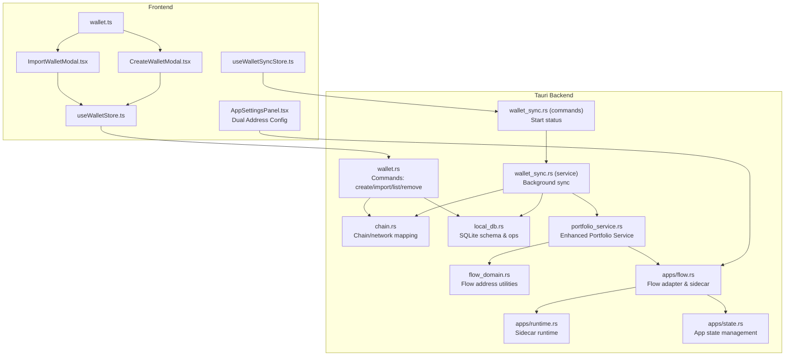

**Diagram sources**
- [CreateWalletModal.tsx:1-169](file://src/components/wallet/CreateWalletModal.tsx#L1-L169)
- [ImportWalletModal.tsx:1-181](file://src/components/wallet/ImportWalletModal.tsx#L1-L181)
- [AppSettingsPanel.tsx:510-543](file://src/components/apps/AppSettingsPanel.tsx#L510-L543)
- [useWalletStore.ts:1-48](file://src/store/useWalletStore.ts#L1-L48)
- [useWalletSyncStore.ts:1-199](file://src/store/useWalletSyncStore.ts#L1-L199)
- [wallet.rs:1-284](file://src-tauri/src/commands/wallet.rs#L1-L284)
- [wallet_sync.rs (commands):1-90](file://src-tauri/src/commands/wallet_sync.rs#L1-L90)
- [wallet_sync.rs (service):1-453](file://src-tauri/src/services/wallet_sync.rs#L1-L453)
- [chain.rs:1-62](file://src-tauri/src/services/chain.rs#L1-L62)
- [local_db.rs:1-800](file://src-tauri/src/services/local_db.rs#L1-L800)
- [portfolio_service.rs:1-636](file://src-tauri/src/services/portfolio_service.rs#L1-L636)
- [flow_domain.rs:1-101](file://src-tauri/src/services/flow_domain.rs#L1-L101)
- [flow.rs:1-146](file://src-tauri/src/services/apps/flow.rs#L1-L146)
- [runtime.rs:1-144](file://src-tauri/src/services/apps/runtime.rs#L1-L144)
- [state.rs:1-458](file://src-tauri/src/services/apps/state.rs#L1-L458)

**Section sources**
- [useWalletStore.ts:1-48](file://src/store/useWalletStore.ts#L1-L48)
- [useWalletSyncStore.ts:1-199](file://src/store/useWalletSyncStore.ts#L1-L199)
- [wallet.rs:1-284](file://src-tauri/src/commands/wallet.rs#L1-L284)
- [wallet_sync.rs (commands):1-90](file://src-tauri/src/commands/wallet_sync.rs#L1-L90)
- [wallet_sync.rs (service):1-453](file://src-tauri/src/services/wallet_sync.rs#L1-L453)
- [chain.rs:1-62](file://src-tauri/src/services/chain.rs#L1-L62)
- [local_db.rs:1-800](file://src-tauri/src/services/local_db.rs#L1-L800)
- [portfolio_service.rs:1-636](file://src-tauri/src/services/portfolio_service.rs#L1-L636)
- [flow_domain.rs:1-101](file://src-tauri/src/services/flow_domain.rs#L1-L101)
- [flow.rs:1-146](file://src-tauri/src/services/apps/flow.rs#L1-L146)
- [runtime.rs:1-144](file://src-tauri/src/services/apps/runtime.rs#L1-L144)
- [state.rs:1-458](file://src-tauri/src/services/apps/state.rs#L1-L458)

## Core Components
- Frontend stores and UI:
  - Wallet store manages addresses, active address, and wallet names.
  - Sync store orchestrates sync progress, completion, and notifications.
  - Wallet modals implement creation and import flows.
  - App settings panel provides dual-address configuration for Flow wallets.
- Backend wallet commands:
  - Create/import/list/remove wallets; store private keys in OS keychain and optionally biometric keychain.
  - Persist public address list in a JSON file outside keychain to avoid frequent OS prompts.
- Enhanced Portfolio Service:
  - Supports both EVM (`0x` 20-byte) and Cadence Flow (`0x` 16-digit) addresses.
  - Mixed network portfolio aggregation across EVM and Flow networks.
  - Flow domain utilities for address detection and normalization.
- Background sync service:
  - Fetch tokens, NFTs, and transactions across supported networks via Alchemy.
  - Emit progress and completion events to the UI.
  - Persist results to local SQLite database.
- Chain/network mapping:
  - Translate chain codes to provider networks and display names.
  - Enhanced support for Flow EVM and Cadence address formats.
- Local database:
  - Schema for wallets, tokens, NFTs, transactions, and portfolio snapshots.
  - Flow EVM chain code normalization for backward compatibility.

**Section sources**
- [useWalletStore.ts:1-48](file://src/store/useWalletStore.ts#L1-L48)
- [useWalletSyncStore.ts:1-199](file://src/store/useWalletSyncStore.ts#L1-L199)
- [CreateWalletModal.tsx:1-169](file://src/components/wallet/CreateWalletModal.tsx#L1-L169)
- [ImportWalletModal.tsx:1-181](file://src/components/wallet/ImportWalletModal.tsx#L1-L181)
- [AppSettingsPanel.tsx:510-543](file://src/components/apps/AppSettingsPanel.tsx#L510-L543)
- [wallet.rs:1-284](file://src-tauri/src/commands/wallet.rs#L1-L284)
- [portfolio_service.rs:1-636](file://src-tauri/src/services/portfolio_service.rs#L1-L636)
- [flow_domain.rs:1-101](file://src-tauri/src/services/flow_domain.rs#L1-L101)
- [wallet_sync.rs (service):1-453](file://src-tauri/src/services/wallet_sync.rs#L1-L453)
- [chain.rs:1-62](file://src-tauri/src/services/chain.rs#L1-L62)
- [local_db.rs:1-800](file://src-tauri/src/services/local_db.rs#L1-L800)

## Architecture Overview
The system integrates UI-driven wallet operations with a Rust backend that:
- Uses OS keychain to securely store private keys
- Optionally stores keys in biometric-protected keychain
- Exposes Tauri commands for wallet lifecycle operations
- Runs background sync jobs emitting progress and completion events
- Persists data to a local SQLite database
- Queries external providers (Alchemy) for balances, NFTs, and transactions
- **Enhanced**: Supports Flow EVM and Cadence addresses with dual-address configuration
- **Enhanced**: Mixed network portfolio aggregation across EVM and Flow networks

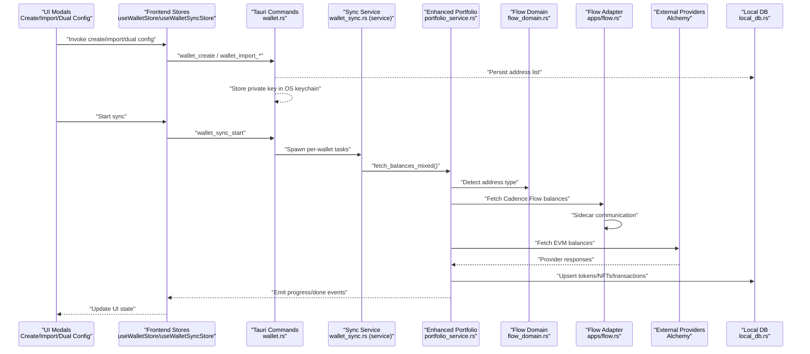

**Diagram sources**
- [CreateWalletModal.tsx:33-62](file://src/components/wallet/CreateWalletModal.tsx#L33-L62)
- [ImportWalletModal.tsx:51-94](file://src/components/wallet/ImportWalletModal.tsx#L51-L94)
- [AppSettingsPanel.tsx:510-543](file://src/components/apps/AppSettingsPanel.tsx#L510-L543)
- [useWalletStore.ts:23-43](file://src/store/useWalletStore.ts#L23-L43)
- [useWalletSyncStore.ts:64-72](file://src/store/useWalletSyncStore.ts#L64-L72)
- [wallet.rs:169-284](file://src-tauri/src/commands/wallet.rs#L169-L284)
- [wallet_sync.rs (commands):59-89](file://src-tauri/src/commands/wallet_sync.rs#L59-L89)
- [wallet_sync.rs (service):260-452](file://src-tauri/src/services/wallet_sync.rs#L260-L452)
- [portfolio_service.rs:363-419](file://src-tauri/src/services/portfolio_service.rs#L363-L419)
- [flow_domain.rs:10-45](file://src-tauri/src/services/flow_domain.rs#L10-L45)
- [flow.rs:79-110](file://src-tauri/src/services/apps/flow.rs#L79-L110)
- [local_db.rs:518-553](file://src-tauri/src/services/local_db.rs#L518-L553)

## Detailed Component Analysis

### Enhanced Portfolio Service with Flow Integration
The Portfolio Service now supports both EVM and Flow addresses with mixed network aggregation:

- **Address Type Detection**: Automatically distinguishes between EVM (`0x` 20-byte) and Cadence Flow (`0x` 16-digit) addresses.
- **Mixed Network Aggregation**: Combines balances from both EVM networks (via Alchemy) and Flow networks (via sidecar).
- **Dual-Address Support**: Handles wallets with both EVM and Flow addresses simultaneously.
- **Flow EVM Normalization**: Converts legacy `FLOW`/`FLOW-TEST` chain codes to `FLOW-EVM`/`FLOW-EVM-TEST` for consistency.

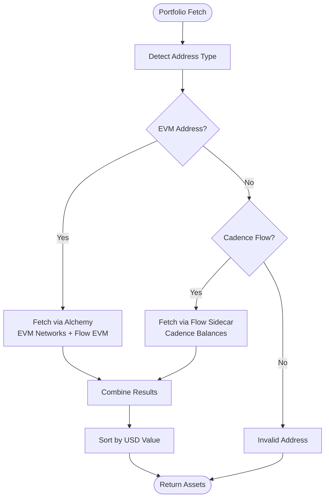

**Diagram sources**
- [portfolio_service.rs:363-419](file://src-tauri/src/services/portfolio_service.rs#L363-L419)
- [flow_domain.rs:10-45](file://src-tauri/src/services/flow_domain.rs#L10-L45)
- [flow.rs:79-110](file://src-tauri/src/services/apps/flow.rs#L79-L110)

**Section sources**
- [portfolio_service.rs:363-419](file://src-tauri/src/services/portfolio_service.rs#L363-L419)
- [flow_domain.rs:10-45](file://src-tauri/src/services/flow_domain.rs#L10-L45)
- [flow.rs:79-110](file://src-tauri/src/services/apps/flow.rs#L79-L110)

### Dual-Address Configuration System
The system now supports wallets with both EVM and Flow addresses:

- **EVM Address**: Standard `0x` + 40 hex character address for Flow EVM tokens
- **Cadence Address**: `0x` + 16 hex character address for native Flow tokens
- **Configuration UI**: Settings panel allows users to configure both address types
- **Automatic Detection**: System automatically detects and handles both address types during sync

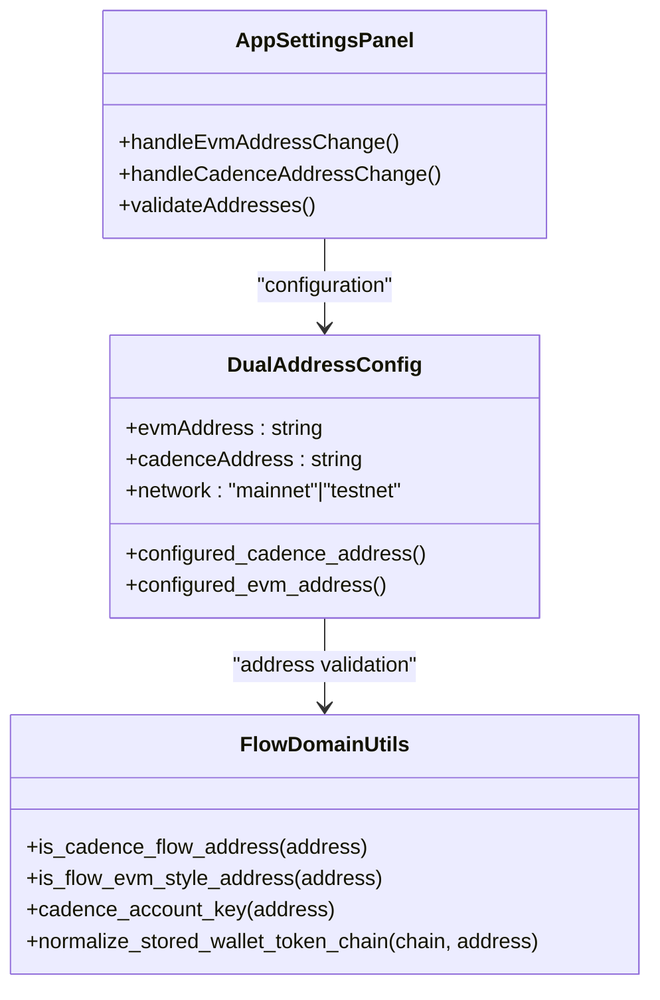

**Diagram sources**
- [AppSettingsPanel.tsx:510-543](file://src/components/apps/AppSettingsPanel.tsx#L510-L543)
- [flow_domain.rs:10-45](file://src-tauri/src/services/flow_domain.rs#L10-L45)
- [flow.rs:11-34](file://src-tauri/src/services/apps/flow.rs#L11-L34)

**Section sources**
- [AppSettingsPanel.tsx:510-543](file://src/components/apps/AppSettingsPanel.tsx#L510-L543)
- [flow_domain.rs:10-45](file://src-tauri/src/services/flow_domain.rs#L10-L45)
- [flow.rs:11-34](file://src-tauri/src/services/apps/flow.rs#L11-L34)

### Wallet Lifecycle Management
- Creation:
  - Generates a new mnemonic (12 or 24 words), derives the first EVM account, and stores the private key in OS keychain and optionally biometric keychain.
  - Adds the address to the public address list persisted in a JSON file.
- Import:
  - Supports importing via mnemonic or private key; validates inputs and repeats key storage and address registration steps.
- Listing and removal:
  - Lists addresses from the JSON file and removes both the address and associated keys from storage.
- **Enhanced**: Now supports Flow addresses alongside EVM addresses in the address list.

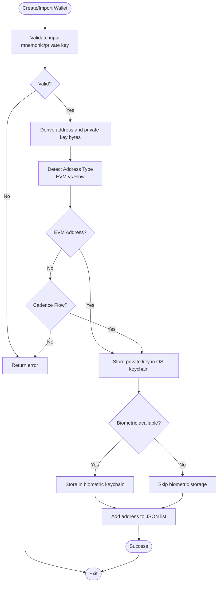

**Diagram sources**
- [wallet.rs:169-284](file://src-tauri/src/commands/wallet.rs#L169-L284)
- [flow_domain.rs:10-20](file://src-tauri/src/services/flow_domain.rs#L10-L20)

**Section sources**
- [wallet.rs:169-284](file://src-tauri/src/commands/wallet.rs#L169-L284)
- [flow_domain.rs:10-20](file://src-tauri/src/services/flow_domain.rs#L10-L20)
- [CreateWalletModal.tsx:33-62](file://src/components/wallet/CreateWalletModal.tsx#L33-L62)
- [ImportWalletModal.tsx:51-94](file://src/components/wallet/ImportWalletModal.tsx#L51-L94)

### Secure Key Storage and Biometric Integration
- Private keys are stored in OS keychain entries keyed by wallet address.
- Optional biometric keychain storage is used when available; on unsigned builds, fallback to OS keychain password prompt occurs.
- Address list is stored in a separate JSON file to avoid repeated OS prompts during startup or sync.
- **Enhanced**: Supports both EVM and Flow addresses with appropriate key storage strategies.

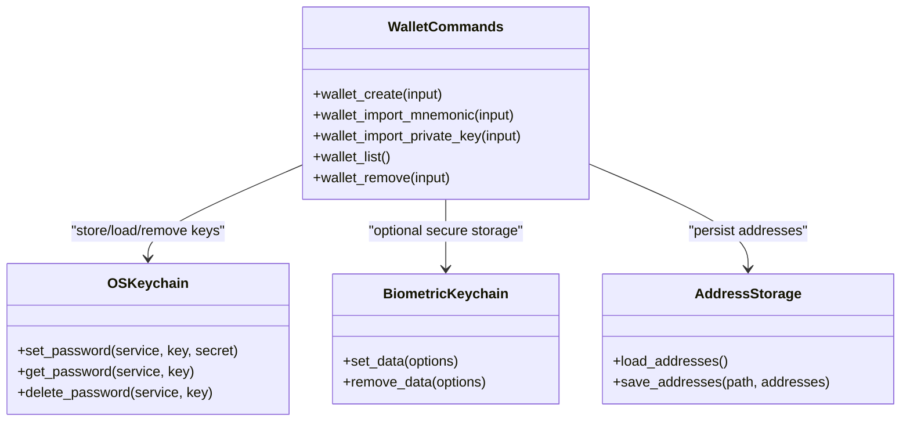

**Diagram sources**
- [wallet.rs:82-126](file://src-tauri/src/commands/wallet.rs#L82-L126)
- [wallet.rs:128-167](file://src-tauri/src/commands/wallet.rs#L128-L167)
- [wallet.rs:134-155](file://src-tauri/src/commands/wallet.rs#L134-L155)

**Section sources**
- [wallet.rs:2-4](file://src-tauri/src/commands/wallet.rs#L2-L4)
- [wallet.rs:82-126](file://src-tauri/src/commands/wallet.rs#L82-L126)
- [wallet.rs:128-167](file://src-tauri/src/commands/wallet.rs#L128-L167)
- [wallet.rs:134-155](file://src-tauri/src/commands/wallet.rs#L134-L155)

### Wallet Synchronization Service
- Trigger:
  - UI invokes a command to start syncing one or more addresses; the backend spawns concurrent tasks.
- Steps:
  - Enhanced portfolio service fetches tokens via Alchemy balances API for EVM addresses; upsert into local DB; compute portfolio snapshot.
  - Flow sidecar fetches balances for Cadence Flow addresses; upsert into local DB.
  - Fetch NFTs per network; upsert into local DB.
  - Fetch asset transfers via Alchemy RPC endpoint; upsert into local DB.
- Progress and completion:
  - Emits progress events with step, progress percentage, and wallet index/count.
  - Emits completion events with success/failure and final status updates.

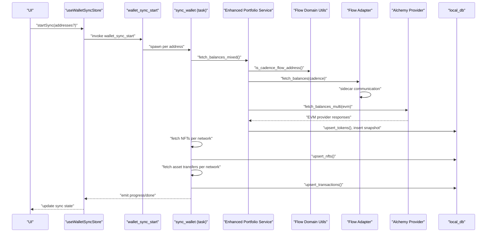

**Diagram sources**
- [useWalletSyncStore.ts:64-72](file://src/store/useWalletSyncStore.ts#L64-L72)
- [wallet_sync.rs (commands):59-89](file://src-tauri/src/commands/wallet_sync.rs#L59-L89)
- [wallet_sync.rs (service):260-452](file://src-tauri/src/services/wallet_sync.rs#L260-L452)
- [portfolio_service.rs:363-419](file://src-tauri/src/services/portfolio_service.rs#L363-L419)
- [flow_domain.rs:10-20](file://src-tauri/src/services/flow_domain.rs#L10-L20)
- [flow.rs:79-110](file://src-tauri/src/services/apps/flow.rs#L79-L110)
- [local_db.rs:518-553](file://src-tauri/src/services/local_db.rs#L518-L553)

**Section sources**
- [useWalletSyncStore.ts:10-73](file://src/store/useWalletSyncStore.ts#L10-L73)
- [wallet_sync.rs (commands):34-57](file://src-tauri/src/commands/wallet_sync.rs#L34-L57)
- [wallet_sync.rs (commands):59-89](file://src-tauri/src/commands/wallet_sync.rs#L59-L89)
- [wallet_sync.rs (service):260-452](file://src-tauri/src/services/wallet_sync.rs#L260-L452)
- [portfolio_service.rs:363-419](file://src-tauri/src/services/portfolio_service.rs#L363-L419)

### Blockchain RPC Management and Network Switching
- Supported networks are mapped from chain codes to provider network identifiers.
- Network selection adapts dynamically based on installed tool integrations (e.g., Flow).
- **Enhanced**: Flow EVM addresses use Alchemy RPC endpoints, while Cadence Flow addresses use sidecar communication.
- RPC calls for asset transfers use Alchemy's RPC endpoint with a standardized method.
- **Enhanced**: Flow domain utilities handle address type detection and chain code normalization.

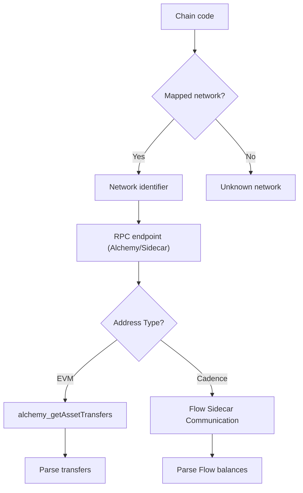

**Diagram sources**
- [chain.rs:6-18](file://src-tauri/src/services/chain.rs#L6-L18)
- [wallet_sync.rs (service):142-208](file://src-tauri/src/services/wallet_sync.rs#L142-L208)
- [flow_domain.rs:10-45](file://src-tauri/src/services/flow_domain.rs#L10-L45)

**Section sources**
- [chain.rs:1-62](file://src-tauri/src/services/chain.rs#L1-L62)
- [wallet_sync.rs (service):142-208](file://src-tauri/src/services/wallet_sync.rs#L142-L208)
- [flow_domain.rs:10-45](file://src-tauri/src/services/flow_domain.rs#L10-L45)

### Data Models and Local Storage
- Local schema includes tables for wallets, tokens, NFTs, transactions, and portfolio snapshots.
- Upsert operations maintain consistency across multi-chain assets.
- Indexes optimize queries for wallet, chain, and timestamps.
- **Enhanced**: Flow EVM chain code normalization for backward compatibility with legacy data.

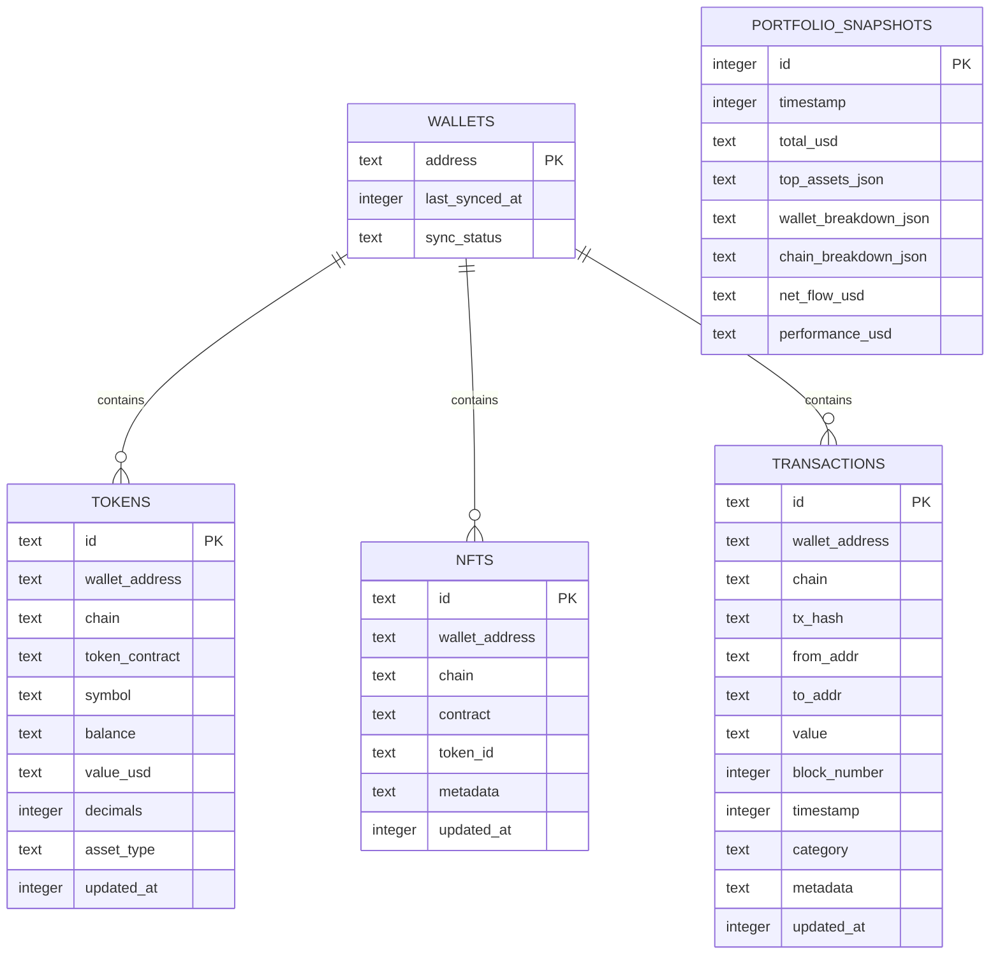

**Diagram sources**
- [local_db.rs:10-72](file://src-tauri/src/services/local_db.rs#L10-L72)
- [local_db.rs:518-553](file://src-tauri/src/services/local_db.rs#L518-L553)

**Section sources**
- [local_db.rs:10-72](file://src-tauri/src/services/local_db.rs#L10-L72)
- [local_db.rs:518-553](file://src-tauri/src/services/local_db.rs#L518-L553)

### Frontend Stores and UI Integration
- Wallet store:
  - Refreshes addresses via a Tauri command and maintains active address and names.
  - **Enhanced**: Supports dual-address configuration for Flow wallets.
- Sync store:
  - Manages sync state, progress, and completion; listens for backend events to update UI and notify users.
  - **Enhanced**: Handles mixed network sync progress for EVM and Flow addresses.

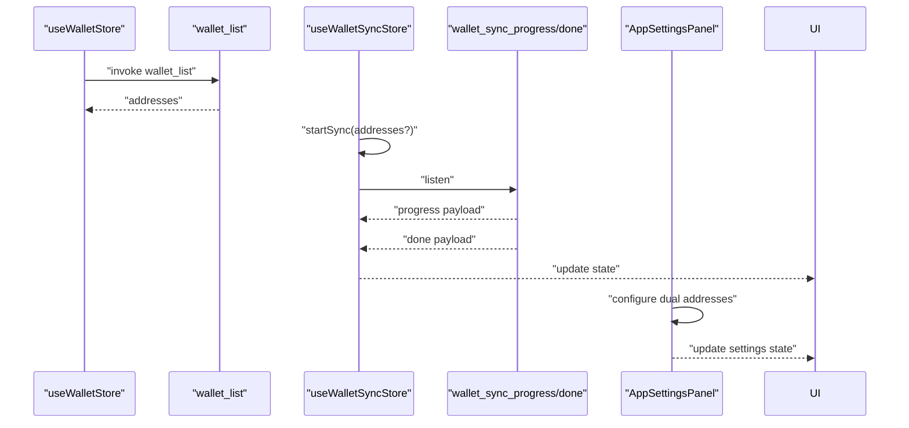

**Diagram sources**
- [useWalletStore.ts:23-43](file://src/store/useWalletStore.ts#L23-L43)
- [useWalletSyncStore.ts:64-72](file://src/store/useWalletSyncStore.ts#L64-L72)
- [useWalletSyncStore.ts:116-151](file://src/store/useWalletSyncStore.ts#L116-L151)
- [AppSettingsPanel.tsx:510-543](file://src/components/apps/AppSettingsPanel.tsx#L510-L543)

**Section sources**
- [useWalletStore.ts:1-48](file://src/store/useWalletStore.ts#L1-L48)
- [useWalletSyncStore.ts:1-199](file://src/store/useWalletSyncStore.ts#L1-L199)
- [AppSettingsPanel.tsx:510-543](file://src/components/apps/AppSettingsPanel.tsx#L510-L543)

## Dependency Analysis
- UI depends on frontend stores and Tauri commands for wallet operations.
- Wallet commands depend on OS keychain and biometric plugins and on local address storage.
- Sync commands spawn tasks that depend on enhanced portfolio service and local DB.
- **Enhanced**: Portfolio service depends on flow_domain utilities for address detection and normalization.
- **Enhanced**: Flow adapter depends on sidecar runtime for Cadence Flow operations.
- Portfolio service depends on settings for provider API keys and chain mapping.
- Chain mapping centralizes network identifiers and display names.
- **Enhanced**: Flow domain utilities provide address type detection and chain code normalization.

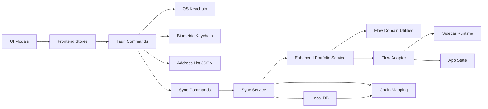

**Diagram sources**
- [wallet.rs:1-284](file://src-tauri/src/commands/wallet.rs#L1-L284)
- [wallet_sync.rs (commands):1-90](file://src-tauri/src/commands/wallet_sync.rs#L1-L90)
- [wallet_sync.rs (service):1-453](file://src-tauri/src/services/wallet_sync.rs#L1-L453)
- [portfolio_service.rs:1-636](file://src-tauri/src/services/portfolio_service.rs#L1-L636)
- [flow_domain.rs:1-101](file://src-tauri/src/services/flow_domain.rs#L1-L101)
- [flow.rs:1-146](file://src-tauri/src/services/apps/flow.rs#L1-L146)
- [runtime.rs:1-144](file://src-tauri/src/services/apps/runtime.rs#L1-L144)
- [state.rs:1-458](file://src-tauri/src/services/apps/state.rs#L1-L458)
- [chain.rs:1-62](file://src-tauri/src/services/chain.rs#L1-L62)
- [local_db.rs:1-800](file://src-tauri/src/services/local_db.rs#L1-L800)

**Section sources**
- [wallet.rs:1-284](file://src-tauri/src/commands/wallet.rs#L1-L284)
- [wallet_sync.rs (commands):1-90](file://src-tauri/src/commands/wallet_sync.rs#L1-L90)
- [wallet_sync.rs (service):1-453](file://src-tauri/src/services/wallet_sync.rs#L1-L453)
- [portfolio_service.rs:1-636](file://src-tauri/src/services/portfolio_service.rs#L1-L636)
- [flow_domain.rs:1-101](file://src-tauri/src/services/flow_domain.rs#L1-L101)
- [flow.rs:1-146](file://src-tauri/src/services/apps/flow.rs#L1-L146)
- [runtime.rs:1-144](file://src-tauri/src/services/apps/runtime.rs#L1-L144)
- [state.rs:1-458](file://src-tauri/src/services/apps/state.rs#L1-L458)
- [chain.rs:1-62](file://src-tauri/src/services/chain.rs#L1-L62)
- [local_db.rs:1-800](file://src-tauri/src/services/local_db.rs#L1-L800)

## Performance Considerations
- Concurrency:
  - Sync tasks are spawned per wallet address to parallelize work across multiple addresses.
  - **Enhanced**: Mixed network sync processes EVM and Flow addresses concurrently.
- Provider timeouts:
  - Requests to external providers use conservative timeouts to prevent UI stalls.
  - **Enhanced**: Flow sidecar communication includes timeout handling.
- Data indexing:
  - Local DB indexes optimize frequent queries for wallet, chain, and timestamps.
- Snapshot computation:
  - Portfolio snapshots are computed after token sync to support historical tracking.
  - **Enhanced**: Mixed network portfolio aggregation requires additional sorting and consolidation.

## Troubleshooting Guide
- Missing API key:
  - If the Alchemy API key is missing, sync emits a completion event with an error and sets status to error.
- Invalid inputs:
  - Creation/import validates mnemonic length and private key format; errors are surfaced to the UI.
- OS keychain prompts:
  - Loading private keys triggers OS password prompts; ensure biometric availability for seamless access.
- Stale sync:
  - Sync status considers a wallet stale after a fixed interval; initiate a new sync if stale.
- **Enhanced**: Flow address configuration:
  - Ensure both EVM and Cadence addresses are properly configured in settings.
  - Flow sidecar must be installed and active for Cadence Flow balances.
- **Enhanced**: Mixed network issues:
  - Verify that EVM addresses use `0x` + 40 hex characters.
  - Verify that Cadence addresses use `0x` + 16 hex characters.
  - Check that Flow app is enabled and healthy in app settings.

**Section sources**
- [wallet_sync.rs (service):261-274](file://src-tauri/src/services/wallet_sync.rs#L261-L274)
- [wallet_sync.rs (service):293-304](file://src-tauri/src/services/wallet_sync.rs#L293-L304)
- [wallet_sync.rs (commands):34-57](file://src-tauri/src/commands/wallet_sync.rs#L34-L57)
- [wallet.rs:20-28](file://src-tauri/src/commands/wallet.rs#L20-L28)
- [ImportWalletModal.tsx:53-94](file://src/components/wallet/ImportWalletModal.tsx#L53-L94)
- [AppSettingsPanel.tsx:510-543](file://src/components/apps/AppSettingsPanel.tsx#L510-L543)
- [flow.rs:170-181](file://src-tauri/src/services/apps/state.rs#L170-L181)

## Conclusion
The wallet and blockchain service subsystem provides a secure, extensible foundation for multi-chain wallet management. It integrates OS keychain and biometric storage, runs robust background synchronization against external providers, and persists data locally for fast retrieval and reconciliation. The enhanced Portfolio Service now supports Flow EVM and Cadence addresses with dual-address configuration, enabling comprehensive mixed-network portfolio aggregation. The modular design enables future expansion to additional chains and providers while maintaining strong security and user experience.