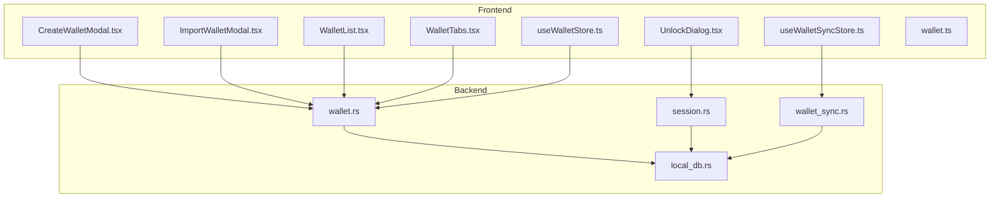
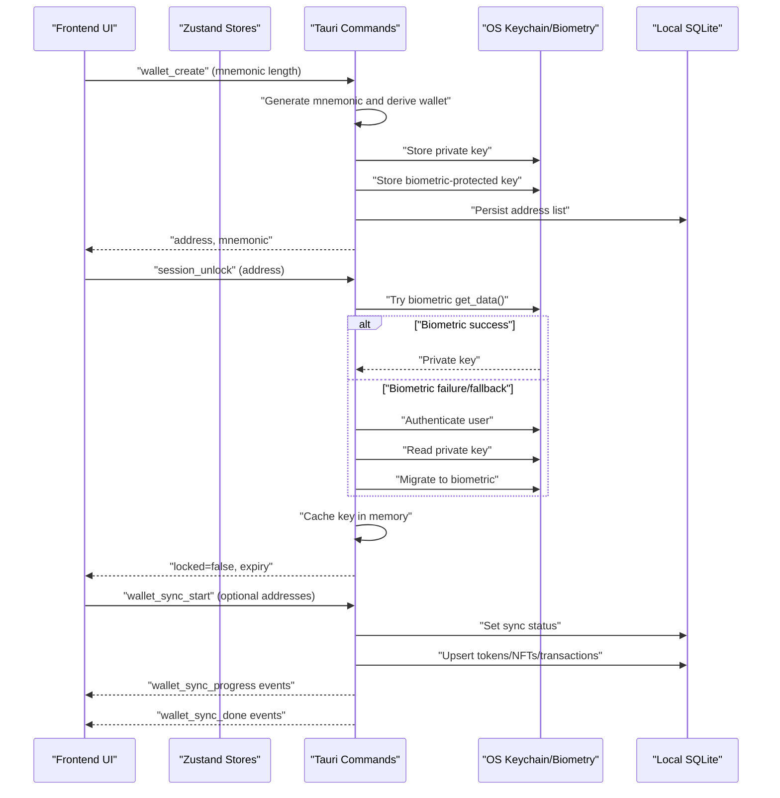
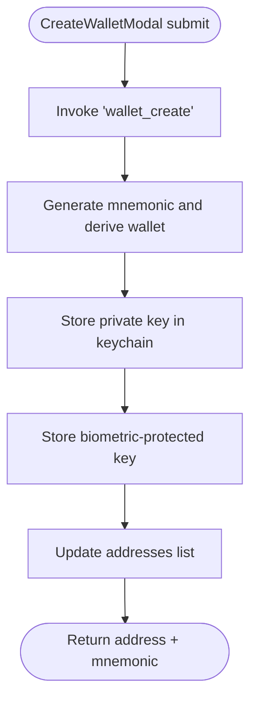
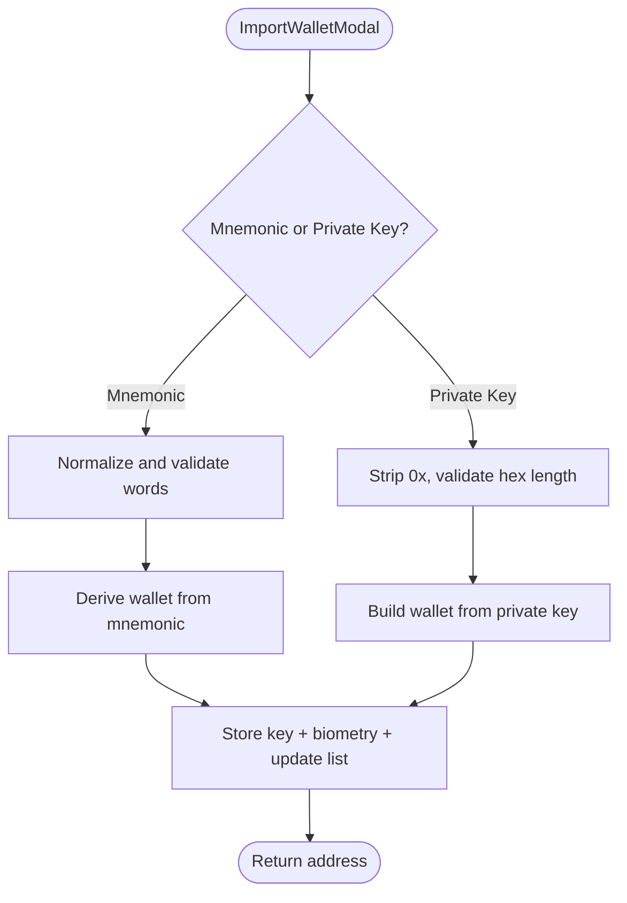
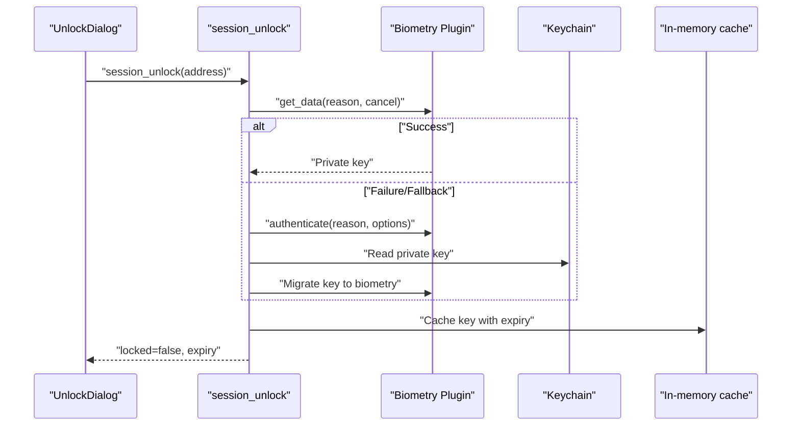
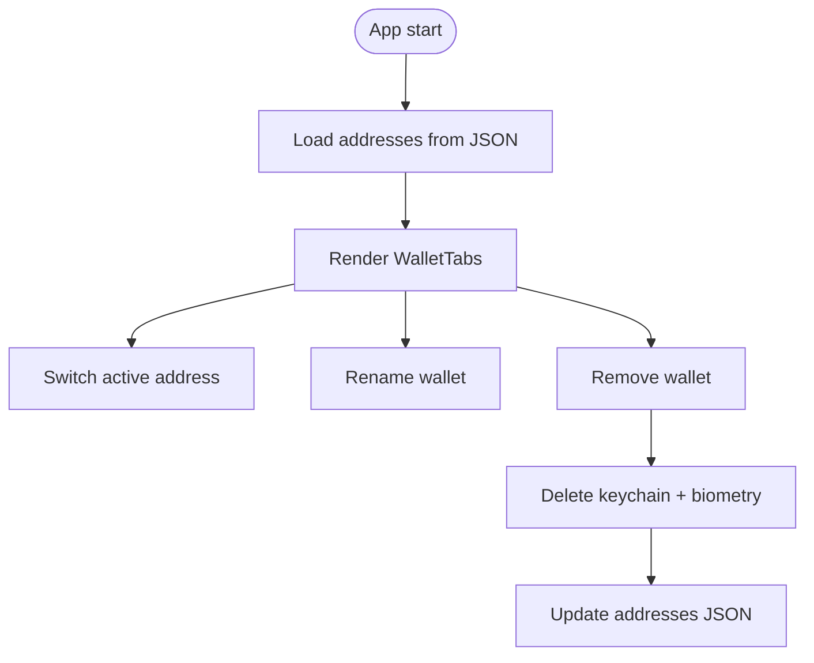
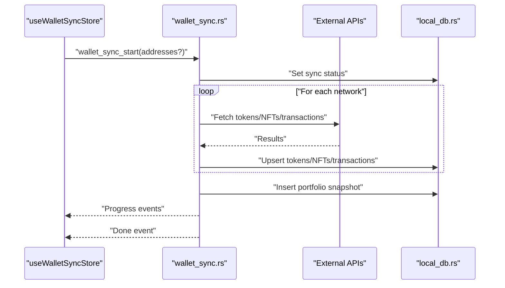
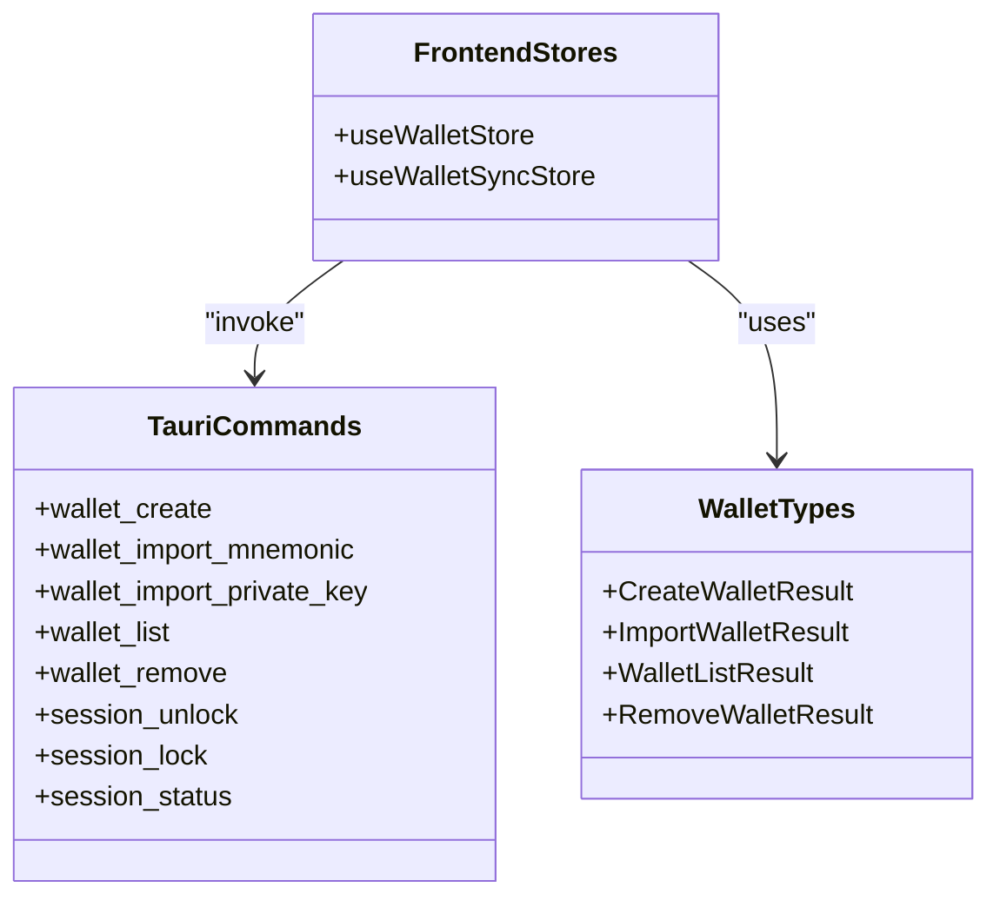
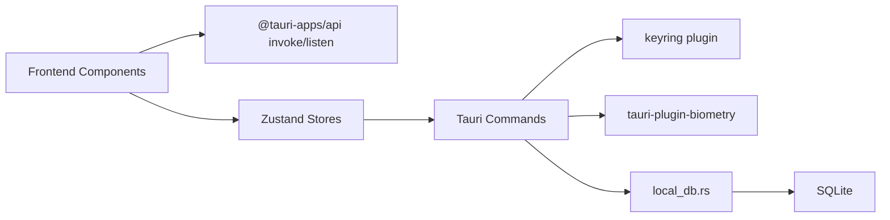

# Wallet Management

<cite>
**Referenced Files in This Document**
- [wallet.rs](file://src-tauri/src/commands/wallet.rs)
- [session.rs](file://src-tauri/src/commands/session.rs)
- [wallet_sync.rs](file://src-tauri/src/services/wallet_sync.rs)
- [local_db.rs](file://src-tauri/src/services/local_db.rs)
- [CreateWalletModal.tsx](file://src/components/wallet/CreateWalletModal.tsx)
- [ImportWalletModal.tsx](file://src/components/wallet/ImportWalletModal.tsx)
- [WalletList.tsx](file://src/components/wallet/WalletList.tsx)
- [WalletTabs.tsx](file://src/components/wallet/WalletTabs.tsx)
- [UnlockDialog.tsx](file://src/components/wallet/UnlockDialog.tsx)
- [useWalletStore.ts](file://src/store/useWalletStore.ts)
- [useWalletSyncStore.ts](file://src/store/useWalletSyncStore.ts)
- [wallet.ts](file://src/types/wallet.ts)
- [tauri.ts](file://src/lib/tauri.ts)
</cite>

## Table of Contents
1. [Introduction](#introduction)
2. [Project Structure](#project-structure)
3. [Core Components](#core-components)
4. [Architecture Overview](#architecture-overview)
5. [Detailed Component Analysis](#detailed-component-analysis)
6. [Dependency Analysis](#dependency-analysis)
7. [Performance Considerations](#performance-considerations)
8. [Troubleshooting Guide](#troubleshooting-guide)
9. [Conclusion](#conclusion)

## Introduction
This document explains the wallet management system in the project, covering wallet creation, import, secure storage, unlocking, multi-wallet support, and synchronization. It also documents the integration with OS keychain services, biometric authentication, encryption libraries, and frontend-backend communication. The goal is to provide a clear understanding of the wallet lifecycle, security posture, and operational guidance for developers and operators.

## Project Structure
The wallet system spans frontend React components and Tauri backend services:
- Frontend wallet UI components manage creation, import, selection, renaming, removal, and unlocking.
- Backend Tauri commands implement wallet operations and secure key storage.
- A background sync service aggregates cross-chain token, NFT, and transaction data and persists it locally.
- A local SQLite database stores on-chain data and auxiliary application state.

**Diagram sources**
- [CreateWalletModal.tsx:1-169](file://src/components/wallet/CreateWalletModal.tsx#L1-L169)
- [ImportWalletModal.tsx:1-49](file://src/components/wallet/ImportWalletModal.tsx#L1-L49)
- [WalletList.tsx:1-76](file://src/components/wallet/WalletList.tsx#L1-L76)
- [WalletTabs.tsx:1-153](file://src/components/wallet/WalletTabs.tsx#L1-L153)
- [UnlockDialog.tsx:1-102](file://src/components/wallet/UnlockDialog.tsx#L1-L102)
- [useWalletStore.ts:1-48](file://src/store/useWalletStore.ts#L1-L48)
- [useWalletSyncStore.ts:1-199](file://src/store/useWalletSyncStore.ts#L1-L199)
- [wallet.ts:1-59](file://src/types/wallet.ts#L1-L59)
- [wallet.rs:1-284](file://src-tauri/src/commands/wallet.rs#L1-L284)
- [session.rs:1-155](file://src-tauri/src/commands/session.rs#L1-L155)
- [wallet_sync.rs:1-453](file://src-tauri/src/services/wallet_sync.rs#L1-L453)
- [local_db.rs:1-800](file://src-tauri/src/services/local_db.rs#L1-L800)

**Section sources**
- [wallet.rs:1-284](file://src-tauri/src/commands/wallet.rs#L1-L284)
- [session.rs:1-155](file://src-tauri/src/commands/session.rs#L1-L155)
- [wallet_sync.rs:1-453](file://src-tauri/src/services/wallet_sync.rs#L1-L453)
- [local_db.rs:1-800](file://src-tauri/src/services/local_db.rs#L1-L800)
- [CreateWalletModal.tsx:1-169](file://src/components/wallet/CreateWalletModal.tsx#L1-L169)
- [ImportWalletModal.tsx:1-49](file://src/components/wallet/ImportWalletModal.tsx#L1-L49)
- [WalletList.tsx:1-76](file://src/components/wallet/WalletList.tsx#L1-L76)
- [WalletTabs.tsx:1-153](file://src/components/wallet/WalletTabs.tsx#L1-L153)
- [UnlockDialog.tsx:1-102](file://src/components/wallet/UnlockDialog.tsx#L1-L102)
- [useWalletStore.ts:1-48](file://src/store/useWalletStore.ts#L1-L48)
- [useWalletSyncStore.ts:1-199](file://src/store/useWalletSyncStore.ts#L1-L199)
- [wallet.ts:1-59](file://src/types/wallet.ts#L1-L59)
- [tauri.ts:1-4](file://src/lib/tauri.ts#L1-L4)

## Core Components
- Wallet creation and import:
  - Creation generates a BIP39 mnemonic and derives an EVM wallet at index 0.
  - Import supports mnemonic phrases (12 or 24 words) and raw private keys.
  - Both persist the private key in OS keychain and optionally in biometric-protected storage.
- Secure storage:
  - Private keys are stored in OS keychain entries keyed by wallet address.
  - Biometric storage uses a dedicated domain; on dev builds, fallback to keychain authentication occurs.
- Unlock and session management:
  - Biometric unlock attempts first; on failure or absence, keychain authentication is gated via a single prompt.
  - Successful unlock caches the key in memory for the session with an expiration.
- Multi-wallet and state:
  - Wallet addresses are persisted in a plain JSON file for quick enumeration without prompting.
  - The frontend maintains active address, names, and lists; backend ensures uniqueness and persistence.
- Synchronization:
  - Background sync fetches tokens, NFTs, and transactions across multiple networks and writes to local SQLite.
  - Emits progress and completion events for UI updates.

**Section sources**
- [wallet.rs:170-200](file://src-tauri/src/commands/wallet.rs#L170-L200)
- [wallet.rs:202-229](file://src-tauri/src/commands/wallet.rs#L202-L229)
- [wallet.rs:231-258](file://src-tauri/src/commands/wallet.rs#L231-L258)
- [wallet.rs:128-167](file://src-tauri/src/commands/wallet.rs#L128-L167)
- [session.rs:62-125](file://src-tauri/src/commands/session.rs#L62-L125)
- [useWalletStore.ts:16-47](file://src/store/useWalletStore.ts#L16-L47)
- [wallet_sync.rs:260-452](file://src-tauri/src/services/wallet_sync.rs#L260-L452)
- [local_db.rs:10-800](file://src-tauri/src/services/local_db.rs#L10-L800)

## Architecture Overview
The wallet system integrates frontend UI with Tauri commands and services. The backend orchestrates secure key storage, session caching, and background synchronization.

**Diagram sources**
- [wallet.rs:170-200](file://src-tauri/src/commands/wallet.rs#L170-L200)
- [wallet.rs:128-167](file://src-tauri/src/commands/wallet.rs#L128-L167)
- [session.rs:62-125](file://src-tauri/src/commands/session.rs#L62-L125)
- [wallet_sync.rs:260-452](file://src-tauri/src/services/wallet_sync.rs#L260-L452)
- [local_db.rs:10-800](file://src-tauri/src/services/local_db.rs#L10-L800)
- [CreateWalletModal.tsx:33-62](file://src/components/wallet/CreateWalletModal.tsx#L33-L62)
- [UnlockDialog.tsx:31-58](file://src/components/wallet/UnlockDialog.tsx#L31-L58)
- [useWalletSyncStore.ts:64-72](file://src/store/useWalletSyncStore.ts#L64-L72)

## Detailed Component Analysis

### Wallet Creation Workflow
- Input validation ensures supported mnemonic lengths.
- Mnemonic generation and derivation use BIP39 and EVM-compatible builders.
- Private key storage and optional biometric migration occur immediately after derivation.
- Address list is updated if not present.

**Diagram sources**
- [CreateWalletModal.tsx:33-62](file://src/components/wallet/CreateWalletModal.tsx#L33-L62)
- [wallet.rs:170-200](file://src-tauri/src/commands/wallet.rs#L170-L200)

**Section sources**
- [CreateWalletModal.tsx:24-70](file://src/components/wallet/CreateWalletModal.tsx#L24-L70)
- [wallet.rs:170-200](file://src-tauri/src/commands/wallet.rs#L170-L200)

### Wallet Import Workflow
- Mnemonic import trims and normalizes input, validates word count, and derives the wallet.
- Private key import validates hex format and length, then derives the wallet.
- Both flows mirror creation: store key in keychain, optionally in biometry, and update the address list.

**Diagram sources**
- [ImportWalletModal.tsx:25-33](file://src/components/wallet/ImportWalletModal.tsx#L25-L33)
- [wallet.rs:202-229](file://src-tauri/src/commands/wallet.rs#L202-L229)
- [wallet.rs:231-258](file://src-tauri/src/commands/wallet.rs#L231-L258)

**Section sources**
- [ImportWalletModal.tsx:35-49](file://src/components/wallet/ImportWalletModal.tsx#L35-L49)
- [wallet.rs:202-258](file://src-tauri/src/commands/wallet.rs#L202-L258)

### Secure Storage and Biometric Unlock
- Private keys are stored in OS keychain entries keyed by wallet address.
- Biometric storage uses a dedicated domain; on production signed builds, Touch ID unlocks; on dev/unsigned builds, fallback to keychain password occurs.
- Session unlock attempts biometric retrieval first; on failure, authenticates via keychain and migrates the key into biometric storage for future unlocks.

**Diagram sources**
- [UnlockDialog.tsx:31-58](file://src/components/wallet/UnlockDialog.tsx#L31-L58)
- [session.rs:62-125](file://src-tauri/src/commands/session.rs#L62-L125)
- [wallet.rs:128-167](file://src-tauri/src/commands/wallet.rs#L128-L167)

**Section sources**
- [session.rs:62-125](file://src-tauri/src/commands/session.rs#L62-L125)
- [wallet.rs:128-167](file://src-tauri/src/commands/wallet.rs#L128-L167)

### Multi-Wallet Support and State Management
- Addresses are persisted in a plain JSON file to avoid keychain prompts during startup and enumeration.
- The frontend Zustand store manages active address, names, and refreshes the list via the wallet list command.
- Wallet tabs expose rename and remove actions; removal deletes the key from keychain and biometry and updates the address list.

**Diagram sources**
- [wallet.rs:88-126](file://src-tauri/src/commands/wallet.rs#L88-L126)
- [useWalletStore.ts:23-43](file://src/store/useWalletStore.ts#L23-L43)
- [WalletTabs.tsx:58-70](file://src/components/wallet/WalletTabs.tsx#L58-L70)
- [WalletList.tsx:27-35](file://src/components/wallet/WalletList.tsx#L27-L35)

**Section sources**
- [wallet.rs:88-126](file://src-tauri/src/commands/wallet.rs#L88-L126)
- [useWalletStore.ts:16-47](file://src/store/useWalletStore.ts#L16-L47)
- [WalletTabs.tsx:34-152](file://src/components/wallet/WalletTabs.tsx#L34-L152)
- [WalletList.tsx:18-75](file://src/components/wallet/WalletList.tsx#L18-L75)

### Background Wallet Synchronization
- The sync service iterates supported networks, fetching tokens, NFTs, and transactions via external APIs.
- Results are upserted into local SQLite tables; portfolio snapshots are captured for analytics.
- Progress and completion events are emitted to the frontend for UX feedback.

**Diagram sources**
- [useWalletSyncStore.ts:64-72](file://src/store/useWalletSyncStore.ts#L64-L72)
- [wallet_sync.rs:260-452](file://src-tauri/src/services/wallet_sync.rs#L260-L452)
- [local_db.rs:10-800](file://src-tauri/src/services/local_db.rs#L10-L800)

**Section sources**
- [useWalletSyncStore.ts:10-73](file://src/store/useWalletSyncStore.ts#L10-L73)
- [wallet_sync.rs:260-452](file://src-tauri/src/services/wallet_sync.rs#L260-L452)
- [local_db.rs:10-800](file://src-tauri/src/services/local_db.rs#L10-L800)

### Frontend-Backend Integration
- Frontend components invoke Tauri commands using typed payloads and results.
- Stores subscribe to Tauri events for sync progress and completion to update UI state.
- Type definitions ensure compatibility between frontend and backend command signatures.

**Diagram sources**
- [wallet.ts:1-59](file://src/types/wallet.ts#L1-L59)
- [useWalletStore.ts:1-48](file://src/store/useWalletStore.ts#L1-L48)
- [useWalletSyncStore.ts:1-199](file://src/store/useWalletSyncStore.ts#L1-L199)
- [wallet.rs:169-283](file://src-tauri/src/commands/wallet.rs#L169-L283)
- [session.rs:61-154](file://src-tauri/src/commands/session.rs#L61-L154)

**Section sources**
- [wallet.ts:1-59](file://src/types/wallet.ts#L1-L59)
- [useWalletStore.ts:1-48](file://src/store/useWalletStore.ts#L1-L48)
- [useWalletSyncStore.ts:1-199](file://src/store/useWalletSyncStore.ts#L1-L199)
- [wallet.rs:169-283](file://src-tauri/src/commands/wallet.rs#L169-L283)
- [session.rs:61-154](file://src-tauri/src/commands/session.rs#L61-L154)

## Dependency Analysis
- Frontend depends on Tauri’s invoke/listen APIs and Zustand stores.
- Backend commands depend on keyring and biometry plugins for secure storage and OS integration.
- Synchronization depends on external providers and local SQLite for persistence.
- Type safety is enforced via shared TypeScript types.

**Diagram sources**
- [useWalletStore.ts:1-48](file://src/store/useWalletStore.ts#L1-L48)
- [useWalletSyncStore.ts:1-199](file://src/store/useWalletSyncStore.ts#L1-L199)
- [wallet.rs:1-284](file://src-tauri/src/commands/wallet.rs#L1-L284)
- [session.rs:1-155](file://src-tauri/src/commands/session.rs#L1-L155)
- [local_db.rs:1-800](file://src-tauri/src/services/local_db.rs#L1-L800)

**Section sources**
- [tauri.ts:1-4](file://src/lib/tauri.ts#L1-L4)
- [wallet.rs:1-284](file://src-tauri/src/commands/wallet.rs#L1-L284)
- [session.rs:1-155](file://src-tauri/src/commands/session.rs#L1-L155)
- [local_db.rs:1-800](file://src-tauri/src/services/local_db.rs#L1-L800)

## Performance Considerations
- Minimizing keychain prompts:
  - Address list is stored in plaintext to avoid keychain prompts on startup.
  - Biometric unlock attempts are designed to surface only one prompt per session.
- Efficient synchronization:
  - Network iteration and pagination reduce API overhead.
  - Upserts minimize write operations and maintain historical snapshots.
- Memory caching:
  - Session cache avoids repeated key retrieval for the configured duration.

[No sources needed since this section provides general guidance]

## Troubleshooting Guide
- Wallet creation/import fails:
  - Verify mnemonic word count and private key format; invalid inputs are rejected early.
  - Check backend errors returned by commands for detailed messages.
- Unlock fails or cancelled:
  - Biometric lockouts or cancellations are audited; retry with device credential fallback.
  - Ensure biometric key exists; if missing, unlock via keychain to migrate into biometry.
- Sync does not start or stalls:
  - Confirm API keys are configured; missing keys prevent sync initiation.
  - Listen for progress and done events to diagnose partial failures.
- Corrupted or inconsistent state:
  - Clear local data via database operations if necessary; re-sync after remediation.
- Security breach indicators:
  - Monitor audit logs for unlock failures and take corrective actions (e.g., rotate keys, review policies).

**Section sources**
- [wallet.rs:170-200](file://src-tauri/src/commands/wallet.rs#L170-L200)
- [session.rs:82-125](file://src-tauri/src/commands/session.rs#L82-L125)
- [wallet_sync.rs:260-274](file://src-tauri/src/services/wallet_sync.rs#L260-L274)
- [local_db.rs:611-644](file://src-tauri/src/services/local_db.rs#L611-L644)

## Conclusion
The wallet management system combines secure local key storage, OS biometric integration, and robust frontend controls to deliver a seamless multi-wallet experience. Creation, import, and unlock flows are designed to minimize friction while maintaining strong security. Background synchronization enriches the user experience with comprehensive portfolio insights, persisted locally for reliability and performance.