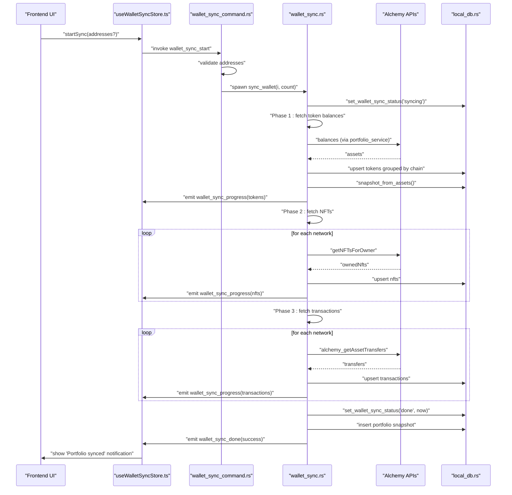
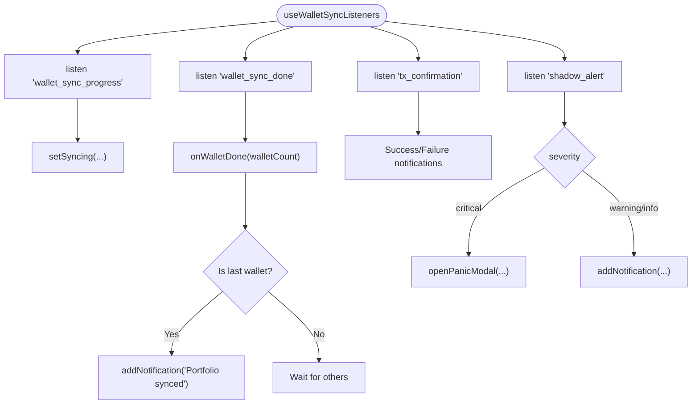
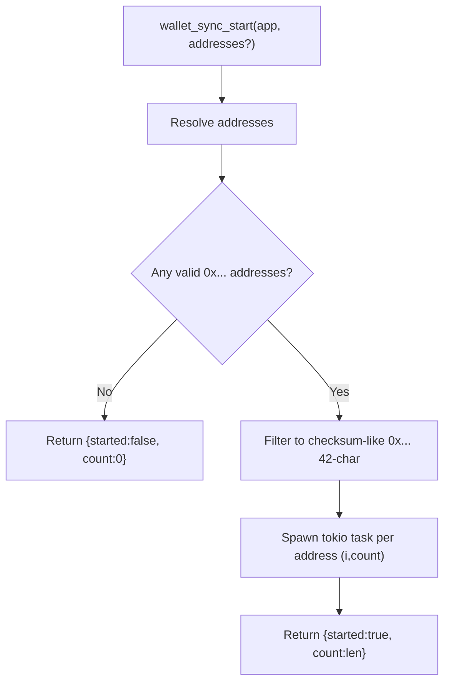
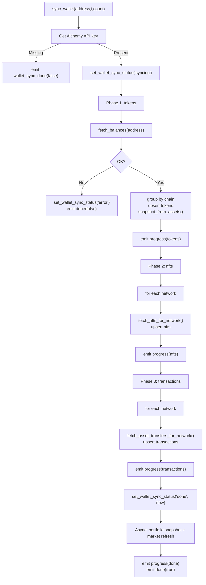
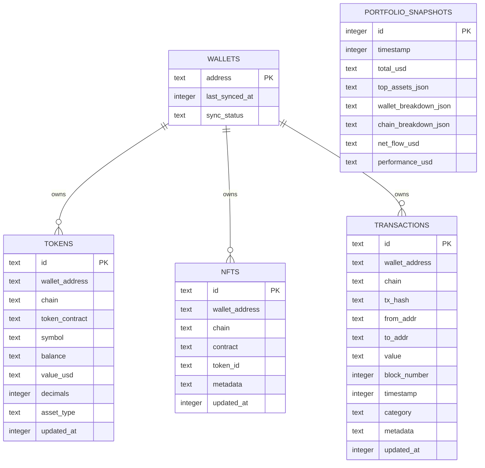
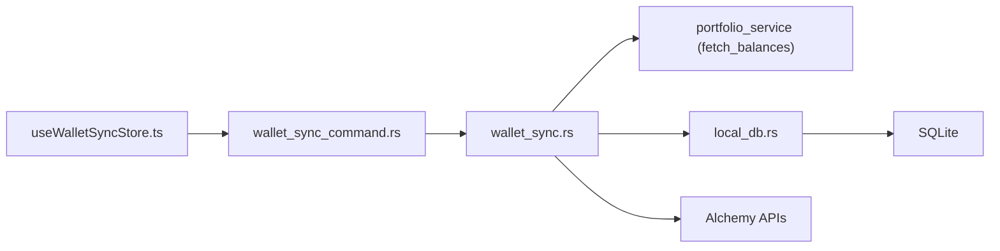

# Wallet Synchronization

<cite>
**Referenced Files in This Document**
- [useWalletSyncStore.ts](file://src/store/useWalletSyncStore.ts)
- [wallet_sync.rs](file://src-tauri/src/services/wallet_sync.rs)
- [wallet_sync_command.rs](file://src-tauri/src/commands/wallet_sync.rs)
- [local_db.rs](file://src-tauri/src/services/local_db.rs)
- [wallet.ts](file://src/types/wallet.ts)
</cite>

## Table of Contents
1. [Introduction](#introduction)
2. [Project Structure](#project-structure)
3. [Core Components](#core-components)
4. [Architecture Overview](#architecture-overview)
5. [Detailed Component Analysis](#detailed-component-analysis)
6. [Dependency Analysis](#dependency-analysis)
7. [Performance Considerations](#performance-considerations)
8. [Troubleshooting Guide](#troubleshooting-guide)
9. [Conclusion](#conclusion)

## Introduction
This document explains the wallet synchronization system that retrieves cross-chain token balances, NFT holdings, and transaction history for all configured wallets. It integrates with Alchemy APIs, stores data locally in a SQLite database, and emits progress and completion events to the frontend. The system supports multi-wallet, multi-network synchronization, portfolio snapshot creation, and background task orchestration. It also connects sync outcomes to portfolio updates, market opportunity discovery, and UI refresh cycles.

## Project Structure
The wallet sync system spans both frontend and backend:
- Frontend store and listeners manage UI state, progress notifications, and completion signals.
- Backend commands expose start/status APIs and spawn background sync tasks.
- Services implement the three-phase sync pipeline, integrate with Alchemy, and persist results.
- Local database provides schema, indices, and helpers for tokens, NFTs, transactions, and snapshots.

```mermaid
graph TB
subgraph "Frontend"
Store["useWalletSyncStore.ts<br/>UI state & listeners"]
end
subgraph "Tauri Commands"
Cmd["wallet_sync_command.rs<br/>wallet_sync_start(), wallet_sync_status()"]
end
subgraph "Services"
Sync["wallet_sync.rs<br/>sync_wallet() three-phase sync"]
DB["local_db.rs<br/>SQLite schema & helpers"]
end
Store <- --> Cmd
Cmd --> Sync
Sync --> DB
```

**Diagram sources**
- [useWalletSyncStore.ts:1-199](file://src/store/useWalletSyncStore.ts#L1-L199)
- [wallet_sync_command.rs:1-90](file://src-tauri/src/commands/wallet_sync.rs#L1-L90)
- [wallet_sync.rs:1-453](file://src-tauri/src/services/wallet_sync.rs#L1-L453)
- [local_db.rs:1-800](file://src-tauri/src/services/local_db.rs#L1-L800)

**Section sources**
- [useWalletSyncStore.ts:1-199](file://src/store/useWalletSyncStore.ts#L1-L199)
- [wallet_sync_command.rs:1-90](file://src-tauri/src/commands/wallet_sync.rs#L1-L90)
- [wallet_sync.rs:1-453](file://src-tauri/src/services/wallet_sync.rs#L1-L453)
- [local_db.rs:1-800](file://src-tauri/src/services/local_db.rs#L1-L800)

## Core Components
- Frontend wallet sync store:
  - Tracks global sync status, per-wallet progress, and completion counts.
  - Emits UI notifications on sync progress and completion.
  - Starts background sync via Tauri command invocation.
- Backend wallet sync command:
  - Validates wallet addresses and spawns background tasks per wallet.
  - Reports sync status based on last synced timestamps.
- Wallet sync service:
  - Three-phase pipeline: token balances, NFTs, transactions.
  - Uses Alchemy endpoints for balances, NFTs, and asset transfers.
  - Persists results to local database and emits progress events.
- Local database:
  - Schema for tokens, NFTs, transactions, and portfolio snapshots.
  - Helpers to upsert and query data, and to record sync status.

**Section sources**
- [useWalletSyncStore.ts:10-73](file://src/store/useWalletSyncStore.ts#L10-L73)
- [wallet_sync_command.rs:34-89](file://src-tauri/src/commands/wallet_sync.rs#L34-L89)
- [wallet_sync.rs:260-452](file://src-tauri/src/services/wallet_sync.rs#L260-L452)
- [local_db.rs:10-116](file://src-tauri/src/services/local_db.rs#L10-L116)

## Architecture Overview
The system orchestrates a background sync for each wallet address. It emits granular progress events and a final completion event. After success, it captures portfolio snapshots and refreshes market opportunities.



**Diagram sources**
- [useWalletSyncStore.ts:64-73](file://src/store/useWalletSyncStore.ts#L64-L73)
- [wallet_sync_command.rs:60-89](file://src-tauri/src/commands/wallet_sync.rs#L60-L89)
- [wallet_sync.rs:260-452](file://src-tauri/src/services/wallet_sync.rs#L260-L452)
- [local_db.rs:518-553](file://src-tauri/src/services/local_db.rs#L518-L553)

## Detailed Component Analysis

### Frontend: Wallet Sync Store and Listeners
- State fields:
  - syncStatus, progress, currentStep, walletCount, walletIndex, doneCount.
- Actions:
  - setSyncing(progress, step, walletIndex, walletCount): updates progress UI.
  - onWalletDone(walletCount): increments doneCount; resets to idle when all done.
  - setIdle(): resets to initial state.
  - startSync(addresses?): invokes backend command to start sync.
- Event listeners:
  - wallet_sync_progress: updates per-wallet progress.
  - wallet_sync_done: finalizes sync; notifies when last wallet completes.
  - tx_confirmation: shows success/failure notifications for transfers.
  - shadow_alert: shows agent-driven alerts and opens panic modal for critical severity.



**Diagram sources**
- [useWalletSyncStore.ts:111-151](file://src/store/useWalletSyncStore.ts#L111-L151)
- [useWalletSyncStore.ts:75-109](file://src/store/useWalletSyncStore.ts#L75-L109)
- [useWalletSyncStore.ts:163-198](file://src/store/useWalletSyncStore.ts#L163-L198)

**Section sources**
- [useWalletSyncStore.ts:10-73](file://src/store/useWalletSyncStore.ts#L10-L73)
- [useWalletSyncStore.ts:111-151](file://src/store/useWalletSyncStore.ts#L111-L151)
- [useWalletSyncStore.ts:75-109](file://src/store/useWalletSyncStore.ts#L75-L109)
- [useWalletSyncStore.ts:163-198](file://src/store/useWalletSyncStore.ts#L163-L198)

### Backend: Wallet Sync Command
- wallet_sync_status:
  - Computes needs_sync based on last_synced_at and a staleness threshold.
  - Returns per-address status and timestamps.
- wallet_sync_start:
  - Filters valid Ethereum addresses.
  - Spawns a background task per address with index and count for progress tracking.
  - Returns whether sync was started and how many wallets were queued.



**Diagram sources**
- [wallet_sync_command.rs:34-89](file://src-tauri/src/commands/wallet_sync.rs#L34-L89)

**Section sources**
- [wallet_sync_command.rs:34-89](file://src-tauri/src/commands/wallet_sync.rs#L34-L89)

### Backend: Wallet Sync Service (Three-Phase Pipeline)
- Network selection:
  - Base networks plus Flow networks when the Flow tool app is ready.
- Phase 1: Token balances
  - Fetch balances via portfolio service.
  - Convert to token rows grouped by chain and upsert into tokens table.
  - Emit progress and snapshot portfolio breakdown.
- Phase 2: NFTs
  - For each network, call Alchemy’s getNFTsForOwner endpoint.
  - Upsert NFT rows keyed by chain-contract-tokenId.
  - Emit incremental progress across networks.
- Phase 3: Transactions
  - For each network, call alchemy_getAssetTransfers RPC.
  - Upsert transaction rows keyed by chain-txHash.
  - Emit incremental progress across networks.
- Completion:
  - Mark wallet as done with timestamp.
  - Snapshot portfolio totals and top assets.
  - Trigger portfolio snapshot insertion and market opportunity refresh asynchronously.
  - Emit final progress and done events.



**Diagram sources**
- [wallet_sync.rs:260-452](file://src-tauri/src/services/wallet_sync.rs#L260-L452)
- [wallet_sync.rs:72-130](file://src-tauri/src/services/wallet_sync.rs#L72-L130)
- [wallet_sync.rs:132-209](file://src-tauri/src/services/wallet_sync.rs#L132-L209)
- [wallet_sync.rs:211-258](file://src-tauri/src/services/wallet_sync.rs#L211-L258)

**Section sources**
- [wallet_sync.rs:10-28](file://src-tauri/src/services/wallet_sync.rs#L10-L28)
- [wallet_sync.rs:260-452](file://src-tauri/src/services/wallet_sync.rs#L260-L452)
- [wallet_sync.rs:72-130](file://src-tauri/src/services/wallet_sync.rs#L72-L130)
- [wallet_sync.rs:132-209](file://src-tauri/src/services/wallet_sync.rs#L132-L209)
- [wallet_sync.rs:211-258](file://src-tauri/src/services/wallet_sync.rs#L211-L258)

### Local Database: Schema and Helpers
- Tables:
  - wallets: address, last_synced_at, sync_status.
  - tokens: id, wallet_address, chain, token_contract, symbol, balance, value_usd, decimals, asset_type, updated_at.
  - nfts: id, wallet_address, chain, contract, token_id, metadata, updated_at.
  - transactions: id, wallet_address, chain, tx_hash, from_addr, to_addr, value, block_number, timestamp, category, metadata, updated_at.
  - portfolio_snapshots: timestamp, total_usd, top_assets_json, wallet_breakdown_json, chain_breakdown_json, net_flow_usd, performance_usd.
- Indices:
  - Tokens: wallet_address, chain.
  - NFTs: wallet_address.
  - Transactions: wallet_address, timestamp.
  - Snapshots: timestamp.
- Helpers:
  - set_wallet_sync_status(address, status, last_synced_at).
  - get_wallet_last_synced(address).
  - insert_portfolio_snapshot(total_usd, top_assets_json).
  - insert_portfolio_snapshot_full(...).
  - upsert_tokens, upsert_nfts, upsert_transactions (used in sync pipeline).



**Diagram sources**
- [local_db.rs:10-116](file://src-tauri/src/services/local_db.rs#L10-L116)

**Section sources**
- [local_db.rs:10-116](file://src-tauri/src/services/local_db.rs#L10-L116)
- [local_db.rs:518-553](file://src-tauri/src/services/local_db.rs#L518-L553)
- [local_db.rs:555-583](file://src-tauri/src/services/local_db.rs#L555-L583)

### Types: Portfolio and Snapshot Models
- PortfolioAsset: fields for id, symbol, chain, chainName, balance, valueUsd, type, tokenContract, decimals, walletAddress.
- PortfolioSnapshotPoint: timestamp, totalUsd, netFlowUsd, performanceUsd, walletBreakdown, chainBreakdown, topAssets.
- PortfolioPerformanceRange: range, points, summary, allocationActual, allocationTarget, walletAttribution.

These types inform how portfolio snapshots are constructed and consumed downstream.

**Section sources**
- [wallet.ts:20-59](file://src/types/wallet.ts#L20-L59)

## Dependency Analysis
- Frontend depends on:
  - Tauri invoke/listen for command invocation and event reception.
  - Wallet sync store for state and notifications.
- Backend commands depend on:
  - Address resolution and validation.
  - Tokio runtime for spawning tasks.
- Wallet sync service depends on:
  - Settings for Alchemy API key.
  - Portfolio service for balances.
  - Local DB for persistence and status tracking.
  - Chain/network mapping for chain codes.
- Local DB depends on:
  - SQLite via rusqlite.
  - Indexes for efficient queries.



**Diagram sources**
- [useWalletSyncStore.ts:1-199](file://src/store/useWalletSyncStore.ts#L1-L199)
- [wallet_sync_command.rs:1-90](file://src-tauri/src/commands/wallet_sync.rs#L1-L90)
- [wallet_sync.rs:1-453](file://src-tauri/src/services/wallet_sync.rs#L1-L453)
- [local_db.rs:1-800](file://src-tauri/src/services/local_db.rs#L1-L800)

**Section sources**
- [useWalletSyncStore.ts:1-199](file://src/store/useWalletSyncStore.ts#L1-L199)
- [wallet_sync_command.rs:1-90](file://src-tauri/src/commands/wallet_sync.rs#L1-L90)
- [wallet_sync.rs:1-453](file://src-tauri/src/services/wallet_sync.rs#L1-L453)
- [local_db.rs:1-800](file://src-tauri/src/services/local_db.rs#L1-L800)

## Performance Considerations
- Concurrency:
  - Per-wallet tasks are spawned independently; each wallet sync proceeds concurrently across networks.
- Pagination and limits:
  - NFT retrieval uses pageSize for pagination; transaction retrieval caps results via maxCount parameter.
- Indexing:
  - Database indices on wallet_address and timestamp optimize reads for tokens, NFTs, and transactions.
- Staleness and scheduling:
  - wallet_sync_status computes needs_sync based on a fixed staleness threshold; this enables periodic background refresh without manual triggers.
- Asynchronous post-sync work:
  - Portfolio snapshot insertion and market opportunity refresh are spawned as separate tasks to avoid blocking the main sync loop.

[No sources needed since this section provides general guidance]

## Troubleshooting Guide
- Missing Alchemy API key:
  - If the key is missing, sync immediately fails and emits a done event with an error message indicating the missing key.
- Network errors:
  - NFT and asset transfer requests are checked for success status; non-success responses produce errors surfaced to the done event.
- UI notifications:
  - Transfer confirmations emit success or warning notifications.
  - Critical shadow alerts open the panic modal; others show informational notifications.
- Progress tracking:
  - If progress stalls, check wallet_sync_progress events; verify that the correct number of networks are being processed and that per-network progress increments.

**Section sources**
- [wallet_sync.rs:260-274](file://src-tauri/src/services/wallet_sync.rs#L260-L274)
- [wallet_sync.rs:93-95](file://src-tauri/src/services/wallet_sync.rs#L93-L95)
- [wallet_sync.rs:162-164](file://src-tauri/src/services/wallet_sync.rs#L162-L164)
- [useWalletSyncStore.ts:75-109](file://src/store/useWalletSyncStore.ts#L75-L109)
- [useWalletSyncStore.ts:163-198](file://src/store/useWalletSyncStore.ts#L163-L198)

## Conclusion
The wallet synchronization system provides a robust, three-phase pipeline for collecting cross-chain token balances, NFTs, and transactions. It integrates with Alchemy APIs, persists data locally, and emits structured progress and completion events. The frontend listens for these events to keep users informed and to drive UI refresh cycles. Post-sync activities include portfolio snapshot creation and market opportunity refresh, aligning sync outcomes with portfolio updates and discovery workflows. The design supports scalability via concurrent per-wallet tasks, pagination-aware API usage, and database indexing for performance.