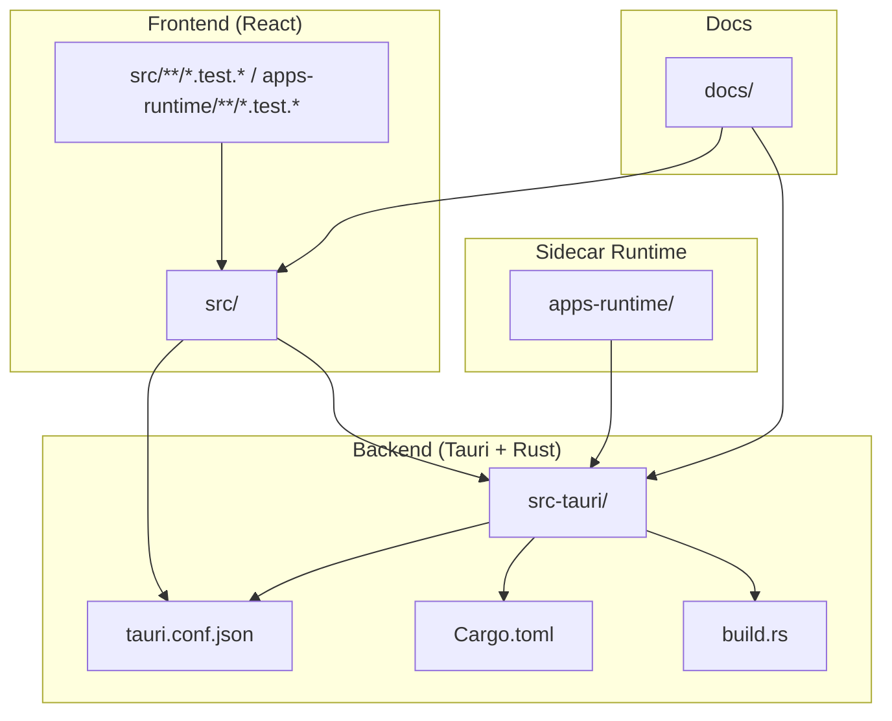
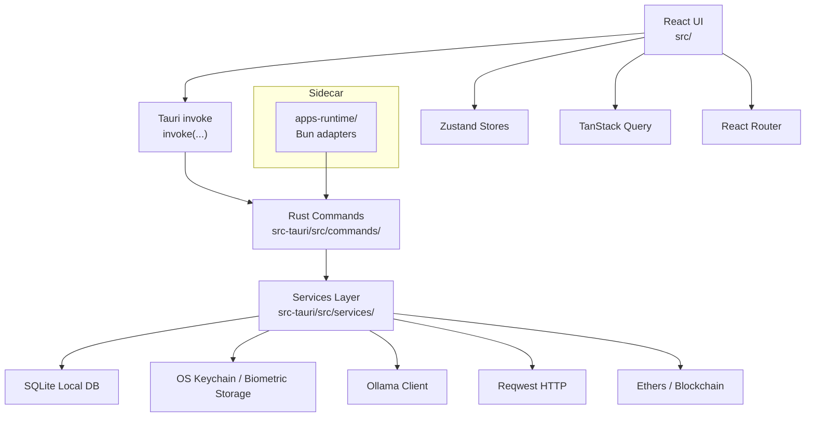
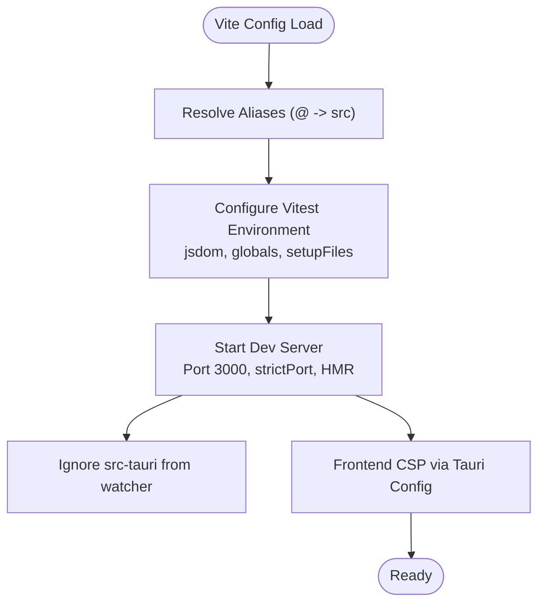
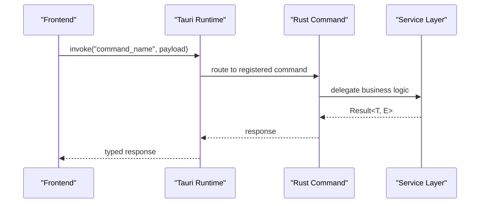
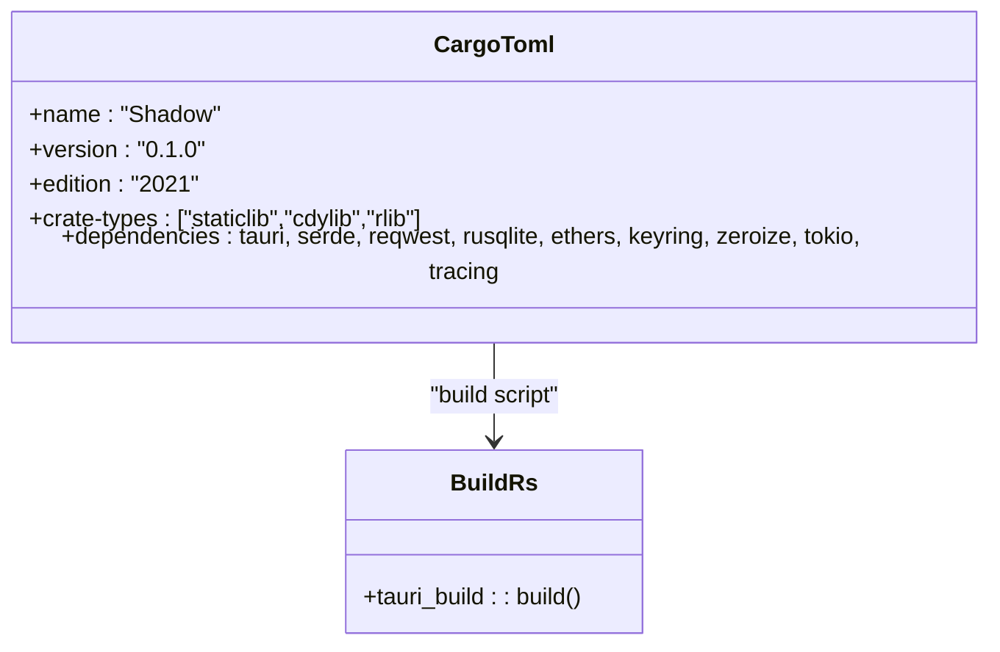
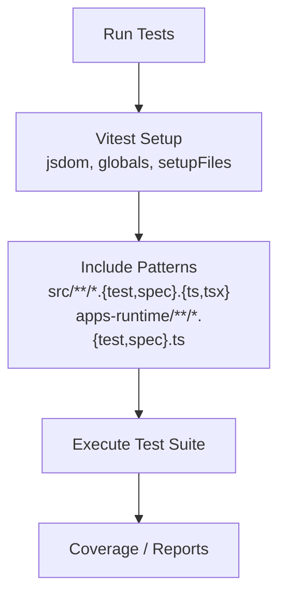
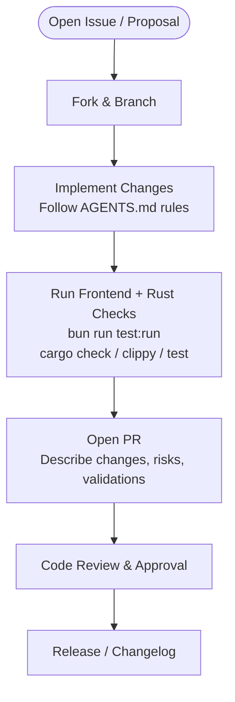
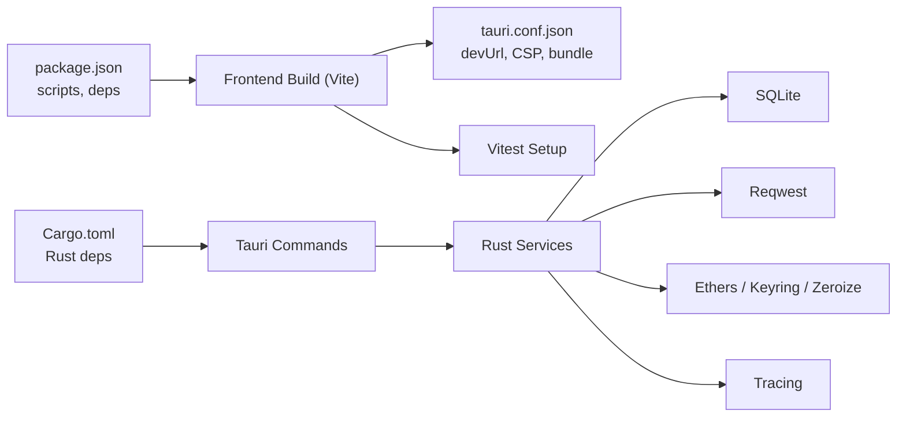

# Development Workflow

<cite>
**Referenced Files in This Document**
- [README.md](file://README.md)
- [package.json](file://package.json)
- [vite.config.ts](file://vite.config.ts)
- [vitest.setup.ts](file://vitest.setup.ts)
- [src-tauri/tauri.conf.json](file://src-tauri/tauri.conf.json)
- [src-tauri/Cargo.toml](file://src-tauri/Cargo.toml)
- [src-tauri/build.rs](file://src-tauri/build.rs)
- [src-tauri/src/lib.rs](file://src-tauri/src/lib.rs)
- [src-tauri/src/main.rs](file://src-tauri/src/main.rs)
- [AGENTS.md](file://AGENTS.md)
- [CLAUDE.md](file://CLAUDE.md)
- [GEMINI.md](file://GEMINI.md)
- [src/App.tsx](file://src/App.tsx)
</cite>

## Table of Contents
1. [Introduction](#introduction)
2. [Project Structure](#project-structure)
3. [Core Components](#core-components)
4. [Architecture Overview](#architecture-overview)
5. [Detailed Component Analysis](#detailed-component-analysis)
6. [Dependency Analysis](#dependency-analysis)
7. [Performance Considerations](#performance-considerations)
8. [Troubleshooting Guide](#troubleshooting-guide)
9. [Conclusion](#conclusion)
10. [Appendices](#appendices)

## Introduction
This document defines the development workflow for SHADOW Protocol, a privacy-first Tauri 2 desktop application integrating React + TypeScript frontend, Rust backend, and local AI via Ollama. It consolidates engineering standards, contribution guidelines, environment setup, build and deployment procedures, testing and CI practices, contribution workflows, project conventions, and operational guidance for maintainability and security.

## Project Structure
The repository follows a clear separation of concerns:
- Frontend: React 19, TypeScript, Vite 7, Tailwind CSS 4, Zustand, TanStack Query, shadcn/ui
- Backend: Tauri 2 + Rust, Tokio, Reqwest, Rusqlite, Ethers, Keyring, Zeroize, tauri-plugin-biometry
- Sidecar: apps-runtime with Bun for integration adapters (Lit, Flow, Filecoin)
- Documentation: Product and UI/UX docs, agent rules

**Diagram sources**
- [src-tauri/tauri.conf.json:1-60](file://src-tauri/tauri.conf.json#L1-L60)
- [src-tauri/Cargo.toml:1-44](file://src-tauri/Cargo.toml#L1-L44)
- [vite.config.ts:1-53](file://vite.config.ts#L1-L53)
- [package.json:1-55](file://package.json#L1-L55)

**Section sources**
- [README.md:251-262](file://README.md#L251-L262)
- [src-tauri/tauri.conf.json:1-60](file://src-tauri/tauri.conf.json#L1-L60)
- [vite.config.ts:1-53](file://vite.config.ts#L1-L53)
- [package.json:1-55](file://package.json#L1-L55)

## Core Components
- Frontend build and dev server orchestrated by Vite, with Tauri dev URL and HMR configuration
- Tauri configuration linking frontend dist to Rust app, CSP, bundling, and resources
- Rust workspace with Tauri 2 commands and services, plus CLI tooling
- Testing setup with Vitest and jsdom, including a ResizeObserver polyfill
- Sidecar runtime for integration adapters powered by Bun

Key conventions:
- Use Bun as the package manager and Tauri invoke for IPC
- Keep secrets and signing logic in Rust; validate inputs on both ends
- Treat documentation claims as product contracts and keep them aligned with code

**Section sources**
- [README.md:279-295](file://README.md#L279-L295)
- [AGENTS.md:58-83](file://AGENTS.md#L58-L83)
- [CLAUDE.md:43-84](file://CLAUDE.md#L43-L84)
- [GEMINI.md:48-75](file://GEMINI.md#L48-L75)

## Architecture Overview
The system integrates a React UI with Tauri commands and Rust services. The frontend communicates with the backend via Tauri invoke, while Rust manages sensitive operations, local storage, AI orchestration, and integrations.

**Diagram sources**
- [src-tauri/src/lib.rs:90-190](file://src-tauri/src/lib.rs#L90-L190)
- [src-tauri/tauri.conf.json:32-34](file://src-tauri/tauri.conf.json#L32-L34)
- [src/App.tsx:1-49](file://src/App.tsx#L1-L49)

**Section sources**
- [README.md:135-170](file://README.md#L135-L170)
- [src-tauri/src/lib.rs:40-89](file://src-tauri/src/lib.rs#L40-L89)

## Detailed Component Analysis

### Frontend Build and Dev Server
- Vite dev server runs on a fixed port and HMR is configured for Tauri development
- Test configuration includes jsdom environment, global setup, and include patterns for both src and apps-runtime
- Aliasing resolves @ to src for consistent imports

**Diagram sources**
- [vite.config.ts:10-52](file://vite.config.ts#L10-L52)
- [vitest.setup.ts:1-10](file://vitest.setup.ts#L1-L10)
- [src-tauri/tauri.conf.json:32-34](file://src-tauri/tauri.conf.json#L32-L34)

**Section sources**
- [vite.config.ts:10-52](file://vite.config.ts#L10-L52)
- [vitest.setup.ts:1-10](file://vitest.setup.ts#L1-L10)

### Tauri Application Bootstrap and Commands
- Tauri entrypoint initializes logging, plugins, database, and background services
- A comprehensive set of commands is registered for wallet, portfolio, market, strategy, apps, and autonomous features
- Run lifecycle hooks handle cleanup on exit

**Diagram sources**
- [src-tauri/src/lib.rs:90-190](file://src-tauri/src/lib.rs#L90-L190)
- [src-tauri/src/main.rs:4-6](file://src-tauri/src/main.rs#L4-L6)

**Section sources**
- [src-tauri/src/lib.rs:34-89](file://src-tauri/src/lib.rs#L34-L89)
- [src-tauri/src/lib.rs:90-190](file://src-tauri/src/lib.rs#L90-L190)
- [src-tauri/src/main.rs:4-6](file://src-tauri/src/main.rs#L4-L6)

### Rust Services and Dependencies
- Cargo manifest defines staticlib/cdylib/rlib crate types and key dependencies for cryptography, networking, storage, and system info
- Build script delegates to tauri_build

**Diagram sources**
- [src-tauri/Cargo.toml:1-44](file://src-tauri/Cargo.toml#L1-L44)
- [src-tauri/build.rs:1-4](file://src-tauri/build.rs#L1-L4)

**Section sources**
- [src-tauri/Cargo.toml:1-44](file://src-tauri/Cargo.toml#L1-L44)
- [src-tauri/build.rs:1-4](file://src-tauri/build.rs#L1-L4)

### Testing Strategy
- Vitest with jsdom environment and global setup
- Tests included for both frontend and sidecar adapter code
- ResizeObserver polyfill ensures compatibility in test environment

**Diagram sources**
- [vite.config.ts:17-26](file://vite.config.ts#L17-L26)
- [vitest.setup.ts:1-10](file://vitest.setup.ts#L1-L10)

**Section sources**
- [vite.config.ts:17-26](file://vite.config.ts#L17-L26)
- [vitest.setup.ts:1-10](file://vitest.setup.ts#L1-L10)

### Contribution Workflow and Pull Request Guidelines
- Read and follow AGENTS.md, CLAUDE.md, and GEMINI.md as canonical agent instructions
- Use Bun, not npm/yarn; use Tauri invoke, not localhost fetch
- Keep secrets and signing logic in Rust; validate inputs on both ends
- Prefer shared system fixes over isolated page-specific patches
- Align documentation claims with code; update docs when changing behavior

**Section sources**
- [AGENTS.md:58-83](file://AGENTS.md#L58-L83)
- [CLAUDE.md:43-84](file://CLAUDE.md#L43-L84)
- [GEMINI.md:48-75](file://GEMINI.md#L48-L75)

### Code Quality Standards
- Rust: Result<T, E> for all fallible operations; derive serde for IPC types; use thiserror; async with Tokio; clippy warnings as errors; tests in same file with cfg(test)
- TypeScript: strict mode; no any; typed invoke payloads; Zustand for UI state; TanStack Query for async/server state; no console.log in committed code
- General: no hardcoded RPC/addresses; no commented-out code; error messages must not expose internals

**Section sources**
- [AGENTS.md:41-63](file://AGENTS.md#L41-L63)
- [CLAUDE.md:64-73](file://CLAUDE.md#L64-L73)
- [GEMINI.md:58-66](file://GEMINI.md#L58-L66)

### Continuous Integration Practices
- Recommended validation pipeline:
  - Frontend: build and test
  - Rust: check, clippy (warnings as errors), test
- CI should enforce linting and tests for both frontend and backend

**Section sources**
- [CLAUDE.md:74-82](file://CLAUDE.md#L74-L82)
- [GEMINI.md:66-74](file://GEMINI.md#L66-L74)

### Release Process, Versioning, and Changelog
- Version fields present in package.json and tauri.conf.json indicate semantic versioning approach
- Release targets all platforms via Tauri bundle configuration
- Maintain changelog entries for breaking changes, security fixes, and notable features

**Section sources**
- [package.json:4-4](file://package.json#L4-L4)
- [src-tauri/tauri.conf.json:3-4](file://src-tauri/tauri.conf.json#L3-L4)
- [src-tauri/tauri.conf.json:36-58](file://src-tauri/tauri.conf.json#L36-L58)

### Development Tools and Debugging
- Tauri devtools can be opened via commands; developer context menu available in Tauri runtime
- CSP restricts connections to localhost AI server and Alchemy endpoints
- Logging via tracing in Rust; structured logging utilities recommended in TS

**Section sources**
- [src-tauri/src/lib.rs:13-31](file://src-tauri/src/lib.rs#L13-L31)
- [src/App.tsx:13-32](file://src/App.tsx#L13-L32)
- [src-tauri/tauri.conf.json:32-34](file://src-tauri/tauri.conf.json#L32-L34)

### Performance Profiling
- Monitor bundle sizes and optimize chunks; Vite configuration sets a warning threshold
- Profile Rust async tasks and database queries; reduce unnecessary background intervals
- Optimize frontend rendering with memoization and selective re-renders

**Section sources**
- [vite.config.ts:32-34](file://vite.config.ts#L32-L34)

### Onboarding New Contributors
- Install prerequisites: Rust toolchain, Bun, Ollama, ALCHEMY_API_KEY
- Clone repo, install deps, copy env, run dev server
- Follow AGENTS.md for security rules and architecture patterns
- Start with small, shared fixes; validate both frontend and backend when touching IPC

**Section sources**
- [README.md:206-248](file://README.md#L206-L248)
- [AGENTS.md:102-109](file://AGENTS.md#L102-L109)

## Dependency Analysis
High-level dependency relationships across layers:

**Diagram sources**
- [package.json:6-17](file://package.json#L6-L17)
- [src-tauri/tauri.conf.json:6-11](file://src-tauri/tauri.conf.json#L6-L11)
- [vite.config.ts:10-26](file://vite.config.ts#L10-L26)
- [src-tauri/Cargo.toml:20-44](file://src-tauri/Cargo.toml#L20-L44)

**Section sources**
- [package.json:6-17](file://package.json#L6-L17)
- [src-tauri/tauri.conf.json:6-11](file://src-tauri/tauri.conf.json#L6-L11)
- [src-tauri/Cargo.toml:20-44](file://src-tauri/Cargo.toml#L20-L44)

## Performance Considerations
- Keep frontend bundles lean; split chunks and defer heavy assets
- Use TanStack Query with appropriate stale times for server state
- Minimize IPC chatter; batch updates where possible
- In Rust, prefer streaming and cancellation tokens for long-running tasks
- Monitor CSP impact on external resource loading

## Troubleshooting Guide
Common issues and remedies:
- Dev server port conflicts: ensure strictPort is enabled and port 3000 is free
- Missing environment variables: set ALCHEMY_API_KEY and verify .env presence
- Ollama connectivity: confirm local endpoint and model availability
- Tauri CSP errors: verify allowed hosts in CSP and adjust as needed
- Rust clippy failures: treat warnings as errors; fix diagnostics promptly
- Frontend tests failing due to missing mocks: ensure ResizeObserver polyfill is loaded

**Section sources**
- [vite.config.ts:35-50](file://vite.config.ts#L35-L50)
- [README.md:210-214](file://README.md#L210-L214)
- [src-tauri/tauri.conf.json:32-34](file://src-tauri/tauri.conf.json#L32-L34)
- [vitest.setup.ts:3-7](file://vitest.setup.ts#L3-L7)

## Conclusion
SHADOW Protocol’s development workflow emphasizes security, clarity, and productivity. By adhering to the documented conventions—using Bun, Tauri invoke, Rust for sensitive logic, and comprehensive testing—you can contribute effectively while maintaining a robust, maintainable codebase.

## Appendices

### Quick Reference: Commands and Scripts
- Frontend dev: bun run dev
- Full app dev: bun run tauri:dev
- Frontend build: bun run build
- Frontend tests: bun run test:run
- Rust checks: cargo check
- Rust clippy: cargo clippy -- -D warnings
- Rust tests: cargo test

**Section sources**
- [README.md:228-247](file://README.md#L228-L247)