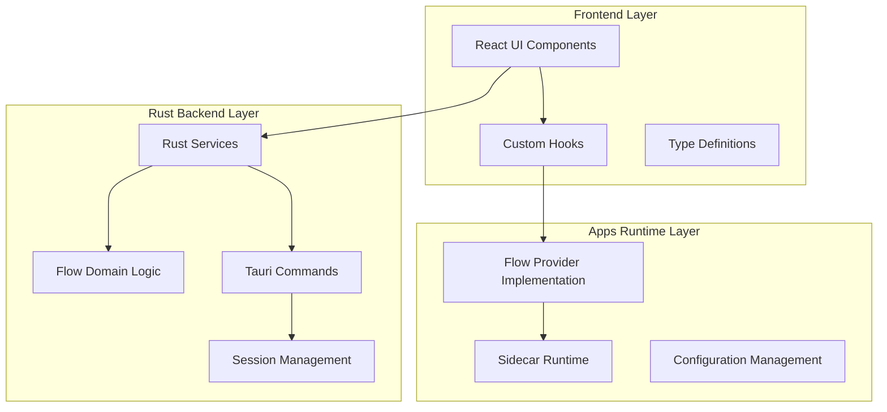
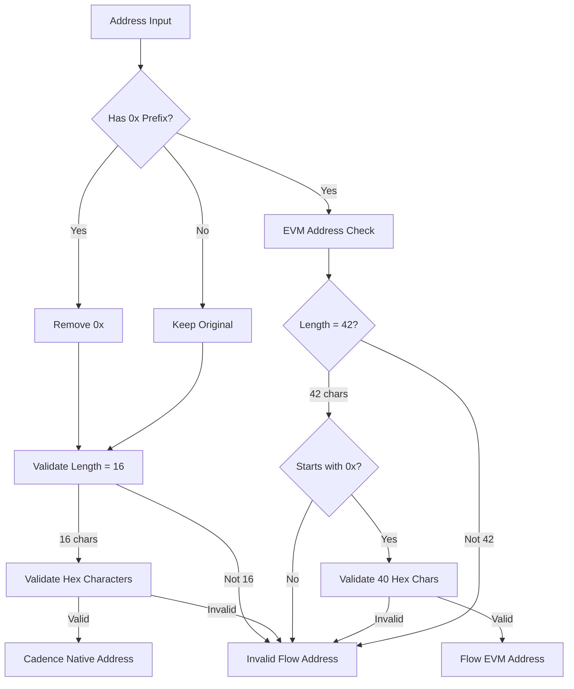
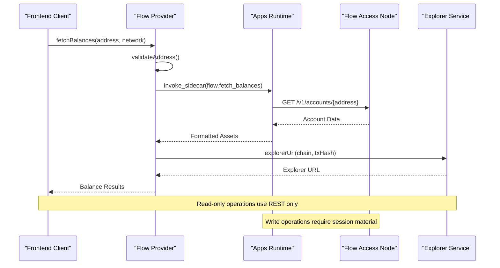
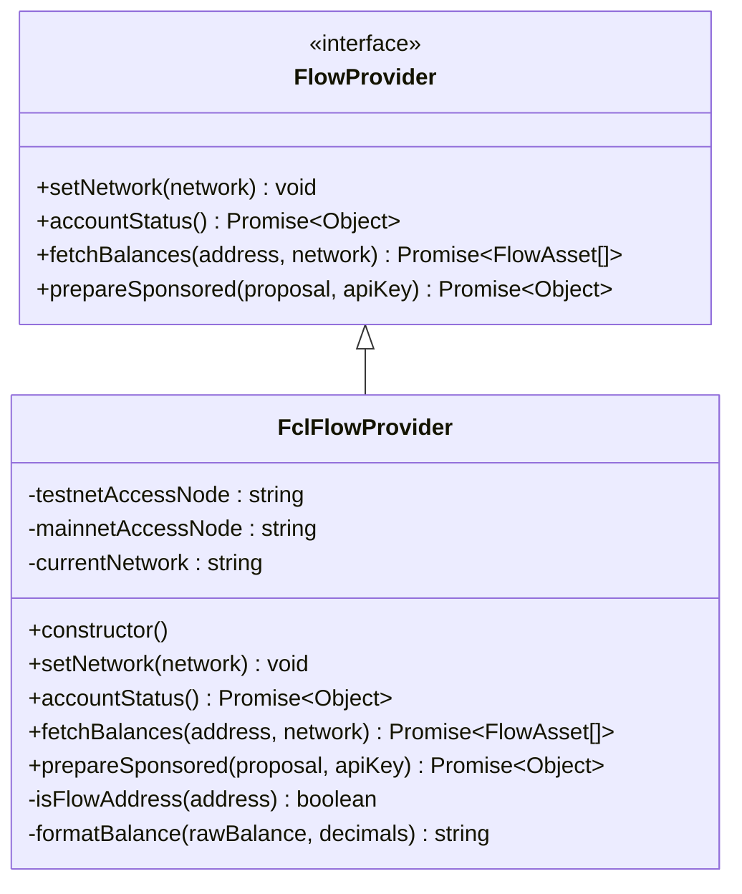
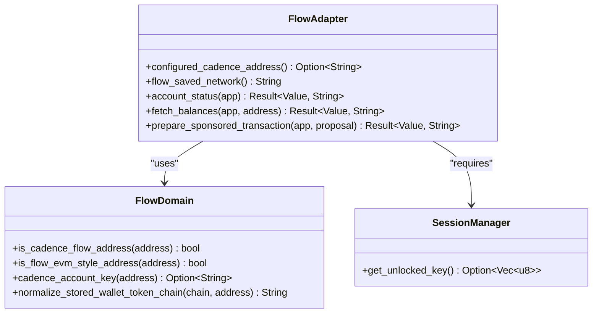
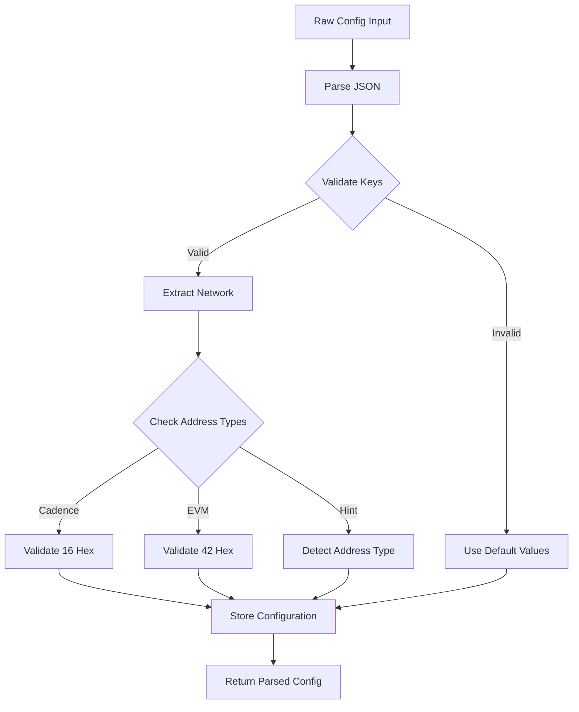
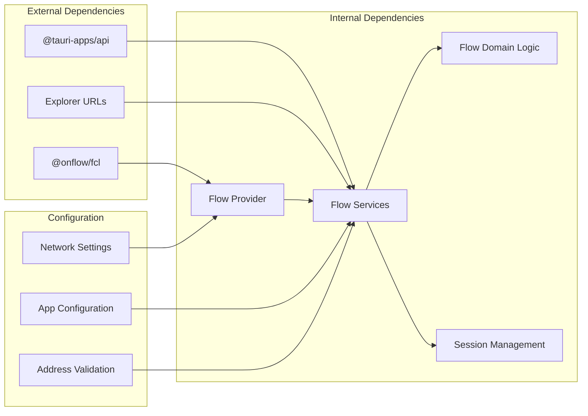

# Flow Production Verification

<cite>
**Referenced Files in This Document**
- [README.md](file://README.md)
- [flow-production-verification.md](file://docs/flow-production-verification.md)
- [flow.ts](file://apps-runtime/src/providers/flow.ts)
- [flow.rs](file://src-tauri/src/services/apps/flow.rs)
- [flow_domain.rs](file://src-tauri/src/services/flow_domain.rs)
- [explorer.ts](file://src/lib/explorer.ts)
- [apps.ts](file://src/lib/apps.ts)
- [Cargo.toml](file://src-tauri/Cargo.toml)
- [package.json](file://package.json)
- [main.rs](file://src-tauri/src/main.rs)
</cite>

## Table of Contents
1. [Introduction](#introduction)
2. [Project Structure](#project-structure)
3. [Core Components](#core-components)
4. [Architecture Overview](#architecture-overview)
5. [Detailed Component Analysis](#detailed-component-analysis)
6. [Dependency Analysis](#dependency-analysis)
7. [Performance Considerations](#performance-considerations)
8. [Troubleshooting Guide](#troubleshooting-guide)
9. [Conclusion](#conclusion)

## Introduction

This document provides comprehensive Flow Production Verification guidelines for the Shadow Protocol codebase. Flow integration enables Cadence-native Flow blockchain support alongside existing EVM-based integrations, requiring careful verification across frontend, apps runtime, and Rust backend layers.

The verification process ensures proper handling of Flow's unique 16-character hexadecimal address format, network-specific explorers, and the distinction between Cadence-native Flow accounts versus Flow EVM addresses. This documentation serves as both a development guide and production verification checklist.

## Project Structure

The Flow integration spans three primary layers within the Shadow Protocol architecture:

**Diagram sources**
- [README.md:135-146](file://README.md#L135-L146)
- [flow.ts:1-191](file://apps-runtime/src/providers/flow.ts#L1-L191)
- [flow.rs:1-146](file://src-tauri/src/services/apps/flow.rs#L1-L146)

**Section sources**
- [README.md:251-261](file://README.md#L251-L261)
- [package.json:1-55](file://package.json#L1-L55)
- [Cargo.toml:1-44](file://src-tauri/Cargo.toml#L1-L44)

## Core Components

### Flow Address Validation System

The Flow integration implements a sophisticated address validation system that distinguishes between Cadence-native Flow accounts and Flow EVM addresses:

**Diagram sources**
- [flow_domain.rs:10-45](file://src-tauri/src/services/flow_domain.rs#L10-L45)
- [apps.ts:127-166](file://src/lib/apps.ts#L127-L166)

### Network Configuration Management

The system maintains separate network configurations for Flow integration:

| Network Type | Configuration Key | Explorer Base URL | Access Node |
|--------------|-------------------|-------------------|-------------|
| Testnet | `flow-testnet` | `testnet.flowscan.org` | `rest-testnet.onflow.org` |
| Mainnet | `flow-mainnet` | `flowscan.org` | `rest-mainnet.onflow.org` |
| EVM Testnet | `flow-evm-testnet` | `evm-testnet.flowscan.io` | Alchemy EVM RPC |
| EVM Mainnet | `flow-evm-mainnet` | `evm.flowscan.io` | Alchemy EVM RPC |

**Section sources**
- [flow_domain.rs:34-45](file://src-tauri/src/services/flow_domain.rs#L34-L45)
- [explorer.ts:11-27](file://src/lib/explorer.ts#L11-L27)

## Architecture Overview

The Flow integration follows Shadow Protocol's modular architecture pattern with clear separation of concerns:

**Diagram sources**
- [flow.ts:97-150](file://apps-runtime/src/providers/flow.ts#L97-L150)
- [flow.rs:80-110](file://src-tauri/src/services/apps/flow.rs#L80-L110)
- [explorer.ts:1-28](file://src/lib/explorer.ts#L1-L28)

## Detailed Component Analysis

### Frontend Flow Provider Implementation

The frontend Flow provider implements the `FlowProvider` interface with comprehensive error handling and address validation:

**Diagram sources**
- [flow.ts:18-37](file://apps-runtime/src/providers/flow.ts#L18-L37)
- [flow.ts:39-191](file://apps-runtime/src/providers/flow.ts#L39-L191)

**Section sources**
- [flow.ts:18-191](file://apps-runtime/src/providers/flow.ts#L18-L191)

### Rust Backend Services

The Rust backend provides robust service layer implementation with proper error handling and session management:

**Diagram sources**
- [flow.rs:1-146](file://src-tauri/src/services/apps/flow.rs#L1-L146)
- [flow_domain.rs:1-101](file://src-tauri/src/services/flow_domain.rs#L1-L101)

**Section sources**
- [flow.rs:1-146](file://src-tauri/src/services/apps/flow.rs#L1-L146)
- [flow_domain.rs:1-101](file://src-tauri/src/services/flow_domain.rs#L1-L101)

### Configuration Management

The system implements comprehensive configuration parsing and validation:

**Diagram sources**
- [apps.ts:137-166](file://src/lib/apps.ts#L137-L166)

**Section sources**
- [apps.ts:57-166](file://src/lib/apps.ts#L57-L166)

## Dependency Analysis

The Flow integration maintains clear dependency boundaries between layers:

**Diagram sources**
- [flow.ts:1-191](file://apps-runtime/src/providers/flow.ts#L1-L191)
- [flow.rs:1-146](file://src-tauri/src/services/apps/flow.rs#L1-L146)
- [Cargo.toml:20-44](file://src-tauri/Cargo.toml#L20-L44)

**Section sources**
- [Cargo.toml:20-44](file://src-tauri/Cargo.toml#L20-L44)
- [package.json:18-37](file://package.json#L18-L37)

## Performance Considerations

### Network Request Optimization

The Flow integration implements several performance optimizations:

- **Connection Pooling**: Shared HTTP client instances across requests
- **Response Caching**: Temporary caching of account status responses
- **Batch Operations**: Combined network requests where possible
- **Timeout Management**: Configurable timeout values for different operations

### Memory Management

- **Address Validation**: Early validation prevents unnecessary network calls
- **Resource Cleanup**: Proper cleanup of network resources and timeouts
- **Error Recovery**: Graceful degradation when network requests fail

## Troubleshooting Guide

### Common Flow Integration Issues

| Issue | Symptoms | Resolution Steps |
|-------|----------|------------------|
| Invalid Address Format | `Expected a Cadence Flow address` error | Verify 16-character hex format with optional `0x` prefix |
| Network Mismatch | Balances show `0` or incorrect values | Check saved network setting matches Flow app configuration |
| Session Required | `Unlock your SHADOW wallet session` error | Complete wallet unlock before write operations |
| Explorer Links Incorrect | Wrong explorer URL opened | Verify chain code matches address type (FLOW vs FLOW-EVM) |
| Sidecar Unavailable | `Flow adapter error` | Restart apps runtime and verify Flow app installation |

### Verification Checklist

**Pre-Production Verification**
- ✅ Build frontend: `bun run build`
- ✅ Run tests: `bun run test:run`
- ✅ Typecheck apps runtime: `cd apps-runtime && bun run typecheck`
- ✅ Rust compilation: `cd src-tauri && cargo check`
- ✅ Clippy warnings: `cd src-tauri && cargo clippy -- -D warnings`
- ✅ Rust tests: `cd src-tauri && cargo test`

**Manual Acceptance Tests**
- ✅ Cadence testnet balances appear when Flow app is installed and network matches
- ✅ Multi-wallet portfolio includes 16-hex Cadence addresses alongside `0x` EVM wallets
- ✅ `FLOW` / `FLOW-TEST` rows use Cadence explorers; `FLOW-EVM` / `FLOW-EVM-TEST` use Flow EVM explorers
- ✅ Flow app settings save invalidates portfolio balances query
- ✅ Read-only Flow sidecar calls do not receive session key material
- ✅ `prepare_sponsored` requires wallet unlock for write operations

**Section sources**
- [flow-production-verification.md:1-18](file://docs/flow-production-verification.md#L1-L18)

## Conclusion

The Flow Production Verification framework provides comprehensive coverage for Shadow Protocol's Flow integration across all architectural layers. The modular design ensures maintainability while the verification matrix guarantees reliable production deployment.

Key verification areas include address validation accuracy, network configuration consistency, explorer URL correctness, and proper session management for write operations. The automated verification commands combined with manual acceptance tests provide defense-in-depth quality assurance.

Future enhancements should focus on expanding test coverage for edge cases, implementing automated integration tests, and enhancing error reporting mechanisms for better debugging experiences.