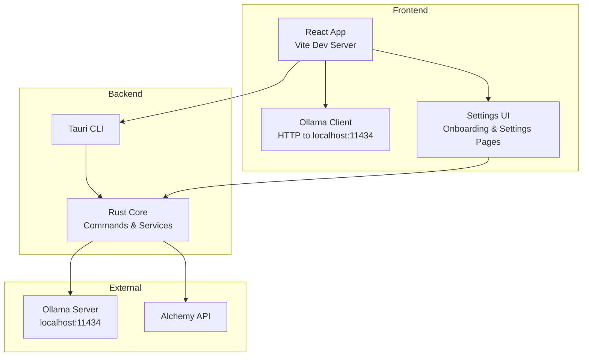

# Getting Started

<cite>
**Referenced Files in This Document**
- [README.md](file://README.md)
- [package.json](file://package.json)
- [vite.config.ts](file://vite.config.ts)
- [src-tauri/tauri.conf.json](file://src-tauri/tauri.conf.json)
- [src-tauri/Cargo.toml](file://src-tauri/Cargo.toml)
- [src/lib/ollama.ts](file://src/lib/ollama.ts)
- [src/components/OllamaSetup.tsx](file://src/components/OllamaSetup.tsx)
- [src/lib/modelOptions.ts](file://src/lib/modelOptions.ts)
- [src/store/useOllamaStore.ts](file://src/store/useOllamaStore.ts)
- [src-tauri/src/services/settings.rs](file://src-tauri/src/services/settings.rs)
- [src-tauri/src/commands/settings.rs](file://src-tauri/src/commands/settings.rs)
- [src/components/onboarding/InitializationSequence.tsx](file://src/components/onboarding/InitializationSequence.tsx)
- [src/components/onboarding/steps/Step3Uplink.tsx](file://src/components/onboarding/steps/Step3Uplink.tsx)
- [src/main.tsx](file://src/main.tsx)
- [src/App.tsx](file://src/App.tsx)
- [docs/ollama-setup-verification.md](file://docs/ollama-setup-verification.md)
</cite>

## Table of Contents
1. [Introduction](#introduction)
2. [Prerequisites](#prerequisites)
3. [Installation Steps](#installation-steps)
4. [Environment Configuration](#environment-configuration)
5. [Platform-Specific Considerations](#platform-specific-considerations)
6. [Verification and Basic Functionality Testing](#verification-and-basic-functionality-testing)
7. [Troubleshooting Guide](#troubleshooting-guide)
8. [Architecture Overview](#architecture-overview)
9. [Conclusion](#conclusion)

## Introduction
SHADOW Protocol is a privacy-first, desktop-native DeFi automation workstation. It combines a modern React frontend with a Rust backend, integrates local AI via Ollama, and connects to blockchain data through Alchemy. This guide focuses on rapid deployment and initial setup so you can run the development environment quickly and verify core functionality.

## Prerequisites
Before installing SHADOW Protocol, ensure your system meets the following requirements:
- Rust toolchain 1.75 or newer
- Bun runtime
- Ollama server (local LLM inference)
- Alchemy API key (for on-chain data)

These prerequisites are documented in the project’s README under “Why SHADOW” and “Rapid Deployment.”

**Section sources**
- [README.md:55-59](file://README.md#L55-L59)
- [README.md:62-74](file://README.md#L62-L74)

## Installation Steps
Follow these step-by-step instructions to clone, install dependencies, configure the environment, and launch the development server.

1. Clone the repository
   - Use the repository URL and navigate into the project directory.
   - Confirm you are in the repository root.

2. Install JavaScript dependencies
   - Run the Bun install command to populate node_modules and lockfiles.

3. Configure environment variables
   - Copy the example environment file to .env.
   - Add your Alchemy API key to .env.

4. Start the development server
   - Run the Tauri development script to launch the app with hot reloading.

Notes:
- The README provides a concise “Rapid Deployment” section with the exact commands.
- The frontend build pipeline uses Vite and Tailwind, and the Tauri CLI orchestrates the Rust backend and frontend bundling.

**Section sources**
- [README.md:62-74](file://README.md#L62-L74)
- [package.json:6-16](file://package.json#L6-L16)
- [vite.config.ts:10-52](file://vite.config.ts#L10-L52)

## Environment Configuration
SHADOW uses a layered configuration approach:
- Frontend environment variables
  - The frontend reads environment variables via Vite’s import.meta.env.
  - The Tauri configuration defines the dev URL and build behavior.
- Backend environment variables
  - The Rust backend loads environment variables via dotenvy and exposes commands to manage secrets.
- Secret storage
  - Keys are stored securely in the OS keychain via the keyring crate and cached in-process for performance.

Key configuration points:
- Tauri dev URL and build commands are defined in tauri.conf.json.
- The frontend expects Alchemy API connectivity for portfolio data.
- The Rust settings module persists keys to the OS keychain and supports retrieval and removal.

**Section sources**
- [vite.config.ts:7-40](file://vite.config.ts#L7-L40)
- [src-tauri/tauri.conf.json:6-11](file://src-tauri/tauri.conf.json#L6-L11)
- [src-tauri/Cargo.toml:37-37](file://src-tauri/Cargo.toml#L37-L37)
- [src-tauri/src/services/settings.rs:117-200](file://src-tauri/src/services/settings.rs#L117-L200)
- [src-tauri/src/commands/settings.rs:47-85](file://src-tauri/src/commands/settings.rs#L47-L85)

## Platform-Specific Considerations
- Windows
  - Tauri build targets include x86_64-pc-windows-msvc.
  - The Tauri configuration sets a minimum width and height for the main window and enables developer tools.
- macOS
  - The Tauri configuration specifies a minimum system version.
  - The Ollama auto-setup flow includes macOS-specific behaviors and verification steps.
- Linux
  - Tauri builds target all platforms; adjust target as needed for distribution.
  - Ensure Ollama is reachable on localhost:11434 and that firewall rules permit connections.

Additional notes:
- The frontend listens for context menu events to enable developer tools when appropriate.
- The app initializes a React Query client and mounts the root component.

**Section sources**
- [package.json:15-16](file://package.json#L15-L16)
- [src-tauri/tauri.conf.json:32-34](file://src-tauri/tauri.conf.json#L32-L34)
- [src-tauri/tauri.conf.json:49-51](file://src-tauri/tauri.conf.json#L49-L51)
- [src-tauri/tauri.conf.json:13-31](file://src-tauri/tauri.conf.json#L13-L31)
- [src/App.tsx:13-32](file://src/App.tsx#L13-L32)
- [src/main.tsx:8-16](file://src/main.tsx#L8-L16)

## Verification and Basic Functionality Testing
After launching the development server, verify the setup by checking:
- Application startup
  - The React app initializes with a QueryClient provider and renders the main App component.
- Ollama integration
  - The frontend communicates with Ollama on localhost:11434.
  - The Ollama client exposes functions to check status, pull models, and stream progress.
  - The Ollama setup UI guides users through installation, service start, and model selection.
- Alchemy connectivity
  - The onboarding flow collects an Alchemy API key.
  - The settings commands persist and retrieve the key from the OS keychain.

Optional manual verification steps (macOS):
- Follow the Ollama auto-setup verification guide to confirm installation, service start, model pull, and error recovery scenarios.

**Section sources**
- [src/main.tsx:8-16](file://src/main.tsx#L8-L16)
- [src/App.tsx:9-46](file://src/App.tsx#L9-L46)
- [src/lib/ollama.ts:4-40](file://src/lib/ollama.ts#L4-L40)
- [src/components/OllamaSetup.tsx:31-137](file://src/components/OllamaSetup.tsx#L31-L137)
- [src/components/onboarding/steps/Step3Uplink.tsx:74-97](file://src/components/onboarding/steps/Step3Uplink.tsx#L74-L97)
- [docs/ollama-setup-verification.md:1-66](file://docs/ollama-setup-verification.md#L1-L66)

## Troubleshooting Guide
Common setup issues and resolutions:
- Ollama not reachable
  - Symptoms: Fetch errors, connection refused, or model not found.
  - Actions: Ensure Ollama is installed and running locally on port 11434. Use the Ollama setup UI to install/start the service and pull the desired model.
- Missing or invalid Alchemy API key
  - Symptoms: Portfolio data not loading or API errors.
  - Actions: Enter a valid Alchemy API key in the onboarding flow or settings page. Persist the key via the settings commands; the backend stores it in the OS keychain.
- Port conflicts during development
  - Symptoms: Vite fails to start on the fixed port.
  - Actions: Ensure port 3000 is free or adjust the dev server configuration in tauri.conf.json and vite.config.ts.
- Rust build failures
  - Symptoms: Cargo errors related to toolchain or dependencies.
  - Actions: Verify Rust 1.75+ is installed and up-to-date. Clean and rebuild the Rust workspace if needed.

**Section sources**
- [src/lib/ollama.ts:153-165](file://src/lib/ollama.ts#L153-L165)
- [src-tauri/src/services/settings.rs:117-200](file://src-tauri/src/services/settings.rs#L117-L200)
- [src-tauri/tauri.conf.json:8-8](file://src-tauri/tauri.conf.json#L8-L8)
- [vite.config.ts:36-46](file://vite.config.ts#L36-L46)
- [src-tauri/Cargo.toml:20-44](file://src-tauri/Cargo.toml#L20-L44)

## Architecture Overview
The development workflow integrates the frontend, backend, and local AI stack:
- Frontend (React + Vite)
  - Hot-reload enabled during development.
  - Routes and UI components are rendered by the main App component.
- Backend (Tauri + Rust)
  - Tauri manages the desktop shell and exposes commands to the frontend.
  - Rust services handle key management, settings persistence, and integrations.
- Local AI (Ollama)
  - The frontend communicates with Ollama on localhost:11434.
  - The Ollama client provides status checks, model pulls, and streaming progress.

**Diagram sources**
- [vite.config.ts:10-52](file://vite.config.ts#L10-L52)
- [src-tauri/tauri.conf.json:6-11](file://src-tauri/tauri.conf.json#L6-L11)
- [src/lib/ollama.ts:4-40](file://src/lib/ollama.ts#L4-L40)
- [src-tauri/src/services/settings.rs:117-200](file://src-tauri/src/services/settings.rs#L117-L200)

## Conclusion
You now have the essentials to deploy SHADOW Protocol locally, configure environment variables, and verify core functionality. Use the Ollama setup UI to provision local AI and the settings commands to securely store your Alchemy API key. For platform-specific nuances and advanced troubleshooting, consult the Tauri configuration and the Ollama verification guide.