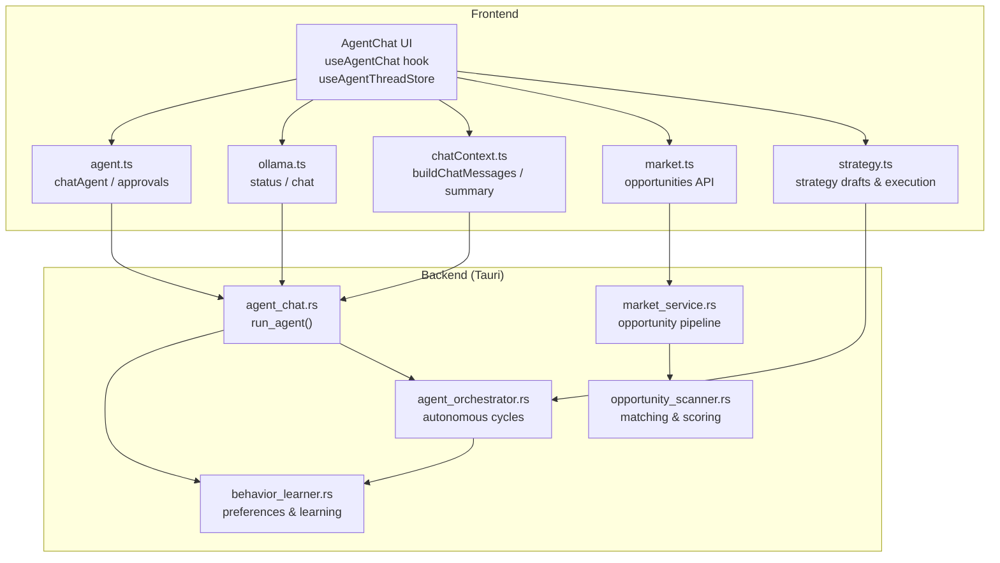
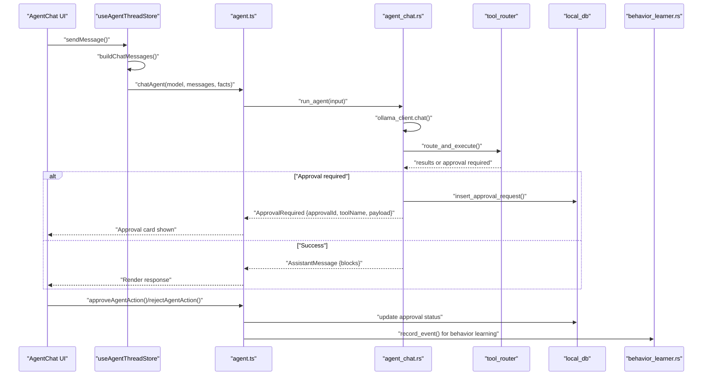
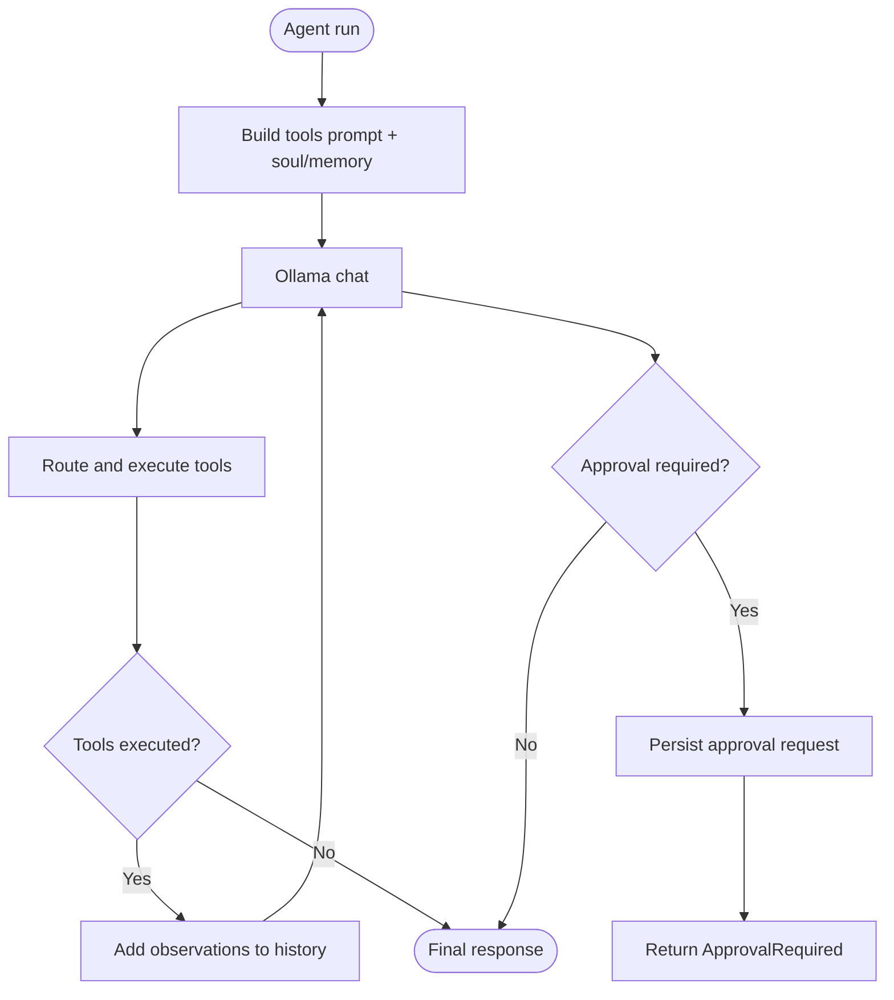
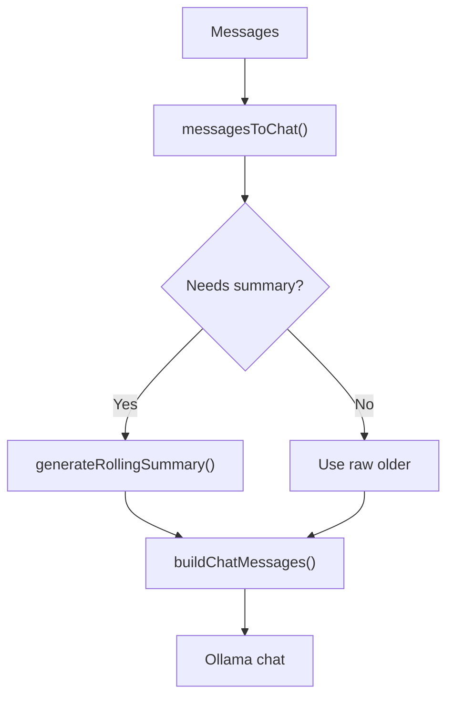
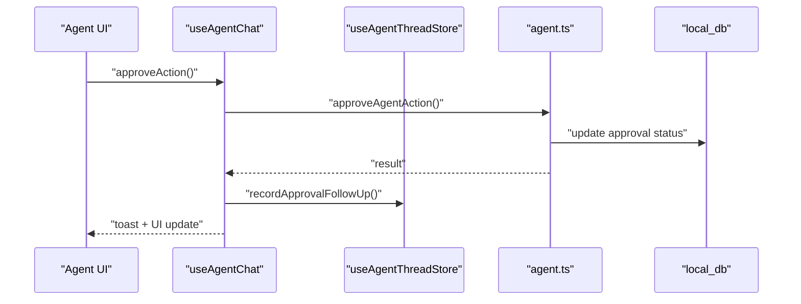
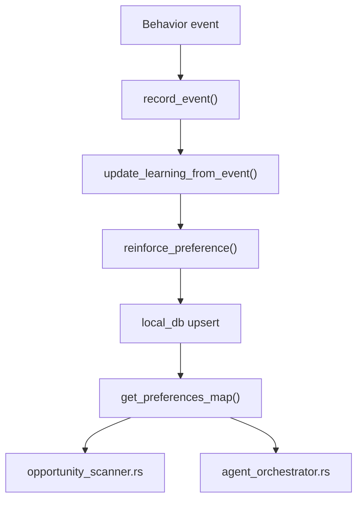
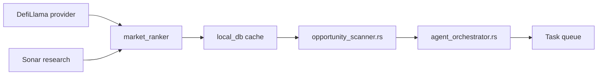
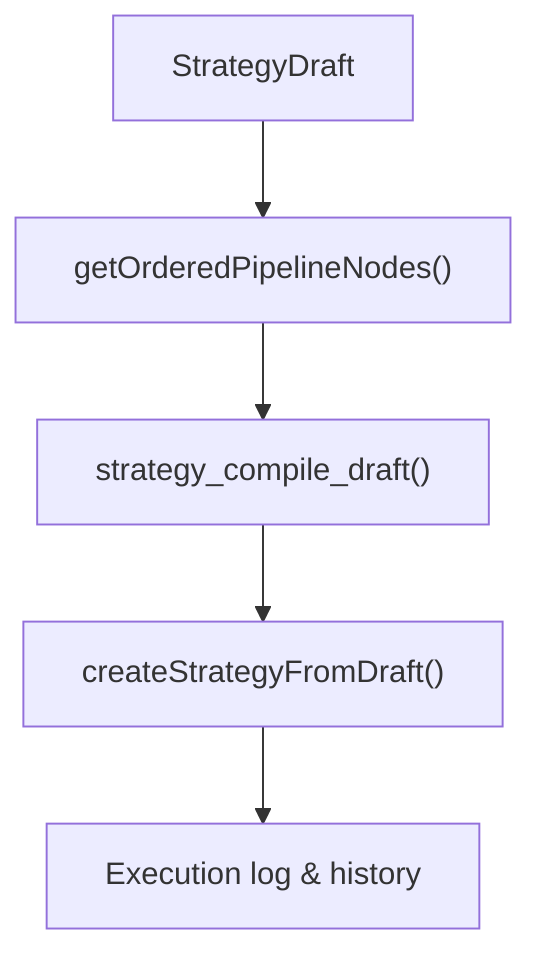
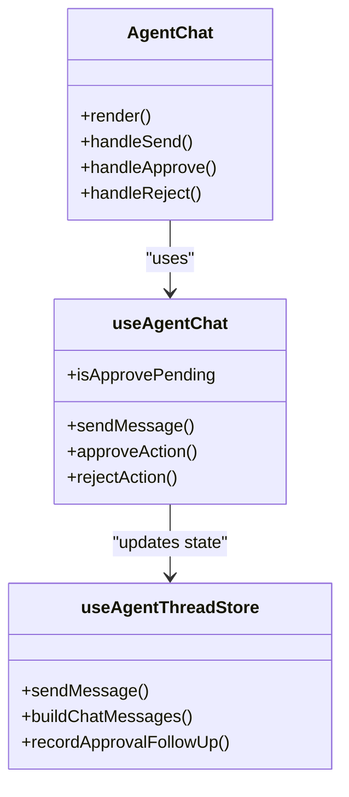
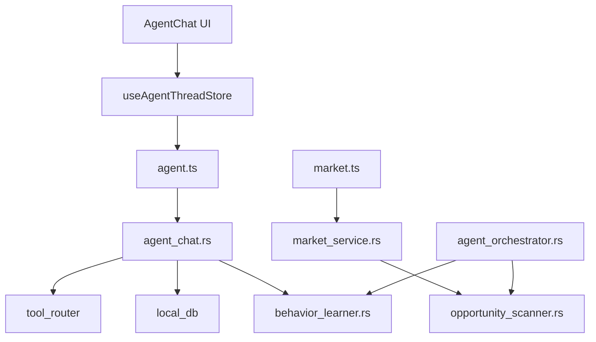

# AI Integration & Workflow

<cite>
**Referenced Files in This Document**
- [agent.ts](file://src/lib/agent.ts)
- [chatContext.ts](file://src/lib/chatContext.ts)
- [ollama.ts](file://src/lib/ollama.ts)
- [market.ts](file://src/lib/market.ts)
- [strategy.ts](file://src/lib/strategy.ts)
- [strategyPipeline.ts](file://src/lib/strategyPipeline.ts)
- [behavior_learner.rs](file://src-tauri/src/services/behavior_learner.rs)
- [agent_chat.rs](file://src-tauri/src/services/agent_chat.rs)
- [agent_orchestrator.rs](file://src-tauri/src/services/agent_orchestrator.rs)
- [market_service.rs](file://src-tauri/src/services/market_service.rs)
- [opportunity_scanner.rs](file://src-tauri/src/services/opportunity_scanner.rs)
- [AgentChat.tsx](file://src/components/agent/AgentChat.tsx)
- [useAgentChat.ts](file://src/hooks/useAgentChat.ts)
- [useAgentThreadStore.ts](file://src/store/useAgentThreadStore.ts)
</cite>

## Table of Contents
1. [Introduction](#introduction)
2. [Project Structure](#project-structure)
3. [Core Components](#core-components)
4. [Architecture Overview](#architecture-overview)
5. [Detailed Component Analysis](#detailed-component-analysis)
6. [Dependency Analysis](#dependency-analysis)
7. [Performance Considerations](#performance-considerations)
8. [Troubleshooting Guide](#troubleshooting-guide)
9. [Conclusion](#conclusion)
10. [Appendices](#appendices)

## Introduction
This document explains how the AI integration enhances DeFi operations in the system. It covers the AI agent workflow, approval and execution logging, behavior learning that adapts recommendations to user preferences and market conditions, and the real-time data pipeline from market feeds to AI analysis and actionable recommendations. It also documents the AI-powered decision support systems, risk assessment, automated strategy suggestions, and integration points with the autonomous operation system, opportunity scanning, and market intelligence components.

## Project Structure
The AI and DeFi integration spans both the frontend React application and the Rust backend services:
- Frontend: Agent UI, chat orchestration, and stores integrate with local AI models via Ollama.
- Backend: Agent orchestration, market intelligence, behavior learning, and autonomous orchestrator coordinate AI-driven decisions and actions.

**Diagram sources**
- [AgentChat.tsx:1-124](file://src/components/agent/AgentChat.tsx#L1-L124)
- [useAgentChat.ts:1-97](file://src/hooks/useAgentChat.ts#L1-L97)
- [useAgentThreadStore.ts:1-642](file://src/store/useAgentThreadStore.ts#L1-L642)
- [agent.ts:1-86](file://src/lib/agent.ts#L1-L86)
- [ollama.ts:1-165](file://src/lib/ollama.ts#L1-L165)
- [chatContext.ts:1-203](file://src/lib/chatContext.ts#L1-L203)
- [market.ts:1-135](file://src/lib/market.ts#L1-L135)
- [strategy.ts:1-218](file://src/lib/strategy.ts#L1-L218)
- [agent_chat.rs:1-359](file://src-tauri/src/services/agent_chat.rs#L1-L359)
- [behavior_learner.rs:1-460](file://src-tauri/src/services/behavior_learner.rs#L1-L460)
- [agent_orchestrator.rs:1-571](file://src-tauri/src/services/agent_orchestrator.rs#L1-L571)
- [market_service.rs:1-745](file://src-tauri/src/services/market_service.rs#L1-L745)
- [opportunity_scanner.rs:1-599](file://src-tauri/src/services/opportunity_scanner.rs#L1-L599)

**Section sources**
- [AgentChat.tsx:1-124](file://src/components/agent/AgentChat.tsx#L1-L124)
- [useAgentChat.ts:1-97](file://src/hooks/useAgentChat.ts#L1-L97)
- [useAgentThreadStore.ts:1-642](file://src/store/useAgentThreadStore.ts#L1-L642)
- [agent.ts:1-86](file://src/lib/agent.ts#L1-L86)
- [ollama.ts:1-165](file://src/lib/ollama.ts#L1-L165)
- [chatContext.ts:1-203](file://src/lib/chatContext.ts#L1-L203)
- [market.ts:1-135](file://src/lib/market.ts#L1-L135)
- [strategy.ts:1-218](file://src/lib/strategy.ts#L1-L218)
- [agent_chat.rs:1-359](file://src-tauri/src/services/agent_chat.rs#L1-L359)
- [behavior_learner.rs:1-460](file://src-tauri/src/services/behavior_learner.rs#L1-L460)
- [agent_orchestrator.rs:1-571](file://src-tauri/src/services/agent_orchestrator.rs#L1-L571)
- [market_service.rs:1-745](file://src-tauri/src/services/market_service.rs#L1-L745)
- [opportunity_scanner.rs:1-599](file://src-tauri/src/services/opportunity_scanner.rs#L1-L599)

## Core Components
- Local AI model integration: Ollama status, model management, and chat invocation.
- Agent chat orchestration: deterministic advice pipeline with tool execution and approval gating.
- Market intelligence: opportunity discovery, ranking, and research augmentation.
- Behavior learning: user preference modeling and Bayesian updates.
- Autonomous orchestrator: periodic health checks, opportunity scans, and task generation.
- Strategy builder and execution: guardrails, simulations, and execution logging.

**Section sources**
- [ollama.ts:1-165](file://src/lib/ollama.ts#L1-L165)
- [agent.ts:1-86](file://src/lib/agent.ts#L1-L86)
- [agent_chat.rs:1-359](file://src-tauri/src/services/agent_chat.rs#L1-L359)
- [market_service.rs:1-745](file://src-tauri/src/services/market_service.rs#L1-L745)
- [behavior_learner.rs:1-460](file://src-tauri/src/services/behavior_learner.rs#L1-L460)
- [agent_orchestrator.rs:1-571](file://src-tauri/src/services/agent_orchestrator.rs#L1-L571)
- [strategy.ts:1-218](file://src/lib/strategy.ts#L1-L218)

## Architecture Overview
The AI integration follows a deterministic pipeline:
- Frontend builds a context-aware chat payload using rolling summaries and structured facts.
- The backend agent runs the LLM, executes tools, and returns either a final response or an approval-required action.
- Approval flow triggers UI cards and logs execution attempts.
- Behavior learning updates user preferences based on approvals, rejections, and outcomes.
- The orchestrator periodically scans markets, evaluates health, and generates tasks informed by preferences.

**Diagram sources**
- [useAgentThreadStore.ts:198-533](file://src/store/useAgentThreadStore.ts#L198-L533)
- [agent.ts:14-85](file://src/lib/agent.ts#L14-L85)
- [agent_chat.rs:190-358](file://src-tauri/src/services/agent_chat.rs#L190-L358)
- [behavior_learner.rs:112-158](file://src-tauri/src/services/behavior_learner.rs#L112-L158)

**Section sources**
- [useAgentThreadStore.ts:198-533](file://src/store/useAgentThreadStore.ts#L198-L533)
- [agent.ts:14-85](file://src/lib/agent.ts#L14-L85)
- [agent_chat.rs:190-358](file://src-tauri/src/services/agent_chat.rs#L190-L358)
- [behavior_learner.rs:112-158](file://src-tauri/src/services/behavior_learner.rs#L112-L158)

## Detailed Component Analysis

### AI Agent Chat Orchestration
- Builds a system prompt enriched with agent soul/persona, risk appetite, preferred chains, and memory facts.
- Maintains a rolling summary when context exceeds model budget.
- Executes tools and surfaces results; if an action requires approval, persists an approval record and returns an approval-required response.
- Supports demo mode to simulate without execution.

**Diagram sources**
- [agent_chat.rs:214-235](file://src-tauri/src/services/agent_chat.rs#L214-L235)
- [agent_chat.rs:269-358](file://src-tauri/src/services/agent_chat.rs#L269-L358)

**Section sources**
- [agent_chat.rs:1-359](file://src-tauri/src/services/agent_chat.rs#L1-L359)
- [chatContext.ts:59-90](file://src/lib/chatContext.ts#L59-L90)
- [chatContext.ts:177-202](file://src/lib/chatContext.ts#L177-L202)

### Conversation Flow Patterns and Structured Context
- Rolling summaries and latest-N messages ensure long-term context while respecting token budgets.
- Structured facts extracted from tool outputs are merged to support follow-up queries.
- System prompts and role mapping align frontend messages with Ollama expectations.

**Diagram sources**
- [chatContext.ts:29-45](file://src/lib/chatContext.ts#L29-L45)
- [chatContext.ts:101-115](file://src/lib/chatContext.ts#L101-L115)
- [chatContext.ts:177-202](file://src/lib/chatContext.ts#L177-L202)
- [chatContext.ts:59-90](file://src/lib/chatContext.ts#L59-L90)

**Section sources**
- [chatContext.ts:1-203](file://src/lib/chatContext.ts#L1-L203)

### Approval Workflows and Execution Logging
- Approval requests are persisted with tool name, payload, and expiration.
- Frontend displays approval cards and handles approve/reject actions.
- Execution logs capture approval outcomes and agent follow-ups.

**Diagram sources**
- [useAgentChat.ts:39-78](file://src/hooks/useAgentChat.ts#L39-L78)
- [useAgentThreadStore.ts:565-596](file://src/store/useAgentThreadStore.ts#L565-L596)
- [agent.ts:29-51](file://src/lib/agent.ts#L29-L51)

**Section sources**
- [useAgentChat.ts:1-97](file://src/hooks/useAgentChat.ts#L1-L97)
- [useAgentThreadStore.ts:565-596](file://src/store/useAgentThreadStore.ts#L565-L596)
- [agent.ts:29-51](file://src/lib/agent.ts#L29-L51)

### Behavior Learning System
- Tracks user behavior events (approvals, rejections, strategy activations, trades, transfers).
- Updates learned preferences using Bayesian updates with confidence and sample counts.
- Provides preference maps for matching opportunities and generating reasoning chains.

**Diagram sources**
- [behavior_learner.rs:112-158](file://src-tauri/src/services/behavior_learner.rs#L112-L158)
- [behavior_learner.rs:202-256](file://src-tauri/src/services/behavior_learner.rs#L202-L256)
- [behavior_learner.rs:259-313](file://src-tauri/src/services/behavior_learner.rs#L259-L313)
- [behavior_learner.rs:322-330](file://src-tauri/src/services/behavior_learner.rs#L322-L330)

**Section sources**
- [behavior_learner.rs:1-460](file://src-tauri/src/services/behavior_learner.rs#L1-L460)

### Real-Time Market Intelligence and Opportunity Scanning
- Market service aggregates candidates from multiple providers, ranks them, and caches results.
- Opportunity scanner matches opportunities to user preferences and portfolio context.
- Orchestrator coordinates periodic scans and health checks to generate tasks.

**Diagram sources**
- [market_service.rs:292-365](file://src-tauri/src/services/market_service.rs#L292-L365)
- [market_service.rs:336-345](file://src-tauri/src/services/market_service.rs#L336-L345)
- [opportunity_scanner.rs:126-161](file://src-tauri/src/services/opportunity_scanner.rs#L126-L161)
- [agent_orchestrator.rs:289-328](file://src-tauri/src/services/agent_orchestrator.rs#L289-L328)

**Section sources**
- [market_service.rs:1-745](file://src-tauri/src/services/market_service.rs#L1-L745)
- [opportunity_scanner.rs:1-599](file://src-tauri/src/services/opportunity_scanner.rs#L1-L599)
- [agent_orchestrator.rs:1-571](file://src-tauri/src/services/agent_orchestrator.rs#L1-L571)

### AI-Powered Decision Support and Automated Strategies
- Strategy builder supports guardrails, simulations, and approval policies.
- Strategy pipeline orders nodes from triggers to actions for deterministic execution.
- Market opportunities can be turned into agent drafts or approval-required actions.

**Diagram sources**
- [strategy.ts:174-201](file://src/lib/strategy.ts#L174-L201)
- [strategyPipeline.ts:8-39](file://src/lib/strategyPipeline.ts#L8-L39)

**Section sources**
- [strategy.ts:1-218](file://src/lib/strategy.ts#L1-L218)
- [strategyPipeline.ts:1-116](file://src/lib/strategyPipeline.ts#L1-L116)

### Frontend Agent UI and Stores
- AgentChat renders messages, streams agent replies, and handles approvals.
- useAgentChat manages approval lifecycle and toast notifications.
- useAgentThreadStore orchestrates message building, context budgeting, and approval persistence.

**Diagram sources**
- [AgentChat.tsx:1-124](file://src/components/agent/AgentChat.tsx#L1-L124)
- [useAgentChat.ts:1-97](file://src/hooks/useAgentChat.ts#L1-L97)
- [useAgentThreadStore.ts:198-533](file://src/store/useAgentThreadStore.ts#L198-L533)

**Section sources**
- [AgentChat.tsx:1-124](file://src/components/agent/AgentChat.tsx#L1-L124)
- [useAgentChat.ts:1-97](file://src/hooks/useAgentChat.ts#L1-L97)
- [useAgentThreadStore.ts:1-642](file://src/store/useAgentThreadStore.ts#L1-L642)

## Dependency Analysis
- Frontend depends on local AI via Ollama and invokes backend agent functions.
- Backend agent depends on tool routing, local DB, and behavior learning.
- Market service depends on external providers and internal ranking logic.
- Orchestrator coordinates market scanning, health checks, and task generation.

**Diagram sources**
- [useAgentThreadStore.ts:198-533](file://src/store/useAgentThreadStore.ts#L198-L533)
- [agent.ts:14-85](file://src/lib/agent.ts#L14-L85)
- [agent_chat.rs:190-358](file://src-tauri/src/services/agent_chat.rs#L190-L358)
- [market.ts:16-40](file://src/lib/market.ts#L16-L40)
- [market_service.rs:263-365](file://src-tauri/src/services/market_service.rs#L263-L365)
- [opportunity_scanner.rs:126-161](file://src-tauri/src/services/opportunity_scanner.rs#L126-L161)
- [agent_orchestrator.rs:289-328](file://src-tauri/src/services/agent_orchestrator.rs#L289-L328)
- [behavior_learner.rs:112-158](file://src-tauri/src/services/behavior_learner.rs#L112-L158)

**Section sources**
- [useAgentThreadStore.ts:198-533](file://src/store/useAgentThreadStore.ts#L198-L533)
- [agent.ts:14-85](file://src/lib/agent.ts#L14-L85)
- [agent_chat.rs:190-358](file://src-tauri/src/services/agent_chat.rs#L190-L358)
- [market.ts:16-40](file://src/lib/market.ts#L16-L40)
- [market_service.rs:263-365](file://src-tauri/src/services/market_service.rs#L263-L365)
- [opportunity_scanner.rs:126-161](file://src-tauri/src/services/opportunity_scanner.rs#L126-L161)
- [agent_orchestrator.rs:289-328](file://src-tauri/src/services/agent_orchestrator.rs#L289-L328)
- [behavior_learner.rs:112-158](file://src-tauri/src/services/behavior_learner.rs#L112-L158)

## Performance Considerations
- Context budgeting and rolling summaries prevent excessive token usage.
- Periodic caching and stale detection reduce redundant provider calls.
- Asynchronous orchestration prevents blocking the UI during long-running operations.
- Bayesian preference updates avoid frequent recalculations by incrementally updating confidence.

[No sources needed since this section provides general guidance]

## Troubleshooting Guide
- Ollama unavailability: detect via error classification and surface user-friendly messages.
- Approval failures: ensure expected version matches and follow-up messages are recorded.
- Market refresh failures: serve cached results and emit events for UI feedback.
- Behavior learning errors: audit and warn on failures to update preferences.

**Section sources**
- [ollama.ts:153-165](file://src/lib/ollama.ts#L153-L165)
- [useAgentThreadStore.ts:565-596](file://src/store/useAgentThreadStore.ts#L565-L596)
- [market_service.rs:601-624](file://src-tauri/src/services/market_service.rs#L601-L624)
- [behavior_learner.rs:140-142](file://src-tauri/src/services/behavior_learner.rs#L140-L142)

## Conclusion
The AI integration couples a local LLM with DeFi operations through a robust agent orchestration layer, structured approval workflows, and behavior learning. The system continuously adapts to user preferences and market conditions, enabling intelligent market scanning, risk-aware recommendations, and automated strategy execution with transparent logging and governance.

[No sources needed since this section summarizes without analyzing specific files]

## Appendices

### Example Workflows and Implementation Patterns
- Market opportunity to action:
  - Fetch opportunities → Rank and cache → Present detail → Prepare action → Approval required → Execute → Record event → Update preferences.
- Agent chat with tooling:
  - Build context → LLM reasoning → Tool execution → Observation → Repeat until tool-free → Approval gating when needed.
- Autonomous task generation:
  - Health checks → Opportunity scans → Task generation → Persist reasoning chain → Enforce guardrails.

**Section sources**
- [market.ts:16-135](file://src/lib/market.ts#L16-L135)
- [market_service.rs:263-365](file://src-tauri/src/services/market_service.rs#L263-L365)
- [agent_chat.rs:190-358](file://src-tauri/src/services/agent_chat.rs#L190-L358)
- [agent_orchestrator.rs:330-390](file://src-tauri/src/services/agent_orchestrator.rs#L330-L390)
- [behavior_learner.rs:112-158](file://src-tauri/src/services/behavior_learner.rs#L112-L158)