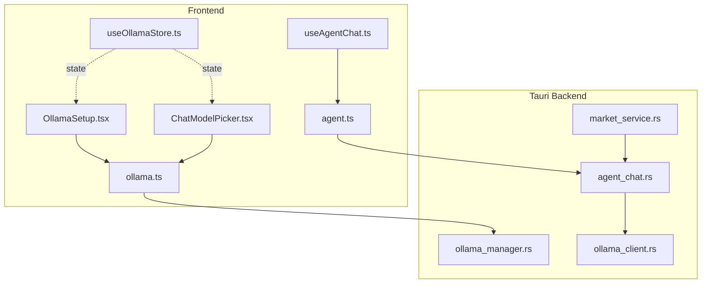
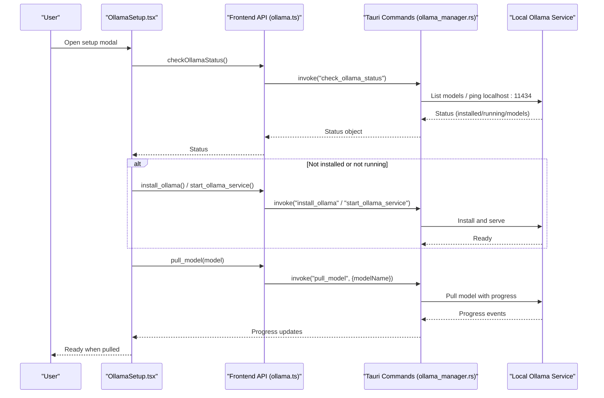
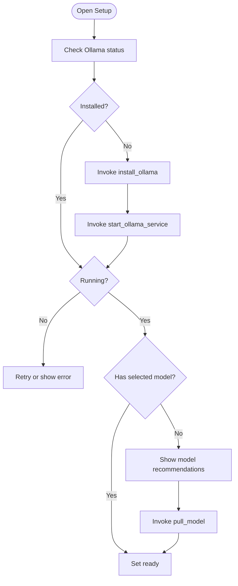
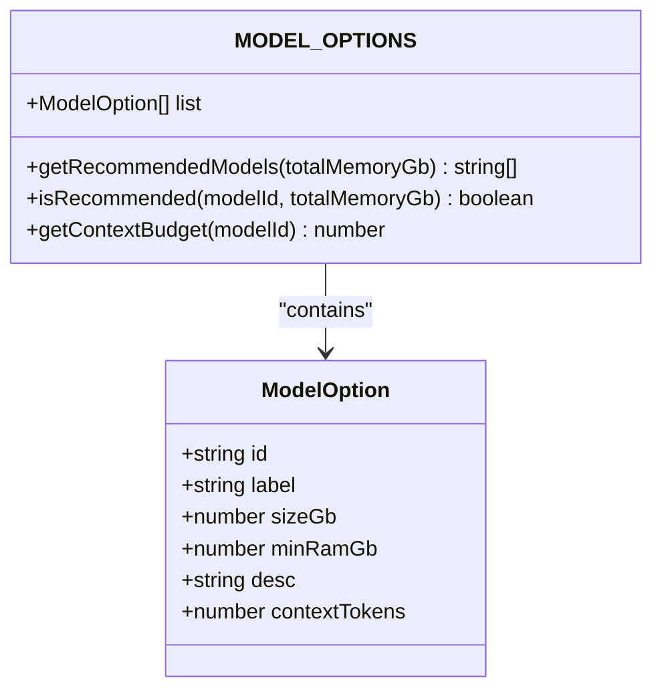
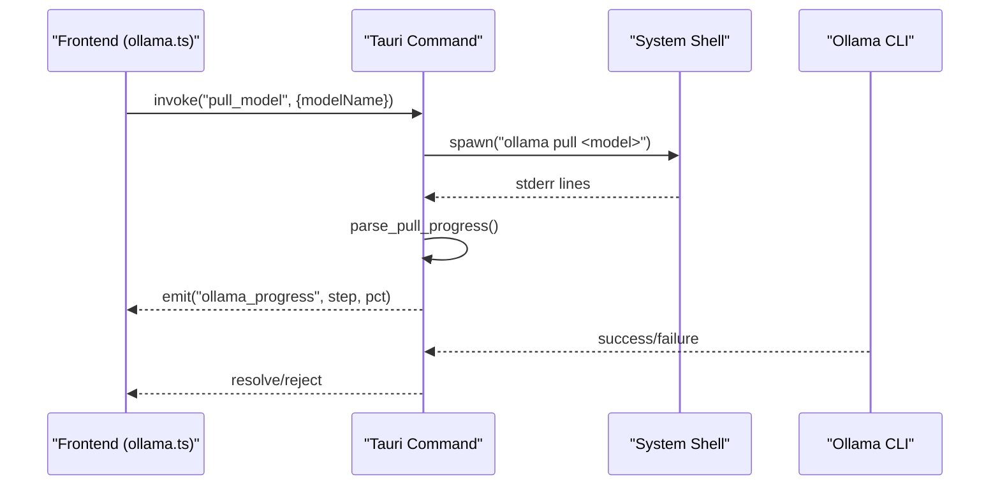
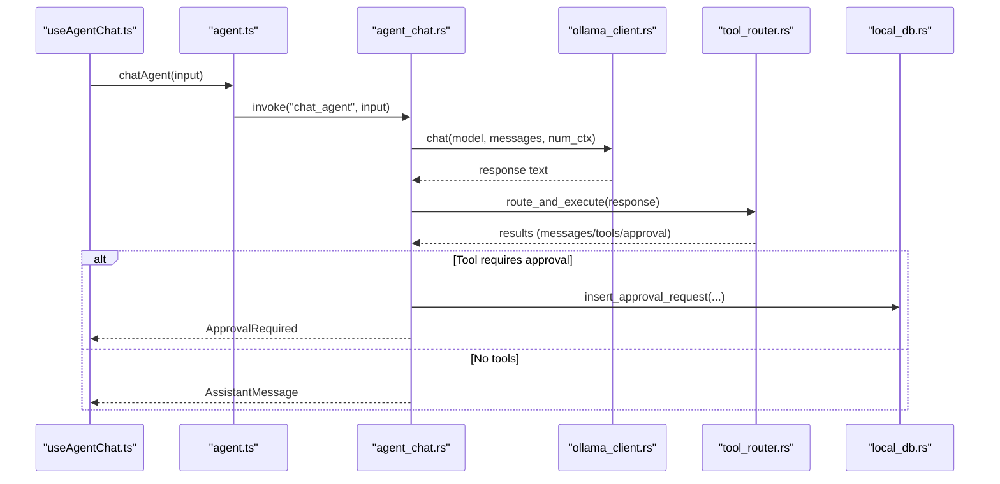
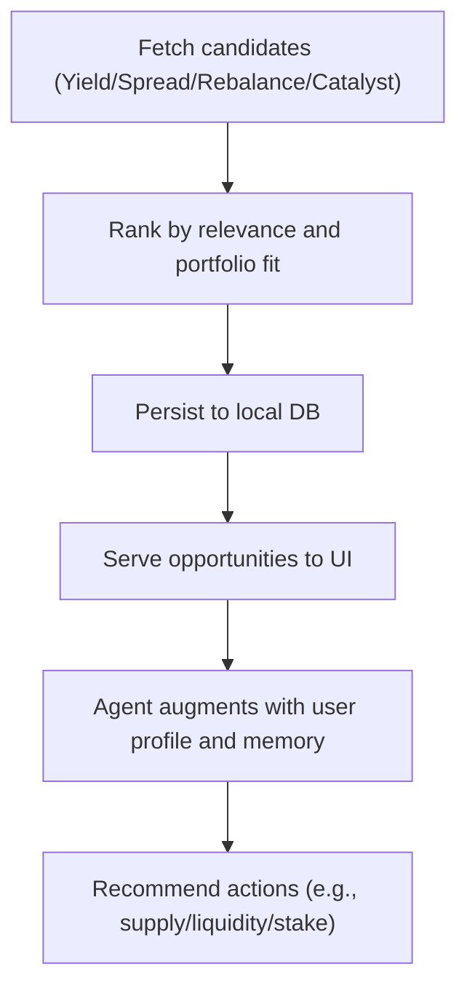
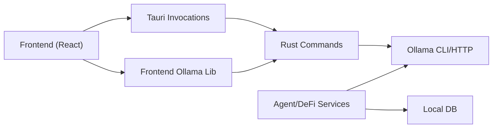

# Local AI Integration

<cite>
**Referenced Files in This Document**
- [OllamaSetup.tsx](file://src/components/OllamaSetup.tsx)
- [ollama.ts](file://src/lib/ollama.ts)
- [useOllamaStore.ts](file://src/store/useOllamaStore.ts)
- [ollama_manager.rs](file://src-tauri/src/commands/ollama_manager.rs)
- [ollama_client.rs](file://src-tauri/src/services/ollama_client.rs)
- [modelOptions.ts](file://src/lib/modelOptions.ts)
- [ChatModelPicker.tsx](file://src/components/agent/ChatModelPicker.tsx)
- [agent_chat.rs](file://src-tauri/src/services/agent_chat.rs)
- [useAgentChat.ts](file://src/hooks/useAgentChat.ts)
- [agent.ts](file://src/lib/agent.ts)
- [market_service.rs](file://src-tauri/src/services/market_service.rs)
- [opportunity_scanner.rs](file://src-tauri/src/services/opportunity_scanner.rs)
- [health_monitor.rs](file://src-tauri/src/services/health_monitor.rs)
- [PrivacyToggle.tsx](file://src/components/shared/PrivacyToggle.tsx)
- [App.tsx](file://src/App.tsx)
</cite>

## Table of Contents
1. [Introduction](#introduction)
2. [Project Structure](#project-structure)
3. [Core Components](#core-components)
4. [Architecture Overview](#architecture-overview)
5. [Detailed Component Analysis](#detailed-component-analysis)
6. [Dependency Analysis](#dependency-analysis)
7. [Performance Considerations](#performance-considerations)
8. [Troubleshooting Guide](#troubleshooting-guide)
9. [Conclusion](#conclusion)
10. [Appendices](#appendices)

## Introduction
This document explains the local AI integration system powered by Ollama, designed to keep AI inference private and on-device. It covers the OllamaSetup interface, model management, privacy guarantees, and the integration between frontend React components and the Rust-based Tauri backend. It also documents supported models, inference pipelines, DeFi-related AI capabilities (market analysis, portfolio recommendations, strategy suggestions), and practical guidance for setup, troubleshooting, and performance tuning.

## Project Structure
The AI integration spans three layers:
- Frontend (React + TypeScript): UI for setup, model selection, and agent chat.
- Tauri bridge: Commands and services that manage Ollama lifecycle and inference.
- Rust services: Orchestration of agent chat, tools, and DeFi insights.

**Diagram sources**
- [OllamaSetup.tsx:31-156](file://src/components/OllamaSetup.tsx#L31-L156)
- [ChatModelPicker.tsx:41-157](file://src/components/agent/ChatModelPicker.tsx#L41-L157)
- [useAgentChat.ts:13-96](file://src/hooks/useAgentChat.ts#L13-L96)
- [ollama.ts:17-40](file://src/lib/ollama.ts#L17-L40)
- [useOllamaStore.ts:39-82](file://src/store/useOllamaStore.ts#L39-L82)
- [agent.ts:14-27](file://src/lib/agent.ts#L14-L27)
- [ollama_manager.rs:162-187](file://src-tauri/src/commands/ollama_manager.rs#L162-L187)
- [ollama_client.rs:46-105](file://src-tauri/src/services/ollama_client.rs#L46-L105)
- [agent_chat.rs:190-358](file://src-tauri/src/services/agent_chat.rs#L190-L358)
- [market_service.rs:263-365](file://src-tauri/src/services/market_service.rs#L263-L365)

**Section sources**
- [OllamaSetup.tsx:31-156](file://src/components/OllamaSetup.tsx#L31-L156)
- [ollama.ts:17-40](file://src/lib/ollama.ts#L17-L40)
- [useOllamaStore.ts:39-82](file://src/store/useOllamaStore.ts#L39-L82)
- [ollama_manager.rs:162-187](file://src-tauri/src/commands/ollama_manager.rs#L162-L187)
- [agent.ts:14-27](file://src/lib/agent.ts#L14-L27)

## Core Components
- OllamaSetup: Guides users through installing, starting, and pulling models; displays progress and handles errors.
- Model selection and recommendation: System-aware model picker with RAM/CPU-based recommendations.
- Ollama client: Frontend wrappers for status checks, model pulls, and chat/generate requests.
- Rust Ollama manager: Installs Ollama, starts the service, lists models, pulls models with progress, and exposes system info.
- Agent chat orchestration: Deterministic pipeline integrating LLM reasoning, tool execution, and approvals.
- DeFi integration: Market scanning, portfolio health, and opportunity recommendations powered by AI-assisted reasoning.

**Section sources**
- [OllamaSetup.tsx:31-156](file://src/components/OllamaSetup.tsx#L31-L156)
- [ChatModelPicker.tsx:41-157](file://src/components/agent/ChatModelPicker.tsx#L41-L157)
- [ollama.ts:17-40](file://src/lib/ollama.ts#L17-L40)
- [ollama_manager.rs:162-187](file://src-tauri/src/commands/ollama_manager.rs#L162-L187)
- [agent_chat.rs:190-358](file://src-tauri/src/services/agent_chat.rs#L190-L358)
- [market_service.rs:263-365](file://src-tauri/src/services/market_service.rs#L263-L365)

## Architecture Overview
The system ensures privacy by keeping all inference on-device via a local Ollama server. The frontend communicates with Tauri commands to manage Ollama and invoke agent chat. The Rust agent orchestrator coordinates LLM reasoning with tool execution and guardrails.

**Diagram sources**
- [OllamaSetup.tsx:55-128](file://src/components/OllamaSetup.tsx#L55-L128)
- [ollama.ts:17-40](file://src/lib/ollama.ts#L17-L40)
- [ollama_manager.rs:190-243](file://src-tauri/src/commands/ollama_manager.rs#L190-L243)
- [ollama_manager.rs:290-327](file://src-tauri/src/commands/ollama_manager.rs#L290-L327)

## Detailed Component Analysis

### OllamaSetup: Privacy-first local inference onboarding
- Responsibilities:
  - Detect Ollama installation and service status.
  - Install Ollama if missing and start the service.
  - Recommend and pull appropriate models based on system specs.
  - Stream progress events to the UI.
- Privacy guarantees:
  - All operations occur locally; no external cloud inference.
  - Optional model deletion and custom model pulling supported.
- UI/UX:
  - Modal with progress bar and actionable buttons.
  - Error handling and retry capability.

**Diagram sources**
- [OllamaSetup.tsx:55-128](file://src/components/OllamaSetup.tsx#L55-L128)
- [ollama_manager.rs:190-243](file://src-tauri/src/commands/ollama_manager.rs#L190-L243)
- [ollama_manager.rs:290-327](file://src-tauri/src/commands/ollama_manager.rs#L290-L327)

**Section sources**
- [OllamaSetup.tsx:31-156](file://src/components/OllamaSetup.tsx#L31-L156)
- [useOllamaStore.ts:5-12](file://src/store/useOllamaStore.ts#L5-L12)
- [ollama.ts:17-40](file://src/lib/ollama.ts#L17-L40)

### Model Management and Recommendations
- Supported models:
  - llama3.2:1b (small, fast)
  - llama3.2:3b (balanced)
  - qwen2.5:3b (alternative)
- Recommendations:
  - System-aware selection based on RAM thresholds.
  - Context window defaults for unknown models.
- Frontend model picker:
  - Lists local models, recommends downloads, supports custom pulls.
  - Integrates with setup progress and status.

**Diagram sources**
- [modelOptions.ts:7-14](file://src/lib/modelOptions.ts#L7-L14)
- [modelOptions.ts:19-44](file://src/lib/modelOptions.ts#L19-L44)

**Section sources**
- [modelOptions.ts:19-64](file://src/lib/modelOptions.ts#L19-L64)
- [ChatModelPicker.tsx:41-157](file://src/components/agent/ChatModelPicker.tsx#L41-L157)

### Frontend-to-Rust Integration: Ollama client and commands
- Frontend wrappers:
  - Status checks, model pulls, system info retrieval.
  - Event listening for progress updates.
- Rust commands:
  - Install Ollama, start service, list models, pull with progress parsing.
  - Emit progress events to the frontend.

**Diagram sources**
- [ollama.ts:29-40](file://src/lib/ollama.ts#L29-L40)
- [ollama_manager.rs:290-327](file://src-tauri/src/commands/ollama_manager.rs#L290-L327)

**Section sources**
- [ollama.ts:17-165](file://src/lib/ollama.ts#L17-L165)
- [ollama_manager.rs:162-327](file://src-tauri/src/commands/ollama_manager.rs#L162-L327)

### Agent Chat Orchestration and Tools
- Pipeline:
  - Build system prompt with agent soul/memory.
  - Append conversation history.
  - Query Ollama via Rust client.
  - Route and execute tools; collect observations.
  - Return either assistant text, tool results, or approval-required state.
- Approvals:
  - Structured approval records with expiration and audit logging.
- Demo mode:
  - Optional simulation mode to avoid real actions.

**Diagram sources**
- [useAgentChat.ts:31-96](file://src/hooks/useAgentChat.ts#L31-L96)
- [agent.ts:14-27](file://src/lib/agent.ts#L14-L27)
- [agent_chat.rs:190-358](file://src-tauri/src/services/agent_chat.rs#L190-L358)
- [ollama_client.rs:46-105](file://src-tauri/src/services/ollama_client.rs#L46-L105)

**Section sources**
- [agent_chat.rs:190-358](file://src-tauri/src/services/agent_chat.rs#L190-L358)
- [ollama_client.rs:46-105](file://src-tauri/src/services/ollama_client.rs#L46-L105)
- [useAgentChat.ts:39-96](file://src/hooks/useAgentChat.ts#L39-L96)

### DeFi Operations: Market Analysis, Portfolio Recommendations, Strategy Suggestions
- Market opportunities:
  - Aggregates candidates from providers, ranks by relevance, and caches results.
  - Supports research-driven catalysts and periodic refresh.
- Opportunity scanning:
  - Scores opportunities against user preferences, portfolio fit, timing, and risk alignment.
  - Generates recommended actions and estimated value.
- Portfolio health:
  - Computes drift, concentration, performance, and risk scores.
  - Produces alerts and recommendations.
- Integration with agent:
  - Agent can summarize and contextualize opportunities for the user.

**Diagram sources**
- [market_service.rs:263-365](file://src-tauri/src/services/market_service.rs#L263-L365)
- [opportunity_scanner.rs:366-508](file://src-tauri/src/services/opportunity_scanner.rs#L366-L508)
- [health_monitor.rs:106-142](file://src-tauri/src/services/health_monitor.rs#L106-L142)

**Section sources**
- [market_service.rs:220-365](file://src-tauri/src/services/market_service.rs#L220-L365)
- [opportunity_scanner.rs:366-508](file://src-tauri/src/services/opportunity_scanner.rs#L366-L508)
- [health_monitor.rs:106-142](file://src-tauri/src/services/health_monitor.rs#L106-L142)

## Dependency Analysis
- Frontend depends on Tauri invocations for Ollama lifecycle and agent chat.
- Rust commands depend on the Ollama CLI and local HTTP server.
- Agent orchestration depends on the Ollama client and tool router.
- DeFi services depend on local DB and external provider APIs.

**Diagram sources**
- [ollama.ts:17-40](file://src/lib/ollama.ts#L17-L40)
- [ollama_manager.rs:162-187](file://src-tauri/src/commands/ollama_manager.rs#L162-L187)
- [agent_chat.rs:190-358](file://src-tauri/src/services/agent_chat.rs#L190-L358)
- [market_service.rs:263-365](file://src-tauri/src/services/market_service.rs#L263-L365)

**Section sources**
- [ollama.ts:17-165](file://src/lib/ollama.ts#L17-L165)
- [ollama_manager.rs:162-327](file://src-tauri/src/commands/ollama_manager.rs#L162-L327)
- [agent_chat.rs:190-358](file://src-tauri/src/services/agent_chat.rs#L190-L358)
- [market_service.rs:263-365](file://src-tauri/src/services/market_service.rs#L263-L365)

## Performance Considerations
- Context window sizing:
  - Use model-specific context budgets to balance quality and speed.
- Model selection:
  - Prefer smaller models on constrained systems; scale up based on RAM/CPU.
- Streaming vs non-streaming:
  - Non-streaming chat is simpler; streaming improves responsiveness.
- Concurrency and timeouts:
  - Agent loops limit tool rounds; Rust client sets request timeouts.
- Memory management:
  - Delete unused models to free disk and VRAM.
  - Monitor system resources during inference.

[No sources needed since this section provides general guidance]

## Troubleshooting Guide
Common issues and remedies:
- Ollama unavailable:
  - Verify service is running; reinstall/start service if needed.
  - Check network/firewall; ensure port 11434 is reachable.
- Model not found:
  - Confirm model name; pull again or choose a recommended model.
  - Delete corrupted model and re-pull.
- Slow downloads:
  - Retry pull; check progress events; ensure sufficient disk space.
- Agent stalls:
  - Reduce context size; limit tool rounds; simplify prompts.
- Privacy mode:
  - Toggle privacy mode to mask sensitive UI elements.

**Section sources**
- [ollama.ts:153-165](file://src/lib/ollama.ts#L153-L165)
- [OllamaSetup.tsx:119-127](file://src/components/OllamaSetup.tsx#L119-L127)
- [ollama_manager.rs:290-327](file://src-tauri/src/commands/ollama_manager.rs#L290-L327)

## Conclusion
The local AI integration delivers a privacy-first, on-device inference pipeline powered by Ollama. It combines robust model management, a deterministic agent orchestration, and DeFi-focused insights to support market analysis, portfolio recommendations, and strategy suggestions. With careful configuration, performance tuning, and adherence to privacy controls, teams can deploy reliable, auditable AI assistance within their applications.

[No sources needed since this section summarizes without analyzing specific files]

## Appendices

### Setup and Configuration Checklist
- Install and start Ollama automatically via the setup modal.
- Select a model appropriate for your hardware.
- Configure agent soul/memory and preferences for personalized insights.
- Enable privacy mode to minimize data exposure in the UI.

**Section sources**
- [OllamaSetup.tsx:31-156](file://src/components/OllamaSetup.tsx#L31-L156)
- [modelOptions.ts:52-64](file://src/lib/modelOptions.ts#L52-L64)
- [PrivacyToggle.tsx:10-31](file://src/components/shared/PrivacyToggle.tsx#L10-L31)

### Extending AI Capabilities
- Add new models:
  - Update model options and recommendations.
  - Pull via model picker or setup modal.
- Integrate new tools:
  - Extend the tool router and agent orchestration.
  - Ensure approvals and audit logs for sensitive actions.
- Optimize inference:
  - Adjust context size and tool round limits.
  - Use smaller models for constrained environments.

**Section sources**
- [modelOptions.ts:19-64](file://src/lib/modelOptions.ts#L19-L64)
- [ChatModelPicker.tsx:41-157](file://src/components/agent/ChatModelPicker.tsx#L41-L157)
- [agent_chat.rs:190-358](file://src-tauri/src/services/agent_chat.rs#L190-L358)

### Privacy Guarantees
- All inference runs locally; no external cloud calls.
- Optional model deletion and custom model pulls.
- Privacy mode toggles UI masking for sensitive contexts.

**Section sources**
- [OllamaSetup.tsx:106-114](file://src/components/OllamaSetup.tsx#L106-L114)
- [PrivacyToggle.tsx:10-31](file://src/components/shared/PrivacyToggle.tsx#L10-L31)
- [App.tsx:9-32](file://src/App.tsx#L9-L32)