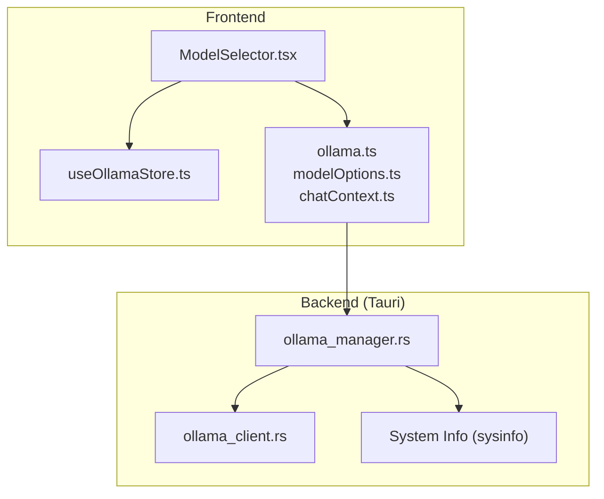
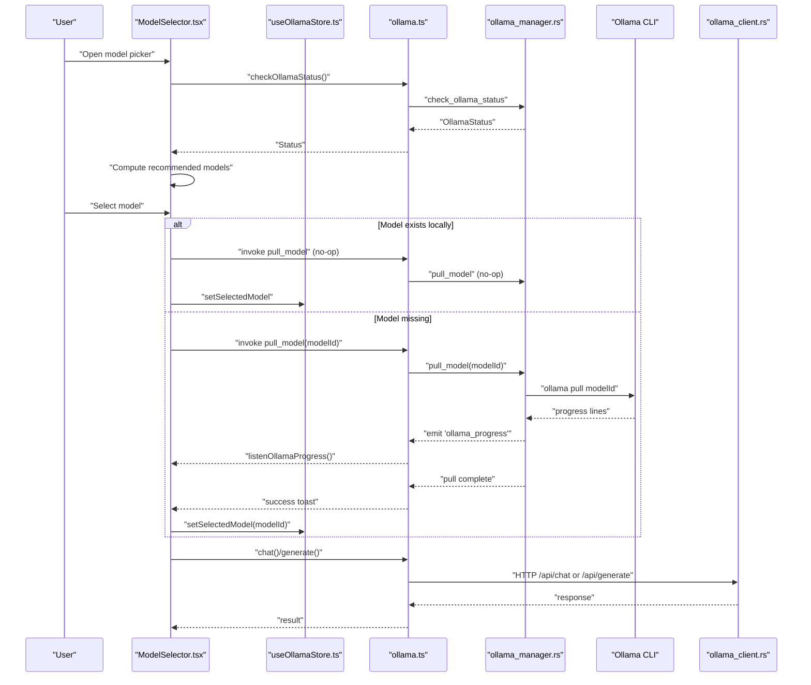
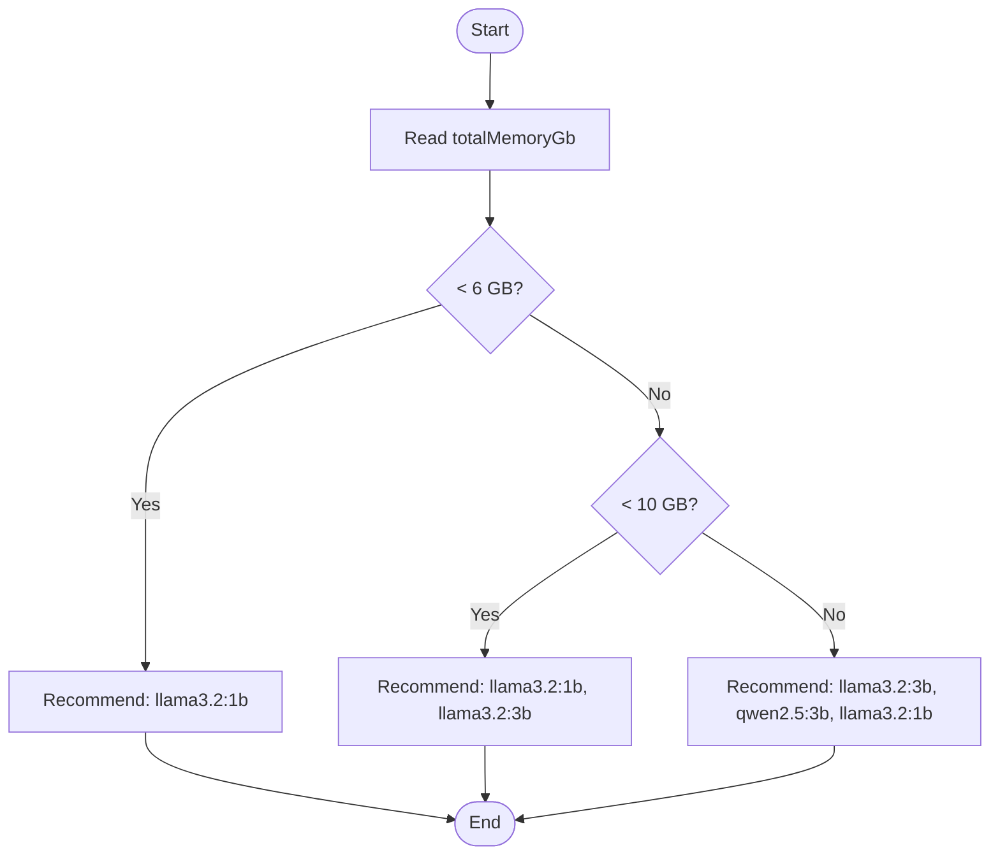
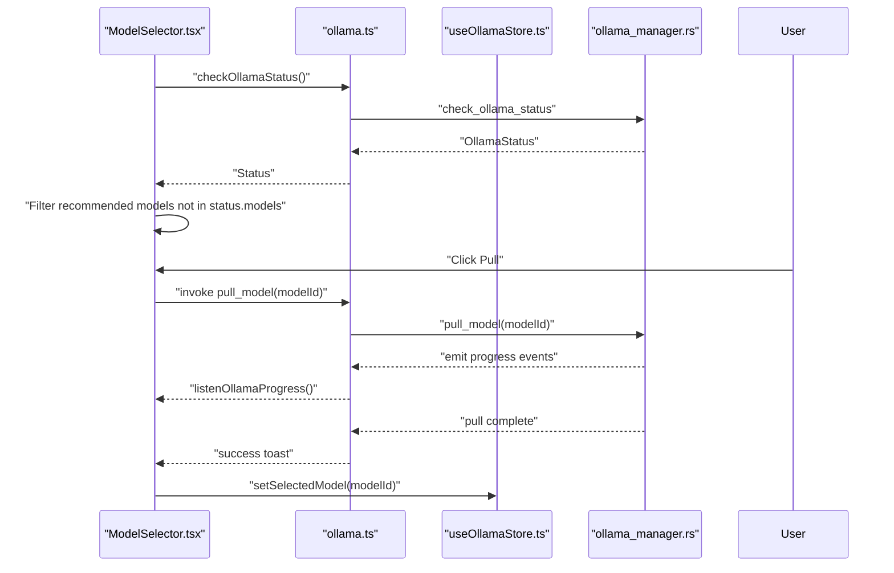
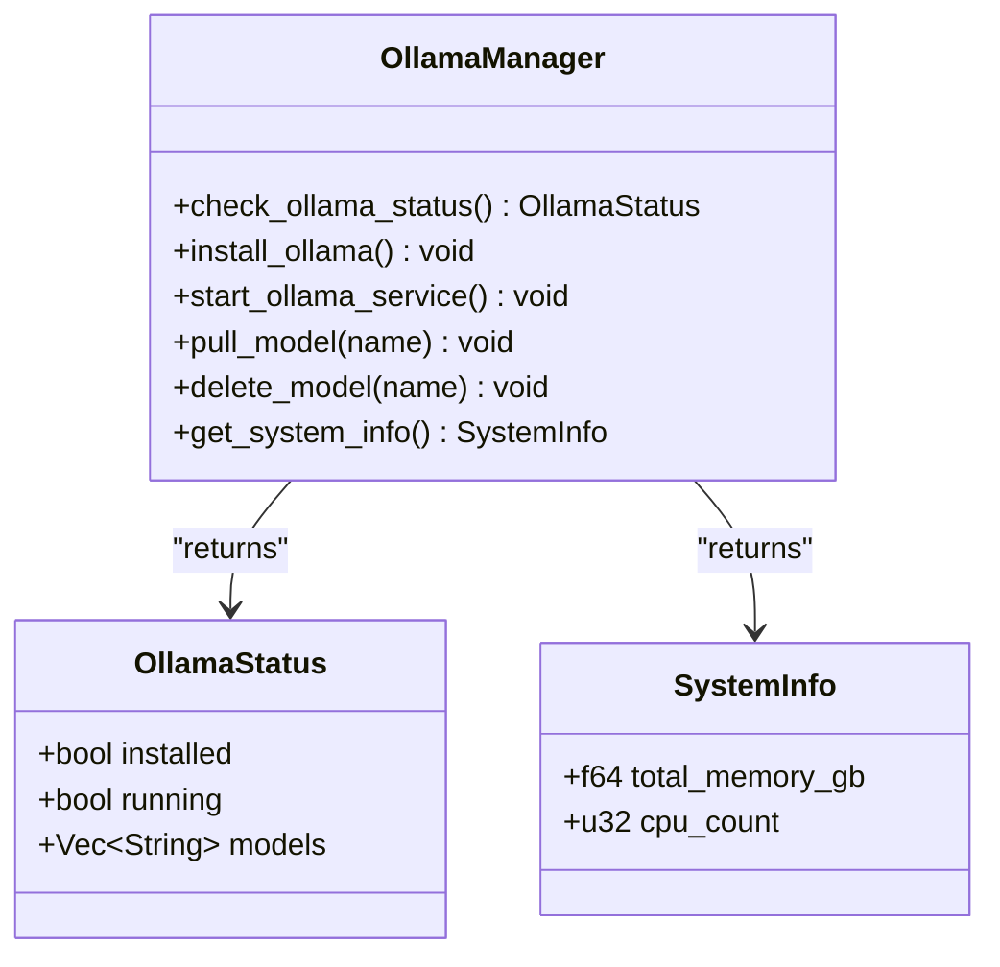
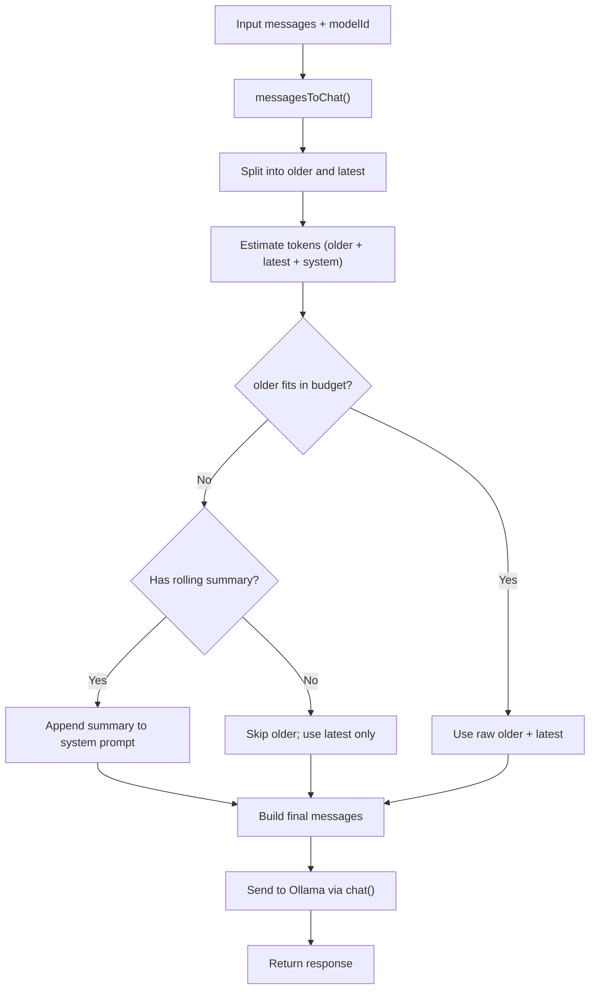
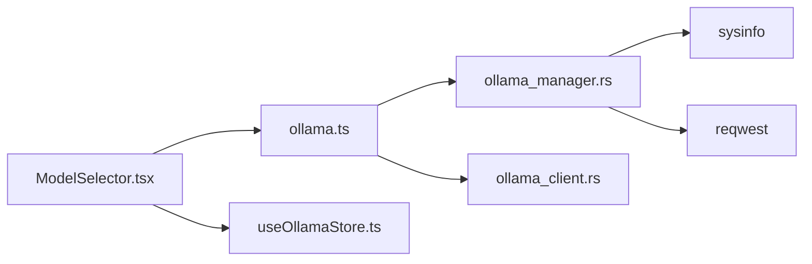

# Model Management & Selection

<cite>
**Referenced Files in This Document**
- [modelOptions.ts](file://src/lib/modelOptions.ts)
- [ModelSelector.tsx](file://src/components/ModelSelector.tsx)
- [ollama.ts](file://src/lib/ollama.ts)
- [useOllamaStore.ts](file://src/store/useOllamaStore.ts)
- [ollama_manager.rs](file://src-tauri/src/commands/ollama_manager.rs)
- [ollama_client.rs](file://src-tauri/src/services/ollama_client.rs)
- [chatContext.ts](file://src/lib/chatContext.ts)
- [ollama-setup-verification.md](file://docs/ollama-setup-verification.md)
- [Cargo.toml](file://src-tauri/Cargo.toml)
</cite>

## Table of Contents
1. [Introduction](#introduction)
2. [Project Structure](#project-structure)
3. [Core Components](#core-components)
4. [Architecture Overview](#architecture-overview)
5. [Detailed Component Analysis](#detailed-component-analysis)
6. [Dependency Analysis](#dependency-analysis)
7. [Performance Considerations](#performance-considerations)
8. [Troubleshooting Guide](#troubleshooting-guide)
9. [Conclusion](#conclusion)

## Introduction
This document explains the model management and selection system used for DeFi analysis and trading recommendations. It covers supported models, resource-aware recommendations, model pulling and switching, validation and compatibility checks, and lifecycle management. The system integrates a frontend UI for model selection with a Tauri-backed backend that manages Ollama installation, service orchestration, and model operations.

## Project Structure
The model management system spans three layers:
- Frontend UI: ModelSelector component and Zustand store for state
- Frontend library: Ollama client helpers and model metadata
- Backend (Tauri): Commands for status, install, pull, delete, and system info; HTTP client for chat/generate

**Diagram sources**
- [ModelSelector.tsx:1-341](file://src/components/ModelSelector.tsx#L1-L341)
- [useOllamaStore.ts:1-82](file://src/store/useOllamaStore.ts#L1-L82)
- [ollama.ts:1-165](file://src/lib/ollama.ts#L1-L165)
- [modelOptions.ts:1-65](file://src/lib/modelOptions.ts#L1-L65)
- [chatContext.ts:1-203](file://src/lib/chatContext.ts#L1-L203)
- [ollama_manager.rs:1-328](file://src-tauri/src/commands/ollama_manager.rs#L1-L328)
- [ollama_client.rs:1-106](file://src-tauri/src/services/ollama_client.rs#L1-L106)
- [Cargo.toml:36](file://src-tauri/Cargo.toml#L36)

**Section sources**
- [ModelSelector.tsx:1-341](file://src/components/ModelSelector.tsx#L1-L341)
- [ollama.ts:1-165](file://src/lib/ollama.ts#L1-L165)
- [modelOptions.ts:1-65](file://src/lib/modelOptions.ts#L1-L65)
- [chatContext.ts:1-203](file://src/lib/chatContext.ts#L1-L203)
- [ollama_manager.rs:1-328](file://src-tauri/src/commands/ollama_manager.rs#L1-L328)
- [ollama_client.rs:1-106](file://src-tauri/src/services/ollama_client.rs#L1-L106)
- [Cargo.toml:36](file://src-tauri/Cargo.toml#L36)

## Core Components
- Supported models and recommendations:
  - llama3.2:1b (1 GB, min RAM 4 GB)
  - llama3.2:3b (2 GB, min RAM 8 GB)
  - qwen2.5:3b (2 GB, min RAM 8 GB)
- Resource-aware recommendation algorithm:
  - Total memory thresholds drive model selection order
- Context budgeting:
  - Context tokens per model; default fallback for unknown models
- Frontend model selector:
  - Pull, switch, delete, and recommended-to-download suggestions
- Backend model management:
  - Install Ollama, start service, pull models, delete models, list models, system info
- Chat pipeline:
  - Builds messages with system prompt, optional rolling summary, and latest messages
  - Resolves context budget per model

**Section sources**
- [modelOptions.ts:19-64](file://src/lib/modelOptions.ts#L19-L64)
- [chatContext.ts:59-95](file://src/lib/chatContext.ts#L59-L95)
- [ModelSelector.tsx:176-181](file://src/components/ModelSelector.tsx#L176-L181)
- [ollama.ts:7-44](file://src/lib/ollama.ts#L7-L44)
- [ollama_manager.rs:162-187](file://src-tauri/src/commands/ollama_manager.rs#L162-L187)
- [ollama_manager.rs:290-327](file://src-tauri/src/commands/ollama_manager.rs#L290-L327)

## Architecture Overview
The system orchestrates model selection and usage across UI, library, and backend layers. The UI triggers actions; the library invokes Tauri commands; the backend executes shell commands and emits progress events.

**Diagram sources**
- [ModelSelector.tsx:50-139](file://src/components/ModelSelector.tsx#L50-L139)
- [ollama.ts:17-44](file://src/lib/ollama.ts#L17-L44)
- [ollama_manager.rs:290-327](file://src-tauri/src/commands/ollama_manager.rs#L290-L327)
- [ollama_client.rs:46-105](file://src-tauri/src/services/ollama_client.rs#L46-L105)

## Detailed Component Analysis

### Model Options and Recommendations
- Model metadata includes id, label, size in GB, minimum RAM in GB, description, and context tokens.
- Recommendation algorithm:
  - If total memory < 6 GB: prefer smallest model
  - If total memory < 10 GB: prefer smallest and medium model
  - Else: prefer larger models plus smallest
- Context budget resolution:
  - Returns model-specific context tokens or default fallback

**Diagram sources**
- [modelOptions.ts:52-64](file://src/lib/modelOptions.ts#L52-L64)

**Section sources**
- [modelOptions.ts:7-44](file://src/lib/modelOptions.ts#L7-L44)
- [modelOptions.ts:52-64](file://src/lib/modelOptions.ts#L52-L64)

### Model Selector UI
- Displays local models, recommended downloads, and a free-text pull box
- Handles:
  - Refreshing Ollama status
  - Pulling models with progress listening
  - Deleting models with confirmation and fallback selection
  - Switching models when present locally
- Integrates system info to compute recommendations

**Diagram sources**
- [ModelSelector.tsx:50-139](file://src/components/ModelSelector.tsx#L50-L139)
- [ollama.ts:17-44](file://src/lib/ollama.ts#L17-L44)
- [ollama_manager.rs:290-327](file://src-tauri/src/commands/ollama_manager.rs#L290-L327)

**Section sources**
- [ModelSelector.tsx:33-169](file://src/components/ModelSelector.tsx#L33-L169)
- [useOllamaStore.ts:20-37](file://src/store/useOllamaStore.ts#L20-L37)

### Backend Model Management
- Status:
  - Detects installation and running state
  - Lists models via CLI parsing
- Install and start:
  - Downloads installer script, makes executable, runs installer, starts service, waits for readiness
- Pull:
  - Spawns pull process, parses progress lines, emits progress events
- Delete:
  - Removes model with sanitized error extraction
- System info:
  - Uses sysinfo crate to report total memory and CPU count

**Diagram sources**
- [ollama_manager.rs:162-187](file://src-tauri/src/commands/ollama_manager.rs#L162-L187)
- [ollama_manager.rs:252-262](file://src-tauri/src/commands/ollama_manager.rs#L252-L262)

**Section sources**
- [ollama_manager.rs:162-187](file://src-tauri/src/commands/ollama_manager.rs#L162-L187)
- [ollama_manager.rs:189-243](file://src-tauri/src/commands/ollama_manager.rs#L189-L243)
- [ollama_manager.rs:264-288](file://src-tauri/src/commands/ollama_manager.rs#L264-L288)
- [ollama_manager.rs:290-327](file://src-tauri/src/commands/ollama_manager.rs#L290-L327)
- [Cargo.toml:36](file://src-tauri/Cargo.toml#L36)

### Chat Pipeline and Context Management
- Converts agent messages to Ollama roles and builds a constrained message array:
  - Includes system prompt
  - Optionally includes a rolling summary of older messages
  - Adds latest N messages
- Estimates tokens from character counts and compares against model context budget
- Generates rolling summaries using the selected model when needed

**Diagram sources**
- [chatContext.ts:29-95](file://src/lib/chatContext.ts#L29-L95)
- [chatContext.ts:177-202](file://src/lib/chatContext.ts#L177-L202)
- [ollama.ts:78-109](file://src/lib/ollama.ts#L78-L109)

**Section sources**
- [chatContext.ts:59-115](file://src/lib/chatContext.ts#L59-L115)
- [chatContext.ts:177-202](file://src/lib/chatContext.ts#L177-L202)
- [ollama.ts:78-109](file://src/lib/ollama.ts#L78-L109)

### Model Validation, Compatibility, and Fallbacks
- Frontend availability detection:
  - isOllamaUnavailableError detects network/service/model-not-found conditions
- Backend compatibility:
  - Parses model lists and progress reliably
  - Emits structured progress events for UI feedback
- Fallback behavior:
  - If service unavailable, UI opens setup modal and surfaces actionable errors
  - If model missing, UI triggers pull and switches on success

**Section sources**
- [ollama.ts:153-165](file://src/lib/ollama.ts#L153-L165)
- [ModelSelector.tsx:102-127](file://src/components/ModelSelector.tsx#L102-L127)
- [ollama_manager.rs:67-84](file://src-tauri/src/commands/ollama_manager.rs#L67-L84)

### Model Lifecycle Management and Storage Optimization
- Lifecycle:
  - Install Ollama, start service, pull models, delete models, list models
  - UI persists selected model and setup state
- Storage optimization:
  - Delete unused models to reclaim disk space
  - Use smaller models on constrained systems to reduce memory footprint
- Cleanup:
  - Delete command removes models and surfaces sanitized errors

**Section sources**
- [ollama_manager.rs:189-243](file://src-tauri/src/commands/ollama_manager.rs#L189-L243)
- [ollama_manager.rs:264-288](file://src-tauri/src/commands/ollama_manager.rs#L264-L288)
- [useOllamaStore.ts:40-80](file://src/store/useOllamaStore.ts#L40-L80)

## Dependency Analysis
- Frontend depends on:
  - Tauri invoke for backend commands
  - Zustand store for state persistence
  - Model metadata for recommendations and context budgets
- Backend depends on:
  - sysinfo for system metrics
  - reqwest for HTTP requests to Ollama
  - tokio for async process management

**Diagram sources**
- [ModelSelector.tsx:16-24](file://src/components/ModelSelector.tsx#L16-L24)
- [ollama.ts:1-2](file://src/lib/ollama.ts#L1-L2)
- [useOllamaStore.ts:1-2](file://src/store/useOllamaStore.ts#L1-L2)
- [ollama_manager.rs:3,7:3-7](file://src-tauri/src/commands/ollama_manager.rs#L3-L7)
- [Cargo.toml:34-36](file://src-tauri/Cargo.toml#L34-L36)
- [ollama_client.rs:3,5:3-5](file://src-tauri/src/services/ollama_client.rs#L3-L5)

**Section sources**
- [Cargo.toml:34-36](file://src-tauri/Cargo.toml#L34-L36)

## Performance Considerations
- Memory-first recommendations:
  - Prefer llama3.2:1b on low-memory systems to avoid swapping and slowdowns
  - Prefer llama3.2:3b/qwen2.5:3b on higher-memory systems for richer context
- Context budgeting:
  - Respect model context tokens to avoid truncation and summary overhead
  - Use rolling summaries judiciously to maintain coherence without excessive latency
- Network and service reliability:
  - Retry on transient failures; surface actionable errors to the user
  - Start service automatically if missing to minimize manual intervention

## Troubleshooting Guide
- Service not running:
  - Trigger install/start flow; verify readiness before proceeding
- Model not found:
  - Use the pull flow; monitor progress; confirm completion before retrying
- Chat failures:
  - Check network connectivity and service status; use isOllamaUnavailableError to detect and recover
- Recovery:
  - Restart service or re-run setup; UI will reopen setup modal on errors

**Section sources**
- [ollama-setup-verification.md:10-52](file://docs/ollama-setup-verification.md#L10-L52)
- [ollama.ts:153-165](file://src/lib/ollama.ts#L153-L165)
- [ModelSelector.tsx:102-127](file://src/components/ModelSelector.tsx#L102-L127)

## Conclusion
The model management and selection system provides a robust, resource-aware mechanism for choosing and operating AI models tailored to DeFi tasks. It combines frontend UX with backend orchestration to deliver reliable model lifecycle management, context-aware recommendations, and resilient fallbacks. By leveraging system info and model metadata, it ensures optimal performance across diverse hardware configurations.