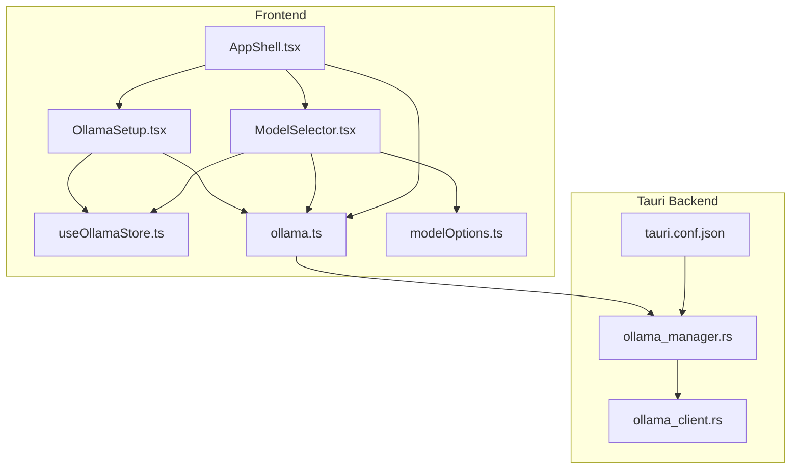
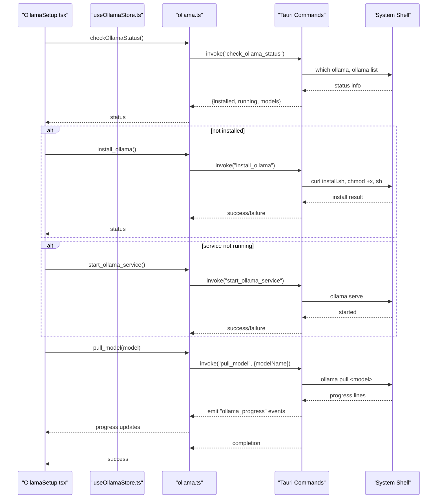
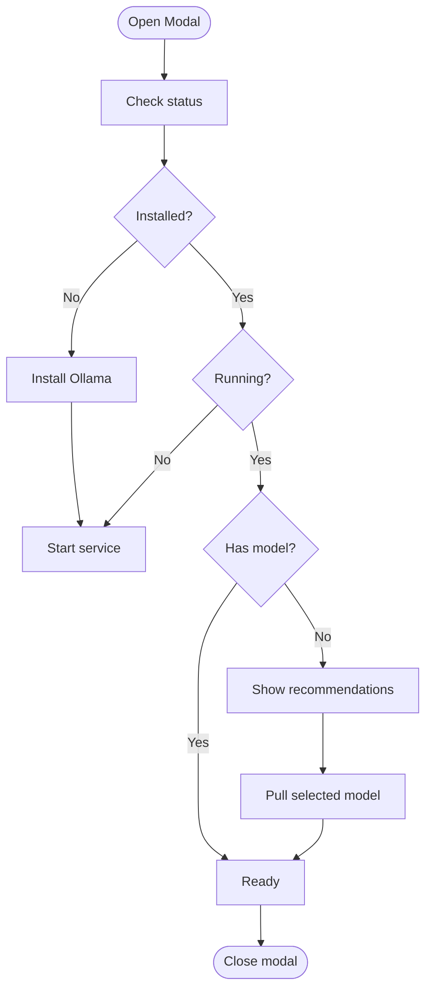
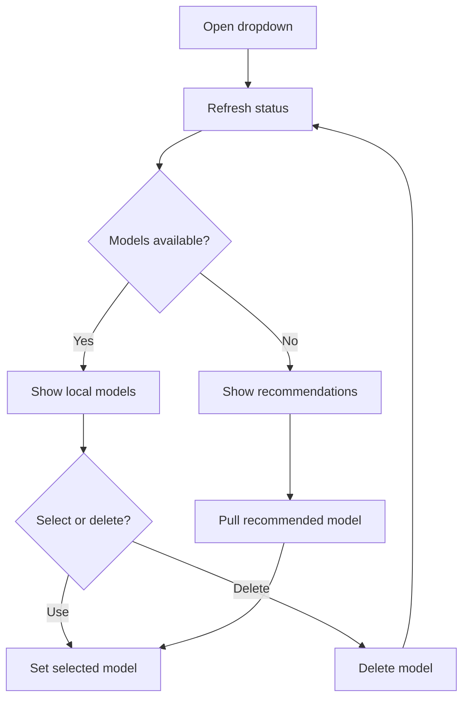
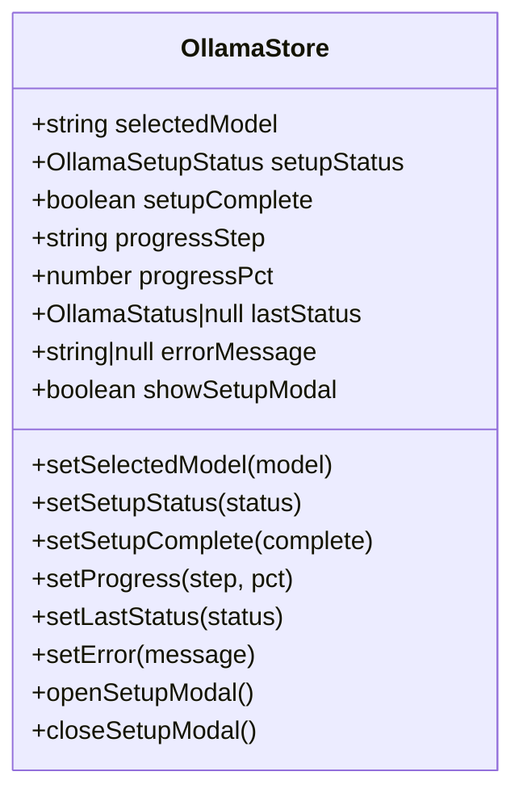
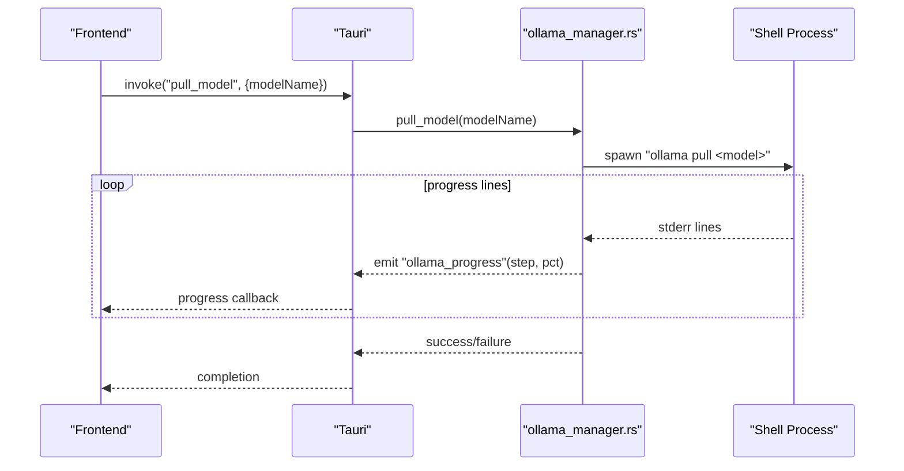
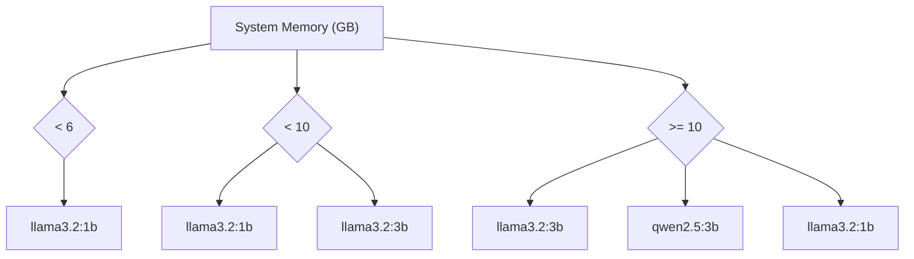
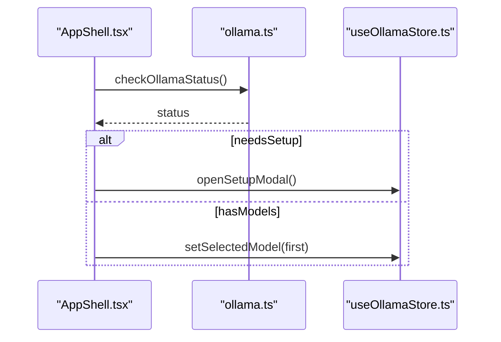
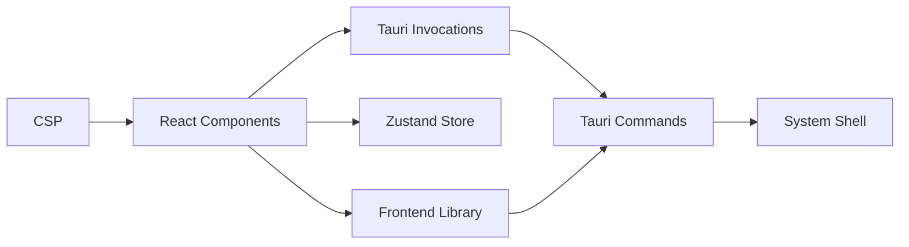

# Ollama Setup & Configuration

<cite>
**Referenced Files in This Document**
- [OllamaSetup.tsx](file://src/components/OllamaSetup.tsx)
- [ModelSelector.tsx](file://src/components/ModelSelector.tsx)
- [ollama.ts](file://src/lib/ollama.ts)
- [modelOptions.ts](file://src/lib/modelOptions.ts)
- [useOllamaStore.ts](file://src/store/useOllamaStore.ts)
- [ollama_manager.rs](file://src-tauri/src/commands/ollama_manager.rs)
- [ollama_client.rs](file://src-tauri/src/services/ollama_client.rs)
- [AppShell.tsx](file://src/components/layout/AppShell.tsx)
- [tauri.ts](file://src/lib/tauri.ts)
- [tauri.conf.json](file://src-tauri/tauri.conf.json)
- [InitializationSequence.tsx](file://src/components/onboarding/InitializationSequence.tsx)
</cite>

## Table of Contents
1. [Introduction](#introduction)
2. [Project Structure](#project-structure)
3. [Core Components](#core-components)
4. [Architecture Overview](#architecture-overview)
5. [Detailed Component Analysis](#detailed-component-analysis)
6. [Dependency Analysis](#dependency-analysis)
7. [Performance Considerations](#performance-considerations)
8. [Troubleshooting Guide](#troubleshooting-guide)
9. [Conclusion](#conclusion)

## Introduction
This document explains the Ollama setup and configuration system used to install, launch, and manage local AI models for the application. It covers:
- Step-by-step setup flow: detection, installation, service startup, and model selection
- Frontend modal with progressive disclosure and user feedback
- Tauri command integration for system-level operations
- Model selection interface with recommendations and validation
- State management via Zustand stores
- Troubleshooting and performance guidance

## Project Structure
The Ollama setup spans React components, a Zustand store, and Tauri backend commands/services. The frontend communicates with the backend through Tauri invocations, and the backend performs OS-level operations.

**Diagram sources**
- [AppShell.tsx:31-117](file://src/components/layout/AppShell.tsx#L31-L117)
- [OllamaSetup.tsx:31-156](file://src/components/OllamaSetup.tsx#L31-L156)
- [ModelSelector.tsx:33-169](file://src/components/ModelSelector.tsx#L33-L169)
- [useOllamaStore.ts:39-82](file://src/store/useOllamaStore.ts#L39-L82)
- [ollama.ts:17-44](file://src/lib/ollama.ts#L17-L44)
- [modelOptions.ts:19-64](file://src/lib/modelOptions.ts#L19-L64)
- [ollama_manager.rs:161-327](file://src-tauri/src/commands/ollama_manager.rs#L161-L327)
- [ollama_client.rs:46-105](file://src-tauri/src/services/ollama_client.rs#L46-L105)
- [tauri.conf.json:32-34](file://src-tauri/tauri.conf.json#L32-L34)

**Section sources**
- [AppShell.tsx:31-117](file://src/components/layout/AppShell.tsx#L31-L117)
- [OllamaSetup.tsx:31-156](file://src/components/OllamaSetup.tsx#L31-L156)
- [ModelSelector.tsx:33-169](file://src/components/ModelSelector.tsx#L33-L169)
- [useOllamaStore.ts:39-82](file://src/store/useOllamaStore.ts#L39-L82)
- [ollama.ts:17-44](file://src/lib/ollama.ts#L17-L44)
- [modelOptions.ts:19-64](file://src/lib/modelOptions.ts#L19-L64)
- [ollama_manager.rs:161-327](file://src-tauri/src/commands/ollama_manager.rs#L161-L327)
- [ollama_client.rs:46-105](file://src-tauri/src/services/ollama_client.rs#L46-L105)
- [tauri.conf.json:32-34](file://src-tauri/tauri.conf.json#L32-L34)

## Core Components
- OllamaSetup modal: Progressive disclosure setup flow with status updates and retry logic
- ModelSelector dropdown: Model discovery, recommendation engine, and pull/delete actions
- Zustand store: Centralized state for setup status, progress, and selected model
- Tauri commands: Install, start service, pull model, and system info retrieval
- Frontend library: Tauri invocations and event listening for progress updates

Key responsibilities:
- Detect Ollama installation and service status
- Install Ollama automatically when missing
- Start the service if not running
- Offer recommended models based on system specs
- Pull requested models and update selection
- Provide user feedback via progress bars and toasts

**Section sources**
- [OllamaSetup.tsx:31-156](file://src/components/OllamaSetup.tsx#L31-L156)
- [ModelSelector.tsx:33-169](file://src/components/ModelSelector.tsx#L33-L169)
- [useOllamaStore.ts:39-82](file://src/store/useOllamaStore.ts#L39-L82)
- [ollama.ts:17-44](file://src/lib/ollama.ts#L17-L44)
- [modelOptions.ts:19-64](file://src/lib/modelOptions.ts#L19-L64)
- [ollama_manager.rs:161-327](file://src-tauri/src/commands/ollama_manager.rs#L161-L327)

## Architecture Overview
The system integrates frontend UI with Tauri backend commands. The frontend checks Ollama status, triggers setup actions, and listens for progress events. The backend executes shell commands and parses outputs to report progress and outcomes.

**Diagram sources**
- [OllamaSetup.tsx:55-127](file://src/components/OllamaSetup.tsx#L55-L127)
- [ollama.ts:17-44](file://src/lib/ollama.ts#L17-L44)
- [ollama_manager.rs:161-327](file://src-tauri/src/commands/ollama_manager.rs#L161-L327)

## Detailed Component Analysis

### OllamaSetup Modal Component
The modal implements a progressive disclosure pattern:
- Checking: verifies installation and service status
- Installing: downloads and runs the installer, starts service
- Choosing model: presents system-recommended models
- Pulling: downloads the selected model with live progress
- Ready: final state with success feedback

**Diagram sources**
- [OllamaSetup.tsx:55-127](file://src/components/OllamaSetup.tsx#L55-L127)

**Section sources**
- [OllamaSetup.tsx:31-156](file://src/components/OllamaSetup.tsx#L31-L156)
- [OllamaSetup.tsx:168-307](file://src/components/OllamaSetup.tsx#L168-L307)

### ModelSelector Component
The dropdown provides:
- Local models list with delete and use actions
- Recommended models based on system memory
- Custom model input with validation and pull
- Live progress updates during downloads

**Diagram sources**
- [ModelSelector.tsx:50-139](file://src/components/ModelSelector.tsx#L50-L139)

**Section sources**
- [ModelSelector.tsx:33-169](file://src/components/ModelSelector.tsx#L33-L169)
- [modelOptions.ts:19-64](file://src/lib/modelOptions.ts#L19-L64)

### Zustand Store for Ollama State
The store centralizes:
- Selected model and setup status
- Progress step and percentage
- Last status snapshot and error messages
- Modal visibility and persistence

**Diagram sources**
- [useOllamaStore.ts:20-71](file://src/store/useOllamaStore.ts#L20-L71)

**Section sources**
- [useOllamaStore.ts:39-82](file://src/store/useOllamaStore.ts#L39-L82)

### Tauri Command Integration
Commands executed by the backend:
- check_ollama_status: detects installation, running state, and lists models
- install_ollama: downloads installer, makes executable, runs install, starts service
- start_ollama_service: launches the service in background
- pull_model: streams progress events to the frontend
- get_system_info: reports memory and CPU for recommendations
- delete_model: removes a model with sanitized error reporting

**Diagram sources**
- [ollama_manager.rs:290-327](file://src-tauri/src/commands/ollama_manager.rs#L290-L327)
- [ollama.ts:46-56](file://src/lib/ollama.ts#L46-L56)

**Section sources**
- [ollama_manager.rs:161-327](file://src-tauri/src/commands/ollama_manager.rs#L161-L327)
- [ollama.ts:17-44](file://src/lib/ollama.ts#L17-L44)

### Model Recommendation Logic
Recommendations are derived from system memory:
- Low (<6 GB): smallest model
- Medium (6–9 GB): small and medium
- High (≥10 GB): balanced range

**Diagram sources**
- [modelOptions.ts:52-64](file://src/lib/modelOptions.ts#L52-L64)

**Section sources**
- [modelOptions.ts:19-64](file://src/lib/modelOptions.ts#L19-L64)

### Frontend Integration in AppShell
The shell checks Ollama status on load and opens the setup modal when needed. It also ensures a valid model is selected if models exist.

**Diagram sources**
- [AppShell.tsx:81-117](file://src/components/layout/AppShell.tsx#L81-L117)

**Section sources**
- [AppShell.tsx:31-117](file://src/components/layout/AppShell.tsx#L31-L117)

## Dependency Analysis
- Frontend depends on Tauri invocations and event listeners for progress
- Backend depends on system shell and external HTTP endpoints for installer and model pulls
- Store persists selected model and setup completion state across sessions
- CSP allows connections to localhost for Ollama API

**Diagram sources**
- [ollama.ts:17-44](file://src/lib/ollama.ts#L17-L44)
- [ollama_manager.rs:161-327](file://src-tauri/src/commands/ollama_manager.rs#L161-L327)
- [tauri.conf.json:32-34](file://src-tauri/tauri.conf.json#L32-L34)

**Section sources**
- [ollama.ts:17-44](file://src/lib/ollama.ts#L17-L44)
- [ollama_manager.rs:161-327](file://src-tauri/src/commands/ollama_manager.rs#L161-L327)
- [tauri.conf.json:32-34](file://src-tauri/tauri.conf.json#L32-L34)

## Performance Considerations
- Minimize repeated status checks by caching last status in the store
- Debounce model pull requests to avoid concurrent installs
- Use system info only when necessary (e.g., on model selection)
- Keep progress updates throttled to reduce re-renders
- Persist selected model to avoid re-pulling after restart

## Troubleshooting Guide
Common issues and resolutions:
- Installation fails
  - Verify network connectivity and permissions
  - Retry installation from the modal
  - Check system requirements and disk space
- Service does not start
  - Ensure port 11434 is free
  - Re-run service start from the modal
- Model pull stuck or slow
  - Confirm Ollama service is reachable
  - Check firewall or proxy blocking
  - Use a smaller recommended model for low-memory systems
- Model not found
  - Validate model name spelling
  - Try official model names (e.g., llama variants)
- Progress events not received
  - Ensure Tauri runtime is present
  - Check event listener registration in the frontend

Compatibility and requirements:
- Supported platforms: macOS initially; backend can be extended to other OSes
- Minimum RAM recommendations are embedded in model options
- Application CSP permits connections to localhost for Ollama API

**Section sources**
- [OllamaSetup.tsx:119-127](file://src/components/OllamaSetup.tsx#L119-L127)
- [ollama_manager.rs:189-222](file://src-tauri/src/commands/ollama_manager.rs#L189-L222)
- [ollama.ts:153-164](file://src/lib/ollama.ts#L153-L164)
- [tauri.conf.json:32-34](file://src-tauri/tauri.conf.json#L32-L34)

## Conclusion
The Ollama setup system provides a seamless, user-friendly experience for installing, launching, and managing local AI models. Through a progressive modal, robust Tauri integration, and intelligent model recommendations, it adapts to user environments while maintaining reliability and transparency via progress updates and error handling.