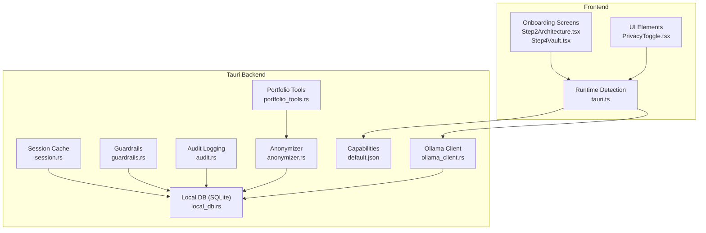
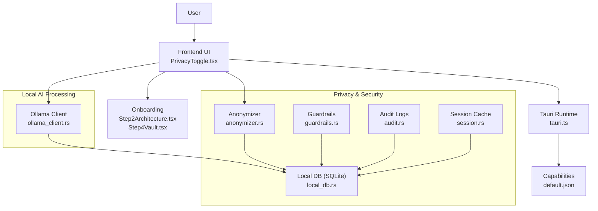
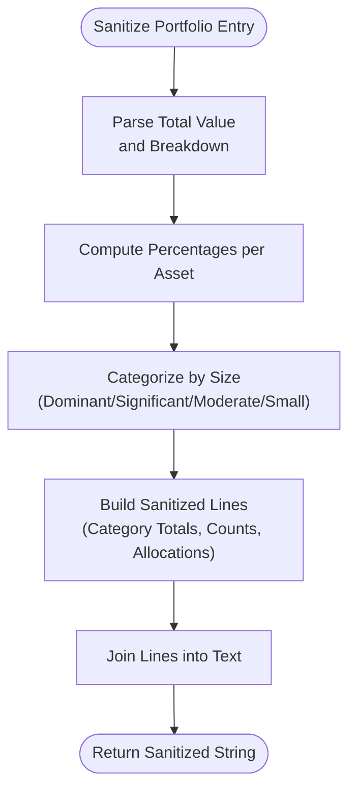
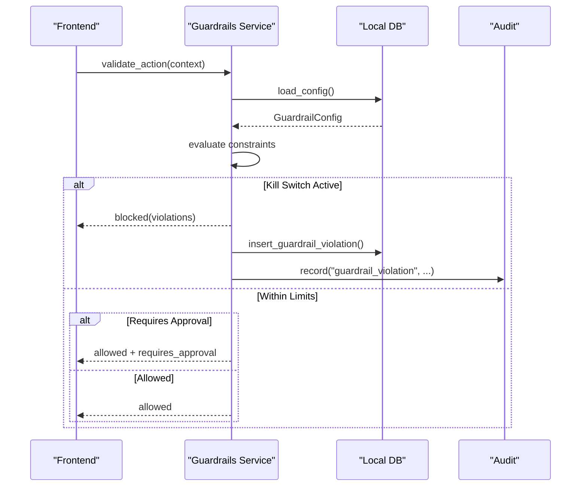
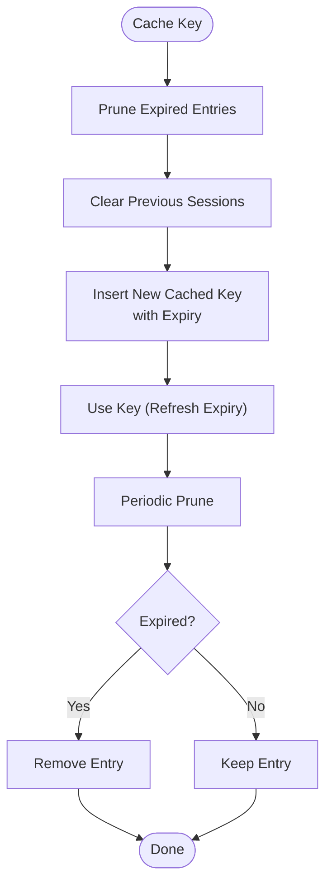
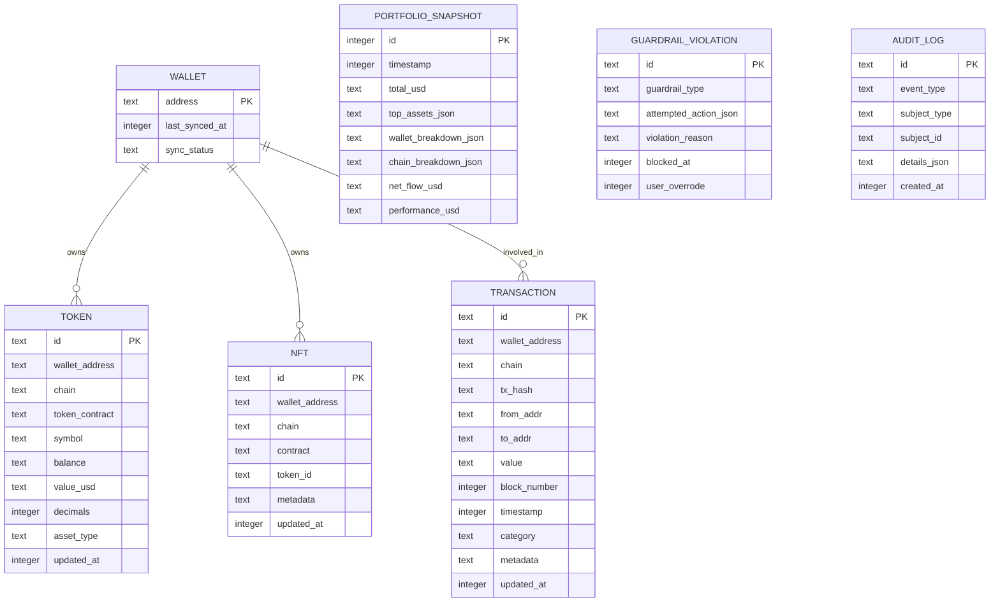
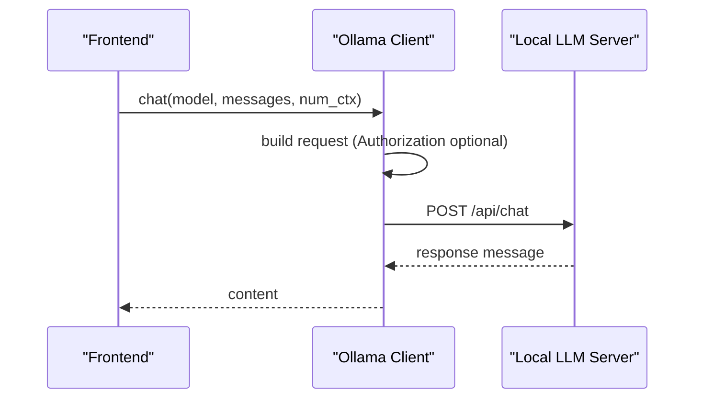
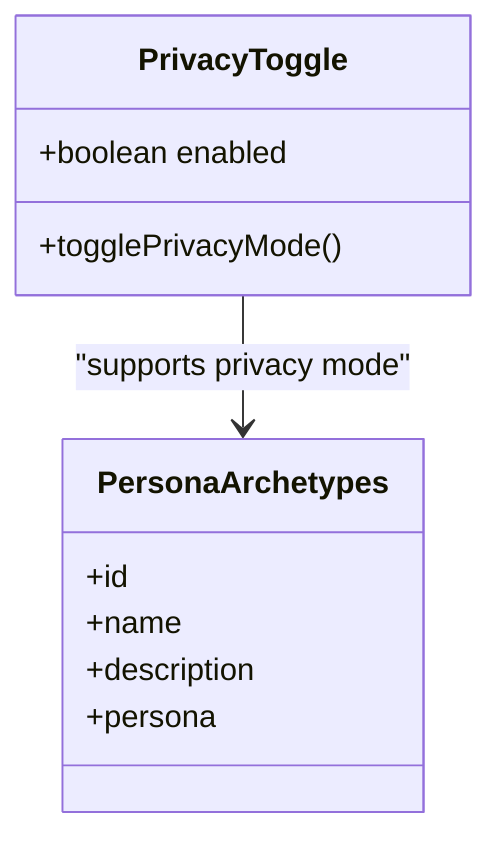
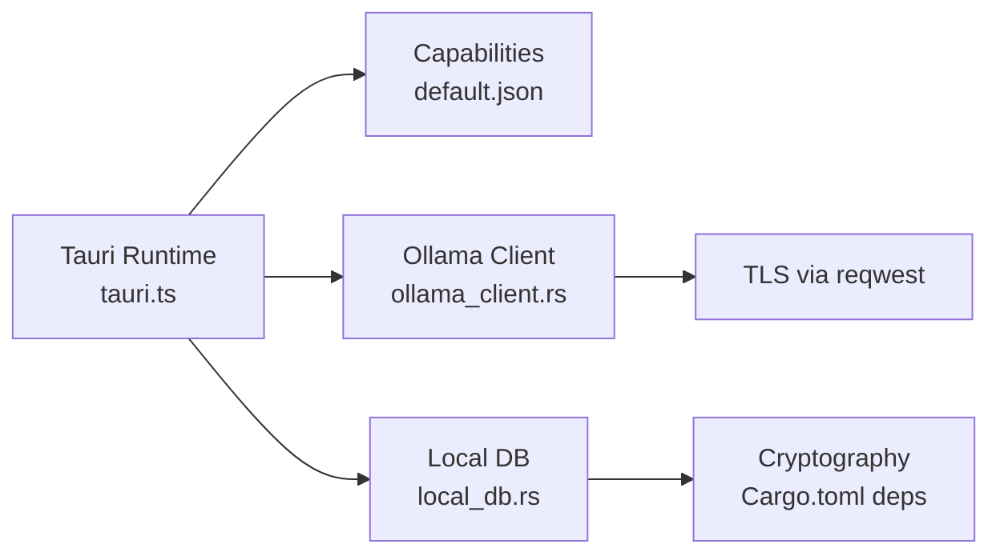

# Privacy & Security Framework

<cite>
**Referenced Files in This Document**
- [anonymizer.rs](file://src-tauri/src/services/anonymizer.rs)
- [portfolio_tools.rs](file://src-tauri/src/services/tools/portfolio_tools.rs)
- [local_db.rs](file://src-tauri/src/services/local_db.rs)
- [session.rs](file://src-tauri/src/session.rs)
- [guardrails.rs](file://src-tauri/src/services/guardrails.rs)
- [audit.rs](file://src-tauri/src/services/audit.rs)
- [ollama_client.rs](file://src-tauri/src/services/ollama_client.rs)
- [Step2Architecture.tsx](file://src/components/onboarding/steps/Step2Architecture.tsx)
- [Step4Vault.tsx](file://src/components/onboarding/steps/Step4Vault.tsx)
- [PrivacyToggle.tsx](file://src/components/shared/PrivacyToggle.tsx)
- [personaArchetypes.ts](file://src/constants/personaArchetypes.ts)
- [Cargo.toml](file://src-tauri/Cargo.toml)
- [default.json](file://src-tauri/capabilities/default.json)
- [tauri.ts](file://src/lib/tauri.ts)
</cite>

## Table of Contents
1. [Introduction](#introduction)
2. [Project Structure](#project-structure)
3. [Core Components](#core-components)
4. [Architecture Overview](#architecture-overview)
5. [Detailed Component Analysis](#detailed-component-analysis)
6. [Dependency Analysis](#dependency-analysis)
7. [Performance Considerations](#performance-considerations)
8. [Troubleshooting Guide](#troubleshooting-guide)
9. [Conclusion](#conclusion)
10. [Appendices](#appendices)

## Introduction
This document describes the privacy and security framework for the local AI integration within the platform. It explains the privacy-first approach of keeping AI reasoning on-device, anonymization techniques for sensitive financial data, and secure handling practices for keys and data. It documents the anonymization pipeline for market data, portfolio information, and user inputs prior to AI processing, along with encryption mechanisms, retention policies, and guardrails that prevent unauthorized or unsafe actions. It also outlines the security architecture to prevent data leakage, unauthorized access, and to support compliance with financial data protection regulations, and provides best practices for secure AI interaction and threat mitigation.

## Project Structure
The privacy and security features span both the frontend and the Tauri backend:
- Frontend components emphasize privacy modes and onboarding messaging around local intelligence and OS-level vaults.
- Backend services implement anonymization, guardrails, auditing, local storage, session caching, and local LLM communication.

**Diagram sources**
- [Step2Architecture.tsx:1-49](file://src/components/onboarding/steps/Step2Architecture.tsx#L1-L49)
- [Step4Vault.tsx:263-296](file://src/components/onboarding/steps/Step4Vault.tsx#L263-L296)
- [PrivacyToggle.tsx:1-32](file://src/components/shared/PrivacyToggle.tsx#L1-L32)
- [tauri.ts:1-4](file://src/lib/tauri.ts#L1-L4)
- [default.json:1-13](file://src-tauri/capabilities/default.json#L1-L13)
- [session.rs:1-145](file://src-tauri/src/session.rs#L1-L145)
- [local_db.rs:1-800](file://src-tauri/src/services/local_db.rs#L1-L800)
- [guardrails.rs:1-620](file://src-tauri/src/services/guardrails.rs#L1-L620)
- [audit.rs:1-25](file://src-tauri/src/services/audit.rs#L1-L25)
- [anonymizer.rs:1-56](file://src-tauri/src/services/anonymizer.rs#L1-L56)
- [portfolio_tools.rs:1-220](file://src-tauri/src/services/tools/portfolio_tools.rs#L1-L220)
- [ollama_client.rs:1-106](file://src-tauri/src/services/ollama_client.rs#L1-L106)

**Section sources**
- [Step2Architecture.tsx:1-49](file://src/components/onboarding/steps/Step2Architecture.tsx#L1-L49)
- [Step4Vault.tsx:263-296](file://src/components/onboarding/steps/Step4Vault.tsx#L263-L296)
- [PrivacyToggle.tsx:1-32](file://src/components/shared/PrivacyToggle.tsx#L1-L32)
- [tauri.ts:1-4](file://src/lib/tauri.ts#L1-L4)
- [default.json:1-13](file://src-tauri/capabilities/default.json#L1-L13)
- [session.rs:1-145](file://src-tauri/src/session.rs#L1-L145)
- [local_db.rs:1-800](file://src-tauri/src/services/local_db.rs#L1-L800)
- [guardrails.rs:1-620](file://src-tauri/src/services/guardrails.rs#L1-L620)
- [audit.rs:1-25](file://src-tauri/src/services/audit.rs#L1-L25)
- [anonymizer.rs:1-56](file://src-tauri/src/services/anonymizer.rs#L1-L56)
- [portfolio_tools.rs:1-220](file://src-tauri/src/services/tools/portfolio_tools.rs#L1-L220)
- [ollama_client.rs:1-106](file://src-tauri/src/services/ollama_client.rs#L1-L106)

## Core Components
- Privacy-first AI: The onboarding emphasizes local intelligence and zero data leaks, aligning with keeping AI reasoning on-device.
- Anonymization pipeline: Converts precise financial figures into categories and weights to remove exact identifiers.
- Guardrails: Enforce user-configurable constraints on autonomous actions to prevent unsafe or unauthorized operations.
- Secure session cache: Stores decrypted keys in memory with strict inactivity expiry and secure wiping.
- Local DB: Encrypted at rest via OS-level vault; stores sensitive records and audit trails.
- Audit logging: Comprehensive event logging for compliance and incident response.
- Local LLM client: Communicates with a locally hosted LLM over localhost with optional bearer token.

**Section sources**
- [Step2Architecture.tsx:1-49](file://src/components/onboarding/steps/Step2Architecture.tsx#L1-L49)
- [anonymizer.rs:1-56](file://src-tauri/src/services/anonymizer.rs#L1-L56)
- [guardrails.rs:1-620](file://src-tauri/src/services/guardrails.rs#L1-L620)
- [session.rs:1-145](file://src-tauri/src/session.rs#L1-L145)
- [local_db.rs:1-800](file://src-tauri/src/services/local_db.rs#L1-L800)
- [audit.rs:1-25](file://src-tauri/src/services/audit.rs#L1-L25)
- [ollama_client.rs:1-106](file://src-tauri/src/services/ollama_client.rs#L1-L106)

## Architecture Overview
The system keeps AI processing local and minimizes data exposure:
- Onboarding communicates “Local Intelligence” and “OS-Level Vault.”
- Portfolio aggregation produces sanitized summaries for AI consumption.
- Guardrails validate actions before execution.
- Session cache holds keys only in memory with automatic expiry.
- Local DB persists sensitive data securely and logs all significant events.
- Ollama client connects to a local model server.

**Diagram sources**
- [Step2Architecture.tsx:1-49](file://src/components/onboarding/steps/Step2Architecture.tsx#L1-L49)
- [Step4Vault.tsx:263-296](file://src/components/onboarding/steps/Step4Vault.tsx#L263-L296)
- [PrivacyToggle.tsx:1-32](file://src/components/shared/PrivacyToggle.tsx#L1-L32)
- [tauri.ts:1-4](file://src/lib/tauri.ts#L1-L4)
- [default.json:1-13](file://src-tauri/capabilities/default.json#L1-L13)
- [ollama_client.rs:1-106](file://src-tauri/src/services/ollama_client.rs#L1-L106)
- [anonymizer.rs:1-56](file://src-tauri/src/services/anonymizer.rs#L1-L56)
- [guardrails.rs:1-620](file://src-tauri/src/services/guardrails.rs#L1-L620)
- [audit.rs:1-25](file://src-tauri/src/services/audit.rs#L1-L25)
- [local_db.rs:1-800](file://src-tauri/src/services/local_db.rs#L1-L800)
- [session.rs:1-145](file://src-tauri/src/session.rs#L1-L145)

## Detailed Component Analysis

### Privacy-Anonymization Pipeline
The anonymization service transforms portfolio data into relative categories and weights, avoiding exact balances and addresses.

**Diagram sources**
- [anonymizer.rs:1-56](file://src-tauri/src/services/anonymizer.rs#L1-L56)
- [portfolio_tools.rs:1-220](file://src-tauri/src/services/tools/portfolio_tools.rs#L1-L220)

**Section sources**
- [anonymizer.rs:1-56](file://src-tauri/src/services/anonymizer.rs#L1-L56)
- [portfolio_tools.rs:1-220](file://src-tauri/src/services/tools/portfolio_tools.rs#L1-L220)

### Guardrails and Execution Constraints
Guardrails enforce user-defined constraints before autonomous actions execute, including kill switches, spend limits, allowed chains, blocked tokens/protocols, and time windows.

**Diagram sources**
- [guardrails.rs:1-620](file://src-tauri/src/services/guardrails.rs#L1-L620)
- [local_db.rs:1-800](file://src-tauri/src/services/local_db.rs#L1-L800)
- [audit.rs:1-25](file://src-tauri/src/services/audit.rs#L1-L25)

**Section sources**
- [guardrails.rs:1-620](file://src-tauri/src/services/guardrails.rs#L1-L620)
- [local_db.rs:1-800](file://src-tauri/src/services/local_db.rs#L1-L800)
- [audit.rs:1-25](file://src-tauri/src/services/audit.rs#L1-L25)

### Secure Session Cache for Private Keys
Keys are held in memory only, with automatic expiry and secure wipe.

**Diagram sources**
- [session.rs:1-145](file://src-tauri/src/session.rs#L1-L145)

**Section sources**
- [session.rs:1-145](file://src-tauri/src/session.rs#L1-L145)

### Local Database Schema and Retention
Sensitive data is persisted in a local SQLite database with indices for performance and auditability. The schema includes tables for wallets, tokens, NFTs, transactions, portfolio snapshots, guardrail violations, audit logs, and more.

**Diagram sources**
- [local_db.rs:1-800](file://src-tauri/src/services/local_db.rs#L1-L800)

**Section sources**
- [local_db.rs:1-800](file://src-tauri/src/services/local_db.rs#L1-L800)

### Local LLM Client and Data Handling
The Ollama client communicates with a local model server over localhost, optionally using an Authorization header. This keeps prompts and responses off external networks.

**Diagram sources**
- [ollama_client.rs:1-106](file://src-tauri/src/services/ollama_client.rs#L1-L106)

**Section sources**
- [ollama_client.rs:1-106](file://src-tauri/src/services/ollama_client.rs#L1-L106)

### Privacy Modes and Personas
The UI exposes a privacy toggle and personas that emphasize discretion and minimal data exposure.

**Diagram sources**
- [PrivacyToggle.tsx:1-32](file://src/components/shared/PrivacyToggle.tsx#L1-L32)
- [personaArchetypes.ts:40-120](file://src/constants/personaArchetypes.ts#L40-L120)

**Section sources**
- [PrivacyToggle.tsx:1-32](file://src/components/shared/PrivacyToggle.tsx#L1-L32)
- [personaArchetypes.ts:40-120](file://src/constants/personaArchetypes.ts#L40-L120)

## Dependency Analysis
- Runtime detection enables Tauri-specific capabilities and security features.
- Dependencies include OS-level key storage, cryptography libraries, and TLS for secure HTTP.
- Capabilities restrict what the main window can do, reducing attack surface.

**Diagram sources**
- [tauri.ts:1-4](file://src/lib/tauri.ts#L1-L4)
- [default.json:1-13](file://src-tauri/capabilities/default.json#L1-L13)
- [ollama_client.rs:1-106](file://src-tauri/src/services/ollama_client.rs#L1-L106)
- [local_db.rs:1-800](file://src-tauri/src/services/local_db.rs#L1-L800)
- [Cargo.toml:20-44](file://src-tauri/Cargo.toml#L20-L44)

**Section sources**
- [tauri.ts:1-4](file://src/lib/tauri.ts#L1-L4)
- [default.json:1-13](file://src-tauri/capabilities/default.json#L1-L13)
- [Cargo.toml:20-44](file://src-tauri/Cargo.toml#L20-L44)

## Performance Considerations
- Local inference reduces latency and avoids network-bound bottlenecks.
- In-memory session cache avoids repeated decryption and disk IO for keys.
- SQLite indexing supports fast queries on audit logs, guardrail violations, and portfolio snapshots.
- Anonymization converts exact figures to categories, reducing data volume and sensitivity.

[No sources needed since this section provides general guidance]

## Troubleshooting Guide
- If AI responses are missing, verify the local LLM endpoint is reachable and credentials are configured.
- If guardrails block actions unexpectedly, review configured limits and time windows.
- If keys appear unavailable, confirm session cache has not expired and pruning is not clearing entries prematurely.
- For audit gaps, check that events are recorded and indices are intact.

**Section sources**
- [ollama_client.rs:1-106](file://src-tauri/src/services/ollama_client.rs#L1-L106)
- [guardrails.rs:1-620](file://src-tauri/src/services/guardrails.rs#L1-L620)
- [session.rs:1-145](file://src-tauri/src/session.rs#L1-L145)
- [audit.rs:1-25](file://src-tauri/src/services/audit.rs#L1-L25)
- [local_db.rs:1-800](file://src-tauri/src/services/local_db.rs#L1-L800)

## Conclusion
The platform’s privacy and security framework centers on local AI processing, robust anonymization of financial data, strict guardrails, secure session caching, and comprehensive audit logging. Together, these measures minimize data exposure, prevent unauthorized actions, and support compliance through transparent, on-device processing and secure storage.

[No sources needed since this section summarizes without analyzing specific files]

## Appendices

### Best Practices for Secure AI Interaction
- Keep AI models and data on-device; avoid sending sensitive inputs to external APIs.
- Apply anonymization before any AI processing; remove exact identifiers and convert to relative metrics.
- Enforce guardrails for spend limits, allowed chains, blocked assets, and time windows.
- Use OS-level secure enclaves for key storage and enable runtime checks for Tauri capabilities.
- Log all significant events and maintain audit trails for compliance and incident response.

[No sources needed since this section provides general guidance]