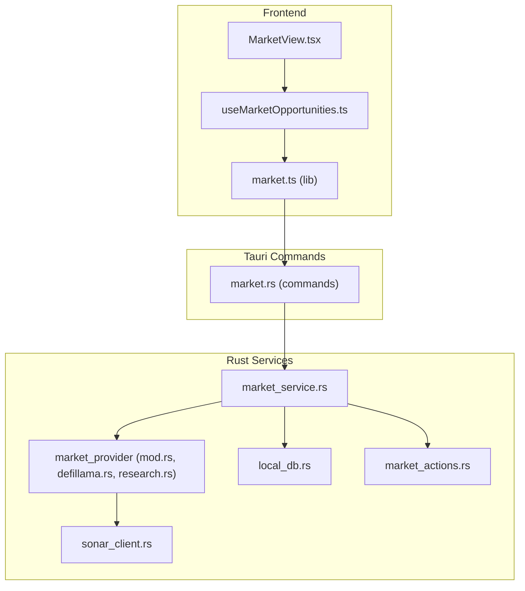
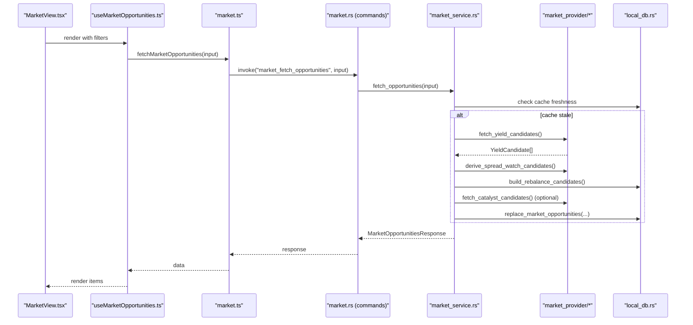
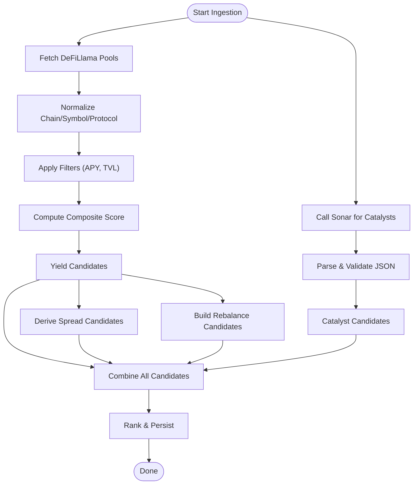
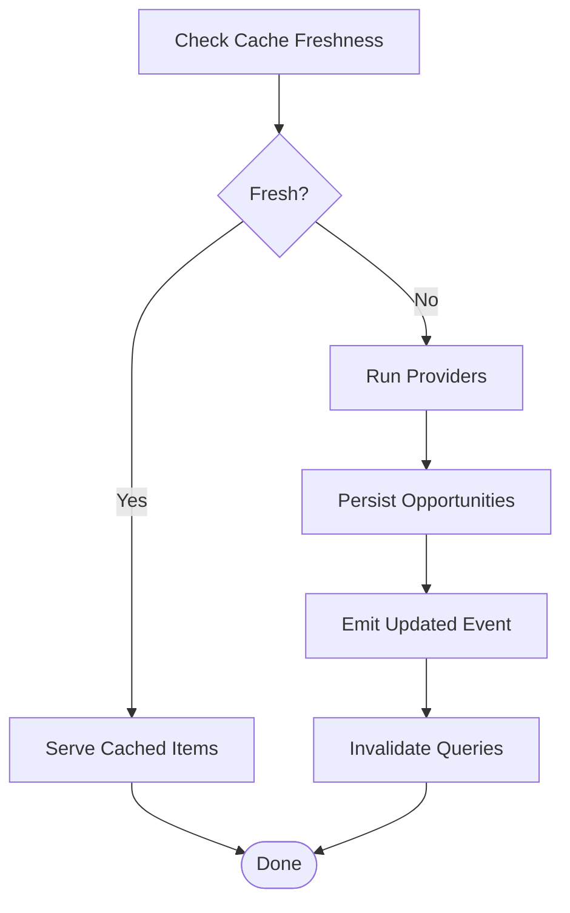
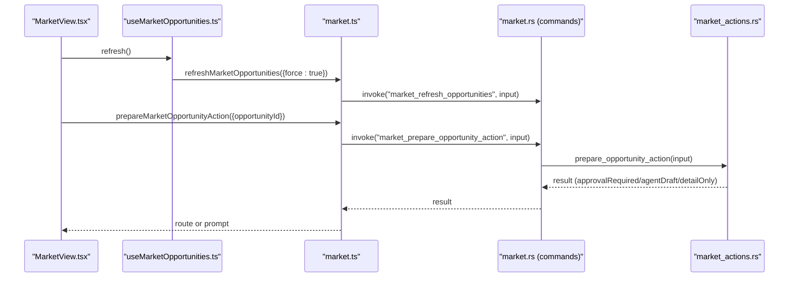
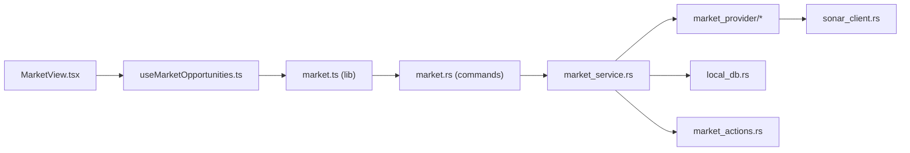

# Market Data Analysis & Processing

<cite>
**Referenced Files in This Document**
- [market.ts](file://src/lib/market.ts)
- [market.ts (types)](file://src/types/market.ts)
- [useMarketOpportunities.ts](file://src/hooks/useMarketOpportunities.ts)
- [MarketView.tsx](file://src/components/market/MarketView.tsx)
- [mod.rs (market_provider)](file://src-tauri/src/services/market_provider/mod.rs)
- [defillama.rs](file://src-tauri/src/services/market_provider/defillama.rs)
- [research.rs](file://src-tauri/src/services/market_provider/research.rs)
- [market_service.rs](file://src-tauri/src/services/market_service.rs)
- [market.rs (commands)](file://src-tauri/src/commands/market.rs)
- [local_db.rs](file://src-tauri/src/services/local_db.rs)
- [sonar_client.rs](file://src-tauri/src/services/sonar_client.rs)
- [market_actions.rs](file://src-tauri/src/services/market_actions.rs)
</cite>

## Table of Contents
1. [Introduction](#introduction)
2. [Project Structure](#project-structure)
3. [Core Components](#core-components)
4. [Architecture Overview](#architecture-overview)
5. [Detailed Component Analysis](#detailed-component-analysis)
6. [Dependency Analysis](#dependency-analysis)
7. [Performance Considerations](#performance-considerations)
8. [Troubleshooting Guide](#troubleshooting-guide)
9. [Conclusion](#conclusion)

## Introduction
This document explains the market data analysis and processing capabilities of the system. It covers the ingestion pipeline from external DeFi data providers (notably DeFiLlama), internal research synthesis via a Sonar-powered client, transformation and normalization of raw data, ranking and scoring, caching and freshness policies, real-time monitoring, and integration with UI components for discovery and action. It also documents the fallback mechanisms, error handling, and operational controls that ensure reliable market intelligence delivery.

## Project Structure
The market data system spans frontend React components and hooks, Tauri commands, Rust services for data ingestion and processing, and a local SQLite-backed persistence layer.

**Diagram sources**
- [MarketView.tsx:1-267](file://src/components/market/MarketView.tsx#L1-L267)
- [useMarketOpportunities.ts:1-131](file://src/hooks/useMarketOpportunities.ts#L1-L131)
- [market.ts:1-135](file://src/lib/market.ts#L1-L135)
- [market.rs (commands):1-36](file://src-tauri/src/commands/market.rs#L1-L36)
- [market_service.rs:1-745](file://src-tauri/src/services/market_service.rs#L1-L745)
- [mod.rs (market_provider):1-160](file://src-tauri/src/services/market_provider/mod.rs#L1-L160)
- [defillama.rs:1-151](file://src-tauri/src/services/market_provider/defillama.rs#L1-L151)
- [research.rs:1-112](file://src-tauri/src/services/market_provider/research.rs#L1-L112)
- [local_db.rs:1-800](file://src-tauri/src/services/local_db.rs#L1-L800)
- [sonar_client.rs:1-78](file://src-tauri/src/services/sonar_client.rs#L1-L78)
- [market_actions.rs:1-141](file://src-tauri/src/services/market_actions.rs#L1-L141)

**Section sources**
- [market.ts:1-135](file://src/lib/market.ts#L1-L135)
- [market.ts (types):1-134](file://src/types/market.ts#L1-L134)
- [useMarketOpportunities.ts:1-131](file://src/hooks/useMarketOpportunities.ts#L1-L131)
- [MarketView.tsx:1-267](file://src/components/market/MarketView.tsx#L1-L267)
- [market_service.rs:1-745](file://src-tauri/src/services/market_service.rs#L1-L745)
- [mod.rs (market_provider):1-160](file://src-tauri/src/services/market_provider/mod.rs#L1-L160)
- [defillama.rs:1-151](file://src-tauri/src/services/market_provider/defillama.rs#L1-L151)
- [research.rs:1-112](file://src-tauri/src/services/market_provider/research.rs#L1-L112)
- [local_db.rs:1-800](file://src-tauri/src/services/local_db.rs#L1-L800)
- [sonar_client.rs:1-78](file://src-tauri/src/services/sonar_client.rs#L1-L78)
- [market.rs (commands):1-36](file://src-tauri/src/commands/market.rs#L1-L36)
- [market_actions.rs:1-141](file://src-tauri/src/services/market_actions.rs#L1-L141)

## Core Components
- Frontend integration and UI:
  - React hook orchestrating queries and refresh events.
  - Market view rendering cards and detail sheets.
  - Library functions invoking Tauri commands for fetching, refreshing, and preparing actions.
- Backend services:
  - Market service coordinating ingestion, ranking, caching, and emitting updates.
  - Market provider module aggregating DeFiLlama yield data, deriving spread-watch candidates, and synthesizing research catalysts.
  - Local database storing opportunities, provider runs, and supporting tables.
  - Sonar client for research synthesis.
  - Market actions resolver translating opportunities into approval or agent-ready outcomes.

**Section sources**
- [useMarketOpportunities.ts:1-131](file://src/hooks/useMarketOpportunities.ts#L1-L131)
- [MarketView.tsx:1-267](file://src/components/market/MarketView.tsx#L1-L267)
- [market.ts:1-135](file://src/lib/market.ts#L1-L135)
- [market_service.rs:1-745](file://src-tauri/src/services/market_service.rs#L1-L745)
- [mod.rs (market_provider):1-160](file://src-tauri/src/services/market_provider/mod.rs#L1-L160)
- [defillama.rs:1-151](file://src-tauri/src/services/market_provider/defillama.rs#L1-L151)
- [research.rs:1-112](file://src-tauri/src/services/market_provider/research.rs#L1-L112)
- [local_db.rs:1-800](file://src-tauri/src/services/local_db.rs#L1-L800)
- [sonar_client.rs:1-78](file://src-tauri/src/services/sonar_client.rs#L1-L78)
- [market_actions.rs:1-141](file://src-tauri/src/services/market_actions.rs#L1-L141)

## Architecture Overview
The system follows a layered architecture:
- UI layer (React) triggers market queries and refreshes.
- Tauri command layer translates JS calls into Rust service invocations.
- Rust services orchestrate data ingestion, transformation, ranking, and persistence.
- Local SQLite stores normalized opportunities and provider run metadata.
- Real-time updates are emitted to the UI via Tauri events.

**Diagram sources**
- [MarketView.tsx:1-267](file://src/components/market/MarketView.tsx#L1-L267)
- [useMarketOpportunities.ts:1-131](file://src/hooks/useMarketOpportunities.ts#L1-L131)
- [market.ts:1-135](file://src/lib/market.ts#L1-L135)
- [market.rs (commands):1-36](file://src-tauri/src/commands/market.rs#L1-L36)
- [market_service.rs:220-261](file://src-tauri/src/services/market_service.rs#L220-L261)
- [mod.rs (market_provider):84-143](file://src-tauri/src/services/market_provider/mod.rs#L84-L143)
- [defillama.rs:27-116](file://src-tauri/src/services/market_provider/defillama.rs#L27-L116)
- [research.rs:23-83](file://src-tauri/src/services/market_provider/research.rs#L23-L83)
- [local_db.rs:180-220](file://src-tauri/src/services/local_db.rs#L180-L220)

## Detailed Component Analysis

### Data Ingestion Pipeline
- DeFiLlama yield ingestion:
  - Fetches pools endpoint, normalizes chain, symbol, and protocol, applies thresholds, and sorts by a composite score.
  - Produces yield candidates enriched with source metadata and freshness windows.
- Research synthesis:
  - Uses Sonar client to generate structured research catalysts aligned with supported chains and DeFi activity.
  - Extracts JSON from LLM output and normalizes fields.
- Spread-watch derivation:
  - Groups yield candidates by symbol, ranks by APY, and computes spread deltas to surface cross-chain spread opportunities.
- Rebalancing candidates:
  - Derived from local wallet holdings to detect stablecoin and chain concentration imbalances.

**Diagram sources**
- [defillama.rs:27-116](file://src-tauri/src/services/market_provider/defillama.rs#L27-L116)
- [mod.rs (market_provider):84-143](file://src-tauri/src/services/market_provider/mod.rs#L84-L143)
- [research.rs:23-83](file://src-tauri/src/services/market_provider/research.rs#L23-L83)
- [market_service.rs:292-345](file://src-tauri/src/services/market_service.rs#L292-L345)

**Section sources**
- [defillama.rs:1-151](file://src-tauri/src/services/market_provider/defillama.rs#L1-L151)
- [research.rs:1-112](file://src-tauri/src/services/market_provider/research.rs#L1-L112)
- [mod.rs (market_provider):1-160](file://src-tauri/src/services/market_provider/mod.rs#L1-L160)
- [market_service.rs:462-529](file://src-tauri/src/services/market_service.rs#L462-L529)

### Data Transformation and Normalization
- Chain normalization ensures consistent identifiers across chains.
- Symbol normalization standardizes uppercase and removes delimiters.
- Protocol normalization capitalizes first letters for readability.
- Freshness windows encode TTL for cache invalidation.
- JSON serialization/deserialization persists structured metrics, sources, and detail payloads.

**Section sources**
- [defillama.rs:118-150](file://src-tauri/src/services/market_provider/defillama.rs#L118-L150)
- [mod.rs (market_provider):145-159](file://src-tauri/src/services/market_provider/mod.rs#L145-L159)
- [market_service.rs:626-702](file://src-tauri/src/services/market_service.rs#L626-L702)

### Ranking, Scoring, and Personalization
- Composite scoring prioritizes high APY and sufficient TVL.
- Spread candidates scored by APY delta.
- Rebalancing candidates computed from portfolio holdings and concentration thresholds.
- Research candidates integrated with confidence scores.
- Personalization considers wallet addresses and holdings to compute portfolio fit and relevance reasons.

**Section sources**
- [defillama.rs:106-113](file://src-tauri/src/services/market_provider/defillama.rs#L106-L113)
- [mod.rs (market_provider):84-143](file://src-tauri/src/services/market_provider/mod.rs#L84-L143)
- [market_service.rs:462-529](file://src-tauri/src/services/market_service.rs#L462-L529)

### Caching, Freshness, and Real-Time Monitoring
- Cache freshness checks provider run statuses and completion timestamps against configured intervals.
- Market refresh interval governs periodic updates; research refresh interval is longer.
- On stale cache or errors, the system emits a refresh-failed event and serves cached results with a stale flag.
- UI listens for updates and invalidates queries automatically.

**Diagram sources**
- [market_service.rs:561-593](file://src-tauri/src/services/market_service.rs#L561-L593)
- [market_service.rs:263-365](file://src-tauri/src/services/market_service.rs#L263-L365)
- [useMarketOpportunities.ts:64-92](file://src/hooks/useMarketOpportunities.ts#L64-L92)

**Section sources**
- [market_service.rs:12-16](file://src-tauri/src/services/market_service.rs#L12-L16)
- [market_service.rs:561-593](file://src-tauri/src/services/market_service.rs#L561-L593)
- [useMarketOpportunities.ts:64-92](file://src/hooks/useMarketOpportunities.ts#L64-L92)

### UI Integration and Action Preparation
- The hook fetches opportunities, exposes loading and error states, and supports manual refresh.
- The view renders cards with metrics, risk, and actionability; opens detail sheets; and prepares actions.
- Action preparation resolves into either an approval request payload or an agent draft prompt.

**Diagram sources**
- [MarketView.tsx:58-119](file://src/components/market/MarketView.tsx#L58-L119)
- [useMarketOpportunities.ts:94-109](file://src/hooks/useMarketOpportunities.ts#L94-L109)
- [market.ts:50-59](file://src/lib/market.ts#L50-L59)
- [market.rs (commands):30-35](file://src-tauri/src/commands/market.rs#L30-L35)
- [market_actions.rs:8-36](file://src-tauri/src/services/market_actions.rs#L8-L36)

**Section sources**
- [MarketView.tsx:1-267](file://src/components/market/MarketView.tsx#L1-L267)
- [useMarketOpportunities.ts:1-131](file://src/hooks/useMarketOpportunities.ts#L1-L131)
- [market.ts:1-135](file://src/lib/market.ts#L1-L135)
- [market_actions.rs:1-141](file://src-tauri/src/services/market_actions.rs#L1-L141)

### Research Data Processing Workflows and Sentiment
- Research synthesis uses a Sonar client configured with a system prompt focused on objective market analysis.
- The response is parsed to extract a JSON payload conforming to the research schema.
- Confidence scores and normalized chains/symbols are stored alongside sources and freshness metadata.

**Section sources**
- [sonar_client.rs:1-78](file://src-tauri/src/services/sonar_client.rs#L1-L78)
- [research.rs:23-83](file://src-tauri/src/services/market_provider/research.rs#L23-L83)

### Multi-Chain Correlation and Cross-Chain Arbitrage Detection
- Spread-watch candidates compare APYs across chains for the same symbol, surfacing significant spreads.
- Rebalancing candidates incorporate chain-level holdings to detect over-concentration risks.
- The system supports multi-chain context and displays appropriate labels.

**Section sources**
- [mod.rs (market_provider):84-143](file://src-tauri/src/services/market_provider/mod.rs#L84-L143)
- [market_service.rs:497-526](file://src-tauri/src/services/market_service.rs#L497-L526)

### Yield Curve Analysis and Technical Indicators
- Yield candidates include base and reward APYs along with TVL, enabling basic yield curve insights.
- No explicit technical indicators are computed in the referenced code; higher-frequency signals would require additional provider integrations or custom indicator modules.

**Section sources**
- [defillama.rs:74-104](file://src-tauri/src/services/market_provider/defillama.rs#L74-L104)

### Data Validation, Cleaning, and Normalization
- Input sanitization trims and validates wallet addresses.
- Provider responses are validated for presence of required fields and normalized to canonical forms.
- JSON payloads are robustly serialized/deserialized with defaults.

**Section sources**
- [market_service.rs:421-428](file://src-tauri/src/services/market_service.rs#L421-L428)
- [defillama.rs:48-65](file://src-tauri/src/services/market_provider/defillama.rs#L48-L65)
- [research.rs:44-50](file://src-tauri/src/services/market_provider/research.rs#L44-L50)

### Integration with DeFi Data Providers and Custom Intelligence
- DeFiLlama integration supplies yield and liquidity data.
- Sonar integration synthesizes research catalysts aligned with supported chains and DeFi themes.
- Future enhancements could integrate additional providers and custom intelligence feeds by adding new modules under the market provider namespace.

**Section sources**
- [defillama.rs:1-151](file://src-tauri/src/services/market_provider/defillama.rs#L1-L151)
- [research.rs:1-112](file://src-tauri/src/services/market_provider/research.rs#L1-L112)
- [sonar_client.rs:1-78](file://src-tauri/src/services/sonar_client.rs#L1-L78)

## Dependency Analysis
The following diagram highlights key dependencies among modules:

**Diagram sources**
- [MarketView.tsx:1-267](file://src/components/market/MarketView.tsx#L1-L267)
- [useMarketOpportunities.ts:1-131](file://src/hooks/useMarketOpportunities.ts#L1-L131)
- [market.ts:1-135](file://src/lib/market.ts#L1-L135)
- [market.rs (commands):1-36](file://src-tauri/src/commands/market.rs#L1-L36)
- [market_service.rs:1-745](file://src-tauri/src/services/market_service.rs#L1-L745)
- [mod.rs (market_provider):1-160](file://src-tauri/src/services/market_provider/mod.rs#L1-L160)
- [local_db.rs:1-800](file://src-tauri/src/services/local_db.rs#L1-L800)
- [sonar_client.rs:1-78](file://src-tauri/src/services/sonar_client.rs#L1-L78)
- [market_actions.rs:1-141](file://src-tauri/src/services/market_actions.rs#L1-L141)

**Section sources**
- [market_service.rs:1-745](file://src-tauri/src/services/market_service.rs#L1-L745)
- [local_db.rs:180-220](file://src-tauri/src/services/local_db.rs#L180-L220)

## Performance Considerations
- Stale-while-revalidate caching reduces latency by serving cached data while background refreshes occur.
- Sorting and truncation of top opportunities minimize downstream rendering overhead.
- Indexes on opportunity tables accelerate filtering and ranking.
- Asynchronous provider runs decouple UI responsiveness from network latency.
- Consider adding pagination and adaptive refresh intervals for very large datasets.

[No sources needed since this section provides general guidance]

## Troubleshooting Guide
- Network failures during provider fetches:
  - The system falls back to cached results and emits a refresh-failed event with stale=true.
- Missing or invalid API keys:
  - Sonar client requires a configured key; missing keys produce explicit errors.
- UI not updating:
  - Verify event listeners are bound and queries invalidated upon updates.
- Wallet-aware features limited:
  - Requires at least one synced wallet address to compute portfolio-fit and rebalancing candidates.

**Section sources**
- [market_service.rs:601-624](file://src-tauri/src/services/market_service.rs#L601-L624)
- [sonar_client.rs:33-36](file://src-tauri/src/services/sonar_client.rs#L33-L36)
- [useMarketOpportunities.ts:64-92](file://src/hooks/useMarketOpportunities.ts#L64-L92)
- [market_service.rs:430-460](file://src-tauri/src/services/market_service.rs#L430-L460)

## Conclusion
The market data system integrates DeFiLlama yield data, Sonar-powered research synthesis, and portfolio-driven rebalancing into a cohesive pipeline. It employs robust caching, freshness policies, and real-time eventing to keep the UI responsive and accurate. The modular Rust services enable extensibility for additional providers and advanced analytics, while the frontend provides intuitive discovery and action pathways.