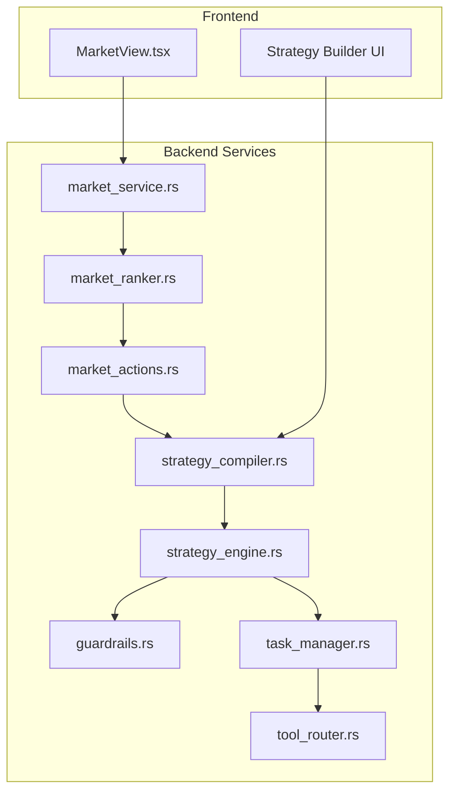
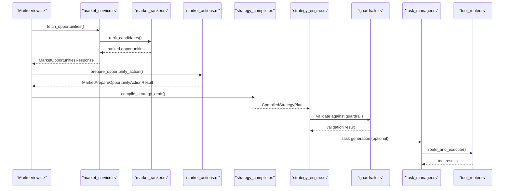
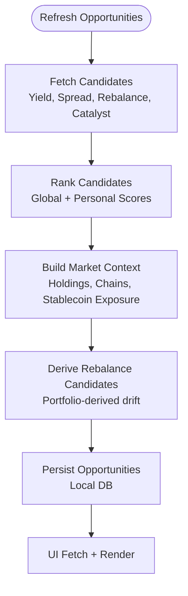
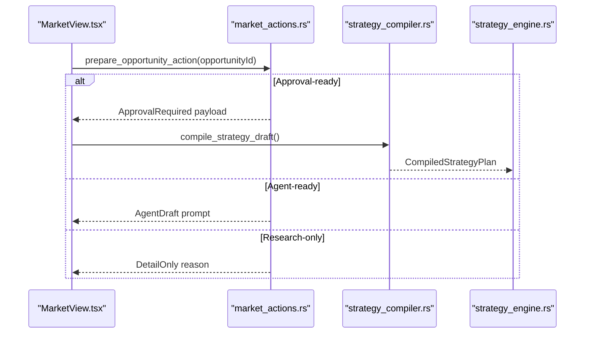
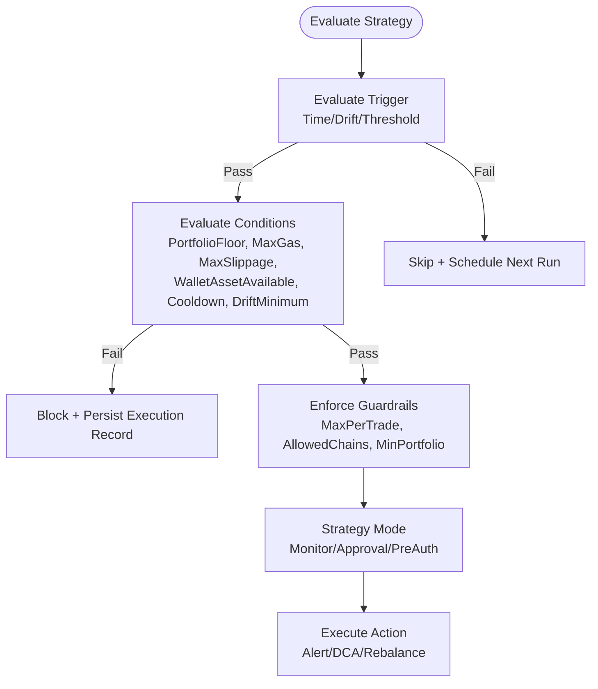
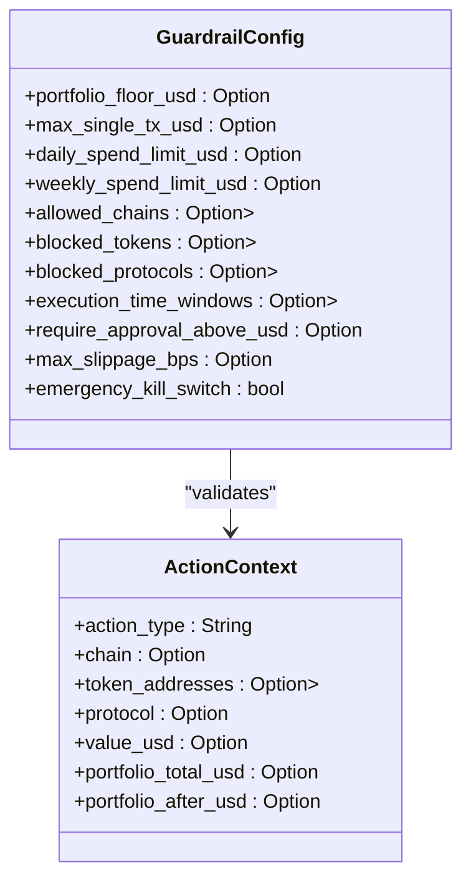
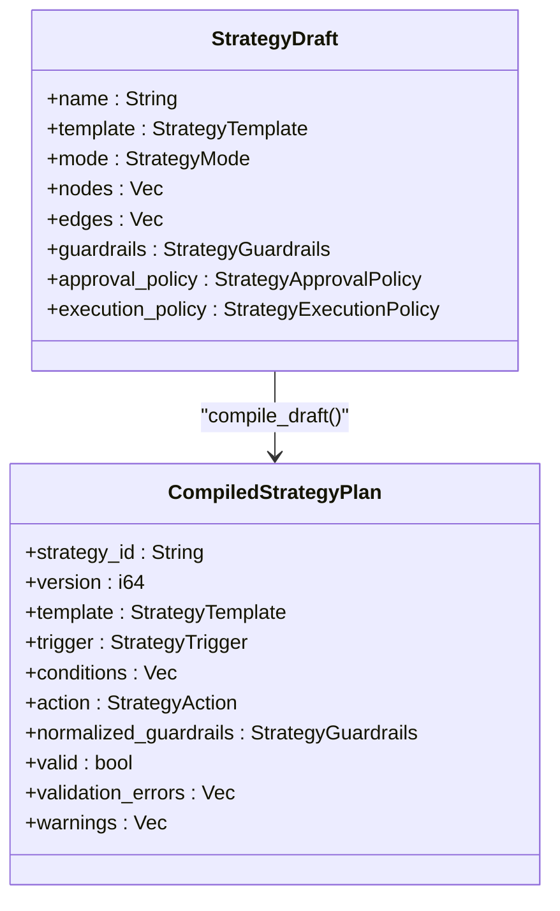
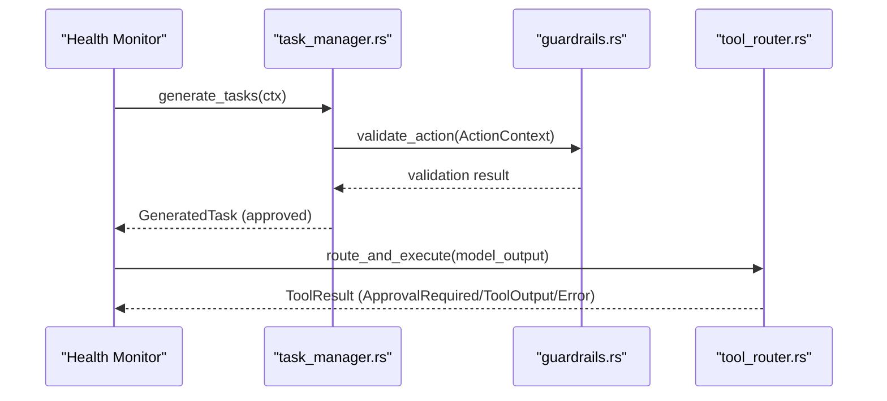
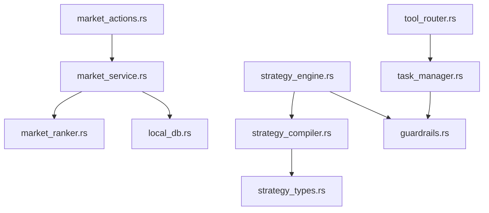

# Market Intelligence Integration

<cite>
**Referenced Files in This Document**
- [market_service.rs](file://src-tauri/src/services/market_service.rs)
- [market_ranker.rs](file://src-tauri/src/services/market_ranker.rs)
- [market_actions.rs](file://src-tauri/src/services/market_actions.rs)
- [strategy_engine.rs](file://src-tauri/src/services/strategy_engine.rs)
- [strategy_compiler.rs](file://src-tauri/src/services/strategy_compiler.rs)
- [strategy_types.rs](file://src-tauri/src/services/strategy_types.rs)
- [guardrails.rs](file://src-tauri/src/services/guardrails.rs)
- [task_manager.rs](file://src-tauri/src/services/task_manager.rs)
- [tool_router.rs](file://src-tauri/src/services/tool_router.rs)
- [MarketView.tsx](file://src/components/market/MarketView.tsx)
- [strategy.ts](file://src/lib/strategy.ts)
</cite>

## Table of Contents
1. [Introduction](#introduction)
2. [Project Structure](#project-structure)
3. [Core Components](#core-components)
4. [Architecture Overview](#architecture-overview)
5. [Detailed Component Analysis](#detailed-component-analysis)
6. [Dependency Analysis](#dependency-analysis)
7. [Performance Considerations](#performance-considerations)
8. [Troubleshooting Guide](#troubleshooting-guide)
9. [Conclusion](#conclusion)

## Introduction
This document explains how market intelligence integrates with trading strategies and execution workflows in the system. It covers how market insights feed into strategy creation, execution planning, and risk management decisions. It documents the market-action preparation system, opportunity-to-execution pathway mapping, and action readiness assessment. It also details the integration between market intelligence and the strategy engine, guardrail enforcement based on market conditions, dynamic risk adjustment mechanisms, and market timing considerations. Finally, it describes the research-driven strategy refinement process, market condition monitoring, automated strategy adaptation, performance tracking, backtesting integration, and coordination between market intelligence and autonomous operation systems.

## Project Structure
The market intelligence integration spans both frontend and backend components:
- Frontend: Market view and strategy builder UI components
- Backend: Market data ingestion, ranking, and opportunity preparation; strategy compilation and execution; guardrails and task management; tool routing for autonomous operations

**Diagram sources**
- [MarketView.tsx:58-105](file://src/components/market/MarketView.tsx#L58-L105)
- [market_service.rs:220-261](file://src-tauri/src/services/market_service.rs#L220-L261)
- [market_ranker.rs:17-35](file://src-tauri/src/services/market_ranker.rs#L17-L35)
- [market_actions.rs:8-36](file://src-tauri/src/services/market_actions.rs#L8-L36)
- [strategy_compiler.rs:185-292](file://src-tauri/src/services/strategy_compiler.rs#L185-L292)
- [strategy_engine.rs:343-725](file://src-tauri/src/services/strategy_engine.rs#L343-L725)
- [guardrails.rs:182-200](file://src-tauri/src/services/guardrails.rs#L182-L200)
- [task_manager.rs:166-195](file://src-tauri/src/services/task_manager.rs#L166-L195)
- [tool_router.rs:100-131](file://src-tauri/src/services/tool_router.rs#L100-L131)

**Section sources**
- [MarketView.tsx:58-105](file://src/components/market/MarketView.tsx#L58-L105)
- [market_service.rs:189-218](file://src-tauri/src/services/market_service.rs#L189-L218)

## Core Components
- Market Intelligence Pipeline: Fetches market candidates, derives opportunities, ranks them, and persists them for consumption by the UI and strategy engine.
- Opportunity Preparation: Transforms ranked opportunities into actionable proposals (approval-required strategies, agent-guided drafts, or detail-only views).
- Strategy Engine: Evaluates compiled strategies against portfolio context, guardrails, and execution policies to trigger actions or alerts.
- Guardrails: Enforces dynamic risk controls based on user configuration, time windows, and emergency states.
- Task Management: Proactively generates tasks from portfolio health and market insights, validates them against guardrails, and coordinates execution.
- Tool Routing: Executes autonomous operations by parsing model output and dispatching to appropriate tools with approval gating.

**Section sources**
- [market_service.rs:263-365](file://src-tauri/src/services/market_service.rs#L263-L365)
- [market_ranker.rs:17-493](file://src-tauri/src/services/market_ranker.rs#L17-L493)
- [market_actions.rs:8-66](file://src-tauri/src/services/market_actions.rs#L8-L66)
- [strategy_engine.rs:343-725](file://src-tauri/src/services/strategy_engine.rs#L343-L725)
- [guardrails.rs:18-85](file://src-tauri/src/services/guardrails.rs#L18-L85)
- [task_manager.rs:166-502](file://src-tauri/src/services/task_manager.rs#L166-L502)
- [tool_router.rs:100-717](file://src-tauri/src/services/tool_router.rs#L100-L717)

## Architecture Overview
The system follows a data-driven architecture:
- Market data providers supply candidates (yield, spread, rebalance, catalyst).
- The market service builds a context-aware ranking and stores opportunities.
- The UI presents opportunities with actionability and readiness notes.
- Opportunities are prepared into strategies or agent prompts.
- Strategies are compiled and evaluated by the engine against guardrails and portfolio conditions.
- Tasks are generated proactively from health and drift analysis and routed through guardrails and approvals.

**Diagram sources**
- [MarketView.tsx:58-105](file://src/components/market/MarketView.tsx#L58-L105)
- [market_service.rs:220-261](file://src-tauri/src/services/market_service.rs#L220-L261)
- [market_ranker.rs:17-35](file://src-tauri/src/services/market_ranker.rs#L17-L35)
- [market_actions.rs:8-36](file://src-tauri/src/services/market_actions.rs#L8-L36)
- [strategy_compiler.rs:185-292](file://src-tauri/src/services/strategy_compiler.rs#L185-L292)
- [strategy_engine.rs:343-725](file://src-tauri/src/services/strategy_engine.rs#L343-L725)
- [guardrails.rs:182-200](file://src-tauri/src/services/guardrails.rs#L182-L200)
- [task_manager.rs:166-195](file://src-tauri/src/services/task_manager.rs#L166-L195)
- [tool_router.rs:100-131](file://src-tauri/src/services/tool_router.rs#L100-L131)

## Detailed Component Analysis

### Market Intelligence Pipeline
- Data ingestion: The market service periodically refreshes market and research candidates, derives spread-watch and rebalance opportunities from portfolio context, and persists them to local storage.
- Ranking: The market ranker computes global and personal scores, risk assessments, and actionability based on candidate characteristics and user context.
- Presentation: The UI fetches opportunities, displays actionability (research-only, agent-ready, approval-ready), and shows detail pages with guardrail and execution readiness notes.

**Diagram sources**
- [market_service.rs:263-365](file://src-tauri/src/services/market_service.rs#L263-L365)
- [market_ranker.rs:17-493](file://src-tauri/src/services/market_ranker.rs#L17-L493)
- [market_service.rs:430-529](file://src-tauri/src/services/market_service.rs#L430-L529)

**Section sources**
- [market_service.rs:263-365](file://src-tauri/src/services/market_service.rs#L263-L365)
- [market_ranker.rs:17-493](file://src-tauri/src/services/market_ranker.rs#L17-L493)

### Opportunity-to-Execution Pathway Mapping
- Actionability: Opportunities are tagged with actionability levels indicating readiness (research-only, agent-ready, approval-ready).
- Preparation: The preparation service evaluates opportunity readiness, constructs approval payloads for guarded strategies, or builds agent prompts for guided analysis.
- UI Integration: The Market View handles primary actions, detail loading, and navigation to strategy creation or agent workflows.

**Diagram sources**
- [MarketView.tsx:89-105](file://src/components/market/MarketView.tsx#L89-L105)
- [market_actions.rs:8-36](file://src-tauri/src/services/market_actions.rs#L8-L36)
- [strategy_compiler.rs:185-292](file://src-tauri/src/services/strategy_compiler.rs#L185-L292)

**Section sources**
- [market_actions.rs:8-66](file://src-tauri/src/services/market_actions.rs#L8-L66)
- [MarketView.tsx:58-105](file://src/components/market/MarketView.tsx#L58-L105)

### Strategy Engine Integration
- Trigger evaluation: The engine evaluates time-based, drift-threshold, and threshold triggers against portfolio context and snapshot freshness.
- Condition evaluation: Guards include portfolio floor, max gas, max slippage, asset availability, cooldown, and drift minimum.
- Action execution: Depending on strategy mode (monitor-only, approval-required, pre-authorized), the engine emits alerts, creates approvals, or proceeds to execution.
- Dynamic risk adjustments: The engine enforces normalized guardrails, chain allowlists, and pause-on-limit-exceeded behavior.

**Diagram sources**
- [strategy_engine.rs:120-159](file://src-tauri/src/services/strategy_engine.rs#L120-L159)
- [strategy_engine.rs:169-255](file://src-tauri/src/services/strategy_engine.rs#L169-L255)
- [strategy_engine.rs:403-499](file://src-tauri/src/services/strategy_engine.rs#L403-L499)
- [strategy_engine.rs:505-725](file://src-tauri/src/services/strategy_engine.rs#L505-L725)

**Section sources**
- [strategy_engine.rs:343-725](file://src-tauri/src/services/strategy_engine.rs#L343-L725)

### Guardrail Enforcement and Dynamic Risk Adjustment
- Configuration: Users configure guardrails including portfolio floor, per-transaction and daily limits, chain allowlists, token lists, slippage, and execution windows.
- Validation: The guardrails service validates actions against current context and global kill switch state.
- Enforcement: The strategy engine applies guardrails during evaluation, potentially pausing strategies or skipping runs when thresholds are exceeded.

**Diagram sources**
- [guardrails.rs:42-85](file://src-tauri/src/services/guardrails.rs#L42-L85)
- [guardrails.rs:88-105](file://src-tauri/src/services/guardrails.rs#L88-L105)

**Section sources**
- [guardrails.rs:182-200](file://src-tauri/src/services/guardrails.rs#L182-L200)
- [strategy_engine.rs:403-499](file://src-tauri/src/services/strategy_engine.rs#L403-L499)

### Research-Driven Strategy Refinement and Automated Adaptation
- Strategy compiler normalizes guardrails and compiles drafts into executable plans with validation.
- Strategy types define triggers, conditions, and actions; templates support DCA, rebalance, and alert-only strategies.
- Strategy builder UI constructs drafts; the library provides helper functions to compile and create strategies.

**Diagram sources**
- [strategy_types.rs:228-243](file://src-tauri/src/services/strategy_types.rs#L228-L243)
- [strategy_types.rs:344-355](file://src-tauri/src/services/strategy_types.rs#L344-L355)
- [strategy_compiler.rs:185-292](file://src-tauri/src/services/strategy_compiler.rs#L185-L292)

**Section sources**
- [strategy_compiler.rs:185-292](file://src-tauri/src/services/strategy_compiler.rs#L185-L292)
- [strategy_types.rs:1-417](file://src-tauri/src/services/strategy_types.rs#L1-L417)
- [strategy.ts:133-189](file://src/lib/strategy.ts#L133-L189)

### Coordination Between Market Intelligence and Autonomous Operations
- Task generation: The task manager generates proactive tasks from health alerts and drift analysis, applying confidence and priority heuristics.
- Guardrail validation: Tasks are validated against guardrails before approval, ensuring alignment with user-defined constraints and emergency states.
- Tool routing: The tool router parses model output, dispatches tools, and returns approval-required payloads when necessary.

**Diagram sources**
- [task_manager.rs:166-195](file://src-tauri/src/services/task_manager.rs#L166-L195)
- [task_manager.rs:432-502](file://src-tauri/src/services/task_manager.rs#L432-L502)
- [guardrails.rs:182-200](file://src-tauri/src/services/guardrails.rs#L182-L200)
- [tool_router.rs:100-131](file://src-tauri/src/services/tool_router.rs#L100-L131)

**Section sources**
- [task_manager.rs:166-502](file://src-tauri/src/services/task_manager.rs#L166-L502)
- [tool_router.rs:100-717](file://src-tauri/src/services/tool_router.rs#L100-L717)

## Dependency Analysis
Key dependencies and relationships:
- Market service depends on market ranker and provider modules to produce ranked opportunities.
- Market actions depend on cached opportunities to construct approval payloads or agent prompts.
- Strategy engine depends on strategy compiler outputs and guardrails for evaluation.
- Task manager depends on health monitor and guardrails for proactive task generation.
- Tool router orchestrates autonomous operations and interacts with app integrations.

**Diagram sources**
- [market_service.rs:292-334](file://src-tauri/src/services/market_service.rs#L292-L334)
- [market_actions.rs:8-36](file://src-tauri/src/services/market_actions.rs#L8-L36)
- [strategy_compiler.rs:1-11](file://src-tauri/src/services/strategy_compiler.rs#L1-L11)
- [strategy_engine.rs:10-20](file://src-tauri/src/services/strategy_engine.rs#L10-L20)
- [guardrails.rs:1-13](file://src-tauri/src/services/guardrails.rs#L1-L13)
- [task_manager.rs:1-13](file://src-tauri/src/services/task_manager.rs#L1-L13)
- [tool_router.rs:1-16](file://src-tauri/src/services/tool_router.rs#L1-L16)

**Section sources**
- [market_service.rs:292-334](file://src-tauri/src/services/market_service.rs#L292-L334)
- [strategy_engine.rs:10-20](file://src-tauri/src/services/strategy_engine.rs#L10-L20)

## Performance Considerations
- Caching and freshness: Market data refresh respects cache freshness and emits events to the UI to avoid redundant computations.
- Ranking efficiency: Weighted scoring and normalization minimize expensive operations while preserving relevance.
- Strategy evaluation: Snapshot freshness checks prevent unnecessary evaluations when portfolio data is stale.
- Guardrail validation: Early exits and simple checks keep validation lightweight.

[No sources needed since this section provides general guidance]

## Troubleshooting Guide
Common issues and resolutions:
- Market opportunities stale or missing: The market service falls back to cached results and emits refresh failures to the UI.
- Strategy compilation errors: Validation issues are returned in the compiled plan; fix node types and payload constraints.
- Guardrail violations: Review configured limits, time windows, and kill switch state; adjust slippage and approval thresholds.
- Task approval failures: Ensure guardrails allowlist/denylist and time windows permit the proposed action.

**Section sources**
- [market_service.rs:601-624](file://src-tauri/src/services/market_service.rs#L601-L624)
- [strategy_compiler.rs:185-222](file://src-tauri/src/services/strategy_compiler.rs#L185-L222)
- [guardrails.rs:182-200](file://src-tauri/src/services/guardrails.rs#L182-L200)
- [task_manager.rs:432-502](file://src-tauri/src/services/task_manager.rs#L432-L502)

## Conclusion
The market intelligence integration provides a robust pipeline from market insights to actionable strategies and autonomous execution. Market candidates are transformed into ranked opportunities with clear actionability, prepared into guarded strategies or agent prompts, and executed by the strategy engine under strict guardrail enforcement. Proactive task generation and tool routing coordinate autonomous operations with user-defined risk controls and market timing considerations. This architecture supports research-driven refinement, continuous adaptation, and safe, auditable execution aligned with user preferences and portfolio context.