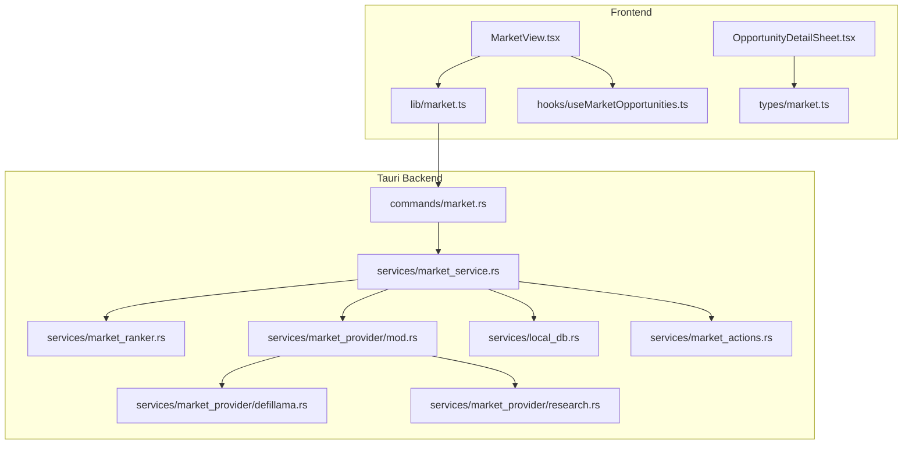
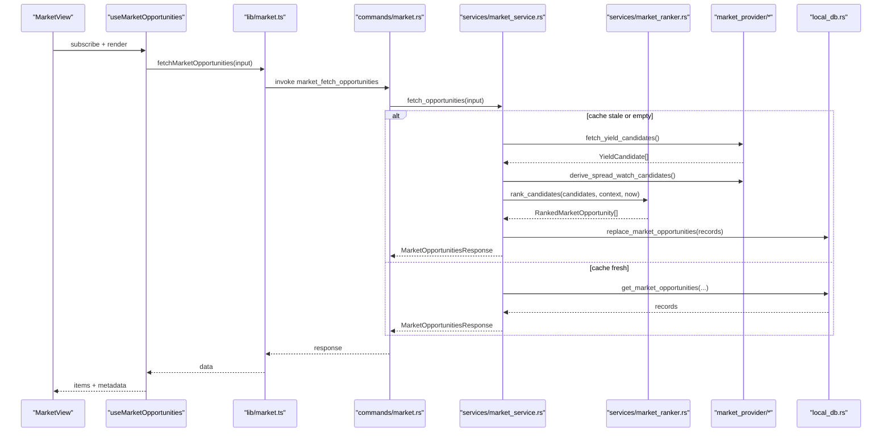
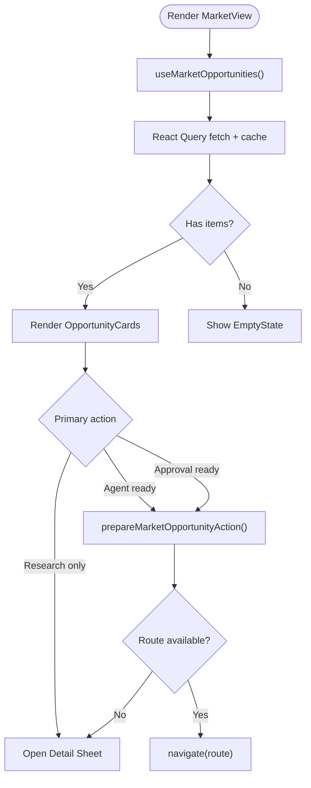
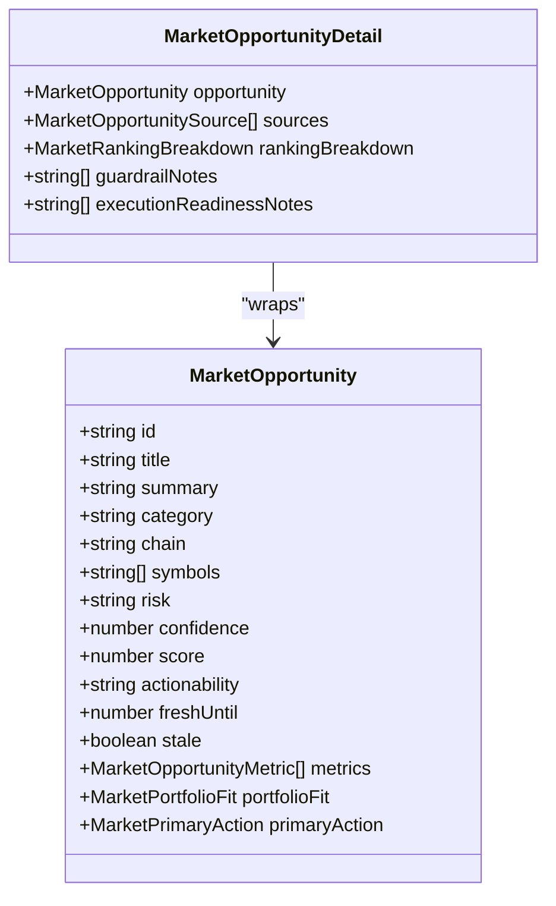
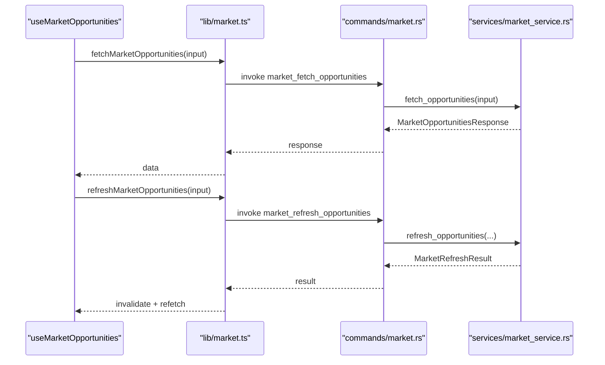
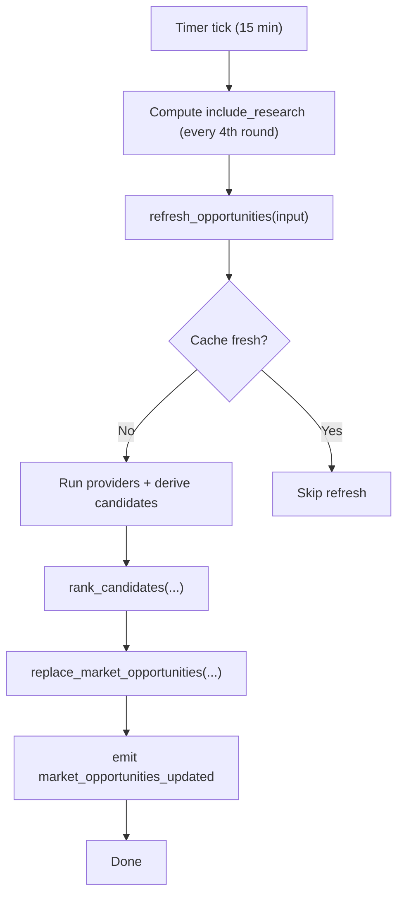
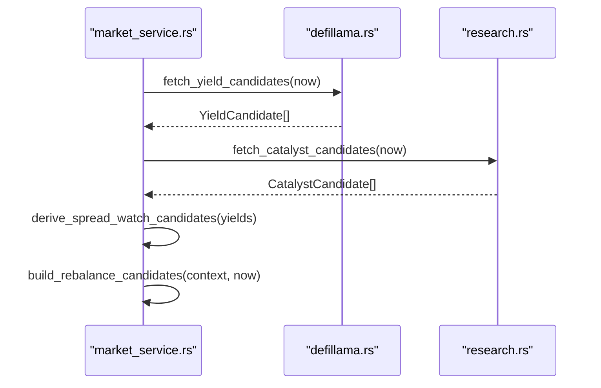
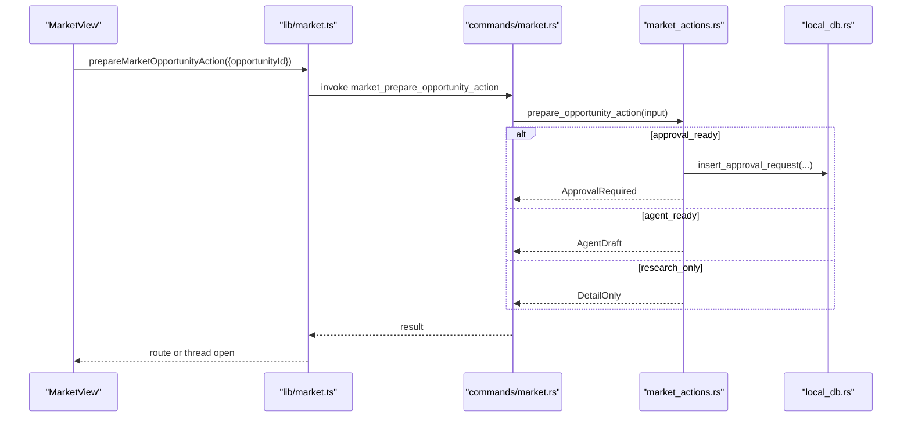
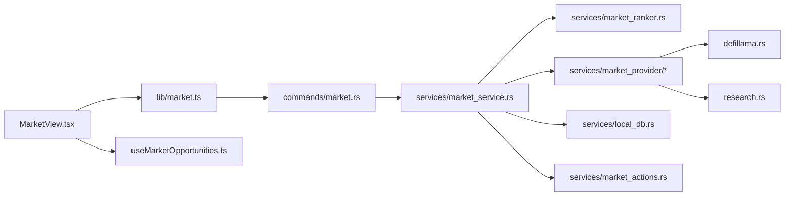

# Market Intelligence

<cite>
**Referenced Files in This Document**
- [MarketView.tsx](file://src/components/market/MarketView.tsx)
- [OpportunityDetailSheet.tsx](file://src/components/market/OpportunityDetailSheet.tsx)
- [market.ts](file://src/lib/market.ts)
- [useMarketOpportunities.ts](file://src/hooks/useMarketOpportunities.ts)
- [market.ts](file://src/types/market.ts)
- [market_service.rs](file://src-tauri/src/services/market_service.rs)
- [market_ranker.rs](file://src-tauri/src/services/market_ranker.rs)
- [market_provider/mod.rs](file://src-tauri/src/services/market_provider/mod.rs)
- [defillama.rs](file://src-tauri/src/services/market_provider/defillama.rs)
- [research.rs](file://src-tauri/src/services/market_provider/research.rs)
- [market.rs](file://src-tauri/src/commands/market.rs)
- [market_actions.rs](file://src-tauri/src/services/market_actions.rs)
- [local_db.rs](file://src-tauri/src/services/local_db.rs)
</cite>

## Table of Contents
1. [Introduction](#introduction)
2. [Project Structure](#project-structure)
3. [Core Components](#core-components)
4. [Architecture Overview](#architecture-overview)
5. [Detailed Component Analysis](#detailed-component-analysis)
6. [Dependency Analysis](#dependency-analysis)
7. [Performance Considerations](#performance-considerations)
8. [Troubleshooting Guide](#troubleshooting-guide)
9. [Conclusion](#conclusion)
10. [Appendices](#appendices)

## Introduction
This document explains SHADOW Protocol’s Market Intelligence system for DeFi opportunity discovery and analysis. It covers the MarketView interface for browsing opportunities, the OpportunityDetailSheet for deep-dive analysis, and the end-to-end pipeline that scans, ranks, and surfaces opportunities across multiple chains. It also documents integrations with DeFi data providers (DefiLlama and Sonar), the ranking and guardrails system, real-time refresh and caching, and how market intelligence connects to strategy execution and risk controls.

## Project Structure
The Market Intelligence system spans React UI components, a Tauri backend service, and Rust modules implementing data providers, ranking, and persistence.

**Diagram sources**
- [MarketView.tsx:1-267](file://src/components/market/MarketView.tsx#L1-L267)
- [OpportunityDetailSheet.tsx:1-110](file://src/components/market/OpportunityDetailSheet.tsx#L1-L110)
- [market.ts:1-135](file://src/lib/market.ts#L1-L135)
- [useMarketOpportunities.ts:1-131](file://src/hooks/useMarketOpportunities.ts#L1-L131)
- [market.ts:1-134](file://src/types/market.ts#L1-L134)
- [market_service.rs:1-745](file://src-tauri/src/services/market_service.rs#L1-L745)
- [market_ranker.rs:1-559](file://src-tauri/src/services/market_ranker.rs#L1-L559)
- [market_provider/mod.rs:1-160](file://src-tauri/src/services/market_provider/mod.rs#L1-L160)
- [defillama.rs:1-151](file://src-tauri/src/services/market_provider/defillama.rs#L1-L151)
- [research.rs:1-112](file://src-tauri/src/services/market_provider/research.rs#L1-L112)
- [market.rs:1-36](file://src-tauri/src/commands/market.rs#L1-L36)
- [market_actions.rs:1-141](file://src-tauri/src/services/market_actions.rs#L1-L141)
- [local_db.rs:1-200](file://src-tauri/src/services/local_db.rs#L1-L200)

**Section sources**
- [MarketView.tsx:1-267](file://src/components/market/MarketView.tsx#L1-L267)
- [market.ts:1-135](file://src/lib/market.ts#L1-L135)
- [useMarketOpportunities.ts:1-131](file://src/hooks/useMarketOpportunities.ts#L1-L131)
- [market_service.rs:1-745](file://src-tauri/src/services/market_service.rs#L1-L745)

## Core Components
- MarketView: Browse live opportunities, filter by category and chain, refresh, and open details or actions.
- OpportunityDetailSheet: Render detailed breakdown, guardrails, execution readiness notes, and sources.
- Frontend API bindings: Typed invocations to Tauri commands for fetching opportunities, refreshing, getting details, and preparing actions.
- Hooks: React Query-powered caching, polling, and event-driven updates.
- Types: Strongly typed models for opportunities, rankings, and action preparation results.
- Backend Services: Market service orchestrating refresh cycles, provider integrations, ranking, persistence, and action preparation.
- Ranking Engine: Weighted scoring across global and personal relevance with risk and confidence.
- Providers: DefiLlama for yield pools; Sonar-backed research for catalysts.
- Persistence: Local DB for market opportunities, provider runs, and approvals.

**Section sources**
- [MarketView.tsx:27-266](file://src/components/market/MarketView.tsx#L27-L266)
- [OpportunityDetailSheet.tsx:11-109](file://src/components/market/OpportunityDetailSheet.tsx#L11-L109)
- [market.ts:16-59](file://src/lib/market.ts#L16-L59)
- [useMarketOpportunities.ts:27-129](file://src/hooks/useMarketOpportunities.ts#L27-L129)
- [market.ts:39-98](file://src/types/market.ts#L39-L98)
- [market_service.rs:220-365](file://src-tauri/src/services/market_service.rs#L220-L365)
- [market_ranker.rs:17-48](file://src-tauri/src/services/market_ranker.rs#L17-L48)
- [market_provider/mod.rs:15-82](file://src-tauri/src/services/market_provider/mod.rs#L15-L82)
- [defillama.rs:27-116](file://src-tauri/src/services/market_provider/defillama.rs#L27-L116)
- [research.rs:23-83](file://src-tauri/src/services/market_provider/research.rs#L23-L83)
- [local_db.rs:180-200](file://src-tauri/src/services/local_db.rs#L180-L200)

## Architecture Overview
End-to-end flow from data ingestion to user action:

**Diagram sources**
- [MarketView.tsx:42-56](file://src/components/market/MarketView.tsx#L42-L56)
- [useMarketOpportunities.ts:39-62](file://src/hooks/useMarketOpportunities.ts#L39-L62)
- [market.ts:16-28](file://src/lib/market.ts#L16-L28)
- [market.rs:8-13](file://src-tauri/src/commands/market.rs#L8-L13)
- [market_service.rs:220-261](file://src-tauri/src/services/market_service.rs#L220-L261)
- [market_ranker.rs:17-35](file://src-tauri/src/services/market_ranker.rs#L17-L35)
- [market_provider/mod.rs:84-143](file://src-tauri/src/services/market_provider/mod.rs#L84-L143)
- [defillama.rs:27-116](file://src-tauri/src/services/market_provider/defillama.rs#L27-L116)
- [local_db.rs:180-200](file://src-tauri/src/services/local_db.rs#L180-L200)

## Detailed Component Analysis

### MarketView: Opportunity Browser
- Filters: Category and chain toggles with labels mapped from constants.
- Data: Uses React Query to fetch and cache opportunities; supports manual refresh and shows stale notices.
- Actions: Primary action routes to detail or prepares an action; pending action indicators prevent double-clicks.
- Wallet-awareness: Shows a notice when no wallet context exists; personalization improves when wallets are connected.

**Diagram sources**
- [MarketView.tsx:27-119](file://src/components/market/MarketView.tsx#L27-L119)
- [useMarketOpportunities.ts:27-129](file://src/hooks/useMarketOpportunities.ts#L27-L129)
- [market.ts:50-59](file://src/lib/market.ts#L50-L59)

**Section sources**
- [MarketView.tsx:27-266](file://src/components/market/MarketView.tsx#L27-L266)
- [useMarketOpportunities.ts:27-129](file://src/hooks/useMarketOpportunities.ts#L27-L129)

### OpportunityDetailSheet: Detailed Analysis
- Displays opportunity metadata, metrics grid, “Why it surfaced” reasons, guardrails, execution readiness notes, and sources.
- Provides a structured view of ranking breakdown and stored detail payload.

**Diagram sources**
- [market.ts:39-98](file://src/types/market.ts#L39-L98)

**Section sources**
- [OpportunityDetailSheet.tsx:11-109](file://src/components/market/OpportunityDetailSheet.tsx#L11-L109)
- [market.ts:92-98](file://src/types/market.ts#L92-L98)

### Frontend API Bindings and Hooks
- fetchMarketOpportunities, refreshMarketOpportunities, getMarketOpportunityDetail, prepareMarketOpportunityAction.
- useMarketOpportunities: normalized wallet addresses, React Query caching, event listeners for live updates, and refresh orchestration.

**Diagram sources**
- [market.ts:16-48](file://src/lib/market.ts#L16-L48)
- [market.rs:8-21](file://src-tauri/src/commands/market.rs#L8-L21)
- [market_service.rs:263-365](file://src-tauri/src/services/market_service.rs#L263-L365)

**Section sources**
- [market.ts:16-59](file://src/lib/market.ts#L16-L59)
- [useMarketOpportunities.ts:27-129](file://src/hooks/useMarketOpportunities.ts#L27-L129)

### Backend Market Service: Orchestration, Caching, and Events
- Periodic refresh cycle: market refresh every 15 minutes; research refresh every 4 cycles (hourly).
- Provider runs: tracks successes/failures per provider; emits events on completion.
- Fallback: serves cached opportunities when providers fail.
- Context-aware ranking: builds portfolio context from local DB tokens.

**Diagram sources**
- [market_service.rs:189-218](file://src-tauri/src/services/market_service.rs#L189-L218)
- [market_service.rs:263-365](file://src-tauri/src/services/market_service.rs#L263-L365)
- [market_service.rs:561-593](file://src-tauri/src/services/market_service.rs#L561-L593)

**Section sources**
- [market_service.rs:189-218](file://src-tauri/src/services/market_service.rs#L189-L218)
- [market_service.rs:263-365](file://src-tauri/src/services/market_service.rs#L263-L365)

### Ranking Engine: Opportunity Scoring and Risk
- Yield: APY, TVL, freshness, protocol safety; personal score considers owned assets and chain coverage.
- Spread Watch: spread size, freshness, personal relevance.
- Rebalance: drift severity, notional, freshness; gated by wallet presence and minimum notional.
- Catalyst: research confidence and asset overlap; presented as research-only.

```mermaid
flowchart TD
Start(["Candidate"]) --> Type{"Type?"}
Type --> |Yield| Yield["Weighted score: APY, TVL, freshness, protocol"]
Type --> |SpreadWatch| Spread["Weighted score: spread_bps, freshness"]
Type --> |Rebalance| Rebal["Weighted score: drift, notional, freshness"]
Type --> |Catalyst| Cat["Weighted score: confidence, freshness"]
Yield --> PersonalY["Personal score: owned assets, chain coverage"]
Spread --> PersonalS["Personal score: overlap"]
Rebal --> PersonalR["Personal score: overlap, wallet presence"]
Cat --> PersonalC["Personal score: overlap"]
Yield --> RiskY["Risk: stablecoin thresholds"]
Spread --> RiskS["Risk: spread magnitude"]
Rebal --> RiskR["Risk: low"]
Cat --> RiskC["Risk: derived from confidence"]
Yield --> MetricsY["Metrics: APY, TVL, Asset"]
Spread --> MetricsS["Metrics: Spread, Best/Ref Chain"]
Rebal --> MetricsR["Metrics: Drift, Notional, Target"]
Cat --> MetricsC["Metrics: Confidence, Chain"]
Yield --> ActionY["Actionability: agent_ready"]
Spread --> ActionS["Actionability: agent_ready"]
Rebal --> ActionR["Actionability: approval_ready"]
Cat --> ActionC["Actionability: research_only"]
```

**Diagram sources**
- [market_ranker.rs:17-48](file://src-tauri/src/services/market_ranker.rs#L17-L48)
- [market_ranker.rs:50-187](file://src-tauri/src/services/market_ranker.rs#L50-L187)
- [market_ranker.rs:189-294](file://src-tauri/src/services/market_ranker.rs#L189-L294)
- [market_ranker.rs:296-405](file://src-tauri/src/services/market_ranker.rs#L296-L405)
- [market_ranker.rs:407-493](file://src-tauri/src/services/market_ranker.rs#L407-L493)

**Section sources**
- [market_ranker.rs:17-48](file://src-tauri/src/services/market_ranker.rs#L17-L48)
- [market_ranker.rs:50-187](file://src-tauri/src/services/market_ranker.rs#L50-L187)
- [market_ranker.rs:189-294](file://src-tauri/src/services/market_ranker.rs#L189-L294)
- [market_ranker.rs:296-405](file://src-tauri/src/services/market_ranker.rs#L296-L405)
- [market_ranker.rs:407-493](file://src-tauri/src/services/market_ranker.rs#L407-L493)

### Data Providers: DeFi Data Ingestion
- DefiLlama: fetch yield pools, normalize chain/symbol/protocol, filter by APY and TVL thresholds, sort and truncate.
- Research: prompt Sonar for JSON-formatted catalysts, normalize chains, slugify titles, enforce supported chains.

**Diagram sources**
- [market_service.rs:292-334](file://src-tauri/src/services/market_service.rs#L292-L334)
- [defillama.rs:27-116](file://src-tauri/src/services/market_provider/defillama.rs#L27-L116)
- [research.rs:23-83](file://src-tauri/src/services/market_provider/research.rs#L23-L83)
- [market_service.rs:462-529](file://src-tauri/src/services/market_service.rs#L462-L529)

**Section sources**
- [defillama.rs:27-116](file://src-tauri/src/services/market_provider/defillama.rs#L27-L116)
- [research.rs:23-83](file://src-tauri/src/services/market_provider/research.rs#L23-L83)
- [market_service.rs:292-334](file://src-tauri/src/services/market_service.rs#L292-L334)

### Strategy Execution and Guardrails
- prepareMarketOpportunityAction routes to:
  - Approval-required strategies for rebalance opportunities.
  - Agent drafts for agent-ready opportunities.
  - Detail-only for research-only opportunities.
- Approval requests are persisted with guardrails and audit logging.

**Diagram sources**
- [market.ts:50-59](file://src/lib/market.ts#L50-L59)
- [market.rs:30-35](file://src-tauri/src/commands/market.rs#L30-L35)
- [market_actions.rs:8-36](file://src-tauri/src/services/market_actions.rs#L8-L36)
- [market_actions.rs:38-118](file://src-tauri/src/services/market_actions.rs#L38-L118)

**Section sources**
- [market_actions.rs:8-36](file://src-tauri/src/services/market_actions.rs#L8-L36)
- [market_actions.rs:38-118](file://src-tauri/src/services/market_actions.rs#L38-L118)
- [market.ts:110-134](file://src/lib/market.ts#L110-L134)

## Dependency Analysis
- Frontend depends on typed models and Tauri commands.
- Backend orchestrates providers, ranking, persistence, and action preparation.
- Event-driven updates keep the UI fresh without manual polling.

**Diagram sources**
- [MarketView.tsx:1-26](file://src/components/market/MarketView.tsx#L1-L26)
- [market.ts:1-19](file://src/lib/market.ts#L1-L19)
- [market.rs:1-6](file://src-tauri/src/commands/market.rs#L1-L6)
- [market_service.rs:1-16](file://src-tauri/src/services/market_service.rs#L1-L16)
- [market_ranker.rs:1-8](file://src-tauri/src/services/market_ranker.rs#L1-L8)
- [market_provider/mod.rs:1-4](file://src-tauri/src/services/market_provider/mod.rs#L1-L4)
- [defillama.rs:1-4](file://src-tauri/src/services/market_provider/defillama.rs#L1-L4)
- [research.rs:1-4](file://src-tauri/src/services/market_provider/research.rs#L1-L4)
- [market_actions.rs:1-6](file://src-tauri/src/services/market_actions.rs#L1-L6)
- [local_db.rs:1-6](file://src-tauri/src/services/local_db.rs#L1-L6)

**Section sources**
- [market_service.rs:1-16](file://src-tauri/src/services/market_service.rs#L1-L16)
- [market_ranker.rs:1-8](file://src-tauri/src/services/market_ranker.rs#L1-L8)
- [market_provider/mod.rs:1-4](file://src-tauri/src/services/market_provider/mod.rs#L1-L4)
- [defillama.rs:1-4](file://src-tauri/src/services/market_provider/defillama.rs#L1-L4)
- [research.rs:1-4](file://src-tauri/src/services/market_provider/research.rs#L1-L4)
- [market_actions.rs:1-6](file://src-tauri/src/services/market_actions.rs#L1-L6)
- [local_db.rs:1-6](file://src-tauri/src/services/local_db.rs#L1-L6)

## Performance Considerations
- Caching and staleness:
  - Market refresh interval: 15 minutes; research refresh interval: hourly.
  - Cache considered fresh if latest provider run succeeded and within refresh windows.
  - Fallback to cached results on provider errors.
- Query caching:
  - React Query staleTime configured to balance freshness and network usage.
- Data normalization:
  - Symbol and chain normalization reduces duplication and improves matching.
- Ranking truncation:
  - Top-N selection at multiple stages (providers, ranking) to cap latency and UI load.

[No sources needed since this section provides general guidance]

## Troubleshooting Guide
- Market data unavailable:
  - Check provider status and fallback behavior; UI shows an empty state with guidance.
- Stale opportunities notice:
  - Indicates cached data is being served while refresh completes.
- Wallet-aware ranking limited:
  - Connect and sync at least one wallet to enable personalization.
- Action preparation failures:
  - Verify opportunity is enabled; for approval-ready, confirm the approval request was created; for agent-ready, ensure the agent thread opens.

**Section sources**
- [MarketView.tsx:186-196](file://src/components/market/MarketView.tsx#L186-L196)
- [useMarketOpportunities.ts:111-129](file://src/hooks/useMarketOpportunities.ts#L111-L129)
- [market_service.rs:601-624](file://src-tauri/src/services/market_service.rs#L601-L624)
- [market_actions.rs:16-24](file://src-tauri/src/services/market_actions.rs#L16-L24)

## Conclusion
SHADOW’s Market Intelligence system combines real-time DeFi data ingestion, robust ranking with personalization, and guardrails to surface high-quality opportunities across multiple chains. The frontend enables quick browsing and detailed analysis, while the backend ensures resilient refresh cycles, structured caching, and safe execution pathways integrated into the broader strategy engine.

## Appendices

### Multi-chain Market Analysis
- Supported chains: Ethereum, Base, Polygon, Multi-chain.
- Chain normalization and display helpers ensure consistent labeling and routing.

**Section sources**
- [market_service.rs:398-406](file://src-tauri/src/services/market_service.rs#L398-L406)
- [market_service.rs:714-723](file://src-tauri/src/services/market_service.rs#L714-L723)

### Liquidity Provision and Yield Optimization Insights
- Yield opportunities: APY, TVL, asset, and protocol signals.
- Spread watch: cross-chain or protocol spread detection for manual routing.
- Rebalance: portfolio-derived rebalancing with drift and notional metrics.

**Section sources**
- [market_ranker.rs:102-118](file://src-tauri/src/services/market_ranker.rs#L102-L118)
- [market_provider/mod.rs:84-143](file://src-tauri/src/services/market_provider/mod.rs#L84-L143)
- [market_ranker.rs:296-353](file://src-tauri/src/services/market_ranker.rs#L296-L353)

### Data Sources, Caching, and Persistence
- Data sources: DefiLlama for yield pools; Sonar for research catalysts.
- Caching: provider runs, last seen timestamps, and expiration windows.
- Persistence: local DB tables for market opportunities, provider runs, approvals, and audit logs.

**Section sources**
- [defillama.rs:6-25](file://src-tauri/src/services/market_provider/defillama.rs#L6-L25)
- [research.rs:8-21](file://src-tauri/src/services/market_provider/research.rs#L8-L21)
- [market_service.rs:561-593](file://src-tauri/src/services/market_service.rs#L561-L593)
- [local_db.rs:180-200](file://src-tauri/src/services/local_db.rs#L180-L200)
- [local_db.rs:28-53](file://src-tauri/src/services/local_db.rs#L28-L53)
- [local_db.rs:117-132](file://src-tauri/src/services/local_db.rs#L117-L132)
- [local_db.rs:169-176](file://src-tauri/src/services/local_db.rs#L169-L176)

### Interpreting Market Signals and Opportunity Metrics
- APY, TVL, Spread (bps), Drift (%), Confidence (%), and Chain/Protocol context inform risk and relevance.
- “Why it surfaced” highlights the ranking breakdown and personal fit.
- Guardrails and execution readiness notes guide safe next steps.

**Section sources**
- [market_ranker.rs:169-184](file://src-tauri/src/services/market_ranker.rs#L169-L184)
- [market_ranker.rs:281-291](file://src-tauri/src/services/market_ranker.rs#L281-L291)
- [market_ranker.rs:388-402](file://src-tauri/src/services/market_ranker.rs#L388-L402)
- [market_ranker.rs:480-490](file://src-tauri/src/services/market_ranker.rs#L480-L490)

### Integrating Market Intelligence into Trading Strategies
- Approval-ready opportunities become guarded strategy drafts with explicit guardrails.
- Agent-ready opportunities spawn agent threads with curated prompts.
- Research-only opportunities remain informational; further analysis via agent is recommended.

**Section sources**
- [market_actions.rs:26-35](file://src-tauri/src/services/market_actions.rs#L26-L35)
- [market_actions.rs:120-140](file://src-tauri/src/services/market_actions.rs#L120-L140)
- [market_ranker.rs:439-440](file://src-tauri/src/services/market_ranker.rs#L439-L440)