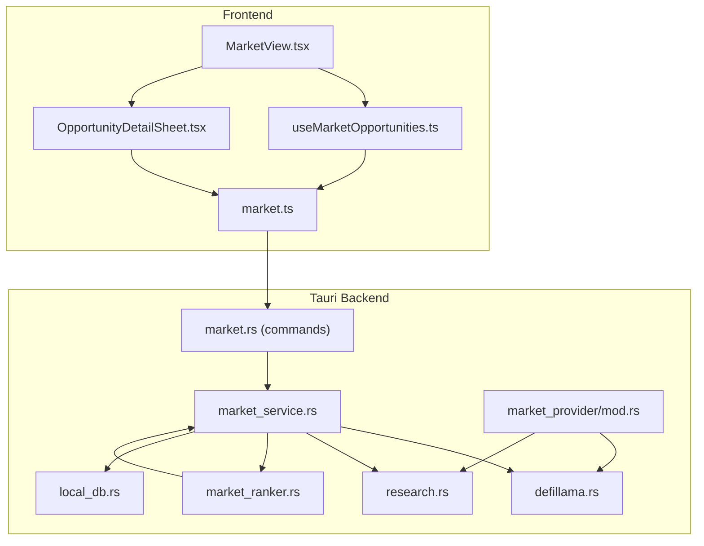
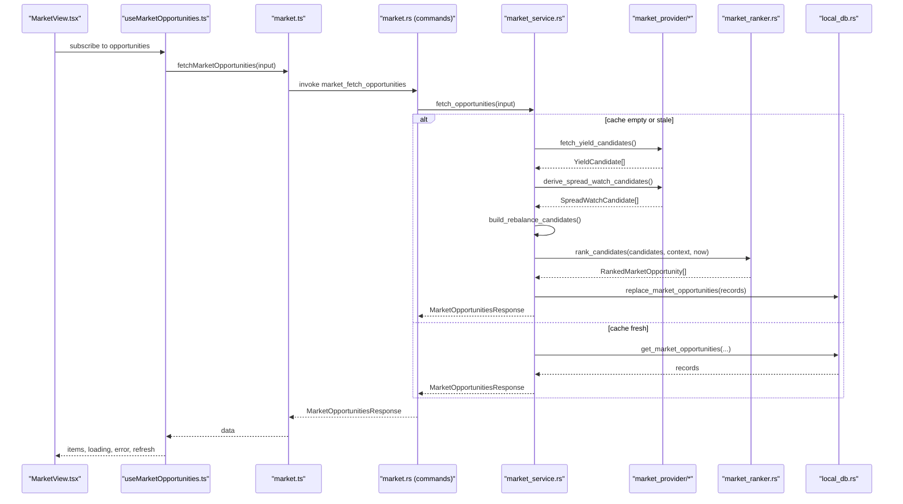
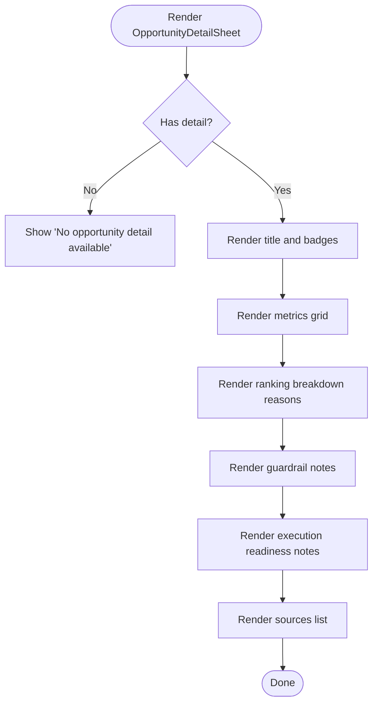
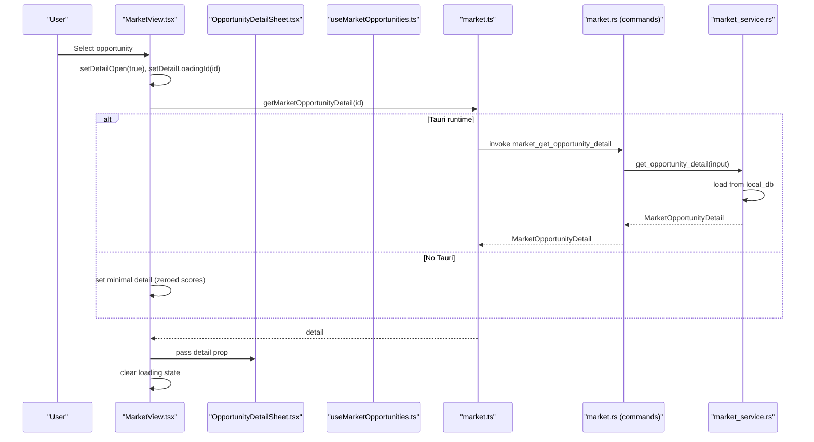
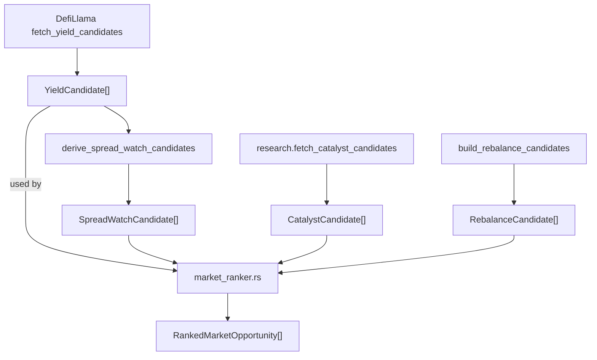
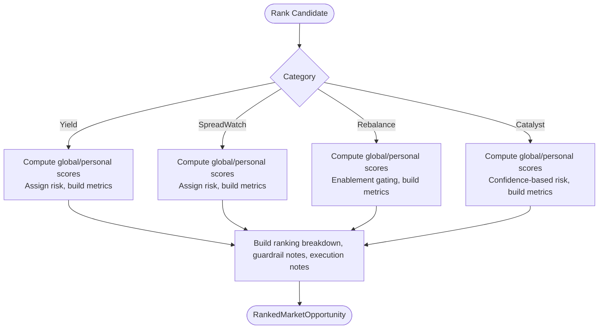
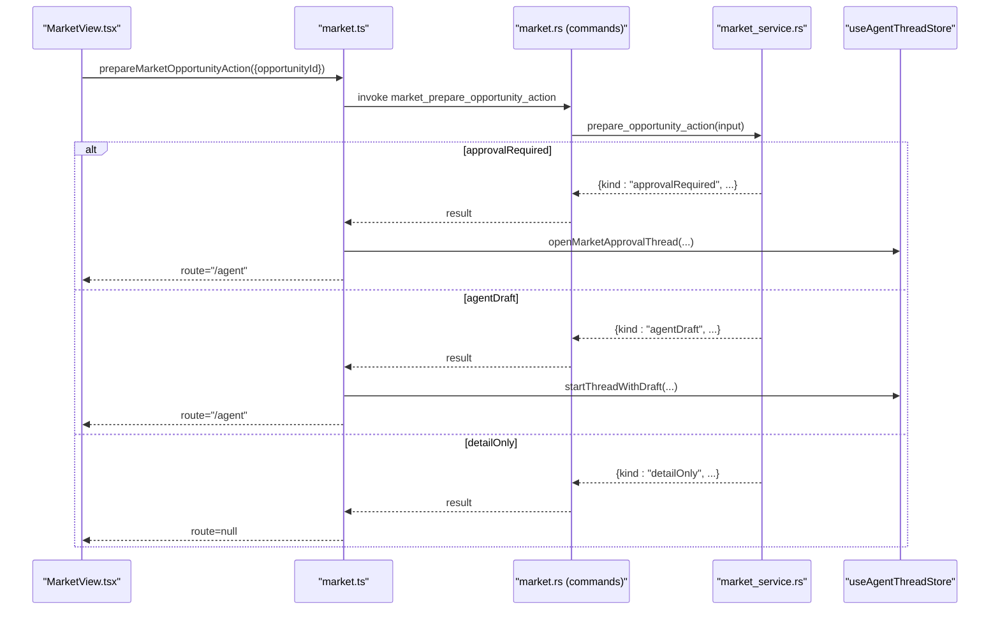
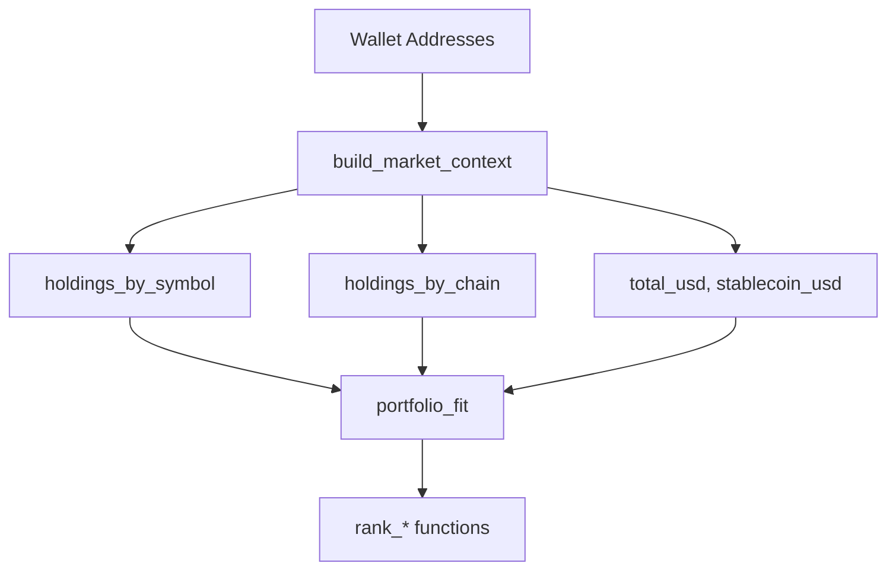
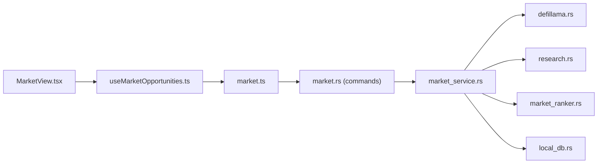

# Opportunity Detail & Research

<cite>
**Referenced Files in This Document**
- [OpportunityDetailSheet.tsx](file://src/components/market/OpportunityDetailSheet.tsx)
- [MarketView.tsx](file://src/components/market/MarketView.tsx)
- [useMarketOpportunities.ts](file://src/hooks/useMarketOpportunities.ts)
- [market.ts](file://src/lib/market.ts)
- [market.ts (types)](file://src/types/market.ts)
- [market_service.rs](file://src-tauri/src/services/market_service.rs)
- [market_ranker.rs](file://src-tauri/src/services/market_ranker.rs)
- [market_provider/mod.rs](file://src-tauri/src/services/market_provider/mod.rs)
- [defillama.rs](file://src-tauri/src/services/market_provider/defillama.rs)
- [research.rs](file://src-tauri/src/services/market_provider/research.rs)
- [market.rs (commands)](file://src-tauri/src/commands/market.rs)
- [local_db.rs](file://src-tauri/src/services/local_db.rs)
- [GuardrailsForm.tsx](file://src/components/strategy/GuardrailsForm.tsx)
- [GuardrailsPanel.tsx](file://src/components/autonomous/GuardrailsPanel.tsx)
</cite>

## Table of Contents
1. [Introduction](#introduction)
2. [Project Structure](#project-structure)
3. [Core Components](#core-components)
4. [Architecture Overview](#architecture-overview)
5. [Detailed Component Analysis](#detailed-component-analysis)
6. [Dependency Analysis](#dependency-analysis)
7. [Performance Considerations](#performance-considerations)
8. [Troubleshooting Guide](#troubleshooting-guide)
9. [Conclusion](#conclusion)

## Introduction
This document explains the Opportunity Detail & Research capabilities centered on the OpportunityDetailSheet component. It covers how opportunities are discovered, ranked, and presented; how research data is integrated; how guardrails and execution feasibility are evaluated; and how personalization is driven by user wallet context. It also documents the ranking breakdown visualization, score calculation methodology, confidence presentation, integration with external research sources, data enrichment workflows, detail loading mechanisms, offline handling, and error recovery strategies. Finally, it outlines how complex DeFi metrics, risk factor explanations, and actionable recommendations are surfaced for each opportunity.

## Project Structure
The Opportunity Detail & Research system spans frontend React components and hooks, a Tauri-backed Rust service layer, and a SQLite-backed persistence layer. The frontend queries and displays opportunities, while the backend aggregates external data, ranks candidates, persists enriched details, and emits updates.

**Diagram sources**
- [MarketView.tsx:1-267](file://src/components/market/MarketView.tsx#L1-L267)
- [OpportunityDetailSheet.tsx:1-110](file://src/components/market/OpportunityDetailSheet.tsx#L1-L110)
- [useMarketOpportunities.ts:1-131](file://src/hooks/useMarketOpportunities.ts#L1-L131)
- [market.ts:1-135](file://src/lib/market.ts#L1-L135)
- [market.rs (commands):1-36](file://src-tauri/src/commands/market.rs#L1-L36)
- [market_service.rs:1-745](file://src-tauri/src/services/market_service.rs#L1-L745)
- [market_ranker.rs:1-559](file://src-tauri/src/services/market_ranker.rs#L1-L559)
- [market_provider/mod.rs:1-160](file://src-tauri/src/services/market_provider/mod.rs#L1-L160)
- [defillama.rs:1-151](file://src-tauri/src/services/market_provider/defillama.rs#L1-L151)
- [research.rs:1-112](file://src-tauri/src/services/market_provider/research.rs#L1-L112)
- [local_db.rs:372-2515](file://src-tauri/src/services/local_db.rs#L372-L2515)

**Section sources**
- [MarketView.tsx:1-267](file://src/components/market/MarketView.tsx#L1-L267)
- [OpportunityDetailSheet.tsx:1-110](file://src/components/market/OpportunityDetailSheet.tsx#L1-L110)
- [useMarketOpportunities.ts:1-131](file://src/hooks/useMarketOpportunities.ts#L1-L131)
- [market.ts:1-135](file://src/lib/market.ts#L1-L135)
- [market_service.rs:1-745](file://src-tauri/src/services/market_service.rs#L1-L745)

## Core Components
- OpportunityDetailSheet: Renders the detailed view of a selected opportunity, including metrics, ranking breakdown, guardrails, execution readiness, and sources.
- MarketView: Presents the live opportunities feed, supports filtering, refresh, and opens the detail sheet.
- useMarketOpportunities: React Query hook that fetches and refreshes opportunities, listens for backend updates, and normalizes wallet context.
- market.ts: Frontend library exposing typed invocations to Tauri commands for fetching opportunities, refreshing, getting details, preparing actions, and launching prepared actions.
- market_service.rs: Backend orchestration for fetching, ranking, persisting, and emitting opportunities; integrates DefiLlama and Sonar research; builds personalization context from wallets.
- market_ranker.rs: Implements scoring and risk/ranking logic per opportunity category, produces ranking breakdown and notes.
- market_provider/*: External integrations (DefiLlama yield pools, Sonar research synthesis) and candidate derivation (spread watch).
- Commands: Tauri command handlers that delegate to market_service and related services.

**Section sources**
- [OpportunityDetailSheet.tsx:1-110](file://src/components/market/OpportunityDetailSheet.tsx#L1-L110)
- [MarketView.tsx:1-267](file://src/components/market/MarketView.tsx#L1-L267)
- [useMarketOpportunities.ts:1-131](file://src/hooks/useMarketOpportunities.ts#L1-L131)
- [market.ts:1-135](file://src/lib/market.ts#L1-L135)
- [market_service.rs:1-745](file://src-tauri/src/services/market_service.rs#L1-L745)
- [market_ranker.rs:1-559](file://src-tauri/src/services/market_ranker.rs#L1-L559)
- [market_provider/mod.rs:1-160](file://src-tauri/src/services/market_provider/mod.rs#L1-L160)
- [defillama.rs:1-151](file://src-tauri/src/services/market_provider/defillama.rs#L1-L151)
- [research.rs:1-112](file://src-tauri/src/services/market_provider/research.rs#L1-L112)
- [market.rs (commands):1-36](file://src-tauri/src/commands/market.rs#L1-L36)

## Architecture Overview
The system follows a layered architecture:
- Frontend: React components and hooks manage UI state, user interactions, and data presentation.
- Frontend Library: Typed wrappers around Tauri commands to keep UI decoupled from backend specifics.
- Backend Services: Orchestrate data ingestion, enrichment, ranking, and persistence.
- Persistence: SQLite-backed storage for opportunities, provider runs, and guardrail configuration/violations.

**Diagram sources**
- [MarketView.tsx:1-267](file://src/components/market/MarketView.tsx#L1-L267)
- [useMarketOpportunities.ts:1-131](file://src/hooks/useMarketOpportunities.ts#L1-L131)
- [market.ts:1-135](file://src/lib/market.ts#L1-L135)
- [market.rs (commands):1-36](file://src-tauri/src/commands/market.rs#L1-L36)
- [market_service.rs:220-365](file://src-tauri/src/services/market_service.rs#L220-L365)
- [market_provider/mod.rs:1-160](file://src-tauri/src/services/market_provider/mod.rs#L1-L160)
- [defillama.rs:1-151](file://src-tauri/src/services/market_provider/defillama.rs#L1-L151)
- [research.rs:1-112](file://src-tauri/src/services/market_provider/research.rs#L1-L112)
- [market_ranker.rs:1-559](file://src-tauri/src/services/market_ranker.rs#L1-L559)
- [local_db.rs:372-2515](file://src-tauri/src/services/local_db.rs#L372-L2515)

## Detailed Component Analysis

### OpportunityDetailSheet: Comprehensive Opportunity Examination
The OpportunityDetailSheet renders the detailed view of a selected opportunity, enabling deep analysis of metrics, risk, and execution readiness.

- Presentation
  - Title and category/chain/actionability badges.
  - Summary and metrics grid.
  - Ranking breakdown reasons.
  - Guardrails and execution readiness notes.
  - Sources with labels, optional notes, and URLs.

- Data Inputs
  - Receives MarketOpportunityDetail via props, including opportunity metadata, sources, ranking breakdown, and notes.

- Rendering Logic
  - Displays metrics in a responsive grid keyed by metric kind for stable rendering.
  - Lists guardrail and execution readiness notes for transparency.
  - Shows sources with optional URLs and notes.

**Diagram sources**
- [OpportunityDetailSheet.tsx:1-110](file://src/components/market/OpportunityDetailSheet.tsx#L1-L110)

**Section sources**
- [OpportunityDetailSheet.tsx:1-110](file://src/components/market/OpportunityDetailSheet.tsx#L1-L110)

### MarketView: Opportunity Feed and Detail Loading
MarketView orchestrates the opportunity feed, filtering, refresh, and detail loading.

- Filters and Refresh
  - Category and chain filters drive the query key and backend filtering.
  - Refresh triggers a forced backend refresh and invalidates the query cache.

- Detail Loading Mechanism
  - On selection, sets loading state and calls getMarketOpportunityDetail.
  - In Tauri-less environments, falls back to a minimal detail with zeroed scores and empty notes.
  - Displays errors via toast and clears loading state.

- Action Preparation
  - For non-research-only opportunities, prepares actions and launches appropriate routes.
  - For research-only, opens the detail sheet.

**Diagram sources**
- [MarketView.tsx:58-119](file://src/components/market/MarketView.tsx#L58-L119)
- [OpportunityDetailSheet.tsx:1-110](file://src/components/market/OpportunityDetailSheet.tsx#L1-L110)
- [useMarketOpportunities.ts:1-131](file://src/hooks/useMarketOpportunities.ts#L1-L131)
- [market.ts:42-48](file://src/lib/market.ts#L42-L48)
- [market.rs (commands):23-28](file://src-tauri/src/commands/market.rs#L23-L28)
- [market_service.rs:367-384](file://src-tauri/src/services/market_service.rs#L367-L384)

**Section sources**
- [MarketView.tsx:1-267](file://src/components/market/MarketView.tsx#L1-L267)
- [useMarketOpportunities.ts:1-131](file://src/hooks/useMarketOpportunities.ts#L1-L131)
- [market.ts:1-135](file://src/lib/market.ts#L1-L135)
- [market_service.rs:220-384](file://src-tauri/src/services/market_service.rs#L220-L384)

### Research Data Integration: External Sources and Enrichment
The backend integrates external research and market data to enrich opportunities.

- DefiLlama Integration
  - Fetches yield pools, normalizes chain/symbol/protocol, filters by APY and TVL thresholds, and sorts by a composite score.
  - Produces YieldCandidate records consumed by downstream ranking.

- Spread Watch Derivation
  - Groups yield candidates by symbol and computes spread between top two chains.
  - Generates SpreadWatchCandidate entries with derived metrics and freshness.

- Research Catalysts (Sonar)
  - Synthesizes research opportunities via a structured prompt returning JSON.
  - Normalizes chains and symbols, clamps confidence, and attaches a “Sonar” source.

- Rebalancing Candidates
  - Builds candidates from portfolio concentration: stablecoin drift and chain concentration.
  - Uses local wallet holdings to compute drift and suggested notional.

**Diagram sources**
- [defillama.rs:1-151](file://src-tauri/src/services/market_provider/defillama.rs#L1-L151)
- [market_provider/mod.rs:84-143](file://src-tauri/src/services/market_provider/mod.rs#L84-L143)
- [research.rs:23-83](file://src-tauri/src/services/market_provider/research.rs#L23-L83)
- [market_service.rs:462-529](file://src-tauri/src/services/market_service.rs#L462-L529)
- [market_ranker.rs:40-493](file://src-tauri/src/services/market_ranker.rs#L40-L493)

**Section sources**
- [defillama.rs:1-151](file://src-tauri/src/services/market_provider/defillama.rs#L1-L151)
- [market_provider/mod.rs:1-160](file://src-tauri/src/services/market_provider/mod.rs#L1-L160)
- [research.rs:1-112](file://src-tauri/src/services/market_provider/research.rs#L1-L112)
- [market_service.rs:462-529](file://src-tauri/src/services/market_service.rs#L462-L529)
- [market_ranker.rs:40-493](file://src-tauri/src/services/market_ranker.rs#L40-L493)

### Ranking Breakdown, Score Calculation, and Confidence Presentation
Ranking is computed per category with weighted scores and personalization.

- Weighted Scoring
  - Global score: weighted combination of category-specific normalized metrics (e.g., APY, TVL, spread, drift).
  - Personal score: emphasizes user’s holdings, chain coverage, and wallet presence.
  - Total score: hybrid of global and personal scores.

- Risk Assignment
  - Stablecoin yield with conservative thresholds → low risk.
  - Caps on APY/TVL thresholds → medium risk.
  - Higher APY/TVL → high risk.

- Confidence
  - Derived from the hybrid score and category-specific normalization.

- Ranking Breakdown
  - Provides numeric scores and reasons for transparency.

**Diagram sources**
- [market_ranker.rs:40-493](file://src-tauri/src/services/market_ranker.rs#L40-L493)

**Section sources**
- [market_ranker.rs:50-493](file://src-tauri/src/services/market_ranker.rs#L50-L493)
- [market_service.rs:517-559](file://src-tauri/src/services/market_service.rs#L517-L559)

### Guardrail Evaluation and Execution Feasibility
Guardrails and execution readiness are embedded in the detail payload.

- Guardrail Notes
  - Provide risk caveats and prerequisites (e.g., slippage, lockups, deposit limits).
  - Reflect category-specific guidance and thresholds.

- Execution Readiness Notes
  - Clarify whether action requires approval, agent drafting, or is research-only.
  - Guide users toward agent workflows or queued strategy drafts.

- Actionability
  - approval_ready: preparation leads to an approval-gated strategy draft.
  - agent_ready: preparation opens an agent thread for route analysis.
  - research_only: no direct execution; detail view recommended.

- Frontend Launch
  - launchPreparedMarketAction routes to agent or opens approval thread based on result kind.

**Diagram sources**
- [market.ts:50-59](file://src/lib/market.ts#L50-L59)
- [market.rs (commands):30-35](file://src-tauri/src/commands/market.rs#L30-L35)
- [market_service.rs:155-178](file://src-tauri/src/services/market_service.rs#L155-L178)
- [market.ts:110-134](file://src/lib/market.ts#L110-L134)

**Section sources**
- [OpportunityDetailSheet.tsx:68-85](file://src/components/market/OpportunityDetailSheet.tsx#L68-L85)
- [market.ts:110-134](file://src/lib/market.ts#L110-L134)
- [market_service.rs:155-178](file://src-tauri/src/services/market_service.rs#L155-L178)

### Personalization Factors Based on Wallet Context
Personalization is driven by wallet holdings and chain presence.

- Context Building
  - Aggregates holdings by symbol and chain, computes total USD value and stablecoin exposure.
  - Uses wallet addresses to derive chain coverage and guardrail compatibility.

- Portfolio Fit
  - Indicates whether required assets are held, wallet coverage, and guardrail fit.
  - Supplies relevance reasons for why an opportunity aligns with the user’s position.

- Rebalancing
  - Automatically derives rebalance candidates from portfolio drift and suggests notional amounts.

**Diagram sources**
- [market_service.rs:430-460](file://src-tauri/src/services/market_service.rs#L430-L460)
- [market_service.rs:462-529](file://src-tauri/src/services/market_service.rs#L462-L529)
- [market_ranker.rs:88-100](file://src-tauri/src/services/market_ranker.rs#L88-L100)

**Section sources**
- [market_service.rs:430-529](file://src-tauri/src/services/market_service.rs#L430-L529)
- [market_ranker.rs:73-100](file://src-tauri/src/services/market_ranker.rs#L73-L100)

### Offline Capability Handling and Error Recovery
- Offline Handling
  - When Tauri runtime is absent, MarketView falls back to a minimal detail with zeroed scores and empty notes.

- Cache Fallback
  - If refresh fails or cache is stale, the backend serves cached opportunities and emits a refresh-failed event with stale flag.

- UI Feedback
  - MarketView displays a stale banner and wallet-awareness hint when no wallet context is available.

**Section sources**
- [MarketView.tsx:62-76](file://src/components/market/MarketView.tsx#L62-L76)
- [market_service.rs:601-624](file://src-tauri/src/services/market_service.rs#L601-L624)
- [MarketView.tsx:186-196](file://src/components/market/MarketView.tsx#L186-L196)

### Presentation of Complex DeFi Metrics, Risk Explanations, and Recommendations
- Metrics
  - APY, TVL, spread bps, drift percentage, confidence, and asset identifiers are rendered consistently across cards and detail sheets.

- Risk Explanations
  - Risk labels are contextualized by category-specific thresholds and explanations embedded in guardrail notes.

- Actionable Recommendations
  - Primary action labels and reasons guide users to agent workflows, approval queues, or detail reviews.
  - Execution readiness notes clarify prerequisites and next steps.

**Section sources**
- [market_ranker.rs:102-186](file://src-tauri/src/services/market_ranker.rs#L102-L186)
- [market_ranker.rs:234-293](file://src-tauri/src/services/market_ranker.rs#L234-L293)
- [market_ranker.rs:337-404](file://src-tauri/src/services/market_ranker.rs#L337-L404)
- [market_ranker.rs:444-493](file://src-tauri/src/services/market_ranker.rs#L444-L493)

## Dependency Analysis
The frontend depends on typed commands and hooks; the backend composes provider modules, ranking logic, and persistence.

**Diagram sources**
- [MarketView.tsx:1-267](file://src/components/market/MarketView.tsx#L1-L267)
- [useMarketOpportunities.ts:1-131](file://src/hooks/useMarketOpportunities.ts#L1-L131)
- [market.ts:1-135](file://src/lib/market.ts#L1-L135)
- [market.rs (commands):1-36](file://src-tauri/src/commands/market.rs#L1-L36)
- [market_service.rs:1-745](file://src-tauri/src/services/market_service.rs#L1-L745)
- [defillama.rs:1-151](file://src-tauri/src/services/market_provider/defillama.rs#L1-L151)
- [research.rs:1-112](file://src-tauri/src/services/market_provider/research.rs#L1-L112)
- [market_ranker.rs:1-559](file://src-tauri/src/services/market_ranker.rs#L1-L559)
- [local_db.rs:372-2515](file://src-tauri/src/services/local_db.rs#L372-L2515)

**Section sources**
- [market.ts:1-135](file://src/lib/market.ts#L1-L135)
- [market_service.rs:1-745](file://src-tauri/src/services/market_service.rs#L1-L745)

## Performance Considerations
- Stale-time caching: Opportunities are cached with a 15-minute window; research refresh occurs less frequently (hourly) to balance freshness and cost.
- Sorting and truncation: Candidate lists are truncated to 24 items post-ranking to cap render and network costs.
- Freshness scoring: Incorporates remaining TTL into scores to prioritize timely opportunities.
- Debounced refresh: React Query manages refetch intervals and invalidation to avoid redundant network calls.

[No sources needed since this section provides general guidance]

## Troubleshooting Guide
- Market data unavailable
  - Verify wallet addresses are valid and synced; personalization requires at least one valid address.
  - Check for stale banners indicating cached data while refresh is pending.

- Detail unavailable
  - Ensure Tauri runtime is available; otherwise, a minimal detail is shown.
  - Confirm the opportunity ID exists in local storage.

- Refresh failures
  - The backend falls back to cached data and emits a refresh-failed event; retry after the refresh interval.

- Guardrail violations
  - Review guardrail configuration and violations stored in local_db; adjust thresholds or override if permitted.

**Section sources**
- [MarketView.tsx:186-196](file://src/components/market/MarketView.tsx#L186-L196)
- [market_service.rs:601-624](file://src-tauri/src/services/market_service.rs#L601-L624)
- [local_db.rs:372-2515](file://src-tauri/src/services/local_db.rs#L372-L2515)

## Conclusion
The Opportunity Detail & Research system combines robust external data integration, transparent ranking and risk scoring, and user-centric presentation. The OpportunityDetailSheet centralizes the analysis surface, surfacing metrics, guardrails, execution readiness, and sources. Personalization leverages wallet context to tailor relevance and feasibility. The backend’s modular design enables extensibility with new research sources and ranking criteria, while caching and fallbacks ensure resilience and responsiveness.