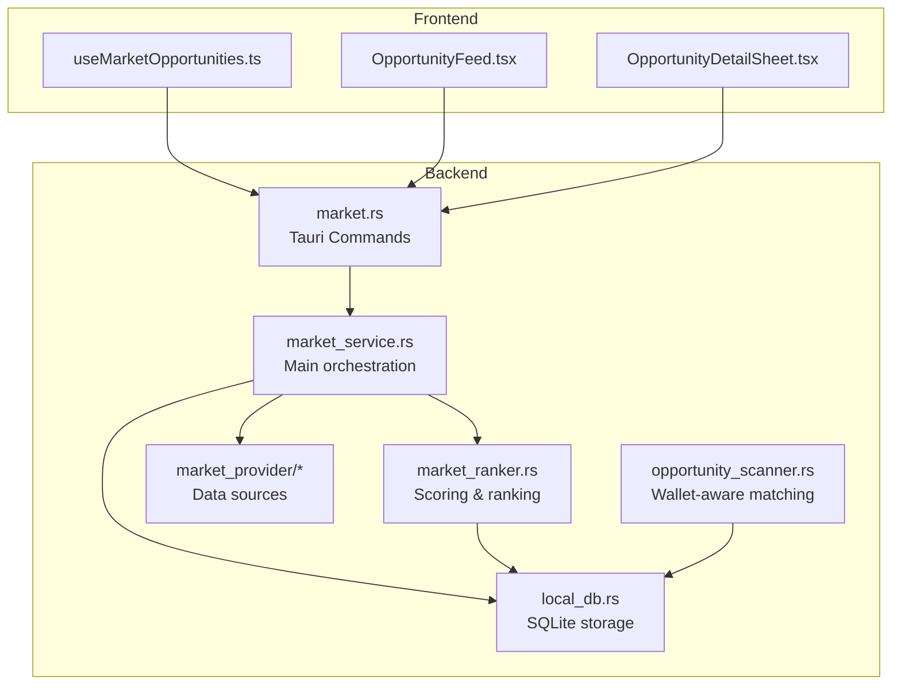
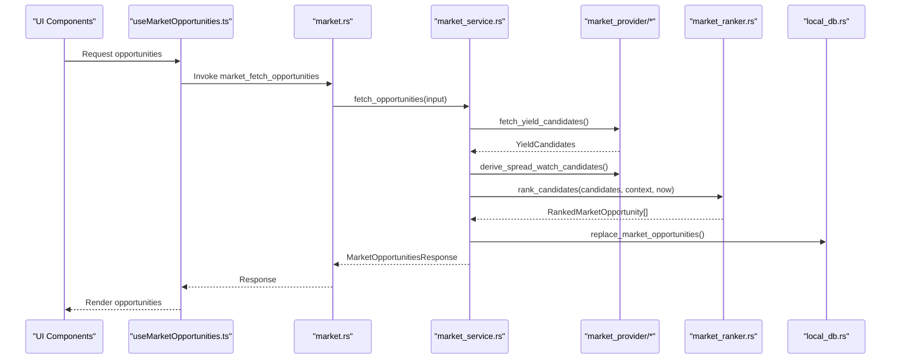
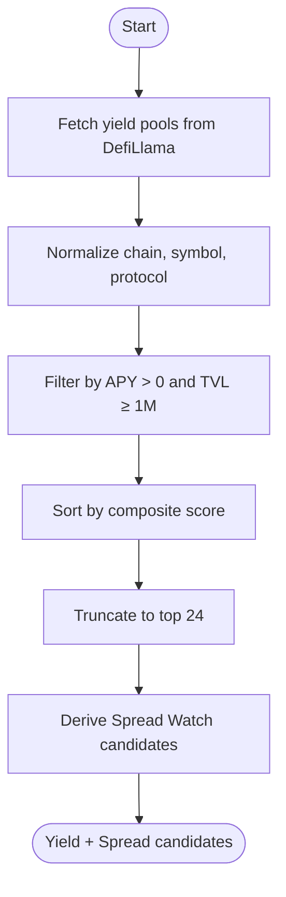
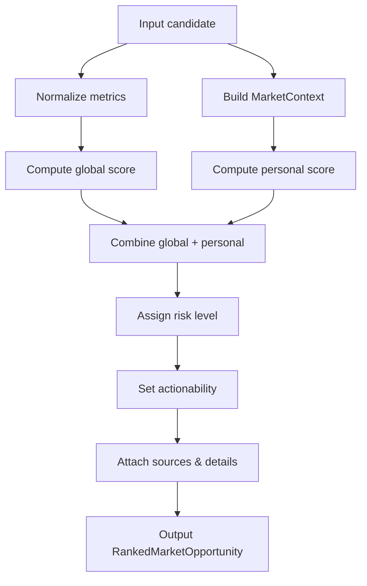
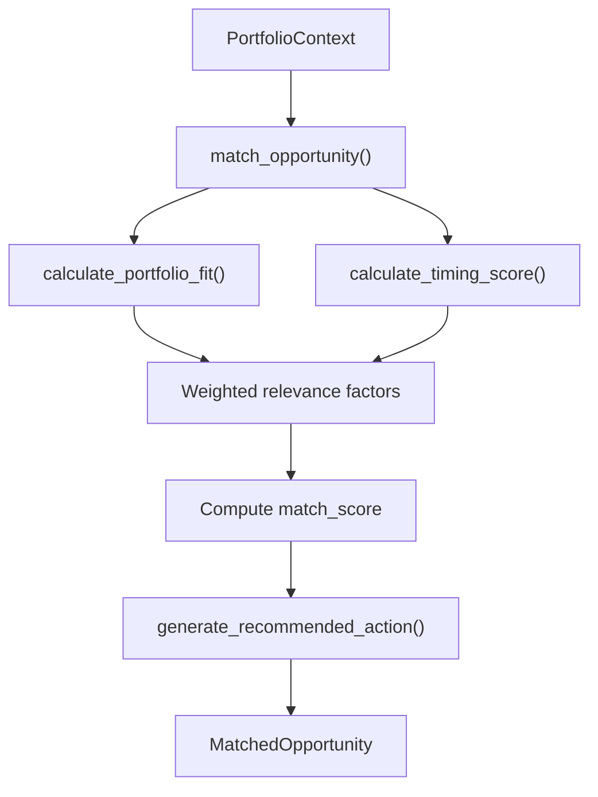
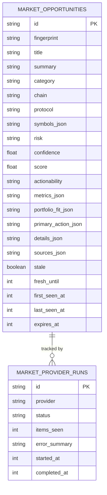
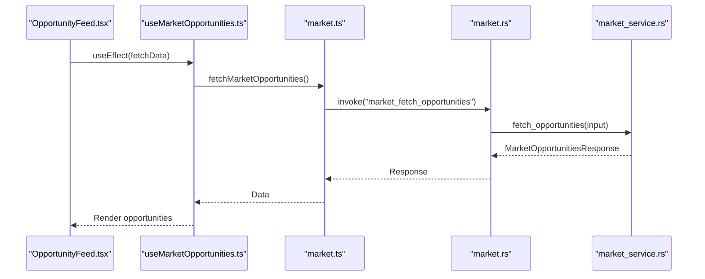
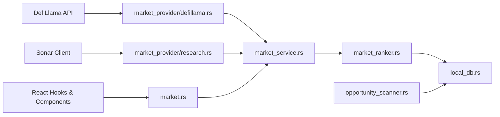

# Opportunity Discovery & Ranking

<cite>
**Referenced Files in This Document**
- [market_service.rs](file://src-tauri/src/services/market_service.rs)
- [market_ranker.rs](file://src-tauri/src/services/market_ranker.rs)
- [market_provider/mod.rs](file://src-tauri/src/services/market_provider/mod.rs)
- [market_provider/defillama.rs](file://src-tauri/src/services/market_provider/defillama.rs)
- [market_provider/research.rs](file://src-tauri/src/services/market_provider/research.rs)
- [opportunity_scanner.rs](file://src-tauri/src/services/opportunity_scanner.rs)
- [local_db.rs](file://src-tauri/src/services/local_db.rs)
- [market.ts](file://src/lib/market.ts)
- [useMarketOpportunities.ts](file://src/hooks/useMarketOpportunities.ts)
- [OpportunityDetailSheet.tsx](file://src/components/market/OpportunityDetailSheet.tsx)
- [OpportunityFeed.tsx](file://src/components/autonomous/OpportunityFeed.tsx)
- [market.rs](file://src-tauri/src/commands/market.rs)
</cite>

## Table of Contents
1. [Introduction](#introduction)
2. [Project Structure](#project-structure)
3. [Core Components](#core-components)
4. [Architecture Overview](#architecture-overview)
5. [Detailed Component Analysis](#detailed-component-analysis)
6. [Dependency Analysis](#dependency-analysis)
7. [Performance Considerations](#performance-considerations)
8. [Troubleshooting Guide](#troubleshooting-guide)
9. [Conclusion](#conclusion)

## Introduction
This document explains SHADOW's opportunity discovery and ranking system for DeFi. It covers how SHADOW identifies opportunities across yield farming, arbitrage-like spread watching, and portfolio rebalancing, and how it ranks them using multi-chain analysis, liquidity pool detection, and wallet-aware personalization. It also documents integration with blockchain data providers, real-time market data processing, caching strategies, filtering mechanisms, and risk assessment models.

## Project Structure
The opportunity system spans frontend hooks, backend services, and persistence:
- Frontend: React hooks and UI components for fetching, displaying, and interacting with opportunities
- Backend: Rust services orchestrating data ingestion, ranking, and caching
- Persistence: SQLite-backed local database for opportunities, provider runs, and matches

**Diagram sources**
- [market.rs:1-36](file://src-tauri/src/commands/market.rs#L1-L36)
- [market_service.rs:1-316](file://src-tauri/src/services/market_service.rs#L1-L316)
- [market_ranker.rs:1-559](file://src-tauri/src/services/market_ranker.rs#L1-L559)
- [market_provider/mod.rs:1-160](file://src-tauri/src/services/market_provider/mod.rs#L1-L160)
- [opportunity_scanner.rs:1-599](file://src-tauri/src/services/opportunity_scanner.rs#L1-L599)
- [local_db.rs:180-220](file://src-tauri/src/services/local_db.rs#L180-L220)

**Section sources**
- [market.rs:1-36](file://src-tauri/src/commands/market.rs#L1-L36)
- [market_service.rs:1-316](file://src-tauri/src/services/market_service.rs#L1-L316)
- [market_ranker.rs:1-559](file://src-tauri/src/services/market_ranker.rs#L1-L559)
- [market_provider/mod.rs:1-160](file://src-tauri/src/services/market_provider/mod.rs#L1-L160)
- [opportunity_scanner.rs:1-599](file://src-tauri/src/services/opportunity_scanner.rs#L1-L599)
- [local_db.rs:180-220](file://src-tauri/src/services/local_db.rs#L180-L220)

## Core Components
- Market data providers: DefiLlama for yield pools, Sonar-based research for catalysts
- Opportunity candidates: Yield, Spread Watch, Rebalance, Catalyst
- Ranking engine: Normalized scores, weighted combinations, freshness, and risk
- Wallet-aware scanner: Portfolio fit, chain distribution, token preferences
- Caching and persistence: SQLite tables for opportunities and provider runs
- Frontend integration: React hooks and UI for fetching, filtering, and detail views

**Section sources**
- [market_provider/defillama.rs:1-151](file://src-tauri/src/services/market_provider/defillama.rs#L1-L151)
- [market_provider/research.rs:1-112](file://src-tauri/src/services/market_provider/research.rs#L1-L112)
- [market_provider/mod.rs:1-160](file://src-tauri/src/services/market_provider/mod.rs#L1-L160)
- [market_ranker.rs:1-559](file://src-tauri/src/services/market_ranker.rs#L1-L559)
- [opportunity_scanner.rs:1-599](file://src-tauri/src/services/opportunity_scanner.rs#L1-L599)
- [local_db.rs:180-220](file://src-tauri/src/services/local_db.rs#L180-L220)

## Architecture Overview
SHADOW’s opportunity pipeline:
1. Data ingestion: Fetch yield pools from DefiLlama and research catalysts from Sonar
2. Candidate generation: Build Yield, Spread Watch, Rebalance, and Catalyst candidates
3. Ranking: Score candidates globally and personalize per wallet context
4. Caching: Persist ranked opportunities and provider runs to SQLite
5. Frontend: Query and render opportunities with filters and detail views

**Diagram sources**
- [market.rs:8-21](file://src-tauri/src/commands/market.rs#L8-L21)
- [market_service.rs:292-316](file://src-tauri/src/services/market_service.rs#L292-L316)
- [market_provider/defillama.rs:27-116](file://src-tauri/src/services/market_provider/defillama.rs#L27-L116)
- [market_provider/mod.rs:84-143](file://src-tauri/src/services/market_provider/mod.rs#L84-L143)
- [market_ranker.rs:17-35](file://src-tauri/src/services/market_ranker.rs#L17-L35)
- [local_db.rs:1274-1308](file://src-tauri/src/services/local_db.rs#L1274-L1308)

## Detailed Component Analysis

### Data Providers and Candidates
- DefiLlama integration: Fetches yield pools, normalizes chains, symbols, and protocols, filters by APY and TVL thresholds, sorts, and truncates
- Research integration: Sonar client queries for catalyst opportunities with confidence and chain normalization
- Candidate derivation: Spread Watch candidates derived from Yield candidates by grouping by symbol and computing APY spread

**Diagram sources**
- [market_provider/defillama.rs:27-116](file://src-tauri/src/services/market_provider/defillama.rs#L27-L116)
- [market_provider/mod.rs:84-143](file://src-tauri/src/services/market_provider/mod.rs#L84-L143)

**Section sources**
- [market_provider/defillama.rs:1-151](file://src-tauri/src/services/market_provider/defillama.rs#L1-L151)
- [market_provider/research.rs:1-112](file://src-tauri/src/services/market_provider/research.rs#L1-L112)
- [market_provider/mod.rs:1-160](file://src-tauri/src/services/market_provider/mod.rs#L1-L160)

### Ranking Engine
- Global scoring: Weighted combination of normalized metrics (e.g., APY, TVL, freshness, protocol safety)
- Personal scoring: Based on wallet holdings, chain coverage, and wallet presence
- Risk assessment: Low/medium/high risk derived from stability, APY thresholds, and TVL
- Freshness: Scores degrade as expiration approaches
- Actionability: Agent-ready, approval-ready, research-only, or detail-only

**Diagram sources**
- [market_ranker.rs:50-187](file://src-tauri/src/services/market_ranker.rs#L50-L187)
- [market_ranker.rs:189-294](file://src-tauri/src/services/market_ranker.rs#L189-L294)
- [market_ranker.rs:296-405](file://src-tauri/src/services/market_ranker.rs#L296-L405)
- [market_ranker.rs:407-493](file://src-tauri/src/services/market_ranker.rs#L407-L493)

**Section sources**
- [market_ranker.rs:1-559](file://src-tauri/src/services/market_ranker.rs#L1-L559)

### Wallet-Aware Matching (Scanner)
- Portfolio context: Holdings, chain distribution, and total value
- Preference scoring: Chain preferences, token preferences, risk tolerance alignment
- Portfolio fit: Checks required tokens, meaningful TVL threshold, and diversification bonus
- Timing score: Urgency based on deadlines and APY
- Recommended action: Human-readable suggestion based on opportunity type

**Diagram sources**
- [opportunity_scanner.rs:334-407](file://src-tauri/src/services/opportunity_scanner.rs#L334-L407)
- [opportunity_scanner.rs:409-468](file://src-tauri/src/services/opportunity_scanner.rs#L409-L468)

**Section sources**
- [opportunity_scanner.rs:1-599](file://src-tauri/src/services/opportunity_scanner.rs#L1-L599)

### Caching and Persistence
- Market opportunities table: Stores ranked opportunities with metrics, portfolio fit, and sources
- Provider runs table: Tracks provider status, timestamps, and errors
- Replacement strategy: Replace entire opportunity set on refresh to maintain freshness
- Indexes: Category+chain, score, last_seen_at for efficient queries

**Diagram sources**
- [local_db.rs:180-220](file://src-tauri/src/services/local_db.rs#L180-L220)
- [local_db.rs:1274-1308](file://src-tauri/src/services/local_db.rs#L1274-L1308)
- [local_db.rs:1417-1451](file://src-tauri/src/services/local_db.rs#L1417-L1451)

**Section sources**
- [local_db.rs:180-220](file://src-tauri/src/services/local_db.rs#L180-L220)
- [local_db.rs:1274-1308](file://src-tauri/src/services/local_db.rs#L1274-L1308)
- [local_db.rs:1417-1451](file://src-tauri/src/services/local_db.rs#L1417-L1451)

### Frontend Integration
- React hooks: Fetch opportunities, refresh, and subscribe to updates
- UI components: Opportunity feed, detail sheet, and category/chain filters
- Tauri commands: Bridge to backend services for fetching, refreshing, and preparing actions

**Diagram sources**
- [OpportunityFeed.tsx:39-72](file://src/components/autonomous/OpportunityFeed.tsx#L39-L72)
- [useMarketOpportunities.ts:27-62](file://src/hooks/useMarketOpportunities.ts#L27-L62)
- [market.ts:16-28](file://src/lib/market.ts#L16-L28)
- [market.rs:8-13](file://src-tauri/src/commands/market.rs#L8-L13)
- [market_service.rs:292-316](file://src-tauri/src/services/market_service.rs#L292-L316)

**Section sources**
- [useMarketOpportunities.ts:1-131](file://src/hooks/useMarketOpportunities.ts#L1-L131)
- [OpportunityDetailSheet.tsx:1-110](file://src/components/market/OpportunityDetailSheet.tsx#L1-L110)
- [OpportunityFeed.tsx:1-72](file://src/components/autonomous/OpportunityFeed.tsx#L1-L72)
- [market.ts:1-135](file://src/lib/market.ts#L1-L135)
- [market.rs:1-36](file://src-tauri/src/commands/market.rs#L1-L36)

## Dependency Analysis
- Data ingestion depends on external APIs (DefiLlama, Sonar) and internal provider modules
- Ranking depends on MarketContext built from wallet addresses and portfolio data
- Persistence depends on SQLite schema and indexes for fast retrieval
- Frontend depends on Tauri commands and React Query for caching and reactivity

**Diagram sources**
- [market_provider/defillama.rs:1-151](file://src-tauri/src/services/market_provider/defillama.rs#L1-L151)
- [market_provider/research.rs:1-112](file://src-tauri/src/services/market_provider/research.rs#L1-L112)
- [market_service.rs:1-316](file://src-tauri/src/services/market_service.rs#L1-L316)
- [market_ranker.rs:1-559](file://src-tauri/src/services/market_ranker.rs#L1-L559)
- [opportunity_scanner.rs:1-599](file://src-tauri/src/services/opportunity_scanner.rs#L1-L599)
- [local_db.rs:180-220](file://src-tauri/src/services/local_db.rs#L180-L220)
- [market.rs:1-36](file://src-tauri/src/commands/market.rs#L1-L36)

**Section sources**
- [market_service.rs:1-316](file://src-tauri/src/services/market_service.rs#L1-L316)
- [market_ranker.rs:1-559](file://src-tauri/src/services/market_ranker.rs#L1-L559)
- [opportunity_scanner.rs:1-599](file://src-tauri/src/services/opportunity_scanner.rs#L1-L599)
- [local_db.rs:180-220](file://src-tauri/src/services/local_db.rs#L180-L220)
- [market.rs:1-36](file://src-tauri/src/commands/market.rs#L1-L36)

## Performance Considerations
- Data freshness: Providers refresh at fixed intervals; cache is considered stale after TTL
- Ranking truncation: Top-N selection reduces downstream rendering cost
- Index usage: Database indexes on category, chain, score, and timestamps optimize queries
- Frontend caching: React Query provides in-memory caching and invalidation on events

[No sources needed since this section provides general guidance]

## Troubleshooting Guide
- Refresh failures: When provider fetch fails, system falls back to cached opportunities and emits a refresh-failed event
- Cache staleness: Freshness checks compare provider run timestamps against configured intervals
- Opportunity detail parsing: Robust JSON parsing with defaults prevents crashes on malformed payloads

**Section sources**
- [market_service.rs:601-624](file://src-tauri/src/services/market_service.rs#L601-L624)
- [market_service.rs:561-593](file://src-tauri/src/services/market_service.rs#L561-L593)
- [market_service.rs:696-702](file://src-tauri/src/services/market_service.rs#L696-L702)

## Conclusion
SHADOW’s opportunity discovery and ranking system combines external market data with internal portfolio context to surface relevant DeFi opportunities. It supports multi-chain analysis, liquidity pool detection, and wallet-aware personalization while maintaining robust caching and risk-aware scoring. The modular architecture enables extensibility for additional chains, protocols, and candidate types.