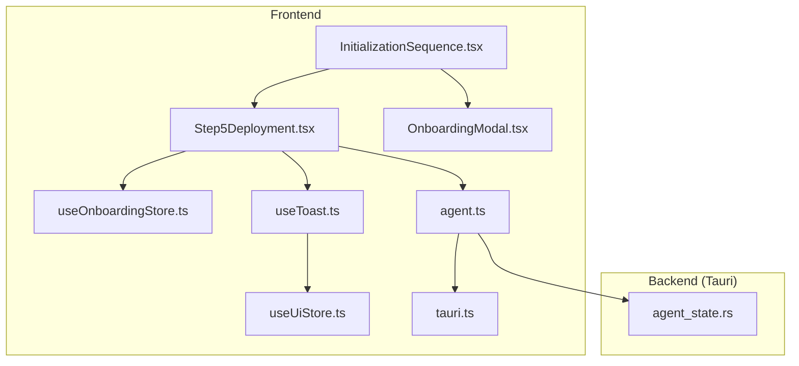
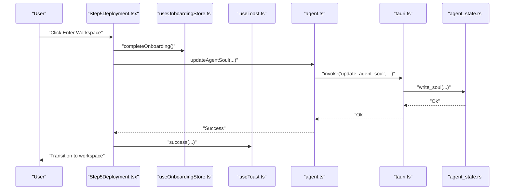
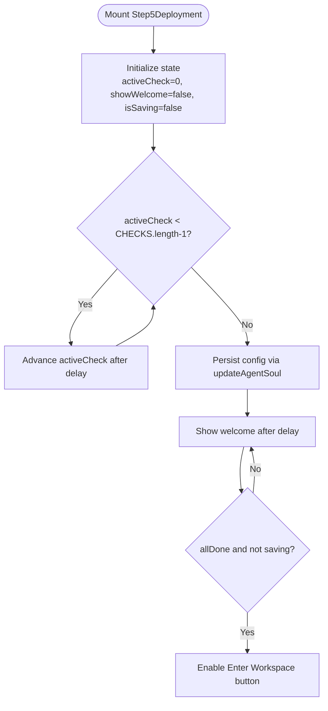
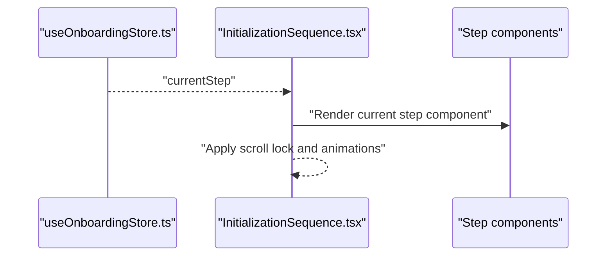
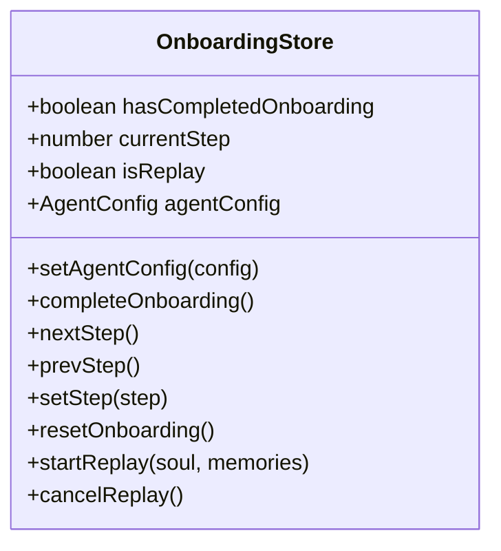
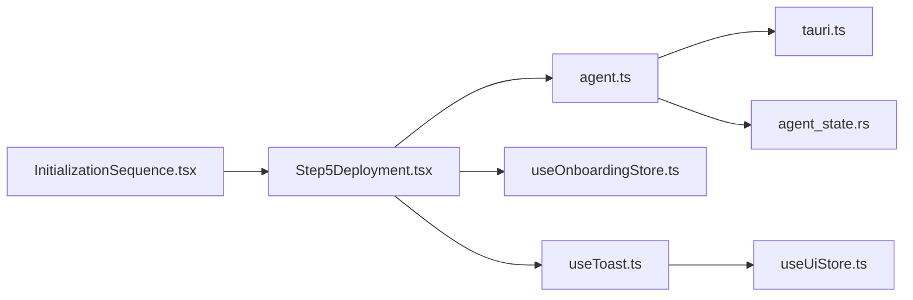

# Deployment & Finalization

<cite>
**Referenced Files in This Document**
- [Step5Deployment.tsx](file://src/components/onboarding/steps/Step5Deployment.tsx)
- [InitializationSequence.tsx](file://src/components/onboarding/InitializationSequence.tsx)
- [OnboardingModal.tsx](file://src/components/layout/OnboardingModal.tsx)
- [useOnboardingStore.ts](file://src/store/useOnboardingStore.ts)
- [useToast.ts](file://src/hooks/useToast.ts)
- [useUiStore.ts](file://src/store/useUiStore.ts)
- [agent.ts](file://src/lib/agent.ts)
- [agent_state.rs](file://src-tauri/src/services/agent_state.rs)
- [tauri.ts](file://src/lib/tauri.ts)
</cite>

## Table of Contents
1. [Introduction](#introduction)
2. [Project Structure](#project-structure)
3. [Core Components](#core-components)
4. [Architecture Overview](#architecture-overview)
5. [Detailed Component Analysis](#detailed-component-analysis)
6. [Dependency Analysis](#dependency-analysis)
7. [Performance Considerations](#performance-considerations)
8. [Troubleshooting Guide](#troubleshooting-guide)
9. [Conclusion](#conclusion)

## Introduction
This document covers the Deployment and Finalization phase of the onboarding process. It explains the system deployment workflow, final configuration activation, and completion verification. It documents the deployment interface design, progress tracking mechanisms, and success confirmation systems. It also details the deployment pipeline, service initialization, and system readiness checks, along with the user experience during finalization, including loading states, progress indicators, and completion messaging. The technical implementation of service activation, dependency resolution, and environment preparation is covered, alongside the modal presentation system, error handling during deployment, and rollback mechanisms. Finally, it describes the transition from onboarding to full system operation, including user notification systems and post-deployment guidance, with troubleshooting tips for monitoring deployment status and handling edge cases.

## Project Structure
The Deployment and Finalization phase is implemented as part of the onboarding sequence. The UI components are React-based and orchestrated by a Zustand store. Backend persistence and agent state management are handled by Tauri services and commands.

**Diagram sources**
- [InitializationSequence.tsx:11-114](file://src/components/onboarding/InitializationSequence.tsx#L11-L114)
- [Step5Deployment.tsx:19-186](file://src/components/onboarding/steps/Step5Deployment.tsx#L19-L186)
- [OnboardingModal.tsx:18-70](file://src/components/layout/OnboardingModal.tsx#L18-L70)
- [useOnboardingStore.ts:54-105](file://src/store/useOnboardingStore.ts#L54-L105)
- [useToast.ts:3-32](file://src/hooks/useToast.ts#L3-L32)
- [useUiStore.ts:87-159](file://src/store/useUiStore.ts#L87-L159)
- [agent.ts:1-86](file://src/lib/agent.ts#L1-L86)
- [tauri.ts:1-4](file://src/lib/tauri.ts#L1-L4)
- [agent_state.rs:1-104](file://src-tauri/src/services/agent_state.rs#L1-L104)

**Section sources**
- [InitializationSequence.tsx:11-114](file://src/components/onboarding/InitializationSequence.tsx#L11-L114)
- [Step5Deployment.tsx:19-186](file://src/components/onboarding/steps/Step5Deployment.tsx#L19-L186)
- [OnboardingModal.tsx:18-70](file://src/components/layout/OnboardingModal.tsx#L18-L70)
- [useOnboardingStore.ts:54-105](file://src/store/useOnboardingStore.ts#L54-L105)
- [useToast.ts:3-32](file://src/hooks/useToast.ts#L3-L32)
- [useUiStore.ts:87-159](file://src/store/useUiStore.ts#L87-L159)
- [agent.ts:1-86](file://src/lib/agent.ts#L1-L86)
- [tauri.ts:1-4](file://src/lib/tauri.ts#L1-L4)
- [agent_state.rs:1-104](file://src-tauri/src/services/agent_state.rs#L1-L104)

## Core Components
- Step5Deployment: Implements the finalization UI, progress tracking, and completion flow.
- InitializationSequence: Orchestrates the onboarding steps and renders the current step.
- OnboardingModal: Provides a welcome modal shown before entering the workspace.
- useOnboardingStore: Centralized state for onboarding steps, replay mode, and agent configuration.
- useToast/useUiStore: Notification system for success and warning messages.
- agent.ts: Frontend Tauri command bindings for agent-related operations.
- agent_state.rs: Backend persistence for agent soul and memory.

**Section sources**
- [Step5Deployment.tsx:19-186](file://src/components/onboarding/steps/Step5Deployment.tsx#L19-L186)
- [InitializationSequence.tsx:11-114](file://src/components/onboarding/InitializationSequence.tsx#L11-L114)
- [OnboardingModal.tsx:18-70](file://src/components/layout/OnboardingModal.tsx#L18-L70)
- [useOnboardingStore.ts:54-105](file://src/store/useOnboardingStore.ts#L54-L105)
- [useToast.ts:3-32](file://src/hooks/useToast.ts#L3-L32)
- [useUiStore.ts:87-159](file://src/store/useUiStore.ts#L87-L159)
- [agent.ts:1-86](file://src/lib/agent.ts#L1-L86)
- [agent_state.rs:1-104](file://src-tauri/src/services/agent_state.rs#L1-L104)

## Architecture Overview
The finalization flow is a client-driven sequence that persists agent configuration and signals readiness. The backend stores agent soul and memory in the application data directory. Notifications are surfaced via a global UI store.

**Diagram sources**
- [Step5Deployment.tsx:34-50](file://src/components/onboarding/steps/Step5Deployment.tsx#L34-L50)
- [useOnboardingStore.ts:65-65](file://src/store/useOnboardingStore.ts#L65-L65)
- [agent.ts:71-73](file://src/lib/agent.ts#L71-L73)
- [tauri.ts:1-4](file://src/lib/tauri.ts#L1-L4)
- [agent_state.rs:56-60](file://src-tauri/src/services/agent_state.rs#L56-L60)

## Detailed Component Analysis

### Step5Deployment: Finalization UI and Progress Tracking
- Purpose: Render the deployment progress, animate completion, and finalize onboarding.
- Progress tracking: Uses a fixed checklist with animated transitions between states.
- Completion flow: Persists agent configuration, shows a welcome message, and enables the Enter Workspace button.
- Persistence: Calls updateAgentSoul with collected agent configuration and displays success/warning notifications.

**Diagram sources**
- [Step5Deployment.tsx:27-66](file://src/components/onboarding/steps/Step5Deployment.tsx#L27-L66)

**Section sources**
- [Step5Deployment.tsx:19-186](file://src/components/onboarding/steps/Step5Deployment.tsx#L19-L186)

### InitializationSequence: Onboarding Orchestration
- Purpose: Renders the current onboarding step and manages global scroll behavior.
- Steps: Maps currentStep to Step0Welcome, StepQuickSetup, Step5MemorySeeds, Step6Vault, Step7Deployment.
- Progress indicators: Shows step dots and replay indicator when in replay mode.
- Animation: Uses Framer Motion for smooth transitions between steps.

**Diagram sources**
- [InitializationSequence.tsx:11-114](file://src/components/onboarding/InitializationSequence.tsx#L11-L114)

**Section sources**
- [InitializationSequence.tsx:11-114](file://src/components/onboarding/InitializationSequence.tsx#L11-L114)

### OnboardingModal: Pre-Workspace Welcome
- Purpose: Displays a welcome modal with feature highlights before entering the workspace.
- Interaction: Triggers onComplete to proceed to the workspace.

**Section sources**
- [OnboardingModal.tsx:18-70](file://src/components/layout/OnboardingModal.tsx#L18-L70)

### useOnboardingStore: State Management for Onboarding
- Purpose: Manages onboarding lifecycle, current step, replay mode, and agent configuration.
- Replay mode: Allows updating existing agent soul and memories.
- Completion: Resets onboarding state and clears temporary data.

**Diagram sources**
- [useOnboardingStore.ts:19-100](file://src/store/useOnboardingStore.ts#L19-L100)

**Section sources**
- [useOnboardingStore.ts:54-105](file://src/store/useOnboardingStore.ts#L54-L105)

### useToast and useUiStore: Notification System
- Purpose: Provide a unified notification system for success, info, and warning messages.
- Integration: Used to inform users about save success or failure during finalization.

**Section sources**
- [useToast.ts:3-32](file://src/hooks/useToast.ts#L3-L32)
- [useUiStore.ts:87-159](file://src/store/useUiStore.ts#L87-L159)

### agent.ts: Tauri Command Bindings
- Purpose: Exposes frontend functions to invoke backend commands for agent operations.
- updateAgentSoul: Persists agent configuration to the backend.

**Section sources**
- [agent.ts:71-73](file://src/lib/agent.ts#L71-L73)

### agent_state.rs: Backend Persistence
- Purpose: Reads/writes agent soul and memory to the application data directory.
- Data model: Defines AgentSoul and AgentMemory structures and file paths.

**Section sources**
- [agent_state.rs:6-104](file://src-tauri/src/services/agent_state.rs#L6-L104)

## Dependency Analysis
- Frontend-to-Backend: Step5Deployment depends on agent.ts for invoking update_agent_soul, which is handled by agent_state.rs.
- State orchestration: InitializationSequence coordinates step rendering and progress indicators.
- Notifications: useToast delegates to useUiStore for persistent notifications.
- Runtime detection: tauri.ts determines whether the Tauri runtime is available.

**Diagram sources**
- [Step5Deployment.tsx:34-50](file://src/components/onboarding/steps/Step5Deployment.tsx#L34-L50)
- [InitializationSequence.tsx:37-52](file://src/components/onboarding/InitializationSequence.tsx#L37-L52)
- [agent.ts:71-73](file://src/lib/agent.ts#L71-L73)
- [tauri.ts:1-4](file://src/lib/tauri.ts#L1-L4)
- [agent_state.rs:56-60](file://src-tauri/src/services/agent_state.rs#L56-L60)
- [useOnboardingStore.ts:65-65](file://src/store/useOnboardingStore.ts#L65-L65)
- [useToast.ts:7-14](file://src/hooks/useToast.ts#L7-L14)
- [useUiStore.ts:112-122](file://src/store/useUiStore.ts#L112-L122)

**Section sources**
- [Step5Deployment.tsx:34-50](file://src/components/onboarding/steps/Step5Deployment.tsx#L34-L50)
- [InitializationSequence.tsx:37-52](file://src/components/onboarding/InitializationSequence.tsx#L37-L52)
- [agent.ts:71-73](file://src/lib/agent.ts#L71-L73)
- [tauri.ts:1-4](file://src/lib/tauri.ts#L1-L4)
- [agent_state.rs:56-60](file://src-tauri/src/services/agent_state.rs#L56-L60)
- [useOnboardingStore.ts:65-65](file://src/store/useOnboardingStore.ts#L65-L65)
- [useToast.ts:7-14](file://src/hooks/useToast.ts#L7-L14)
- [useUiStore.ts:112-122](file://src/store/useUiStore.ts#L112-L122)

## Performance Considerations
- Animation timing: The progress animation uses short delays to maintain responsiveness while providing visual feedback.
- State updates: Minimal re-renders by batching state changes and using stable callbacks.
- Persistence: Single backend write per finalization to reduce I/O overhead.
- Scroll management: Body scroll locking prevents layout thrashing during modal rendering.

## Troubleshooting Guide
- Save failure during finalization:
  - Symptom: Warning toast appears after attempting to save agent configuration.
  - Cause: Backend write failure or runtime mismatch.
  - Resolution: Retry saving; if persistent, verify Tauri runtime availability and application data directory permissions.
- No wallet connected:
  - Symptom: A notice indicates no wallet is connected.
  - Resolution: Connect a wallet in Settings before finalizing.
- Stuck on finalization:
  - Symptom: Enter Workspace button remains disabled.
  - Cause: Active saving state or incomplete progress animation.
  - Resolution: Allow the animation to complete; if stuck, refresh the page and retry.
- Replay mode not applying changes:
  - Symptom: Configuration does not update when exiting replay mode.
  - Resolution: Cancel replay to reset state, then finalize again.
- Notifications not appearing:
  - Symptom: Success or warning messages are not visible.
  - Resolution: Check notification store state and UI visibility; ensure the notification panel is accessible.

**Section sources**
- [Step5Deployment.tsx:44-47](file://src/components/onboarding/steps/Step5Deployment.tsx#L44-L47)
- [useToast.ts:23-30](file://src/hooks/useToast.ts#L23-L30)
- [useUiStore.ts:112-122](file://src/store/useUiStore.ts#L112-L122)
- [useOnboardingStore.ts:93-99](file://src/store/useOnboardingStore.ts#L93-L99)

## Conclusion
The Deployment and Finalization phase integrates a polished UI with robust backend persistence to complete onboarding. The frontend orchestrates progress tracking and completion, while the backend securely stores agent configuration. Notifications provide timely feedback, and replay mode supports iterative configuration updates. Together, these components deliver a seamless transition from onboarding to full system operation, with clear user guidance and reliable error handling.