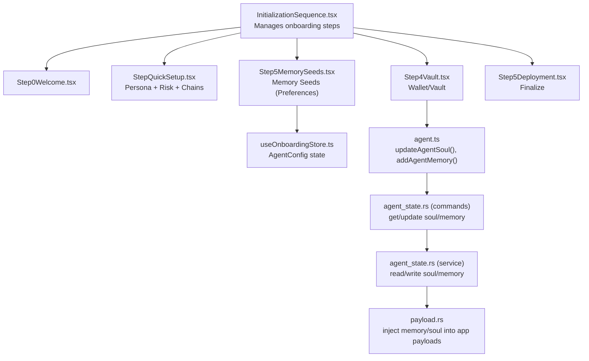
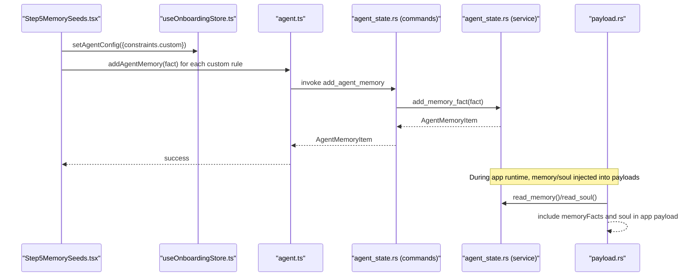
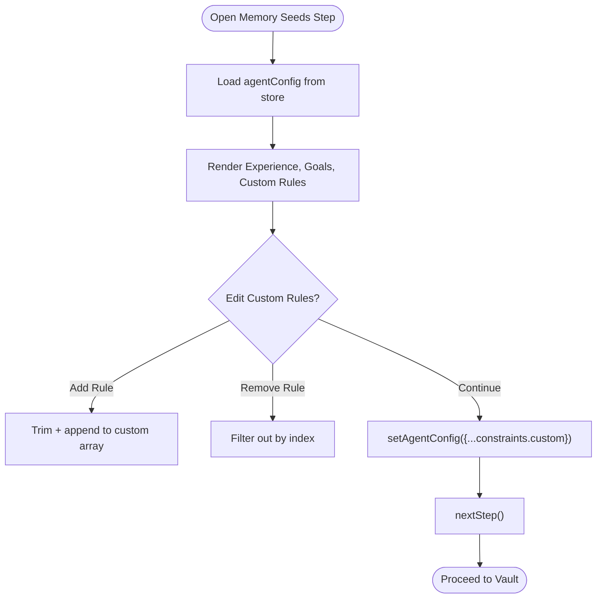
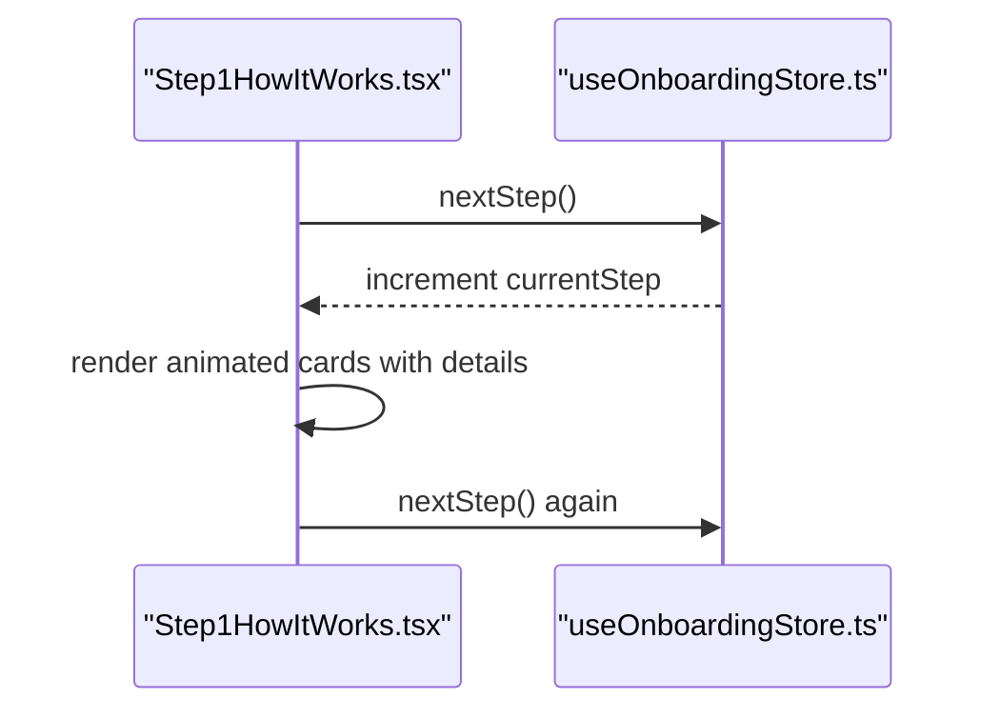
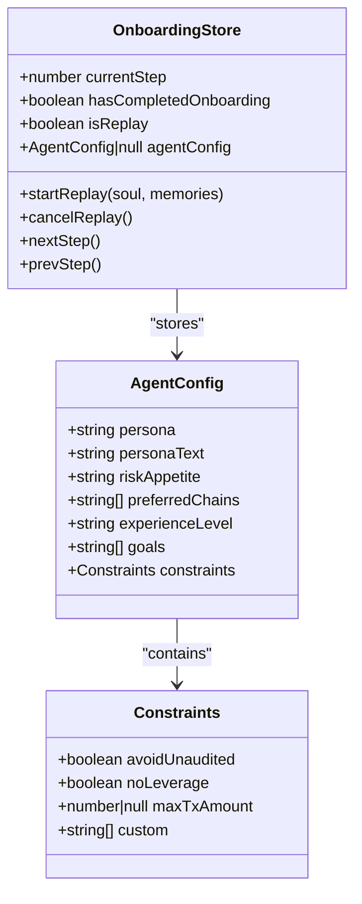
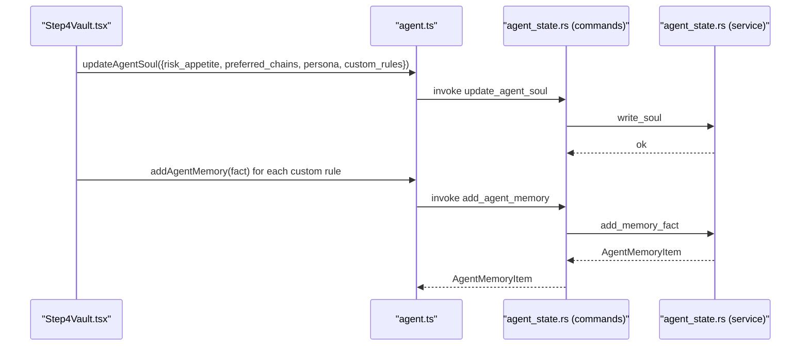
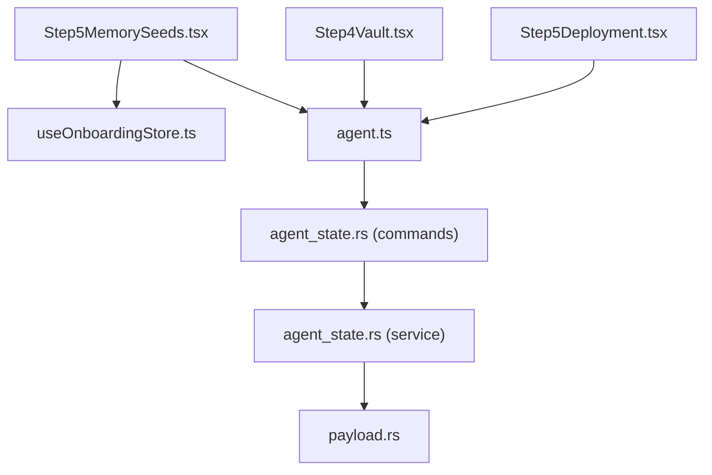

# Memory Seeds Configuration

<cite>
**Referenced Files in This Document**
- [Step5MemorySeeds.tsx](file://src/components/onboarding/steps/Step5MemorySeeds.tsx)
- [Step1HowItWorks.tsx](file://src/components/onboarding/steps/Step1HowItWorks.tsx)
- [Step2Architecture.tsx](file://src/components/onboarding/steps/Step2Architecture.tsx)
- [InitializationSequence.tsx](file://src/components/onboarding/InitializationSequence.tsx)
- [useOnboardingStore.ts](file://src/store/useOnboardingStore.ts)
- [personaArchetypes.ts](file://src/constants/personaArchetypes.ts)
- [StepQuickSetup.tsx](file://src/components/onboarding/steps/StepQuickSetup.tsx)
- [Step4Vault.tsx](file://src/components/onboarding/steps/Step4Vault.tsx)
- [Step5Deployment.tsx](file://src/components/onboarding/steps/Step5Deployment.tsx)
- [agent.ts](file://src/lib/agent.ts)
- [agent_state.rs](file://src-tauri/src/commands/agent_state.rs)
- [agent_state.rs](file://src-tauri/src/services/agent_state.rs)
- [payload.rs](file://src-tauri/src/services/apps/payload.rs)
- [agent.ts](file://src/types/agent.ts)
- [README.md](file://README.md)
</cite>

## Table of Contents
1. [Introduction](#introduction)
2. [Project Structure](#project-structure)
3. [Core Components](#core-components)
4. [Architecture Overview](#architecture-overview)
5. [Detailed Component Analysis](#detailed-component-analysis)
6. [Dependency Analysis](#dependency-analysis)
7. [Performance Considerations](#performance-considerations)
8. [Troubleshooting Guide](#troubleshooting-guide)
9. [Conclusion](#conclusion)

## Introduction
This document explains the Memory Seeds configuration process and foundational understanding components in SHADOW Protocol. It covers:
- What Memory Seeds are: contextual knowledge inputs that shape agent behavior
- How It Works: educational component explaining system fundamentals
- Architecture overview: technical foundations and data persistence
- Implementation of seed selection interfaces and educational content delivery
- Integration with the broader onboarding narrative
- How memory seeds influence AI behavior and guardrails
- Technical implementation of educational content rendering, seed validation, and transition mechanics to security-focused steps

## Project Structure
The Memory Seeds configuration is part of a progressive onboarding sequence that introduces users to SHADOW’s privacy-first, local-first design. The onboarding flow is rendered by a dedicated initialization component that manages step transitions and state persistence.

**Diagram sources**
- [InitializationSequence.tsx:37-52](file://src/components/onboarding/InitializationSequence.tsx#L37-L52)
- [Step5MemorySeeds.tsx:8-73](file://src/components/onboarding/steps/Step5MemorySeeds.tsx#L8-L73)
- [useOnboardingStore.ts:54-105](file://src/store/useOnboardingStore.ts#L54-L105)
- [agent.ts:71-85](file://src/lib/agent.ts#L71-L85)
- [agent_state.rs:9-38](file://src-tauri/src/commands/agent_state.rs#L9-L38)
- [agent_state.rs:46-103](file://src-tauri/src/services/agent_state.rs#L46-L103)
- [payload.rs:26-65](file://src-tauri/src/services/apps/payload.rs#L26-L65)

**Section sources**
- [InitializationSequence.tsx:37-52](file://src/components/onboarding/InitializationSequence.tsx#L37-L52)
- [README.md:135-171](file://README.md#L135-L171)

## Core Components
- Memory Seeds UI: Collects optional preferences and custom rules that become agent memory
- Educational UI: Explains “How It Works” and “Architecture” using animated, progressive disclosure
- Onboarding Store: Centralized state for agent configuration and step progression
- Agent Persistence Layer: Writes soul and memory to local JSON files and injects them into app payloads

Key responsibilities:
- Seed selection interfaces capture experience level, goals, and custom rules
- Educational content uses animations and interactive cards to build comprehension
- Memory seeds are persisted as agent memory and later injected into runtime payloads

**Section sources**
- [Step5MemorySeeds.tsx:8-73](file://src/components/onboarding/steps/Step5MemorySeeds.tsx#L8-L73)
- [Step1HowItWorks.tsx:54-136](file://src/components/onboarding/steps/Step1HowItWorks.tsx#L54-L136)
- [Step2Architecture.tsx:48-104](file://src/components/onboarding/steps/Step2Architecture.tsx#L48-L104)
- [useOnboardingStore.ts:4-52](file://src/store/useOnboardingStore.ts#L4-L52)

## Architecture Overview
SHADOW’s Memory Seeds configuration integrates UI, state management, and backend persistence:

**Diagram sources**
- [Step5MemorySeeds.tsx:45-73](file://src/components/onboarding/steps/Step5MemorySeeds.tsx#L45-L73)
- [agent.ts:79-85](file://src/lib/agent.ts#L79-L85)
- [agent_state.rs:21-31](file://src-tauri/src/commands/agent_state.rs#L21-L31)
- [agent_state.rs:78-96](file://src-tauri/src/services/agent_state.rs#L78-L96)
- [payload.rs:26-65](file://src-tauri/src/services/apps/payload.rs#L26-L65)

## Detailed Component Analysis

### Memory Seeds UI: Step5MemorySeeds
Purpose:
- Capture optional preferences that inform agent behavior without forcing mandatory choices
- Allow users to add custom rules that become persistent memory facts

Key behaviors:
- Experience level selection influences agent tone and caution
- Goals selection communicates intent (e.g., yield, trading)
- Custom rules are additive and editable; each becomes a memory fact

**Diagram sources**
- [Step5MemorySeeds.tsx:15-73](file://src/components/onboarding/steps/Step5MemorySeeds.tsx#L15-L73)

**Section sources**
- [Step5MemorySeeds.tsx:8-204](file://src/components/onboarding/steps/Step5MemorySeeds.tsx#L8-L204)
- [personaArchetypes.ts:152-178](file://src/constants/personaArchetypes.ts#L152-L178)

### Educational Content Delivery: Step1HowItWorks and Step2Architecture
Purpose:
- Build user comprehension through progressive disclosure and interactive cards
- Translate complex technical concepts (privacy, security, multi-chain) into digestible pillars

Implementation highlights:
- Animated cards with hover details reveal extra context
- Spring-based animations and staggered reveals guide attention
- Color-coded categories reinforce mental models

**Diagram sources**
- [Step1HowItWorks.tsx:54-136](file://src/components/onboarding/steps/Step1HowItWorks.tsx#L54-L136)
- [useOnboardingStore.ts:66-67](file://src/store/useOnboardingStore.ts#L66-L67)

**Section sources**
- [Step1HowItWorks.tsx:54-136](file://src/components/onboarding/steps/Step1HowItWorks.tsx#L54-L136)
- [Step2Architecture.tsx:48-104](file://src/components/onboarding/steps/Step2Architecture.tsx#L48-L104)

### Onboarding Store and State Flow
Purpose:
- Define AgentConfig shape and manage onboarding progression
- Support replay mode to update existing configurations

Key structures:
- AgentConfig includes persona, risk appetite, preferred chains, experience level, goals, and constraints (including custom rules)
- Replay mode initializes agentConfig from existing soul and memories

**Diagram sources**
- [useOnboardingStore.ts:4-52](file://src/store/useOnboardingStore.ts#L4-L52)
- [useOnboardingStore.ts:54-105](file://src/store/useOnboardingStore.ts#L54-L105)

**Section sources**
- [useOnboardingStore.ts:4-52](file://src/store/useOnboardingStore.ts#L4-L52)
- [useOnboardingStore.ts:70-99](file://src/store/useOnboardingStore.ts#L70-L99)

### Persistence and Runtime Injection
Purpose:
- Persist agent soul and memory to local files
- Inject memory and soul into app payloads during runtime

Implementation:
- UI invokes lib functions to update soul and add memory
- Tauri commands call service functions to read/write JSON files
- Payload generator includes memoryFacts and soul when requested

**Diagram sources**
- [Step4Vault.tsx:79-99](file://src/components/onboarding/steps/Step4Vault.tsx#L79-L99)
- [agent.ts:71-85](file://src/lib/agent.ts#L71-L85)
- [agent_state.rs:14-19](file://src-tauri/src/commands/agent_state.rs#L14-L19)
- [agent_state.rs:27-31](file://src-tauri/src/commands/agent_state.rs#L27-L31)
- [agent_state.rs:56-60](file://src-tauri/src/services/agent_state.rs#L56-L60)
- [agent_state.rs:78-96](file://src-tauri/src/services/agent_state.rs#L78-L96)

**Section sources**
- [Step4Vault.tsx:79-99](file://src/components/onboarding/steps/Step4Vault.tsx#L79-L99)
- [agent.ts:71-85](file://src/lib/agent.ts#L71-L85)
- [agent_state.rs:14-19](file://src-tauri/src/commands/agent_state.rs#L14-L19)
- [agent_state.rs:27-31](file://src-tauri/src/commands/agent_state.rs#L27-L31)
- [agent_state.rs:56-60](file://src-tauri/src/services/agent_state.rs#L56-L60)
- [agent_state.rs:78-96](file://src-tauri/src/services/agent_state.rs#L78-L96)

### Transition Mechanics to Security-Focused Steps
Purpose:
- Move users from preferences to identity and deployment
- Ensure memory seeds are persisted before entering the vault and deployment steps

Flow:
- Memory Seeds → Vault (wallet creation/import) → Deployment (finalization and welcome)

**Diagram sources**
- [Step5MemorySeeds.tsx:45-73](file://src/components/onboarding/steps/Step5MemorySeeds.tsx#L45-L73)
- [Step4Vault.tsx:79-99](file://src/components/onboarding/steps/Step4Vault.tsx#L79-L99)
- [Step5Deployment.tsx:34-50](file://src/components/onboarding/steps/Step5Deployment.tsx#L34-L50)

**Section sources**
- [InitializationSequence.tsx:37-52](file://src/components/onboarding/InitializationSequence.tsx#L37-L52)
- [Step5MemorySeeds.tsx:45-73](file://src/components/onboarding/steps/Step5MemorySeeds.tsx#L45-L73)
- [Step4Vault.tsx:79-99](file://src/components/onboarding/steps/Step4Vault.tsx#L79-L99)
- [Step5Deployment.tsx:34-50](file://src/components/onboarding/steps/Step5Deployment.tsx#L34-L50)

## Dependency Analysis
- UI components depend on the onboarding store for state and navigation
- Memory Seeds UI writes to agent memory via lib functions
- Vault UI persists soul and seeds to backend services
- Payload generator consumes memory and soul for runtime behavior

**Diagram sources**
- [Step5MemorySeeds.tsx:8-73](file://src/components/onboarding/steps/Step5MemorySeeds.tsx#L8-L73)
- [useOnboardingStore.ts:54-105](file://src/store/useOnboardingStore.ts#L54-L105)
- [agent.ts:71-85](file://src/lib/agent.ts#L71-L85)
- [agent_state.rs:9-38](file://src-tauri/src/commands/agent_state.rs#L9-L38)
- [agent_state.rs:46-103](file://src-tauri/src/services/agent_state.rs#L46-L103)
- [payload.rs:26-65](file://src-tauri/src/services/apps/payload.rs#L26-L65)
- [Step4Vault.tsx:79-99](file://src/components/onboarding/steps/Step4Vault.tsx#L79-L99)
- [Step5Deployment.tsx:34-50](file://src/components/onboarding/steps/Step5Deployment.tsx#L34-L50)

**Section sources**
- [README.md:135-171](file://README.md#L135-L171)

## Performance Considerations
- Minimize re-renders by consolidating state updates in the onboarding store
- Batch memory additions during vault sealing to reduce filesystem writes
- Use animations judiciously; keep transitions smooth but lightweight
- Persist memory and soul only on user confirmation to avoid premature writes

## Troubleshooting Guide
Common issues and resolutions:
- Memory not persisting: Verify that addAgentMemory returns successfully and that the service write completes
- Soul not updating: Confirm updateAgentSoul is called with the full AgentSoul structure
- Missing memory in runtime: Ensure payload.rs reads memory and includes memoryFacts when requested
- Replay mode not applying memories: Check that startReplay populates agentConfig.constraints.custom

**Section sources**
- [agent.ts:79-85](file://src/lib/agent.ts#L79-L85)
- [agent_state.rs:27-31](file://src-tauri/src/commands/agent_state.rs#L27-L31)
- [agent_state.rs:78-96](file://src-tauri/src/services/agent_state.rs#L78-L96)
- [payload.rs:26-65](file://src-tauri/src/services/apps/payload.rs#L26-L65)
- [useOnboardingStore.ts:70-99](file://src/store/useOnboardingStore.ts#L70-L99)

## Conclusion
Memory Seeds configuration is a pivotal step in SHADOW’s onboarding that transforms user preferences into persistent agent memory. By combining intuitive UI patterns, progressive disclosure, and robust local persistence, the system builds user comprehension while laying the groundwork for secure, personalized DeFi operations. The subsequent Vault and Deployment steps ensure that these seeds are integrated into the agent’s runtime behavior, reinforcing the privacy-first, local-first design principles that define SHADOW Protocol.