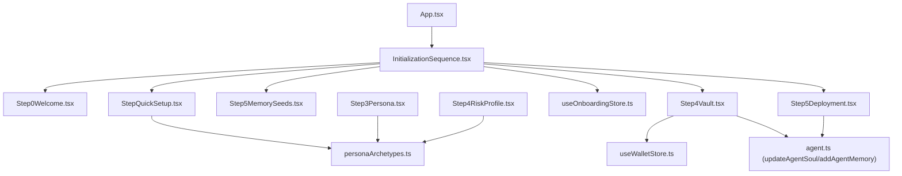
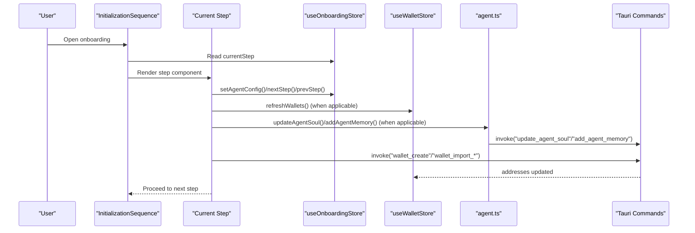
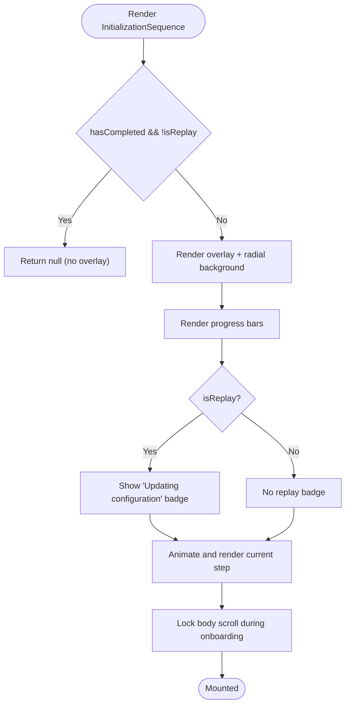
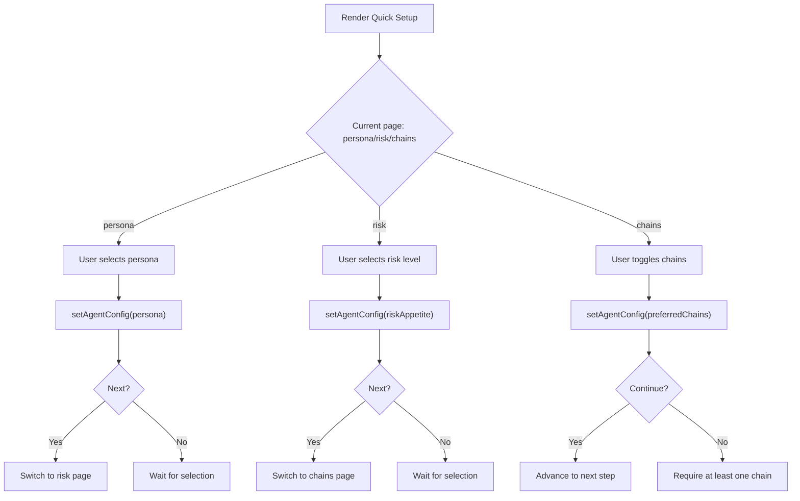
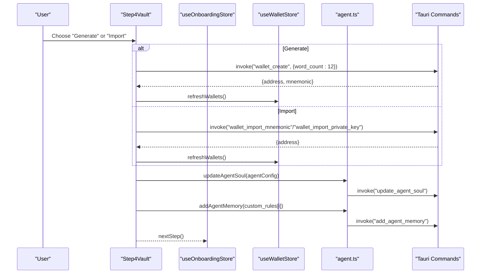
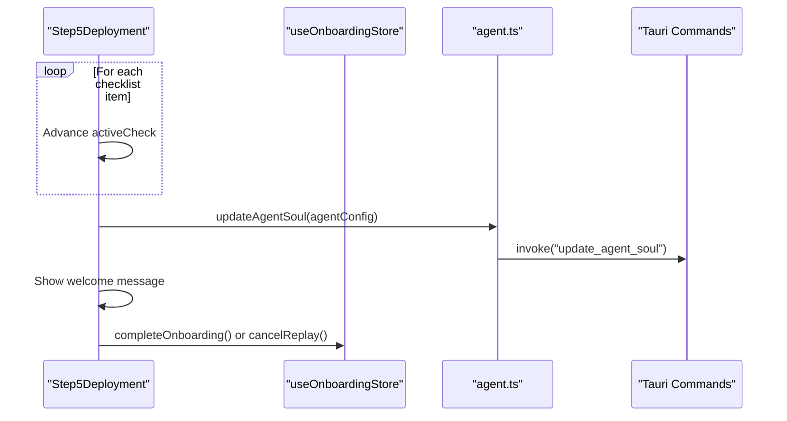
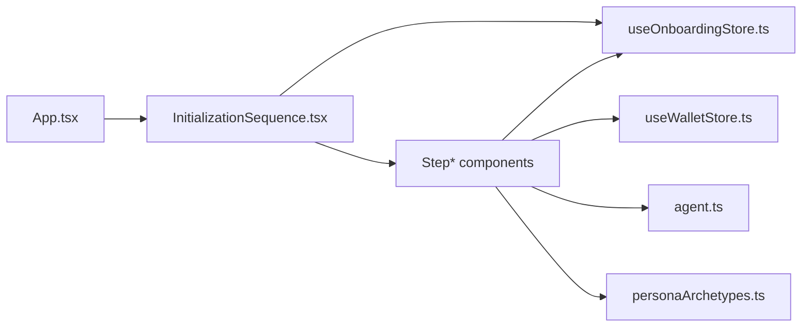

# Onboarding & User Setup

<cite>
**Referenced Files in This Document**
- [InitializationSequence.tsx](file://src/components/onboarding/InitializationSequence.tsx)
- [useOnboardingStore.ts](file://src/store/useOnboardingStore.ts)
- [OnboardingModal.tsx](file://src/components/layout/OnboardingModal.tsx)
- [Step0Welcome.tsx](file://src/components/onboarding/steps/Step0Welcome.tsx)
- [StepQuickSetup.tsx](file://src/components/onboarding/steps/StepQuickSetup.tsx)
- [Step3Persona.tsx](file://src/components/onboarding/steps/Step3Persona.tsx)
- [Step4RiskProfile.tsx](file://src/components/onboarding/steps/Step4RiskProfile.tsx)
- [Step5MemorySeeds.tsx](file://src/components/onboarding/steps/Step5MemorySeeds.tsx)
- [Step4Vault.tsx](file://src/components/onboarding/steps/Step4Vault.tsx)
- [Step5Deployment.tsx](file://src/components/onboarding/steps/Step5Deployment.tsx)
- [personaArchetypes.ts](file://src/constants/personaArchetypes.ts)
- [useWalletStore.ts](file://src/store/useWalletStore.ts)
- [agent.ts](file://src/lib/agent.ts)
- [App.tsx](file://src/App.tsx)
</cite>

## Table of Contents
1. [Introduction](#introduction)
2. [Project Structure](#project-structure)
3. [Core Components](#core-components)
4. [Architecture Overview](#architecture-overview)
5. [Detailed Component Analysis](#detailed-component-analysis)
6. [Dependency Analysis](#dependency-analysis)
7. [Performance Considerations](#performance-considerations)
8. [Troubleshooting Guide](#troubleshooting-guide)
9. [Conclusion](#conclusion)

## Introduction
This document explains the Eclipse initialization sequence and user setup process in the application. It covers the immersive onboarding flow from Step0Welcome through the complete setup journey, including Quick Setup, Vault creation and security configuration, Uplink establishment, and final Deployment. It also documents persona selection, risk profile assessment, and memory seeds configuration. The technical implementation is described with UI components, state management, and backend integration, and includes guidance for common setup issues, error handling, and recovery procedures.

## Project Structure
The onboarding system is implemented as a modal-driven wizard rendered over the main application. The InitializationSequence orchestrates step rendering and manages the overlay, while stores manage state for onboarding progress and user configuration. Steps collect persona, risk, chains, preferences, and vault details. Backend integration is handled via Tauri commands for wallet operations and agent configuration.

**Diagram sources**
- [App.tsx:1-49](file://src/App.tsx#L1-L49)
- [InitializationSequence.tsx:1-115](file://src/components/onboarding/InitializationSequence.tsx#L1-L115)
- [Step0Welcome.tsx:1-54](file://src/components/onboarding/steps/Step0Welcome.tsx#L1-L54)
- [StepQuickSetup.tsx:1-261](file://src/components/onboarding/steps/StepQuickSetup.tsx#L1-L261)
- [Step3Persona.tsx:1-205](file://src/components/onboarding/steps/Step3Persona.tsx#L1-L205)
- [Step4RiskProfile.tsx:1-209](file://src/components/onboarding/steps/Step4RiskProfile.tsx#L1-L209)
- [Step5MemorySeeds.tsx:1-204](file://src/components/onboarding/steps/Step5MemorySeeds.tsx#L1-L204)
- [Step4Vault.tsx:1-330](file://src/components/onboarding/steps/Step4Vault.tsx#L1-L330)
- [Step5Deployment.tsx:1-187](file://src/components/onboarding/steps/Step5Deployment.tsx#L1-L187)
- [useOnboardingStore.ts:1-106](file://src/store/useOnboardingStore.ts#L1-L106)
- [useWalletStore.ts:1-48](file://src/store/useWalletStore.ts#L1-L48)
- [agent.ts:1-86](file://src/lib/agent.ts#L1-L86)
- [personaArchetypes.ts:1-192](file://src/constants/personaArchetypes.ts#L1-L192)

**Section sources**
- [InitializationSequence.tsx:1-115](file://src/components/onboarding/InitializationSequence.tsx#L1-L115)
- [useOnboardingStore.ts:1-106](file://src/store/useOnboardingStore.ts#L1-L106)
- [App.tsx:1-49](file://src/App.tsx#L1-L49)

## Core Components
- InitializationSequence: Renders the onboarding overlay, controls step progression, and applies visual effects and progress indicators. It hides page scrolling while onboarding is active and supports replay mode.
- OnboardingStore: Persistent Zustand store managing onboarding state, current step, replay mode, and agent configuration. Provides actions to navigate steps, persist configuration, and reset onboarding.
- Step components: Modular UI steps collecting user preferences and performing backend operations (wallet creation/import, agent soul/memory updates).
- WalletStore: Manages wallet addresses and active wallet, refreshing from backend via Tauri commands.
- Agent integration: Utility functions to update agent soul and add/remove agent memories via Tauri commands.

**Section sources**
- [InitializationSequence.tsx:11-115](file://src/components/onboarding/InitializationSequence.tsx#L11-L115)
- [useOnboardingStore.ts:19-105](file://src/store/useOnboardingStore.ts#L19-L105)
- [useWalletStore.ts:16-47](file://src/store/useWalletStore.ts#L16-L47)
- [agent.ts:67-85](file://src/lib/agent.ts#L67-L85)

## Architecture Overview
The onboarding flow is a finite-state wizard driven by a single store. Each step renders a specific UI and collects configuration. Backend operations are invoked through Tauri commands for wallet management and agent configuration persistence.

**Diagram sources**
- [InitializationSequence.tsx:37-52](file://src/components/onboarding/InitializationSequence.tsx#L37-L52)
- [useOnboardingStore.ts:34-68](file://src/store/useOnboardingStore.ts#L34-L68)
- [useWalletStore.ts:23-37](file://src/store/useWalletStore.ts#L23-L37)
- [agent.ts:71-81](file://src/lib/agent.ts#L71-L81)

## Detailed Component Analysis

### InitializationSequence: Overlay and Navigation
- Purpose: Hosts the onboarding overlay, disables page scrolling, renders progress indicators, and animates step transitions.
- State: Reads currentStep and hasCompleted from the onboarding store; switches step components dynamically.
- Replay mode: Displays a replay indicator and preloads existing soul and memories into agentConfig.

**Diagram sources**
- [InitializationSequence.tsx:17-26](file://src/components/onboarding/InitializationSequence.tsx#L17-L26)
- [InitializationSequence.tsx:37-52](file://src/components/onboarding/InitializationSequence.tsx#L37-L52)

**Section sources**
- [InitializationSequence.tsx:11-115](file://src/components/onboarding/InitializationSequence.tsx#L11-L115)

### Step0Welcome: First Impression
- Purpose: Introduces the product and invites the user to begin onboarding.
- Interaction: Calls nextStep to advance to the first configuration step.

**Section sources**
- [Step0Welcome.tsx:1-54](file://src/components/onboarding/steps/Step0Welcome.tsx#L1-L54)

### StepQuickSetup: Rapid Configuration
- Purpose: Streamlined Quick Setup combining persona, risk appetite, and preferred chains in a single step with multi-page navigation.
- Data collection: Uses personaArchetypes constants for persona options, risk levels, and chain selections.
- State: Persists selections into agentConfig via setAgentConfig and advances on completion.

**Diagram sources**
- [StepQuickSetup.tsx:13-113](file://src/components/onboarding/steps/StepQuickSetup.tsx#L13-L113)
- [personaArchetypes.ts:16-150](file://src/constants/personaArchetypes.ts#L16-L150)

**Section sources**
- [StepQuickSetup.tsx:1-261](file://src/components/onboarding/steps/StepQuickSetup.tsx#L1-L261)
- [personaArchetypes.ts:16-150](file://src/constants/personaArchetypes.ts#L16-L150)

### Step3Persona: Persona Selection
- Purpose: Allows users to choose their agent’s personality and preview sample responses.
- Behavior: Updates agentConfig with persona and personaText; supports skipping in normal mode.

**Section sources**
- [Step3Persona.tsx:1-205](file://src/components/onboarding/steps/Step3Persona.tsx#L1-L205)
- [personaArchetypes.ts:4-73](file://src/constants/personaArchetypes.ts#L4-L73)

### Step4RiskProfile: Risk & Chain Preferences
- Purpose: Sets risk appetite and preferred chains; validates chain selection.
- Behavior: Persists riskAppetite and preferredChains into agentConfig; requires at least one chain.

**Section sources**
- [Step4RiskProfile.tsx:1-209](file://src/components/onboarding/steps/Step4RiskProfile.tsx#L1-L209)
- [personaArchetypes.ts:75-150](file://src/constants/personaArchetypes.ts#L75-L150)

### Step5MemorySeeds: Preferences and Custom Rules
- Purpose: Captures experience level, investment goals, and custom rules (“memory seeds”) for the agent.
- Behavior: Updates agentConfig with experienceLevel, goals, and constraints.custom; optional step.

**Section sources**
- [Step5MemorySeeds.tsx:1-204](file://src/components/onboarding/steps/Step5MemorySeeds.tsx#L1-L204)
- [personaArchetypes.ts:152-178](file://src/constants/personaArchetypes.ts#L152-L178)

### Step4Vault: Vault Creation and Security
- Purpose: Creates or imports a local wallet, displays seed phrase, and seals the vault.
- Operations:
  - Generate: Invokes backend to create a new 12-word mnemonic and derive an address.
  - Import: Accepts mnemonic or private key; derives address and refreshes wallet list.
  - Seal: Persists agent soul and custom rules to the agent; continues to next step.
- Security:
  - Seed phrase is shown temporarily and can be copied.
  - Acknowledgement required before sealing.
  - Wallets refreshed after creation/import to reflect local keystore updates.

**Diagram sources**
- [Step4Vault.tsx:37-104](file://src/components/onboarding/steps/Step4Vault.tsx#L37-L104)
- [useWalletStore.ts:23-37](file://src/store/useWalletStore.ts#L23-L37)
- [agent.ts:71-81](file://src/lib/agent.ts#L71-L81)

**Section sources**
- [Step4Vault.tsx:1-330](file://src/components/onboarding/steps/Step4Vault.tsx#L1-L330)
- [useWalletStore.ts:16-47](file://src/store/useWalletStore.ts#L16-L47)
- [agent.ts:71-81](file://src/lib/agent.ts#L71-L81)

### Step5Deployment: Final Initialization
- Purpose: Deploys the agent by persisting configuration and presenting a system initialization checklist.
- Operations:
  - Animates a checklist of initialization tasks.
  - On completion, persists agent soul with all collected preferences and custom rules.
  - Shows a personalized welcome message from the agent.
  - Completes onboarding and optionally cancels replay mode.

**Diagram sources**
- [Step5Deployment.tsx:19-86](file://src/components/onboarding/steps/Step5Deployment.tsx#L19-L86)
- [agent.ts:71-73](file://src/lib/agent.ts#L71-L73)

**Section sources**
- [Step5Deployment.tsx:1-187](file://src/components/onboarding/steps/Step5Deployment.tsx#L1-L187)

### Onboarding Modal: Welcome Banner
- Purpose: Displays a friendly welcome banner after onboarding is completed, summarizing key features and guiding the user to enter the workspace.
- Interaction: Triggers onComplete to dismiss the modal and proceed to the main app.

**Section sources**
- [OnboardingModal.tsx:1-71](file://src/components/layout/OnboardingModal.tsx#L1-L71)

## Dependency Analysis
- InitializationSequence depends on:
  - useOnboardingStore for currentStep and hasCompleted.
  - Individual step components for rendering.
- Steps depend on:
  - useOnboardingStore for navigation and agentConfig persistence.
  - personaArchetypes for selectable options.
  - useWalletStore for wallet refresh after vault operations.
  - agent.ts for updating agent soul and adding memories.
- App integrates the onboarding overlay by rendering the initialization sequence alongside the main router.

**Diagram sources**
- [InitializationSequence.tsx:3-14](file://src/components/onboarding/InitializationSequence.tsx#L3-L14)
- [useOnboardingStore.ts:2-4](file://src/store/useOnboardingStore.ts#L2-L4)
- [useWalletStore.ts:1-3](file://src/store/useWalletStore.ts#L1-L3)
- [agent.ts:1-2](file://src/lib/agent.ts#L1-L2)
- [App.tsx:1-10](file://src/App.tsx#L1-L10)

**Section sources**
- [InitializationSequence.tsx:1-115](file://src/components/onboarding/InitializationSequence.tsx#L1-L115)
- [useOnboardingStore.ts:1-106](file://src/store/useOnboardingStore.ts#L1-L106)
- [useWalletStore.ts:1-48](file://src/store/useWalletStore.ts#L1-L48)
- [agent.ts:1-86](file://src/lib/agent.ts#L1-L86)
- [App.tsx:1-49](file://src/App.tsx#L1-L49)

## Performance Considerations
- Animation and overlay: Framer Motion animations are lightweight but should remain simple to avoid jank on lower-end devices.
- State persistence: Zustand with persistence reduces re-computation and improves UX continuity across sessions.
- Backend calls: Wallet and agent operations are asynchronous; ensure loading states and disable buttons during operations to prevent redundant calls.
- Rendering: Steps are animated conditionally; keep step content optimized to minimize layout thrashing.

## Troubleshooting Guide
Common setup issues and recovery procedures:
- Wallet generation/import fails
  - Symptom: Toast indicates failure; step returns to select mode.
  - Recovery: Verify input (mnemonic format or private key); retry import; ensure backend wallet service is available.
  - Related code: [Step4Vault.tsx:37-77](file://src/components/onboarding/steps/Step4Vault.tsx#L37-L77)
- Missing chain selection
  - Symptom: Continue button disabled; prompt to select at least one chain.
  - Recovery: Select one or more chains before proceeding.
  - Related code: [Step4RiskProfile.tsx:66-66](file://src/components/onboarding/steps/Step4RiskProfile.tsx#L66-L66)
- Agent soul save fails
  - Symptom: Warning toast after deployment; configuration not persisted.
  - Recovery: Retry saving; check backend connectivity; update preferences later in Settings.
  - Related code: [Step5Deployment.tsx:34-50](file://src/components/onboarding/steps/Step5Deployment.tsx#L34-L50)
- Replay mode inconsistencies
  - Symptom: Replay does not apply existing soul/memories.
  - Recovery: Cancel replay and restart onboarding; ensure existingSoul and existingMemories are populated.
  - Related code: [useOnboardingStore.ts:70-99](file://src/store/useOnboardingStore.ts#L70-L99)

**Section sources**
- [Step4Vault.tsx:37-77](file://src/components/onboarding/steps/Step4Vault.tsx#L37-L77)
- [Step4RiskProfile.tsx:66-66](file://src/components/onboarding/steps/Step4RiskProfile.tsx#L66-L66)
- [Step5Deployment.tsx:34-50](file://src/components/onboarding/steps/Step5Deployment.tsx#L34-L50)
- [useOnboardingStore.ts:70-99](file://src/store/useOnboardingStore.ts#L70-L99)

## Conclusion
The onboarding system provides a streamlined, immersive setup experience that guides users through persona selection, risk and chain preferences, optional customization, vault creation, and final deployment. State is centralized in a persistent store, UI steps are modular and animated, and backend integration is handled via Tauri commands for wallet and agent operations. The design balances user accessibility with developer extensibility, enabling easy addition of new steps or configuration options.